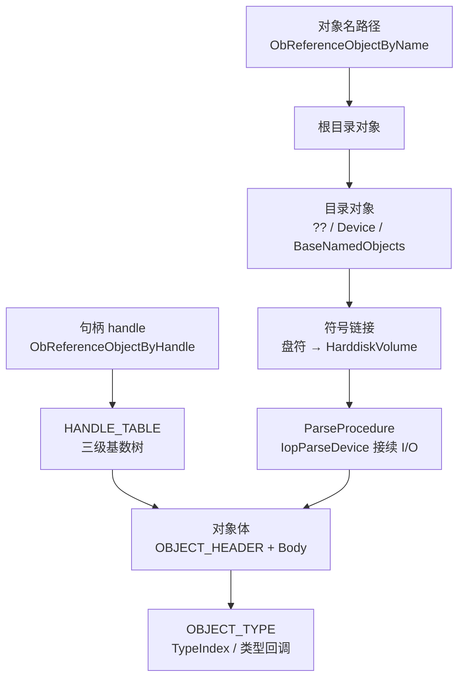

---
tags:
  - Windows
  - 内核
  - tier3
  - 对象管理器
  - 逆向
---
# 对象管理器深度：类型系统与命名空间

> [!abstract] TL;DR
> Windows 对象管理器（Ob 子系统）是内核资源管理的核心枢纽，负责统一为所有内核对象提供生命周期管理（引用计数）、命名/查找（命名空间树）、访问控制（安全描述符）和类型分发（类型对象操作回调）。理解对象管理器的三级结构（`OBJECT_HEADER`→可选头→对象体）、`OBJECT_TYPE` 的全套操作回调（`ParseProcedure`/`DeleteProcedure` 等）、三级句柄表（`HANDLE_TABLE`）、全局 PID/TID 映射表（`PspCidTable`）和 `ObRegisterCallbacks` EDR 防御机制，是分析 DKOM Rootkit 检测盲区、句柄降权攻击、EDR 对抗以及命名空间路径解析链的必要基础——这一切在第 05 篇句柄入门章节中均未触及。

## 概述与定位

### 对象管理器在内核架构中的角色

Windows 执行体（Executive）由十余个子系统构成，各自负责不同资源域：内存管理器（Mm）、进程管理器（Ps）、I/O 管理器（Io）、配置管理器（Cm）……它们各自有不同的内部数据结构，但有一个横跨所有子系统的统一抽象层，就是**对象管理器**（Object Manager，内核符号前缀 `Ob`）。

对象管理器的核心设计目标有四：

1. **统一生命周期**：任何"需要被多处引用"的内核资源都封装成对象，用引用计数（指针引用计数 + 句柄引用计数）自动管理存活期，替代手工 `free`。
2. **统一命名**：通过单根命名空间树（`\`）为对象提供层次名称，内核路径与用户态路径使用同一解析机制。
3. **统一访问控制**：每个命名对象可挂安全描述符（`SECURITY_DESCRIPTOR`），`ObCheckObjectAccess` 在打开/复制句柄时强制执行 ACL 检查。
4. **统一类型分发**：同类对象共享一个"类型对象"（`OBJECT_TYPE`），在类型对象中注册的操作回调函数（`OpenProcedure`/`CloseProcedure`/`ParseProcedure` 等）负责在对象生命周期的不同节点执行类型特定逻辑。

可以将对象管理器理解为 C++ 的虚函数表（vtable）在内核中的手工实现：`OBJECT_TYPE` 就是 vtable，`OBJECT_TYPE_INITIALIZER` 中填写的函数指针是虚函数，不同类型的对象（文件、进程、线程、事件……）在创建时各自注册自己的"虚函数"，对象管理器在恰当时机调用它们。

### 与第 05 篇的分层关系

第 05 篇"内核对象与句柄"覆盖了对象管理器的**入门层**：`OBJECT_HEADER` 存在、引用计数存在、句柄表存在。本篇覆盖**进阶层**：

- `OBJECT_HEADER` 的完整布局与可选头编码机制
- `OBJECT_TYPE` 内部的全套操作回调及逆向定位方式
- 三级句柄表（`HANDLE_TABLE`）的树状结构
- `PspCidTable`（CID = Client ID，进程/线程全局映射表）
- 命名空间树的数据结构与 `ParseProcedure` 递归解析链
- `ObRegisterCallbacks` 的防御实现细节（EDR 的核心武器）
- 句柄降权攻击原理与 ObCallback 被绕过的手法

---

## 原理与机制

### 对象头的完整布局

每个内核对象在内存中的实际分配远大于对象体本身。完整布局（从低地址到高地址）为：

```
[可选头区段（若干，逆序排列）]
[OBJECT_HEADER          ]  ← ObpGetObjectHeader(Body) 转换点
[对象体（Body）          ]  ← 用户/驱动看到的指针指向此处
```

`OBJECT_HEADER`（`nt!_OBJECT_HEADER`，约 56 字节，64 位）的主要字段：

| 字段 | 类型 | 说明 |
|---|---|---|
| `PointerCount` | `LONG64` | 指针引用计数，每次 `ObReferenceObject` +1，`ObDereferenceObject` -1，降至 0 触发 `DeleteProcedure` |
| `HandleCount` | `LONG64` | 句柄引用计数（影响 PointerCount），所有句柄关闭后触发 `CloseProcedure` |
| `NextToFree` | `PVOID` | 延迟释放链表指针 |
| `Lock` | `EX_PUSH_LOCK` | 对象头快速推进锁 |
| `TypeIndex` | `UCHAR` | 指向 `ObTypeIndexTable` 的索引（用于查找 `OBJECT_TYPE`），**已混淆**（XOR 加密） |
| `TraceFlags` | `UCHAR` | `OBJ_FLAG_KERNEL_OBJECT` 等标志 |
| `InfoMask` | `UCHAR` | 位掩码，指示哪些可选头存在（每位对应一种可选头） |
| `Flags` | `UCHAR` | `OB_FLAG_PERMANENT_OBJECT`/`OB_FLAG_DEFAULT_SECURITY_QUOTA` 等 |
| `ObjectCreateInfo` 或 `QuotaBlockCharged` | 联合 | 对象创建信息或已计费配额块 |
| `SecurityDescriptor` | `PVOID` | 指向安全描述符（低 4 位用于标志，需 AND 掩码才是真正地址） |

#### TypeIndex 混淆（Windows 10 RS1+）

在 Windows 10 RS1（1607）之前，`TypeIndex` 直接是 `ObTypeIndexTable` 的下标，逆向简单。RS1 起引入**三元素 XOR 混淆**，以缓解类型混淆漏洞利用：

```
实际类型指针 = ObTypeIndexTable[
    TypeIndex ^
    (UCHAR)(&ObjectHeader->TypeIndex) ^  // 对象头地址低字节
    ObHeaderCookie                        // 启动时随机初始化的 1 字节 Cookie
]
```

`ObHeaderCookie` 位于 `nt!ObHeaderCookie`，内核启动期间 `ObInitSystem` 调用 `KeQuerySystemInformation` 取随机数填入。逆向时须先提取 `ObHeaderCookie`（可读 `nt!ObHeaderCookie` 符号，或用 WinDbg `db nt!ObHeaderCookie l1`），再做三元素 XOR 还原真实 TypeIndex。

#### 可选头（Optional Headers）

`InfoMask` 字段的每一位对应一种可选头，这些可选头紧邻 `OBJECT_HEADER` 上方（更低地址），逆序排列（InfoMask 最低位对应最接近 `OBJECT_HEADER` 的可选头）：

| InfoMask 位 | 可选头结构 | 作用 |
|---|---|---|
| 0x01 | `OBJECT_HEADER_CREATOR_INFO` | 记录创建者 EPROCESS 指针与对象类型链表节点 |
| 0x02 | `OBJECT_HEADER_NAME_INFO` | 存储对象名称（Name/Directory 指针）——命名对象才有 |
| 0x04 | `OBJECT_HEADER_HANDLE_INFO` | 引用该对象的句柄信息（跟踪用） |
| 0x08 | `OBJECT_HEADER_QUOTA_INFO` | 配额收费信息（PagedPoolCharge/NonPagedPoolCharge） |
| 0x10 | `OBJECT_HEADER_PROCESS_INFO` | 仅属于特定进程的对象（如 Desktop 对象）时存储关联 EPROCESS |
| 0x20 | `OBJECT_HEADER_AUDIT_INFO` | 对象审计信息（Security Audit） |
| 0x40 | `OBJECT_HEADER_EXTENDED_INFO` | 扩展信息（NT 10+ 新增） |
| 0x80 | `OBJECT_HEADER_PADDING_INFO` | 池对齐填充信息 |

`ObpInfoMaskToOffset` 是一个系统内部使用的静态数组，将 `InfoMask` 值映射到从 `OBJECT_HEADER` 往上偏移多少字节可找到对应可选头。WinDbg 扩展命令 `!object` 会自动解析并显示这些可选头。

**名称信息（`OBJECT_HEADER_NAME_INFO`）** 结构：

```c
typedef struct _OBJECT_HEADER_NAME_INFO {
    POBJECT_DIRECTORY Directory;   // 指向该对象所在的目录对象（父节点）
    UNICODE_STRING    Name;        // 对象在父目录中的名称
    LONG              ReferenceCount; // 名称引用计数
    ULONG             Reserved;
} OBJECT_HEADER_NAME_INFO;
```

匿名对象（如通过 `CreateEvent(NULL, ...)` 创建的无名事件）没有此可选头，`InfoMask & 0x02 == 0`。

### OBJECT_TYPE 与类型对象

每种对象类型（如"进程"、"线程"、"文件"、"事件"）对应一个 `nt!_OBJECT_TYPE` 结构实例，这些实例本身也是对象管理器管理的对象，存储于 `ObTypeIndexTable`（一个全局指针数组，最多 256 项）。

`OBJECT_TYPE` 的核心是嵌入其中的 `OBJECT_TYPE_INITIALIZER` 结构，包含所有操作回调：

```c
typedef struct _OBJECT_TYPE_INITIALIZER {
    USHORT    Length;                     // sizeof(OBJECT_TYPE_INITIALIZER)
    UCHAR     ObjectTypeFlags;            // OB_TYPE_FLAG_xxx
    ULONG     ObjectTypeCode;
    ULONG     InvalidAttributes;          // 不允许在该类型对象上设置的属性标志
    GENERIC_MAPPING GenericMapping;       // 泛化访问权限到具体权限的映射
    ULONG     ValidAccessMask;            // 允许的访问权限掩码
    ULONG     RetainAccess;
    POOL_TYPE PoolType;                   // Paged 还是 NonPaged
    ULONG     DefaultPagedPoolCharge;     // 默认配额
    ULONG     DefaultNonPagedPoolCharge;
    // --- 操作回调 ---
    OB_DUMP_METHOD         *DumpProcedure;
    OB_OPEN_METHOD         *OpenProcedure;      // 每次打开句柄时调用
    OB_CLOSE_METHOD        *CloseProcedure;     // 每次关闭句柄时调用
    OB_DELETE_METHOD       *DeleteProcedure;    // 引用计数归零时调用
    OB_PARSE_METHOD        *ParseProcedure;     // 路径解析时调用（有子路径时）
    OB_SECURITY_METHOD     *SecurityProcedure;  // 查询/设置安全描述符时调用
    OB_QUERYNAME_METHOD    *QueryNameProcedure; // 查询对象完整路径名时调用
    OB_OKAYTOCLOSE_METHOD  *OkayToCloseProcedure; // 判断是否可以关闭句柄
    ULONG     WaitObjectFlagMask;
    USHORT    WaitObjectFlagOffset;
    USHORT    WaitObjectPointerOffset;
} OBJECT_TYPE_INITIALIZER;
```

**各回调的调用时机详解：**

- **`OpenProcedure`**：`ObOpenObjectByPointer` / `ObpCreateHandle` 每次为对象创建新句柄时调用，参数包含`OpenReason`（`ObCreateHandle`/`ObOpenHandle`/`ObDuplicateHandle`）、进程指针和访问权限。File 对象的 `OpenProcedure` 是 `IopOpenFile`，负责为每次打开创建独立的文件控制块上下文。
- **`CloseProcedure`**：每次关闭句柄时调用（注意：HandleCount 到 0 时调用一次"最后关闭"，每次关闭也会调用"非最后关闭"变体）。
- **`DeleteProcedure`**：指针引用计数降至 0（对象即将释放）时调用，负责类型特定的清理工作。`EPROCESS` 的 `DeleteProcedure` 是 `PspProcessDelete`，`ETHREAD` 的是 `PspThreadDelete`。
- **`ParseProcedure`**：路径解析时，若当前对象**本身能继续解析**（如符号链接对象、设备对象），则调用其 `ParseProcedure` 处理剩余路径。这是命名空间解析链的核心钩子点。
- **`SecurityProcedure`**：`NtQuerySecurityObject`/`NtSetSecurityObject` 时调用，允许类型覆盖默认安全操作（File 对象使用文件系统驱动提供的安全语义）。
- **`QueryNameProcedure`**：`NtQueryObject(ObjectNameInformation)` 时调用，让类型自行提供"完整路径名"而不是仅返回对象头中的简短名称。File 对象用此回调返回完整 `\Device\HarddiskVolume3\Windows\System32\ntdll.dll` 形式的路径。

### 命名空间：目录对象与符号链接



#### 命名空间树

命名空间是一棵有根树，根目录 `\`（反斜杠）对应类型为 `Directory` 的目录对象（`OBJECT_DIRECTORY`）。`ObpRootDirectoryObject` 全局变量指向根目录对象。

`OBJECT_DIRECTORY` 的核心是哈希表：

```c
typedef struct _OBJECT_DIRECTORY {
    POBJECT_DIRECTORY_ENTRY HashBuckets[37]; // 37 个桶的开放寻址哈希表
    EX_PUSH_LOCK            Lock;
    POBJECT_DIRECTORY       DeviceMap;       // 链接到 \?? 的设备映射（KPROCESS.DeviceMap）
    ULONG                   SessionId;       // 会话 ID（用于 \Sessions\N\BaseNamedObjects）
    PVOID                   NamespaceEntry;
    ULONG                   Flags;
} OBJECT_DIRECTORY;
```

每个 `OBJECT_DIRECTORY_ENTRY` 是链表节点，存储 `PVOID Object`（指向对象体）和 `POBJECT_DIRECTORY_ENTRY ChainLink`（冲突链）。

重要的命名空间路径：

| 路径 | 类型 | 用途 |
|---|---|---|
| `\` | Directory | 命名空间根 |
| `\Device` | Directory | 设备对象的家（`\Device\HarddiskVolume3`/`\Device\Tcp` 等） |
| `\Driver` | Directory | 驱动对象（`\Driver\NTFS` 等） |
| `\ObjectTypes` | Directory | 所有类型对象（`\ObjectTypes\Process` 等） |
| `\BaseNamedObjects` | Directory | 全局命名的用户态内核对象（Mutex/Event/Semaphore/Section）|
| `\Sessions\N\BaseNamedObjects` | Directory | 会话 N 的命名对象（隔离不同登录会话） |
| `\??` | Directory | **DOS 设备映射目录**（每进程视图，实际通过 `DeviceMap` 机制实现） |
| `\GLOBAL??` | Directory | 全局 DOS 设备映射（`C:` → `\Device\HarddiskVolume3` 等符号链接） |
| `\KernelObjects` | Directory | 低资源事件等内核内部对象 |
| `\Windows` | Directory | 窗口站对象 |
| `\RPC Control` | Directory | RPC 端点 |

#### \?? 与 KPROCESS DeviceMap

用户态 API 打开 `C:\Windows\notepad.exe` 时，Win32 子系统会将其转换为 NT 路径 `\??\C:\Windows\notepad.exe`，然后传入 `NtCreateFile`。`\??` 不是普通的全局目录对象，而是每个进程通过 `KPROCESS.DeviceMap`（和会话 `DeviceMap`）挂接的**私有命名空间视图**。

解析 `\??\C:` 时：
1. 对象管理器在当前进程的 `DeviceMap` 指向的目录中找 `C:`
2. 找到的是 `SymbolicLink` 类型对象，目标字符串为 `\Device\HarddiskVolume3`
3. 触发符号链接的 `ParseProcedure`（`ObpParseSymbolicLink`）展开目标
4. 用 `\Device\HarddiskVolume3\Windows\notepad.exe` 继续解析
5. 找到 `\Device\HarddiskVolume3` 设备对象，触发其 `ParseProcedure`（`IopParseDevice`）
6. `IopParseDevice` 构造 IRP_MJ_CREATE，向文件系统驱动发送 I/O 请求

这就是 `ParseProcedure` 如何将**对象管理器的命名空间查找**接续到**I/O Manager 的设备/文件系统 I/O** 的桥梁机制。

#### 符号链接对象

`SymbolicLink`（`OBJECT_SYMBOLIC_LINK`）对象存储 `LinkTarget`（`UNICODE_STRING`）作为展开目标。展开时，对象管理器用目标字符串替换已消费路径并从头重新解析（带循环检测，最多展开 32 次防止符号链接循环）。

逆向时，`!object \GLOBAL??\C:` 可以看到符号链接对象的 `LinkTarget` 值，追踪 DOS 驱动器 → NT 设备对象的映射关系。

---

## 结构/算法/伪代码详解

### 句柄表（HANDLE_TABLE）

每个进程有独立的句柄表，指针存于 `EPROCESS.ObjectTable`。内核全局还有两个特殊句柄表：`PspCidTable`（PID/TID 映射）和内核句柄表（负值句柄）。

#### 三级结构

句柄表是**三级基数树**（类似页表），以句柄值为索引：

```
句柄值（HANDLE）= 一个 ULONG_PTR，实际值 = 句柄号 * 4（低 2 位是标志）
句柄号 = 对象在句柄表中的逻辑槽位

Level 0（直接表，≤256 句柄）：
    HANDLE_TABLE.TableCode & ~3 → 直接指向 HANDLE_TABLE_ENTRY 数组
    数组 256 项，每项 = 2 * ULONG_PTR（共 32 字节/项，64 位）

Level 1（一级间接，≤256*256 = 65536 句柄）：
    HANDLE_TABLE.TableCode & ~3 → 指针数组（256 项）→ 每项指向 HANDLE_TABLE_ENTRY[256]

Level 2（二级间接，≤256^3 句柄）：
    HANDLE_TABLE.TableCode & ~3 → 指针数组 → 指针数组 → HANDLE_TABLE_ENTRY[256]
```

`TableCode` 低 2 位表示层级：`0` = 直接，`1` = 一级间接，`2` = 二级间接。

**`HANDLE_TABLE_ENTRY`（64 位，16 字节）：**

```c
typedef struct _HANDLE_TABLE_ENTRY {
    union {
        LONGLONG VolatileLowValue;      // 整体 volatile 访问
        LONGLONG ObAttributes;          // 低 3 位：属性标志
        PHANDLE_TABLE_ENTRY NextFreeEntry; // 空闲链表使用
        EXHANDLE Value;                 // 取回指针用（需 AND ~7）
    };
    union {
        ULONG GrantedAccessBits;        // 授权的访问权限位（高位）
        LONG GrantedAccess;
    };
} HANDLE_TABLE_ENTRY;
```

低位标志（隐藏在指针低位）：
- 位 0：`PROTECT_FROM_CLOSE`（置 1 则 CloseHandle 返回 ERROR_INVALID_HANDLE，防止意外关闭）
- 位 1：`HANDLE_FLAG_INHERIT`（子进程是否继承）
- 位 2：`HANDLE_FLAG_PROTECT_FROM_CLOSE`

**将 HANDLE_TABLE_ENTRY.Value 还原为对象指针：**

```
ObjectHeader = (OBJECT_HEADER *)(Value & ~7)
ObjectBody   = ObjectHeader + 1   // 跨过 OBJECT_HEADER 即对象体
```

#### PspCidTable：全局 PID/TID 映射表

`PspCidTable` 是一个**全局**的 `HANDLE_TABLE`，与进程私有句柄表结构完全相同（复用了句柄表实现），但存储的不是用户态句柄，而是**所有活跃进程（PID）和线程（TID）** 到对应 `EPROCESS`/`ETHREAD` 对象的映射。

- 进程 PID 和线程 TID 都是"CID"（Client ID），本质上是 `PspCidTable` 的槽位索引（`ClientId * 4` = 句柄值）
- `PsLookupProcessByProcessId(pid, &EProcess)` 内部通过 `ExpLookupHandleTableEntry(PspCidTable, pid)` 实现
- DKOM 攻击（摘除 `EPROCESS.ActiveProcessLinks` 双向链表中的进程节点）无法在 `PspCidTable` 中隐藏进程：枚举 `PspCidTable` 与枚举 `ActiveProcessLinks` 的结果不一致，正是检测 DKOM 的经典"交叉视图"手法
- WinDbg：`!process 0 0` 遍历链表，可与 `!for_each_process .echo @$proc` 配合使用；分析 `PspCidTable` 需要 `dt nt!_HANDLE_TABLE poi(nt!PspCidTable)` 然后手工遍历

**PspCidTable 取证价值：**

```
1. 枚举 PspCidTable 得到"真实进程列表"
2. 枚举 ActiveProcessLinks 得到"链表进程列表"
3. 差集 = DKOM 隐藏的进程
```

这是反 Rootkit 工具（如 GMER、Volatility 的 `psscan` 插件）的核心算法原理。

### ObReferenceObjectByHandle 与 ObReferenceObjectByName

这是内核中最常用的两个对象查找 API：

**`ObReferenceObjectByHandle`**：

```c
NTSTATUS ObReferenceObjectByHandle(
    HANDLE          Handle,          // 句柄值
    ACCESS_MASK     DesiredAccess,   // 调用者期望的访问权限
    POBJECT_TYPE    ObjectType,      // 期望的类型（NULL = 不检查）
    KPROCESSOR_MODE AccessMode,      // KernelMode 或 UserMode
    PVOID          *Object,          // 返回的对象体指针
    POBJECT_HANDLE_INFORMATION HandleInformation // 可选：返回授权权限
);
```

内部流程：
1. 若 `Handle` 是特殊值（`NtCurrentProcess()`/`NtCurrentThread()`），直接返回对应对象。
2. 若 `Handle < 0`（内核句柄），在内核句柄表中查找；否则在当前进程的 `EPROCESS.ObjectTable` 中查找。
3. 调用 `ExpLookupHandleTableEntry` 定位 `HANDLE_TABLE_ENTRY`。
4. 解密 XOR 后的对象头指针。
5. 若 `AccessMode = UserMode`，检查 `HANDLE_TABLE_ENTRY.GrantedAccess` 是否包含 `DesiredAccess`（用于用户态调用者的权限检查）；`KernelMode` 跳过权限检查。
6. 调用 `ObReferenceObjectWithTag` 递增指针引用计数。
7. 若提供了 `ObjectType`，验证类型匹配（类型混淆防御）。

**`ObReferenceObjectByName`**（驱动常用，用户态无直接对应）：

```c
NTSTATUS ObReferenceObjectByName(
    PUNICODE_STRING ObjectName,     // 命名空间路径，如 L"\\Device\\NamedPipe\\mypipe"
    ULONG           Attributes,     // OBJ_CASE_INSENSITIVE 等
    PACCESS_STATE   AccessState,    // 可为 NULL（KernelMode 调用时）
    ACCESS_MASK     DesiredAccess,
    POBJECT_TYPE    ObjectType,
    KPROCESSOR_MODE AccessMode,
    PVOID           ParseContext,   // 透传给 ParseProcedure 的上下文（如 IO_STACK_LOCATION）
    PVOID          *Object
);
```

内部走 `ObpLookupObjectName`，调用 `ObpParseDirectory` 沿路径逐节点解析，每遇到 `ParseProcedure != NULL` 的对象就调用它处理剩余路径。

### 引用计数语义

Windows 对象引用计数分两层：

| 计数 | 字段 | 变化时机 |
|---|---|---|
| 指针引用计数 | `OBJECT_HEADER.PointerCount` | `ObReferenceObject*` (+1) / `ObDereferenceObject*` (-1)；句柄创建时也 +1，句柄关闭时 -1 |
| 句柄引用计数 | `OBJECT_HEADER.HandleCount` | 每次创建句柄 +1，关闭句柄 -1 |

生命周期：
- `HandleCount` 降至 0 → 触发 `CloseProcedure`（最后一次）
- `PointerCount` 降至 0 → 触发 `DeleteProcedure` → 对象池内存释放

一个常见的内核驱动 BUG：在 `DeleteProcedure` 里调用 `ObDereferenceObject` 导致递归引用计数降低再次进入 `DeleteProcedure`（双重释放），或忘记 `ObDereferenceObject` 导致对象永久泄漏（计数悬挂于 1）。

WinDbg 追踪引用计数：`!obtrace <地址>` 可以显示对象引用历史（需要 `gflags +otl`）。

### ObRegisterCallbacks：句柄操作过滤

`ObRegisterCallbacks`（`ntoskrnl.exe` 导出）是 EDR 驱动的核心 API，允许内核驱动在进程/线程/桌面对象的**句柄操作**（打开、复制）时注册回调，并**修改访问权限**（降权过滤）：

```c
typedef struct _OB_CALLBACK_REGISTRATION {
    USHORT                    Version;            // OB_FLT_REGISTRATION_VERSION
    USHORT                    OperationRegistrationCount;
    UNICODE_STRING            Altitude;           // 回调挂载高度（类似 minifilter）
    PVOID                     RegistrationContext;
    OB_OPERATION_REGISTRATION *OperationRegistration;
} OB_CALLBACK_REGISTRATION;

typedef struct _OB_OPERATION_REGISTRATION {
    POBJECT_TYPE    *ObjectType;  // &PsProcessType / &PsThreadType / &ExDesktopObjectType
    OB_OPERATION    Operations;   // OB_OPERATION_HANDLE_CREATE | OB_OPERATION_HANDLE_DUPLICATE
    POB_PRE_OPERATION_CALLBACK  PreOperation;
    POB_POST_OPERATION_CALLBACK PostOperation;
} OB_OPERATION_REGISTRATION;
```

**Pre 回调** 在句柄创建/复制**之前**调用，可以修改 `OB_PRE_OPERATION_INFORMATION.Parameters->CreateHandleInformation.DesiredAccess`（降权，如去除 `PROCESS_VM_WRITE`），从而**在用户态进程拿到句柄前**已经过滤了敏感权限。这是 EDR 防止注入工具（OpenProcess → WriteProcessMemory）的机制。

**Post 回调** 在句柄创建**之后**调用，只能读取不能修改，用于审计/记录。

**驱动注册要求**：
- 驱动必须有合法签名（DSE 要求）
- `Altitude` 字符串必须注册（通过微软 WHQL 流程申请高度号）
- 回调存储在 `nt!ObpCallbackRegistrations` 全局链表

### ObRegisterCallbacks 链表结构与被绕过的手法

回调注册信息以链表形式存储。从逆向视角看，`ObpCallbackRegistrations` 是一组 `CALLBACK_ENTRY_ITEM` 结构（内部结构，非文档化）的链表，包含：类型指针、回调函数指针、注册上下文、Altitude。

**被绕过的常见手法（防御视角）**：

1. **回调摘除**：直接定位并解链 `ObpCallbackRegistrations` 链表中的目标节点，使 EDR 回调不再被调用。Rootkit/BYOVD 工具链（如 AV Killer）广泛使用此手法。
2. **回调指针清零**：将 `_OB_OPERATION_REGISTRATION.PreOperation` 字段改写为 `NULL` 或空操作函数。
3. **内核补丁（KPP/PatchGuard 范围外区域）**：`ObpCallbackRegistrations` 链表不在 PatchGuard 监控范围内，修改不会触发 BSOD（这是 BYOVD 工具链能持续使用此手法的根本原因）。
4. **利用内核句柄绕过**：`KernelMode` 调用 `ObReferenceObjectByHandle` 时 Pre 回调**不被触发**（ObCallback 只对用户态句柄操作有效）；某些驱动用内核句柄操作目标进程因此绕过 EDR 的 ObCallback 保护。

---

## 工具视角与实战

### WinDbg 命令详解

#### !object：遍历命名空间

```
kd> !object \
kd> !object \Device
kd> !object \GLOBAL??\C:         # 查看 C: 符号链接目标
kd> !object \BaseNamedObjects     # 查看全局命名对象
```

输出示例（`\GLOBAL??\C:`）：
```
Object: ffffe00123456789  Type: (ffffb001deadbeef) SymbolicLink
    ObjectHeader: ffffe001234567xx (new version)
    HandleCount: 0  PointerCount: 1
    Directory Object: ffffe001...  Name: C:
    Target String is '\Device\HarddiskVolume3'
    Drive Letter Index is 3 (C:)
```

#### !handle：进程句柄表

```
kd> !handle 0 7 <EPROCESS地址>   # 显示该进程所有句柄（7=全部类型）
kd> !handle <句柄值> f <EPROCESS地址>  # 单个句柄详情
```

#### dt 命令解析对象头

```
kd> dt nt!_OBJECT_HEADER <对象头地址>
kd> dt nt!_OBJECT_TYPE poi(nt!PsProcessType)    # 进程类型对象
kd> dt nt!_OBJECT_TYPE_INITIALIZER poi(nt!PsProcessType)+0x40
```

定位可选头（以 NAME_INFO 为例）：

```
kd> ??(nt!_OBJECT_HEADER*)(<对象体地址> - @@(sizeof(nt!_OBJECT_HEADER)))
kd> dt nt!_OBJECT_HEADER_NAME_INFO (<对象头地址> - <偏移>)
```

`<偏移>` 从 `ObpInfoMaskToOffset` 数组和 `InfoMask` 计算得出。

#### !obtrace：引用计数追踪

开启对象追踪（需重启后生效）：

```
# 命令行（管理员）
gflags.exe /kernel +otl

# 或 WinDbg
kd> !gflag +otl
```

然后使用：

```
kd> !obtrace <对象头地址>
```

输出对象的引用历史（调用栈 + 增量），定位引用泄漏。

#### 遍历 PspCidTable

```
kd> dt nt!_HANDLE_TABLE poi(nt!PspCidTable)
kd> !for_each_process .echo @$proc      # 链表枚举
```

手工遍历 PspCidTable 需要解析三级基数树结构，通常借助 WinDbg 脚本或 Volatility `psscan` 插件（扫描内存池标签 `Proc` 找 EPROCESS 对象，独立于链表和 CID 表）。

#### 逆向 ParseProcedure

定位 `OBJECT_TYPE.TypeInfo.ParseProcedure`：

```
kd> dt nt!_OBJECT_TYPE poi(nt!IoFileObjectType)    # 文件对象类型
```

`ParseProcedure` 对文件对象是 `nt!IopParseDevice`，可以在 IDA/Ghidra 中反编译该函数来分析文件打开路径从对象管理器如何转入 I/O 管理器（`IopParseDevice` 调用 `IoCallDriver` 向文件系统驱动发送 IRP_MJ_CREATE）。

### 编程视角：驱动如何正确使用对象 API

```c
// 通过句柄获取内核对象（KernelMode 不检查权限）
PEPROCESS targetProcess = NULL;
HANDLE    hProcess = (HANDLE)targetPid;  // 这里是 PspCidTable 语义，不是进程句柄

// 正确方式：用 PsLookupProcessByProcessId（底层使用 PspCidTable）
NTSTATUS status = PsLookupProcessByProcessId(
    (HANDLE)pid,
    &targetProcess
);
// targetProcess 现在已 ObReferenceObject，引用计数 +1
// 使用完毕必须 ObDereferenceObject
if (NT_SUCCESS(status)) {
    // 使用 targetProcess ...
    ObDereferenceObject(targetProcess);  // 配对释放！
}

// 通过名称获取设备对象（驱动常用）
UNICODE_STRING devName = RTL_CONSTANT_STRING(L"\\Device\\TargetDevice");
PFILE_OBJECT   fileObj  = NULL;
PDEVICE_OBJECT devObj   = NULL;
status = IoGetDeviceObjectPointer(&devName,
                                   FILE_READ_DATA,
                                   &fileObj,
                                   &devObj);
if (NT_SUCCESS(status)) {
    // 使用 devObj 发送 IRP ...
    ObDereferenceObject(fileObj);  // 必须释放 fileObj，devObj 随之释放
}
```

---

## 安全性与正确使用

### 句柄降权攻击

**攻击原理**：进程 A（攻击者）调用 `OpenProcess(PROCESS_ALL_ACCESS, FALSE, target_pid)` 请求全权限句柄，EDR 的 `ObRegisterCallbacks` Pre 回调将 `DesiredAccess` 过滤为仅保留 `PROCESS_QUERY_LIMITED_INFORMATION`（去除 `PROCESS_VM_READ`/`PROCESS_VM_WRITE`/`PROCESS_SUSPEND_RESUME` 等敏感权限）。进程 A 拿到的句柄虽然打开成功，但权限已经被阉割，无法注入/读取目标进程内存。

**攻击者绕过思路**：
1. **内核句柄通道**：若攻击者能加载驱动（或利用 BYOVD 获得内核代码执行），可以直接在内核层用 `KernelMode` 调用 `ObReferenceObjectByHandle`/`KeStackAttachProcess` + `MmCopyVirtualMemory`，完全绕过 ObCallback（因为 ObCallback 只监控用户态句柄操作）。
2. **DuplicateHandle 从高权限进程继承**：若系统中已有一个持有 `PROCESS_ALL_ACCESS` 句柄的进程（如 LSASS、System），攻击者通过 `DuplicateHandle` 复制其句柄——但此操作同样触发 `OB_OPERATION_HANDLE_DUPLICATE` Pre 回调，EDR 可以拦截。
3. **利用内核驱动的已有句柄**：某些内核驱动以内核句柄持有进程的高权限引用，通过 IOCTL 与这些驱动交互可以间接操作目标进程（利用驱动自身的内核权限上下文），EDR 的 ObCallback 无法拦截内核句柄操作。

**防御建议**：
- EDR 回调实现中，Pre 回调不仅要过滤 `CreateHandle`，还必须注册 `HandleDuplicate` 回调（两种操作都可以获得句柄）。
- 配合 `PPL`（Protected Process Light）将 EDR 本身的 LSASS 等进程提升到受保护级别，使 `OpenProcess` 的访问直接被系统拒绝，而不依赖 ObCallback 软过滤。
- 监控 `ObpCallbackRegistrations` 链表的完整性（PatchGuard 不保护，需 EDR 自身实现哈希校验或 Watchdog 线程）。

### ObRegisterCallbacks 的防御完整性

由于 `ObpCallbackRegistrations` 链表不受 PatchGuard 保护，BYOVD 工具（如 BlackByte 的 `RentDrv2`、Spyboy 的 `Terminator` 等反 EDR 工具）可以通过以下步骤摘除 EDR 回调：

1. 利用漏洞驱动获得内核任意写原语
2. 扫描内核内存定位 `ObpCallbackRegistrations` 链表（特征扫描或符号偏移计算）
3. 遍历链表，找到目标 EDR 模块的注册节点
4. 解链该节点（修改前后节点的 `Flink`/`Blink` 指针）或将回调函数指针清零
5. EDR 的句柄过滤回调失效，可以自由地 `OpenProcess(PROCESS_ALL_ACCESS)` 终止 EDR 进程

**蓝队检测手段**：
- 监控内核驱动加载事件（ETW `Microsoft-Windows-Kernel-PnP`），建立已加载驱动白名单
- 利用 HVCI（若已启用）防止无签名代码写入内核
- 定期从用户态调用 `EnumDeviceDrivers` 与 ETW 加载事件交叉比对，检测隐藏驱动
- EDR 驱动内部实现回调注册完整性监控（对 `ObpCallbackRegistrations` 链表计算校验和，Watchdog 线程定期比对）

### 类型混淆缓解（TypeIndex XOR）

Windows 10 RS1 引入的 TypeIndex 三元素 XOR 混淆，主要防御通过内核对象类型混淆实现的提权路径（如将 EPROCESS 对象的 TypeIndex 篡改为另一个类型，触发错误的 `DeleteProcedure`，从而绑架内核代码执行）。

即便有 XOR 混淆，攻击者若获得内核任意读，仍可以：
- 读取 `ObHeaderCookie`（1 字节）
- 对特定地址 XOR 三元素，还原真实 TypeIndex

因此 TypeIndex XOR 提高了利用难度但不是完全防御，需要配合 HVCI/CFG 等综合防御。

---

## 小结

对象管理器是 Windows 内核中最核心的横断面基础设施，三个维度理解它：

**结构维度**：`OBJECT_HEADER` + 可选头（InfoMask 编码）+ 对象体三段式布局；`OBJECT_TYPE` 是类型的 vtable，`TypeIndex` XOR 混淆防类型混淆攻击；`HANDLE_TABLE` 三级基数树高效存储任意数量句柄；`PspCidTable` 是全局 PID/TID 权威映射，是 DKOM 检测的反制基础。

**命名/解析维度**：以 `\` 为根的命名空间树（`OBJECT_DIRECTORY` 哈希表）通过 `ParseProcedure` 将路径解析链传递给各子系统（文件系统、设备、符号链接展开），`\??` 通过 `DeviceMap` 为每进程提供私有 DOS 驱动器视图。

**安全/防御维度**：`ObRegisterCallbacks` 是 EDR 防句柄滥用的核心机制（Pre 回调过滤权限），但链表本身不受 PatchGuard 保护，是 BYOVD 攻击链"摘 EDR 回调"步骤的靶点；`PPL` + `HVCI` 是更深层的防御纵深。

掌握 `!object`/`!handle`/`!obtrace`/`dt nt!_OBJECT_TYPE` 等 WinDbg 命令，可以从调试器视角完整重建任何内核对象的类型、名称、引用计数和安全属性，是驱动逆向、Rootkit 分析和 EDR 研发的基础功夫。

---

## 相关阅读

- **系列内章节**：
  - [[05.内核对象与句柄]] — 入门基础（引用计数/句柄表概念层）
  - [[09.内核回调机制]] — `PsSetCreateProcessNotifyRoutine`/`PsSetLoadImageNotifyRoutine` 等进程回调
  - [[11.Rootkit原理与检测]] — DKOM 链表摘除与 PspCidTable 交叉视图检测原理
  - [[12.PatchGuard与DSE与HVCI]] — PatchGuard 不保护 ObpCallbackRegistrations 的意义
  - [[20.Windows安全机制与对抗全景]] — PPL/HVCI/Credential Guard 防御层叠

- **微软官方文档与资源**：
  - Windows Internals 7th Edition, Part 1, Chapter 8（Object Manager）— Alex Ionescu / Mark Russinovich
  - MSDN：`ObRegisterCallbacks` / `OB_CALLBACK_REGISTRATION` 文档
  - WDK 示例：`ObCallback` 示例（Process/Thread Handle Callbacks）

- **研究资料**：
  - *"Handle Flooding and ObRegisterCallbacks Bypass"* — 多份安全会议演讲（Black Hat）
  - Volatility Framework `psscan`/`handles` 插件源码（理解 PspCidTable 扫描算法）
  - *"Windows Object Internals"* — Yarden Shafir & Alex Ionescu (OSR 演讲材料)

---

[[00.Windows内核与驱动逆向总览|⬆ 系列总览]] | [[21.APC机制深度|← 上一章]] | [[23.Job对象与Silo容器隔离|→ 下一章]]
