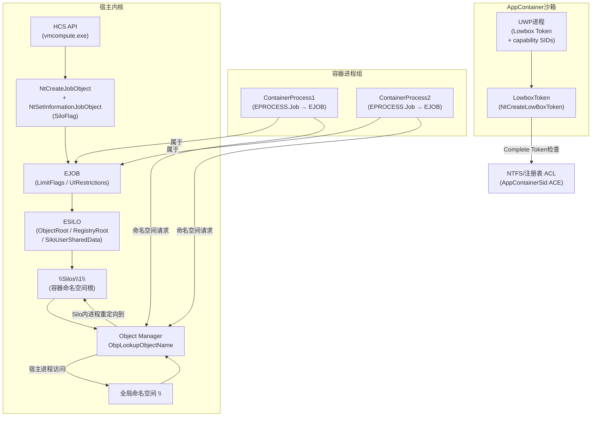

---
tags:
  - Windows
  - 内核
  - tier3
  - 容器
  - 逆向
---
# Job 对象、Silo 与 Windows 容器隔离

> [!abstract] TL;DR
> Job 对象（`EJOB`）是 Windows 内核将若干进程归并为一个"计费/限制域"的核心原语；Server Silo 在 Job 之上叠加命名空间隔离层，构成 Windows Server 容器的基础；AppContainer 则以降权 Token + capability SID 为手段实现 UWP 进程沙箱。三者共同覆盖从"资源配额"到"完全命名空间隔离"的全谱段，是理解 WSC/Hyper-V 容器架构、容器逃逸攻击面以及反作弊/沙箱机制的必备内核知识。

---

## 概述与定位

### 从进程到容器的演化路径

Windows 原生的隔离单元是**进程**——每个进程拥有独立的地址空间、句柄表和安全上下文。但这个粒度对于资源管理（例如限制一组服务进程的 CPU 时间）和隔离（例如运行多租户 Windows 容器）都远远不够。为此，Windows NT 设计团队在 NT 4 时代引入了 **Job 对象**，随后在 Windows 10/Server 2016 时代将其扩展为支持 **Server Silo** 的容器基础设施。

| 机制 | 内核结构 | 主要能力 | 典型场景 |
|---|---|---|---|
| Job 对象 | `EJOB` | 进程分组、资源配额、UI 限制 | SQL Server 内存上限、反作弊进程组 |
| Server Silo | `EJOB.SiloState`（`ESILO`） | 命名空间隔离、独立注册表 hive | Windows Server Container（WSC） |
| AppContainer | Lowbox Token + capability SID | 降权沙箱、网络/文件访问限制 | UWP 应用、Edge 渲染进程 |
| Hyper-V 容器 | HCS API + `vmcompute` | 独立内核（Type-1 Hypervisor 下） | Azure Kubernetes ACI、WSL 2 |

这四者并非互斥，而是**分层叠加**：WSC（Windows Server Container，进程隔离容器）的底层就是一个 Server Silo Job；Hyper-V 容器在此之上再套一个独立的虚拟机内核。

### 为什么逆向工程师需要理解 Job/Silo

1. **容器逃逸分析**：Silo 命名空间隔离的所有边界都在内核数据结构中体现，逆向 `EJOB`/`ESILO` 是理解逃逸路径的前提。
2. **反作弊/沙箱检测**：反作弊驱动常用 Job 限制游戏客户端不能创建子进程（`ActiveProcessLimit`）；理解 Job 标志位有助于分析检测逻辑。
3. **EDR/XDR 检测盲点**：部分 EDR 工具在枚举进程时不遍历 Silo 命名空间，导致容器内进程对其不可见。
4. **权限提升分析**：从 AppContainer 沙箱到完整 Token 的路径依赖对 `lowbox` Token 的理解。

---

## 原理与机制

### 2.1 Job 对象基础

Job 对象在内核中对应 `EJOB` 结构（`nt!_EJOB`），位于非分页池。通过 `NtCreateJobObject` 创建，`NtAssignProcessToJobObject` 将进程加入 Job。

**进程与 Job 的关联字段**：
- `EPROCESS.Job`：指向进程所属 `EJOB` 的指针（若不在 Job 中则为 NULL）。
- `EPROCESS.JobLinks`：双向链表节点，将所有属于同一 Job 的进程串起来，链头在 `EJOB.ProcessListHead`。
- `EPROCESS.JobNotReallyActive`：当进程处于"terminated but still counted"状态时置 1。

一旦进程进入 Job，**默认情况下其所有子进程也自动继承该 Job**，这一继承关系通过 `PspCreateProcess` 中的 `JobInheritHandle` 逻辑实现。

**Nested Job（嵌套 Job）**：自 Windows 8 起支持。`EJOB.ParentJob` 指向父 Job，形成树形层次。资源限制取父子链中最严格的值（AND 语义）。嵌套深度无系统硬性上限，但实践中容器场景通常为 2–3 层。

```
NtCreateJobObject()  ──► EJOB 分配（NonPagedPool）
                          ├─ ProcessListHead (EPROCESS 链)
                          ├─ JobFlags (UI/CPU/内存限制位)
                          ├─ CompletionPort → IOCP 通知
                          ├─ BasicLimit / ExtendedLimit
                          └─ SiloState ─────────────────► ESILO（若为 Silo Job）
```

### 2.2 Job 限制类型

通过 `NtSetInformationJobObject`（`JobObjectBasicLimitInformation` / `JobObjectExtendedLimitInformation` 等信息类）设置，内核将参数写入 `EJOB` 对应字段：

| 信息类 | 关键字段 | 作用 |
|---|---|---|
| `BasicLimitInformation` | `ActiveProcessLimit` | 组内最大同时运行进程数 |
| `BasicLimitInformation` | `PerJobUserTimeLimit` | 整个 Job 累计 CPU 用户时间上限（100ns 单位） |
| `ExtendedLimitInformation` | `ProcessMemoryLimit` | 单进程最大提交内存 |
| `ExtendedLimitInformation` | `JobMemoryLimit` | 整个 Job 最大提交内存（计费机制）|
| `BasicUIRestrictions` | `UIRestrictionsClass` | 禁止 Desktop/窗口操作：`JOB_OBJECT_UILIMIT_*` 位掩码 |
| `JobObjectNetRateControlInformation` | `MaxBandwidth` | 网络带宽上限（RS5+ ） |

`JOB_OBJECT_UILIMIT_HANDLES`（禁止访问来自 Job 外部的 User 句柄）、`JOB_OBJECT_UILIMIT_SYSTEMPARAMETERS`（禁止调用 `SystemParametersInfo`）是反作弊最常用的两个 UI 限制位。

**CPU 速率控制**（`JobObjectCpuRateControlInformation`）：基于调度器的 CpuRate 字段（千分之一为单位），底层通过 `KeThrottleThreadForJob` 在每个调度周期末强制线程挂起实现。

### 2.3 Job 完成端口通知

```c
JOBOBJECT_ASSOCIATE_COMPLETION_PORT info;
info.CompletionKey  = (PVOID)MY_KEY;
info.CompletionPort = hIocp;
NtSetInformationJobObject(hJob, JobObjectAssociateCompletionPortInformation, &info, sizeof(info));
```

内核将 `EJOB.CompletionPort` 指向关联的 IOCP。当 Job 内发生特定事件时（进程创建/退出、活跃进程数归零、CPU/内存超配额），`PsJobNotify` 函数向 IOCP 投递完成包：

| `dwCompletionKey`（MessageId） | 含义 |
|---|---|
| `JOB_OBJECT_MSG_NEW_PROCESS` (1) | Job 内新进程创建 |
| `JOB_OBJECT_MSG_EXIT_PROCESS` (2) | Job 内进程正常退出 |
| `JOB_OBJECT_MSG_ABNORMAL_EXIT_PROCESS` (3) | Job 内进程异常退出 |
| `JOB_OBJECT_MSG_ACTIVE_PROCESS_ZERO` (4) | Job 内所有进程退出 |
| `JOB_OBJECT_MSG_PROCESS_MEMORY_LIMIT` (6) | 进程内存超配额 |
| `JOB_OBJECT_MSG_JOB_MEMORY_LIMIT` (7) | Job 整体内存超配额 |
| `JOB_OBJECT_MSG_NOTIFICATION_LIMIT` (10) | 通知型配额触发 |

### 2.4 Server Silo：从 Job 到容器

**Silo** 是 Windows 10 RS1（1607）/Server 2016 引入的概念，分为两种类型：

- **Server Silo**（`SILO_OBJECT_TYPE_SERVER`）：为 Windows Server Container 提供完整的命名空间隔离。
- **Application Silo**（`SILO_OBJECT_TYPE_APPLICATION`，RS4+）：轻量级沙箱，主要用于 MSIX 应用容器，不提供完整命名空间隔离。

内核用 `ESILO` 结构（嵌入在特殊 Job 的 `SiloState` 字段，或通过独立分配）来跟踪 Silo 状态。关键字段：

```
ESILO
├─ SiloId                    // 唯一 Silo ID（ULONG64），等于关联 Job 的 KernelJobId
├─ ObjectRoot                // 指向 \Silos\<SiloId>\ 命名空间根的 OBJECT_DIRECTORY
├─ SiloRootDirName           // 命名字符串 L"\Silos\0000000000000001" 之类
├─ SiloedDriverState         // per-Silo 驱动状态（供 minifilter 等使用）
├─ SystemRoot                // Silo 内 \SystemRoot 符号链接目标（容器系统盘）
├─ UserSharedData            // 指向 Silo 独有 SILO_USER_SHARED_DATA 副本
├─ RegistryRoot              // Silo 内 HKLM 挂载点（容器注册表 hive 路径）
└─ NumberOfProcesses         // Silo 内活跃进程计数
```

**命名空间隔离原理**：对象管理器（Object Manager）在解析路径时检查当前线程/进程所属的 Silo。`ObpLookupObjectName` 中，若进程属于 Server Silo，则将路径前缀 `\BaseNamedObjects` 重定向为 `\Silos\<id>\BaseNamedObjects`，将 `\Device` 中的设备对象重定向到 Silo 私有视图。这一重定向在内核深处通过 `PsGetCurrentServerSilo()`/`PsAttachSiloToCurrentThread()` 获取上下文，再由 `ObpInsertDirectoryEntry` 选择正确的目录节点实现。

**Silo 用户共享数据**：每个 Server Silo 拥有独立的 `SILO_USER_SHARED_DATA`（通过 `\Silos\<id>\Shared` 映射到容器进程的用户态地址空间），包含容器内的 `SystemRoot`、`NtSystemRoot`、时区信息等，使容器进程"看到"不同于宿主的系统盘路径。

### 2.5 命名空间层次与路径重定向

```
对象管理器命名空间（宿主视图）
\
├─ BaseNamedObjects\          ← 宿主进程看到的全局共享命名对象
├─ Device\
├─ Registry\
│   └─ Machine\
├─ Silos\
│   └─ 1\                    ← Server Silo ID=1
│       ├─ BaseNamedObjects\  ← 容器内进程看到的"全局"共享对象
│       ├─ GLOBAL??\          ← 容器内 \GLOBAL?? 设备符号链接替身
│       ├─ Device\            ← 容器内设备命名空间（经过过滤/重映射）
│       ├─ Registry\          ← 容器内注册表（挂载容器 hive）
│       └─ Shared             ← SILO_USER_SHARED_DATA 映射
└─ Sessions\
    └─ 0\BaseNamedObjects\    ← 会话 0 命名对象
```

当容器内进程调用 `CreateMutex(NULL, FALSE, L"Global\\MyMutex")` 时，Object Manager 解析 `\BaseNamedObjects\MyMutex`——但因为当前线程属于 Silo 1，实际插入的目录节点是 `\Silos\1\BaseNamedObjects\MyMutex`，与宿主的同名互斥体**完全隔离**。

### 2.6 宿主与容器的交叉可见性

宿主进程（无 Silo）始终可以通过完整路径 `\Silos\1\BaseNamedObjects\MyMutex` 直接访问容器对象——这是容器管理工具（如 HCS/`vmcompute`）与容器通信的基础，也是容器逃逸分析的关键点。

### 2.7 AppContainer（UWP 沙箱）

AppContainer **不是** Job/Silo 机制，而是通过**特殊 Token** 实现：

- **Lowbox Token**：通过 `NtCreateLowBoxToken` 创建，与普通受限 Token 的区别在于额外附加了 `AppContainerSid`（S-1-15-2-\<profile\>）和若干 **capability SID**（S-1-15-3-\<cap\>）。
- **访问控制**：NTFS/注册表 ACL 包含对 `AppContainerSid` 的显式 ACE；系统对象（网络套接字、设备等）同样检查 capability SID。
- **完整性级别**：AppContainer 进程以 Low 完整性运行，低于普通用户进程的 Medium 完整性，从而阻止写入非 Low 完整性目录和修改系统设置。
- **Win32k 调用过滤**：AppContainer 进程默认屏蔽大量 Win32k 系统调用（通过 `PROCESS_MITIGATION_SYSTEM_CALL_DISABLE_POLICY`），防止攻击 Win32k 内核漏洞。

**capability SID 示例**（S-1-15-3-X）：

| Capability 名称 | SID RID | 含义 |
|---|---|---|
| `internetClient` | 1 | 允许出站互联网连接 |
| `internetClientServer` | 2 | 允许入/出站互联网 |
| `privateNetworkClientServer` | 3 | 允许局域网访问 |
| `picturesLibrary` | 5 | 读取图片库 |
| `microphone` | 25 | 麦克风访问 |

---

## 结构/算法/伪代码详解

### 3.1 EJOB 关键字段布局（Windows 11 22H2 近似）

```c
// nt!_EJOB（简化，字段偏移因版本而异，实际用 dt nt!_EJOB 确认）
typedef struct _EJOB {
    KEVENT         Event;               // +0x000 Job 结束事件（WaitForSingleObject 等待）
    LIST_ENTRY     JobLinks;            // +0x018 全局 Job 链表节点（PsJobList）
    LIST_ENTRY     ProcessListHead;     // +0x028 属于本 Job 的 EPROCESS 链
    ERESOURCE      JobLock;             // +0x038 读写锁（保护进程链表等）
    LARGE_INTEGER  TotalUserTime;       // +0x070 所有子进程累计用户时间
    LARGE_INTEGER  TotalKernelTime;     // +0x078 所有子进程累计内核时间
    LARGE_INTEGER  ThisPeriodTotalUserTime;
    LARGE_INTEGER  ThisPeriodTotalKernelTime;
    ULONG          TotalPageFaultCount;
    ULONG          TotalProcesses;      // 曾加入过 Job 的进程总数
    ULONG          ActiveProcesses;     // 当前活跃进程数
    ULONG          TotalTerminatedProcesses;
    LARGE_INTEGER  PerProcessUserTimeLimit;
    LARGE_INTEGER  PerJobUserTimeLimit;
    ULONG          LimitFlags;          // JOB_OBJECT_LIMIT_* 位掩码
    ULONG_PTR      MinimumWorkingSetSize;
    ULONG_PTR      MaximumWorkingSetSize;
    ULONG          ActiveProcessLimit;
    ULONGLONG      Affinity;
    ULONG          PriorityClass;
    ULONG          UIRestrictionsClass; // JOB_OBJECT_UILIMIT_* 位掩码
    ULONG          SecurityLimitFlags;
    PVOID          Token;               // 安全限制 Token（若设置了 TokenFilter）
    // ... 内存限制、I/O 计数、完成端口 ...
    PVOID          CompletionPort;      // 关联 IOCP
    PVOID          CompletionKey;
    ULONG          SessionId;
    ULONGLONG      ReadOperationCount;
    ULONGLONG      WriteOperationCount;
    ULONGLONG      OtherOperationCount;
    ULONGLONG      ReadTransferCount;
    ULONGLONG      WriteTransferCount;
    ULONGLONG      OtherTransferCount;
    IO_COUNTERS    IoInfo;
    SIZE_T         ProcessMemoryLimit;
    SIZE_T         JobMemoryLimit;
    SIZE_T         PeakProcessMemoryUsed;
    SIZE_T         PeakJobMemoryUsed;
    // Windows 8+ 嵌套 Job
    PVOID          ParentJob;           // 父 EJOB 指针
    LIST_ENTRY     ChildJobListHead;    // 子 Job 链表头
    LIST_ENTRY     ChildJobLinks;       // 本 Job 在父 Job 子链中的节点
    // Windows 10 RS1+ Silo 扩展
    PVOID          SiloState;           // 指向 ESILO（若为 Silo Job 则非 NULL）
    ULONGLONG      JobId;               // 内核分配的唯一 Job ID
} EJOB, *PEJOB;
```

### 3.2 进程加入 Job 的内核路径（伪代码）

```c
// NtAssignProcessToJobObject 简化调用链
NTSTATUS
NtAssignProcessToJobObject(HANDLE JobHandle, HANDLE ProcessHandle)
{
    PEJOB    pJob;
    PEPROCESS pProcess;

    // 1. 引用对象
    ObReferenceObjectByHandle(JobHandle, JOB_OBJECT_ASSIGN_PROCESS, &pJob, ...);
    ObReferenceObjectByHandle(ProcessHandle, PROCESS_SET_QUOTA, &pProcess, ...);

    // 2. 检查进程不在任何 Job 中（Windows 7-），或允许嵌套（Windows 8+）
    if (pProcess->Job != NULL && !IsNestedJobAllowed(pJob, pProcess->Job))
        return STATUS_ACCESS_DENIED;

    // 3. 加锁写 Job
    KeEnterCriticalRegion();
    ExAcquireResourceExclusiveLite(&pJob->JobLock, TRUE);

    // 4. 检查 ActiveProcessLimit
    if (pJob->ActiveProcessLimit > 0 &&
        pJob->ActiveProcesses >= pJob->ActiveProcessLimit) {
        ExReleaseResourceLite(&pJob->JobLock);
        return STATUS_QUOTA_EXCEEDED; // 触发 JOB_OBJECT_MSG_ACTIVE_PROCESS_LIMIT 通知
    }

    // 5. 将 EPROCESS 挂入 Job 链表
    InsertTailList(&pJob->ProcessListHead, &pProcess->JobLinks);
    pProcess->Job = pJob;
    pJob->TotalProcesses++;
    pJob->ActiveProcesses++;

    // 6. 若为 Silo Job，将进程关联 Silo
    if (pJob->SiloState != NULL)
        PsAssignSiloToProcess(pJob->SiloState, pProcess);

    ExReleaseResourceLite(&pJob->JobLock);
    KeLeaveCriticalRegion();

    // 7. 通知完成端口（NEW_PROCESS 事件）
    PsJobNotify(pJob, JOB_OBJECT_MSG_NEW_PROCESS, pProcess->UniqueProcessId);

    return STATUS_SUCCESS;
}
```

### 3.3 Silo 命名空间重定向算法

```c
// ObpLookupObjectName 简化（命名空间重定向片段）
NTSTATUS
ObpLookupObjectName(
    PUNICODE_STRING ObjectName,
    POBJECT_ATTRIBUTES Attributes,
    KPROCESSOR_MODE AccessMode,
    POBJECT_TYPE ObjectType,
    ...)
{
    // 获取当前进程/线程关联的 Server Silo
    PESILO pSilo = PsGetCurrentServerSilo();

    // 确定根目录
    POBJECT_DIRECTORY RootDir;
    if (pSilo != NULL && IsRootRelativeName(ObjectName)) {
        // 将 \BaseNamedObjects 重定向到 \Silos\<id>\BaseNamedObjects
        RootDir = pSilo->ObjectRoot;  // \Silos\<id>\ 目录
    } else {
        RootDir = ObpRootDirectoryObject; // 全局 \ 目录
    }

    // 递归解析路径组件
    PVOID FoundObject = ObpLookupDirectoryEntry(RootDir, ObjectName, ...);

    // 若未找到且 Silo 有 fallback 策略，可回退到全局命名空间
    // （Server Silo 通常不回退；Application Silo 部分符号链接指向宿主）
    if (FoundObject == NULL && pSilo != NULL && pSilo->FallbackEnabled)
        FoundObject = ObpLookupDirectoryEntry(ObpRootDirectoryObject, ObjectName, ...);

    return FoundObject ? STATUS_SUCCESS : STATUS_OBJECT_NAME_NOT_FOUND;
}
```

### 3.4 Mermaid 架构图



### 3.5 AppContainer Token 结构（伪代码）

```c
// NtCreateLowBoxToken 简化参数
NTSTATUS
NtCreateLowBoxToken(
    OUT PHANDLE    TokenHandle,
    IN  HANDLE     ExistingTokenHandle,   // 基础 Token（调用者的 Token）
    IN  ACCESS_MASK DesiredAccess,
    IN  POBJECT_ATTRIBUTES ObjectAttributes,
    IN  PSID       PackageSid,            // AppContainer SID（S-1-15-2-...）
    IN  ULONG      CapabilityCount,
    IN  PSID_AND_ATTRIBUTES Capabilities, // capability SID 数组
    IN  ULONG      HandleCount,
    IN  PHANDLE    Handles                // 需继承进容器的句柄
)
{
    // 1. 克隆现有 Token（SepDuplicateToken 内部路径）
    TOKEN *NewToken = SepDuplicateToken(ExistingToken, ...);

    // 2. 设置完整性级别为 Low（S-1-16-4096）
    SepSetTokenIntegrityLevel(NewToken, SE_SIGNING_LEVEL_UNSIGNED, 4096);

    // 3. 附加 AppContainerSid
    NewToken->AppContainerSid = PackageSid;
    NewToken->Flags |= TOKEN_IS_APP_CONTAINER; // 内核 TOKEN.TokenFlags 位

    // 4. 附加 capability SID 列表
    NewToken->Capabilities = CopyCapabilities(Capabilities, CapabilityCount);

    // 5. 创建 Lowbox 数字（每个 AppContainer 在全局 Lowbox 表中有编号）
    NewToken->LowboxNumber = ObGetLowboxNumber(PackageSid);

    return STATUS_SUCCESS;
}
```

### 3.6 CPU 配额执行（调度器侧）

当 Job 设置了 `JOB_OBJECT_LIMIT_JOB_TIME`（`PerJobUserTimeLimit`），调度器在每次时钟中断（`KeUpdateRunTime`）更新 `EJOB.TotalUserTime`。一旦超限：

```c
// KiUpdateJobTime（时钟中断 DPC 路径，简化）
void KiUpdateJobTime(PETHREAD Thread) {
    PEJOB Job = Thread->Tcb.Process->Job; // EPROCESS.Job
    if (Job == NULL) return;

    Job->TotalUserTime.QuadPart += UserTimeDelta;

    if (Job->LimitFlags & JOB_OBJECT_LIMIT_JOB_TIME) {
        if (Job->TotalUserTime.QuadPart >= Job->PerJobUserTimeLimit.QuadPart) {
            // 超配额：通知端口 + 可选终止 Job 内所有进程
            PsJobNotify(Job, JOB_OBJECT_MSG_END_OF_JOB_TIME, NULL);
            if (Job->LimitFlags & JOB_OBJECT_LIMIT_DIE_ON_UNHANDLED_EXCEPTION)
                PsTerminateJobProcesses(Job, STATUS_ACCESS_VIOLATION);
        }
    }
}
```

---

## 工具视角与实战

### 4.1 WinDbg 调试 Job 对象

**枚举当前系统所有 Job：**

```
kd> !for_each_module s -[1]b @#Base @#End "ntoskrnl"
kd> dt nt!_EJOB
```

WinDbg 内置 `!job` 扩展命令直接打印 Job 信息：

```
kd> !job <EJOB地址>
Job at 0xffff998012345000
  TotalPageFaultCount: 0x0
  TotalProcesses: 0x3
  ActiveProcesses: 0x2
  TotalTerminatedProcesses: 0x1
  LimitFlags: 0x1000 (JOB_OBJECT_LIMIT_KILL_ON_JOB_CLOSE)
  ...
```

**定位进程所属 Job：**

```
kd> dt nt!_EPROCESS ffff998011223344 Job
   +0x5b8 Job : 0xffff998012345000 _EJOB
```

**遍历 Job 内所有进程：**

```
kd> !for_each_module ... （或手动遍历 ProcessListHead 链表）
kd> dt nt!_EPROCESS @$extin JobLinks     ← 展开链表节点
```

**查看嵌套 Job 层次（Windows 8+）：**

```
kd> dt nt!_EJOB 0xffff998012345000 ParentJob ChildJobListHead
   +0x... ParentJob : 0xffff998098765000 _EJOB
   +0x... ChildJobListHead : _LIST_ENTRY [ 0x... - 0x... ]
```

### 4.2 查看 Silo 信息

```
kd> dt nt!_EJOB 0xffff998012345000 SiloState
   +0x... SiloState : 0xffff998099900000 _ESILO

kd> dt nt!_ESILO 0xffff998099900000
   +0x000 SiloId              : 0n1
   +0x008 ObjectRoot          : 0xffff998055500000 _OBJECT_DIRECTORY
   +0x010 SiloRootDirName     : "\Silos\1"
   +0x020 NumberOfProcesses   : 0n2
   +0x028 RegistryRoot        : "\Registry\A\{container-hive-guid}"
   +0x030 UserSharedData      : 0xffff998011100000 _SILO_USER_SHARED_DATA
```

**列出 Silo 命名空间下的对象目录：**

```
kd> !object \Silos\1
Object: ffff998055500000  Type: (ffff998000012345) Directory
    ObjectHeader: ffff998055500000 (new version)
    HandleCount: 1  PointerCount: 10
    Directory Object: ffff998000023456  Name: 1

    Hash Address          Type          Name
    ---- -------          ----          ----
     00  ffff998055aa0000 Directory     BaseNamedObjects
     01  ffff998055bb0000 Directory     GLOBAL??
     02  ffff998055cc0000 Directory     Device
     ...
```

### 4.3 用户态枚举与操作（PowerShell/C++）

```powershell
# 查询当前进程的 Job 信息（若在 Job 中）
$handle = [System.Runtime.InteropServices.Marshal]::GetHINSTANCE([Type])
# 用 P/Invoke 调用 IsProcessInJob() / QueryInformationJobObject()
```

```cpp
// 创建带 CPU 配额的 Job 并将进程加入
HANDLE hJob = CreateJobObject(NULL, L"MyJobObject");

JOBOBJECT_BASIC_LIMIT_INFORMATION info = {};
info.LimitFlags = JOB_OBJECT_LIMIT_ACTIVE_PROCESS |
                  JOB_OBJECT_LIMIT_KILL_ON_JOB_CLOSE;
info.ActiveProcessLimit = 5;
SetInformationJobObject(hJob, JobObjectBasicLimitInformation, &info, sizeof(info));

AssignProcessToJobObject(hJob, GetCurrentProcess());
```

**注意**：`JOB_OBJECT_LIMIT_KILL_ON_JOB_CLOSE`（`0x2000`）是"当 Job 句柄关闭时终止组内所有进程"的标志，是实现进程组生命周期绑定的常用手段（如服务守护进程用此确保子进程随父进程退出）。

### 4.4 HCS API 与 vmcompute

Windows Server Container 的创建通过 **Host Compute Service**（`vmcompute.exe` + `computecore.dll`）完成。HCS 是一个 COM-based 内部服务，对外暴露 HCS API（`computecore.dll` 导出，非文档化但有 NuGet 包 `Microsoft.HCS.SDK`）：

```c
HCS_OPERATION op;
HcsCreateOperation(NULL, NULL, &op);

// JSON 格式的容器配置（SchemaVersion / Isolation / Layers / ...）
PCWSTR config = L"{ \"SchemaVersion\": { \"Major\": 2, \"Minor\": 1 }, ... }";
HcsCreateComputeSystem(L"my-container-id", config, op, NULL, &hContainer);

// 内部：
// 1. 解析 JSON 配置
// 2. 调用 NtCreateJobObject + NtSetInformationJobObject(SiloInformation)
// 3. 挂载容器 VHD/Layer 到容器命名空间
// 4. 创建容器注册表 hive 并挂载到 \Silos\<id>\Registry\
// 5. 创建 SILO_USER_SHARED_DATA 并映射
// 6. 调用 NtCreateProcess/NtCreateUserProcess 在 Silo 内启动 init 进程
```

### 4.5 Procmon / Process Explorer 视角

**Process Explorer**：选中进程 → Properties → Job 标签页，可以看到该进程所属 Job 的限制信息（若在 Job 中）。对于容器内进程，Process Explorer 在宿主系统中运行时能看到容器进程（因为 `NtQuerySystemInformation(SystemProcessInformation)` 返回宿主视图的所有进程），但无法感知其命名空间隔离层次。

**Procmon**（Process Monitor）：能够捕获容器内进程的注册表/文件访问事件，但路径显示为容器内视图（重定向后的路径），需要对照 Silo 命名空间映射解读。

---

## 安全性与正确使用

### 5.1 容器逃逸分析视角

**Server Silo 的边界强度**：命名空间隔离由对象管理器的 Silo 感知代码实现，理论上所有路径都经过 `PsGetCurrentServerSilo()` 检查。但历史上出现过以下几类逃逸面：

**1. 宿主设备/驱动暴露**  
若宿主驱动创建设备对象时未检查调用者是否在 Silo 内（或者未进行 Silo 隔离注册），容器内进程可通过 `\\.\DeviceName` 访问宿主驱动，实现数据泄露或权限提升。防御方法：使用 `IoCreateDeviceObjectEx` 并配合 `DEVICE_OBJECT_LIST_HEAD` 进行 Silo 可见性控制，或在驱动 IRP 处理入口调用 `PsIsCurrentThreadInServerSilo()` 进行过滤。

**2. \GLOBAL?? 符号链接逃逸**  
容器有自己的 `\Silos\<id>\GLOBAL??` 目录，但若某个符号链接（如驱动器盘符）指向宿主侧的真实设备对象（而非容器内的 VHD 挂载点），容器内进程通过该盘符可能访问宿主文件系统。每次搭建容器都需要确保盘符重定向正确指向容器层。

**3. 内核句柄继承**  
若宿主进程在创建 Job/Silo 之前打开了某些内核对象（如 Section 对象）并将句柄传给容器初始化进程，容器进程可能通过这些继承句柄访问宿主资源。WSC 通过 `PROC_THREAD_ATTRIBUTE_JOB_LIST` 加 `STARTUPINFOEX` 精确控制句柄继承。

**4. 共享内存/Section 对象**  
默认情况下 Section 对象（内存映射文件）命名在 `\BaseNamedObjects\` 下——容器内的命名 Section 位于 `\Silos\<id>\BaseNamedObjects\`，但**匿名 Section**（无名称）的句柄若泄露到容器内，可实现宿主-容器间的内存共享（这有时是有意为之的 IPC 机制，也是逃逸研究点）。

**5. ETW Provider 命名空间**  
ETW Provider GUID 在 `\BaseNamedObjects\` 下注册。早期版本中容器内的 ETW Provider 与宿主侧 Provider 共用同一命名空间，容器内恶意进程可通过 GUID 碰撞干扰宿主遥测。RS4+ 已通过 Silo-aware ETW 注册修复。

### 5.2 AppContainer 边界强度

AppContainer 的安全边界比 Server Silo 弱——它主要依赖 **ACL + 完整性级别**，而非内核命名空间隔离：

- 若某个内核对象（文件、注册表键、命名管道）的 DACL 显式授予了 `AppContainerSid` 访问权，或者以 `Everyone` 宽开，AppContainer 进程仍然可以访问。
- capability SID 检查仅在特定系统组件（Broker 进程、WCF 服务等）中实现，普通应用程序创建的命名管道默认对 AppContainer 进程不可见（因为 `DefaultDACL` 不含 `AppContainerSid` ACE）。
- AppContainer 无法阻止侧信道攻击（如通过 CPU 计时推断宿主进程行为）。

**沙箱逃逸历史案例**（防御分析）：
- 通过暴露给 AppContainer 的 COM 服务（若 COM 类注册了 `AppContainerAccess=1` 但 COM 服务端实现有漏洞），提升到服务账户权限。
- 通过 `PostMessage` 等 User 对象操作跨边界与高权限窗口通信（`JOB_OBJECT_UILIMIT_HANDLES` 不完整时）。

### 5.3 正确使用 Job 对象的实践要点

1. **`JOB_OBJECT_LIMIT_KILL_ON_JOB_CLOSE` 与进程继承**：若父进程已在 Job 中（如任务管理器在部分场景下将所有进程放入 Job），子进程的 `CreateProcess` 默认继承 Job。若子进程需要独立 Job，应使用 `CreateProcess` 的 `CREATE_BREAKAWAY_FROM_JOB` 标志（需要父 Job 设置 `JOB_OBJECT_LIMIT_BREAKAWAY_OK`）。

2. **嵌套 Job 资源限制优先级**：父 Job 的 `PerProcessUserTimeLimit` 比子 Job 更严格时，子 Job 的设置被忽略（取最小值）。设计多层 Job 层次时需显式规划每层限制的相对强度。

3. **通知端口必须在进程创建之前关联**：`JOB_OBJECT_MSG_NEW_PROCESS` 通知仅对关联完成端口之后加入 Job 的进程有效；若先创建进程再关联端口，已加入的进程不产生 `NEW_PROCESS` 通知。

4. **Silo 注册表 hive 的生命周期管理**：容器销毁时需要通过 `NtUnloadKey` 卸载容器注册表 hive，否则 hive 文件继续被锁定（类似 `regedit` 加载外部 hive 而不卸载的情况）。WSC 通过 HCS 的 `HcsTerminateComputeSystem` + 专用清理回调处理此事。

### 5.4 与 Linux namespace/cgroup 的对比

| 维度 | Windows (Job/Silo) | Linux (namespace/cgroup) |
|---|---|---|
| 进程分组原语 | `EJOB`（内核对象） | `cgroup`（VFS 节点，`/sys/fs/cgroup/`） |
| 命名空间隔离 | `ESILO`（对象管理器重定向） | Linux 8 类 namespace（`CLONE_NEW*` 标志） |
| PID 隔离 | 无（宿主 PID 与容器 PID 相同） | `pid_namespace`（容器内 PID 1 可能是宿主 PID 1234） |
| 网络隔离 | 通过 HNS（Host Network Service） | `net_namespace`（独立网络栈） |
| 文件系统隔离 | 对象命名空间重定向 + VHD 挂载 | `mount_namespace` + OverlayFS |
| 用户权限隔离 | 无 user namespace（容器内权限=宿主权限） | `user_namespace`（容器 root ≠ 宿主 root） |
| 资源配额 | `EJOB.LimitFlags`（内核对象） | cgroup v2 `cpu.max`/`memory.limit_in_bytes` |
| 可见性调试 | WinDbg `!job`/`!object \Silos\` | `ls -la /proc/<pid>/ns/`/`lsns` |

**重要区别**：Linux 容器可通过 `user_namespace` 实现"容器内 root 不是宿主 root"的语义隔离，Windows 容器**没有等价机制**——容器内运行为 `SYSTEM` 的进程与宿主 `SYSTEM` 等权（这是 Hyper-V 容器存在的根本原因：提供真正的强隔离）。

---

## 小结

- **Job 对象（`EJOB`）** 是 Windows 进程分组与资源配额的核心内核原语，支持 CPU 时间、内存、活跃进程数、UI 操作的多维度限制，并通过 IOCP 完成端口提供异步事件通知；Windows 8+ 的嵌套 Job 构成了层次化资源管理的基础。

- **Server Silo（`ESILO`）** 在 Job 之上叠加命名空间隔离层：对象管理器通过 `PsGetCurrentServerSilo()` 感知当前进程的 Silo 归属，将命名对象路径重定向至 `\Silos\<id>\` 子树，结合容器专属注册表 hive 和 `SILO_USER_SHARED_DATA`，构成 Windows Server Container（进程隔离容器）的完整内核基础设施。

- **HCS/vmcompute** 是用户态容器管理层与内核 Job/Silo API 之间的中间层，通过 JSON 配置驱动完整容器生命周期的内核操作序列。

- **AppContainer** 以 Lowbox Token + capability SID 机制实现 UWP 进程沙箱，属于 DAC/MAC 混合模型，不提供内核命名空间隔离；其安全边界弱于 Server Silo，历史上出现过通过 COM Broker 和 Win32k 漏洞实现的沙箱逃逸。

- **Hyper-V 容器** 在 Server Silo 之上再加独立的 VM 内核，弥补了进程隔离容器中"容器 SYSTEM = 宿主 SYSTEM"的根本缺陷，是高安全性场景（如 ACI、多租户 Kubernetes）的强隔离选择。

- **容器逃逸分析**的关键攻击面：暴露给容器的宿主驱动接口、`\GLOBAL??` 符号链接指向宿主设备、内核句柄继承泄露、匿名 Section 跨边界共享，以及未做 Silo 隔离的第三方内核驱动。

- 与 Linux namespace/cgroup 对比，Windows Job/Silo 最显著的隔离短板是**缺乏 PID namespace 和 user namespace**，使得进程隔离容器的安全级别远低于 Hyper-V 隔离容器，这一差异直接决定了两种容器类型在不同威胁模型下的适用边界。

---

## 相关阅读

- **Windows Internals Part 1, 8th Ed.**（Yosifovich et al.）第 3 章（Process/Job）、第 8 章（I/O 系统含 minifilter）
- **OSR Windows Kernel Development**：Job Objects 系列博客（https://www.osr.com/blog/）
- **Alex Ionescu / James Forshaw 容器安全研究**：CansecWest 2017 "Getting Windows to play nicely with others"
- **Microsoft 开放 WHDC 文档**：`NtSetInformationJobObject` 信息类枚举（`/windows/win32/api/jobapi2/`）
- **James Forshaw：AppContainer 逃逸研究**（Project Zero，https://googleprojectzero.blogspot.com/）
- **HCS SDK**：https://github.com/microsoft/hcsshim（Go 实现的 HCS 客户端，附完整 JSON schema）
- **WinDbg 扩展 `!job`**：`!help job` 查看所有子命令
- **CVE 分析**：Windows Container Escape CVE-2021-31166（HTTP.sys）展示 Silo 命名空间暴露面

---

[[00.Windows内核与驱动逆向总览|⬆ 系列总览]] | [[22.对象管理器深度|← 上一章]] | [[24.注册表内核实现CM|→ 下一章]]
