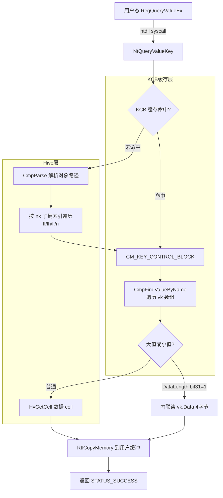

---
tags:
  - Windows
  - 内核
  - tier3
  - 注册表
  - 逆向
---
# 注册表内核实现：配置管理器 CM

> [!abstract] TL;DR
> 配置管理器（Configuration Manager，简称 CM）是 ntoskrnl 中负责注册表的 Executive 子系统。它将磁盘上的 Hive 文件（`regf` 格式）映射到内核虚拟内存，通过 `CM_KEY_CONTROL_BLOCK`（KCB）树缓存键名与元数据，并向用户态暴露 `NtCreateKey`/`NtQueryValueKey` 等系统调用。理解 CM 内部结构，是分析恶意软件持久化、注册表 Rootkit 隐藏技术、取证恢复被删键值，以及开发 EDR 注册表过滤驱动的必要前提。

---

## 概述与定位

Windows 注册表是操作系统最核心的配置数据库，几乎所有系统配置、驱动参数、服务启动项、用户偏好、恶意软件持久化机制都落在这里。注册表在内核中由配置管理器（Configuration Manager，缩写 CM）实现，位于 `ntoskrnl.exe` 中以 `Cm`、`Cmp`（私有前缀）、`Hv`（Hive 层）开头的一组函数里。

CM 在 Windows Executive 架构中的定位：

```
用户态:  regedit.exe / reg.exe / WMI / PowerShell Registry 提供者
         ↓ NtCreateKey / NtOpenKey / NtQueryValueKey / NtSetValueKey …
                          (ntdll → KiSystemCall64)
内核态:  NtCreateKey (cm\cmapi.c) → CmpFindLevelInCache → KCB 树
                                   → CmpParse → Hive cell
         CM 子系统（cm\ 目录）
         ↓
         Hive 层（ntoskrnl hv\ 目录）：HvAllocateCell / HvGetCell / HvMarkCellDirty
         ↓
         Cache Manager / 文件系统：将脏页写回 %SystemRoot%\System32\config\
```

注册表对应的 `\REGISTRY` 命名空间根挂载在对象管理器命名空间中，并不是真实文件路径而是由 CM 通过 `ParseProcedure` 拦截解析。Hive 文件本体存放在：

- `%SystemRoot%\System32\config\SYSTEM`（映射为 `HKLM\SYSTEM`）
- `%SystemRoot%\System32\config\SOFTWARE`（映射为 `HKLM\SOFTWARE`）
- `%SystemRoot%\System32\config\SAM`、`SECURITY`
- 用户 NTUSER.DAT（加载到 `HKU\<SID>`）
- `%SystemRoot%\System32\config\BCD` 等

内核启动早期（Phase 1 之前）由 `CmpInitHiveList` 完成系统 Hive 加载，此时文件系统尚未完全就绪，CM 使用引导时注册表（boot hive）的临时内存副本。

---

## 原理与机制

### Hive 磁盘格式

每个 Hive 文件使用 `regf` 格式（Windows NT 以来未改变基本结构）：

**基块（Base Block / HBASE_BLOCK）**

Hive 文件前 512 字节为基块，结构如下（Windows 10 实际偏移）：

| 偏移 | 大小 | 字段 | 说明 |
|------|------|------|------|
| 0x000 | 4 | `Signature` | `regf`（0x66676572） |
| 0x004 | 4 | `Sequence1` | 主序号，与 Sequence2 构成日志一致性校验 |
| 0x008 | 4 | `Sequence2` | 副序号 |
| 0x00C | 8 | `TimeStamp` | 最后写入的 FILETIME |
| 0x014 | 4 | `MajorVersion` | 通常为 1 |
| 0x018 | 4 | `MinorVersion` | Windows XP=3, Vista=5, 7/8/10=5/6 |
| 0x01C | 4 | `Type` | 0=Primary, 1=Log |
| 0x020 | 4 | `Format` | 1=Memory-mapped（direct cell index） |
| 0x024 | 4 | `RootCell` | 根键 `nk` 记录的 cell index（HCELL_INDEX）|
| 0x028 | 4 | `Length` | Hive 数据区总长度（不含基块） |
| 0x02C | 4 | `Cluster` | 通常为 1 |
| 0x030 | 64 | `FileName` | Hive 文件名（Unicode）|
| 0x1FC | 4 | `CheckSum` | 基块前 508 字节的 XOR 校验和 |

基块之后是连续的 **hbin 桶（hive bin）** 序列，每个 hbin 大小为 4096 字节的整数倍，包含：

| 偏移 | 大小 | 字段 | 说明 |
|------|------|------|------|
| 0x000 | 4 | `Signature` | `hbin`（0x6E696268） |
| 0x004 | 4 | `FileOffset` | 相对于 Hive 数据区起始的偏移 |
| 0x008 | 4 | `Size` | 本 hbin 的大小 |
| 0x010 | 8 | `TimeStamp` | 仅第一个 hbin 有效 |

**Cell（单元）**

hbin 内部由一系列 cell 填充。每个 cell 以 4 字节大小字段开头：
- 正值 = 空闲 cell，值为大小
- 负值 = 已用 cell，绝对值为大小

Cell index（`HCELL_INDEX`）是 32 位整数，高位区分 Stable Storage（0）与 Volatile Storage（1）；低 31 位是相对于 Hive 数据区起始的字节偏移。

**Cell 类型记录**

已用 cell 内容根据其两字节签名区分：

| 签名 | 结构名 | 用途 |
|------|--------|------|
| `nk` | `CM_KEY_NODE`（WDK 称 `_CM_KEY_NODE`）| 键节点（subkey） |
| `vk` | `CM_KEY_VALUE` | 值条目 |
| `sk` | `CM_KEY_SECURITY` | 安全描述符（链表）|
| `lf` | `CM_KEY_INDEX`（哈希叶） | 子键索引（<=16个子键，存前4字节名哈希）|
| `lh` | `CM_KEY_INDEX`（哈希叶v2） | 同 lf，但哈希算法不同 |
| `li` | `CM_KEY_INDEX`（叶）| 子键 cell index 直接列表 |
| `ri` | `CM_KEY_INDEX`（根）| 间接索引，指向多个 li/lf/lh |

**nk 记录（CM_KEY_NODE）详解**

`nk` 是注册表键的核心结构，关键字段：

```c
typedef struct _CM_KEY_NODE {
    USHORT  Signature;          // 'nk' = 0x6B6E
    USHORT  Flags;              // KEY_HIVE_ENTRY | KEY_HIVE_EXIT | KEY_ROOT | KEY_VOLATILE 等
    LARGE_INTEGER LastWriteTime;
    ULONG   Spare;
    HCELL_INDEX ParentIndex;    // 父 nk cell index
    ULONG   SubKeyCounts[2];    // [0]=Stable, [1]=Volatile
    HCELL_INDEX SubKeyLists[2]; // 指向 lf/lh/li/ri
    ULONG   ValuesCount;
    HCELL_INDEX Values;         // 指向 vk cell index 数组
    HCELL_INDEX Security;       // 指向 sk cell
    HCELL_INDEX ClassCell;      // 键类型字符串 cell index
    ULONG   MaxNameLen;
    ULONG   MaxClassLen;
    ULONG   MaxValueNameLen;
    ULONG   MaxValueDataLen;
    ULONG   WorkVar;            // CM 运行时使用
    USHORT  NameLength;
    USHORT  ClassLength;
    WCHAR   Name[1];            // 变长键名（可 ASCII 压缩）
} CM_KEY_NODE, *PCM_KEY_NODE;
```

`Flags` 字段中 `KEY_COMP_NAME`（0x0020）表示键名以 ASCII 存储而非 Unicode，节省空间。根键（Hive 根）设有 `KEY_HIVE_ENTRY`。

**vk 记录（CM_KEY_VALUE）详解**

```c
typedef struct _CM_KEY_VALUE {
    USHORT  Signature;      // 'vk' = 0x6B76
    USHORT  NameLength;
    ULONG   DataLength;     // 最高位若置 1，数据内联于 Data 字段（小值优化）
    HCELL_INDEX Data;       // 数据 cell index，或内联数据
    ULONG   Type;           // REG_SZ / REG_DWORD / REG_BINARY …
    USHORT  Flags;          // KEY_VALUE_COMP_NAME
    USHORT  Spare;
    WCHAR   Name[1];        // 值名
} CM_KEY_VALUE, *PCM_KEY_VALUE;
```

数据小于等于 4 字节时，`DataLength` 最高位（bit 31）置 1，数据直接存在 `Data` 字段，不再分配额外 cell——这是 CM 的内联小值优化（small value inline）。

**sk 记录（CM_KEY_SECURITY）**

`sk` cell 存储键对应的安全描述符（SECURITY_DESCRIPTOR），多个 `nk` 可共享同一 `sk`（通过引用计数）。`sk` cell 以双向循环链表组织，链头为 Hive 根键的 sk。

**子键索引结构**

当一个键有多个子键时，使用 `lf`/`lh`/`li`/`ri` 组织索引以加速查找：
- 子键少（≤16）：直接用 `lf`/`lh`，存储子键 cell index 与名前 4 字节哈希
- 子键多：用 `ri`（根索引）指向多个 `lf`/`lh`/`li` 叶节点，形成两级索引结构

### Hive 内存映射：从 cell index 到内核虚拟地址

CM 在内核初始化时将 Hive 文件映射到内核虚拟地址空间，使用 `CMHIVE`（包含 `HHIVE` 结构）管理：

```c
typedef struct _HHIVE {
    ULONG           Signature;      // HHIVE_SIGNATURE
    PHHIVE_ALLOC    Allocate;       // HvpAllocateCell
    PHHIVE_FREE     Free;           // HvpFreeCell
    PHHIVE_SET_DIRTY SetDirty;      // HvMarkCellDirty
    PHHIVE_DIRTY_CHECK IsDirty;
    PHHIVE_GET_CELL GetCell;        // HvGetCell —— cell index → 虚拟地址
    PHHIVE_RELEASE_CELL ReleaseCell;
    PHHIVE_ENUMERATE_DIRTY EnumDirty;
    ULONG           Version;
    BOOLEAN         ReadOnly;
    // …
    HBASE_BLOCK    *BaseBlock;      // 指向基块的内存副本
    RTL_BITMAP      DirtyVector;    // 脏页位图
    ULONG           DirtyCount;
    DUAL            Storage[2];     // [0]=Stable, [1]=Volatile
} HHIVE, *PHHIVE;

typedef struct _DUAL {
    ULONG       Length;         // 存储大小
    PMAP        Map;            // HMAP_DIRECTORY 页表树
    PBITMAP     FreeDisplay;
    ULONG       FreeSummary;
    LIST_ENTRY  FreeBins;
} DUAL;
```

`HMAP_DIRECTORY` 是 CM 自己维护的两级页表（类似 x86 页目录/页表）：

```
HCELL_INDEX（cell offset）
    ↓
高 10 位 → HMAP_DIRECTORY[DIR_INDEX] → HMAP_TABLE 指针
低 22 位 → HMAP_TABLE[TABLE_INDEX] → HMAP_ENTRY
                                           ↓
                                 BlockAddress（内核虚地址） + BinOffset
```

`HvGetCell(Hive, CellIndex)` 的核心逻辑就是做上述两级查找，返回 cell 在内核中的虚拟地址指针。此指针有效期仅限于关联的资源锁持有期间（通过 `HvReleaseCell` 释放）。

Volatile Storage（`Storage[1]`）存放临时键值（如 `HKLM\HARDWARE`），不会写回磁盘，系统重启消失。

### KCB：键控制块

`CM_KEY_CONTROL_BLOCK`（KCB）是 CM 在内存中为频繁访问的键维护的缓存结构，类似文件系统的 inode 缓存：

```c
typedef struct _CM_KEY_CONTROL_BLOCK {
    ULONG           Signature;          // KCB_SIGNATURE
    ULONG           RefCount;           // 引用计数
    struct _CM_KEY_CONTROL_BLOCK *ParentKcb;
    PCM_KEY_HASH    KeyHash;            // 哈希桶链
    ULONG           KcbMaxNameLen;
    PCM_CACHED_VALUE *CachedSecurity;
    CACHE_DATA      CachedSecurity2;
    // …
    HCELL_INDEX     KeyCell;            // 对应 nk cell 的 HCELL_INDEX
    PHHIVE          KeyHive;            // 所属 Hive
    UNICODE_STRING  NameBlock;          // 键名（或指向共享名块）
    ULONG           Flags;              // KEY_SYM_LINK | KEY_IS_DELETED | KEY_HIVE_EXIT …
    ULONG           ExtFlags;
    // …
    LIST_ENTRY      CachedList;         // KCB LRU 链
    LIST_ENTRY      DelayedCloseEntry; // 延迟关闭链
} CM_KEY_CONTROL_BLOCK, *PCM_KEY_CONTROL_BLOCK;
```

KCB 通过哈希表（`CmpCacheTable`，桶数由 `CmpHashTableSize` 决定，默认 2048）快速查找。路径 `HKLM\SOFTWARE\Microsoft\Windows\CurrentVersion` 查找时，CM 沿路径逐级在哈希表中命中 KCB，避免反复解析 Hive cell。

`CM_KEY_BODY` 是用户态句柄在内核中的对象（对象管理器 `Key` 类型），内含指向 KCB 的指针：

```c
typedef struct _CM_KEY_BODY {
    ULONG               Type;       // CM_KEY_BODY_TYPE
    PCM_KEY_CONTROL_BLOCK KeyControlBlock;
    struct _CM_KEY_BODY *NextLinkBlock; // 链接到同一 KCB 的所有 Body
    LIST_ENTRY           KeyBodyList;
    // …
} CM_KEY_BODY, *PCM_KEY_BODY;
```

用户态 `HKEY` → 内核句柄 → `CM_KEY_BODY` → `KCB` → `HCELL_INDEX` → Hive cell 字节，这是完整的间接链。

### 系统调用路径

以 `NtQueryValueKey` 为例，完整调用链：

```
NtQueryValueKey(KeyHandle, ValueName, …)
  → ObReferenceObjectByHandle → CM_KEY_BODY
  → CmpFindLevelInCache (KCB 缓存命中)
  → CmQueryValueKey
    → CmpFindValueByName
      → HvGetCell(Hive, ValuesCell)   ← 获取 vk 数组 cell
        → for each vk:
            比较 NameLength + Name
      → HvGetCell(Hive, DataCell)     ← 获取数据 cell
      → RtlCopyMemory → 用户态缓冲区
```

### 稳定（Stable）vs 易失（Volatile）Hive

每个 Hive 的 `Storage` 数组有两个槽：
- `[0]` = 稳定（Stable）：有对应磁盘文件，关机时脏页写回
- `[1]` = 易失（Volatile）：纯内存，重启丢失

`HKLM\HARDWARE` 整个 Hive 为 Volatile。一个稳定键下也可以创建 Volatile 子键（`REG_OPTION_VOLATILE`），该子键不写磁盘。`HCELL_INDEX` 的最高位区分来源：`0x80000000` 以上为 Volatile。

### 日志与崩溃一致性

CM 使用双 `.LOG` 文件（如 `SYSTEM.LOG1` / `SYSTEM.LOG2`）实现写时记录（write-ahead log）。写操作流程：

1. 将脏 hbin/cell 的变化写入日志文件（`HvWriteLog`）
2. Sequence1 递增，基块写回
3. 数据写入主 Hive 文件
4. Sequence2 递增（此时 Seq1 == Seq2 表示一致）

崩溃恢复时，若 Seq1 ≠ Seq2，SM/autochk 从 LOG 回放变更。

Windows 10 1709+ 引入 **新式日志格式**（New Log Format），日志文件合并为单 `.LOG` 并使用增量 dirty page 块，提升 SSD 场景下的写性能。

### 注册表回调：CmRegisterCallback

CM 提供 `CmRegisterCallbackEx`（Vista+）供驱动注册注册表操作回调：

```c
NTSTATUS CmRegisterCallbackEx(
    PEX_CALLBACK_FUNCTION   Function,
    PCUNICODE_STRING        Altitude,
    PVOID                   Driver,
    PVOID                   Context,
    PLARGE_INTEGER          Cookie,
    PVOID                   Reserved
);
```

回调函数原型：

```c
NTSTATUS RegistryCallback(
    PVOID   CallbackContext,
    PVOID   Argument1,   // REG_NOTIFY_CLASS（枚举值）
    PVOID   Argument2    // 操作特定数据结构，如 REG_QUERY_VALUE_KEY_INFORMATION
);
```

`REG_NOTIFY_CLASS` 枚举包含：
- `RegNtPreCreateKey` / `RegNtPostCreateKey`
- `RegNtPreOpenKey` / `RegNtPostOpenKey`
- `RegNtPreDeleteKey` / `RegNtPostDeleteKey`
- `RegNtPreSetValueKey` / `RegNtPostSetValueKey`
- `RegNtPreDeleteValueKey`
- `RegNtPreQueryValueKey` / `RegNtPostQueryValueKey`
- `RegNtPreQueryKey`
- `RegNtPreSetInformationKey`
- 以及 `RegNtPreLoadKey`/`RegNtPreSaveKey` 等 Hive 级操作

回调在 Pre 阶段可以修改参数、返回错误码阻断操作；Post 阶段可以记录结果。EDR 通过此机制检测：
- 恶意软件向 `Run` 键写持久化项
- 向 `HKLM\SECURITY\Policy\Secrets` 写凭据
- 注册表 CLSID 劫持（COM 劫持）

回调链按 Altitude 数值排序执行，Cookie 用于后续 `CmUnRegisterCallback`。

---

## 结构/算法/伪代码详解

### Hive cell 查找与解析流程（伪代码）

```c
// 将 HCELL_INDEX 转换为内核虚拟地址
PVOID HvGetCell(PHHIVE Hive, HCELL_INDEX CellIndex) {
    BOOLEAN volatile_flag = (CellIndex & HCELL_NIL) != 0;
    ULONG   offset        = CellIndex & ~HCELL_NIL;  // 去掉最高位
    PDUAL   storage       = &Hive->Storage[volatile_flag ? 1 : 0];

    // 两级映射：类似页目录/页表
    ULONG dir_idx   = offset >> HMAP_DIRECTORY_SHIFT;  // 高位
    ULONG table_idx = (offset >> HMAP_TABLE_SHIFT) & HMAP_TABLE_MASK;
    ULONG bin_off   = offset & (HBLOCK_SIZE - 1);

    PHMAP_ENTRY entry = &storage->Map->Directory[dir_idx]->Table[table_idx];
    PUCHAR block = (PUCHAR)entry->BlockAddress;
    return block + bin_off;  // 返回 cell 内核虚地址
}

// 在 nk 的子键索引中按名查找
HCELL_INDEX CmpFindSubKeyByName(
    PHHIVE Hive, PCM_KEY_NODE Parent, PUNICODE_STRING Name)
{
    for (int s = 0; s < 2; s++) {  // Stable, Volatile
        if (Parent->SubKeyCounts[s] == 0) continue;
        HCELL_INDEX idx_cell = Parent->SubKeyLists[s];
        PCM_KEY_INDEX index = HvGetCell(Hive, idx_cell);

        if (index->Signature == CM_KEY_HASH_LEAF ||
            index->Signature == CM_KEY_LEAF) {
            // lf/lh 直接遍历（含哈希快速比较）
            for (ULONG i = 0; i < index->Count; i++) {
                HCELL_INDEX sub = index->List[i].Cell;
                PCM_KEY_NODE node = HvGetCell(Hive, sub);
                if (CmpCompareKeyName(node, Name) == 0)
                    return sub;
            }
        } else if (index->Signature == CM_KEY_INDEX_ROOT) {
            // ri：两级索引递归
            for (ULONG i = 0; i < index->Count; i++) {
                HCELL_INDEX leaf_cell = index->List[i].Cell;
                HCELL_INDEX found = CmpFindInLeaf(Hive, leaf_cell, Name);
                if (found != HCELL_NIL) return found;
            }
        }
    }
    return HCELL_NIL;
}
```

### KCB 缓存命中路径

```c
PCM_KEY_CONTROL_BLOCK CmpFindKcbInCache(PUNICODE_STRING FullPath) {
    // 计算完整路径哈希
    ULONG hash = CmpComputeHashValue(FullPath);
    ULONG bucket = hash % CmpHashTableSize;

    PCM_KEY_HASH entry = CmpCacheTable[bucket];
    while (entry) {
        PCM_KEY_CONTROL_BLOCK kcb = CONTAINING_RECORD(entry, ...);
        if (kcb->ConvKey == hash &&
            RtlEqualUnicodeString(&kcb->NameBlock, FullPath, TRUE)) {
            // 缓存命中，增加引用
            InterlockedIncrement(&kcb->RefCount);
            return kcb;
        }
        entry = entry->NextHash;
    }
    return NULL;  // 缓存未命中，走 Hive cell 解析
}
```

### 内联小值（Small Value Inline）

```c
BOOLEAN CmpIsValueSmall(PULONG pDataLength, PHCELL_INDEX pDataCell) {
    if (*pDataLength & CM_KEY_VALUE_SPECIAL_SIZE) {
        // bit 31 置位 = 数据内联于 DataCell 字段本身
        *pDataLength &= ~CM_KEY_VALUE_SPECIAL_SIZE;  // 真实长度 ≤ 4
        return TRUE;  // 数据就在 vk.Data 字段的 4 字节里
    }
    return FALSE;
}
```

### 事务注册表（KTM/TxR）

Windows Vista 引入内核事务管理器（KTM，Kernel Transaction Manager）并将其集成进 CM，形成事务注册表（TxR）。API 层面：

```c
// 创建 KTM 事务对象
HANDLE hTx = CreateTransaction(NULL, NULL, 0, 0, 0, 0, NULL);
// 在事务上下文中操作注册表
HKEY hKey;
RegCreateKeyTransactedW(HKEY_LOCAL_MACHINE, L"SOFTWARE\\Test",
                        0, NULL, 0, KEY_WRITE,
                        NULL, &hKey, NULL, hTx, NULL);
RegSetValueExW(hKey, L"Val", 0, REG_SZ, ...);
// 提交或回滚
CommitTransaction(hTx);  // 或 RollbackTransaction(hTx)
```

内核实现中，KTM 为每个活跃事务维护 `CM_KEY_TRANSACTION_NODE`，保存事务内修改的 cell 集合（"影子 cell"）。提交时将影子 cell 合并进主 Hive；回滚则丢弃影子 cell。这一机制在恶意软件使用 TxR 进行原子替换（如 `process doppelgänging` 技术的注册表变体）时有逆向分析价值。

### 完整数据流 Mermaid 图



---

## 工具视角与实战

### WinDbg：内核注册表调试命令

**!reg 扩展命令**

```
// 显示 KCB 树（所有缓存的键）
!reg kcb

// 显示指定 KCB 详情（地址从 !reg kcb 输出获取）
!reg querykcb 0xffffc001`deadbeef

// 显示 Hive 列表
!reg hivelist

// 显示指定 Hive 的基块信息
!reg hiveinfo 0xffffa001`cafecafe

// 查找完整路径对应的 KCB
!reg openkeys \REGISTRY\MACHINE\SOFTWARE\Microsoft

// 显示 cell 内容（需要 Hive 地址 + cell index）
!reg cellinfo 0xffffa001`cafecafe 0x20
```

**手动遍历 Hive 结构**

```
// 获取 CMHIVE 列表（通过 CmpHiveListHead 全局链表）
dt nt!_CMHIVE
x nt!CmpHiveListHead
dl nt!CmpHiveListHead 99 0    // 遍历链表

// 解析 HHIVE 基块
dt nt!_HHIVE 0xffffa001`cafecafe

// 从 HHIVE 基块找根 cell index
dt nt!_HBASE_BLOCK 0xffffa001`cafecafe+0x10   // BaseBlock 指针值
// 基块 +0x24 = RootCell，取出后用 HvGetCell 逻辑手算偏移

// 查看 CM_KEY_NODE（nk cell）
dt nt!_CM_KEY_NODE <地址>

// 查看 CM_KEY_VALUE（vk cell）
dt nt!_CM_KEY_VALUE <地址>

// 查看 KCB
dt nt!_CM_KEY_CONTROL_BLOCK <地址>
!reg kcb <地址>
```

**查找特定键的 KCB**

```
// 在 CmpCacheTable 哈希桶中搜索
x nt!CmpCacheTable
// CmpHashTableSize 通常为 2048
// 遍历每个桶的链表：
dt nt!_CM_KEY_HASH <addr>
// 通过 CONTAINING_RECORD 找 KCB
```

### 离线 Hive 取证

**工具选择**

| 工具 | 用途 |
|------|------|
| `python-registry`（Eric Zimmermann）| Python 解析 Hive，枚举键值、时间戳 |
| `RegRipper` | Perl 插件式取证，输出关键持久化项 |
| `Registry Explorer`（Eric Z）| GUI，支持被删 cell 恢复 |
| `regipy` | Python3 API，支持 hivex 格式转换 |
| `FTK Imager` / `Volatility3` | 从内存转储提取 Hive |

**python-registry 示例**

```python
from Registry import Registry

reg = Registry.Registry("C:/evidence/NTUSER.DAT")
key = reg.open("Software\\Microsoft\\Windows\\CurrentVersion\\Run")

for value in key.values():
    print(f"{value.name()} = {value.value()}")
    print(f"  Type: {value.value_type()}")

# 遍历所有子键并打印时间戳
def walk(key, depth=0):
    indent = "  " * depth
    ts = key.timestamp().isoformat()
    print(f"{indent}[{ts}] {key.name()}")
    for subkey in key.subkeys():
        walk(subkey, depth + 1)

walk(reg.root())
```

**恢复被删除的键值**

被删 cell 在 Hive 中仅将大小字段由负变正（标记为空闲），内容不立即清零。取证工具通过扫描空闲 cell 重建签名为 `nk`/`vk` 的结构，恢复恶意软件删除的持久化键：

```python
# regipy 示例：扫描 slack space
from regipy.registry import RegistryHive
hive = RegistryHive("NTUSER.DAT")
deleted = list(hive.get_deleted_nks())
for d in deleted:
    print(d.name, d.header.last_modified)
```

**Volatility3 从内存转储提取注册表**

```
# 列出加载的 Hive
python vol.py -f memory.dmp windows.registry.hivelist

# 打印指定 Hive 中的键值
python vol.py -f memory.dmp windows.registry.printkey \
    --key "Software\Microsoft\Windows\CurrentVersion\Run" \
    --hive-offset 0xffffa001cafecafe
```

### 注册表数据流实时监控

**Process Monitor（Sysinternals）**

`Procmon.exe` 在驱动层通过 CM 回调（`CmRegisterCallbackEx`）+ ETW 实现注册表操作实时监控，是理解 CM 回调使用场景的最直观参考。其驱动 `PROCMON24.SYS` 可作为开发 CM 回调驱动的参考实现（通过逆向）。

**WDK 示例驱动（regfltr）**

WDK 提供 `Regfltr` 示例（`src\general\registry\regfltr`），演示 Pre/Post 回调、修改键名重定向、阻断特定值写入的完整实现。

---

## 安全性与正确使用

### 注册表回调摘除（EDR 对抗技术）

攻击者获得内核执行权（通常通过 BYOVD 或内核漏洞）后，可摘除 EDR 注册的 CM 回调：

**定位 CmpCallBackVector**

CM 维护一个全局回调向量 `CmpCallBackVector`（`EX_CALLBACK` 数组，Windows 10 最多 100 个槽）：

```
// WinDbg 中定位
x nt!CmpCallBackVector
dt nt!_EX_CALLBACK nt!CmpCallBackVector
```

每个 `EX_CALLBACK` 内有一个 `EX_CALLBACK_ROUTINE_BLOCK` 指针，其中包含回调函数地址和上下文。摘除方法：将该指针置为 NULL 或将函数指针替换为空函数。

**检测摘除行为**

蓝队检测手段：
1. 周期性调用 `CmRegisterCallbackEx` 尝试重注册并比较 Cookie，若 Cookie 存在则自检
2. 通过 ETW 监控 `Microsoft-Windows-Kernel-Registry` 提供者，若 RegNtPost 事件消失而操作仍发生，说明回调被摘
3. 系统调用审计（ETW-Ti）：`NtQuerySystemInformation(SystemCallbackInformation)` 列举所有注册的回调

**示例摘除代码（内核驱动，仅逆向分析用途）**

```c
// 简化示意：枚举并摘除指定模块的 CM 回调
VOID RemoveCmCallbacks(PDRIVER_OBJECT TargetDriver) {
    // 定位 CmpCallBackVector（需要特征码扫描或符号）
    PVOID *CallbackVector = FindCmpCallBackVector();
    if (!CallbackVector) return;

    for (int i = 0; i < 100; i++) {
        // EX_CALLBACK 结构：低位 = 锁，去掉后取 EX_CALLBACK_ROUTINE_BLOCK*
        ULONG_PTR raw = (ULONG_PTR)CallbackVector[i];
        if (!raw) continue;
        PEX_CALLBACK_ROUTINE_BLOCK block = (PEX_CALLBACK_ROUTINE_BLOCK)(raw & ~0xF);
        // 检查回调函数地址是否属于 TargetDriver 地址范围
        if (IsInDriverRange(block->Function, TargetDriver)) {
            // 将向量槽清零（原子操作）
            InterlockedExchangePointer(&CallbackVector[i], NULL);
        }
    }
}
```

防御方：将 `CmpCallBackVector` 页面设为只读（`MmProtectMdlSystemAddress` / HVCI 下 ACG），防止内核写入。

### 注册表 Rootkit 隐藏技术

注册表 Rootkit 通过直接操作 CM 内部数据结构，使普通 API（`RegEnumKey`/`RegQueryValue`）查询不到特定键值，同时键值在磁盘 Hive 中依然存在（供自身使用）。

**技术一：KCB 标记删除**

将目标键对应 KCB 的 `Flags` 字段加上 `KEY_IS_DELETED`（0x0800），则 CM 查询时视其为已删，但 Hive cell 未变：

```c
PCM_KEY_CONTROL_BLOCK kcb = FindKcbByPath(L"\\REGISTRY\\...\\HiddenKey");
if (kcb) {
    // 原子设置 KEY_IS_DELETED 标志
    InterlockedOr(&kcb->Flags, KEY_IS_DELETED);
}
```

检测：对比 KCB 树（`!reg kcb`）与直接 Hive cell 遍历结果；或用 RegRipper 离线对比。

**技术二：修改 nk 子键索引**

直接在 Hive 数据中将目标键从父键的 `lf`/`lh` 子键列表中摘除（修改 `Count` 字段或将对应 cell index 置零）。这样 API 枚举子键时跳过该键，但 cell 在磁盘上完整存在。

检测：遍历 Hive 中所有空闲 cell 搜索孤立 `nk` 签名；或交叉对比 `RegEnumKey` 结果与 `!reg cellinfo` 输出。

**技术三：Hook CmQueryKey 等 CM 内部函数**

在 `CmpEnumerateKeyObject`、`CmpQueryKeyName` 等函数入口处打 inline hook，过滤特定键名的返回。

检测：PatchGuard（KPP）会检测内核代码段修改；HVCI 环境下无法写内核代码。

**技术四：Hive 日志操纵**

恶意软件在 SYSTEM.LOG 中写入假变更，使日志回放时覆盖正常值。高级取证需对 Primary Hive 与 LOG 分别独立解析。

### 取证对抗与反对抗

**攻击方取证对抗手段**

1. **内存中键值**：使用 `REG_OPTION_VOLATILE` 注册键，仅存内存，重启消失，取证镜像不含磁盘痕迹
2. **时间戳伪造**：直接修改 `nk.LastWriteTime` 字段掩盖写入时间
3. **删除恢复键**：写入→使用→删除，但 slack space 可恢复；攻击方需用 0 填充空闲 cell（需内核权限）
4. **加密存储**：值数据加密，只有自身驱动解密，取证获得密文

**防御方/取证对抗手段**

1. **交叉对比**：`RegEnumKey` API 结果 vs `HvGetCell` 直接 cell 遍历——差异即隐藏键
2. **Hive 哈希对比**：定期快照 Hive SHA256，异常差异触发告警
3. **KCB 扫描**：通过 `CmpCacheTable` 枚举所有 KCB，与 API 层可见键对比
4. **日志完整性**：解析 LOG 文件还原提交历史，重建时间线
5. **内存取证**：Volatility3 `windows.registry.hivelist` + `printkey` 直接从内存 Hive 读取，绕过 API Hook

---

## 小结

配置管理器是 Windows 内核中功能完整、结构复杂的 Executive 子系统。其核心设计以 `regf` Hive 文件为持久化存储，以 KCB 树为内存缓存加速访问，以 CM 回调链为安全监控扩展点，以 KTM/TxR 为事务原子性保障。

理解 CM 的几个关键层次：

1. **磁盘层**：`regf` 基块 + `hbin` + `nk`/`vk`/`sk`/`lf`/`lh`/`li`/`ri` cell，是取证分析和 Rootkit 检测的基础
2. **内存映射层**：`HHIVE` + `HMAP_DIRECTORY` 两级页表将 cell index 转化为内核虚拟地址，是理解 `HvGetCell` 的关键
3. **KCB 缓存层**：`CM_KEY_CONTROL_BLOCK` + 哈希表，是注册表查询高性能的原因，也是 Rootkit 隐藏（`KEY_IS_DELETED`）的目标
4. **对象层**：`CM_KEY_BODY` 作为内核对象连接用户态 `HKEY` 句柄与 KCB
5. **回调层**：`CmpCallBackVector` 中的 `EX_CALLBACK` 数组，是 EDR 监控注册表的机制，也是攻击者摘除的目标

在实战逆向中，WinDbg 的 `!reg` 系列命令提供了直接审查 CM 内部状态的能力；python-registry 等离线工具则实现了独立于 OS API 的取证分析。注册表 Rootkit 与 EDR 的对抗本质上是在 CM 数据结构这一层的可见性博弈：哪一方能更直接地接触内部结构，就拥有更大的主动权。

---

## 相关阅读

- **系列内**
  - [09.内核回调机制](09.内核回调机制.md)：`CmRegisterCallbackEx` 的 EDR 应用视角与回调摘除对抗
  - [11.Rootkit原理与检测](11.Rootkit原理与检测.md)：DKOM、交叉视图检测方法论，与注册表 Rootkit 形成对比
  - [18.ETW与内核遥测](18.ETW与内核遥测.md)：`Microsoft-Windows-Kernel-Registry` ETW 提供者补充监控盲区
  - [07.WinDbg内核调试](07.WinDbg内核调试.md)：`!reg` 命令前置调试技能

- **外部参考**
  - Windows Internals Part 2（第 7 版）Chapter 10：Registry—CM 实现权威参考
  - libregf 与 regipy 项目文档：离线 Hive 解析 API
  - Volatility3 文档：`windows.registry` 插件族

[[00.Windows内核与驱动逆向总览|⬆ 系列总览]] | [[23.Job对象与Silo容器隔离|← 上一章]] | [[25.HyperV架构与VBS|→ 下一章]]
