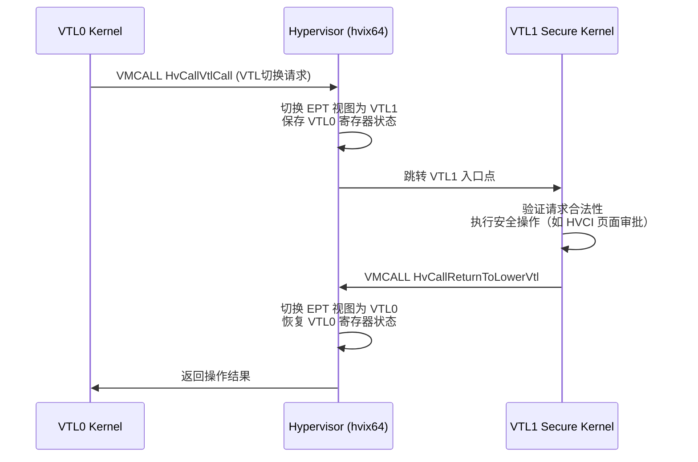

---
tags:
  - Windows
  - 内核
  - tier3
  - hyper-v
  - VBS
---
# Hyper-V 架构与 VBS（VTL 与 Secure Kernel）

> [!abstract] TL;DR
> Hyper-V 是微软的 Type-1 Hypervisor，直接运行在硬件上，将操作系统降为 Root Partition 上的 Guest。VTL（Virtual Trust Level）机制在 Hyper-V 之上构建 VBS（Virtualization-Based Security），把 Windows 内核（VTL0）与 Secure Kernel（VTL1）隔离开来，赋予 HVCI、Credential Guard、IUM/Trustlet 等安全特性不可被内核篡改的保护基础。理解 VTL 边界与 Secure Kernel 的工作方式，是分析现代 Windows 防御纵深、定位绕过可能性的必要前提。

---

## 概述与定位

在 Windows 8.1/Server 2012 R2 之前，操作系统内核（Ring 0）是整个软件栈的最高可信权威——只要攻击者获得内核执行权限，就可以篡改任意数据结构、绕过所有安全检查。PatchGuard（KPP）试图通过周期性完整性校验来弥补这一缺陷，但它本身也运行在 Ring 0，只是加了一层混淆，攻击者从内核发起的修改同样可以绕过甚至直接 patch PatchGuard 本身。

从 Windows 10 1507（TH1）开始，微软将 Hyper-V 底层能力暴露给 Windows 自身，构建了 **Virtualization-Based Security（VBS）** 体系。其核心思想：把 Hypervisor 作为比操作系统内核还低的可信根，在 Hypervisor 的硬件隔离之上，建立一个独立的 **Secure World**（VTL1），让关键安全服务在那里运行。即使传统的 Windows 内核（VTL0）被完全攻陷，运行在 VTL1 的 Secure Kernel 及其所管辖的服务也不能被 VTL0 的代码篡改。

这一变化在系列第 12 章（PatchGuard/DSE/HVCI）和第 20 章（Windows 安全机制全景）中均以"防御结果"形式出现。本章从架构底层出发，完整梳理 Hyper-V 的分区模型、VMBus 通信机制、VTL 边界实现，以及 Secure Kernel 上运行的各组件，最终回到逆向分析的实际约束与方法。

---

## 原理与机制

### Hyper-V 是 Type-1 Hypervisor

Hypervisor 分两类：
- **Type-2（Hosted）**：运行在操作系统之上（如 VMware Workstation、VirtualBox），依赖宿主 OS 的调度与内存管理。
- **Type-1（Bare-metal）**：直接运行在物理硬件上，操作系统以 Guest 形式在其上运行。

Hyper-V 是 Type-1。它在物理机启动阶段由 UEFI 固件加载（`hvloader.efi` → `hvix64.exe`（Intel）/`hvax64.exe`（AMD）），在 Windows OS Loader 之前获得控制权，然后把 CPU 置于虚拟化模式（VMX Root/SVM 宿主模式），再以 Guest 模式启动 Windows。因此，即使 Windows 内核以 Ring 0 运行，它的实际权限等级在 Intel VT-x 体系中是 VMX non-root Ring 0，无法直接访问 VMCS、无法关闭 EPT，受到 Hypervisor 的硬件约束。

### 分区模型（Partition）

Hyper-V 用"**分区**"抽象每个虚拟化实例：

```
物理硬件
    └─ hvix64.exe（Hypervisor，运行在 VMX Root Ring 0）
          ├─ Root Partition（又称 Parent Partition）
          │    └─ Windows NT Kernel（vmswitch/VSP 等驱动）
          └─ Child Partition（Guest VM 1, 2, ...）
               └─ Guest OS（Windows/Linux/...）
```

**Root Partition** 是特权分区，拥有直接访问硬件的能力（通过 Hypervisor 授予的 I/O 权限）。它运行着设备的原生驱动（磁盘、网卡等），并为 Child Partition 提供虚拟设备服务。Root Partition 的 Windows 内核本身也是 Guest——它以 VMX non-root 模式运行，但能通过 Hypercall 向 Hypervisor 申请特权操作。

**Child Partition** 没有直接硬件访问权，所有 I/O 必须通过 VMBus 向 Root Partition 的 VSP（Virtual Service Provider）请求服务。

### SLAT（Second Level Address Translation）与 EPT

SLAT 是 Intel（EPT，Extended Page Tables）和 AMD（NPT，Nested Page Tables）提供的硬件能力，在 Guest 物理地址（GPA）到宿主物理地址（HPA）之间增加一层页表。Hypervisor 控制这张 EPT/NPT，因此可以：

1. **限制内存权限**：将某段 GPA 标记为 Execute-only 或 Read-only，Guest 内核无法绕过——这正是 HVCI 的实现基础。
2. **拦截内存访问**：将特定 GPA 的 EPT 条目设为不可访问，触发 VM-Exit，Hypervisor 捕获访问事件。
3. **隔离内存区域**：VTL1 的内存页在 EPT 层面对 VTL0 完全不可见，VTL0 的任何代码都无法读写 VTL1 的内存。

### Hypercall 接口（vmcall/vmmcall）

Guest 与 Hypervisor 的通信通过 **Hypercall** 进行。在 Intel 上是 `VMCALL` 指令，AMD 上是 `VMMCALL`。Hypercall 编号和参数通过特定寄存器传递，Hypervisor 捕获后执行对应操作再返回。

常见 Hypercall 类别（参考 `TLFS`，Hypervisor Top Level Functional Specification）：
- 分区管理：`HvCreatePartition`、`HvDeletePartition`
- 内存管理：`HvMapGpaPages`、`HvUnmapGpaPages`
- CPU 管理：`HvCreateVp`（Virtual Processor）、`HvDeleteVp`
- VTL 管理：`HvCallEnablePartitionVtl`、`HvCallReturnToLowerVtl`
- 中断管理：`HvAssertVirtualInterrupt`
- VMBus：`HvPostMessage`、`HvSignalEvent`

在 Windows 内核中，这些 Hypercall 通常通过 `Vid.sys`（Virtual Infrastructure Driver）、`vmbus.sys` 或直接内联汇编来调用。逆向时在 `ntoskrnl.exe` 里搜索 `vmcall` 指令序列即可定位 Hypercall 调用点。

### VMBus 与 VSP/VSC 通信模型

VMBus（Virtual Machine Bus）是 Hyper-V 的内部高速通道，用于 Root Partition（或 Child Partition 之间）传递设备 I/O 消息：

```
Child Partition（Guest）            Root Partition（Host）
  VSC（Virtual Service Client）  ←→  VSP（Virtual Service Provider）
  例：storvsc.sys（存储客户端）      storvsp.sys（存储服务端）
  例：netvsc.sys（网络客户端）       vmswitch.sys（网络服务端）
```

VMBus 底层用共享内存环形缓冲区（Ring Buffer）传输数据，用 `HvPostMessage`/`HvSignalEvent` 触发通知。对 Guest 而言，这些设备暴露为 PnP 设备，由对应 VSC 驱动管理。

在 WSL2 或 Hyper-V 虚拟机中，存储/网络性能的瓶颈往往在 VMBus 环形缓冲区的大小和中断处理，逆向这个路径有助于理解性能调优点。

---

## 结构/算法/伪代码详解

### VTL（Virtual Trust Level）机制

VTL 是 Hyper-V 在分区内部引入的第二维度隔离：每个分区可以有多个 VTL，编号从 0 开始，数字越大权限越高。当前 Windows 只使用 VTL0 和 VTL1：

| VTL | 名称 | 运行内容 | 特权 |
|-----|------|----------|------|
| VTL0 | Normal World | Windows NT 内核 + 用户态 | 普通 Ring 0/3 |
| VTL1 | Secure World | Secure Kernel + IUM 进程 | 可访问 VTL0 内存但 VTL0 不可访问 VTL1 |

VTL 切换通过 Hypervisor 管控，不能由 VTL0 自行发起（只能请求从 VTL1 切回 VTL0）。VTL1 可通过 Hypercall `HvCallReturnToLowerVtl` 切回 VTL0。

**VTL 切换的安全保证来源于硬件**：Hypervisor 在 EPT 层面为 VTL0 和 VTL1 维护不同的页表视图（VSM-EPT），VTL0 的 EPT 中根本不包含 VTL1 的物理页映射，因此 VTL0 的任何代码（包括内核级 Ring 0）都无法读写 VTL1 的内存——不是权限不够，而是在地址翻译层面根本无从访问。

```
分区内存视图（简化）：

  物理内存
  ┌──────────────────────────┐ ← EPT-VTL0（VTL0 视图）
  │  VTL0 内核 + 用户态内存  │  可读写
  │  Secure Kernel 内存      │  ← 在 VTL0 EPT 中不映射（或标 NX+R/O）
  └──────────────────────────┘

  ┌──────────────────────────┐ ← EPT-VTL1（VTL1 视图）
  │  VTL0 内核内存           │  VTL1 可读（用于策略执行）
  │  Secure Kernel 内存      │  VTL1 可读写执行
  └──────────────────────────┘
```

### Secure Kernel（securekernel.exe）

`securekernel.exe` 是运行在 VTL1 Ring 0 的操作系统内核，极度精简，功能聚焦于安全策略执行，不含文件系统、网络、PnP 等子系统。

主要职责：
1. **管理 VTL1 内存**：分配/释放 Secure Kernel 自用内存，维护 VTL1 用户态（IUM 进程）的地址空间。
2. **代码完整性执行（HVCI）**：所有在 VTL0 请求变为可执行的页面必须先通过 Secure Kernel 的签名验证；VTL1 将验证通过的页面在 EPT 中标记为 Execute，对 VTL0 而言可执行但不可写（W^X）。
3. **VSM 服务**：响应 VTL0 通过 `VMCALL` 发来的安全请求（如页面权限变更、Credential 保存）。
4. **IUM 进程管理**：为运行在 VTL1 Ring 3 的 Trustlet 提供 API（`NtSecure*` 系列）。

`securekernel.exe` 文件通常存放在 `C:\Windows\System32\` 下，但在标准运行环境中无法直接调试（见"工具视角"一节）。

### HVCI（Hypervisor Protected Code Integrity）

HVCI 的机制链：

```
驱动加载请求（VTL0 内核）
    ↓
CI.dll → 验证 Authenticode 签名
    ↓
ntoskrnl → 通过 Hypercall 请求 Secure Kernel 将页面标记为 RX
    ↓
Secure Kernel（VTL1）
    ├─ 二次验证签名（独立信任链，不依赖 VTL0 的 CI.dll）
    ├─ 通过 EPT 将页面设为 Execute-only（VTL0 不可写）
    └─ 返回成功
    ↓
VTL0 内核得到可执行但不可写的页面
```

关键点：EPT 层面 VTL0 对该页面只有 Execute 权限，没有 Write 权限。这意味着即使 VTL0 内核被完全攻陷，攻击者也无法在已有代码页写入 shellcode（因为可执行的页不可写），也无法动态分配一个可写又可执行的页（因为任何新的 Execute 权限必须经过 VTL1 审批）——从根源上消灭了传统的内核 shellcode 注入路径。

这也解释了为什么 HVCI 开启后 PatchGuard 相对而言反而没那么重要——攻击者就算绕过 KPP，也无法往内核代码页写东西。

### VSM（Virtual Secure Mode）

VSM 是微软对上述整体机制的品牌化名称：利用 Hypervisor + VTL 提供的隔离能力，承载多个安全服务。VSM 可视为 VBS 的实现框架，包括：

- **Secure Kernel**：VTL1 Ring 0
- **IUM（Isolated User Mode）**：VTL1 Ring 3，Trustlet 进程运行在此
- **SKCI（Secure Kernel Code Integrity）**：Secure Kernel 内的代码完整性模块

### IUM Trustlet 与 Credential Guard

运行在 VTL1 Ring 3 的进程称为 **Trustlet**（又称 IUM 进程，Isolated User Mode Process）。它们对 VTL0 透明但受保护：VTL0 无法注入代码、无法以调试器附加、无法读取其内存。

最典型的 Trustlet：

| 进程 | 功能 |
|------|------|
| `LsaIso.exe` | Credential Guard 核心，保存 NT Hash、Kerberos TGT 等凭据 |
| `CredentialGuard.dll`（LsaIso 内） | 凭据加密/解密逻辑 |
| `MsSecCore.dll` | Trustlet 公共运行时（类比 ntdll.dll） |

**Credential Guard 工作机制**：

```
VTL0（Normal World）
    LSASS.exe
        ↓ 需要验证/获取凭据
        ↓（通过 RPC/ALPC 跨 VTL）
VTL1（Secure World）
    LsaIso.exe（IUM Trustlet）
        ├─ 真正的 NT Hash/Kerberos TGT 保存在 VTL1 内存
        ├─ 加密密钥由 Secure Kernel 管理，VTL0 永远看不到明文
        └─ 仅对合法请求返回派生令牌，不返回原始凭据
```

攻击者即使完全控制 VTL0 的 LSASS 内存（如 mimikatz 场景），读到的也是加密后的凭据 Blob，无法直接得到可利用的 NT Hash。

### Trustlet 的 ABI 与受限 API

Trustlet 不能调用普通 Win32 API（因为那些 API 依赖 VTL0 的 `ntdll.dll`、`kernel32.dll`），只能使用 VTL1 特有的 `NtSecure*` 系列系统调用（由 Secure Kernel 提供）以及 `MsSecCore.dll` 封装的 API。Trustlet 的 PE 格式有特殊属性（Policy Section、配置文件），Secure Kernel 加载时会验证其签名和策略。

### VTL 通信协议

VTL0 与 VTL1 之间的通信通过**安全通道**（Secure Channel）实现，本质是共享内存 + Hypercall 触发的 VTL 切换。在 Windows 实现中，这条通道由 `skci.dll`（VTL0 侧）和 Secure Kernel 对等方处理，每次请求都经过严格验证，不允许 VTL0 任意调用 VTL1 功能。



---

## 工具视角与实战

### 确认 VBS/HVCI 状态

**方法一：系统信息**

```
msinfo32
```
查找"基于虚拟化的安全"→ 显示"正在运行"；"基于虚拟化的安全服务配置"列出 Credential Guard、HVCI 等。

**方法二：注册表**

```
HKLM\SYSTEM\CurrentControlSet\Control\DeviceGuard\Scenarios\HypervisorEnforcedCodeIntegrity
    Enabled = 0x1
HKLM\SYSTEM\CurrentControlSet\Control\Lsa
    LsaCfgFlags = 0x1   ← Credential Guard 开启
```

**方法三：PowerShell**

```powershell
Get-CimInstance -ClassName Win32_DeviceGuard -Namespace root\Microsoft\Windows\DeviceGuard
```
输出 `VirtualizationBasedSecurityStatus`（2=Running）、`SecurityServicesRunning` 数组。

**方法四：WinDbg（双机调试 VTL0）**

在已建立 KD 会话后，可查询 VTL 相关结构：

```windbg
!vm              ← 查看内存映射，注意 VTL 相关保留段
dt nt!_KPCR      ← 查看 KPCR 中的 VtlReturn 字段（Win10 14393+）
!symbol noisy
x nt!VslVtl*     ← 搜索 VTL 相关符号
```

`VslpEnterIumSecureMode`、`VslVtlCallVa` 等符号在 `ntoskrnl.exe` 中可见，追踪这些函数即可了解 VTL0 → VTL1 调用路径。

### 逆向 securekernel.exe

`securekernel.exe` 是标准 PE 文件，可用 IDA Pro/Ghidra 打开静态分析。它有微软官方 PDB 符号（通过 `_NT_SYMBOL_PATH` 拉取），函数名可直接对应。值得关注的模块和函数：

- `SkmmAllocate` / `SkmmFree`：Secure Kernel 内存管理
- `SkciInitialize` / `SkciValidatePages`：代码完整性验证主入口
- `SkVtlCall` / `SkVtlReturn`：VTL 切换包装
- `SkIsSecureKernel` / `SkGetPartitionProperty`：分区属性查询

**静态逆向技巧**：

1. 导入表极简，几乎不依赖外部模块（大量内联函数）。
2. 利用字符串搜索（如 `"SecureKernel"` `"SkciError"` 等）定位关键路径。
3. 关注 `INT 29h`（快速失败）、`INT 2Ch`（断言失败）调用点——这些位置附近往往是安全检查代码。
4. RTTI 信息有时保留（Secure Kernel 部分类用了 C++ ATL-like 模式）。

### 动态调试 Secure Kernel 的限制

正常双机 KD 只能调试 VTL0。调试 VTL1/Secure Kernel 需要额外步骤：

**方法一：`--debugtransport=kdnet` + Hypervisor 调试**

Hyper-V 支持 `bcdedit /hypervisorsettings` 中开启 `hypervisordebug`，通过串口或 KDNET 连接。此时 WinDbg 可附加到 Hypervisor 本身，但调试能力极为有限（仅 hypercall 断点、VMCS 读取等）。

**方法二：KDVM（Virtual Machine Debugging）**

在 Hyper-V 虚拟机中启用嵌套虚拟化（`-Expose-VirtualizationExtensions`），在 Guest VM 内运行带 VBS 的 Windows，在 Host 侧用 WinDbg 的 KDVM 传输层调试，可同时观察 VTL0 和 VTL1。配置：

```powershell
# Host PowerShell（开启嵌套虚拟化）
Set-VMProcessor -VMName "DebugVM" -ExposeVirtualizationExtensions $true

# Guest 内：
bcdedit /set vsmlaunchtype Auto
bcdedit /set hypervisorlaunchtype Auto
```

然后通过 VMBus 连接调试：WinDbg 选择 `Kernel Debug → VirtualMachine`。

**方法三：自定义 Hypervisor 研究（Type-2 上的 Type-1）**

学术界和部分研究者通过 KVM/QEMU + 嵌套 VT-x 在 Linux 上运行 Hyper-V，并在 KVM 层插入断点拦截 VMCALL，实现对 Secure Kernel Hypercall 的完整追踪。工具链：`qemu-system-x86_64` + 自定义 KVM 模块 + GDB 远程协议。

### WinDbg 中观察 IUM 进程

在 VTL0 KD 会话中，IUM 进程（如 `LsaIso.exe`）会出现在进程列表：

```windbg
!process 0 0 LsaIso.exe
```

可以看到 `EPROCESS` 结构，但尝试切换到其地址空间并读取代码/数据时会触发访问违例——VTL0 内核本身也无法读取 IUM 进程的页面（Secure Kernel 在 EPT 层面禁止了 VTL0 对这些页的访问）。

```windbg
.process /i <LsaIso_EPROCESS>
!pte <地址>     ← EPT 属性显示 no access from VTL0
```

这是分析工具在 VBS 环境下遭遇限制的典型场景。

### 相关内核结构

**`KPCR.VtlReturn`**（Windows 10 14393+）：每个 CPU 的 KPCR 中包含 VTL 切换相关字段，记录当前 VTL 级别和返回点。

**`MMPFN`（Page Frame Number 数据库条目）** 中的 `VtlProtected` 位：标记该物理页是否受 VTL1 保护，VTL0 内核的内存管理器遇到此位会拒绝修改其权限。

**`MI_VISIBLE_STATE`（`MiState`全局）** 中的 VSM 相关字段：记录当前 VSM 配置、VTL1 启动状态、Secure Kernel 基址（在 VTL0 视角中映射为不可访问的范围）。

---

## 安全性与正确使用

### VBS 显著提升的攻击门槛

在 VBS/HVCI 完全开启的系统上，传统的 Windows 内核漏洞利用路径受到以下约束：

1. **无法动态生成可执行内核代码**：任何新的可执行内核页必须通过 HVCI 审批（Secure Kernel 签名验证），动态 shellcode 注入路径从根本上被封堵。

2. **无法直接读/改 Credential Guard 保护的凭据**：攻击者控制 LSASS 内存也拿不到明文 NT Hash/TGT，传统 mimikatz `sekurlsa::logonpasswords` 在 Credential Guard 开启时失效。

3. **无法通过 DKOM 或内联 Hook 修改代码路径**：因为所有可执行页不可写（EPT W^X），inline hook 需要先让页面可写，而这需要 Secure Kernel 批准——Secure Kernel 不会批准对已验证代码页的写请求。

4. **PatchGuard 变为"多余但并不完全无用"**：HVCI 已阻止代码篡改，但 PatchGuard 仍然监控 SSDT、IDT、GDT 等数据结构，两者并行提供防御。

### 当前研究中的绕过方向

学术界和红队研究者探索的方向（以防御为目的的了解）：

**方向一：VTL1 本身的漏洞**

Secure Kernel 代码量比 NT 内核小得多，但同样是 C/C++ 编写，存在被发现漏洞的可能。2023 年以来已有研究者公开了 Secure Kernel 中的堆溢出和类型混淆 PoC（已向微软报告并修复）。方法：纯静态逆向 `securekernel.exe`，结合 KDVM 动态调试（见上节）。

**方向二：Hypervisor 本身的漏洞**

`hvix64.exe` 是整个安全链的可信根，一旦发现漏洞即可完全绕过所有 VBS 保护。历史上微软曾在 Hyper-V 中修复多个远程代码执行漏洞（如 CVE-2021-28476，VMBus 消息处理漏洞，可从 Guest 逃逸到 Hypervisor）。逆向路径：从 Root/Guest Partition 的 VMBus 层开始，追踪 VtlRoot 模式下的消息处理代码。

**方向三：VTL 切换安全通道的实现缺陷**

VTL0→VTL1 的通信通过 `VslpEnterIumSecureMode` 等函数传递请求，如果请求验证逻辑存在 TOCTOU 竞争或参数欺骗，可能使 VTL1 执行未授权操作。这类漏洞需要结合多线程竞争条件分析。

**方向四：固件/SMM 层面攻击**

系统管理模式（SMM，Ring -2）的权限高于 Hypervisor，固件漏洞可绕过 Hyper-V 的所有保护。这超出了 Windows 内核逆向的范畴，属于固件安全领域，但理解这条"天花板"有助于把握 VBS 防护边界。

**方向五：BYOVD 的现实约束**

HVCI 开启时，即使攻击者以合法签名驱动为跳板（BYOVD），驱动也无法在自身代码段写入 shellcode，只能利用已有的合法代码路径（Data-Only 攻击）——例如通过驱动 IOCTL 写任意内核内存，修改 `EPROCESS.Token` 等数据结构来提权，但无法注入新的可执行代码。这使 BYOVD 的利用空间大幅收窄，但并未完全消灭（Token 窃取路径不受 HVCI 阻止）。

### 防御最佳实践

- **企业环境**：启用 HVCI（内存完整性），UEFI 安全启动，Credential Guard（见 Microsoft 安全基线）。
- **开发者**：驱动开发时需注意不能再依赖"内核内存可任意执行"的假设，动态生成代码的驱动在 HVCI 下直接崩溃。
- **安全研究者**：准备 KDVM 调试环境（Hyper-V + 嵌套虚拟化），不要在生产环境关闭 VBS 进行逆向研究。

---

## 小结

Hyper-V 作为 Type-1 Hypervisor，通过 SLAT/EPT 硬件机制将 Windows 内核降为 Guest，打破了传统"Ring 0 是最高权威"的安全假设。VTL 机制在分区内部引入第二维度隔离，VTL1 的 Secure Kernel 承载了 HVCI 代码完整性执行、Credential Guard 凭据保护、IUM Trustlet 运行环境三大核心功能。EPT 层面的 W^X 强制执行使动态内核 shellcode 注入从根本上失效；VTL1 内存对 VTL0 的不透明性使凭据窃取工具从根本上失去目标。

从逆向研究角度，Secure Kernel 可以静态分析（有符号、标准 PE），但动态调试需要 KDVM 或 Hypervisor 级别的工具链；IUM 进程在 VTL0 调试器眼中完全不透明。未来的内核安全研究将越来越多地涉及 VTL1 本身或 Hypervisor 的漏洞，而非传统的 VTL0 内核利用路径。

与系列其他章节的衔接：
- 第 12 章（PatchGuard/DSE/HVCI）：本章是其架构底层解释，解答了"HVCI 为何能真正阻止内核代码篡改"。
- 第 20 章（Windows 安全机制全景）：本章提供了 Credential Guard、VSM 的实现细节。
- 第 26 章（内核池风水与利用）：HVCI 环境下池利用的约束就来自本章所述的 EPT W^X。

---

## 相关阅读

- Microsoft TLFS（Hypervisor Top Level Functional Specification）——Hyper-V Hypercall 完整规范，官方公开文档
- Andrea Allievi, "Hyper-V Internals"（2022 Hexacon 演讲）——系统架构视角的深度剖析
- Alex Ionescu, "Breaking VSM by Attacking SecureKernel"（2018 SysCan360）——VTL1 早期漏洞研究
- Saar Amar & Daniel King, "Exploiting a Critical Vulnerability in Hyper-V"（2021 Black Hat）——CVE-2021-28476 分析
- Microsoft Security Blog, "Virtualization-based Security (VBS)"——官方 VBS 部署指南
- SwiftOnSecurity, "Windows Defender Credential Guard"——Credential Guard 工作原理与部署
- Udi Yavo, "Isolated Heaps: The User Mode Escape from VTL0"——IUM 进程攻击面探讨

[[00.Windows内核与驱动逆向总览|⬆ 系列总览]] | [[24.注册表内核实现CM|← 上一章]] | [[26.内核池风水与利用|→ 下一章]]
