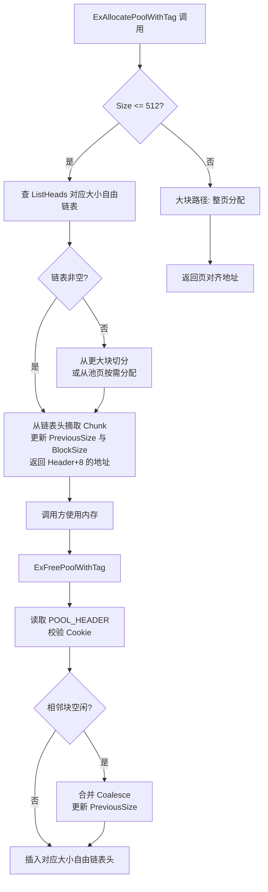
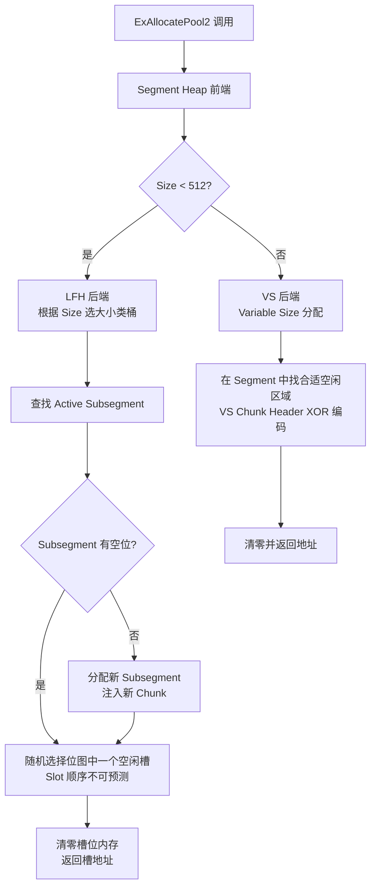
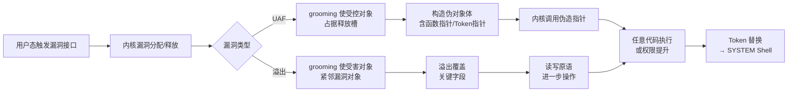

---
tags:
  - Windows
  - 内核
  - tier3
  - 内核利用
  - 安全
---
# 内核池风水与高级利用技术

> [!abstract] TL;DR
> 内核池（Kernel Pool）是 Windows 内核的动态内存分配器，分配对象的相对布局可被攻击者精确控制。"池风水"（Pool Grooming/Spray）是通过大量喷射受控对象、释放特定槽位、再触发漏洞分配，使溢出/UAF 操作恰好命中目标结构的堆布局技术。Windows 10 19H1（1903）引入基于 Segment Heap 的内核池重构，21H1 全面生效，大幅改变了经典 grooming 的假设前提。理解这一演进——包括旧 `ExAllocatePoolWithTag` 时代的 `POOL_HEADER` 元数据、新 Segment Heap 的 VS/LFH 后端、喷射对象选择（命名管道/WNF/PipeAttribute/IoRing）、现代缓解机制（pool zeroing、type isolation、safe unlinking）——是内核漏洞研究与防御分析的核心基础。

## 概述与定位

内核池利用是操作系统安全研究中技术门槛最高的分支之一。不同于用户态堆利用，内核池操作发生在 Ring 0，任何解引用错误都直接触发 Bug Check（蓝屏），调试窗口极为狭窄。与此同时，内核池对象的布局直接决定了溢出后覆盖哪块数据、UAF 读写操作落在哪个结构，因此攻击者必须先"整理"内存布局，再触发漏洞。这个"整理"过程就是池风水的核心。

本篇在系列定位上是第 13 篇「内核漏洞与利用基础」的进阶专章。第 13 篇已覆盖七类漏洞概念、Token 窃取路径、SMEP/KASLR/HVCI 缓解的基本原理，并一笔带过"池头 Cookie 随机化"和"池风水"。本篇则完整展开：从分配器内部结构到 grooming 算法，从经典 Windows 7/8 时代的技术到 Win10/11 Segment Heap 引入后的现代技术变迁，再到缓解机制如何从根本上改变利用假设。

全文以**防御性研究视角**展开：解释技术原理，分析真实 CVE 案例的利用思路，重点说明缓解机制"为什么有效"以及"哪些情形下仍有局限"。

## 原理与机制

### 内核池的基本概念

Windows 内核需要在运行时为驱动对象、IRP、文件控制块（FCB）、PEB/TEB 镜像等大量内部结构分配内存。这些内存不能使用用户态的 `malloc`/`HeapAlloc`，而是通过 Executive 内存管理器提供的内核池 API 分配。

**主要分配 API（旧接口，Win7–Win10 早期版本）：**

```c
// 分配内核池内存（带标签）
PVOID ExAllocatePoolWithTag(
    POOL_TYPE PoolType,   // NonPagedPool / PagedPool / NonPagedPoolNx 等
    SIZE_T    NumberOfBytes,
    ULONG     Tag         // 四字节 ASCII 标签，如 'kcbN'
);

// 释放
VOID ExFreePoolWithTag(PVOID P, ULONG Tag);
```

**新接口（Win10 21H1+ 推荐）：**

```c
PVOID ExAllocatePool2(
    POOL_FLAGS Flags,     // POOL_FLAG_NON_PAGED / POOL_FLAG_PAGED / POOL_FLAG_NON_PAGED_EXECUTE
    SIZE_T     NumberOfBytes,
    ULONG      Tag
);
```

`ExAllocatePool2` 与 `ExAllocatePoolWithTag` 在行为上的关键区别：前者**默认将分配的内存清零**（zero-on-alloc），后者返回的内存内容是未定义的（"脏内存"）。这一差异对利用路径有重大影响，后文详述。

### Pool Type：三类内核池

| Pool Type | 常量 | 说明 |
|---|---|---|
| Non-Paged Pool | `NonPagedPool` / `NonPagedPoolNx` | 永远驻留物理内存，可在任意 IRQL（含 DISPATCH_LEVEL）访问；NX 变体不可执行 |
| Paged Pool | `PagedPool` | 可被换出到页面文件，只能在 IRQL ≤ APC_LEVEL 访问 |
| Session Pool | `PagedPoolSession` | 与会话（Session）关联的分页池，Win32k 等会话驱动使用 |

从攻击角度看，`NonPagedPool` 是最常被利用的目标，因为：其内容永远在内存中（不会在利用过程中被换出导致访问故障），且历史上非分页池缺乏 SMEP-bypass 所需的可执行标记（NX 变体解决了这个问题）。

### Pool Tag：标签与诊断

每次分配都关联一个 4 字节标签（Pool Tag），例如 `MmNd`（内存管理器非分页）、`Pipe`（命名管道）、`WNFn`（WNF 通知）。这一设计主要用于内存泄漏诊断（`!poolused` WinDbg 命令），但也是逆向分析中识别内核对象类型的关键线索。

### 旧版内核池的内部结构（Windows 7–Windows 10 早期）

在引入 Segment Heap 之前，Windows 内核池使用一套类似用户态早期 ntdll 堆的分配器。每个分配块都以 `_POOL_HEADER` 结构开头（8 字节对齐，占 8 字节）：

```
+------------------+
|  _POOL_HEADER    |  ← 8 字节元数据头
+------------------+
|  分配的内容区域   |  ← 调用者使用的实际内存
+------------------+
```

`_POOL_HEADER` 结构（x64，8 字节）：

```
bits  0-7:   PreviousSize（前一块大小，以 16 字节为单位）
bits  8-15:  PoolIndex（使用的池索引）
bits 16-19:  BlockSize（本块大小，以 16 字节为单位）
bit  20:     PoolType（0=NonPaged, 1=Paged）
bits 21-31:  PoolIndex 高位等
bits 32-63:  PoolTag（4 字节 ASCII 标签）
```

关键点：
1. `PreviousSize` 和 `BlockSize` 形成了一个双向链接结构，允许分配器在释放时找到相邻块并进行合并（coalescing）。
2. 分配粒度为 16 字节（`POOL_HEADER` 本身占 8 字节，剩余 8 字节是最小有效载荷）。
3. Windows Vista 引入了 Pool Header Cookie（`ProcessBilled`/`Cookie` 字段），用于检测 `POOL_HEADER` 的损坏。但 Cookie 的校验逻辑有时被绕过——这正是经典 Windows 7 池溢出利用的核心挑战之一。

**自由链表（Free List）管理：**

内核池维护一组按大小分组的自由链表（`POOL_DESCRIPTOR.ListHeads[N]`，N 代表块大小索引）。当分配请求到来时，分配器优先从对应大小的自由链表头部摘取一个空闲块。如果自由链表为空，则从更大的块切分（cutting）或从系统页面分配新的池页。

这种"优先从自由链表头部满足请求"的行为，是经典 pool grooming 的可利用性前提：攻击者可以精确控制特定大小的自由链表状态，从而预测下一次分配的位置。

### Segment Heap 内核池（Windows 10 19H1+ 正式引入，21H1 全面生效）

微软从 Windows 10 1903（19H1）开始在内核池中引入 Segment Heap（段堆）架构，最终在 Windows 10 21H1 中完全替换旧的分配器。这一变化从根本上改变了攻击模型。

**新架构的核心组件：**

```
NT 内核池 (Win10 21H1+)
├── Non-Paged Pool  → SegNonPagedPool
│    ├── VS 后端 (Variable Size)  — 大块 (>= 512 字节)
│    └── LFH 后端 (Low Fragmentation Heap) — 小块 (< 512 字节，按大小类分桶)
└── Paged Pool → SegPagedPool
     ├── VS 后端
     └── LFH 后端
```

**VS（Variable Size）后端：**
- 管理 512 字节以上的分配。
- 内存以"段"（Segment）为单位从虚拟地址空间申请，段内按需分割。
- 每个分配单元有自己的元数据，但不再是连续嵌在有效载荷旁边的简单固定头部结构——元数据与有效载荷的相对关系更复杂，溢出覆盖元数据的难度更高。

**LFH（Low Fragmentation Heap）后端：**
- 管理 512 字节以下的分配，按大小类（size class）分桶管理，每个大小桶独立管理一组"子段"（Subsegment）。
- 同一大小类的分配在物理上紧密排列，这为攻击者提供了新的布局可预测性——但也引入了随机化（Subsegment 内的分配槽以随机顺序使用）。
- LFH 槽位之间**不存在可溢出覆盖的元数据头**，溢出只能覆盖到下一个对象的有效载荷本身，这使得对象选择更为关键。

**`POOL_HEADER` 的消失：**
在 Segment Heap 模式下，`ExAllocatePool2`/`ExAllocatePoolWithTag`（包装为 `ExAllocatePool2` 语义）返回的地址不再是紧跟 `POOL_HEADER` 之后的位置——旧的 `-8` 偏移寻找 `POOL_HEADER` 的技巧在新架构上失效。这直接使依赖覆盖 `POOL_HEADER.PoolType` 的某些提权技术（历史上的 DOS/UAF 利用）失效。

## 结构/算法/伪代码详解

### 经典 Pool Grooming 流程（旧版分配器）

池风水的目标是：在触发漏洞的那次分配，使漏洞对象（victim object，即被溢出覆盖或被 UAF 引用的对象）恰好位于利用者可控的数据旁边。

```
阶段 1：池填充（Spray）
─────────────────────────────────────────────
for i in range(N):
    handle[i] = CreateNamedPipe(...)  # 分配 PipeAttribute 或 FCB 对象
# 目的：填满对应大小的池 chunk，减少"野空洞"

阶段 2：制造空洞（Controlled Hole）
─────────────────────────────────────────────
for i in even_indices:
    CloseHandle(handle[i])  # 释放偶数索引对象，形成等间距空洞
# 自由链表头: → [slot_0] → [slot_2] → [slot_4] → ...

阶段 3：放置受害者对象（Victim Placement）
─────────────────────────────────────────────
victim_handle = CreateEvilObject(same_size)
# 分配器从自由链表头摘取 slot_0，victim 落在 slot_0

阶段 4：触发漏洞（Trigger）
─────────────────────────────────────────────
trigger_vulnerability()
# 漏洞分配落在 slot_2（下一个自由块），
# 溢出写刚好覆盖 slot_0 中 victim 的后半部分，
# 或 UAF 引用 slot_0 中已被替换的 victim
```

这一流程的关键假设：
1. 自由链表以 LIFO 顺序满足请求（先进后出，最近释放的块优先被再用）。
2. 同等大小的分配从同一个自由链表满足（大小必须一致，含对齐填充）。
3. 池页内部连续，相邻槽位的相对位置固定。

旧版分配器在 Windows 7/8 时代完美满足以上条件，因此 grooming 相当可靠。

### 现代 Segment Heap 下的 Grooming 变化

Segment Heap 引入后，以上假设被打破：

1. **LFH 的随机化分配顺序**：LFH 子段内的槽位不是顺序分配，而是以随机顺序（通过位图中的随机游走）标记并使用。攻击者无法通过释放偶数索引对象来精确预测下一次分配落在哪里。
   - 绕过思路：通过喷射**足够大量**的对象，使 LFH 子段几乎耗尽，此时剩余槽位减少，布局可预测性相对提升；或利用特殊对象突破 LFH 落在 VS 后端（> 512 字节的分配不走 LFH）。

2. **VS 后端元数据不可读（隔离）**：VS 后端的元数据头设计更复杂，且利用 Safe Unlinking（双向链表操作时校验前后指针一致性）阻止经典的"修改 FreeList 指针"技巧。

3. **ExAllocatePool2 零化**：新 API 默认清零返回的内存，使依赖"旧内容残留"的信息泄露利用路径关闭。

**现代 Grooming 的核心思路转变**：

与其控制精确的 slot 位置，现代技术更关注**对象大小设计**——选择溢出/UAF 大小完全匹配某个已知语义对象，然后通过大量喷射使该大小类的 LFH 桶中几乎全是受控对象，当漏洞触发时，即使落点随机，命中受控对象的概率也极高（"概率性 grooming"）。

### 喷射对象的选择（现代技术，Win10/11）

好的喷射对象需要满足：大小可控（或有多个预定义大小可选）、从用户态可触发大量分配、分配后用户态可读写部分内容（最好整个对象体）、包含有趣的内核指针或权限字段。

**命名管道（Named Pipe）：`Pipe`/`FILE_PIPE_LOCAL_NODE`**
- 历史经典喷射对象，Win7/8 时代大量 CVE 利用。
- 通过 `CreateNamedPipe`/`CreateFile` 分配，大小不完全可控，但可通过特定参数影响。
- Win10 后 Pipe 对象在安全性上被加固。

**WNF（Windows Notification Facility）：`WNFn`**
- `NtCreateWnfStateName` 可分配大小精确可控的内核对象（通过 `MaximumStateSize` 参数指定数据缓冲区大小）。
- 分配后可通过 `NtUpdateWnfStateData` 写入数据、`NtQueryWnfStateData` 读取数据，是极佳的读写原语配合对象。
- WNF 对象的 `Data` 部分在非分页池分配，适合配合非分页池漏洞利用。
- 自 Windows 11 22H2 后，部分 WNF 路径引入了额外校验，限制了其作为通用读写原语的能力。

**Pipe Attribute（`NpAttr`）：**
- 通过 `NtFsControlFile(FSCTL_PIPE_SET_CLIENT_PROCESS_ID)` 等 FSCTL 在命名管道句柄上附加属性，分配一个固定大小的 `NPF_ATTRIBUTE` 结构。
- 属性对象大小固定（约 0x60 字节左右），适合 32–128 字节的漏洞槽位。
- 多个属性可链式附加，灵活度较高。

**IoRing（`IORg`，Win11 22H2+）：**
- `NtCreateIoRing` 分配 IoRing 提交/完成队列，缓冲区大小高度可控（2 的幂次方，范围宽）。
- IoRing 的提交条目内容由用户态完全控制，是目前最灵活的喷射原语之一。
- 相关研究（如 Rex Guo/Yarden Shafir 等）详细分析了其在现代 Windows 上的喷射能力。

**Desktop Heap（`Desk`，Win32k）：**
- 通过创建大量 GUI 对象（`CreateWindow`、`CreateMenu` 等）在 Win32k Session 池中喷射。
- 主要用于 Win32k 相关漏洞（第 28 篇「GDI/Win32k 攻击面」将详细覆盖）。

### Pool Grooming 与 UAF 的组合：利用原语构建

单纯的布局控制只是第一步。内核利用通常需要构建以下原语链：

```
漏洞原语（UAF/溢出）
    ↓ grooming 使目标对象就位
可控写原语（arbitrary write primitive）
    ↓ 修改内核数据结构
权限提升（Token 窃取 / ACL 修改）
```

以一个典型的**内核对象 UAF** 为例：

```
1. 分配 ObjectA（大小 = 0x80）
2. 触发 UAF：ObjectA 被释放，但指针仍被内核某处引用
3. Grooming：喷射大量 WNF Data 对象（大小 = 0x80），
   其中一个落在 ObjectA 原来的内存位置
4. 通过 NtUpdateWnfStateData 向 WNF 对象写入精心构造的假 ObjectA 结构
5. 内核通过残留指针调用 ObjectA 的虚函数/方法指针
   → 跳转到 WNF Data 中伪造的函数指针
   → 执行任意内核代码（或先执行 arbitrary write）
```

以一个典型的**内核堆溢出**为例：

```
1. 分配 VictimObject（含 TOKEN_POINTER 字段，大小 = 0x100）
2. Grooming：使 VictimObject 紧邻漏洞对象之后
3. 触发漏洞：漏洞对象向高地址溢出 N 字节，覆盖 VictimObject.TOKEN_POINTER
4. 通过 Token 替换（将 TOKEN_POINTER 改为 SYSTEM Token 地址）完成提权
```

### 关键数据结构快速参考

```
_POOL_HEADER（旧版，8 字节）:
  +0x00  USHORT   PreviousSize;  // 前一块大小 / 16
  +0x02  UCHAR    PoolIndex;
  +0x03  UCHAR    BlockSize;     // 本块大小 / 16
  +0x04  ULONG    PoolTag;       // ASCII 4字节标签

POOL_DESCRIPTOR（旧版池描述符）:
  +0x000  POOL_TYPE    PoolType;
  +0x008  ULONG        PoolIndex;
  +0x040  LIST_ENTRY   ListHeads[POOL_LIST_HEADS];  // 按块大小分组的自由链表

_HEAP_VS_CHUNK_HEADER（Segment Heap VS 后端，x64）:
  Sizes、Flags 等字段通过 XOR 编码，防止元数据篡改
  
_HEAP_LFH_SUBSEGMENT:
  +0x000  _HEAP_LFH_SUBSEGMENT_ENCODED_OFFSETS  EncodedOffsets;
  +0x008  ULONGLONG  FreeCount;
  +0x010  ULONGLONG  BlockCount;
  // ... 位图管理分配槽
```

### 流程图：旧版 Pool 分配器核心路径



### 流程图：Segment Heap LFH 分配路径



## 工具视角与实战

### WinDbg 内核池分析命令

内核调试中，分析池状态是定位利用过程和池损坏的核心手段。

**`!pool` 命令：分析单个地址所在的池块**

```
kd> !pool ffffd000`12345678
Pool page ffffd00012345000 region is Nonpaged pool
 ffffd00012345000 size:   50 previous size:    0  (Allocated)  MmNd
*ffffd00012345050 size:   80 previous size:   50  (Allocated) *Pipe
  Pooltag Pipe : Npfs, Binary: npfs.sys
 ffffd000123450d0 size:   40 previous size:   80  (Free)       ....
```

输出解读：每行一个 Pool Chunk，包含起始地址、大小（十六进制，单位字节）、前一块大小、状态（Allocated/Free）和 Pool Tag。`*` 标记表示查询地址所在的块。

**`!poolused` 命令：统计所有 Pool Tag 的内存用量**

```
kd> !poolused 4     # 4=仅显示 NonPaged Pool
NP   Pool           Used blocks   Used bytes   Tag
--   ----------     -----------   ----------   ---
     NonPagedPool         52341      8234512   Pipe
     NonPagedPool         12000      2400000   WNFn
     ...
```

用于检测内存泄漏（某个 Tag 的 Used bytes 异常偏高）或 spray 后的分布情况。

**`!analyze -v` 与 Pool 损坏诊断**

当 Bug Check 代码为 `0x19 BAD_POOL_HEADER` 时，`!analyze -v` 会自动定位损坏的 Pool Header，并尝试还原其前后的池布局。

```
kd> !analyze -v
BUGCODE_ID_DRIVER (0xd1) or BAD_POOL_HEADER (0x19)
...
POOL_ADDRESS: ffffd00012345050 -- Nonpaged pool
POOL_TAG_PREVIOUS: Pipe
Expected checksum: ...
Actual checksum: ...
```

**`dt nt!_POOL_HEADER` 直接解析结构（旧版）**

```
kd> dt nt!_POOL_HEADER ffffd00012345050-8
   +0x000 PreviousSize     : 0xa
   +0x002 PoolIndex        : 0 ''
   +0x003 BlockSize        : 0x8
   +0x004 PoolTag          : 0x65706950   'Pipe' (字节序反转)
```

**查看 Segment Heap 状态（Win10 21H1+）**

旧 `_POOL_HEADER` 在 Segment Heap 路径下不再有效。应通过以下方式分析：

```
kd> !heap -s           # 查看系统堆（内核池挂载点）
kd> !heap -x <addr>   # 查找地址归属的段和块
```

注意：WinDbg 的 `!heap` 扩展在内核模式下支持 Segment Heap，但 symbol 支持需要完整的 NT 内核符号（`srv*...`)。

### 真实 CVE 分析：CVE-2021-31956（NTFS 内核池溢出）

CVE-2021-31956 是 Windows NTFS 驱动（`ntfs.sys`）中一个通过 `NtQueryVolumeInformationFile` 触发的非分页池溢出漏洞（CVSS 7.8，提权），在 2021 年 6 月补丁日修复前被野外利用（Zero-day）。

**漏洞成因（简化）：**

`ntfs.sys` 在处理 `FileFsFullSizeInformation`（文件系统卷信息）查询时，使用了一个基于 `IrpSp->Parameters.QueryVolume.Length` 的整数计算。当用户提供的 `Length` 值满足特定条件时，触发整数运算溢出，导致后续的 `ExAllocatePoolWithTag` 分配的缓冲区比实际写入的数据小，发生堆溢出。

**溢出大小：** 约 0x10 字节（16 字节）的可控越界写。

**Pool Grooming 路径（防御分析，已有补丁）：**

攻击者（Kaspersky 在野捕获样本的分析）使用了以下 grooming 方案：

1. **目标池类型：非分页池，大小类约 0xC0 字节。**
2. **Spray 对象：`WNF State Data`（标签 `WNFn`）**，通过 `NtCreateWnfStateName` + `NtUpdateWnfStateData` 大量分配 0xB0–0xC0 字节大小的 WNF 数据块，使非分页池该大小类被大量 WNF 对象填充。
3. **Release-n-Spray：** 释放一半 WNF 对象，制造空洞，再触发 NTFS 漏洞分配（大小恰好与 WNF 数据块同大小类），使溢出的 NTFS 缓冲区紧邻一个 WNF 数据块。
4. **溢出写：** 16 字节越界写覆盖 WNF 数据块的**部分头部**，修改其 `DataSize` 字段使其"认为"自身持有更大的数据区域。
5. **读写原语：** 通过 `NtQueryWnfStateData` 读取被修改 WNF 对象的"扩展"数据，实现**越界读**（information leak，泄露相邻对象指针）；通过 `NtUpdateWnfStateData` 写入"扩展"区域，实现**越界写**（修改相邻对象内容）。
6. **Token 替换：** 利用越界写修改相邻对象的 Token 指针，将进程 Token 替换为 SYSTEM Token 指针，完成提权。

**补丁策略：** 修复了长度计算的整数溢出，使分配的缓冲区大小始终 ≥ 实际写入量，从根本上消除溢出。

### 利用路径总览（防御视角）



### 使用 Driver Verifier 辅助检测

Driver Verifier（`verifier.exe`）是微软提供的驱动调试工具，可在内核层面启用额外的池监控：

- **Pool Tracking**：追踪每次分配/释放，检测内存泄漏和双重释放。
- **Special Pool**：将每次分配放在页边界，使越界访问立即触发页错误（精确定位溢出位置）。
- **Fault Injection**：随机使分配失败，测试驱动的错误处理路径。

启用命令（开发/测试环境，非生产）：
```
verifier /standard /driver mydriver.sys
```

Special Pool 是定位微小堆溢出的最有效工具——它将每个分配放在一个独立的页末尾（下一页设置为 No-Access），任何哪怕 1 字节的越界写都立即导致 `0xC5 DRIVER_CORRUPTED_EXPOOL` Bug Check。

## 安全性与正确使用

> [!caution]
> **重要免责与使用边界：**
>
> 本篇所描述的内核池风水技术、对象喷射方法、漏洞利用链构建思路，**仅适用于以下合法场景**：
> 1. **授权 CTF 竞赛**（如 pwn2own、DEF CON CTF）中的靶机系统；
> 2. **自有靶场环境**（本人搭建、未连接生产网络的虚拟机）；
> 3. **防御性漏洞研究**——分析已公开补丁的历史 CVE，理解缓解机制的有效性边界；
> 4. **安全产品开发**（EDR/HIPS 检测规则研究，需配合相应授权）。
>
> **本篇不提供**、也不意图提供针对真实未授权系统的完整武器化 exploit 代码。所有技术细节均来自已发布的安全研究、CVE 公告和操作系统逆向文献，重点在于理解"缓解机制为何有效"而非"如何规避缓解"。
>
> 未经系统所有者书面授权，对他人 Windows 系统实施内核级攻击属于严重违法行为（中国《网络安全法》第 27、44 条，美国 CFAA 等）。

### 现代 Windows 缓解机制的有效性分析

理解缓解机制是防御工作的核心。以下逐项分析：

**1. Pool Zeroing（ExAllocatePool2 默认零化）**

有效性：**高**。消除了"重用旧内容"类信息泄露。历史上许多漏洞需要先通过 UAF 读取旧对象残留的内核指针来绕过 KASLR，Zero-on-alloc 直接切断这条路径，迫使攻击者寻找独立的信息泄露原语。

局限：不影响溢出类漏洞（溢出写的目标是相邻分配的活跃对象，而非刚释放的旧内容）。

**2. Safe Unlinking（双向链表操作完整性校验）**

有效性：**中-高**。使"修改 FreeList bk/fd 指针实现任意写"的经典技巧失效。分配器在从自由链表摘取块时，会校验 `ListEntry.Blink->Flink == &ListEntry`，若不一致则触发 `BAD_POOL_HEADER`。

局限：仅防止对自由链表指针本身的攻击，不防止对分配块有效载荷（活跃对象内容）的溢出。

**3. KASLR（内核地址空间布局随机化）**

有效性：**中**（需配合其他缓解）。使攻击者无法硬编码内核符号地址，必须先泄露内核基址或目标对象地址。

局限：若存在独立的信息泄露路径（如非授权的 `NtQuerySystemInformation` 调用、旁路信道、低权限用户可访问的内核地址信息），KASLR 可被绕过。Windows 10 RS4 后限制了普通用户对 `SystemBigPoolInformation` 等的访问，减少了 KASLR 旁路。

**4. Pool Randomization（Segment Heap LFH 随机槽位）**

有效性：**中**。使经典的"释放偶数索引、精确预测分配位置"的确定性 grooming 失效。攻击者转向"概率性 grooming"（大量喷射+重试）。

局限：概率性方法虽然成功率降低，但结合足够的重试次数，在某些内核接口无限制调用的场景下仍可收敛。

**5. Type Isolation（对象类型隔离，仍在推进中）**

有效性：**高**（当完全实现时）。若不同类型的对象分配在不同的内存区域，溢出从某类型对象无法覆盖到另一类型对象（即使大小相同）。Windows 内核正在逐步引入更细粒度的类型隔离，如将 `NonPagedPoolNx` 和 `NonPagedPool`（旧可执行）物理隔离。

局限：完整的对象类型隔离实现成本高，Windows 中目前仅在特定对象类别上实现，通用内核对象尚未完全隔离。

**6. Pool Quota（池配额限制）**

有效性：**低-中**（针对 DOS，对利用防御有限）。每个进程/会话的内核池使用量有上限，防止单个进程耗尽内核池（内存耗尽式 DOS）。但针对提权利用，攻击者通常不需要分配超限数量的对象。

**7. SMEP/SMAP + DEP（数据执行保护在内核地址）**

有效性：**高**（与池利用结合分析）。SMEP 阻止内核模式执行用户态页面的代码，SMAP 阻止内核模式访问用户态内存。即使攻击者通过池利用控制了内核函数指针，也无法简单地将指针指向用户态 shellcode，必须在内核代码本身中构造 ROP 链。这大幅增加了利用复杂度，但并不使利用不可能——内核 ROP 链依然可行。

### 防御工程师的实践建议

1. **内核驱动开发：全面迁移至 ExAllocatePool2**，利用其零化语义消除信息泄露风险，同时按 `POOL_FLAG_NON_PAGED` / `POOL_FLAG_PAGED` 语义使用，避免旧的 `NonPagedPool`（可执行）类型。

2. **启用 Driver Verifier（开发阶段）**：至少启用 Standard 设置（Pool Tracking + I/O Verification + Deadlock Detection），在测试阶段发现堆损坏早于生产环境。Special Pool 选项性能影响较大，但对定位精确的越界写非常有效。

3. **监控大量内核对象的突然创建**：EDR 产品可通过 ETW 内核对象创建事件（Process/Thread 对象有内置回调，其他对象类型可通过 `ObRegisterCallbacks`）检测异常喷射模式——短时间内单个进程创建数千个命名管道或 WNF 状态名属于可疑行为。

4. **保持 Windows 补丁更新**：内核池漏洞（如 CVE-2021-31956）是高危提权路径，每月安全更新应及时部署。延迟补丁意味着攻击者的 grooming 技术可以对这些漏洞形成完整利用链。

5. **HVCI 启用（Hypervisor-Protected Code Integrity）**：HVCI 通过硬件虚拟化保护内核内存页权限，使攻击者即使控制了内核写原语，也无法修改内核代码页（绕过 DEP）。这是目前防御内核利用最高效的硬件缓解。参见第 12 篇。

## 小结

内核池风水是一门将分配器行为分析、对象语义理解和漏洞触发时序精确配合的技艺。从 Windows 7 时代基于 `POOL_HEADER` 链表的确定性 grooming，到 Windows 10/11 Segment Heap 引入 LFH 随机化和 VS 后端元数据保护，攻击与防御在这一领域经历了多轮演进。

关键要点梳理：

- 旧版 `ExAllocatePoolWithTag` + `POOL_HEADER` 体系在 Win10 21H1 后被 Segment Heap 替代，`ExAllocatePool2` 是新标准 API，默认零化内存。
- Segment Heap LFH 后端的随机槽位分配打破了确定性 grooming，现代攻击转向概率性大规模喷射。
- 喷射对象选择从命名管道演进到 WNF、PipeAttribute，再到 IoRing，每一代技术的演进都反映了内核安全机制的收紧。
- 池利用的缓解是多层次的：Zero-on-alloc（消息息泄露）、Safe Unlinking（阻止链表指针攻击）、KASLR（提高地址不确定性）、LFH 随机化（减少布局可预测性）、SMEP/SMAP/HVCI（阻断最终代码执行路径）。这些缓解互相补充，单层突破已不足以形成完整利用链。
- 理解这些缓解"为何有效"，是防御工程师设计检测规则、评估驱动安全性的核心基础。

对于安全研究者：分析已有补丁的 CVE（如 CVE-2021-31956）是学习 grooming 技术最安全、最合法的途径；配合 WinDbg + Driver Verifier 在本地靶机上复现，可以建立对池布局行为的直觉认识。

## 相关阅读

- **本系列其他章节**：
  - [第 06 篇：内核内存管理]（分页/非分页池基础、VAD）
  - [第 07 篇：WinDbg 内核调试]（`!pool`/`!poolused`/`!analyze` 命令详解）
  - [第 13 篇：内核漏洞与利用基础]（七类漏洞概念、Token 窃取、SMEP/KASLR 基础）
  - [第 12 篇：PatchGuard 与 DSE 与 HVCI]（HVCI 作为池利用的最终防线）

- **外部文献**（公开安全研究）：
  - Kaspersky SecureList：「PuzzleMaker uses Chrome zero-day chain with novel Windows LPE exploit」（CVE-2021-31956 野外利用分析）
  - Yarden Shafir & Alex Ionescu：「Sheep Year Kernel Queue: Unlocking the NonPaged Pool」（2017, SegHeap 早期分析）
  - Rex Guo & Yarden Shafir：「Taking a page from the kernel's book: Pool spraying with IoRing」（2022）
  - j00ru：「Windows Kernel Pool Spraying Fun - Part 1–4」（经典博客系列）
  - Connor McGarr：「Windows Kernel Exploitation – Pool Feng Shui」

---

[[00.Windows内核与驱动逆向总览|⬆ 系列总览]] | [[25.HyperV架构与VBS|← 上一章]] | [[27.BYOVD攻击链与驱动供应链|→ 下一章]]
