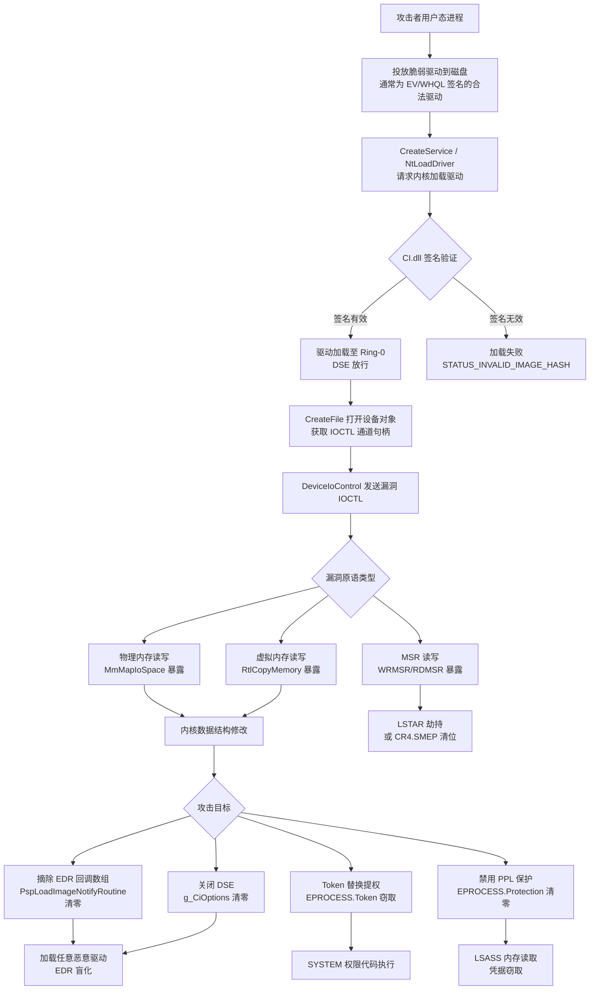

---
tags:
  - Windows
  - 内核
  - tier3
  - BYOVD
  - 安全
---
# BYOVD 攻击链与驱动供应链安全

> [!abstract] TL;DR
> BYOVD（Bring Your Own Vulnerable Driver）是将具有合法数字签名但含已知内核漏洞的驱动程序投放到目标系统并加以利用的攻击手法。攻击者借助驱动的 Ring-0 特权获取内核任意内存读写原语，进而禁用 EDR 回调、关闭驱动签名强制（DSE）或实施持久化。该手法已成为 APT 组织和勒索软件团伙突破终端安全产品的首选内核路径。本章从攻击链全流程、核心漏洞原语、典型恶意驱动工具、微软阻止机制与蓝队检测体系四个维度进行完整剖析。

---

## 概述与定位

### 为什么 BYOVD 成为主流内核攻击手法

自 Windows Vista 引入驱动签名强制（Driver Signature Enforcement，DSE）并在 x64 平台强制执行以来，攻击者要在内核态执行任意代码的门槛大幅提高——不再可以直接加载未签名的恶意驱动。然而，签名验证保证的只是文件来源（代码签名证书链信任），而不是代码逻辑安全。

一个持有合法 EV（Extended Validation）证书或通过微软 WHQL（Windows Hardware Quality Labs）认证的驱动，同样可能包含任意写、任意读、MSR 读写或内核函数调用等高危漏洞。这类漏洞往往来自驱动开发商自身的错误（边界未检查的 IOCTL 处理器、直接暴露物理内存映射接口等），在驱动发布多年后被安全研究者或攻击者发现。

BYOVD 的核心逻辑是"绕过签名检查的方式不是伪造签名，而是直接使用真实签名的脆弱驱动"。由于驱动已签名，Windows 内核的 `CI.dll` 代码完整性验证会放行加载，DSE 不会阻止。一旦驱动运行于 Ring-0，攻击者通过 IOCTL 接口控制驱动执行漏洞功能，从用户态实现对内核结构的任意写入。

### 在本系列中的位置

| 相关章节 | 关联点 |
|----------|--------|
| 第 12 章：PatchGuard、DSE 与 HVCI | DSE 机制与 HVCI 如何阻断 BYOVD |
| 第 09 章：内核回调机制 | BYOVD 最常见目标——摘除 EDR 回调 |
| 第 13 章：内核漏洞利用基础 | 任意写原语的上层利用路径 |
| 第 20 章：Windows 安全机制与对抗全景 | WDAC 与驱动阻止策略体系 |
| 第 03 章：WDM 驱动模型与 IRP | IOCTL 派发机制（被滥用的攻击面） |

BYOVD 是"驱动签名不等于驱动安全"这一核心矛盾的集中体现，也是当前内核对抗领域最活跃的研究方向之一。

---

## 原理与机制

### 完整攻击链概览

BYOVD 攻击从用户态出发，最终实现内核态任意操作，完整路径如下：

```
[攻击者用户态进程]
    │
    ├─ 1. 将脆弱驱动 .sys 投放到磁盘
    │      （通常捆绑在 Dropper / Loader 中）
    │
    ├─ 2. 使用 NtLoadDriver / CreateService 加载驱动
    │      CI.dll 验证签名 → 通过（驱动合法签名）
    │      DSE 放行加载
    │
    ├─ 3. 打开驱动设备对象句柄
    │      CreateFile("\\\\.\\<设备名>")
    │
    ├─ 4. 发送精心构造的 IOCTL
    │      DeviceIoControl(hDev, IOCTL_XXX, InBuf, OutBuf)
    │
    ├─ 5. 驱动内核代码执行漏洞功能
    │      ├─ 任意物理内存读写
    │      ├─ 任意虚拟内存读写（MmMapIoSpace / MmCopyMemory）
    │      └─ MSR 读写（WRMSR/RDMSR 直接执行）
    │
    └─ 6. 通过写原语实现攻击目标
           ├─ 摘除 EDR 内核回调（PsSetLoadImageNotifyRoutine 等）
           ├─ 修改 g_CiEnabled / g_CiOptions 关闭 DSE
           ├─ 令牌替换提权（EPROCESS.Token 窃取）
           └─ 关闭 LSASS 保护（修改 EPROCESS.Protection 字节）
```

### 驱动加载机制与 DSE 放行条件

Windows 内核在加载驱动时经过以下验证链（以 x64 非 HVCI 模式为例）：

1. `IoLoadDriver` → `MmLoadSystemImage`：将 PE 映射到系统空间
2. 调用 `CI.dll!CiValidateImageHeader`：验证 Authenticode 签名
   - 读取 PE 的证书目录（`IMAGE_DIRECTORY_ENTRY_SECURITY`）
   - 构建证书链，验证根 CA 信任
   - 比对文件哈希与签名中的哈希
3. 签名有效 → `g_CiEnabled` 检查标志放行
4. `MmLoadSystemImage` 完成后回调 `PsCallImageNotifyRoutines`

BYOVD 驱动在步骤 2 通过了验证，因此整个流程正常放行。**关键点在于**：签名验证只检查文件完整性与发布者身份，不检查代码逻辑是否存在安全漏洞。

### 漏洞原语类型详解

#### 类型 1：任意物理内存读写

最危险的原语类别。部分驱动（如超频工具、硬件诊断工具）为实现底层硬件访问，通过 IOCTL 暴露了对物理地址的映射与读写能力，内部实现通常为：

```c
// 驱动内部漏洞实现（以 RTCore64.sys 风格为例）
case IOCTL_MAP_PHYS_MEM: {
    PHYSICAL_ADDRESS physAddr;
    physAddr.QuadPart = inputBuffer->PhysicalAddress;  // 完全信任用户输入
    ULONG size = inputBuffer->Size;
    
    PVOID mapped = MmMapIoSpace(physAddr, size, MmNonCached);
    // mapped 指向任意物理地址，返回给用户态
    outputBuffer->VirtualAddress = (ULONG64)mapped;
    break;
}
```

攻击者通过此 IOCTL 可以将任意物理内存页映射到内核虚拟空间，进而读取或修改 `ntoskrnl.exe` 的内核数据结构（如 `EPROCESS` 链表、内核回调数组等）。

定位目标物理地址的方法：
- 枚举 `MmGetPhysicalAddress(KernelSymbolVA)` → 不能直接调用，需用间接方法
- 通过页目录基址（`CR3` → 页表遍历）将内核虚拟地址转换为物理地址
- 利用固定偏移（特定内核版本的 `.data` 节基址已知）

#### 类型 2：任意虚拟内存读写

部分驱动通过 IOCTL 暴露了对内核虚拟地址的直接读写，例如：

```c
case IOCTL_WRITE_KERNEL_MEM: {
    ULONG64 targetAddr = inputBuffer->TargetAddress;  // 未验证范围
    ULONG size = inputBuffer->Size;
    
    RtlCopyMemory((PVOID)targetAddr, inputBuffer->Data, size);
    // 直接向任意内核虚拟地址写入数据
    break;
}
```

此类原语比物理内存写入更直接，攻击者只需知道目标内核符号的虚拟地址（通过 `NtQuerySystemInformation` 或 `EnumDeviceDrivers` 泄露内核基址后计算偏移）。

#### 类型 3：MSR 读写原语

MSR（Model Specific Register，模型特定寄存器）控制处理器核心行为，其中对攻击者有价值的包括：

| MSR 地址 | 功能 | 攻击用途 |
|----------|------|----------|
| `0xC0000082` | `LSTAR`（64 位系统调用入口） | 重定向系统调用处理器 |
| `0xC0000080` | `EFER`（扩展功能 MSR） | 操控 NXE 位禁用 NX/DEP |
| `0x1D9` | `IA32_DEBUGCTL` | 调试控制寄存器 |

具备 `RDMSR`/`WRMSR` 特权的驱动（正常用途如 CPU 监控软件）若将此能力通过 IOCTL 暴露，攻击者可从用户态读写任意 MSR。WinRing0 驱动即属于此类。

LSTAR MSR 写入攻击示例思路（纯原理说明）：
攻击者通过 MSR 写 IOCTL 将 `LSTAR`（0xC0000082）改写为恶意代码地址，此后所有 `syscall` 指令均进入攻击者控制的代码，实现对全部系统调用的劫持。

#### 类型 4：内核函数执行原语

少数驱动（尤其是测试/调试类驱动）通过 IOCTL 暴露了执行任意内核函数指针的能力，攻击者可以借此直接调用 `ZwTerminateProcess`、`ZwOpenProcess` 等内核 API 完成特权操作。

---

## 结构/算法/伪代码详解

### EDR 内核回调摘除原理

EDR 产品依赖以下内核回调机制实现监控：

```
PsSetCreateProcessNotifyRoutine      → 监控进程创建
PsSetCreateThreadNotifyRoutine       → 监控线程创建
PsSetLoadImageNotifyRoutine          → 监控镜像（DLL/驱动）加载
CmRegisterCallbackEx                 → 监控注册表操作
ObRegisterCallbacks                  → 监控进程/线程句柄操作
```

以 `PsSetLoadImageNotifyRoutine` 为例，注册的回调指针存储在内核全局数组：

```
ntoskrnl!PspLoadImageNotifyRoutine[64]   // 最多 64 个回调槽
```

每个槽位是一个 `EX_CALLBACK_ROUTINE_BLOCK` 结构（内核内部）：

```c
typedef struct _EX_CALLBACK_ROUTINE_BLOCK {
    EX_RUNDOWN_REF        RundownProtect;
    PEX_CALLBACK_FUNCTION Function;       // 回调函数指针
    PVOID                 Context;        // 上下文参数
} EX_CALLBACK_ROUTINE_BLOCK;
```

BYOVD 摘除 EDR 回调的步骤：

```
1. 泄露 ntoskrnl 基址
   ├─ EnumDeviceDrivers() → 用户态可调用，返回加载模块基址列表
   └─ NtQuerySystemInformation(SystemModuleInformation) → 枚举内核模块

2. 计算 PspLoadImageNotifyRoutine 符号地址
   ├─ 从 PDB 符号文件获取 RVA 偏移
   └─ VA = ntoskrnlBase + PDB_RVA

3. 通过 BYOVD 虚拟内存读原语读取数组内容
   for (i = 0; i < 64; i++):
       slot = read_kernel_qword(PspLoadImageNotifyRoutine + i*8)
       if slot != 0:
           // 解码：低 4 位清零 + ExFastRefGetObject 得到 Callback Block 指针
           cbBlock = ExFastRefGetObject(slot)
           funcPtr = read_kernel_qword(cbBlock + offsetof(Function))
           // 确认 funcPtr 指向 EDR 驱动范围 → 标记为目标

4. 通过写原语清零目标槽位
   write_kernel_qword(PspLoadImageNotifyRoutine + target_i*8, 0)
```

注意 Windows 10 2004 起，`PspLoadImageNotifyRoutine` 数组项使用了 `ExFastRef` 编码（低 4 位存引用计数，需清零才是真正指针），BYOVD 工具需正确解码后再操作。

### DSE 关闭原理

关闭驱动签名强制的目标变量：

```
ntoskrnl!g_CiEnabled    (BOOLEAN)   → Windows 8 以前主要开关
ci.dll!g_CiOptions      (ULONG)     → Windows 8+ 主要开关
```

`g_CiOptions` 的有效位含义：

| 位掩码 | 含义 |
|--------|------|
| `0x00` | 禁用代码完整性 |
| `0x06` | 启用（CODEINTEGRITY_OPTION_ENABLED \| UMCI） |
| `0x08` | HVCI 标志（不能仅靠写内存关闭） |

攻击者通过任意写原语将 `g_CiOptions` 清零，即可加载未签名驱动。但此操作在 HVCI 环境下无效：HVCI 在 VTL1 层对页表进行保护，内核虚拟地址对应的物理页受 Hypervisor 控制，即便修改虚拟内存视角的值也会被 SLAT（Second Level Address Translation）拦截。

### EPROCESS Token 替换提权路径

```c
// Token 替换伪代码（通过任意写原语实现提权）
ULONG64 currentEprocess = GetCurrentEPROCESS();  // 通过 _KPCR.Prcb.CurrentThread.ApcState.Process

// 遍历 EPROCESS 活动进程链找到 SYSTEM 进程（PID=4）
ULONG64 systemEprocess = WalkActiveProcessLinks(currentEprocess, target_pid=4);

// 读取 SYSTEM 进程的 Token 字段
// EPROCESS.Token 偏移因 Windows 版本而异，从 PDB 获取
ULONG64 tokenOffset = 0x4B8;  // Windows 10 21H2 示例偏移
ULONG64 systemToken = read_kernel_qword(systemEprocess + tokenOffset);

// 将当前进程的 Token 替换为 SYSTEM Token
write_kernel_qword(currentEprocess + tokenOffset, systemToken);
// 之后当前进程具有 SYSTEM 权限
```

### Mermaid：BYOVD 完整攻击链



---

## 工具视角与实战

### 典型脆弱驱动案例分析

#### RTCore64.sys（微星主板超频工具）

- **签名**：MSI（微星国际）合法 EV 签名，WHQL 认证
- **设备名**：`\\.\RTCore64`
- **漏洞 IOCTL**：
  - `0x80002048`：读取任意内存（8 字节）
  - `0x9C406104`/`0x9C40A104`：写入任意内存（1/2/4/8 字节）
- **攻击工具化**：被 BlackByte 勒索软件、多个开源 EDR killer 工具集成
- **漏洞本质**：IOCTL 处理器未验证用户输入地址范围，直接调用 `MmCopyMemory` 或直接解引用传入的内核地址

RTCore64 写原语 IOCTL 结构体（逆向还原）：
```c
typedef struct _RTCORE64_WRITE_INPUT {
    ULONG64 TargetAddress;    // 目标内核虚拟地址
    ULONG64 Value;            // 写入值
    ULONG   ByteSize;         // 写入字节数（1/2/4/8）
    ULONG   Padding;
} RTCORE64_WRITE_INPUT;
```

#### DBUtil_2_3.sys（Dell 固件更新工具）

- **签名**：Dell Technologies 合法签名
- **CVE**：CVE-2021-21551（CVSS 8.8）
- **设备名**：`\\.\DBUtil_2_3`
- **漏洞**：5 个独立漏洞，包括任意物理内存读写、任意内核内存写入
- **影响范围**：Dell 12 年来发货的设备均预装此驱动（约 30 亿设备）
- **修复情况**：Dell 于 2021 年 5 月发布更新，但旧版驱动在未更新设备上依然存在
- **微软响应**：加入 HVCI 驱动阻止列表

#### gdrv.sys（技嘉主板工具）

- **签名**：GIGABYTE 技嘉合法签名
- **漏洞**：暴露 `MmMapIoSpace` 功能（物理内存任意映射）和端口 I/O 操作
- **被利用**：已知被用于攻击主板固件（修改 UEFI 变量），以及 EDR 禁用场景
- **值得注意**：技嘉在多个驱动版本中存在类似设计模式（"为了兼容性"的过度权限暴露）

#### WinRing0 / WinRing0x64.sys

- **来源**：开源硬件监控库（CPU-Z 等工具使用）
- **签名**：历史版本使用交叉签名（Cross-Signed）证书，Windows 7/8 时期广泛接受
- **漏洞功能**：
  - 任意 RDMSR/WRMSR（通过 IOCTL `0x9C402084`/`0x9C402088`）
  - 任意 I/O 端口读写
  - 直接物理内存访问
- **攻击价值**：MSR 读写可用于关闭 CR4.SMEP/SMAP 保护位（理论路径）
- **现状**：被大量 PC 游戏反作弊软件（如早期 MasterClass）和 EDR killer 工具使用

#### 已知恶意工具链（防御分析视角）

| 工具名称 | 使用的脆弱驱动 | 攻击目的 |
|----------|----------------|----------|
| BlackByte 勒索软件 EDR Killer | RTCore64.sys | 摘除 AV/EDR 回调 |
| AV Killer (Medusa 勒索) | 多个驱动轮换 | 终止 AV 进程 |
| Poortry/Spyboy（Terminator） | PartnerComBI.sys（已盗用证书签名）| 终止 EDR 进程句柄 |
| mhyprot2.sys（原神防作弊被滥用）| mhyprot2.sys | 任意内存读写 |
| Loldrivers 数据库收录案例 | 200+ 已知脆弱驱动 | 各类内核权限操作 |

### LOLDrivers 数据库

LOLDrivers（Living Off The Land Drivers）是由安全研究社区维护的脆弱/恶意驱动数据库，地址为 `loldrivers.io`。数据库收录每个驱动的：

- 文件哈希（SHA-256/MD5）
- 签名者信息（Common Name / Thumbprint）
- 已知漏洞类型与 CVE 编号
- 已知被威胁行为者利用的证据
- 对应 MITRE ATT&CK 技术（T1068、T1553.006 等）

蓝队可将 LOLDrivers 数据库的哈希列表导入 SIEM/EDR 的 IOC 系统，作为驱动加载事件的黑名单基线。

### 驱动供应链问题根源

#### EV 证书盗用

EV（Extended Validation）代码签名证书的签发需要严格的企业身份验证，但攻击者已发展出多种获取途径：

1. **证书盗取**：攻击企业内网，从 HSM 或证书存储中窃取私钥（最直接）
2. **壳公司购买**：通过注册合法企业（即便是空壳公司）购买 EV 证书
3. **地下市场**：在犯罪论坛上购买已签发的 EV 证书（价格通常在数千至数万美元）
4. **WHQL 滥用**：将恶意功能隐藏在通过 WHQL 测试的驱动中，利用测试套件不能覆盖所有代码路径的特性

Poortry/Spyboy 攻击中使用的 `PartnerComBI.sys` 即是通过盗取或购买的 EV 证书签名，且在微软 SysDev 门户（前身 WHQL 门户）通过了 attestation 签名，说明签名体系本身存在被绕过的可能。

#### 交叉签名遗留问题

微软于 2015 年 7 月停止向第三方 CA 颁发交叉签名根证书，但存量的交叉签名证书（Cross-Signed Certificate）有效期可能延续至 2023 年甚至更晚。在此期间，使用旧交叉签名颁发的驱动在默认 Windows 10 系统上仍被视为有效（除非开启 HVCI）。WinRing0 等工具的历史版本正是利用了这一窗口期。

#### Attestation 签名机制

微软从 Windows 10 1607 起要求所有 KMCS（Kernel Mode Code Signing）驱动通过微软硬件开发中心（Winqual/MSDN Dev Center）进行 attestation 签名：

```
开发者 → 提交驱动到微软 SysDev 门户 → 自动扫描 + 人工审核（部分情况）
                                       → 通过后微软代为签名（Microsoft Signing Authority）
```

attestation 签名存在的问题：
- 自动化审核无法检测所有漏洞逻辑
- 驱动可以通过测试版本后，在后续更新中引入漏洞（但证书只绑定到特定版本文件）
- 证书盗用：开发者的 SysDev 账号遭到攻击，攻击者以合法账号提交恶意驱动

2022 年 10 月，微软确认部分恶意驱动（Poortry 背后使用的驱动）通过了 Windows Hardware Developer Program（MWHDP）的签名流程，并于同年 10 月紧急吊销相关证书并更新阻止列表。

---

## 工具与检测实战

### 微软 Vulnerable Driver Blocklist

微软维护了一个脆弱驱动阻止列表，通过多种机制部署：

#### 机制 1：HVCI 驱动阻止列表

文件位置：内嵌于 Windows 更新，以 `SKUSiPolicy.p7b` 等格式存储于 `%SystemRoot%\System32\CodeIntegrity\`。

在 HVCI 启用的系统上，即便攻击者拥有管理员权限，被阻止的驱动也无法加载——阻止是在 VTL1 Secure Kernel 层执行的，VTL0 内核无法绕过。

#### 机制 2：WDAC 驱动阻止策略

微软发布了基于 WDAC（Windows Defender Application Control）的驱动阻止策略文件，管理员可通过以下方式部署：

```powershell
# 部署微软推荐的驱动阻止策略（需要 Windows 10 1903+）
# 策略文件位置：C:\Windows\schemas\CodeIntegrity\ExamplePolicies\
# Microsoft Recommended Driver Block Rules

# 合并到现有 WDAC 策略中
$mergedPolicy = Merge-CIPolicy -PolicyPaths $basePolicy, $driverBlockPolicy -OutputFilePath merged.xml
ConvertFrom-CIPolicy -XmlFilePath merged.xml -BinaryFilePath merged.p7b
```

WDAC 策略可以使用以下规则类型阻止驱动：
- **Hash Rules**：精确匹配文件 SHA-256 哈希
- **Signer Rules**：阻止特定证书签发者的所有驱动
- **File Attribute Rules**：基于原始文件名、版本等属性（但不可靠，攻击者可修改）

#### 机制 3：Windows Defender / MRT 检测

微软定期更新 Windows Defender 的签名库，将已知脆弱驱动的哈希加入检测规则。此机制针对磁盘上的驱动文件进行检测，但无法阻止内存中的漏洞利用。

### HVCI 如何实质性提高 BYOVD 门槛

HVCI（Hypervisor-Protected Code Integrity）在 VTL1 层实施代码完整性验证：

```
[内核尝试执行新内存页中的代码]
    ↓
[Hypervisor 捕获 EPT 写保护违规]
    ↓
[VTL1 Secure Kernel 验证该页是否有合法签名支撑]
    ↓
[无合法签名 → 拒绝执行 → BSoD 或静默阻止]
```

HVCI 对 BYOVD 的约束：
1. **无法在内核空间执行 shellcode**：即便通过任意写原语注入 shellcode，因 HVCI 管控 W⊕X，该页不可既可写又可执行
2. **阻止已知脆弱驱动**：驱动阻止列表在 VTL1 层强制执行，VTL0 内核的修改无法绕过
3. **防止修改代码页**：`ntoskrnl` 的代码段受 EPT 保护，无法通过物理内存写原语直接修改内核代码

HVCI 的局限：
- HVCI 无法阻止**数据结构修改**（回调数组等内核数据段不受 W⊕X 保护）
- 阻止列表的更新依赖 Windows 更新，攻击者可找到尚未列入名单的新脆弱驱动
- HVCI 在旧硬件或某些 OEM 配置下可能未启用

---

## 安全性与正确使用

> [!caution]
> **研究边界声明：本章内容仅服务于防御检测研究与蓝队建设，严禁滥用。**
>
> BYOVD 攻击技术的详细原理在本章中以"理解攻击才能有效防御"为目的展开。本章**不提供可直接武器化的完整攻击链实现步骤**，不提供可立即运行的 exploit 代码，**不针对他人系统或您未获得书面授权的任何设备**执行上述技术。
>
> 任何对他人系统的未授权内核级别操作（包括但不限于驱动加载、内存修改、EDR 禁用）均构成严重刑事犯罪，在中国受《网络安全法》《数据安全法》及《刑法》第 285 条管辖，在美国受 CFAA（计算机欺诈和滥用法案）管辖，最高可判处多年有期徒刑。
>
> 安全研究应在**隔离的测试环境**（虚拟机、专用测试机）中进行，且仅针对您合法拥有或获得书面授权测试的系统。红队渗透测试需要具有法律效力的书面授权协议方可进行。
>
> 本章的核心价值在于：检测识别 BYOVD 行为、加固防御策略、理解 EDR 绕过机制以更好地构建韧性。

### 防御加固建议（蓝队清单）

#### 系统级加固

1. **启用 HVCI**（Hypervisor-Protected Code Integrity）
   - Windows 11 新设备默认启用，旧设备需手动开启
   - 路径：Windows 安全中心 → 设备安全性 → 内核隔离 → 内存完整性
   - 或通过注册表：`HKLM\SYSTEM\CurrentControlSet\Control\DeviceGuard\EnableVirtualizationBasedSecurity = 1`

2. **部署 WDAC 驱动阻止策略**
   - 参考微软推荐的驱动阻止规则
   - 定期从 LOLDrivers 数据库更新补充规则

3. **限制驱动加载权限**
   - `SeLoadDriverPrivilege` 默认只有管理员拥有，但应通过 AppLocker/WDAC 进一步限制
   - 禁止非预期软件调用 `NtLoadDriver` / `CreateService`（类型 `SERVICE_KERNEL_DRIVER`）

#### 检测与遥测

**ETW 驱动加载事件监控**

```
ETW Provider: Microsoft-Windows-Kernel-PnP
事件 ID 400: 驱动加载
关键字段: DriverName, DriverVersion, SignerName, Thumbprint

ETW Provider: Microsoft-Windows-CodeIntegrity
事件 ID 3001: 驱动阻止（签名不受信任）
事件 ID 3023: HVCI 阻止驱动加载
```

**基于签名者信息的异常检测**

对以下情况告警：
- 加载的内核模块签名者不在公司硬件采购白名单中
- 签名者为已知脆弱驱动厂商（MSI 超频工具、技嘉工具等）但出现在非相关工作站
- 驱动文件路径非标准（非 `%SystemRoot%\System32\drivers\` 或程序安装目录）
- 驱动加载后立即发送大量 IOCTL（短时间密集 DeviceIoControl 调用）

**驱动哈希黑名单对接**

```python
# 蓝队 IOC 对接示例（伪代码）
BYOVD_HASHES = load_from_loldrivers_db()  # 从 loldrivers.io API 拉取

# 在 EDR/SIEM 中创建规则
rule DriverLoadBlacklist:
    event: KernelDriverLoad
    condition: event.DriverHash in BYOVD_HASHES
    action: alert(severity=CRITICAL) + block_optional
```

**IOCTL 异常行为检测**

```
// 可疑行为模式（EDR 层检测）
1. 进程 P 对 \\.\<非常规设备名> 执行 CreateFile
2. 接着对同一句柄执行 DeviceIoControl（IOCTL 码未知）
3. 且 P 为非管理员进程 或 P 的 PPID 异常（脚本引擎、Office 子进程等）

阈值建议：同一进程对非白名单设备发送 >10 次 IOCTL，时间窗口 <5 秒
```

**内核回调完整性监控（EDR 自保护）**

高端 EDR 产品（如 CrowdStrike Falcon、Microsoft Defender for Endpoint）在内核层会周期性地对自身回调注册槽位进行完整性校验——如果发现自己的回调指针被清零，触发告警并尝试重新注册或阻止系统（类似 PatchGuard 对 SSDT 的保护思路，但在 EDR 自己的驱动内实现）。

**异常驱动加载时序检测**

BYOVD 攻击通常出现在以下时序模式中：

```
T+0:   某进程（通常无签名或从临时目录运行）执行 CreateService
T+1:   SERVICE_KERNEL_DRIVER 类型服务被创建
T+2:   StartService 成功加载驱动
T+3:   同一进程（或关联进程）立即打开驱动设备 \\.\<DeviceName>
T+4:   大量 DeviceIoControl 调用
T+5:   EDR 进程或其驱动出现异常（进程崩溃、回调丢失）
T+6:   无签名的恶意驱动或载荷被加载/执行
```

这一时序在 SIEM 中可以用 Sigma 规则表达，基于 Windows 事件日志（System 事件 7045 服务安装 + Security 事件 + Sysmon 事件 3/6/7）相关联。

#### Sigma 规则示例框架

```yaml
title: Potential BYOVD Driver Load
status: experimental
description: 检测已知脆弱驱动被加载（基于文件名启发）
logsource:
    product: windows
    service: system
detection:
    selection:
        EventID: 7045
        ServiceType: 'kernel mode driver'
    filter_known_good:
        ServiceName|contains:
            - 'VBoxDrv'   # VirtualBox 正常驱动（白名单示例）
    condition: selection and not filter_known_good
fields:
    - ServiceName
    - ImagePath
    - ServiceType
falsepositives:
    - 合法硬件工具安装
level: medium
tags:
    - attack.privilege_escalation
    - attack.t1068
```

---

## 小结

BYOVD 代表了一种"借力打力"的攻击哲学：不对抗驱动签名验证机制，而是绕开它——通过使用已经通过签名验证的合法（但有漏洞）驱动，在内核中获得任意读写等特权原语，再通过这些原语对 EDR、DSE、LSASS 保护等防御机制进行外科手术式的摘除。

核心洞察总结：

1. **签名 ≠ 安全**：DSE 验证的是发布者身份与文件完整性，不验证代码逻辑的安全性。BYOVD 正是利用这一根本性局限。

2. **漏洞原语的共性**：物理内存读写、虚拟内存读写、MSR 读写是三类最常见的高危原语，均源于驱动开发者"为了功能性而暴露过大权限"的设计失误。

3. **HVCI 是目前最有效的系统级对抗**：在 VTL1 层执行驱动阻止和 W⊕X 保护，从根本上限制了 BYOVD 的主要武器库（无法执行注入代码，无法加载已知脆弱驱动）。但 HVCI 不能保护内核数据结构不被修改。

4. **检测比阻断更具持续性**：驱动阻止列表始终落后于攻击者寻找新脆弱驱动的速度。基于行为时序（驱动加载→异常 IOCTL→EDR 进程异常）的检测具有更广的覆盖面。

5. **供应链是根本问题**：EV 证书盗用、attestation 签名流程的局限性、交叉签名的遗留问题，这些结构性问题决定了 BYOVD 手法在近期内不会消失。真正的解决方案需要微软、CA 机构、驱动开发商共同完善供应链安全体系。

---

## 相关阅读

- **系列内关联章节**
  - 第 12 章：PatchGuard 与 DSE 与 HVCI——DSE 机制完整解析
  - 第 09 章：内核回调机制——BYOVD 摘除目标的详细结构
  - 第 13 章：内核漏洞与利用基础——任意写原语的通用利用路径
  - 第 20 章：Windows 安全机制与对抗全景——WDAC/HVCI 防御纵深
  - 第 29 章：CI.dll 与代码完整性策略（WDAC）——签名验证内核实现细节

- **外部参考资源**
  - LOLDrivers 数据库：https://loldrivers.io
  - 微软 WDAC 推荐驱动阻止规则文档（Microsoft Learn: Windows Defender Application Control）
  - MITRE ATT&CK T1068（漏洞利用提权）、T1553.006（驱动签名策略修改）
  - CVE-2021-21551（Dell DBUtil_2_3.sys 分析报告，SentinelOne）
  - Poortry/Spyboy 恶意驱动分析（Mandiant/SentinelOne 2022-2023 报告）
  - 微软安全响应中心（MSRC）驱动阻止列表更新公告

---

[[00.Windows内核与驱动逆向总览|⬆ 系列总览]] | [[26.内核池风水与利用|← 上一章]] | [[28.GDI与Win32k内核攻击面|→ 下一章]]
