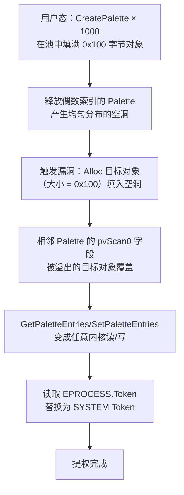

---
tags:
  - Windows
  - 内核
  - tier3
  - win32k
  - 安全
---
# GDI 与 Win32k 内核攻击面

> [!abstract] TL;DR
> `win32k.sys` 是 Windows GUI 子系统的内核实现，历史上单个子系统贡献了全部 Windows 内核 CVE 的约 40%。其攻击面来源于三大根源：GDI 对象（`GDICELL`/句柄表 `gpentHmgr`）提供了任意内核读写的"喷射原语"；用户对象（`tagWND`/`tagMENU`）的池分配允许精确的内核对象布局；用户态回调（`KeUserModeCallback`）允许攻击者在内核持有锁时重入窗口消息路径，造成 UAF。Win10 RS1 引入的 `win32k syscall filtering`、Win32k Type Isolation、GDI 句柄随机化等缓解措施大幅压缩了可利用窗口，但子系统复杂度依然使其成为沙箱逃逸研究的核心战场。

## 概述与定位

### 为什么 GUI 子系统进入内核

Windows NT 3.51 及更早版本将 Win32 子系统的 GDI/User 部分放在用户态服务进程 `csrss.exe` 中运行。每次窗口消息、绘图调用都需要 LPC（Local Procedure Call）跨进程通信，每调用一次要经过两次上下文切换，性能开销显著。Windows NT 4.0 在 1996 年将 `win32k.sys` 移入内核态，用直接系统调用取代 LPC，显著提升了 GUI 性能，但代价是将数十万行 GUI 代码（含复杂字体解析器、视频驱动接口、窗口消息路由）全部暴露在 Ring 0。这一架构选择在此后二十多年持续产生高危漏洞。

### win32k 三件套的分层

从 Windows 10 RS1（1607）开始，微软将 `win32k.sys` 拆分为三个模块，实现功能隔离以便按需加载：

| 模块 | 职责 | 加载条件 |
|------|------|----------|
| `win32kbase.sys` | 核心 User32 原语：窗口/消息/剪贴板/原子表的内核部分 | 任何 Win32 进程的第一次 GUI 调用时 |
| `win32kfull.sys` | 完整 GDI 绘图引擎、字体/文本、区域/路径 | 同上，通常与 base 一起加载 |
| `win32k.sys`（shell） | 薄粘合层，导出给旧代码的符号转发表 | 向下兼容 |

三者在内存中协同工作，但职责分离使得微软可以对最危险的 API 子集（如完整字体解析）实施更严格的代码完整性策略。

### 系统调用表：W32pServiceTable 与 Shadow SSDT

常规系统调用通过 `KeServiceDescriptorTable`（SSDT）中的 `KiServiceTable` 派发。Win32k 系统调用通过独立的 `KeServiceDescriptorTableShadow` 派发，其中第二个描述符指向 `W32pServiceTable`（也称 Shadow SSDT）。

```
KeServiceDescriptorTableShadow[0] -> KiServiceTable        ; ntoskrnl 系统调用
KeServiceDescriptorTableShadow[1] -> W32pServiceTable      ; win32k 系统调用
```

`W32pServiceTable` 是一个函数指针数组，索引号从 `0x1000` 开始（高 12 位为 `0x1`，低 12 位为服务号），与普通 SSDT 的 `0x0xxx` 前缀区别开来。`W32pServiceTable` 在 `win32k.sys` 中定义，随模块加载而注册。

在 x64 上，该表条目以 4 字节偏移量编码（相对于表基址的有符号位移右移 4 位），与 SSDT 编码格式相同。逆向时可用 WinDbg 直接观察：

```
kd> dq nt!KeServiceDescriptorTableShadow
; 第二项为 W32pServiceTable 的相关字段
kd> u win32k!W32pServiceTable
```

rootkit 历史上通过修改 `W32pServiceTable` 条目来 hook GUI 系统调用。x64 PatchGuard 自 Vista SP1 起将此表纳入保护，使得直接表项篡改在现代 Windows 上会触发 `CRITICAL_STRUCTURE_CORRUPTION`（BSOD）。

## 原理与机制

### GDI 对象模型：GDICELL 与 gpentHmgr

GDI 内核对象（画笔、画刷、字体、位图、调色板等）通过统一的句柄表管理，该表的核心是进程共享的全局数组 `gpentHmgr`（GDI Entry Handle Manager）。

每个 GDI 对象的句柄为 32 位值，高 16 位是对象类型（Type）和唯一性计数器（Unique），低 16 位是句柄表索引（Index）：

```
HGDIOBJ：
  [31:24] - Unique（防止重用攻击的计数器）
  [23:16] - Type（对象类型枚举值）
  [15: 0] - Index（gpentHmgr 数组下标）
```

`gpentHmgr` 的每个元素是一个 `GDI_HANDLE_ENTRY`（又称 `GDICELL`），结构如下（逆向重建，字段名依文档惯例）：

```c
typedef struct _GDI_HANDLE_ENTRY {
    PVOID    pobj;        // 指向内核态 GDI 对象（如 SURFACE/PALETTE）
    union {
        struct {
            USHORT  ProcessId;   // 所属进程 ID（低位）
            USHORT  Lock;        // 引用计数/锁标志
        };
        ULONG    ProcessIdAndLock;
    };
    USHORT   nCount;      // 对象引用计数
    USHORT   Unique;      // 句柄唯一性计数，与句柄高位一致
    UCHAR    Type;        // GDI 对象类型
    UCHAR    Flags;       // 各类标志
    PVOID    pUser;       // 用户态镜像指针（部分类型有效）
} GDI_HANDLE_ENTRY, *PGDI_HANDLE_ENTRY;
```

`gpentHmgr` 本身是从非分页池分配的，在 Win7 及更早版本，该地址可通过 `NtQuerySystemInformation(SystemHandleInformation)` 推算，或直接从 `win32k!gpentHmgr` 符号读取（调试符号可用时）。

**关键攻击价值**：`pobj` 字段指向内核对象体，对象体内通常包含 `pvScan0`（位图扫描线基址）、`lDelta`（步长）等字段。如果攻击者能够控制 `pvScan0` 的值，`GetBitmapBits`/`SetBitmapBits` 系列 API 将退化为任意内核地址读/写原语。

### User 对象模型：tagWND 与桌面堆

窗口（`tagWND`）、菜单（`tagMENU`）、光标（`tagCURSOR`）等 User 对象存储在桌面堆（Desktop Heap）中。桌面堆是 win32k 维护的共享内存段，同一桌面上的所有进程（以及内核）都映射同一片物理页，用户态可直接读取（但不能写内核态字段）。

`tagWND` 结构超过 400 字节，关键字段包括：

```c
// 简化的 tagWND（字段偏移随版本变化，仅示意）
struct tagWND {
    THRDESKHEAD  head;          // 对象头：Lock/Type/pti(THREADINFO指针)/rpdesk
    ULONG        state;         // 窗口状态标志
    ULONG        state2;
    DWORD        ExStyle;
    DWORD        style;
    HWND         hWnd;          // 句柄（自引用）
    struct tagWND *spwndNext;   // 同层下一个兄弟窗口
    struct tagWND *spwndPrev;
    struct tagWND *spwndParent; // 父窗口
    struct tagWND *spwndChild;  // 第一个子窗口
    struct tagWND *spwndOwner; 
    RECT          rcClient;     // 客户区矩形（屏幕坐标）
    RECT          rcWindow;
    PVOID         pcls;         // 指向 WNDCLASSEX 内核态描述符
    PTHREADINFO   pti;          // 所属线程信息结构
    // ... 更多字段
    PROC         lpfnWndProc;  // 窗口过程（可被 SetWindowLongPtr 修改）
};
```

**攻击视角**：`pti` 字段指向 `THREADINFO`（线程信息），`THREADINFO` 中含 `ppi`（进程信息）指针，`ppi` 中含 `Token` 字段。因此，如果攻击者能够读/写 `tagWND`，即可沿指针链到达 `TOKEN` 内核对象，实施特权令牌替换。`lpfnWndProc` 字段历史上也是攻击目标：通过 `SetWindowLong`（32位）的 UAF 将过程地址覆写为 shellcode 地址，触发消息即可在内核执行任意代码。

### 用户态回调与重入风险

`KeUserModeCallback` 是 win32k 从内核态回调到用户态的核心机制。当内核需要调用窗口过程（WndProc）、钩子回调（Hook Callback）、SendMessage 等时，会通过以下路径回到用户态：

```
win32k!xxxSendMessageTimeout
  -> win32k!xxxCallHook  / xxxWindowEvent
    -> nt!KeUserModeCallback(ApiIndex, InputBuffer, InputLength, ...)
      -> 用户态 ntdll!KiUserCallbackDispatcher
        -> 用户的回调函数（WndProc / Hook）
          -> 返回 ntdll!ZwCallbackReturn  （重新陷入内核）
```

**重入危险（UAF 根源）**：当 win32k 持有指向用户对象（如 `tagWND`）的原始内核指针，然后发起 `KeUserModeCallback` 进入用户态，用户代码可以在此时：

1. 调用 `DestroyWindow` 释放该 `tagWND` 对象；
2. 分配其他内核对象（Palette/Bitmap）填充到刚释放的地址；
3. 回调返回内核，原始代码继续使用已被覆写的"旧 `tagWND`"指针 → 经典 Use-After-Free。

`CVE-2021-1732`（Win32k 提权，已被 APT 在野利用）正是此类模式：`xxxCreateWindowEx` 在发起 `WM_CREATE` 回调后，返回的 `pWnd` 指针仍被当作可信对象使用，攻击者在回调内替换窗口的 `cbWndExtra` 字段，再配合第二次回调实现越界写。

### 字体解析攻击面

`win32kfull.sys` 内嵌了完整的 OpenType/TrueType 字体解析引擎（`ATMFD.DLL` 在 Win10 2004 前以内核态加载，之后被永久禁用）。字体解析器需要处理外部输入（字体文件可由用户提供），是典型的"内核中的 Parser"。历史漏洞集中于：

- **OpenType CFF 表解析**：CVE-2015-2426（win32k OpenType 字体解析堆溢出）、CVE-2016-0184（ATMFD.dll 内存损坏）；
- **TrueType hinting 指令解释器**：利用无效指令序列触发越界读/写；
- **内嵌字体 in Office/Web 文档**：`<font-face>` in SVG、Office DOCX 的嵌入字体——不需要安装字体，直接通过文档触发字体解析。

自 Windows 10 20H1（2004）起，ATMFD 内核字体驱动被彻底移除，Adobe Type 1 字体解析回归用户态。但 OpenType 解析仍部分保留在 `win32kfull.sys` 中，攻击面并未完全消除。

## 结构/算法/伪代码详解

### GDI 位图读写原语的构造原理

经典的 GDI 位图利用原语（在 Windows 7–10 初期广泛使用）分两步建立：

**步骤 1：建立"管理位图"（Manager Bitmap）与"工作位图"（Worker Bitmap）**

```c
// 在用户态，创建两个 DIB Section 位图
HBITMAP hMgr  = CreateDIBSection(hdc, &bmi, DIB_RGB_COLORS, &pvBitsMgr, NULL, 0);
HBITMAP hWorker = CreateDIBSection(hdc, &bmi, DIB_RGB_COLORS, &pvBitsWorker, NULL, 0);
// 两个位图在内核态分别有 SURFACE 结构，其中 pvScan0 = 内核态扫描线基址
```

**步骤 2：利用漏洞（池溢出/UAF）将 hMgr 的 pvScan0 覆盖为指向 hWorker 的内核态 SURFACE 结构**

```
[内核布局]
SURFACE(hMgr).pvScan0  --->  SURFACE(hWorker) 对象地址  <-- 漏洞溢出覆盖
```

**步骤 3：用 SetBitmapBits/GetBitmapBits 操作 Worker 位图的 pvScan0 字段**

由于 `pvScan0(hMgr)` 指向 `SURFACE(hWorker)` 内部，调用 `SetBitmapBits(hMgr, ...)` 就相当于在写 `SURFACE(hWorker)` 对象的字节，其中就包括 `pvScan0` 字段本身。攻击者于是可以：

```c
// 伪代码：将 Worker 的 pvScan0 设为目标地址
BYTE payload[sizeof(PVOID)];
*(PVOID*)payload = TARGET_KERNEL_ADDRESS;
// 写到 Worker->pvScan0 的偏移
SetBitmapBits(hMgr, sizeof(PVOID), payload /* 偏移至 pvScan0 */);

// 此后：读任意内核地址
GetBitmapBits(hWorker, 8, &leak_buf);  // 读 TARGET_KERNEL_ADDRESS 处 8 字节

// 写任意内核地址
SetBitmapBits(hWorker, 8, &write_buf); // 写 TARGET_KERNEL_ADDRESS 处 8 字节
```

这一原语在 CVE-2015-0003、CVE-2016-0165、CVE-2017-0263 等多个真实漏洞利用中被广泛采用，是 Win32k 利用的"标准模板"。

### Palette 喷射：可预测的内核地址布局

调色板对象（`PALETTE`）是另一类常用的喷射载体。`CreatePalette` 在内核池中分配 `PALETTE` 对象，其大小由颜色条目数决定：

```
PALETTE 固定头部大小 + 4 * nColors  (每个颜色条目 4 字节 PALETTEENTRY)
```

通过创建大量尺寸相同的 Palette，攻击者可以在内核非分页池中制造大量连续相邻的同尺寸对象——喷射（Spray）。随后释放特定位置的 Palette，制造"空洞"，再通过漏洞触发溢出或 UAF 条件填入攻击者控制的数据，实现可预测的内核对象布局（Pool Grooming）。



### Win32k 系统调用过滤机制的内核实现

Win10 RS1（1607）引入的系统调用过滤（Syscall Filtering）允许进程在不信任的沙箱模式下完全禁用 Win32k 系统调用。其内核实现路径：

```
1. 进程调用 SetProcessMitigationPolicy(ProcessSystemCallFilterPolicy, ...)
   → ntdll!ZwSetInformationProcess → nt!NtSetInformationProcess
   → 设置 EPROCESS.MitigationFlags.Win32kSystemCallFilter = 1

2. 系统调用派发路径：
   nt!KiSystemServiceStart
   → 检查服务号高位 (>= 0x1000 即 Win32k 调用)
   → 检查 EPROCESS.MitigationFlags.Win32kSystemCallFilter
   → 若置位：STATUS_ACCESS_DENIED，调用被阻断
```

Chrome（渲染进程）、Firefox（IPC 进程）均在沙箱进程创建早期调用此接口，使得沙箱内任何代码都无法执行 Win32k 系统调用。这直接斩断了 Win32k 历史漏洞通过浏览器渲染进程提权的路径。

### KeUserModeCallback 的调用约定

`KeUserModeCallback` 是内核态发起用户态回调的底层机制，其内部逻辑简化为：

```c
// 伪代码，基于逆向重建
NTSTATUS KeUserModeCallback(
    ULONG    ApiNumber,   // 索引到 KernelCallbackTable（用户态函数表）
    PVOID    InputBuffer,
    ULONG    InputLength,
    PVOID   *OutputBuffer,
    PULONG   OutputLength
) {
    // 保存内核栈帧到 KTHREAD.CallbackStack
    // 切换到用户态栈（KTHREAD.UserStack）
    // 跳转到 ntdll!KiUserCallbackDispatcher
    //   → KernelCallbackTable[ApiNumber](...) 被调用
    // 用户回调调用 ZwCallbackReturn → 重新陷入内核
    // 恢复内核栈，返回 NTSTATUS
}
```

`KernelCallbackTable` 是 `PEB.KernelCallbackTable` 指向的函数指针数组，在 `user32.dll` 加载时初始化，包含 `__fnCOPYDATA`/`__fnINSTRING`/`__fnDWORD` 等窗口消息路由函数。攻击者如果能劫持 `PEB.KernelCallbackTable`（用户态即可写），就能在任何 `KeUserModeCallback` 调用时执行任意代码（需先获得用户态任意写，可用于后续提权或沙箱逃逸的中间步骤）。

### Win32k Type Isolation 原理

Win10 RS5（1809）引入 Win32k Type Isolation，目的是防止不同类型的 GDI/User 对象在同一池块中相邻分配，从而破坏跨类型溢出的利用可行性。

实现方式：win32k 为每种对象类型维护独立的池分配上下文（`LOOKASIDE_LIST` 或独立的段堆 bucket），同类型对象被引导到同一 bucket。即使攻击者用 Palette 填满了某 bucket，也无法影响相邻 SURFACE 对象（因为它们在不同 bucket 中）。Type Isolation 并不能消除 UAF（对象被释放后同类型对象的重用仍有可能），但增加了利用难度，要求攻击者对目标类型进行精确喷射而非混合喷射。

## 工具视角与实战

### 用 WinDbg 检查 Win32k 加载状态

```
; 确认 win32k 三件套已加载
lm m win32k*
; 输出类似：
; start             end                 module name
; fffff96000000000  fffff96000270000   win32k     (pdb symbols)
; fffff96000280000  fffff96000480000   win32kbase (pdb symbols)
; fffff96000490000  fffff96000a10000   win32kfull (pdb symbols)

; 查看 Shadow SSDT
dq nt!KeServiceDescriptorTableShadow
; 第二个描述符的第一字段 = W32pServiceTable 地址

; 查看 W32pServiceTable 部分条目
dd win32k!W32pServiceTable L10
```

### 定位 gpentHmgr 与 GDICELL

```
; 读取全局 GDI 句柄表基址（需调试符号或通过内存扫描）
r $t0 = @@(win32kbase!gpentHmgr)
dt win32kbase!_GDI_HANDLE_ENTRY @@c++(win32kbase!gpentHmgr)

; 通过句柄（如 HBITMAP = 0x00010012）查找对应 GDICELL
; Index = 0x0012 = 18
dt win32kbase!_GDI_HANDLE_ENTRY @@c++(win32kbase!gpentHmgr + 18 * sizeof(_GDI_HANDLE_ENTRY))
```

### 检查 tagWND 结构

```
; 获取前台窗口 HWND（从用户态传入）
; 通过句柄表找到 tagWND 内核地址
!hwnd 0x12345678   ; (需 win32k 扩展模块 kdexts)
dt win32k!tagWND <address>

; 查看桌面堆对象
!desktopdump
```

### 验证 Win32k Syscall 过滤是否生效

```c
// 用户态检测代码（C）
PROCESS_MITIGATION_SYSTEM_CALL_FILTER_POLICY policy = {0};
GetProcessMitigationPolicy(
    GetCurrentProcess(),
    ProcessSystemCallFilterPolicy,
    &policy, sizeof(policy)
);
printf("Win32k filter: %s\n",
    policy.FilterSystemCallCallback ? "ENABLED" : "DISABLED");
```

在 WinDbg 中：
```
; 查看 EPROCESS.MitigationFlags
dt nt!_EPROCESS <address> MitigationFlags
```

### 字体漏洞的 PoC 分析技巧

历史字体 PoC（如 ATMFD 相关）通常包含精心构造的 `.otf` 或 `.ttf` 文件，通过 `AddFontMemResourceEx` 在内核中触发解析。逆向分析工具链：

```
; 用 WinDbg 在字体加载回调处断点
bp win32kfull!RFONTOBJ::bGetGlyphMetrics
; 或更底层的 CFF 解析函数（需符号）
bp win32kfull!sfac_CFF_GetGlyph
; 结合 PageHeap 定位越界访问
```

静态逆向方面，IDA/Ghidra 对 `win32kfull.sys` 的 CFF/TT hinting 解析路径追踪是入门方向，重点关注数组索引越界和整数溢出模式。

### 浏览器沙箱逃逸路径分析

在 Win32k Syscall Filtering 普及前，浏览器沙箱逃逸的典型路径是：

```
渲染进程（低完整性/AppContainer）
  ↓ 调用 win32k 系统调用
  ↓ 触发 Win32k 漏洞（UAF/溢出）
  ↓ 建立任意内核读/写原语（位图/Palette）
  ↓ 读取 SYSTEM 进程 Token
  ↓ 替换当前进程 Token
  ↓ 提权至 SYSTEM
```

典型案例：CVE-2019-1132（Win32k UAF，已被 APT28 用于 Firefox 沙箱逃逸）、CVE-2021-1732（在野提权，Wild exploitation by DAZZLE TYPHOON 组织）。

Win32k Syscall Filtering 在沙箱进程上生效后，上述路径的第一步（调用 Win32k 系统调用）直接被阻断，使得整条链路失效。但如果攻击者能先获得 Brokered 进程（broker process 未沙箱化）的代码执行，仍可从 broker 侧利用 Win32k 漏洞。

## 安全性与正确使用

> [!caution]
> Win32k 攻击面的分析内容**严格限于授权安全研究、缓解措施设计、漏洞修复验证、CTF 竞赛和防御教育场景**。本章节中的原语构造、喷射技术、回调重入模式等描述，目的在于帮助安全工程师理解漏洞根因、评估缓解措施有效性，**不提供针对未授权真实系统的武器化利用代码或完整 PoC**。Win32k 漏洞大多已被微软修补，但对相关技术的理解是设计更好缓解措施（如 Type Isolation、Syscall Filtering）的前提。任何将这些技术用于未经授权的系统是违法且不道德的行为。

### Win32k 现有缓解措施全景

微软自 Windows 8 起持续在 Win32k 上叠加缓解层，形成纵深防御体系：

| 缓解措施 | 引入版本 | 攻击向量覆盖 |
|---------|---------|------------|
| GDI 句柄随机化（随机化 Index 分布） | Win8 | 破坏通过句柄预测内核地址的方案 |
| 用户对象（User Object）句柄限制 | Win10 RS1 | 限制 User 对象创建数量，对抗精确喷射 |
| Win32k Syscall Filtering | Win10 RS1 | 沙箱进程完全禁用 Win32k 调用 |
| ATMFD.dll 内核字体驱动移除 | Win10 20H1 | 消除内核态 Type 1 字体解析攻击面 |
| Win32k Type Isolation | Win10 RS5 | 同类型对象隔离分配，破坏跨类型溢出 |
| Desktop Heap 随机化 | Win10 RS5 | 使桌面堆基址不可预测 |
| Pool Allocation Randomization | Win10 21H1 | 非分页池分配引入随机化，增加喷射难度 |

### 为什么缓解措施仍不完整

即使叠加上述缓解，Win32k 攻击面并未彻底消除：

1. **遗留代码量巨大**：`win32kfull.sys` 约 2 MB，包含数十年积累的复杂状态机，代码路径难以被形式化验证覆盖。
2. **用户态回调固有风险**：`KeUserModeCallback` 是 Win32k 功能所必需的，无法完全移除，每一个回调点都是潜在的重入攻击面。
3. **GDI 对象语义复杂性**：位图、路径、区域对象存在复杂的共享和引用语义，引用计数错误产生的 UAF 难以通过静态分析穷举。
4. **沙箱过滤的局限**：Win32k Syscall Filtering 只保护了显式选择过滤的进程，遗留应用（如 WPF、老旧 Office 插件）若运行在无过滤沙箱中仍暴露。

### 蓝队视角：检测 Win32k 利用迹象

1. **内核崩溃转储分析**：`win32k` 相关的 `PAGE_FAULT_IN_NONPAGED_AREA` 或 `POOL_CORRUPTION_IN_FILE_AREA`，`!analyze -v` 的崩溃路径指向 `win32k!*` 模块，需重点审查。
2. **大量 GDI 对象创建**：通过 `GetGuiResources` 或 `NtQuerySystemInformation` 监控进程 GDI 对象计数异常飙升（喷射指标）。
3. **字体加载监控**：`AddFontMemResourceEx`/`AddFontFileEx` 来自非预期进程（渲染进程、Office 插件进程），ETW 事件 `Microsoft-Windows-Win32k/GDIFontLoad` 可捕获。
4. **Win32k Syscall Filtering 配置审计**：定期检查沙箱进程是否正确启用了过滤策略（通过 `GetProcessMitigationPolicy` 枚举）。

## 小结

Win32k/GDI 是 Windows 内核中历史遗留最深、攻击面最广的子系统之一。其核心风险来源于三个结构性问题：

1. **内核中的 Parser**：字体解析（TrueType/OpenType）在内核态处理不受信任的用户输入，是典型的"攻击者控制的数据直接传入内核"场景；
2. **内核与用户态的双向回调（`KeUserModeCallback`）**：在持锁状态下将控制权交还用户态，为重入型 UAF 提供了结构性条件；
3. **GDI 对象的"读写原语"属性**：位图/调色板的内核实现在被攻击者建立语义劫持后，退化为任意内核读写，使得局部内存损坏漏洞"变形"为强大的内核原语。

微软自 RS1 起的系统性缓解（Syscall Filtering、Type Isolation、ATMFD 移除、随机化）大幅提升了利用成本，但无法根治源于数十年遗留代码的固有复杂性。Win32k 仍将是内核安全研究的重要战场，理解其历史漏洞模式和缓解演进，是设计下一代防御架构的必要基础。

## 相关阅读

- [Project Zero：Win32k 漏洞系列分析（Google, 2015–2022）](https://googleprojectzero.blogspot.com/search?q=win32k)
- [Windows 内核利用技术：GDI 位图原语（ReWolf, 2016）](https://paper.seebug.org/220/)
- [MSDN：SetProcessMitigationPolicy 与 Win32k Filtering](https://learn.microsoft.com/en-us/windows/win32/api/processthreadsapi/nf-processthreadsapi-setprocessmitigationpolicy)
- [CVE-2021-1732 分析：在野 Win32k 提权（DBAPPSecurity, 2021）](https://ti.dbappsecurity.com.cn/blog/articles/2021/02/10/windows-kernel-zero-day-exploit-is-used-by-bitter-apt-in-targeted-attack/)
- [Windows 10 Win32k 系统调用过滤设计文档（MSRC）](https://msrc.microsoft.com/blog/2016/07/hardening-windows-10-with-zero-day-exploit-mitigations/)
- [BochsPwn Reloaded：用 Bochs 仿真检测 Win32k 内核对用户内存的读（j00ru, 2017）](https://j00ru.vexillium.org/2017/09/bochspwn-reloaded-detecting-kernel-memory-disclosure-with-x86-emulation-and-taint-tracking/)
- 第13篇：内核漏洞与利用基础 → 池溢出与 SMEP/KASLR 基础
- 第26篇：内核池风水与高级利用技术 → Segment Heap、现代 grooming 技术

---

[[00.Windows内核与驱动逆向总览|⬆ 系列总览]] | [[27.BYOVD攻击链与驱动供应链|← 上一章]] | [[29.CI.dll与代码完整性WDAC|→ 下一章]]
