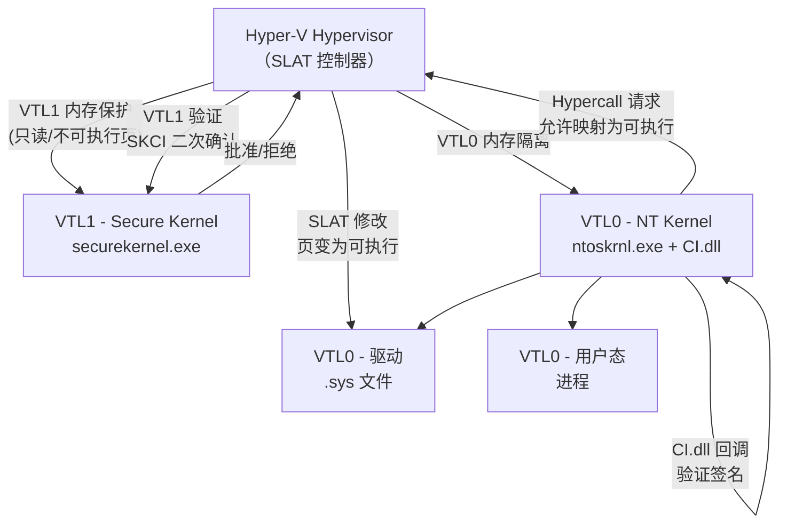

---
tags:
  - Windows
  - 内核
  - tier3
  - 代码完整性
  - WDAC
---
# CI.dll 与代码完整性（WDAC）

> [!abstract] TL;DR
> `CI.dll`（Code Integrity）是 Windows 内核加载驱动时执行 Authenticode 签名验证的核心模块。它由内核通过 `CiValidateFileObject` / `CiCheckSignedFile` 回调调用，负责验证 PE 文件的哈希、证书链及目录签名。Driver Signature Enforcement（DSE）依赖 CI 的判定结果决定是否允许驱动进入内核地址空间。WDAC（Windows Defender Application Control）则是在 CI 基础上扩展的应用层策略引擎，以 `SiPolicy.p7b` / `.cip` 格式描述允许运行的可执行文件范围，内核在镜像加载时查询 CI 执行策略。HVCI（Hypervisor-Protected Code Integrity）将 CI 的判决执行上移至 VTL1 Secure Kernel，使得任何试图在 VTL0 内核篡改 CI 逻辑的攻击都无法绕过 VTL1 的二次校验。理解这条完整信任链，是 EDR 开发者、蓝队工程师和内核安全研究者分析"为什么已签名却不能运行"或"为什么 BYOVD 仍然有效"的基础。

## 概述与定位

### 代码完整性的演进背景

代码完整性（Code Integrity）机制最早在 Windows Vista 中作为 Kernel Patch Protection（KPP，即 PatchGuard）的配套措施引入。PatchGuard 负责防止对内核关键数据结构的运行时篡改，而 CI 则在更早的阶段——镜像加载时——阻止未经授权的代码进入内核地址空间。二者互补，共同构成 Windows 内核的静态+动态完整性保护体系。

Vista 之前，Windows 在 x86 上允许任意驱动加载（无签名要求），恶意 Rootkit 因此大量出现。Vista 64 位版本率先引入 Driver Signature Enforcement，要求所有内核模式驱动必须持有 Microsoft 或 WHQL 认可的代码签名证书。Vista 32 位版本当时仅在测试模式之外才强制执行。从 Windows 8 开始，所有平台架构（x86/x64/ARM）均强制执行 DSE，测试签名模式（F8 → Disable Driver Signature Enforcement）成为唯一合法绕过手段，但要求每次启动手动选择，无法持久。

Windows 10 引入了 HVCI（Hypervisor-Protected Code Integrity），将 CI 的执行环境从 VTL0 正常内核上升到 VTL1 Secure Kernel，彻底堵死了通过内核漏洞在 VTL0 侧修改 CI 逻辑的传统绕过路径。同期引入的 WDAC（Windows Defender Application Control，前身为 Device Guard）则将代码完整性策略从"是否有合法签名"扩展到"是否在允许列表内"，支持以 XML 策略描述细粒度的信任规则。

### CI.dll 在系统中的位置

`CI.dll` 是一个内核模式的 DLL（尽管扩展名为 `.dll`，实际以特权模式加载到系统地址空间），位于 `%SystemRoot%\System32\CI.dll`。它不是一个独立的驱动（没有 `DriverEntry`），而是由内核在启动早期（`Phase 1 Initialization`）显式加载，导出一组供 ntoskrnl 调用的回调函数。主要导出符号包括：

- `CiInitialize` — 初始化 CI 子系统，注册回调表到内核
- `CiValidateFileObject` — 验证一个文件对象对应的镜像的签名合法性
- `CiCheckSignedFile` — 检查内嵌 Authenticode 签名或目录（catalog）签名
- `CiGetPEInformation` — 提取 PE 文件的完整性相关元数据
- `CiSetFileCache` — 缓存已验证文件的哈希结果（避免重复验证）
- `CiQueryInformation` — 查询 CI 的当前策略模式（调试/测试/生产）

ntoskrnl 中与 CI 交互的核心函数是 `SeValidateImageHeader`（Security Reference Monitor 层）和 `MiLoadSystemImage`（内存管理器层）。前者在决定是否将 PE 映射为可执行代码之前调用 CI 回调；后者在将驱动映射到内核地址空间时执行最终授权检查。

```
ntoskrnl.exe
  └─ MiLoadSystemImage
       └─ SeValidateImageHeader
            └─ CI!CiValidateFileObject   ← CI.dll 回调
                  ├─ 读取 PE 证书目录
                  ├─ 验证哈希（内嵌 or catalog）
                  ├─ 构建证书链
                  └─ 查询 WDAC 策略（SiPolicy）
```

### DSE（Driver Signature Enforcement）的角色

DSE 是一个策略标志，本质上是 CI 子系统的"严格模式"开关。内核全局变量 `g_CiEnabled`（在 `CI.dll` 或早期版本中暴露于 ntoskrnl 的 `g_CiOptions`）控制 DSE 的运行模式：

| 值 | 含义 |
|----|------|
| `0x00` | CI 完全禁用（仅调试内核 `ntoskrnl_d.exe`） |
| `0x06` | 正常生产模式（强制签名验证） |
| `0x0E` | HVCI 模式（额外的 VTL1 强制位） |

历史上大量 Rootkit 和 BYOVD 工具通过内核漏洞直接修改这个字节为 `0x00` 或 `0x06` 来禁用 DSE（将原本的 `0x06` 改为 `0x00`）。HVCI 出现后，这个修改本身会触发 VTL1 的 SLAT 保护页错误，攻击者无法再直接覆写。

## 原理与机制

### Authenticode 签名验证的内核实现

Authenticode 是 Microsoft 对 PKCS #7（CMS）签名格式的扩展，专为 PE（可移植可执行）文件设计。一个完整的 Authenticode 签名链包含以下层次：

1. **文件哈希**：按照 Authenticode 规范（RFC 3217 扩展），计算 PE 文件去除证书目录指针后的 SHA-256 哈希（旧版本为 SHA-1，现已不被接受）。
2. **SignedData 结构**：PKCS #7 ContentInfo，包含哈希值、签名算法标识、签发者证书链。
3. **证书链**：从代码签名证书到中间 CA 再到根 CA（Microsoft Code Verification Root / DigiCert 等信任根）。
4. **时间戳**（可选）：RFC 3161 时间戳，使签名在证书过期后仍然可验证（countersignature）。

内核侧的验证步骤（`CiCheckSignedFile` 内部逻辑，基于逆向分析）：

**步骤一：定位签名数据**
```
PE Optional Header → Data Directory[4] (Certificate Table)
→ WIN_CERTIFICATE 结构
   ├─ dwLength (4 bytes)
   ├─ wRevision = 0x0200
   ├─ wCertificateType = 0x0002 (PKCS#7 signed data)
   └─ bCertificate[...] (DER-encoded PKCS#7)
```

若 Certificate Table 为空，则回退到 catalog 签名查找（见下节）。

**步骤二：计算 Authenticode 哈希**
内核使用 CNG（Cryptography API: Next Generation）的内核模式接口（`BCryptHashData` 等经 `ksecdd.sys` 提供的内核 CNG 导出）计算 PE 哈希，需跳过 PE 头中的以下字段：
- Optional Header 中的 `CheckSum` 字段（4 字节）
- Data Directory 中的 Certificate Table 条目（8 字节，VirtualAddress + Size）
- 文件末尾的 Certificate Table 数据本身

**步骤三：解析并验证 PKCS#7 SignedData**
内核 CI 使用 `crypt32.dll` 在用户态的算法移植到内核模式（或调用 `ksecdd.sys`），解析 DER 编码的 SignedData：
- 比对 `SignedData.digestAlgorithm` 与当前策略允许的算法（SHA-256 以上）
- 验证 `EncryptedDigest`（对哈希的 RSA 或 ECDSA 签名）
- 提取完整证书链

**步骤四：构建并验证证书链**
CI 内部维护内核模式的信任根存储（独立于用户态的 Windows 证书存储）。内核信任根包含：
- Microsoft Code Verification Root（MSCVR）
- Microsoft Root Certificate Authority 2010 / 2011
- 第三方交叉签名根（已逐步淘汰，Windows 10 1803 后不再接受新的交叉签名）

证书链验证包括：
- 证书有效期检查（结合时间戳，避免证书过期后签名失效）
- 证书用途（EKU：Code Signing / Kernel Mode Code Signing）
- 证书吊销状态（内核态下通过缓存的 CRL/OCSP 数据，不发起实时网络请求）

**步骤五：返回信任级别**
`CiValidateFileObject` 向调用方（`SeValidateImageHeader`）返回一个枚举值，表示文件的信任级别：

| 信任级别 | 典型含义 |
|---------|---------|
| `SeTrustedInstaller` | Windows 组件，完全信任 |
| `SeWindowsTrustLevel` | Windows 签名，可加载内核驱动 |
| `SeAuthenticodeLevel` | 标准 Authenticode 签名，受策略约束 |
| `SeUnsignedLevel` | 未签名，默认拒绝进入内核 |

### Catalog 签名 vs 内嵌签名

Windows 支持两种为文件附加 Authenticode 签名的方式：

**内嵌签名（Embedded Signature）**：签名数据直接写入 PE 文件的 Certificate Table（数据目录条目 4）。大多数现代驱动（`.sys`）和系统文件使用内嵌签名。优势：签名与文件绑定，无需额外文件。

**目录签名（Catalog Signature）**：签名保存在独立的 `.cat` 文件（即 Security Catalog）中。`.cat` 是一个 PKCS #7 封装的哈希列表，其中包含一组文件的哈希值。Windows Update 分发的补丁包通常使用这种方式（在系统补丁安装时，大量文件的哈希被放入一个 catalog，由 Microsoft 对 catalog 整体签名）。

CI 处理 catalog 签名的路径：
1. 文件无内嵌签名 → 调用 `CiGetCataliogInformation`（内部名称）
2. 查询 `CatRoot`（`\System32\CatRoot\{F750E6C3-38EE-11D1-85E5-00C04FC295EE}`）目录中所有已安装 catalog
3. 在 catalog 中查找与当前文件哈希匹配的条目
4. 若找到，则用 catalog 文件本身的 Authenticode 签名验证

Catalog 查找是一个较慢的操作（涉及遍历），CI 通过 `CiSetFileCache` 缓存已验证文件的结果。

### 页哈希（Page Hash）vs 文件哈希（File Hash）

标准 Authenticode 计算整个 PE 文件的哈希（File Hash）。但这存在一个安全弱点：如果攻击者获得了文件的签名，然后只修改了部分节（Section）的数据，是否能被检测到？

答案是：仅凭 File Hash 无法区分"签名后被修改的可执行节"与"签名后修改了不参与哈希计算的部分"。

为此，Authenticode 规范支持一种可选扩展：**页哈希（Page Hash）**。页哈希在签名时对 PE 的每个 4KB 页分别计算哈希，并将所有页哈希列表连同整体文件哈希一起打包进签名中。CI 在验证时，不仅验证文件整体哈希，还在 demand-paging 时（每次将 PE 的某个页从磁盘加载到内存时）验证该页的哈希是否与签名中的页哈希一致。

页哈希的好处：
- 防止对 PE 文件已签名副本中单个节的静默修改
- 在内存映射阶段而非文件打开阶段检测篡改
- 配合 HVCI，可在页被映射为可执行之前在 VTL1 完成验证

页哈希的缺点：
- 对于大型二进制文件，签名体积显著增大
- 并非所有工具链默认启用（需要 `signtool /ph` 参数）

### CI 回调注册机制

CI 通过一个函数指针表（Callback Table）与 ntoskrnl 集成，而不是导出普通函数供 ntoskrnl 直接调用。在系统初始化时：

1. 内核调用 `CI!CiInitialize`，传入内核提供的服务函数指针（用于 CI 反向调用内核）
2. `CiInitialize` 返回一个函数指针结构，填充 CI 提供给内核的回调
3. 内核将这些回调指针保存到 ntoskrnl 内部的 `SeCiCallbacks` 结构

```c
// 逆向推断的 CI 回调结构（简化）
typedef struct _SE_CI_CALLBACKS {
    ULONG                  Version;
    PCI_VALIDATE_FILE      CiValidateFileObject;   // 镜像加载验证
    PCI_GET_PE_INFO        CiGetPEInformation;      // 提取 PE 元数据
    PCI_SET_FILE_CACHE     CiSetFileCache;          // 缓存验证结果
    PCI_QUERY_INFORMATION  CiQueryInformation;      // 查询 CI 策略模式
    // ... 其他回调
} SE_CI_CALLBACKS, *PSE_CI_CALLBACKS;
```

`SppCall`（Security Policy Provider Call）是另一个相关机制：在 WDAC 策略引擎中，策略评估结果需要向上层回调（例如向 Smart App Control、Windows Security Center 等报告策略决策）。`SppCall` 是 CI 内部的一个通用回调分发器，将策略评估事件分发给注册的"策略提供者"。

### WHQL 与 EV 签名

并非所有代码签名证书都具有相同的内核信任级别：

**普通 OV 代码签名证书**：Organisation Validation，证明证书持有者是合法组织，但微软对其信任级别较低。Windows 10 1607 之后，OV 证书签名的驱动不再被 Windows 接受为内核驱动（除非通过 EV 途径或 WHQL）。

**EV 代码签名证书**：Extended Validation，需要严格的实体身份核验（物理检查等），颁发周期长、价格高。从 Windows 10 1607 开始，提交到 Microsoft Hardware Dev Center 进行 WHQL 认证的驱动必须使用 EV 证书签名提交包。EV 证书本身可签名驱动，但不等于 WHQL。

**WHQL（Windows Hardware Quality Labs）签名**：驱动通过 HLK（Hardware Lab Kit）测试并提交 Microsoft，由 Microsoft 用自己的证书（`Microsoft Windows Hardware Compatibility Publisher`）对驱动二进制重新签名。WHQL 签名的驱动获得最高内核信任级别，可在所有 Windows 版本（包括 HVCI 模式）加载。

**KMCS（Kernel Mode Code Signing）证书**：针对内核模式驱动的专用 EKU（`1.3.6.1.4.1.311.10.3.5`），必须链接到 Microsoft 认可的根 CA，并且必须包含此 EKU 才能被 CI 接受为内核驱动签名。

信任层次总结：

```
WHQL（Microsoft 重签名）> EV + KMCS（已向 Microsoft Portal 提交）> EV 自签名（2015年交叉签名截止日之前的存量）> 测试签名（仅测试模式）
```

## 结构/算法/伪代码详解

### CI.dll 内部结构（逆向视角）

以 Windows 11 23H2 的 `CI.dll` 为参考（版本 10.0.22621.x），逆向可识别以下主要内部模块：

**CiAuthenticodePolicy** 命名空间（非正式命名）：
- `CipAuthenticateImageData` — 核心验证入口，处理内嵌签名路径
- `CipQueryCatalogSignature` — catalog 签名查找与验证
- `CipVerifyCertificateChain` — 证书链构建与验证
- `CipCheckRevocation` — 吊销状态检查（使用缓存的 CTL/CRL）

**CiWdacPolicy** 命名空间：
- `CipLoadPolicy` — 从注册表/EFI 变量加载 WDAC 策略文件
- `CipEvaluatePolicy` — 对给定文件评估 WDAC 策略规则集
- `CipCheckPublisher` — 验证文件的发布者是否在策略允许列表
- `CipCheckFileHash` — 验证文件哈希是否在策略允许列表
- `CipCheckPath` — 路径规则评估

**关键数据结构（逆向推断）**：

```c
// CI 内部的策略状态（部分）
typedef struct _CI_POLICY_STATE {
    ULONG   PolicyOptions;      // 0x00: 策略选项位掩码
    ULONG   PolicyVersion;      // 0x04: 策略版本
    PVOID   PolicyData;         // 0x08: 指向已解析的策略树
    ULONG   PolicyDataSize;     // 0x10: 策略数据大小
    KSPIN_LOCK PolicyLock;      // 0x18: 保护策略更新的自旋锁
    LIST_ENTRY PolicyList;      // 0x20: 活动策略链表（支持多策略）
} CI_POLICY_STATE;

// WDAC 规则条目（简化）
typedef struct _WDAC_RULE_ENTRY {
    ULONG       RuleType;       // 0=哈希规则 1=发布者规则 2=路径规则
    ULONG       RuleAction;     // 0=拒绝 1=允许
    union {
        struct {
            BYTE    HashValue[32];   // SHA-256 哈希
            ULONG   HashAlgorithm;
        } HashRule;
        struct {
            UNICODE_STRING  IssuerName;
            UNICODE_STRING  SubjectName;
            // EKU 列表...
        } PublisherRule;
    };
} WDAC_RULE_ENTRY;
```

### CiValidateFileObject 调用流程伪代码

```c
NTSTATUS CiValidateFileObject(
    PFILE_OBJECT            FileObject,
    ULONG                   ImageType,     // 内核驱动 / 用户态 EXE / DLL
    SE_SIGNING_LEVEL        *SigningLevel,  // 输出：文件的信任级别
    PS_PROTECTED_SIGNER     *Signer,       // 输出：签名者类型
    BYTE                    *Hash,         // 输出：文件哈希
    ULONG                   *HashSize,
    ULONG                   *HashAlgorithm
) {
    // 1. 获取文件的 Section 对象（内存映射视图）
    PVOID SectionBase = MmGetMdlVirtualAddress(FileObject->SectionObjectPointer);

    // 2. 检查缓存（CiFileCache）
    if (CipLookupFileCache(FileObject, SigningLevel, Hash)) {
        return STATUS_SUCCESS;  // 命中缓存，直接返回
    }

    // 3. 验证 PE 结构有效性
    if (!CipIsValidPEHeader(SectionBase)) {
        return STATUS_INVALID_IMAGE_FORMAT;
    }

    // 4. 尝试内嵌签名验证
    NTSTATUS Status = CipAuthenticateImageData(SectionBase, ImageSize,
                                                SigningLevel, Hash);
    if (!NT_SUCCESS(Status) || *SigningLevel == SeUnsignedLevel) {
        // 5. 回退到 catalog 签名查找
        Status = CipQueryCatalogSignature(Hash, HashSize, HashAlgorithm,
                                           SigningLevel);
    }

    // 6. 应用 WDAC 策略
    if (NT_SUCCESS(Status)) {
        SE_SIGNING_LEVEL WdacLevel = CipEvaluatePolicy(
            FileObject, *SigningLevel, Hash, *HashAlgorithm);
        // 策略可能降级信任级别（例如：虽然签名有效，但不在允许列表）
        if (WdacLevel < *SigningLevel) {
            *SigningLevel = WdacLevel;
        }
    }

    // 7. 更新缓存
    CipSetFileCache(FileObject, *SigningLevel, Hash);

    return Status;
}
```

### WDAC 策略评估算法

WDAC 策略评估遵循"默认拒绝，规则允许"的白名单逻辑。评估顺序：

```
1. 检查 Deny 规则（哈希/发布者/路径）→ 若命中，立即拒绝
2. 检查 Allow 规则（哈希）             → 若命中，允许
3. 检查 Allow 规则（发布者）           → 若命中，允许
4. 检查 Allow 规则（路径）             → 若命中，允许（有条件）
5. 检查 Supplemental Policy 规则       → 递归上述步骤
6. 默认动作                            → 通常为拒绝
```

对于"发布者规则"，评估逻辑细化为：
- 验证文件的 Authenticode 签名链
- 比对证书链中的发布者名称（Issuer CN / Subject CN）
- 比对特定 EKU
- 可选：比对产品名称、文件名（通过 PE 版本资源的 FileDescription / ProductName 字段）
- 可选：版本号范围（`MinimumVersion` / `MaximumVersion`）

### SiPolicy.p7b / .cip 文件格式

WDAC 策略文件分两种形态：

**.p7b（编译前的二进制策略格式）**：实际是一个 PKCS #7 SignedData 结构，其 `ContentInfo` 中包含 DER 编码的策略 XML 的编译结果。文件格式层次：

```
PKCS#7 ContentInfo
  └─ SignedData
       ├─ SignerInfo（Microsoft 签名，保证策略完整性）
       └─ EncapsulatedContentInfo
            └─ SiPolicy（自定义 ASN.1 OID 1.3.6.1.4.1.311.79.1）
                  ├─ PolicyID（GUID）
                  ├─ PolicyTypeID（基础策略/补充策略/AppID策略）
                  ├─ PlatformID
                  ├─ Rules（策略规则枚举）
                  ├─ Signers（授权发布者列表）
                  ├─ FileRules（文件规则：Allow/Deny/FileAttrib）
                  └─ AllowedSigners / DeniedSigners（引用 Signers）
```

**.cip（编译后的内核输入格式）**：将 .p7b 复制到 `%SystemRoot%\System32\CodeIntegrity\CiPolicies\Active\` 目录后，文件名为策略 GUID，扩展名为 `.cip`。内核在启动时从此目录读取所有 .cip 文件。在 HVCI 模式下，.cip 文件本身的完整性由 VTL1 验证，防止攻击者在 VTL0 侧删除或替换策略。

### Supplemental Policy 与 AppID Tagging Policy

Windows 10 1903 引入了**补充策略（Supplemental Policy）**，允许在不修改基础策略的情况下扩展允许范围。补充策略必须显式引用其父基础策略的 GUID（`BasePolicyID` 字段），内核将二者合并评估。这一机制在企业场景下非常有用：IT 管理员维护一个严格的基础策略，各业务线通过补充策略按需扩展自己的允许列表，而无需修改核心策略。

**AppID Tagging Policy**（Windows 11 22H2 引入）：不直接允许/拒绝文件运行，而是为满足条件的文件打上自定义标签（App Tag）。这些标签可被应用程序（通过 `QuerySecurityPolicyInformation` 等新 API）查询，用于构建更细粒度的应用感知访问控制。例如：标记某个文件为"Line of Business Application"，然后某个 TLS 策略可根据此标签决定是否允许该应用建立特定网络连接。

### Managed Installer 标记

**Managed Installer（托管安装程序）** 是 WDAC 的一个关键信任扩展：将 System Center Configuration Manager（SCCM/MECM）等企业部署工具标记为"受信任安装程序"，由这些工具安装的文件自动被认为可信，无需手动将每个文件哈希加入允许列表。

其内核实现依赖两个机制：
1. **NTFS Extended Attributes（EAs）**：Managed Installer 在安装文件时，通过内核 API 在文件的 NTFS 流上写入一个特殊的 EA（`$KERNEL.PURGE.EAID.1`），标记该文件由托管安装程序创建。
2. **CI 信任链查询**：在策略评估时，CI 检查文件的 EA 是否包含托管安装程序标记，若存在则应用 Managed Installer 信任级别。

安全考量：EA 标记可被具有文件写入权限的攻击者伪造。因此，Managed Installer 信任不能作为单独的强安全保证，通常需配合其他规则（如发布者规则）使用。

## 工具视角与实战

### 逆向 CI.dll 的工作流

**工具准备**：
- IDA Pro / Ghidra（主要分析平台）
- WinDbg（运行时动态分析）
- `pdbex` 或 `symchk` 获取 CI.dll 的 PDB 符号
- `ci.dll.mui`（包含 CI 错误字符串，辅助理解错误路径）

**获取符号**：
```bat
symchk /om sym.txt /s srv*D:\Symbols*https://msdl.microsoft.com/download/symbols C:\Windows\System32\CI.dll
```

Microsoft 为 CI.dll 提供公开 PDB，包含绝大多数函数名和类型定义，这使得逆向 CI.dll 比逆向大多数内核组件容易得多。

**关键逆向入口点**：

```
CI!CiInitialize          → 了解 CI 初始化流程和回调注册
CI!CiValidateFileObject  → 核心签名验证入口
CI!CipEvaluatePolicy     → WDAC 策略评估逻辑
CI!CipLoadPolicy         → 策略文件加载与解析
```

在 IDA 中，配合 PDB 符号，可以直接在 Functions 窗口搜索上述名称定位代码。重点关注：
- `CipEvaluatePolicy` 的返回值路径（何时返回"允许"，何时返回"拒绝"）
- `CipVerifyCertificateChain` 中的信任根列表（硬编码的根证书哈希）
- `g_CiEnabled` / `g_CiOptions` 全局变量的读取位置

**WinDbg 动态分析**：

```
// 在 CiValidateFileObject 入口设断点
bp CI!CiValidateFileObject

// 查看 CI 策略状态
dt ci!_CI_POLICY_STATE poi(ci!g_CiPolicyState)

// 查看当前 CI 选项
dd ci!g_CiEnabled L1

// 列出已加载的 WDAC 策略
!ci.policy   (需要 CI WinDbg 扩展，或手动解析 g_CiPolicyState)
```

### PowerShell WDAC 策略管理

Windows 提供了 `ConfigCI` PowerShell 模块用于创建和管理 WDAC 策略：

```powershell
# 创建基础策略（基于 Windows 默认允许列表）
New-CIPolicy -FilePath C:\Policy\BasePolicy.xml `
             -Level Publisher `
             -Fallback Hash `
             -UserPEs `
             -MultiplePolicyFormat

# 将 XML 策略编译为二进制 .cip 文件
ConvertFrom-CIPolicy -XmlFilePath C:\Policy\BasePolicy.xml `
                     -BinaryFilePath C:\Policy\BasePolicy.cip

# 部署策略（复制到内核读取目录）
$PolicyId = (Get-Content C:\Policy\BasePolicy.xml | 
             Select-String -Pattern 'PolicyID="\{([^}]+)\}"').Matches.Groups[1].Value
Copy-Item C:\Policy\BasePolicy.cip `
          "$env:SystemRoot\System32\CodeIntegrity\CiPolicies\Active\{$PolicyId}.cip"

# 创建补充策略
New-CIPolicy -FilePath C:\Policy\Supplemental.xml `
             -Level Hash `
             -SpecificFileNameLevel FileDescription `
             -ScanPath "C:\CustomApps"

# 设置补充策略的父策略引用
Set-CIPolicyIdInfo -FilePath C:\Policy\Supplemental.xml `
                   -SupplementsBasePolicyID $BaseGuid

# 审计模式（只记录，不阻止）
Set-RuleOption -FilePath C:\Policy\BasePolicy.xml -Option 3

# 生产模式（强制阻止）
Set-RuleOption -FilePath C:\Policy\BasePolicy.xml -Option 3 -Delete
```

### signtool 与 CI 验证一致性

开发者可用 `signtool verify` 在用户态模拟内核验证逻辑（不完全等价，但近似）：

```bat
# 验证驱动签名（包括 catalog 验证）
signtool verify /pa /v C:\Drivers\MyDriver.sys

# 带页哈希验证
signtool verify /ph /pa /v C:\Drivers\MyDriver.sys

# 查看完整证书链
signtool verify /pa /v /debug C:\Drivers\MyDriver.sys 2>&1

# 检查是否有内嵌签名
signtool verify /kp C:\Drivers\MyDriver.sys
```

注意：`signtool` 使用用户态的 `wintrust.dll` 进行验证，而内核使用 `CI.dll`。二者在以下方面有差异：
- 用户态验证会发起实时 OCSP/CRL 网络请求；内核验证使用缓存
- 用户态信任根来自用户证书存储；内核信任根为 CI 硬编码
- 用户态不应用 WDAC 策略；内核应用

### 使用 CIPolicyParser 分析策略

第三方工具 `CIPolicyParser`（Matt Graeber 等安全研究员维护）可将编译后的 `.cip` 文件反向解析为可读格式，辅助审计：

```powershell
# 将已部署的二进制策略转回 XML（使用 CIPolicyParser 或 PowerShell 内置命令）
# 注意：PowerShell ConfigCI 模块本身不提供二进制策略反向解析
# 需要使用第三方 CIPolicyParser.ps1

Import-Module C:\Tools\CIPolicyParser.ps1
ConvertFrom-CiPolicy -BinaryFilePath "C:\Windows\System32\CodeIntegrity\CiPolicies\Active\{GUID}.cip" `
                     -XmlFilePath C:\Output\Decoded.xml
```

### ETW 监控 CI 决策

`Microsoft-Windows-CodeIntegrity` ETW provider 提供 CI 决策的实时遥测：

```powershell
# 启动 CodeIntegrity ETW 追踪
$Session = New-EtwTraceSession -Name "CITrace" -OutputFile C:\Traces\CI.etl
Add-EtwTraceProvider -SessionName "CITrace" `
                     -Guid "{4EE76BD8-3CF4-44A0-A0AC-3937643E37A3}" `
                     -Level 5

# 关键事件 ID（部分）：
# Event 3001: 代码完整性无法验证文件哈希（未签名文件加载失败）
# Event 3002: WHQL 测试签名文件加载（测试模式）
# Event 3004: 文件哈希不在 catalog 中（catalog 查找失败）
# Event 3023: WDAC 策略拒绝文件执行
# Event 3026: WDAC 策略允许文件执行（审计或强制模式）
# Event 3033: 代码完整性因 HVCI 拒绝修改内核内存
```

这些事件对于调试"驱动加载失败"问题极为有用。当驱动加载失败返回 `STATUS_INVALID_IMAGE_HASH` 时，ETW 事件会给出具体的失败原因（签名损坏、证书链断裂、策略拒绝等）。

### 事件日志中的 CI 记录

Windows 事件查看器中，`Applications and Services Logs → Microsoft → Windows → CodeIntegrity → Operational` 记录了 CI 的操作事件。典型场景下会看到：

- 加载未签名驱动的拒绝记录（错误 3001）
- WDAC 策略阻止应用程序的记录（错误 3023）
- Managed Installer 标记被信任的记录（信息 3090）

这些日志在蓝队威胁狩猎（Threat Hunting）中是检测内核模式代码注入尝试的重要数据源。

## HVCI 与 CI 的关系

### VTL 架构回顾

HVCI（Hypervisor-Protected Code Integrity）是在 VBS（Virtualization Based Security）框架下对 CI 进行的架构升级。在 VBS 架构中：

- **VTL0（正常世界）**：普通 NT 内核（`ntoskrnl.exe`）、驱动、用户态应用
- **VTL1（安全世界）**：Secure Kernel（`securekernel.exe`）、Isolated User Mode（IUM）

两个 VTL 共享同一物理 CPU 和内存，但通过 Hypervisor 维护的 SLAT（Second Level Address Translation，即 EPT/NPT）表相互隔离。VTL1 的内存映射对 VTL0 不可见（不可写）。



### SKCI（Secure Kernel Code Integrity）

在 HVCI 模式下，CI 的决策链被分为两层：

**VTL0 层（CI.dll）**：执行 Authenticode 签名验证、WDAC 策略评估，生成允许/拒绝决定。但此决定只是"请求"，不直接控制页表。

**VTL1 层（SKCI）**：Secure Kernel 中运行的 Secure Kernel Code Integrity 模块（`skci.dll`，在 VTL1 地址空间中）。它独立地维护一套信任状态，并通过 Hypervisor Hypercall 控制 SLAT 表。当 VTL0 的内存管理器（`ntoskrnl!MiMapViewOfSection`）请求将某个页标记为可执行时，Hypervisor 会暂停该请求，让 VTL1 的 SKCI 进行二次校验：

1. 检查该物理页是否之前已通过 VTL0 CI 验证（通过共享的安全通信信道）
2. 若未通过验证，SKCI 返回拒绝，Hypervisor 不修改 SLAT 表，页保持不可执行
3. 若通过验证，Hypervisor 修改 SLAT 表，页变为可执行

**关键后果**：在 HVCI 模式下，即使攻击者通过内核漏洞在 VTL0 中关闭了 `g_CiEnabled`（让 CI.dll 跳过验证），VTL1 的 SKCI 也不会允许未验证的页成为可执行代码。这使得传统的"修改 CI 全局变量绕过 DSE"攻击完全失效。

**HVCI 对驱动的额外限制**：
- 驱动代码页必须只读（不可在运行时修改）
- 禁止从非分页池创建可执行页（`NX Non-paged Pool` 强制）
- `RtlCaptureContext` / 内核 JIT 等运行时代码生成场景受限

### HVCI 模式检测（逆向视角）

在逆向分析目标系统时，检测是否启用 HVCI 的方法：

```
// WinDbg 查看
!cpuinfo   // 若输出包含 HV_FEATURE_VIRTUALIZATION，系统运行在 VBS 下
rdmsr 0x4B564D06   // Hyper-V CPUID leaf，可在 VTL0 查询 VTL1 状态

// 注册表（用户态可查）
HKLM\SYSTEM\CurrentControlSet\Control\DeviceGuard\Scenarios\HypervisorEnforcedCodeIntegrity
  → Enabled = 1（已启用）
  → WasEnabledBy = 1（当前会话已激活）
```

## 安全性与正确使用

### CI/WDAC 提供的防护层次

CI 和 WDAC 构成了 Windows 系统完整性的核心防线，其防护覆盖以下威胁模型：

**威胁 1：未签名恶意驱动加载**
- 防护机制：DSE（`CI.dll`）阻止任何不满足签名要求的驱动进入内核地址空间
- 有效性：在非 HVCI 模式下，需要物理访问（禁用安全启动）或内核漏洞才能绕过；HVCI 模式下，即使有内核漏洞也无法绕过

**威胁 2：合法签名驱动被用于恶意目的（BYOVD）**
- 防护机制：WDAC 驱动阻止策略（`DriverConfig.xml` / 微软维护的 `vuln_driver_blocklist.xml`）
- 有效性：取决于阻止列表的覆盖范围和更新频率。LOLDrivers 数据库持续更新，微软通过 Windows Update 推送新的阻止策略

**威胁 3：已知良好应用程序被替换（DLL 劫持 / 二进制替换）**
- 防护机制：WDAC 哈希规则确保只有特定哈希值的文件可执行，替换后哈希变化将被拒绝
- 有效性：高，但哈希规则维护成本高（每次合法更新需更新策略）

**威胁 4：LOLBins 滥用（利用系统自带工具执行恶意代码）**
- 防护机制：WDAC 可设置路径规则和发布者规则，阻止特定系统工具（如 `wmic.exe`, `cscript.exe`）在不必要场景下运行
- 实践：Microsoft 的"Windows Recommended Block Rules"列表提供了一组覆盖常见 LOLBins 的示例规则

### WDAC 策略设计原则

**最小权限原则**：以 Whitelist 模式部署，仅允许必要的应用程序运行，而非尝试枚举和阻止恶意软件。

**分层策略**：
- 基础策略：IT 管理员控制，覆盖所有 Windows 系统组件和主要业务应用
- 补充策略：各业务单元维护，覆盖各自的专有应用
- AppID 策略：细粒度访问控制，基于应用身份而非路径/哈希

**审计优先**：新策略先以审计模式（Option 3: Enabled:Audit Mode）部署，收集事件日志分析实际阻止了哪些文件，确认无误后切换到强制模式。

**策略完整性**：
- 启用 HVCI 确保策略文件本身不可被 VTL0 侧篡改
- 启用安全启动（Secure Boot）确保引导链中的 CI 和策略文件未被篡改
- 定期审计 `CiPolicies\Active` 目录，检查是否有未授权的策略文件

### 绕过研究的合规边界与防御价值

对 CI/DSE 绕过技术的研究是内核安全领域的重要分支。以下是历史上出现的主要研究方向，理解这些方向对防御工作具有直接价值：

**内核漏洞利用 → 修改 CI 全局变量（历史）**：在 HVCI 普及之前，这是最常见的绕过方式。研究者（如 Alex Ionescu、tandasat）发现通过内核越界写漏洞可以覆写 `g_CiEnabled`。防御启示：启用 HVCI，或至少启用 DSE + Kernel ASLR + SMEP。

**BYOVD（Bring Your Own Vulnerable Driver）**：利用合法的已签名但存在漏洞的驱动（如某些主板厂商或安全软件的驱动）在内核中执行任意代码，进而修改 CI 状态或直接操作内核回调。防御启示：部署 WDAC 驱动阻止策略，持续跟踪 LOLDrivers 列表，订阅 Microsoft DCAT 阻止列表更新。

**测试签名模式（Test Signing）**：攻击者获得系统物理访问权限后，启用测试签名模式（`bcdedit /set testsigning on`），允许加载测试签名的驱动。防御启示：启用 Secure Boot，防止未授权的 BCD 修改；配合 BitLocker，阻止离线启动修改 BCD。

**证书滥用（EV/交叉签名证书盗用）**：历史上有 APT 组织（如 Winnti/Lazarus）通过各种方式获得合法 EV 代码签名证书，对恶意驱动进行有效签名。防御启示：WDAC 发布者规则可以精确到特定证书（通过 TBS 哈希标识），而非仅仅"任何 EV 证书"；监控新驱动的证书签发者来源。

**内存 Patch（运行时修改 CI 代码页）**：在非 HVCI 模式下，具有内核写权限的攻击者可以 patch CI.dll 的代码，使验证函数直接返回"允许"。防御启示：HVCI 将 CI 代码页标记为 VTL0 只读，从 SLAT 层面防止此类修改。

**策略文件替换（WDAC Policy Bypass）**：若攻击者具有管理员权限且 HVCI 未启用，可以删除或替换 `CiPolicies\Active` 中的策略文件。防御启示：HVCI + 内核 WDAC 强制保护策略文件路径；监控该目录的文件系统修改事件。

### 企业部署 WDAC 的实际考量

**应用兼容性**：过于严格的 WDAC 策略可能阻止合法的管理工具、更新程序、脚本等。建议：
- 将 SCCM/Intune 配置为 Managed Installer，使其安装的软件自动信任
- 为 PowerShell 添加"受限语言模式"（Constrained Language Mode）配合 WDAC 使用
- 维护白名单例外流程，允许新应用快速审批和添加

**策略分发**：WDAC 策略可通过以下方式分发：
- Intune（Microsoft Endpoint Manager）：推荐用于现代云管理场景
- SCCM（System Center Configuration Manager）：用于传统本地管理场景
- GPO：通过 `Computer Configuration → Windows Settings → Security Settings → Application Control Policies`
- 手动部署：开发/测试环境中直接复制 .cip 文件

**监控与响应**：
- 将 `Microsoft-Windows-CodeIntegrity` ETW 日志集中到 SIEM（如 Microsoft Sentinel）
- 建立基线：正常业务下的 CI 阻止事件应接近于零；异常的阻止事件可能表示攻击尝试
- 关注 Event 3033（HVCI 阻止内核内存修改）——此事件极为罕见，若出现几乎必然是攻击行为

## 小结

`CI.dll` 与 WDAC 共同构成了 Windows 平台从内核到应用层的完整代码完整性保护链条：

- **CI.dll** 是内核加载任何镜像（驱动或用户态 EXE/DLL，取决于策略）时的门卫，其 `CiValidateFileObject` / `CiCheckSignedFile` 执行 Authenticode 签名验证、证书链校验和 catalog 查找，返回镜像的信任级别。
- **DSE（Driver Signature Enforcement）** 基于 CI 的判定，决定驱动是否允许进入内核地址空间。`g_CiEnabled` 是其核心控制字节。
- **WDAC（Windows Defender Application Control）** 在 CI 的签名验证基础上叠加策略评估，以 `SiPolicy.p7b` / `.cip` 格式描述白名单规则（哈希/发布者/路径/Managed Installer），从"文件有合法签名"升级到"文件符合组织策略"。
- **HVCI** 将 CI 和 SKCI 的执行权移交 VTL1，通过 Hypervisor 控制的 SLAT 表防止 VTL0 侧的任何代码绕过 CI 判决，彻底封堵了通过内核漏洞篡改 CI 决策的传统攻击路径。
- **绕过研究** 揭示了这条信任链的历史薄弱点（CI 全局变量修改、BYOVD、EV 证书滥用），理解这些攻击面是正确配置防御（启用 HVCI、部署 WDAC 阻止列表、启用 Secure Boot）的前提。

对于内核安全研究者：CI.dll 拥有完整的公开 PDB 符号，是少数可以清晰逆向的内核安全组件之一，值得深入研究其策略评估逻辑和证书信任根管理。对于蓝队工程师：WDAC + HVCI 的组合是目前最有效的内核层防御策略，优先级高于任何 EDR 产品，因为它在 CI 层面就阻止了未授权代码的进入，而不是等到代码执行后再检测。

## 相关阅读

- [Microsoft Docs] Windows Defender Application Control (WDAC) Overview — `https://docs.microsoft.com/windows/security/application-security/application-control/windows-defender-application-control/`
- [Microsoft Docs] WDAC and AppLocker Overview — 策略格式与部署方式对比
- [Microsoft Security Blog] Driver Blocklist Policy Updates — 驱动阻止列表维护说明
- [Alex Ionescu] "I Got 99 Problems But a Kernel Patch Ain't One" — DSE 与 PatchGuard 的早期深度研究
- [Matt Graeber] "Subverting Trust in Windows" — Authenticode 信任机制的系统性分析（2017）
- [ReactOS Project] `drivers/base/ntoskrnl/se/` — 开源 NT 安全引用监视器参考实现（概念参考，非 Windows 原始代码）
- [LOLDrivers 数据库] `https://www.loldrivers.io` — 已知易受攻击/恶意驱动的公开数据库，BYOVD 防御必备参考
- [tandasat / HyperPlatform] — 展示 VT-x 级别内核保护机制的开源研究项目
- MSRC Security Advisory Archive — 历史 CI/DSE 绕过 CVE 的官方分析（CVE-2019-0543 等）
- [本系列] [[12.PatchGuard与DSE与HVCI|第12章：PatchGuard 与 DSE 与 HVCI]] — DSE 基础与 HVCI 防护概述
- [本系列] [[20.Windows安全机制与对抗全景|第20章：Windows 安全机制与对抗全景]] — WDAC 在整体安全框架中的定位
- [本系列] [[27.BYOVD攻击链与驱动供应链安全|第27章：BYOVD 攻击链与驱动供应链安全]] — 利用已签名驱动绕过 CI 的完整攻击链分析

---

[[00.Windows内核与驱动逆向总览|⬆ 系列总览]] | [[28.GDI与Win32k内核攻击面|← 上一章]] | [[30.内核Fuzzing|→ 下一章]]
