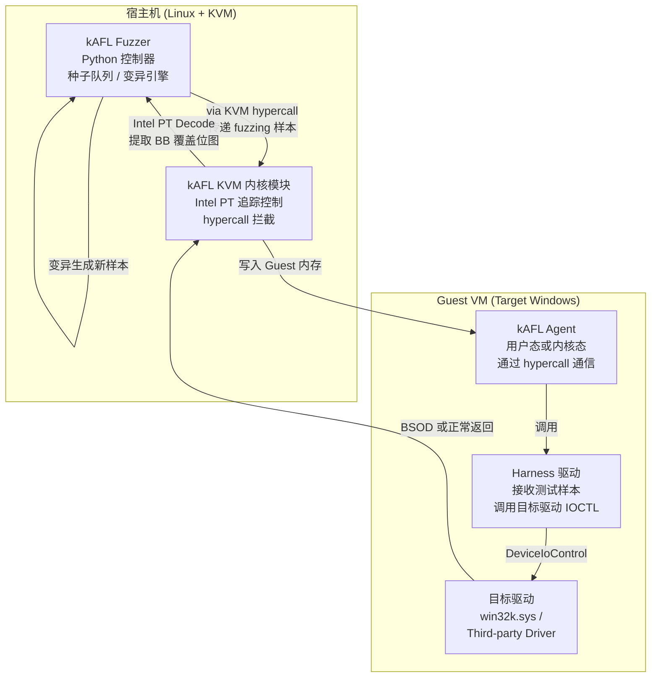

---
tags:
  - Windows
  - 内核
  - tier3
  - fuzzing
  - 安全
---

# Windows 内核 Fuzzing

> [!abstract] TL;DR
> 内核 Fuzzing 是在内核攻击面上系统性地投喂随机/变异输入、由崩溃检测器（Driver Verifier / KASAN / kAFL Harness）捕获异常，从而发现内核漏洞的核心方法论。主要攻击面包括 IOCTL 接口、Win32k 系统调用、文件系统解析器和网络协议栈。工具链从最简单的 IOCTL 盲测脚本，到基于 Intel PT 硬件追踪的覆盖引导型 kAFL/Nyx，再到语法感知的 syzkaller，覆盖从"快速找崩溃"到"高质量覆盖引导"的全谱。崩溃三分类（访问违规/池损坏/双重释放）、去重、根因分析是将原始崩溃转化为可利用漏洞报告的关键步骤。整个流程必须在负责任披露（Coordinated Vulnerability Disclosure）框架下进行。

---

## 概述与定位

内核 Fuzzing（Kernel Fuzzing）是系统安全研究领域中用于发现操作系统内核及其驱动程序中未知漏洞的核心技术手段。与用户态 Fuzzing 相比，内核 Fuzzing 的特殊性体现在：目标运行在特权级 Ring 0，一次触发崩溃即导致整个系统蓝屏（BSOD）；攻击面高度多样化，涵盖系统调用、设备控制接口、文件系统解析、网络协议栈等；崩溃上下文还原需要额外的调试基础设施（双机调试或虚拟机快照）。

### 内核 Fuzzing 在漏洞研究工作流中的位置

典型内核漏洞研究路径如下：

```
攻击面识别 → Fuzzing 输入生成 → 目标执行/崩溃检测 → 崩溃三分类与去重
     ↓                                                        ↓
  IOCTL枚举                                             根因分析（WinDbg）
  系统调用表                                                    ↓
  驱动入口点                                             PoC 构造 → CVD 披露
```

与代码审计相比，Fuzzing 的优势在于覆盖范围广、不依赖源码、能发现代码审计盲区；劣势在于需要大量执行时间、深层路径覆盖困难、崩溃去重需要额外工作。两者通常组合使用：Fuzzing 发现崩溃位置，代码审计确认根因。

### 本系列定位

本篇是系列 38「Windows 内核与驱动逆向」的漏洞挖掘方法论专章，定位在第 13 篇（内核漏洞与利用基础）之后、第 26 篇（内核池风水与高级利用技术）之前的知识节点——从"如何发现漏洞"的方法论角度补全系列空白。读者应已掌握：IOCTL/IRP 基础（第 03 篇）、WinDbg 内核调试（第 07 篇）、内核漏洞类型概念（第 13 篇）。

---

## 原理与机制

### 内核攻击面全景

Windows 内核的攻击面在架构上可分为以下五个主要维度：

**1. 系统调用接口（Syscall Interface）**

用户态程序通过 `ntdll.dll` 的 stub 函数触发 `syscall` 指令进入内核。`KiSystemCall64` 从 SSDT（`nt!KiServiceTable`）中根据系统调用号索引到对应的内核函数。Windows 11 23H2 共有约 460 个系统调用（NT 内核层），每个调用的参数个数、类型、约束都是潜在的 Fuzzing 目标。历史上 `NtCreateSection`、`NtMapUserPhysicalPages`、`NtUserSetWindowLong`（Win32k Shadow SSDT）均出现过参数验证不足导致的越界访问漏洞。

**2. IOCTL 接口（Device I/O Control）**

驱动程序通过 `IoCreateDevice` 创建设备对象，用户态通过 `DeviceIoControl`（底层为 `NtDeviceIoControlFile`）向设备发送 IOCTL 请求。每个 IOCTL 请求包含：
- `IoControlCode`：32 位功能码（含传输方法 METHOD_BUFFERED/DIRECT/NEITHER）
- `InputBuffer` / `InputBufferLength`
- `OutputBuffer` / `OutputBufferLength`

驱动的 `DispatchDeviceControl` 例程接收 IRP 后通过 `switch` 或 `if-else` 路由到具体处理函数。IOCTL 接口是第三方驱动漏洞最密集的攻击面——商业 AV 驱动、显卡驱动、硬件厂商工具驱动均通过 IOCTL 暴露大量接口，且往往缺乏严格的输入校验。

**3. Win32k 内核（Shadow SSDT）**

`win32k.sys`（Windows 10 重构后拆分为 `win32kbase.sys` + `win32kfull.sys`）通过独立的 Shadow SSDT（`W32pServiceTable`）提供约 1400 个 GUI 相关系统调用。`NtUserXxx` / `NtGdiXxx` 函数簇历史上漏洞极为密集（详见第 28 篇）。从 RS1 开始，Windows 引入了 Win32k 系统调用过滤（`PROCESS_MITIGATION_SYSTEM_CALL_DISABLE_POLICY`），Chrome/Edge 沙箱通过此机制完全禁用 Win32k 调用，大幅减少了来自渲染进程的 Win32k 攻击面。但对于运行在非沙箱环境的代码，Win32k 仍是完整攻击面。

**4. 文件系统解析器（Filesystem Parsers）**

内核文件系统驱动（`ntfs.sys`、`fastfat.sys`、`cdfs.sys`、`refs.sys`）在解析磁盘上的文件系统元数据（MFT 记录、目录项、属性流、日志记录）时，畸形磁盘镜像可触发内核中的越界读写。典型案例：
- CVE-2021-31956：NTFS `NtfsQueryEaUserEaList` 池溢出，非分页池越界写，CVSS 7.8
- CVE-2022-21968：Windows SMB 服务器 SMBD 内核崩溃
- CVE-2023-21693：Microsoft PostScript 和 PCL6 驱动 RCE

文件系统 Fuzzing 通常通过挂载畸形的 VHD/IMG 文件触发，配合 KASAN 或 Driver Verifier 检测。

**5. 网络协议栈（Network Stack）**

`tcpip.sys` 处理 TCP/IP 协议栈，`nwifi.sys` 处理 Wi-Fi，`srv2.sys` 处理 SMB 服务端。网络 Fuzzing 可在本机或局域网中向目标注入畸形数据包。BlueKeep（CVE-2019-0708）、EternalBlue（MS17-010）均来自网络协议栈缺陷。

---

### IOCTL Fuzzing 的技术原理

IOCTL Fuzzing 的基本流程分为三步：设备枚举、功能码枚举、输入构造与投喂。

**设备对象枚举**

Windows 对象管理器将所有设备对象挂在 `\Device\` 命名空间下，但大多数有名字的设备还通过符号链接暴露在 `\DosDevices\`（等同于 `\GLOBAL??\`）下，用户态可以通过 `\\.\DeviceName` 形式访问。

枚举方法：
1. **NtQueryDirectoryObject 枚举**：遍历 `\Device\` 和 `\GLOBAL??\` 命名空间，获取所有设备名称和符号链接
2. **驱动逆向**：通过 IDA/Ghidra 分析驱动的 `DriverEntry` 找到 `IoCreateDevice` + `IoCreateSymbolicLink` 调用，确定设备名
3. **工具辅助**：`WinObj`（Sysinternals）可图形化浏览对象命名空间；`DeviceTree` 可列出所有设备对象及其关联驱动

打开设备时，非特权进程通常只能打开已授权的设备（`SecurityDescriptor` 允许）；部分漏洞的触发需要管理员权限打开驱动设备，然后才能触发内核提权。

**IoControlCode 结构**

IOCTL 功能码是一个 32 位整数，其内部结构按 WDK 宏 `CTL_CODE(DeviceType, Function, Method, Access)` 编码：

```
位 [31:16] = Device Type（0x0000–0x7FFF 为系统保留，0x8000+ 为厂商）
位 [15:14] = Required Access（FILE_ANY_ACCESS / FILE_READ_DATA / FILE_WRITE_DATA / BOTH）
位 [13:2]  = Function Code（0x000–0x7FF 为系统保留，0x800–0xFFF 为厂商）
位 [1:0]   = Transfer Method（METHOD_BUFFERED=0, METHOD_IN_DIRECT=1, METHOD_OUT_DIRECT=2, METHOD_NEITHER=3）
```

一个简单的暴力枚举策略是对所有 32 位空间进行系统性扫描，但更有效的方法是先逆向驱动确定实际使用的 DeviceType 和 Function Code 范围，再在该范围内构造输入。

METHOD_BUFFERED 是最常见的传输方式：内核将输入缓冲区内容复制到系统分配的内核缓冲区，处理完后再复制输出。METHOD_NEITHER 最危险，输入/输出缓冲区直接是用户态指针，驱动若不用 `ProbeForRead`/`ProbeForWrite` 校验地址，极易触发任意读写。

**输入构造策略**

盲测（Dumb Fuzzing）：对输入缓冲区填充随机字节或特定模式（0x00 全零、0xFF 全一、0x41 重复、边界值如 0x7FFFFFFF）。快速发现简单的越界访问，但路径覆盖率低。

基于格式的变异（Format-aware Fuzzing）：逆向分析驱动期待的输入格式（通常是结构体），对结构体的每个字段进行边界值变异（整数溢出边界、空指针、无效句柄等）。需要逆向工作量，但效率高得多。

语法/语义感知（Grammar-based Fuzzing）：用描述语言（如 syzkaller 的 syzlang）描述系统调用和 IOCTL 的语义约束（参数类型、合法值范围、依赖关系），Fuzzer 根据语法生成有意义的输入序列。

---

### 覆盖引导 Fuzzing（Coverage-Guided Fuzzing）原理

朴素的随机 Fuzzing 效率极低，因为大多数输入在浅层就被拒绝（参数检查失败、魔数不匹配等），永远无法到达深层代码路径。覆盖引导 Fuzzing 通过在目标代码中插入覆盖追踪探针，记录每次执行时走过的基本块（Basic Block），将覆盖新路径的输入加入种子队列，从而引导 Fuzzer 逐步深入到未探索的代码区域。

**用户态 AFL（American Fuzzy Lop）的覆盖追踪机制**：编译时插桩，在每个基本块入口插入 `__sanitizer_cov_trace_pc_guard` 或 SHM 共享内存计数器更新。每次执行后 Fuzzer 读取共享内存中的边覆盖（Edge Coverage）位图，判断是否发现新路径。

**内核态的覆盖追踪挑战**：内核代码不能随意插桩（会影响 IRQL 管理、时序等），且内核崩溃会导致整个系统重置，Fuzzer 需要重启恢复目标。解决方案分两类：

1. **硬件追踪（Intel PT）**：无需代码修改，CPU 硬件记录控制流 Trace（Packet Trace）。kAFL 和 Nyx 使用此技术。
2. **虚拟化内插桩（KCOV 类）**：在虚拟机 Hypervisor 层拦截目标 VM 的执行，syzkaller 对 Linux 内核使用 KCOV，对 Windows 内核的支持尚在进行中。

---

## 结构/算法/伪代码详解

### kAFL 与 Nyx 架构

kAFL（Kernel American Fuzzy Lop）是 Intel 主导、专为内核 Fuzzing 设计的覆盖引导 Fuzzer，其核心创新是将 Intel Processor Trace（Intel PT）硬件追踪与 KVM 虚拟化结合，在不修改目标内核代码的前提下实现高效的覆盖引导。

架构示意图：



**Intel PT 追踪机制**：Intel PT 是 Broadwell（2014）引入的硬件功能，可以在几乎零 CPU 开销（< 5%）下记录分支目标（TNT Packet：Taken/Not-Taken；TIP Packet：Target IP）。kAFL 的 KVM 模块配置 PT 追踪 Guest VM 中指定地址范围（`CR3` 过滤 + IP 过滤器），追踪完成后在宿主机解码 PT 流，提取经过的基本块地址，生成覆盖位图。

**Nyx（kAFL 的继任者）**：Nyx 在 kAFL 基础上增加了快照 Fuzzing（Snapshot Fuzzing）支持：在 Harness 初始化完成后立即创建 VM 快照（VM Snapshot），每次测试用例执行后从快照恢复，避免了系统重启开销。这使得 Nyx 可以在数秒内完成数千次 fuzzing 迭代，大幅提升覆盖速度。

**Harness 构建**：kAFL/Nyx 的 Windows 目标需要在 Guest VM 中安装一个 Harness 驱动（内核模式）或用户态 Agent。Harness 的职责是：
1. 通过 hypercall（`vmcall` 指令）与宿主机 Fuzzer 通信，接收测试样本（存放在共享内存 Fuzzing Buffer 中）
2. 解析样本格式，构造 IOCTL 请求参数
3. 调用目标驱动的接口（`ZwDeviceIoControlFile` 或直接调用内核函数）
4. 若目标崩溃触发 BSOD，VM 被 Nyx 拦截，记录崩溃上下文并恢复快照

Harness 构建质量直接决定 Fuzzing 效果：过于简单的 Harness 无法覆盖驱动的复杂状态初始化逻辑；过于复杂的 Harness 会拉长每次迭代的执行时间。

### syzkaller Windows 支持现状

syzkaller 是 Google 开发的知名内核 Fuzzer，在 Linux 内核漏洞发现方面成果卓著（每年发现数百个 Linux 内核漏洞）。其核心思想是通过 syzlang（Syscall Description Language）描述系统调用的语义约束，生成语义正确的系统调用序列，配合 KCOV 覆盖追踪实现覆盖引导。

**syzlang 示例（NtCreateFile 的简化描述）**：
```
syz_NtCreateFile(
    handle ptr[out, HANDLE],
    access flags[access_mask],
    objectattr ptr[in, OBJECT_ATTRIBUTES],
    iostatus ptr[out, IO_STATUS_BLOCK],
    allocationsize ptr[in, int64],
    fileattributes flags[file_attributes],
    shareaccess flags[share_access],
    createdisposition flags[create_disposition],
    createoptions flags[create_options],
    eabuffer ptr[in, array[int8]],
    ealength len[eabuffer]
)
```

syzlang 描述了每个参数的类型（`ptr`/`flags`/`int`/`len`）、方向（`in`/`out`）和合法值集合，Fuzzer 根据描述生成符合约束的输入序列，避免了盲目随机输入在参数验证阶段就被拒绝的问题。

**Windows 支持现状（截至 2025 年）**：syzkaller 的 Windows 支持（`executor/executor_windows.cc`）相比 Linux 版本仍然不完整：
- 覆盖追踪：Windows 缺乏类似 KCOV 的内核级覆盖追踪机制，syzkaller Windows 版主要依赖 Kernel Sanitizer（KASAN，21H2+）或无覆盖追踪的盲测模式
- syzlang 描述：Windows 系统调用的 syzlang 描述覆盖约 150 个（Linux 版本超过 5000 个），描述质量参差不齐
- 崩溃恢复：依赖虚拟机快照或 KDNET 调试连接

实际使用中，研究人员通常采用 kAFL/Nyx 进行 Windows 内核 Fuzzing，syzkaller 主要用于已有良好描述的系统调用子集。

### IOCTL Fuzzing 伪代码

下面给出一个结合设备枚举、功能码暴力扫描和变异输入的 IOCTL Fuzzer 伪代码框架（概念性，不含 NT API 完整签名）：

```c
// 阶段一：枚举目标设备
void enumerate_devices(DeviceList* list) {
    HANDLE hDir = open_object_directory(L"\\GLOBAL??");
    OBJECT_DIRECTORY_INFORMATION info;
    while (NtQueryDirectoryObject(hDir, &info, ...) == STATUS_SUCCESS) {
        if (info.TypeName == L"SymbolicLink") {
            // 解析符号链接目标，如果以 \Device\ 开头则加入列表
            UNICODE_STRING target;
            NtOpenSymbolicLinkObject(&hLink, info.Name, ...);
            NtQuerySymbolicLinkObject(hLink, &target, ...);
            if (starts_with(target, L"\\Device\\")) {
                list->add(info.Name, target);
            }
        }
    }
}

// 阶段二：对每个设备枚举合法 IOCTL 码（通过逆向驱动）
// 如果无法逆向，则暴力扫描常见 DeviceType + 低 Function Code
void scan_ioctl_codes(DeviceEntry* dev, IoControlCodeList* codes) {
    UINT16 device_types[] = {0x0022, 0x0027, 0x8000, dev->guessed_type};
    for (UINT16 dt : device_types) {
        for (UINT16 fn = 0x800; fn <= 0xFFF; fn += 4) {
            for (UINT8 method = 0; method <= 3; method++) {
                ULONG code = CTL_CODE(dt, fn, method, FILE_ANY_ACCESS);
                // 投喂零字节缓冲，观察是否被接受（非 STATUS_INVALID_DEVICE_REQUEST）
                NTSTATUS st = probe_ioctl(dev->handle, code, NULL, 0, NULL, 0);
                if (st != STATUS_INVALID_DEVICE_REQUEST) {
                    codes->add(code, method);
                }
            }
        }
    }
}

// 阶段三：变异输入并投喂
void fuzz_device(DeviceEntry* dev, IoControlCodeList* codes) {
    SeedCorpus corpus = load_initial_seeds();
    while (!timeout()) {
        IoControlCode code = codes->pick_random();
        Seed seed = corpus.pick_and_mutate(); // 随机变异
        
        BYTE* input = seed.data;
        ULONG inlen = seed.length;
        BYTE output[4096] = {0};
        
        NTSTATUS st = DeviceIoControl(dev->handle, code, 
                                       input, inlen, 
                                       output, sizeof(output), ...);
        
        // 崩溃由外部 Driver Verifier / VM 监控检测
        // 覆盖追踪（若有 kAFL）决定是否将此输入加入种子队列
        if (has_new_coverage()) {
            corpus.add(seed);
        }
    }
}
```

### 快照 Fuzzing（Snapshot-based Fuzzing）

快照 Fuzzing 是提升内核 Fuzzing 效率的关键技术。基本流程：

1. **初始化阶段**：启动目标 VM，执行目标驱动的初始化代码（打开设备句柄、分配必要资源、进入可 Fuzz 状态）
2. **快照点**：在所有初始化完成、即将开始接收 Fuzzing 输入之前，触发 VM 快照（使用 QEMU/VMware/Hyper-V 的快照机制，或 Nyx 的 VMCALL_ACQUIRE 接口）
3. **Fuzzing 循环**：Fuzzer 写入测试样本 → 恢复快照 → 执行一次 IOCTL 调用 → 检测崩溃/记录覆盖 → 下一次迭代
4. **崩溃持久化**：若触发 BSOD，保存完整的 VM 状态（内存转储 + 快照差异）

快照 Fuzzing 的优势：每次迭代仅需 1–10 毫秒（避免了系统启动开销），可以 Fuzz 需要特定系统状态才能触发的漏洞（如文件系统已挂载、特定注册表键已配置等），且初始快照精确定义了 Fuzzing 起点，保证可重现性。

性能对比（参考数值）：

| Fuzzing 模式 | 迭代速度 | 崩溃可重现性 | 配置复杂度 |
|---|---|---|---|
| 真实机器 + Driver Verifier | ~50 次/秒 | 中（需重启） | 低 |
| VM + 重启恢复 | ~100 次/秒 | 高 | 中 |
| VM 快照 Fuzzing (QEMU) | ~500 次/秒 | 高 | 中 |
| kAFL/Nyx 快照 + Intel PT | ~2000–10000 次/秒 | 高 | 高 |

---

## 工具视角与实战

### Driver Verifier：Fuzzing 的必备伴侣

Driver Verifier（`verifier.exe`，内核组件 `nt!VfXxx`）是 Windows 内置的驱动验证工具，在 Fuzzing 中扮演"错误放大器"角色——它在驱动执行过程中插入额外检查，使原本可能被静默忽略的内存错误立即导致 BSOD（可检测的崩溃），而不是在后续某个随机时刻引发难以追踪的副作用。

**常用 Verifier 选项**（针对 Fuzzing 场景）：

```
Standard Flags（标准检查）:
  Special Pool                  - 在分配块前后加保护页，检测越界访问
  Force IRQL Checking           - 检测在高 IRQL 下访问可分页内存
  Pool Tracking                 - 追踪所有池分配，检测泄漏和双重释放
  I/O Verification              - 验证 IRP 处理的正确性（栈位置、完成例程）

Enhanced Verification:
  DMA Verification              - 验证 DMA 映射和内存正确性
  Security Checks               - 检测与安全相关的驱动错误
  Code Integrity Checks         - 验证内核代码完整性
  
Fault Injection:
  Systematic fault injection    - 系统性地触发随机失败（如内存分配失败）
  IOCTL fuzzing fault injection - 针对 IOCTL 路径随机注入错误
```

**Special Pool 的工作原理**：当 Driver Verifier 为目标驱动启用 Special Pool 时，所有来自该驱动的内存分配都使用特殊池页，分配块被放置在页边界（要么在页的开头，要么在页的末尾），相邻页被设置为不可访问（`PAGE_NOACCESS`）。任何越界访问（读或写）都会立即触发页错误（`EXCEPTION_ACCESS_VIOLATION`），生成 `DRIVER_OVERRAN_END_OF_POOL`（Bug Check 0xC5）或 `BAD_POOL_CALLER`（Bug Check 0xC2）。

**启用 Driver Verifier 的命令**：

```cmd
:: 对指定驱动启用完整 Verifier
verifier /flags 0x209BB /driver targetdriver.sys

:: 查看当前 Verifier 状态
verifier /querysettings

:: 禁用（需重启生效）
verifier /reset
```

在 Fuzzing 环境中，Driver Verifier 应在 VM 中启用，指定目标驱动（避免对全局启用导致 Windows 自身崩溃）。

### KASAN（Kernel Address Sanitizer）

Windows 10 21H2（Build 19044）引入了 Kernel Address Sanitizer（KASAN），与 Linux KASAN 类似，通过编译时插桩在每次内存访问前检查 Shadow Memory，检测栈越界、堆越界和使用已释放内存（Use-After-Free）。

KASAN 的优势在于检测精度高（报告精确的越界字节数和访问类型），劣势是目前仅在 Windows 内部开发构建中可用（非公开 Windows build 的调试功能），公众无法直接在标准 Windows 版本上启用 KASAN。对于研究人员而言，Driver Verifier 的 Special Pool 是功能上最接近的替代方案。

### WinAFL 内核模式配置

WinAFL 是 AFL 的 Windows 移植版，主要用于用户态 Fuzzing，但通过以下方式可以配合 IOCTL Fuzzing：

1. **用户态 Harness 模式**：将 IOCTL 调用封装在用户态进程中，WinAFL 对 Harness 进程进行覆盖追踪（通过 DynamoRIO 插桩或 Intel PT 的用户态 ETW 接口），但无法追踪内核代码路径中的覆盖。崩溃由 BSOD 检测（外部监控虚拟机状态）。
2. **与 Driver Verifier 组合**：WinAFL 负责变异输入和执行，Driver Verifier 负责在内核中检测错误。适合"快速发现崩溃"的场景，不追求覆盖引导的精确性。

WinAFL 的主要价值在用户态协议解析器 Fuzzing（如 Windows 网络协议客户端、文档解析器），对纯内核 Fuzzing 场景不如 kAFL 高效。

### 实战：IOCTL Fuzzing 第三方驱动

以下是针对一个假设的第三方安全软件驱动进行 IOCTL Fuzzing 的完整流程：

**第一步：识别目标设备**

在 IDA Pro 中打开 `targetav.sys`，在函数列表中找到 `DriverEntry`，搜索 `IoCreateDevice` 和 `IoCreateSymbolicLink` 调用：

```c
// IDA 反编译结果（简化）
NTSTATUS DriverEntry(PDRIVER_OBJECT DriverObject, PUNICODE_STRING RegistryPath) {
    ...
    RtlInitUnicodeString(&DeviceName, L"\\Device\\TargetAVDevice");
    IoCreateDevice(DriverObject, sizeof(DEVICE_EXTENSION), &DeviceName, 
                   FILE_DEVICE_UNKNOWN, 0, FALSE, &DeviceObject);
    RtlInitUnicodeString(&SymLinkName, L"\\DosDevices\\TargetAVLink");
    IoCreateSymbolicLink(&SymLinkName, &DeviceName);
    ...
    DriverObject->MajorFunction[IRP_MJ_DEVICE_CONTROL] = DispatchIoControl;
}
```

**第二步：逆向 DispatchIoControl，枚举 IOCTL 功能码**

```c
NTSTATUS DispatchIoControl(PDEVICE_OBJECT DeviceObject, PIRP Irp) {
    PIO_STACK_LOCATION stack = IoGetCurrentIrpStackLocation(Irp);
    ULONG code = stack->Parameters.DeviceIoControl.IoControlCode;
    
    switch (code) {
        case 0x22E000:  // METHOD_BUFFERED, IOCTL_TARGETAV_SCAN_FILE
            return HandleScanFile(Irp, stack);
        case 0x22E004:  // METHOD_BUFFERED, IOCTL_TARGETAV_QUERY_STATUS
            return HandleQueryStatus(Irp, stack);
        case 0x22E008:  // METHOD_NEITHER, IOCTL_TARGETAV_SET_CONFIG
            return HandleSetConfig(Irp, stack);  // 危险！METHOD_NEITHER
        ...
    }
}
```

发现 `0x22E008` 使用 METHOD_NEITHER，`HandleSetConfig` 直接使用 `stack->Parameters.DeviceIoControl.Type3InputBuffer`（用户态指针），若无 `ProbeForRead` 检查，此处是一个典型的任意内核读漏洞候选点。

**第三步：构造 Fuzzing Harness**

```c
// harness.c（在 Guest VM 中编译运行）
#include <windows.h>
#include <stdio.h>

int main() {
    HANDLE hDevice = CreateFile(L"\\\\.\\TargetAVLink", 
                                GENERIC_READ | GENERIC_WRITE,
                                0, NULL, OPEN_EXISTING, 0, NULL);
    if (hDevice == INVALID_HANDLE_VALUE) {
        printf("Cannot open device: %d\n", GetLastError());
        return 1;
    }
    
    // Fuzzing loop：从 stdin 读取样本（配合 AFL/kAFL 使用）
    BYTE buf[4096];
    DWORD inSize;
    ReadFile(GetStdHandle(STD_INPUT_HANDLE), buf, sizeof(buf), &inSize, NULL);
    
    DWORD bytesReturned;
    // 针对 METHOD_NEITHER 的危险 IOCTL
    DeviceIoControl(hDevice, 0x22E008, buf, inSize, NULL, 0, &bytesReturned, NULL);
    
    CloseHandle(hDevice);
    return 0;
}
```

**第四步：在 kAFL/Nyx 中配置并运行**

在宿主机配置 Nyx 的 Fuzzing Target（指定 Guest VM、Harness 路径、IP 追踪范围），设置 Intel PT 过滤范围为目标驱动的加载地址范围（通过 `DriverEntry` 中的 `DriverObject->DriverStart` + `DriverObject->DriverSize` 确定），启动 Fuzzing。

---

### 崩溃捕获与 Bug Check 分析

Windows 内核崩溃（BSOD）生成的最小转储（Minidump）或完整转储（Complete Memory Dump）是崩溃分析的原始材料。

**常见内核 Bug Check 码及含义**：

| Bug Check Code | 含义 | 典型触发场景 |
|---|---|---|
| 0x0000000A (`IRQL_NOT_LESS_OR_EQUAL`) | 在高 IRQL 访问可分页地址 | 驱动在 DISPATCH_LEVEL 解引用用户态指针 |
| 0x0000001E (`KMODE_EXCEPTION_NOT_HANDLED`) | 内核未处理异常 | 空指针解引用、越界访问 |
| 0x00000050 (`PAGE_FAULT_IN_NONPAGED_AREA`) | 非分页区域缺页 | 访问已释放的非分页内存（UAF） |
| 0xC5 (`DRIVER_CORRUPTED_EXPOOL`) | 已损坏的池内存 | 池溢出写越过分配边界 |
| 0xC2 (`BAD_POOL_CALLER`) | 非法池操作 | 双重释放、释放非池内存 |
| 0x19 (`BAD_POOL_HEADER`) | 池头部损坏 | 池溢出覆盖了相邻分配的池头 |
| 0x139 (`KERNEL_SECURITY_CHECK_FAILURE`) | 内核安全检查失败 | 栈 Cookie 溢出、Guard Page 触发 |

**WinDbg 崩溃分析流程**：

```windbg
:: 加载转储文件
.opendump C:\crashes\minidump_001.dmp

:: 自动分析（找崩溃根因的第一步）
!analyze -v

:: 查看崩溃时的调用栈
kb 20

:: 查看崩溃地址的内存内容
dc fffff80012345678 L40

:: 确认崩溃发生在哪个驱动
lm a fffff80012345678

:: 查看池损坏情况
!pool fffff80012345678
!poolused
```

`!analyze -v` 的关键输出段：

```
FAULTING_SOURCE_CODE:  指向崩溃的源代码行（若有符号）
FAULTING_IP:           崩溃时执行的指令地址
EXCEPTION_RECORD:      异常记录（访问地址、读/写标志）
ANALYSIS_SESSION_TIME: 分析时间
STACK_TEXT:            完整的内核调用栈
FOLLOWUP_IP:           推断的根因代码位置
```

---

## 安全性与正确使用

> [!caution]
> **内核 Fuzzing 与漏洞挖掘必须在授权目标、自有系统或专用实验室环境中进行。** 在他人的生产系统、企业网络或公共服务上进行未授权的内核 Fuzzing 或漏洞探测，在大多数司法管辖区构成计算机犯罪（中国《网络安全法》第 27 条、美国 CFAA、欧盟 NIS2 指令等均有明确规定）。**发现的漏洞必须通过负责任披露（Coordinated Vulnerability Disclosure，CVD）流程处理，不得私自利用、出售给漏洞中介或在未经厂商修复前公开披露。** CVD 联系渠道：Microsoft Security Response Center（msrc.microsoft.com）、第三方厂商的安全联系邮件或 HackerOne/Bugcrowd 平台。

### 负责任披露（CVD）流程详解

负责任披露是将安全研究成果转化为改善行业安全状况的正确路径。标准 CVD 流程包含以下阶段：

**第一阶段：漏洞验证与文档化**

在向厂商报告前，研究人员需要完成：
- 最小化可重现 PoC（Proof of Concept）：最简化的触发步骤，移除 Fuzzing 框架依赖
- 崩溃根因分析：确认漏洞类型（越界写/UAF/逻辑错误）和触发条件
- 影响评估：哪些 Windows 版本受影响，是否需要特殊权限，可靠性如何
- CVSS 初步评分：帮助厂商优先排期

**第二阶段：向厂商报告**

通过安全渠道提交报告（加密邮件/厂商漏洞提交门户）。报告内容应包含：
- 漏洞摘要和影响范围
- 详细的根因分析（Bug Check 码、调用栈、崩溃地址）
- 最小 PoC 代码（仅触发崩溃，不含利用代码）
- 建议的修复思路（可选）

**第三阶段：协调修复**

厂商确认漏洞后进入修复阶段。标准披露时间线：
- Microsoft 通常在 90 天内发布补丁（高危漏洞可能加速到 30 天）
- 研究人员在补丁发布后 30–90 天可公开技术细节（CVD 协议约定）
- 若厂商超时未响应或拒绝修复，可申请 CVE 编号后公开（Full Disclosure）

**第四阶段：CVE 申请与公开**

修复完成后，研究人员通常可以：
- 申请 CVE 编号（通过 MITRE CNA 或厂商 CNA）
- 发表安全研究文章、会议演讲（Black Hat、DEF CON、OffensiveCon 等）
- 在厂商安全公告中获得致谢（Security Acknowledgement）

Microsoft Bug Bounty 计划（Microsoft Security Response Center）对 Windows 内核提权漏洞的最高奖励为 **100,000 美元**（完全远程代码执行，无交互），普通本地提权漏洞奖励范围为 **10,000–30,000 美元**。

### Fuzzing 环境隔离要求

内核 Fuzzing 的实验环境应满足以下隔离要求：

1. **物理或虚拟隔离**：在专用虚拟机中进行，虚拟机不应连接生产网络
2. **快照备份**：Fuzzing 前保存 VM 快照，避免目标系统损坏无法恢复
3. **网络 Fuzzing 特殊要求**：网络协议栈 Fuzzing 使用隔离的 VLAN 或 Host-only 网络，防止畸形数据包进入生产网络
4. **崩溃转储安全**：崩溃转储可能包含内核内存镜像（含敏感数据），应安全存储和处理

---

## 小结

Windows 内核 Fuzzing 是漏洞挖掘方法论中技术密度最高的方向之一。本篇系统梳理了以下核心内容：

**攻击面识别**：内核攻击面分为系统调用（SSDT/Shadow SSDT）、IOCTL 接口（第三方驱动密集）、文件系统解析器、网络协议栈四个主要维度。IOCTL 接口因历史上安全审计不足，是最产出丰富的目标。

**技术演进路线**：从朴素的盲测（随机字节填充）→ 格式感知变异 → 覆盖引导 Fuzzing（Coverage-Guided），效率逐级提升一个数量级。kAFL/Nyx 通过 Intel PT 硬件追踪实现了在无代码插桩前提下的高效覆盖引导，代表了当前 Windows 内核 Fuzzing 的技术前沿。

**辅助工具链**：Driver Verifier（Special Pool + IRQL 检查 + 故障注入）是将隐性内存错误转化为可检测崩溃的核心工具；WinDbg 的 `!analyze -v` + `!pool` + 调用栈分析是从原始 Bug Check 还原根因的标准流程。

**崩溃处理**：崩溃三分类（访问违规/池损坏/安全检查失败）、基于调用栈哈希的去重、根因分析是将 Fuzzing 结果转化为可操作漏洞报告的关键步骤。

**合规约束**：内核 Fuzzing 的技术强大与法律责任并存，负责任披露框架是将研究成果转化为行业安全改进的正确路径。

关键学习路径建议：先在 VM 中搭建 Driver Verifier + WinDbg 双机调试环境（第 07 篇），用简单的故意有漏洞的测试驱动（如 HEVD——HackSys Extreme Vulnerable Driver）验证崩溃捕获流程；再引入 kAFL/Nyx 进行覆盖引导 Fuzzing；最终对真实第三方驱动展开研究。

---

## 相关阅读

- 第 03 篇《WDM 驱动模型与 IRP》—— IOCTL 和 IRP 机制基础
- 第 07 篇《WinDbg 内核调试》—— 崩溃分析和双机调试
- 第 13 篇《内核漏洞与利用基础》—— 内核漏洞类型分类
- 第 26 篇《内核池风水与高级利用技术》—— 从崩溃到利用的下游路径
- 第 28 篇《GDI/Win32k 内核攻击面》—— Win32k 攻击面专论
- [kAFL/Nyx GitHub](https://github.com/nyx-fuzz/kAFL) —— Intel PT 内核 Fuzzer
- [syzkaller GitHub](https://github.com/google/syzkaller) —— Google 内核 Fuzzer
- [HEVD](https://github.com/hacksysteam/HackSysExtremeVulnerableDriver) —— 故意有漏洞的训练驱动
- [LOLDrivers](https://www.loldrivers.io/) —— 已知漏洞驱动数据库
- [Microsoft Bug Bounty](https://www.microsoft.com/en-us/msrc/bounty) —— Windows 漏洞赏金计划

---

[[00.Windows内核与驱动逆向总览|⬆ 系列总览]] | [[29.CI.dll与代码完整性WDAC|← 上一章]]
