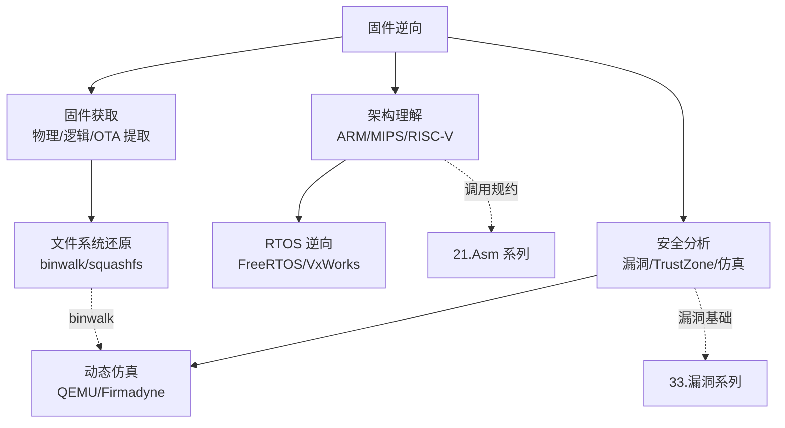

# 固件与IoT嵌入式逆向 · 系列总览

> 作者原创系列，共 **15** 篇。系统拆解 **嵌入式固件与 IoT 设备逆向**：从 **固件提取（物理/逻辑/OTA）**、**固件解包与文件系统分析（binwalk/squashfs/JFFS2）**、**ARM Cortex-M/A 与 MIPS/RISC-V 嵌入式架构**、**Bootloader 逆向（U-Boot/ATF）**、**嵌入式 Linux 内核与设备树**、**RTOS 逆向（FreeRTOS/VxWorks/ThreadX）**、**IoT 通信协议逆向（MQTT/CoAP/Zigbee）**、**硬件调试接口（JTAG/SWD/UART/SPI Flash）**，到 **固件漏洞分析**、**TrustZone 与 OP-TEE 安全世界逆向**、**固件仿真（QEMU/Firmadyne/Avatar2）**、**固件差分与补丁分析**，最后落到 **路由器固件全流程实战**。基准平台 **ARM Cortex-A/M + Linux/RTOS**，工具链 Binwalk/QEMU/IDA/Ghidra/OpenOCD/Firmware Mod Kit。本系列与 [[21.Asm/11 ARM.md|ARM 汇编]]、[[21.Asm/14 RISC-V.md|RISC-V 汇编]]、[[15.操作系统加载与启动/00.操作系统加载与启动总览|OS 加载与启动]]、[[38.Windows内核与驱动逆向/00.Windows内核与驱动逆向总览|Windows 内核逆向]]、[[33.二进制漏洞与利用基础/00.二进制漏洞与利用基础总览|二进制漏洞]]、[[44.调试器原理与实战/00.调试器原理与实战总览|调试器原理]] 深度互补。

> [!caution] 安全与合规
> 本系列漏洞与安全章节（11、13 中相关部分）一律取 **防御与分析视角**：讲清漏洞成因、如何在自有设备上复现与分析、防御措施；**不提供针对他人设备/网络的武器化攻击步骤或可落地的 0day 利用链**。固件逆向用于安全研究、自有设备改造与防御增强。

## 一、固件基础

| # | 章节 | 说明 |
| --- | --- | --- |
| 01 | [[01.嵌入式逆向全景与工具链]] | 固件逆向全貌、工具链（Binwalk/QEMU/IDA/Ghidra/OpenOCD）、IoT 安全威胁面 |
| 02 | [[02.固件提取：物理逻辑OTA方法]] | 物理读取（SPI Flash/JTAG）、逻辑提取（串口/FTP）、OTA 截包 |
| 03 | [[03.固件解包与文件系统]] | binwalk 原理、squashfs/JFFS2/YAFFS2、Firmware Mod Kit、chroot 模拟 |

## 二、嵌入式架构速查

| # | 章节 | 说明 |
| --- | --- | --- |
| 04 | [[04.ARM_Cortex-M与A架构速查]] | Thumb/Thumb-2、异常向量表、AAPCS 调用规约、Cortex-M vs A 对比 |
| 05 | [[05.MIPS与RISC-V嵌入式架构速查]] | MIPS 延迟槽/O32 ABI，RISC-V RV32/RV64 ILEN 固长、调用规约 |

## 三、启动链逆向

| # | 章节 | 说明 |
| --- | --- | --- |
| 06 | [[06.Bootloader逆向：U-Boot与ATF]] | U-Boot SPL→主阶段、ATF BL1/BL2/BL31/BL33、Secure Boot 链 |
| 07 | [[07.嵌入式Linux内核与设备树]] | 内核镜像格式（zImage/Image/uImage）、设备树 DTS/DTB、驱动加载 |

## 四、RTOS 逆向

| # | 章节 | 说明 |
| --- | --- | --- |
| 08 | [[08.RTOS逆向：FreeRTOS与VxWorks与ThreadX]] | 任务/调度/内存管理、符号恢复方法、静态分析识别 RTOS 结构 |

## 五、通信协议与硬件接口

| # | 章节 | 说明 |
| --- | --- | --- |
| 09 | [[09.IoT通信协议逆向]] | MQTT/CoAP/Zigbee/Z-Wave 协议结构、抓包工具、固件内协议实现逆向 |
| 10 | [[10.硬件调试接口：JTAG与SWD与UART]] | JTAG/SWD 信号与 OpenOCD、UART 控制台、SPI Flash 直读（flashrom） |

## 六、安全分析

| # | 章节 | 说明 |
| --- | --- | --- |
| 11 | [[11.固件漏洞分析]] | 栈溢出/命令注入/格式化字符串（固件版）、CVE 分析方法（防御） |
| 12 | [[12.TrustZone与OP-TEE安全世界逆向]] | ARMv8-A TrustZone 架构、OP-TEE 安全 OS、TA/CA 逆向（防御） |

## 七、仿真与补丁分析

| # | 章节 | 说明 |
| --- | --- | --- |
| 13 | [[13.固件仿真：QEMU与Firmadyne与Avatar2]] | QEMU 系统/用户态仿真、Firmadyne 自动化、Avatar2 动静结合 |
| 14 | [[14.固件差分与补丁分析]] | bindiff/bsdiff 原理、patch diffing 提取漏洞信息（防御） |

## 八、实战

| # | 章节 | 说明 |
| --- | --- | --- |
| 15 | [[15.实战：路由器固件全流程分析]] | 提取→解包→仿真→漏洞定位→防御建议，完整案例（防御视角） |

## 固件逆向的三大支柱

> 一句话：固件逆向 = **拿到固件**（提取/解包）+ **读懂架构**（ARM/MIPS/RISC-V 调用规约、RTOS 结构）+ **找出薄弱点**（漏洞分析/TrustZone 安全边界）。配合 QEMU/Firmadyne 仿真把静态分析落到动态验证，你就能完整分析一款 IoT 设备固件——全程防御与研究视角。
