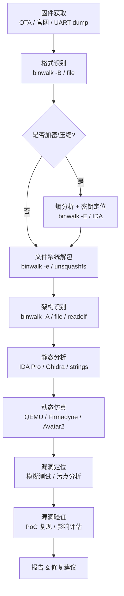

# 固件与IoT（01）· 嵌入式逆向全景与工具链

## 概述与定位

> [!abstract] TL;DR
> 固件逆向是嵌入式安全研究的入口。本章建立整体认知框架：固件在软件栈中的位置、IoT 攻击面分布、从提取到漏洞验证的五步流程，以及贯穿全系列的工具链全景——提取/文件系统/静态分析/动态仿真/硬件调试五大类共 20 余款工具。掌握本章即掌握后续 14 章的地图。

固件（Firmware）是运行在嵌入式处理器上、直接控制硬件的软件层。与桌面应用不同，固件通常烧写在非易失性存储器（NOR/NAND Flash、eMMC）中，在没有操作系统支持的裸机环境或极简 RTOS 环境下运行，对外暴露的接口形式多样：串口控制台、网页管理界面、移动 App API、无线协议（Zigbee/Z-Wave/BLE/Wi-Fi）等。

近年来，家用路由器、智能摄像头、工业 PLC、车载 ECU、医疗设备等 IoT 产品大规模上市，漏洞密度却远高于同期桌面软件。固件逆向因此成为安全研究、产品安全审计、CTF 竞赛中的热点技能。

### 固件在软件栈中的位置

嵌入式系统的软件分层自下而上：

| 层次 | 典型实体 | 作用 |
|------|---------|------|
| 硬件抽象 / Bootloader | U-Boot、SPL、ATF BL1/2/31 | 初始化 CPU、DDR、外设；引导操作系统 |
| 内核 / RTOS | Linux、FreeRTOS、VxWorks、ThreadX | 线程调度、驱动管理、内存保护 |
| 用户态应用 | busybox、httpd、mqtt-broker、业务逻辑 | 向外提供服务，是漏洞的高密区域 |

对比桌面软件的核心差异：

- **存储介质**：Flash（掉电不丢失），而非磁盘；写保护/保密设计复杂
- **更新机制**：OTA 差分包或厂商后台推送，签名验证强度参差
- **调试接口**：JTAG/SWD/UART 物理接口常被留在 PCB，研发阶段未关闭
- **资源受限**：MCU 级设备 RAM 可能只有数十 KB，操作系统级安全机制（ASLR/PIE）常缺失
- **混合架构**：同一产品可能包含 ARM Cortex-M MCU（控制器）+ Cortex-A Linux SoC（应用处理器）+ Zigbee 协处理器

---

## 原理与机制

### IoT 安全威胁面

IoT 设备的攻击面比桌面宽得多，且往往分布在多个独立的入口：

**硬件接口层**
- UART 调试串口（波特率常见 115200、57600、9600）在 PCB 上暴露，无需拆解即可接入
- JTAG/SWD 测试点可直接读写内存、暂停 CPU、提取固件镜像
- Flash 芯片可用 SPI 探针（Bus Pirate、总线分析仪）直接读写

**网络服务层**
- HTTP/HTTPS 管理界面——命令注入、越权、弱会话
- Telnet/SSH——默认凭证、密钥硬编码
- MQTT/CoAP/TR-069——协议认证缺失、主题订阅越权
- UPnP/mDNS——自动发现暴露内网服务

**固件本身**
- 硬编码的默认凭证（admin/admin、root/）
- 调试接口在 release 版本中遗留（`/dev/tty`、gdb stub）
- 不安全的固件更新：未校验签名、HTTP 明文下载、降级攻击

**供应链**
- 第三方 SDK（如 realtek/broadcom SDK 中的 `miniigd`）历史漏洞复用
- 相同固件基底被数十个品牌贴牌使用

### 固件逆向的典型流程

```
固件提取 → 解包分析 → 静态分析 → 动态仿真 → 漏洞定位与验证
```

每个阶段的核心问题：

1. **提取**：我能拿到固件二进制吗？（OTA URL / JTAG / UART dump / Flash 直读）
2. **解包**：固件是否加密？文件系统格式是什么？能否还原目录树？
3. **静态分析**：关键二进制的目标架构是什么？有哪些危险函数调用？
4. **动态仿真**：能否在 QEMU 中跑起来？关键路径能否触达？
5. **漏洞验证**：PoC 能否稳定复现？需要哪些前提条件？

### 固件逆向工作流程（Mermaid）



---

## 结构、工具与伪代码详解

### 工具链全景总览

#### 类别一：固件提取

| 工具 | 用途 | 典型命令 |
|------|------|---------|
| `binwalk` | 固件格式扫描与自动解包 | `binwalk -e firmware.bin` |
| `flashrom` | SPI/LPC/FWH Flash 直读（需编程器） | `flashrom -p ch341a_spi -r dump.bin` |
| `dd` | 物理块设备镜像 | `dd if=/dev/mtd0 of=mtd0.bin bs=65536` |
| `ubireader` | UBI 卷提取 | `ubireader_extract_images ubi.img` |
| OpenOCD + GDB | JTAG 内存 dump | `dump_image mem.bin 0x08000000 0x100000` |

**binwalk 提取示例**

```bash
# 自动递归解包（-M 递归，-e 解包，-d 指定输出目录）
binwalk -Me firmware.bin -d output/

# 仅扫描签名，不提取
binwalk firmware.bin

# opcode 扫描识别架构
binwalk -A firmware.bin

# entropy 分析（曲线平坦=压缩/加密，波动=数据段）
binwalk -E firmware.bin
```

典型输出片段：

```
DECIMAL       HEXADECIMAL     DESCRIPTION
0             0x0             U-Boot second stage bootloader
327680        0x50000         Squashfs filesystem, little endian, version 4.0
```

**flashrom 直读 SPI Flash**

SPI Flash 常见型号：W25Q128（16 MiB）、MX25L12835（16 MiB）。使用 CH341A 编程器：

```bash
# 列出支持的 Flash 型号
flashrom -p ch341a_spi

# 读取整片 Flash
flashrom -p ch341a_spi -c W25Q128.V -r full_dump.bin

# 验证（读两次对比 MD5）
md5sum full_dump_1.bin full_dump_2.bin
```

#### 类别二：文件系统解包

| 工具 | 文件系统 | 说明 |
|------|---------|------|
| `unsquashfs` | SquashFS | 路由器最常见只读压缩根文件系统 |
| `jefferson` | JFFS2 | NAND Flash 日志结构文件系统 |
| `ubireader` / `ubi_reader` | UBIFS | UBI 卷上的日志结构文件系统 |
| `cramfsck` | cramfs | 老版只读压缩，已逐渐被 SquashFS 替代 |
| `7z` / `binwalk` | 通用 | gzip/lzma/xz 等压缩层 |

```bash
# SquashFS（最常见）
unsquashfs squashfs-root.squashfs

# JFFS2
jefferson -d output/ jffs2.img

# UBIFS
ubireader_extract_files ubi.img -o out/
```

**SquashFS 的常见变体**：路由器厂商（如 OpenWrt、DD-WRT）常使用非标 SquashFS（不同 endian、自定义 magic），binwalk 的签名库会标注差异；`unsquashfs` 可能需要指定 `-comp lzma` 或编译补丁版本。

#### 类别三：静态分析

| 工具 | 特点 | 适用场景 |
|------|------|---------|
| IDA Pro | 商业、多架构、成熟插件生态 | ARM/MIPS/RISC-V 二进制深度分析 |
| Ghidra | 免费开源、NSA 出品、多架构 | 快速上手、团队共享、脚本批量分析 |
| `strings` | 提取可打印字符串 | 快速发现 URL、密码、命令模板 |
| `file` | 魔数识别文件类型 | 判断架构/字节序/ELF/UPX |
| `objdump` | 反汇编、节头查看 | 命令行快速查看，脚本集成 |
| `readelf` | ELF 结构详情 | 节名、符号表、动态链接信息 |
| `checksec` | 安全属性检查 | 快速列出 NX/PIE/RELRO/Canary |
| `radare2` | 开源逆向框架 | 脚本化、命令行交互式分析 |

**架构识别三步法**

```bash
# 第一步：file 判断
file httpd
# httpd: ELF 32-bit MSB executable, MIPS, MIPS32 rel2 version 1 (SYSV)

# 第二步：readelf 确认字节序与 ABI
readelf -h httpd | grep -E "Class|Data|Machine"
# Class:       ELF32
# Data:        2's complement, big endian
# Machine:     MIPS R3000

# 第三步：binwalk opcode 扫描（针对裸二进制）
binwalk -A firmware.bin | head -20
# ARM instructions, 32-bit, little endian offset: 0x4000
```

**Ghidra 快速上手流程**

1. 新建 Project → Import File（选 ELF 或裸二进制）
2. 选择正确处理器（`MIPS:BE:32:default:o32` 或 `ARM:LE:32:v8`）
3. Auto Analyze（Function Detection + Decompiler）
4. 在 Symbol Table 搜索 `strcpy`/`system`/`popen` 定位危险函数
5. 使用 Script Manager → Python 脚本批量提取函数签名

#### 类别四：动态仿真

| 工具 | 类型 | 特点 |
|------|------|------|
| QEMU（用户态） | 用户态仿真 | `qemu-mips-static ./httpd`，快速，不含内核 |
| QEMU（系统态） | 全系统仿真 | 虚拟完整硬件，需提供内核+rootfs |
| Firmadyne | 自动化 Linux 固件仿真 | 脚本自动提取+配置网络+启动 |
| Avatar2 | 动静结合 | 真实硬件与仿真器协同（部分外设转发真实设备） |
| PANDA | 动态分析平台 | 基于 QEMU，支持录制/回放、污点分析 |

**QEMU 用户态仿真示例**

```bash
# 安装 QEMU 用户态工具
apt install qemu-user-static

# 将 squashfs 根文件系统挂载后 chroot
mkdir -p squashfs-root/proc squashfs-root/sys squashfs-root/dev
cp $(which qemu-mips-static) squashfs-root/usr/bin/
mount --bind /proc squashfs-root/proc
chroot squashfs-root /usr/bin/qemu-mips-static /bin/sh

# 直接运行单个二进制（不 chroot）
qemu-mips-static -L ./squashfs-root/ ./squashfs-root/usr/sbin/httpd
```

**Firmadyne 自动化仿真**

```bash
git clone https://github.com/firmadyne/firmadyne
cd firmadyne
# 提取固件并分配 IID
./scripts/extract.py firmware.bin
# 推断架构并创建镜像
./scripts/inferNetwork.py 1
./scripts/makeImage.sh 1
# 启动仿真
./scratch/1/run.sh
```

Firmadyne 成功率约 60-70%，失败原因多为：自定义硬件驱动缺失、私有内核模块、加密文件系统。

#### 类别五：硬件调试

| 工具 | 接口 | 用途 |
|------|------|------|
| OpenOCD | JTAG/SWD | 连接调试器、内存读写、断点设置 |
| J-Link / SEGGER | JTAG/SWD | 商业调试器，速度快，支持 Cortex-M/A |
| minicom / screen | UART | 串口终端，连接设备调试控制台 |
| Bus Pirate | SPI/I²C/UART/JTAG | 多协议硬件调试工具 |
| PicoScope / Saleae | 逻辑分析 | 协议解码、时序分析 |

**UART 连接流程**

```
目标设备 PCB                PC
  TX ──────────────────→ RX (USB-TTL 适配器)
  RX ←────────────────── TX
 GND ─────────────────── GND

波特率检测：
1. 常见值顺序尝试：115200 → 57600 → 38400 → 9600
2. 工具：baudrate.py（自动检测）
3. 确认后：minicom -b 115200 -D /dev/ttyUSB0
```

**OpenOCD + GDB 调试 Cortex-M**

```bash
# 启动 OpenOCD（以 ST-Link 为例）
openocd -f interface/stlink.cfg -f target/stm32f4x.cfg

# 另一终端连接 GDB
arm-none-eabi-gdb firmware.elf
(gdb) target extended-remote :3333
(gdb) monitor reset halt
(gdb) load
(gdb) x/8x 0x08000000   # 查看 Flash 起始（向量表）
(gdb) dump binary memory dump.bin 0x08000000 0x08100000
```

#### 类别六：网络分析

| 工具 | 用途 |
|------|------|
| Wireshark | 抓包分析，支持 MQTT/CoAP/Modbus/ZigBee 协议解析 |
| Burp Suite | HTTP/HTTPS 代理拦截，用于 Web 管理界面测试 |
| Scapy | Python 包构造与发送，协议模糊测试 |
| nmap | 端口扫描、服务版本检测 |
| Firmwalker | 固件文件系统内容快速扫描（密码/证书/IP） |

---

## 逆向视角与实战

### 目标架构速查

嵌入式固件常见四大架构，逆向时需立即识别：

| 架构 | 典型设备 | 字节序 | IDA 处理器模块 |
|------|---------|--------|--------------|
| ARM Cortex-M（无 MMU） | MCU、传感器节点 | LE | ARM:LE:32:Cortex |
| ARM Cortex-A（有 MMU） | 路由器 SoC、智能摄像头 | LE | ARM:LE:32:v8 / AARCH64 |
| MIPS32 | 家用路由器（BCM/Atheros/MTK） | BE 为主 | MIPS:BE:32:default:o32 |
| RISC-V | 新兴 IoT MCU、RISC-V 路由器 | LE | RISCV:LE:32:default |
| x86/x64 | 工控 HMI、x86 IoT 网关、部分 NAS | LE | x86 / x86-64 |

### 快速判断固件是否加密

```bash
# 熵值分析：高熵（≈8.0）= 加密或高压缩；低熵有规律 = 未加密代码/数据
binwalk -E firmware.bin

# 如果熵值平坦且接近 8.0，整体可能被 AES 加密
# 寻找解密密钥的路径：
# 1. Bootloader 阶段（U-Boot）常含解密逻辑，先分析早期 Stage
# 2. 厂商 App（Android/iOS）中可能内嵌密钥
# 3. 前序固件版本（如早期未加密版本泄露密钥）
```

### 在 Ghidra 中定位危险函数

```python
# Ghidra Python 脚本：批量列出 system/strcpy/sprintf 的交叉引用
from ghidra.app.script import GhidraScript
from ghidra.program.model.symbol import RefType

dangerous = ["system", "popen", "strcpy", "strcat", "sprintf", "gets"]
fm = currentProgram.getFunctionManager()
for name in dangerous:
    syms = getSymbols(name, None)
    for sym in syms:
        refs = getReferencesTo(sym.getAddress())
        for ref in refs:
            fn = fm.getFunctionContaining(ref.getFromAddress())
            print(f"[{name}] called from {fn} @ {ref.getFromAddress()}")
```

### 从字符串定位攻击面

```bash
# 提取所有字符串，筛选 system/exec/popen 调用上下文
strings -n 8 squashfs-root/usr/sbin/httpd | grep -E "system|exec|popen|cmd|shell"

# 筛选 URL/IP（可能是硬编码的 C&C 或更新服务器）
strings httpd | grep -Eo 'https?://[^ ]+' | sort -u

# 筛选潜在密码（引号包裹的短字符串）
strings httpd | grep -Eo '"[A-Za-z0-9!@#]{4,16}"'
```

### 伪代码分析示例：命令注入检测

```c
// Ghidra 反编译片段（MIPS httpd）
void handle_ping_request(char *ip_addr) {
    char cmd[256];
    sprintf(cmd, "ping -c 3 %s", ip_addr);  // 危险：未过滤 ip_addr
    system(cmd);                              // 命令注入点
}

// 攻击向量：ip_addr = "8.8.8.8; cat /etc/passwd"
// 修复：白名单正则 /^[0-9.]+$/ 验证 ip_addr
```

---

## 安全性与正确使用

> [!caution] 合规边界
> 固件逆向技术应仅用于以下合法场景：
> - **自有设备安全研究**：你拥有设备，目的是发现并修复自己产品或设备的安全问题
> - **授权渗透测试**：持有书面授权，在约定范围内对委托方设备进行安全评估
> - **CTF 竞赛**：在比赛规则范围内使用题目提供的固件
> - **学术研究 / 漏洞赏金**：遵循厂商安全披露政策（Responsible Disclosure），先私下报告再公开
>
> **明确禁止**：
> - 在未经授权的情况下提取、分析他人设备的固件
> - 利用逆向所得信息对他人网络/设备发起攻击
> - 绕过 DRM/版权保护（可能违反 DMCA/著作权法）
> - 将漏洞利用代码发布为武器化工具用于大规模扫描

### 常见误区与陷阱

**误区一：拿到 squashfs 就等于分析完成**

文件系统只是起点。真正的漏洞在于：进程间通信（IPC）、定时任务（cron）、初始化脚本（`/etc/init.d/`）、共享库（`/lib/libXXX.so`）中的逻辑。务必追踪所有 `system()`/`popen()` 的调用链。

**误区二：QEMU 仿真成功 = 行为与真实设备一致**

QEMU 缺失硬件外设（GPIO/SPI/I²C/私有驱动），仿真环境下可能绕过某些硬件校验，也可能触发崩溃。动静结合（Avatar2）或在真实硬件上通过 UART/JTAG 验证是更可靠的方式。

**误区三：高熵 = 一定加密**

lzma/xz 压缩后的熵值同样接近 8.0。需结合 `file` 命令和 magic byte 判断：`FD 37 7A 58 5A 00`（xz）、`42 5A 68`（bzip2）、`1F 8B`（gzip）等压缩格式与加密数据在熵分布上相似，但魔数不同。

### 防御建议（针对固件开发者）

- **禁用调试接口**：发货前熔断 JTAG fuse（OTP），或配置 `SWDIO` 限速检测
- **固件签名验证**：Bootloader 使用 RSA-2048 或 ECDSA P-256 验证内核/rootfs
- **加密敏感分区**：使用 dm-crypt/eCryptfs 加密用户数据分区，密钥存储在 eFuse 或 TEE
- **禁用默认凭证**：强制首次启动修改密码，或使用设备唯一标识符生成初始密码
- **最小化攻击面**：关闭非必要服务（Telnet/UPnP），限制管理界面只监听局域网

---

## 小结

本章建立了固件逆向的整体认知框架：

1. **固件的定位**：嵌入式软件栈（Bootloader/内核/应用）的核心，存储于非易失性 Flash，与桌面软件在更新机制、资源限制、调试接口等方面存在根本差异。

2. **IoT 威胁面**：硬件接口（JTAG/UART/SPI）、网络服务（Web/MQTT/UPnP）、固件本身（默认凭证/不安全更新/调试遗留）三层攻击面相互叠加，构成独特的安全挑战。

3. **五步逆向流程**：提取 → 解包 → 静态分析 → 动态仿真 → 漏洞验证，每步都有对应工具和方法论。

4. **工具链全景**：五大类工具覆盖从 Flash 直读到协议抓包的完整流程，binwalk/QEMU/IDA/Ghidra/OpenOCD 是最核心的工具组合。

5. **架构识别**：`file`/`binwalk -A`/`readelf` 三合一快速判定目标架构和字节序，是后续静态分析的前提。

后续章节将沿此地图深入：第02章讲固件提取的物理/逻辑/OTA 三种方法，第03章讲文件系统解包，第04/05章讲 ARM/MIPS/RISC-V 架构细节……直至第15章完整的路由器固件实战分析。

---

## 相关阅读

- [[21.Asm/11 ARM.md]] — ARM 汇编指令集与 Cortex-M/A 架构详解
- [[21.Asm/12 MIPS.md]] — MIPS 汇编与 O32 ABI
- [[21.Asm/14 RISC-V.md]] — RISC-V 指令集与调用规约
- [[21.Asm/43 启动流程与Bootloader.md]] — U-Boot 与 ATF 启动链
- [[15.操作系统加载与启动/00.操作系统加载与启动总览]] — OS 加载机制总览
- [[33.二进制漏洞与利用基础/00.二进制漏洞与利用基础总览]] — 漏洞利用基础
- [[44.调试器原理与实战/00.调试器原理与实战总览]] — 调试器原理
- [[38.Windows内核与驱动逆向/00.Windows内核与驱动逆向总览]] — 对比：桌面内核逆向

---

🏠 [[00.固件与IoT嵌入式逆向总览]] ｜ 下一篇 [[02.固件提取：物理逻辑OTA方法]] ➡️
