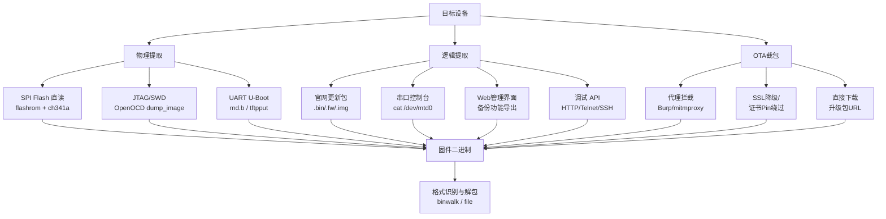

# 固件提取：物理、逻辑与 OTA 三路径

## 概述与定位

> [!abstract] TL;DR
> 固件提取是逆向分析的第一步，也是最容易被低估的一步。拿不到固件二进制，后续一切分析无从谈起。三条主要路径：**物理提取**（直接读 Flash 芯片或通过调试口）、**逻辑提取**（利用设备已有接口和文件系统）、**OTA 截包**（拦截升级流量）。每条路径的适用场景、所需硬件与技能门槛各不相同，实战中往往需要组合使用。

固件逆向的工作流大致为：**拿到固件二进制 → 识别格式 → 解包文件系统 → 静态/动态分析**。本章专注第一步"拿到二进制"，后续章节（03 解包、04 架构、09 硬件调试接口）是本章的延伸。

掌握提取方法还有额外价值：了解设备暴露了哪些接口，本身就是威胁面评估的一部分。一台 UART 控制台未锁的路由器，意味着物理接触者可以在几分钟内拿到完整固件——这是设备制造商必须考虑的设计缺陷。

---

## 原理与机制

### 三条提取路径全景



三条路径的核心区别：
- **物理提取**：需要硬件工具，破坏性风险高，但能绕过软件层的所有保护，是最底层、最可靠的方法。
- **逻辑提取**：利用设备自身接口，门槛低，但依赖设备开放了足够的访问途径。
- **OTA 截包**：完全非侵入，但依赖设备有联网升级功能，且流量未做强加密。

---

## 结构 / 工具 / 详解

### 1. 物理提取

#### 1.1 SPI Flash 直读

SPI NOR Flash 是 IoT 设备中最常见的非易失存储介质，型号如 Winbond W25Q128（16 MB）、GigaDevice GD25Q64 等。这类芯片通过 SPI 总线与主控通信，可在不拆主控 SoC 的情况下独立读取。

**识别芯片**

目视检查 PCB，寻找 SOIC-8 或 DIP-8 封装的小芯片，丝印通常以 `25Qxx`、`MX25Lxx`、`EN25Qxx` 开头。拍照后查阅芯片 datasheet，确认引脚定义（CS#、CLK、MISO、MOSI、WP#、HOLD#、VCC、GND）。

**连接方式**

| 方式 | 适用封装 | 优点 | 风险 |
|------|----------|------|------|
| SOIC-8 夹子（clip） | SOIC-8 | 无需焊接，可在线读取 | 夹不稳时数据出错 |
| 离线拆焊 | 所有封装 | 信号干净，100% 可靠 | 需热风枪，芯片可能损坏 |
| 探针飞线 | QFP/BGA | 不拆芯片 | 焊接难度高 |

最常见的流程是在线夹取：**断开设备电源 → 夹上 clip → 用编程器供电并读取**，注意此时主板上的 MCU 也会同时上电，可能与编程器争抢总线。解决方法：在 SPI Flash 的 CS# 引脚和主控之间断开（切割 PCB 走线或拔掉主控的 VCC 去耦电容让主控不启动）。

**使用 flashrom 读取**

```bash
# 列出支持的编程器
flashrom --list-supported 2>/dev/null | grep -i ch341

# 用 ch341a USB 编程器读取
flashrom -p ch341a_spi -r firmware.bin

# 读取两次，对比 MD5，确认数据一致性
flashrom -p ch341a_spi -r firmware_verify.bin
md5sum firmware.bin firmware_verify.bin
```

> [!warning] flashrom 输出示例
> ```
> flashrom v1.4.0 on Linux 6.1.0 (x86_64)
> flashrom is free software, get the source code at https://flashrom.org
>
> Using clock_gettime for delay loops (clk_id: 1, resolution: 1ns).
> Found GigaDevice flash chip "GD25Q128C" (16384 kB, SPI) on ch341a_spi.
> Reading flash... done.
> ```
> 若出现 `No EEPROM/flash device found` 或 `Calibration failed`，通常是 clip 接触不良或 3.3 V 供电不稳，换短线、确认 VCC 电压后重试。

**常用编程器对比**

| 编程器 | 接口 | flashrom 参数 | 价位 |
|--------|------|----------------|------|
| ch341a（黑板） | USB | `-p ch341a_spi` | ~¥30 |
| FT232H | USB | `-p ft232_spi` | ~¥80 |
| Bus Pirate v3 | USB | `-p buspirate_spi` | ~¥200 |
| Raspberry Pi | GPIO | `-p linux_spi:dev=/dev/spidev0.0` | 板载 |

> [!caution] 物理接触合规边界
> **仅对自有设备或已获书面授权的设备操作**。拆解、焊接或切割 PCB 走线属于不可逆物理操作，可能导致设备永久损坏，且在未授权的情况下可能违反相关法律法规。芯片型号不确定时务必先查 datasheet，施加错误电压（如 1.8 V 芯片接 3.3 V）会立即烧毁芯片。

---

#### 1.2 JTAG/SWD 读取内存

JTAG（Joint Test Action Group，IEEE 1149.1）和 SWD（Serial Wire Debug）是调试接口标准，通过它们可以在运行时访问处理器的内存总线，包括映射到内存空间的 Flash 区域。

**找到 JTAG/SWD 引脚**

PCB 上常见 JTAG 测试孔（通孔或 SMD 焊盘），标记为 `TCK`、`TMS`、`TDI`、`TDO`、`TRST`（JTAG）或 `SWDIO`、`SWDCLK`（SWD）。可用万用表测量电阻特征或用 JTAGulator 自动枚举引脚。

**使用 OpenOCD 导出 Flash 内容**

```bash
# 连接目标（以 STM32F4 + ST-Link V2 为例）
openocd -f interface/stlink.cfg -f target/stm32f4x.cfg

# 进入 telnet 控制台
telnet 127.0.0.1 4444

# 暂停核心，导出 Flash 内容（地址 0x08000000，大小 1 MB）
halt
dump_image stm32_flash.bin 0x08000000 0x100000
resume
```

> [!warning] OpenOCD dump_image 输出示例
> ```
> Open On-Chip Debugger 0.12.0
> Info : STLINK V2J45S7 (API v2) VID:PID 0483:3748
> Info : Target voltage: 3.301590
> Info : stm32f4x.cpu: Cortex-M4 r0p1 processor detected
> Info : Halt timed out, wake up gdb.
> dumped 1048576 bytes in 8.232487s (124.456 KiB/s)
> ```

对于有 MMU 的 Cortex-A 设备（跑 Linux），Flash 通常挂在 SPI 控制器而非直接内存映射，此时 dump 内存地址得到的是 RAM 内容（运行时内核/文件系统），需要知道 mtd 分区地址才能精确导出。

---

#### 1.3 UART 控制台与 U-Boot

绝大多数 IoT 设备的 SoC 都预留了 UART 调试口，波特率通常为 115200 8N1。U-Boot 是最常见的 Bootloader，它在内核启动前提供一个命令行窗口。

**中断 U-Boot 启动**

设备上电后，UART 控制台会显示 U-Boot 启动日志，数秒内按下任意键（或特定组合键，如 `Ctrl+C`、`s`）可中断进入 `=>` 提示符。不同厂商中断方式各异，部分设备锁定了 U-Boot 控制台需要特殊密码（后续章节讨论绕过）。

**常用 U-Boot 命令**

```bash
# 查看环境变量（包含内核参数、启动命令、IP 配置等）
=> printenv

# 显示内存内容（内存映射 Flash 地址）
# md.b <地址> <字节数>
=> md.b 0xBF000000 0x100

# 将 Flash 内容上传到 TFTP 服务器
# 先设置网络环境
=> setenv ipaddr 192.168.1.2
=> setenv serverip 192.168.1.100
=> tftpput 0xBF000000 0x1000000 firmware_backup.bin

# 用 loady（Ymodem 协议）从串口接收文件（也可反向发送）
=> loady 0x80000000
```

> [!warning] U-Boot 环境变量示例（printenv 节选）
> ```
> bootargs=console=ttyS0,115200 root=/dev/mtdblock2 rootfstype=squashfs
> bootcmd=bootm 0xBF050000
> ipaddr=192.168.1.1
> serverip=192.168.1.100
> mtdparts=spi0.0:256k(boot),64k(env),14976k(firmware),-(reserve)
> ```
> `mtdparts` 行直接给出了各分区的偏移和大小，是固件结构分析的重要线索。

---

### 2. 逻辑提取

逻辑提取的核心优势是**无需硬件工具、不触碰 PCB**。其前提是设备已经运行，且暴露了足够多的软件层接口。

#### 2.1 制造商更新包

最简单的方法：直接从制造商官网下载固件更新包。许多厂商提供 `.bin`、`.fw`、`.img`、`.zip`、`.trx` 格式的升级文件，这些文件通常是完整固件打包（Bootloader + 内核 + 文件系统），可以直接送入 binwalk 分析。

```bash
# 下载示例（根据实际 URL 替换）
wget "https://example-vendor.com/firmware/router_v2.0.1.bin" -O firmware.bin

# 直接用 binwalk 扫描
binwalk firmware.bin
```

部分厂商会加密或签名固件包，此时 binwalk 输出高 entropy，需要先找解密流程（见 §加密固件处理）。

#### 2.2 串口控制台（运行中 Linux 系统）

若设备运行嵌入式 Linux 且 UART shell 可用（或有 Telnet/SSH），可直接从内核 mtd 接口读取 Flash 内容：

```bash
# 查看 mtd 分区表
cat /proc/mtd
# 输出示例：
# dev:    size   erasesize  name
# mtd0: 00040000 00010000 "boot"
# mtd1: 00010000 00010000 "config"
# mtd2: 00e40000 00010000 "firmware"

# 方法1：读取字符设备（只读）
cat /dev/mtd2 > /tmp/firmware.bin

# 方法2：读取块设备（可能更稳定）
dd if=/dev/mtdblock2 of=/tmp/firmware.bin bs=65536

# 传出到本机（需设备有 nc / curl / wget）
# 本机监听：nc -l -p 4444 > firmware.bin
nc 192.168.1.100 4444 < /tmp/firmware.bin

# 或通过 SCP（若有 dropbear SSH）
scp root@192.168.1.1:/tmp/firmware.bin ./
```

#### 2.3 Web 管理界面备份功能

家用路由器/NAS 的 Web 管理界面通常提供"配置备份"功能，导出 `.cfg`、`.tar`、`.gz` 等格式。这些备份文件有时包含的不仅仅是配置，还可能嵌入完整固件镜像或关键文件系统片段。解包后常可找到明文密码、加密密钥等敏感信息。

#### 2.4 调试 API

部分设备在 HTTP、Telnet、SSH 接口上暴露了调试功能，例如：
- 未认证的 HTTP 端点返回设备信息或日志
- 默认 Telnet（23 端口）提供 root shell
- SSH 已知弱密钥对（如厂商预置测试密钥）

扫描设备开放端口是逻辑提取的第一步：

```bash
nmap -sV -p 22,23,80,443,8080,8443 192.168.1.1
```

---

### 3. OTA 截包

OTA（Over-The-Air）升级流程是固件从服务器传输到设备的过程，截获这个流量即可拿到完整的升级包。

#### 3.1 设置代理拦截

最直接的方式是将设备流量路由经过 Burp Suite 或 mitmproxy：

```bash
# 启动 mitmproxy，监听 8080
mitmproxy -p 8080 --mode transparent

# 在路由器/AP 上为设备设置静态路由，将流量导向分析机
# 或在设备上手动设置 HTTP 代理（若设备支持）
```

观察 OTA 触发时（在设备管理界面点"检查更新"）的 HTTP 请求，找到固件下载 URL。

#### 3.2 SSL/TLS 降级与证书 Pin 绕过

若升级流量走 HTTPS，需要：

1. **安装 mitmproxy 根证书**到设备信任链（若设备基于 Linux，可能需 shell 访问）
2. **SSL Stripping**：若设备升级客户端未强制 HTTPS，可降级为 HTTP
3. **证书 Pinning 绕过**：若设备内置了服务器证书指纹，需修改 Bootloader 或升级客户端代码来解除限制——这已经属于物理层面的操作前提

> [!caution] SSL 降级合规说明
> SSL/TLS 降级和证书 Pin 绕过操作**仅在自有设备上进行安全研究时合法**。对他人设备或网络进行此类操作构成中间人攻击，违反法律。

#### 3.3 直接下载升级包

若已从代理日志中获取到升级包 URL：

```bash
# 直接下载（HTTP 明文）
wget "http://update.example-vendor.com/firmware/v2.0.1/router.bin" -O firmware_ota.bin

# HTTPS 但证书验证弱时
curl -k "https://update.example-vendor.com/firmware/v2.0.1/router.bin" -o firmware_ota.bin
```

---

### 4. 固件格式识别与初步分析

拿到二进制文件后，第一步是快速识别其结构。

#### 4.1 基础文件识别

```bash
# 识别已知格式（magic bytes）
file firmware.bin

# 常见输出
# firmware.bin: u-boot legacy uImage, ...
# firmware.bin: Squashfs filesystem, little endian, ...
# firmware.bin: data   ← 加密/压缩/自定义格式
```

#### 4.2 binwalk 魔数签名扫描

```bash
binwalk firmware.bin
```

> [!warning] binwalk 输出示例
> ```
> DECIMAL       HEXADECIMAL     DESCRIPTION
> --------------------------------------------------------------------------------
> 0             0x0             U-Boot image, header size: 64 bytes, ...
> 64            0x40            LZMA compressed data, properties: 0x5D, ...
> 1048576       0x100000        Squashfs filesystem, little endian, version 4.0,
>                               compression:lzma, size: 6291456 bytes, ...
> 7340032       0x700000        JFFS2 filesystem, little endian
> ```
> 从偏移信息可以直接推断各分区布局：0x0 为 Bootloader（LZMA 压缩内核紧随其后），0x100000 处是 SquashFS 根文件系统，0x700000 是 JFFS2 可写分区（通常存配置）。

#### 4.3 entropy 分析

```bash
binwalk -E firmware.bin
```

entropy 图是判断固件是否加密的重要手段：
- **低 entropy（0.0–0.5）**：未压缩的数据或代码（文本、结构体）
- **中等 entropy（0.5–0.8）**：压缩数据（LZMA/gzip/zlib）
- **高 entropy（接近 1.0，均匀分布）**：AES 等对称加密的密文

若整个固件 entropy 接近 1.0，说明被整体加密，需要先找解密逻辑（通常在 Bootloader 中，或需通过云端 API 获取解密密钥）。

#### 4.4 字符串快速情报

```bash
# 搜索版本号、型号、密码等关键字符串
strings firmware.bin | grep -i "version\|model\|password\|secret\|key\|token"

# 搜索 URL（可能揭示 OTA 服务器或云端 API）
strings firmware.bin | grep -E "https?://"

# 搜索常见配置文件路径
strings firmware.bin | grep -E "^/etc/|^/var/|^/tmp/"
```

---

## 逆向视角 / 实战

### 实战场景：提取家用路由器固件

以一台典型的 MIPS 架构家用路由器为例，展示多路径组合使用：

1. **先尝试逻辑路径**：访问制造商官网，搜索型号，下载 `.bin` 固件。若官网不再提供旧版本，尝试 `archive.org` 或第三方固件镜像站。

2. **若下载包加密**：连接 UART，中断 U-Boot，执行 `printenv` 获取启动参数和 Flash 布局，用 `md.b` 扫描 Flash 内容，确认加密区段范围。

3. **物理直读**：定位 SPI Flash 芯片（在 BCM4707/MT7621 等路由器主板上通常在主 SoC 旁边），夹上 SOIC-8 clip，用 flashrom 读取完整 16 MB 内容。

4. **格式验证**：
```bash
binwalk router_flash.bin
# 预期看到：
# 0x0     CFE（Broadcom Bootloader）或 U-Boot
# 0x40000  Linux 内核（LZMA 压缩）
# 0x140000 SquashFS 根文件系统
```

5. **解包提取**：
```bash
binwalk -Me router_flash.bin
# 在 _router_flash.bin.extracted/ 中找到 squashfs-root/
ls _router_flash.bin.extracted/squashfs-root/etc/
```

### 常见陷阱

| 陷阱 | 现象 | 解决方法 |
|------|------|----------|
| Flash 在线夹取主控干扰 | 读出全 0xFF 或数据乱 | 断开主控电源或 CS# 走线 |
| 1.8 V Flash 接 3.3 V | 芯片烫或无响应 | 用万用表测 VCC 引脚，选对电压 |
| U-Boot 控制台锁定 | 按键无响应，直接启动内核 | 尝试硬件 GPIO 触发或 JTAG 进入调试 |
| binwalk 误报 | 偏移处"识别"到格式但提取失败 | 手动验证 magic bytes，用 hexdump 确认 |
| 固件整体加密 | entropy ≈ 1.0 | 找 Bootloader 解密流程，或从运行设备内存 dump |

---

## 安全性与正确使用

### 合规边界

> [!caution] 法律与伦理边界
> - **自有设备原则**：本章所有技术仅适用于您拥有所有权或已获书面授权进行安全研究的设备。
> - **物理不可逆后果**：焊接、切割 PCB 走线是永久性操作，可能导致设备报废。在不熟练时先在废旧电路板上练习。
> - **数据安全**：提取的固件可能包含私钥、用户凭据、云服务 Token。妥善保管，不得泄露。
> - **CFAA/相关法规**：在未授权情况下访问设备固件可能违反《计算机欺诈与滥用法》（美国）或其他国家的类似法规。国内参考《网络安全法》第 27 条。

### 防御视角：制造商应做什么

了解提取方法，也帮助我们理解防御策略：

| 攻击路径 | 防御措施 |
|----------|----------|
| SPI Flash 直读 | Flash 加密（如 ESP32 的 Flash 加密功能、STM32 的 RDP 读保护） |
| JTAG 读取 | 熔断 JTAG 熔丝（eFuse 永久禁用） |
| UART U-Boot 中断 | 设置 U-Boot 密码；禁用 U-Boot 控制台输出 |
| 固件下载 | 强制 HTTPS + 证书 Pinning；固件加密 + 签名验证 |
| Web 备份功能 | 备份包加密；不包含完整固件 |

---

## 小结

本章系统介绍了固件提取的三条主路径：

1. **物理提取**（SPI Flash clip + flashrom、JTAG + OpenOCD、UART + U-Boot）：可靠性最高，能绕过软件层保护，但需要硬件工具和一定的焊接技能，存在不可逆物理风险。

2. **逻辑提取**（官网下载包、串口/SSH 控制台、Web 备份、调试 API）：门槛低，无需硬件，但依赖设备自身的软件层接口是否开放。

3. **OTA 截包**（代理拦截、SSL 降级/Pin 绕过、URL 直接下载）：完全非侵入，适用于有联网升级能力的设备，需要对 TLS 有一定了解。

拿到二进制后，通过 `file`、`binwalk`、`binwalk -E`、`strings` 四件套可以快速定位固件结构、判断是否加密、提取初步情报。加密固件的处理和详细解包流程见下一章。

**三个关键记忆点**：
- `flashrom -p ch341a_spi -r firmware.bin` 是最常用的物理提取命令
- entropy 接近 1.0 意味着加密，不是压缩失败
- U-Boot `printenv` 中的 `mtdparts` 直接给出完整分区表

---

## 相关阅读

- [[01.嵌入式逆向全景与工具链]] — 工具链全景，包括 binwalk/QEMU/IDA/Ghidra/OpenOCD 的安装与概览
- [[03.固件解包与文件系统]] — binwalk 提取原理、SquashFS/JFFS2 解包、Firmware Mod Kit 重打包
- [[09.硬件调试接口JTAG_SWD_UART_SPI]] — JTAG/SWD/UART 接口详解，JTAGulator 枚举，OpenOCD 高级用法
- [[15.路由器固件全流程实战]] — 端到端综合实战，本章提取方法的实战应用

---

⬅️ 上一篇 [[01.嵌入式逆向全景与工具链]] ｜ 🏠 [[00.固件与IoT嵌入式逆向总览]] ｜ 下一篇 [[03.固件解包与文件系统]] ➡️
