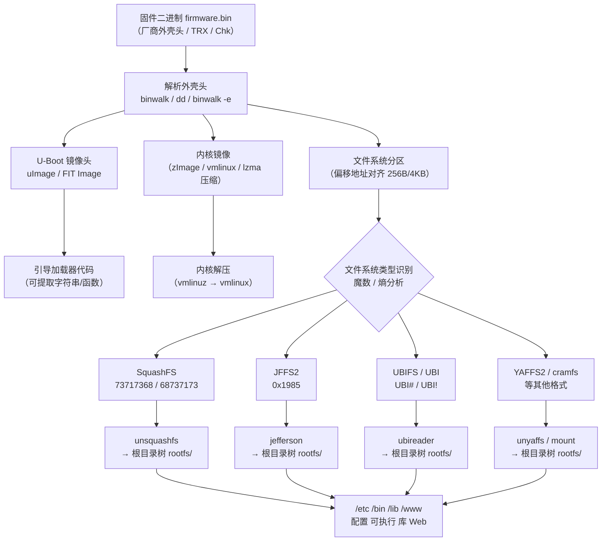

# 固件解包与文件系统

## 概述与定位（TL;DR）

> [!abstract] TL;DR
> binwalk 递归解包（`-Me`）→ 识别 squashfs/JFFS2/UBIFS 等嵌入式文件系统 → unsquashfs/jefferson 提取根目录 → 分析 `/etc`/`/bin`/`/www` 寻找凭据与漏洞点。

获取到固件二进制之后，逆向工作的第一道关口就是**解包**：从外层封装中剥离出内核镜像和根文件系统，再从文件系统中还原出可执行文件、配置、证书等可分析对象。这一过程看似机械，实则暗藏细节——不同厂商选用不同的封装格式与文件系统，同一固件可能嵌套三四层压缩；而魔数识别、熵分析、偏移计算等技术正是穿透这些层次的核心手段。

本章覆盖：

- **binwalk** 的工作原理与常用参数组合
- 六种主流嵌入式文件系统（SquashFS / JFFS2 / UBIFS / YAFFS2 / cramfs / ext2）的识别与解包
- 解包后的目录结构分析与凭据/密钥定位
- Firmware Mod Kit 和 `chroot`+QEMU 快速仿真

完成本章后，你应该能够独立对一个未知固件进行分层解包，并输出可供进一步分析的文件系统目录树。

---

## 原理与机制

### 固件封装的层次结构

嵌入式固件的典型封装方式是「洋葱结构」：外层是厂商自定义头（含设备型号校验、CRC、版本号），中间层是 U-Boot 或 TRX 等引导相关镜像，最内层才是可读写的根文件系统。



### 熵分析的意义

**信息熵**（Shannon Entropy）是 binwalk `-E` 选项背后的核心度量。未压缩数据熵值约 5–6 bit/byte，压缩或加密数据接近 8 bit/byte（趋近随机），明文字符串区段则低于 4 bit/byte。通过观察熵曲线的突变点，可以快速判断：

- 高熵平台区：已压缩/加密区段（squashfs、lzma、加密分区）
- 熵值下降区：未压缩代码/数据段（U-Boot 引导代码、设备树 DTB）
- 熵值骤降至 0 附近：填充字节（`0xFF` 代表 NAND 擦除块，`0x00` 代表对齐填充）

---

## binwalk：固件分析的瑞士军刀

### 工作原理

binwalk 的扫描逻辑分三层：

1. **魔数签名扫描**：内置 `magic` 数据库（来自 libmagic 扩展），以滑动窗口逐字节匹配数百种文件格式的起始字节序列。命中即输出偏移、大小估算和格式描述。
2. **操作码扫描**（`-A`）：识别常见 CPU 架构的函数序言指令序列（ARM `PUSH {lr}`、MIPS `ADDIU sp` 等），用于在无符号裸固件中定位代码段起始点。
3. **熵分析**（`-E`/`-B`）：对整个文件计算滑动窗口熵值，生成图表或原始数据，辅助定位压缩边界和加密区段。

### 常用命令速查

```bash
# 1. 基本扫描：输出所有识别到的格式及偏移
binwalk firmware.bin

# 2. 自动提取所有识别格式（输出到 _firmware.bin.extracted/）
binwalk -e firmware.bin

# 3. 递归提取（对提取出的文件再次扫描提取，适合多层嵌套）
binwalk -Me firmware.bin

# 4. 仅提取特定格式（squashfs），避免提取出大量无用碎片
binwalk -D 'squashfs:squashfs' firmware.bin

# 5. CPU 架构 opcode 扫描
binwalk -A firmware.bin

# 6. 熵分析（生成 PNG 图表）
binwalk -E firmware.bin

# 7. 原始熵数据（适合脚本处理）
binwalk -B firmware.bin

# 8. 组合：扫描 + 熵图 + 提取
binwalk -eE firmware.bin
```

> [!warning] 示例输出为示意
> ```
> DECIMAL       HEXADECIMAL     DESCRIPTION
> -------------------------------------------------------
> 0             0x0             TRX firmware header, little endian,
>                               image size: 7208960 bytes, CRC32: 0x...
> 28            0x1C            LZMA compressed data, properties: 0x5D
> 1179648       0x120000        Squashfs filesystem, little endian,
>                               version 4.0, compression: xz,
>                               size: 5767168 bytes, 1234 inodes
> ```

### 识别嵌套格式的工作流

1. **首次扫描**：`binwalk firmware.bin` — 确认外层格式（TRX/Chk/BIN头）及内部分区偏移。
2. **定向提取**：用 `dd` 精确抠出文件系统分区（避免引入外壳字节干扰）。
   ```bash
   dd if=firmware.bin bs=1 skip=1179648 of=rootfs.sqsh
   ```
3. **二次扫描**：`binwalk rootfs.sqsh` — 确认文件系统格式及版本。
4. **解包文件系统**：根据格式选用对应工具（见下节）。
5. **三次扫描**（如需要）：对解包出的 `.tar.gz`、`.ipk` 等二次包再次 `binwalk -Me`。

> [!tip] `-M`（`--matryoshka`）参数
> binwalk 3.x 开始支持 `-M` 递归提取，内部使用工作队列对新提取的文件再次触发扫描，省去手动 dd + 二次扫描的步骤。但对 UBI 镜像等格式识别率有限，仍建议配合专用工具使用。

---

## 常见嵌入式文件系统详解

### 文件系统横向对比

| 文件系统 | 魔数（小端十六进制） | 典型压缩 | 读写属性 | 常用工具 | 典型设备 |
|----------|----------------------|----------|----------|----------|----------|
| **SquashFS** | `73 71 73 68`（`sqsh`）/ `68 73 71 73`（大端 `hsqs`） | lzma / xz / gzip / lzo / zstd | 只读 | unsquashfs / mksquashfs | 路由器、NAS、IP 摄像头 |
| **JFFS2** | `19 85`（LE 节点魔数） | zlib / lzma | 读写（日志结构） | jefferson | 早期路由器、嵌入式 Linux |
| **UBIFS** | `31 18 10 06`（超块魔数） | lzo / zlib | 读写 | ubireader / mtd-utils | 智能家居、工控设备 |
| **UBI** | `55 42 49 23`（`UBI#`） | 无（卷管理层） | 读写 | ubireader / ubi-utils | NAND Flash 卷层 |
| **YAFFS2** | 无固定魔数（页结构） | 无 | 读写 | unyaffs | Android 早期 /data |
| **cramfs** | `45 3D CD 28`（`0x28CD3D45`） | zlib | 只读 | mount -o loop / cramfsck | 老旧嵌入式 Linux |
| **ext2/3/4** | `53 EF`（超块偏移 0x438） | 无 | 读写 | mount / e2tools | 通用 Linux 设备 |

### SquashFS（最常见）

SquashFS 是嵌入式 Linux 固件中最广泛使用的只读压缩文件系统，占据路由器、NAS、摄像头市场超过 70% 的份额。

**识别方式**：

```bash
# 检查魔数（小端设备）
xxd rootfs.sqsh | head -1
# 00000000: 7371 7368 ...  → "sqsh" 即 SquashFS 小端

# 大端设备（MIPS big-endian 路由器）
# 00000000: 6873 7173 ...  → "hsqs"
```

**解包命令**：

```bash
# 解包到 output/ 目录
unsquashfs -d output firmware.sqsh

# 指定压缩算法（当 unsquashfs 报错时强制指定）
unsquashfs -d output -comp lzma firmware.sqsh

# 列出内容不解包（快速检查）
unsquashfs -ll firmware.sqsh | head -50
```

> [!warning] 示例输出为示意
> ```
> Parallel unsquashfs: Using 4 processors
> 1234 inodes (1456 blocks) to write
>
> [==========================================|] 1456/1456 100%
>
> created 1023 files
> created 87 directories
> created 134 symlinks
> created 12 devices
> created 0 fifos
> created 0 sockets
> ```

**重打包**（固件修改后需要）：

```bash
# 与原始固件保持相同压缩算法（lzma）和块大小（128K）
mksquashfs output/ firmware_new.sqsh -comp lzma -b 131072 -noappend

# 使用 xz 压缩（较新设备）
mksquashfs output/ firmware_new.sqsh -comp xz -b 262144 -noappend
```

> [!warning] 重打包注意事项
> 重打包后的 squashfs 大小会略有差异，需要同步更新外层 TRX/Chk 头部的 CRC 和大小字段，否则设备刷写时校验失败。可使用 `firmware-mod-kit` 中的 `build-firmware.sh` 自动处理。

### JFFS2（NAND Flash 日志结构）

JFFS2（Journalling Flash File System 2）专为 NOR/NAND Flash 设计，支持读写，节点采用日志链表结构，掉电安全。

**NAND 特殊处理**：

NAND Flash 的每个页除数据区外，还有 OOB（Out-Of-Band）区域用于存储 ECC 和坏块标记。从 NAND dump 中提取 JFFS2 时，必须先去除 OOB 数据，否则 jefferson 无法正确解析。

```bash
# 常见页大小：512B 数据 + 16B OOB = 528B/page
# 先用 nanddump 工具去除 OOB（在设备上操作）
nanddump -o /dev/mtd2 -f jffs2_with_oob.bin

# 使用 binwalk 处理（自动检测并跳过 OOB）
binwalk -e jffs2_with_oob.bin

# 使用 jefferson 直接解包（支持自动检测 OOB）
jefferson -d output firmware.jffs2

# 指定页大小（2048B 页 + 64B OOB）
jefferson -d output -p 2048 firmware.jffs2
```

> [!warning] 示例输出为示意
> ```
> Scanning 0x2000000 bytes of data
> Found valid JFFS2 header at 0x0
> Extracting 847 inodes...
> Done extracting JFFS2
> ```

### UBIFS / UBI

UBI（Unsorted Block Images）是 NAND Flash 上的卷管理抽象层，解决了 JFFS2 在大容量 NAND 上的扩展性问题。UBIFS 是构建在 UBI 卷之上的文件系统。

**层次关系**：

```
物理 NAND Flash
    └── UBI 层（磨损均衡 + 坏块管理）
            └── UBI 卷 1（rootfs）→ UBIFS 文件系统
            └── UBI 卷 2（data）  → UBIFS 文件系统
```

**解包流程**：

```bash
# 安装工具
pip3 install ubireader

# 从 UBI 镜像中提取文件
ubireader_extract_files ubi.img -o output/

# 提取 UBI 镜像中的所有卷（先提取卷再解析文件系统）
ubireader_extract_images ubi.img -o volumes/

# 对单个 UBIFS 卷进行解包
ubireader_extract_files volumes/img-0.ubifs -o rootfs/
```

> [!warning] 示例输出为示意
> ```
> Extracting to: output/
> Scanning for UBI magic...
> Found UBI at offset 0x0
> Volume 0: rootfs (Type: static, Size: 67108864 bytes)
> Volume 1: data (Type: dynamic, Size: 16777216 bytes)
> Extracting volume 0...
> Extracted 1847 files
> ```

也可在 Linux 系统上使用内核模块挂载：

```bash
# 模拟 UBI 环境（需要 mtd-utils）
modprobe nandsim first_id_byte=0x20 second_id_byte=0xaa
flash_erase /dev/mtd0 0 0
nandwrite -p /dev/mtd0 ubi.img
ubiattach /dev/ubi_ctrl -m 0
mount -t ubifs /dev/ubi0_0 /mnt/rootfs
```

### YAFFS2（Android 早期 /data 分区）

YAFFS2（Yet Another Flash File System 2）无固定文件魔数，以**页为单位**存储，每页包含数据区和 spare（标签）区。在 Android 2.x–4.x 时代常用于 `/data` 和 `/cache` 分区。

```bash
# 使用 unyaffs 解包
unyaffs yaffs2.img output/

# 如果 spare 区域嵌入在数据流中（常见于 NAND dump）
# 需先用 unyaffs2 处理
unyaffs2 -p 2048 -s 64 yaffs2_with_spare.img output/
```

> [!tip] 识别 YAFFS2
> 无固定魔数，但可通过页结构特征识别：每页开头通常为文件对象头（object type 标识 `\x00\x00\x10\x00` 等），`binwalk -A` 也能识别部分 YAFFS2 结构。

### cramfs（老旧只读）

cramfs 是一种简单的只读压缩文件系统，已逐渐被 SquashFS 取代，但仍出现在 2010 年前的老旧设备固件中。

```bash
# 在 Linux 上直接挂载
mount -o loop -t cramfs cramfs.img /mnt/cramfs

# 检查完整性
cramfsck cramfs.img

# 提取内容（通过挂载后 cp）
cp -a /mnt/cramfs/ output/
```

---

## 文件系统解包后分析

### 目录结构速览

解包后的嵌入式 Linux 根文件系统通常遵循精简版 FHS（Filesystem Hierarchy Standard）：

```
rootfs/
├── bin/          # 核心工具（busybox 链接）
├── sbin/         # 系统管理工具
├── usr/
│   ├── bin/      # 应用程序
│   ├── sbin/     # 服务守护进程（httpd、telnetd、upnpd 等）
│   └── lib/      # 动态库
├── lib/           # libc、libcrypto 等核心库
├── etc/           # 配置文件（高价值目标）
│   ├── passwd     # 用户账户（可能含硬编码 root 密码哈希）
│   ├── shadow     # 密码哈希
│   ├── config/    # OpenWRT UCI 配置
│   └── init.d/    # 启动脚本
├── www/           # Web 服务根目录（CGI、HTML、JS）
├── tmp/           # 运行时临时目录（符号链接）
└── var/           # 运行时变量数据（符号链接）
```

### 凭据与密钥提取

这是解包后最直接的安全分析步骤：

```bash
# 1. 提取 passwd/shadow（查找硬编码 root 密码哈希）
cat etc/passwd
cat etc/shadow

# 2. OpenWRT / LEDE 设备的 NVRAM 配置
cat etc/config/wireless    # WiFi 密码
cat etc/config/network     # 网络配置

# 3. 全局搜索密码相关配置
grep -r "password\|passwd\|secret\|key\|token" etc/ --include="*.conf" --include="*.cfg" --include="*.ini" -l

# 4. 搜索私钥和证书
find . -name "*.key" -o -name "*.pem" -o -name "*.crt" -o -name "*.p12" 2>/dev/null

# 5. 搜索硬编码凭据字符串（在二进制中）
grep -r "admin\|root\|password" etc/ 2>/dev/null | head -20

# 6. 检查启动脚本中的明文密码
cat etc/init.d/rcS 2>/dev/null
grep -r "passwd\|password" etc/init.d/ 2>/dev/null
```

> [!warning] 示例输出为示意
> ```bash
> $ cat etc/passwd
> root:$1$OVhtCyFa$0.kPVmTbUFWa7RAXKTVQL0:0:0:root:/root:/bin/sh
> admin:$1$Bqp9QMEM$WjwF5rYMF1.W3/2B6UT3F1:0:0:admin:/:/bin/sh
>
> $ find . -name "*.key" 2>/dev/null
> ./etc/ssl/private/server.key
> ./etc/ssl/certs/ca.pem
> ```

### 可执行文件分析

```bash
# 1. 确认架构（决定使用哪个 QEMU）
file bin/busybox
# bin/busybox: ELF 32-bit LSB executable, ARM, EABI5 version 1 (SYSV)
# bin/busybox: ELF 32-bit MSB executable, MIPS, MIPS32 version 1 (SYSV)

# 2. 提取可读字符串（发现 URL、默认凭据、调试信息）
strings usr/bin/httpd | grep -E "password|admin|debug|http|/cgi"

# 3. 查看动态库依赖（确认 libc 版本和自定义库）
# 注意：需使用目标架构的 readelf，或用 binwalk 的 -S 选项
readelf -d usr/bin/httpd 2>/dev/null | grep NEEDED
# 或通过 strings 近似
strings usr/bin/httpd | grep "\.so"

# 4. 检查 Web CGI 脚本（常见漏洞入口）
find www/ -name "*.cgi" -o -name "*.sh" | xargs file
ls -la www/cgi-bin/
```

> [!tip] BusyBox 版本漏洞
> 嵌入式设备大量使用 BusyBox 作为核心工具集。`strings bin/busybox | grep "BusyBox v"` 可快速获取版本号，再查 CVE 数据库（NVD）确认已知漏洞。

---

## Firmware Mod Kit 自动化流程

Firmware Mod Kit（FMK）是对 binwalk + squashfs-tools 的封装，提供一键解包和重打包脚本，适合需要批量修改固件的场景。

```bash
# 克隆工具包（需要预安装 binwalk、squashfs-tools、lzma）
git clone https://github.com/rampageX/firmware-mod-kit.git
cd firmware-mod-kit/

# 解包（输出到 fmk/ 目录）
./extract-firmware.sh /path/to/firmware.bin
# 解包结果：
#   fmk/image-parts/  → 各分区原始文件
#   fmk/rootfs/       → 解包后的根文件系统

# 修改根文件系统
# （示例：添加后门 telnet 服务）
echo "telnetd -l /bin/sh &" >> fmk/rootfs/etc/init.d/rcS

# 重打包（自动处理 CRC、大小字段）
./build-firmware.sh fmk/
# 输出：fmk/new-firmware.bin
```

> [!warning] 示例输出为示意
> ```
> Firmware Mod Kit (v0.99) [extract]
> Extracting 7208960 bytes from firmware.bin...
>
> Firmware format: TRX v1
> Squashfs filesystem: offset=0x120000, size=5767168 bytes
>
> Using unsquashfs with lzma support...
> Squashfs extracted to: fmk/rootfs/
> Done. Firmware parts in fmk/image-parts/
> ```

---

## chroot 模拟：快速运行固件代码

解包文件系统后，无需真实硬件即可借助 QEMU 用户态仿真在宿主机上运行目标架构的二进制。

### 基本 chroot 仿真

```bash
# 前提：安装 qemu-user-static（Debian/Ubuntu）
sudo apt install qemu-user-static

# 根据目标架构选择正确的 qemu-*-static
# ARM 小端：qemu-arm-static
# ARM 大端：qemu-armeb-static
# MIPS 大端：qemu-mips-static
# MIPS 小端：qemu-mipsel-static

# 将对应 QEMU 复制到 rootfs（chroot 后 /usr/bin/ 下可访问）
sudo cp $(which qemu-arm-static) rootfs/usr/bin/

# 进入 chroot 环境（获得 shell）
sudo chroot rootfs/ /bin/sh

# chroot 内：验证架构
uname -m    # armv7l
busybox ls /etc
```

### 运行 Web 服务

```bash
# 挂载必要的虚拟文件系统（部分程序依赖 /proc /sys /dev）
sudo mount -t proc none rootfs/proc
sudo mount --bind /dev rootfs/dev
sudo mount --bind /sys rootfs/sys

# 启动 HTTP 守护进程（监听在宿主机 8080 端口）
sudo chroot rootfs/ /usr/sbin/httpd -p 8080 -h /www

# 或者运行 lighttpd
sudo chroot rootfs/ /usr/sbin/lighttpd -D -f /etc/lighttpd/lighttpd.conf

# 在宿主机访问
curl http://127.0.0.1:8080/
```

> [!warning] 示例输出为示意
> ```bash
> $ sudo chroot rootfs/ /bin/sh
> / # id
> uid=0(root) gid=0(root)
> / # ls /etc/passwd
> /etc/passwd
> / # /usr/sbin/httpd -p 8080 -h /www &
> [1] 1234
> ```

### 常见 chroot 失败原因与解决

| 错误现象 | 原因 | 解决方法 |
|----------|------|----------|
| `chroot: failed to run command '/bin/sh': No such file or directory` | qemu-static 未复制或架构不匹配 | 检查 `/proc/sys/fs/binfmt_misc` 注册，重新复制正确版本 |
| `Segmentation fault` | 动态链接库路径问题 | 检查 `LD_LIBRARY_PATH` 是否指向 rootfs 内的 `/lib` |
| `libXXX.so.N: cannot open shared object` | 依赖库缺失 | 从固件或同版本 buildroot 提取缺失的 `.so` |
| Web 服务启动失败 | `/proc` `/dev` 未挂载 | 执行上述 `mount` 步骤后再启动 |

---

## 安全性与正确使用

### 法律与授权边界

固件提取和分析属于安全研究范畴，操作前需明确：

- **自有设备**：对自己购买的设备做安全研究，在多数国家属于合法（具体参考 DMCA 第 1201 条豁免条款 / 我国《网络安全法》相关条款）。
- **漏洞披露**：发现高危漏洞应通过厂商 PSIRT 或 CERT 负责任披露，而非直接公开利用。
- **固件二次发布**：大多数固件包含版权软件，解包分析可行，但重新分发修改后固件可能违反许可协议。

### 常见陷阱

> [!warning] 重打包失败的常见原因
> 1. **压缩算法版本不匹配**：原始固件使用的 lzma 参数（字典大小、压缩级别）与宿主机 mksquashfs 默认值不同，导致重打包后 CRC 校验失败。
> 2. **块大小不一致**：squashfs 默认块大小 128KB，部分设备用 64KB 或 256KB。用 `unsquashfs -s` 查看原始参数。
> 3. **大小端混淆**：MIPS 大端设备（多数老旧路由器）用 `hsqs` 魔数，需要大端版本的 unsquashfs。
> 4. **设备树损坏**：修改根文件系统后如果大小变化，需同步更新 DTB 中的分区偏移。

### 工具版本兼容性

```bash
# 检查 binwalk 版本（3.x 与 2.x API 有差异）
binwalk --version

# 检查 unsquashfs 支持的压缩算法
unsquashfs -help 2>&1 | grep -i "comp\|algorithm"
# 若不支持 lzma，需编译 squashfs-tools-ng 或使用 sasquatch
```

---

## 小结

| 阶段 | 关键工具 | 输出 |
|------|----------|------|
| 初步识别 | `binwalk firmware.bin` | 偏移表、格式列表 |
| 熵分析 | `binwalk -E firmware.bin` | 熵曲线 PNG |
| 自动提取 | `binwalk -Me firmware.bin` | `_firmware.extracted/` |
| SquashFS 解包 | `unsquashfs -d rootfs` | 根文件系统目录树 |
| JFFS2 解包 | `jefferson -d rootfs` | 根文件系统目录树 |
| UBI/UBIFS 解包 | `ubireader_extract_files` | 根文件系统目录树 |
| 快速仿真 | `chroot` + `qemu-arm-static` | 可执行的 shell / Web 服务 |
| 凭据搜索 | `cat etc/passwd`、`find . -name "*.key"` | 密码哈希、私钥 |

固件解包本质上是一个**逐层去壳**的过程：识别外层格式 → 提取内部分区 → 解析文件系统 → 还原目录树。掌握各文件系统的魔数、工具和典型坑点，能够显著加速逆向分析前期的信息收集阶段。下一章将在此基础上深入 ARM 和 Cortex-M 架构的指令集速查，为分析从文件系统中提取的二进制做好准备。

---

## 相关阅读

- [[01.IoT威胁格局与典型攻击面]]
- [[02.固件提取：物理逻辑OTA方法]]
- [[04.ARM_Cortex-M与A架构速查]]
- [[00.固件与IoT嵌入式逆向总览]]

---

⬅️ 上一篇 [[02.固件提取：物理逻辑OTA方法]] ｜ 🏠 [[00.固件与IoT嵌入式逆向总览]] ｜ 下一篇 [[04.ARM_Cortex-M与A架构速查]] ➡️
