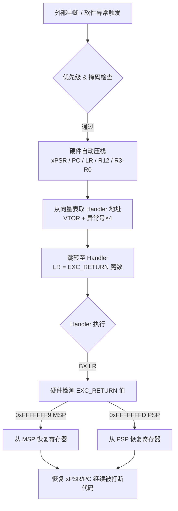
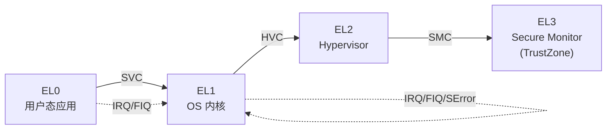

# ARM Cortex-M 与 A 架构速查

> **本篇定位**：固件逆向人员的 ARM 架构工具书，覆盖 Cortex-M（MCU，无 MMU）与 Cortex-A（应用处理器，有 MMU）两条线，重点在于"逆向时需要判断什么、在哪里看"。汇编指令层面的完整参考见 [[21.Asm/11 ARM.md]]，本篇不重复，只选取逆向视角最高频的部分。

---

## 概述与定位（TL;DR）

> [!abstract] TL;DR
> ARM Cortex-M（无 MMU MCU）只用 Thumb-2，向量表起始地址 `0x00000000`；Cortex-A（有 MMU）支持 AArch32/AArch64；AAPCS 参数寄存器 R0-R3，callee-saved R4-R11；AAPCS64 参数 X0-X7，callee-saved X19-X28。

ARM 是 IoT/嵌入式设备最主流的指令集架构，横跨两大阵营：

| 阵营 | 典型核心 | 有无 MMU | 操作系统 | 逆向场景 |
|------|----------|----------|----------|----------|
| **Cortex-M** | M0 / M3 / M4 / M7 / M33 | 无（可选 MPU） | RTOS 或裸机 | 固件 .bin/.hex，向量表定位，外设 MMIO |
| **Cortex-A（AArch32）** | A7 / A9 / A15 | 有 | Linux / Android | ELF，共享库，系统调用 |
| **Cortex-A（AArch64）** | A53 / A72 / A78 | 有 | Linux 64位 / Android 64位 | ELF64，PAC/BTI 安全扩展 |

> [!tip] 核心判断
> 拿到一块固件，首先确认：**有没有 MMU？用的是 Thumb 还是 ARM 模式？** 这两个问题决定了向量表解析策略和反汇编设置。

---

## 原理与机制

### 1 Cortex-M 异常处理流程



> [!note] EXC_RETURN 魔数一览
> - `0xFFFFFFF1`：返回 Handler 模式，使用 MSP
> - `0xFFFFFFF9`：返回 Thread 模式，使用 MSP
> - `0xFFFFFFFD`：返回 Thread 模式，使用 PSP
> - `0xFFFFFFE9`（带 FPU）：返回 Handler 模式，MSP，浮点上下文
> - `0xFFFFFFED`（带 FPU）：返回 Thread 模式，PSP，浮点上下文

### 2 Cortex-A 异常层级（AArch64）



---

## Cortex-M 详解

### 1 寄存器集

| 寄存器 | 别名 | 用途 | 逆向关注点 |
|--------|------|------|-----------|
| R0–R3 | — | 参数寄存器 / 通用 | 函数调用参数、返回值在 R0 |
| R4–R11 | — | 通用（Callee-saved） | 函数序言 PUSH，尾声 POP |
| R12 | IP | 内部过程调用临时寄存器 | 跨模块调用时 trampoline |
| R13 | SP | 栈指针（MSP / PSP 切换） | 异常中的 MSP vs PSP 判断 |
| R14 | LR | 链接寄存器 / EXC_RETURN | 值为 0xFFFFFFF? 时表示异常返回 |
| R15 | PC | 程序计数器 | 读出的值是当前指令地址 +4 |
| xPSR | — | 执行/程序/中断 PSR 复合 | T 位（bit 24）= Thumb 模式标志 |

> [!warning] 只有 Thumb/Thumb-2
> Cortex-M 完全不支持 ARM 32位指令模式（CPSR T 位永远为 1）。所有固件代码均为 Thumb 或 Thumb-2（16/32位混合）。IDA 加载时应选 **ARM Thumb** 而非 ARM。

### 2 向量表结构

向量表默认位于 `0x00000000`（Flash 映射），可由 `VTOR`（SCB 基址 `0xE000ED08`）重定向，常见于从 RAM 启动或 Bootloader 场景。

```
偏移   内容
+0x00  初始 MSP 值（栈顶地址，指向 RAM 末尾）
+0x04  Reset_Handler 地址（LSB=1 表示 Thumb）
+0x08  NMI_Handler
+0x0C  HardFault_Handler
+0x10  MemManage_Handler
+0x14  BusFault_Handler
+0x18  UsageFault_Handler
+0x1C–+0x28  保留（M3/M4 Security/Reserved）
+0x2C  SVC_Handler
+0x30  DebugMon_Handler
+0x34  保留
+0x38  PendSV_Handler
+0x3C  SysTick_Handler
+0x40–  IRQ0_Handler … IRQn_Handler（芯片厂商定义）
```

> [!tip] 逆向入口点
> 在 IDA / Ghidra 中，`0x00000004` 处的 DWORD（低位清零后）就是 `Reset_Handler`，这是逆向的第一个入口。`0x00000000` 的 MSP 初始值可推断栈空间范围。

### 3 AAPCS 调用规约（32位 ARM/Thumb）

```
参数传递：R0–R3（前4个参数）；第5个及以上参数压栈（调用者负责）
返回值：  R0（32位），R0:R1（64位）
Callee-saved（被调用者必须保存还原）：R4–R11, LR（作为返回地址）
Caller-saved（调用者不应依赖）：R0–R3, R12, xPSR
SP 对齐：公共接口处必须 8 字节对齐（AAPCS 强制要求）
```

函数序言典型样式：

```arm
; Thumb-2 典型序言（Cortex-M）
PUSH    {R4-R7, LR}      ; 保存 callee-saved 寄存器 + LR
SUB     SP, SP, #8       ; 为局部变量分配栈空间
```

函数尾声：

```arm
ADD     SP, SP, #8       ; 释放局部变量
POP     {R4-R7, PC}      ; 恢复寄存器，PC = 原 LR（返回）
```

---

## Cortex-A（AArch32 与 AArch64）详解

### 1 AArch32 寄存器集与处理器模式

AArch32（32位 ARM 模式）支持多个处理器模式，每个模式有独立的影子寄存器：

| 模式 | CPSR[4:0] | 描述 | 独立寄存器 |
|------|-----------|------|-----------|
| User | 10000 | 用户态 | — |
| FIQ | 10001 | 快速中断 | R8–R12, SP, LR |
| IRQ | 10010 | 普通中断 | SP, LR |
| Supervisor (SVC) | 10011 | 内核 / 系统调用 | SP, LR |
| Abort (ABT) | 10111 | 数据/预取中止 | SP, LR |
| Undefined (UND) | 11011 | 未定义指令 | SP, LR |
| System (SYS) | 11111 | 特权，共用 User 寄存器 | — |

### 2 寄存器对照表：M vs A（AArch32）vs A（AArch64）

| 用途 | Cortex-M | AArch32 | AArch64 |
|------|----------|---------|---------|
| 通用参数 1 | R0 | R0 | X0 |
| 通用参数 2 | R1 | R1 | X1 |
| 通用参数 3 | R2 | R2 | X2 |
| 通用参数 4 | R3 | R3 | X3 |
| 扩展参数 5–8 | 入栈 | 入栈 | X4–X7 |
| 栈指针 | R13（MSP/PSP） | R13（SP） | SP（独立） |
| 链接寄存器 | R14（LR） | R14（LR） | X30（LR） |
| 程序计数器 | R15（PC） | R15（PC） | PC（独立） |
| 帧指针 | 无约定 | R11（可选） | X29（FP） |
| 状态寄存器 | xPSR | CPSR/SPSR | PSTATE（隐式） |
| 内积调用寄存器 | R12（IP） | R12（IP） | X16/X17（IP0/IP1） |
| Callee-saved | R4–R11 | R4–R11 | X19–X28 |

> [!info] AArch64 的 W 寄存器
> `W0–W30` 是 `X0–X30` 的低 32 位别名；写 `W0` 会将 `X0` 的高 32 位清零。常见于 32 位整数运算。

### 3 AAPCS64 调用规约（AArch64）

```
参数传递：X0–X7（前8个整型/指针参数）；浮点/向量用 V0–V7
返回值：  X0（或 X0:X1 组合）；浮点返回 V0
Callee-saved：X19–X28，FP（X29），LR（X30），SP
Caller-saved：X0–X18（调用后不保证保留）
SP 对齐：每次 SP 修改必须 16 字节对齐（AArch64 硬件强制）
```

函数序言（AArch64 典型）：

```asm
; AArch64 标准序言
STP     X29, X30, [SP, #-16]!   ; 压帧指针和LR（SP -= 16 原子操作）
MOV     X29, SP                  ; 建立帧指针
STP     X19, X20, [SP, #-16]!   ; 保存 callee-saved（若用到）
```

函数尾声：

```asm
LDP     X19, X20, [SP], #16     ; 恢复 callee-saved
LDP     X29, X30, [SP], #16     ; 恢复帧指针和LR
RET                              ; = BR X30，返回
```

---

## Thumb 与 ARM 模式切换

### 1 LSB 约定

ARM 使用函数地址的最低位（LSB）标记目标指令集：

| 地址 LSB | 含义 |
|----------|------|
| `= 1` | 目标为 **Thumb** 模式（实际地址 = 值 & ~1） |
| `= 0` | 目标为 **ARM 32位** 模式 |

```arm
; 向量表中 Reset_Handler 示例
DCD     0x08000141   ; 实际地址 0x08000140，LSB=1 → Thumb
```

### 2 模式切换指令

```arm
BX      R0    ; 跳转到 R0 地址；LSB 决定切换到 ARM 还是 Thumb
BLX     R0    ; 同上 + 保存返回地址到 LR
BLX     #imm  ; 只有 Thumb→ARM 切换时用（汇编中少见）
```

> [!warning] Cortex-M 无 ARM 32位模式
> Cortex-M 上 `BX` / `BLX` 仍存在，但 LSB 必须为 1，否则触发 HardFault（INVSTATE）。

### 3 在 IDA Pro 中切换 Thumb/ARM 识别

1. 光标定位到被错误识别的地址
2. 菜单 **Edit → Segments → Change segment type** 或快捷键 **Alt+G**
3. 将 `T`（Thumb）位设为 `1`（Thumb）或 `0`（ARM）
4. 按 `C` 重新反汇编当前地址

在 Ghidra 中：右键地址 → **Disassemble (Thumb)** / **Disassemble (ARM)**

---

## 常用 ARM 指令速查（逆向高频）

### 1 数据处理

```arm
; 数据搬移
MOV     R0, #42        ; R0 = 42（立即数）
MOV     R0, R1         ; R0 = R1
MVN     R0, R1         ; R0 = ~R1（按位取反）
MOVW    R0, #0x1234    ; 32位立即数低16位（Thumb-2）
MOVT    R0, #0x5678    ; 32位立即数高16位（合成 0x56781234）

; 算术
ADD     R0, R1, R2     ; R0 = R1 + R2
SUB     R0, R1, #4     ; R0 = R1 - 4
MUL     R0, R1, R2     ; R0 = R1 * R2（低32位）
SDIV    R0, R1, R2     ; R0 = R1 / R2（有符号，需 Cortex-M3+）

; 位运算
AND     R0, R1, R2     ; 按位与
ORR     R0, R1, R2     ; 按位或
EOR     R0, R1, R2     ; 按位异或（XOR）
BIC     R0, R1, R2     ; R0 = R1 & ~R2（位清除）

; 移位
LSL     R0, R1, #2     ; 逻辑左移 2（× 4）
LSR     R0, R1, #1     ; 逻辑右移 1（÷ 2 无符号）
ASR     R0, R1, #1     ; 算术右移 1（÷ 2 有符号，保持符号位）
ROR     R0, R1, #8     ; 循环右移 8
```

### 2 内存访问

```arm
; 单字节/半字/字 加载
LDRB    R0, [R1]       ; R0 = *(uint8_t*)R1（零扩展）
LDRSB   R0, [R1]       ; R0 = *(int8_t*)R1（符号扩展）
LDRH    R0, [R1, #2]   ; R0 = *(uint16_t*)(R1+2)（零扩展）
LDR     R0, [R1, R2]   ; R0 = *(uint32_t*)(R1+R2)

; 存储
STRB    R0, [R1]       ; *(uint8_t*)R1 = R0（低8位）
STR     R0, [R1, #-4]  ; *(uint32_t*)(R1-4) = R0

; 前变址 / 后变址（常见于遍历数组）
LDR     R0, [R1, #4]!  ; R1 += 4；R0 = *R1（前变址，R1 更新）
LDR     R0, [R1], #4   ; R0 = *R1；R1 += 4（后变址，先读再更新）

; 双字
LDRD    R0, R1, [R2]   ; R0=*(R2+0), R1=*(R2+4)（AArch32/Thumb-2）

; 多寄存器（块传输）
LDM     R0, {R1-R4}    ; 从 R0 地址连续加载 4 个字到 R1-R4
STM     R0!, {R1-R4}   ; 连续存储并更新 R0（! = 写回基址）
PUSH    {R4-R7, LR}    ; = STMDB SP!, {R4-R7, LR}
POP     {R4-R7, PC}    ; = LDMIA SP!, {R4-R7, PC}
```

### 3 跳转与分支

```arm
B       label           ; 无条件跳转（PC 相对，不保存返回地址）
BL      func            ; 跳转并保存 PC+4 到 LR（函数调用）
BX      LR              ; 跳转到 LR 地址并可切换模式（函数返回）
BLX     R0              ; 跳转到 R0 并切换 Thumb/ARM + 保存 LR

; 条件分支
BEQ     label           ; Z=1 时跳转
BNE     label           ; Z=0 时跳转
BGT     label           ; 有符号 >
BLT     label           ; 有符号 <
BGE     label           ; 有符号 ≥
BLE     label           ; 有符号 ≤
BHI     label           ; 无符号 >（Higher）
BLS     label           ; 无符号 ≤（Lower or Same）
BCS/BHS label           ; C=1（无符号 ≥）
BCC/BLO label           ; C=0（无符号 <）
```

### 4 AArch64 特有指令

```asm
; 加载大立即数
ADRP    X0, page        ; X0 = 页对齐的 PC 相对地址（高21位）
ADD     X0, X0, :lo12:sym  ; X0 += 符号的页内偏移（低12位）
; 合用 = 加载任意 64 位地址（GOT/PLT 常见模式）

; 原子操作（多核 IoT 设备同步）
LDXR    W0, [X1]        ; 加载独占（exclusive load）
STXR    W2, W0, [X1]    ; 存储独占，W2=0 成功/1 失败

; 系统调用
SVC     #0              ; 切换到 EL1 内核（Linux syscall）
HVC     #0              ; 切换到 EL2 Hypervisor
SMC     #0              ; 切换到 EL3 Secure Monitor
```

---

## 逆向视角 / 实战

### 1 在 IDA Pro 中逆向 Cortex-M 固件

**步骤一：加载设置**

1. File → New → 选择 raw binary（`.bin` 文件）
2. Processor type：**ARM Little-endian**；勾选 **Thumb mode**
3. Loading address：通常 `0x08000000`（STM32 Flash 起点）或 `0x00000000`（某些 MCU）
4. 分析完成后，确认字节序（通常小端 LE）

**步骤二：解析向量表**

```python
# IDA Python：批量定义向量表函数
import idc, idaapi

vtor = 0x08000000   # Flash 基址
msp  = idc.get_wide_dword(vtor + 0)
rst  = idc.get_wide_dword(vtor + 4) & ~1   # 清 LSB
print(f"Initial MSP: {msp:#010x}, Reset_Handler: {rst:#010x}")
idc.create_insn(rst)
idc.add_func(rst)
```

**步骤三：识别外设寄存器（MMIO）**

Cortex-M 厂商（STM32、NXP、Nordic）提供 SVD 文件，可用 `SVD-Loader` 插件导入 IDA，自动命名 `GPIOA_ODR`、`UART1_DR` 等外设寄存器地址。

### 2 在 Ghidra 中逆向 ARM Linux ELF（AArch32/AArch64）

1. File → Import File → 选择 ELF 二进制
2. Language 选择：
   - AArch32：`ARM:LE:32:v8`
   - AArch64：`AARCH64:LE:64:v8A`
3. Analysis → Auto Analyze（默认全开即可）
4. 定位 `main`：通过 Symbol Table 或搜索 `__libc_start_main` 调用

**识别 AAPCS64 函数边界**：

```asm
; 典型序言特征（Ghidra 反汇编视图）
SUB     SP, SP, #0x30
STP     X29, X30, [SP, #0x20]   ← 必有，保存帧指针+LR
ADD     X29, SP, #0x20           ← X29 = 新帧指针

; 典型尾声
LDP     X29, X30, [SP, #0x20]   ← 恢复帧指针+LR
ADD     SP, SP, #0x30
RET                               ← = BR X30
```

### 3 常见逆向模式识别

**模式1：Cortex-M 硬件定时器回调**

```arm
; IRQ Handler 入口（IDA 识别为 ARM 函数但实为异常 Handler）
; LR = 0xFFFFFFFD → 返回 Thread 模式 PSP
PUSH    {R4, LR}
BL      TIM2_update_callback
POP     {R4, PC}    ; PC = 原 LR = EXC_RETURN → 触发硬件恢复上下文
```

**模式2：Cortex-A 内核模块中的 TLS 访问（AArch64）**

```asm
MRS     X0, TPIDR_EL0    ; 读取线程指针寄存器（TLS base）
LDR     X1, [X0, #0x10]  ; 访问 TLS 变量
```

**模式3：内联字符串解密（常见 IoT 恶意固件）**

```arm
; Thumb-2 XOR 解密循环
.loop:
LDRB    R3, [R1], #1    ; 逐字节读取加密数据（后变址 +1）
EOR     R3, R3, R2      ; XOR 解密键（R2 = 0xAB 等常量）
STRB    R3, [R0], #1    ; 写入目标缓冲区
SUBS    R4, R4, #1      ; 计数器--（SUBS = SUB + 更新标志）
BNE     .loop           ; Z=0 时继续
```

---

## 安全性与正确使用

### 1 Cortex-M 安全扩展（M33 / M55 / M85）

Cortex-M33 起引入 **TrustZone for Cortex-M**（ARMv8-M Mainline）：

| 特性 | 描述 | 逆向影响 |
|------|------|---------|
| **Secure / Non-Secure 世界** | 固件分为 S 和 NS 两部分 | IDA/Ghidra 需分别加载，向量表各一份 |
| **NSC（Non-Secure Callable）区** | NS 通过 `BXNS LR` 调用 S 函数的安全入口 | `SG` 指令（Secure Gateway）是 NS→S 的合法入口点 |
| **SAU（安全属性单元）** | 配置 S/NS 内存区域划分 | `SAU_RNR`/`SAU_RBAR`/`SAU_RLAR` 寄存器定义边界 |
| **MPU** | 内存保护单元（M/NS 各一个） | 固件若配置 MPU，栈溢出类漏洞受限 |

### 2 AArch64 Pointer Authentication（PAC）

ARMv8.3-A 引入 PAC，在指针高位嵌入认证码：

```asm
PACIASP                  ; 用 SP 对 LR 签名，存储到 LR 高位
; ... 函数体 ...
AUTIASP                  ; 验证并还原 LR；失败则 LR 高位置"毒药"导致 SIGILL
RET
```

> [!warning] 逆向 PAC 固件
> 逆向时 Ghidra/IDA 会将 `PACIASP`/`AUTIASP` 正确识别（需 ARMv8.3 支持）。若在旧版工具中显示为 `HINT #25`，需手动更新处理器模块。PAC 破解在非学术/授权场景下属非法行为。

### 3 BTI（Branch Target Identification）

ARMv8.5-A 引入：合法跳转目标必须以 `BTI` 指令开头，否则触发异常。逆向时：合法函数入口 = `BTI C`（callable）或 `BTI J`（jumpable）。

### 4 常见固件漏洞模式

```arm
; 危险：Cortex-M 中无边界检查的 memcpy 类操作
; 若 R2（长度）来自不可信外设/网络数据 → 栈溢出
PUSH    {LR}
BL      memcpy          ; R0=dst(栈), R1=src(外设), R2=len(不受信)
POP     {PC}            ; 若 R2 过大 → 覆盖 LR → 控制流劫持
```

---

## 小结

| 维度 | Cortex-M（Thumb/Thumb-2） | Cortex-A AArch32 | Cortex-A AArch64 |
|------|--------------------------|-----------------|-----------------|
| 指令集 | 仅 Thumb/Thumb-2 | ARM + Thumb + Thumb-2 | AArch64（A64） |
| 参数寄存器 | R0–R3 | R0–R3 | X0–X7 |
| 返回值 | R0（或 R0:R1） | R0（或 R0:R1） | X0（或 X0:X1） |
| Callee-saved | R4–R11 | R4–R11 | X19–X28 |
| 栈对齐 | 8 字节 | 8 字节 | **16 字节** |
| 帧指针 | 无强制约定 | R11（可选） | X29（AAPCS64 规定） |
| 链接寄存器 | R14 / EXC_RETURN | R14 | X30 |
| 异常机制 | 向量表 + 自动压栈 | 向量表 + 软件压栈 | 向量表（VBAR_EL1） |
| MMU | 无（可选 MPU） | 有 | 有 |
| 安全扩展 | TrustZone-M（M33+） | TrustZone（NS/S） | PAC / BTI / MTE |

> [!tip] 逆向工作流速记
> 1. 确认有无 MMU → 决定是 Cortex-M 还是 Cortex-A 分析路径
> 2. 定位向量表 / ELF 入口点
> 3. 对照 AAPCS / AAPCS64 识别调用边界
> 4. 识别 EXC_RETURN / PAC 等安全机制，避免误判
> 5. 善用 SVD 文件（M 系列）或 Linux 符号（A 系列）辅助命名

---

## 相关阅读

- [[21.Asm/11 ARM.md]] — ARM 汇编指令完整参考（本篇的指令层伴读）
- [[03.固件解包与文件系统]] — 固件提取后的文件系统分析
- [[05.MIPS与RISC-V嵌入式架构速查]] — 其他常见嵌入式架构

**延伸资料（离线）**：
- ARM Architecture Reference Manual ARMv8 for A-profile（ARM DDI 0487）
- ARM Cortex-M33 Technical Reference Manual（ARM DDI 0553）
- ARM Procedure Call Standard for the Arm Architecture（AAPCS）IHI0042J
- ARM Procedure Call Standard for the 64-bit Architecture（AAPCS64）IHI0055D

---

⬅️ 上一篇 [[03.固件解包与文件系统]] ｜ 🏠 [[00.固件与IoT嵌入式逆向总览]] ｜ 下一篇 [[05.MIPS与RISC-V嵌入式架构速查]] ➡️
