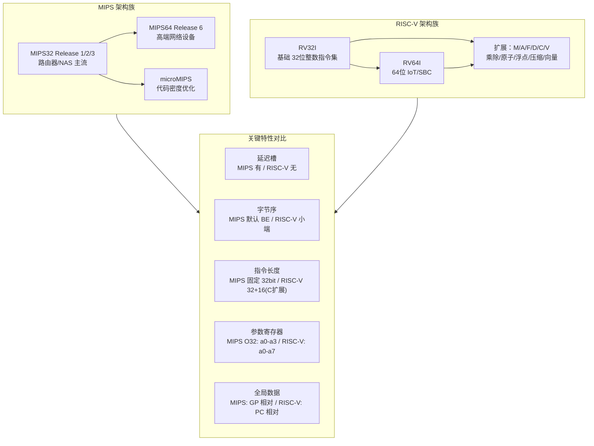
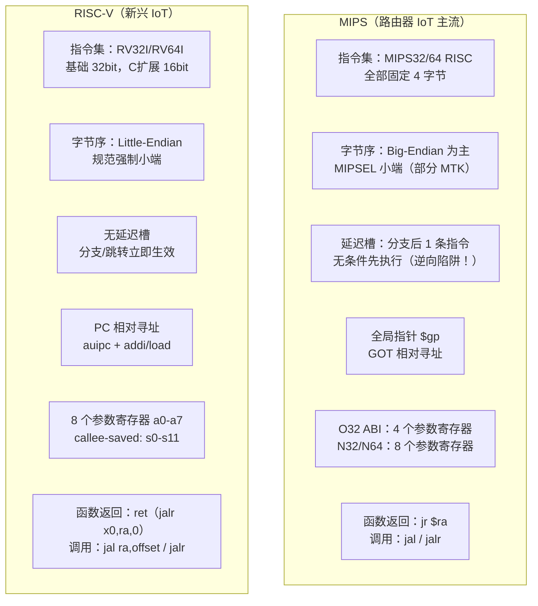

# 固件与IoT（05）· MIPS与RISC-V嵌入式架构速查

## 概述与定位

> [!abstract] TL;DR
> MIPS 是路由器、NAS、网络设备固件的主流架构（BCM、QCA、MTK 芯片组），RISC-V 是新兴 IoT 微控制器与 SoC 的后起之秀。两者均为 RISC 精简指令集，但在延迟槽、字节序、调用规约、指令编码上差异明显。逆向前必须确认：架构版本（MIPS32/64、RV32/64）、字节序（BE/LE）、ABI（O32/N32/N64、RV-LP64）、工具链（IDA、Ghidra），否则反汇编结果完全错误。

嵌入式设备固件逆向不能只懂 x86 和 ARM——大量路由器（TP-Link、Netgear、华硕、D-Link）、NAS（QNAP、Synology 早期款）、工业控制器运行 MIPS 内核；而 RISC-V 在近年 IoT MCU（GD32VF103、CH32V307）、RISC-V Linux SBC、开源安全芯片上迅速扩张。本章作为"架构速查"，目标是让逆向工程师在不熟悉目标架构的情况下，快速掌握足够识别函数边界、调用关系、全局数据访问和控制流的核心知识。

本章与前篇 [[04.ARM_Cortex-M与A架构速查]] 构成嵌入式三大架构的完整图谱，深度汇编知识请参阅 [[21.Asm/12 MIPS.md]] 和 [[21.Asm/14 RISC-V.md]]。

---

## 原理与机制

### 架构谱系与定位



### MIPS 与 RISC-V 关键特性横向对比



---

## MIPS 架构详解

### 寄存器（O32 ABI）完整速查表

O32 是 MIPS 32位固件最常见的 ABI，适用于绝大多数 Linux 路由器固件。

| 寄存器编号 | ABI 名称 | 用途说明 |
|:---:|:---:|:---|
| $0 | $zero | 硬连线为 0，写入无效；常用于 `move` 伪指令、清零操作 |
| $1 | $at | 汇编器临时寄存器（assembler temporary），不应在代码中直接使用 |
| $2 | $v0 | 函数返回值（低 32 位）；syscall 号（Linux MIPS）|
| $3 | $v1 | 函数返回值（高 32 位，64 位返回时使用）|
| $4 | $a0 | 函数第 1 个参数 |
| $5 | $a1 | 函数第 2 个参数 |
| $6 | $a2 | 函数第 3 个参数 |
| $7 | $a3 | 函数第 4 个参数 |
| $8 | $t0 | 临时寄存器（caller-saved，跨调用不保留）|
| $9 | $t1 | 临时寄存器（caller-saved）|
| $10 | $t2 | 临时寄存器（caller-saved）|
| $11 | $t3 | 临时寄存器（caller-saved）|
| $12 | $t4 | 临时寄存器（caller-saved）|
| $13 | $t5 | 临时寄存器（caller-saved）|
| $14 | $t6 | 临时寄存器（caller-saved）|
| $15 | $t7 | 临时寄存器（caller-saved）|
| $16 | $s0 | 保存寄存器（callee-saved，函数须保存/恢复）|
| $17 | $s1 | 保存寄存器（callee-saved）|
| $18 | $s2 | 保存寄存器（callee-saved）|
| $19 | $s3 | 保存寄存器（callee-saved）|
| $20 | $s4 | 保存寄存器（callee-saved）|
| $21 | $s5 | 保存寄存器（callee-saved）|
| $22 | $s6 | 保存寄存器（callee-saved）|
| $23 | $s7 | 保存寄存器（callee-saved）|
| $24 | $t8 | 临时寄存器（caller-saved）|
| $25 | $t9 | 临时寄存器（caller-saved）；PIC 代码中存放被调函数地址 |
| $26 | $k0 | OS 内核保留（中断/异常处理器使用，用户代码不可用）|
| $27 | $k1 | OS 内核保留（同 $k0）|
| $28 | $gp | 全局指针（Global Pointer）；指向 GOT 中段，GP 相对寻址 ±32KB |
| $29 | $sp | 栈指针（Stack Pointer）；向低地址增长 |
| $30 | $s8 / $fp | 帧指针（Frame Pointer）；O32 可选，优化代码常省略 |
| $31 | $ra | 返回地址（Return Address）；`jal` 自动写入 |

> [!tip] 逆向速记
> - **$a0-$a3**：看到这 4 个寄存器被赋值后紧跟 `jal`，就是在传函数参数
> - **$v0**：函数调用返回后，返回值在 $v0；syscall 号也用 $v0
> - **$t9**：PIC（位置无关代码）调用中，间接调用前先 `lw $t9, offset($gp)` 再 `jalr $t9`
> - **$gp**：每个函数开始时通常先重建 $gp（`lui $gp, %hi` + `addiu $gp, %lo`）

### 延迟槽（Branch Delay Slot）—— 逆向重要陷阱

MIPS 的流水线设计导致分支/跳转指令在发出后，流水线已经 fetch 了下一条指令——MIPS 规范决定**直接执行它**，而不是丢弃。这就是"延迟槽"。

**规则**：任何分支（`beq`/`bne`/`bgtz` 等）和跳转（`j`/`jal`/`jr`/`jalr`）后面紧跟的那条指令，**无条件先于跳转目标执行**，即使分支成立、跳转发生。

```asm
# MIPS 延迟槽示例：函数调用
jal    strcpy          # 跳转到 strcpy
addiu  $a1, $a0, 4    # 延迟槽：这条先执行（设置第 2 个参数）

# MIPS 延迟槽示例：条件分支
beq    $t0, $zero, label_true   # 若 $t0==0 则跳转
nop                              # 延迟槽，通常填 nop（无操作）
# 这里是 beq 不成立时继续执行的代码
label_true:
# ...
```

> [!warning] 逆向陷阱
> - 不要把延迟槽指令当作"分支后面的代码"，它**在跳转之前**执行
> - IDA Pro 在 MIPS 反汇编视图中**自动标注**延迟槽（显示为缩进或特殊注释）
> - Ghidra 同样自动处理延迟槽，伪代码视图会将延迟槽效果合并
> - 手动分析时：跳转指令 + 延迟槽 = 一个语义单元

### 常用 MIPS 指令速查

| 指令 | 功能 | 示例 |
|:---:|:---|:---|
| `lw rd, offset(rs)` | 从内存加载 32 位字 | `lw $a0, 0($sp)` |
| `sw rs, offset(rd)` | 存储 32 位字到内存 | `sw $ra, 28($sp)` |
| `lb`/`lbu`/`lh`/`lhu` | 加载字节/半字（有/无符号扩展）| `lbu $t0, 0($a0)` |
| `lui rd, imm16` | 将 16 位立即数加载到高 16 位 | `lui $v0, 0x4001` |
| `addiu rd, rs, imm16` | 无溢出检查加立即数 | `addiu $sp, $sp, -32` |
| `addu rd, rs, rt` | 无符号加法 | `addu $a0, $a0, $t0` |
| `move rd, rs` | 寄存器复制（伪指令：`addu rd,rs,$zero`）| `move $a0, $s0` |
| `beq rs, rt, offset` | 相等则跳转 | `beq $t0, $zero, done` |
| `bne rs, rt, offset` | 不等则跳转 | `bne $a0, $zero, loop` |
| `bgtz rs, offset` | 大于零则跳转 | `bgtz $t1, positive` |
| `j target` | 无条件跳转（26位绝对目标）| `j 0x8000100` |
| `jal target` | 跳转并链接（调用函数，`$ra=PC+8`）| `jal printf` |
| `jalr rd, rs` | 寄存器间接跳转并链接 | `jalr $ra, $t9` |
| `jr rs` | 寄存器跳转（函数返回：`jr $ra`）| `jr $ra` |
| `slt rd, rs, rt` | 有符号小于则置 1 | `slt $t0, $a0, $a1` |
| `and`/`or`/`xor`/`nor` | 位运算 | `and $t0, $t0, $t1` |
| `sll`/`srl`/`sra` | 逻辑/算术移位 | `sll $t0, $t0, 2` |

**32 位立即数加载**（MIPS 没有 32 位 MOV 指令，必须两步）：

```asm
lui   $v0, 0x8050      # $v0 = 0x80500000
addiu $v0, $v0, 0x1234 # $v0 = 0x80501234
# 等价于 C: void* ptr = (void*)0x80501234;
```

### MIPS 函数序言与尾声模式

逆向时识别函数边界的核心模式：

```asm
# ===== 函数序言（Prologue）=====
# 方式1：非叶函数（调用其他函数，需保存 $ra）
func_start:
    addiu  $sp, $sp, -32     # 开辟 32 字节栈帧（N 必须 8 字节对齐）
    sw     $ra, 28($sp)       # 保存返回地址
    sw     $s0, 24($sp)       # 保存 callee-saved 寄存器 $s0
    sw     $s1, 20($sp)       # 保存 $s1

    # ... 函数体 ...

# ===== 函数尾声（Epilogue）=====
    lw     $ra, 28($sp)       # 恢复返回地址
    lw     $s0, 24($sp)       # 恢复 $s0
    lw     $s1, 20($sp)       # 恢复 $s1
    jr     $ra                # 跳转返回（延迟槽：下一条先执行）
    addiu  $sp, $sp, 32       # 延迟槽：恢复栈指针

# 方式2：叶函数（不调用其他函数，无需保存 $ra）
leaf_func:
    addiu  $sp, $sp, -8
    sw     $s0, 4($sp)
    # ... 函数体 ...
    lw     $s0, 4($sp)
    jr     $ra
    addiu  $sp, $sp, 8        # 延迟槽
```

### N32 / N64 ABI（64 位 MIPS）

高端路由器或 MIPS64 设备有时使用 N32/N64 ABI：

- **参数寄存器扩展**：`$a0-$a7`（8 个参数寄存器，直接传递更多参数无需压栈）
- **返回值**：仍为 `$v0`（64 位值可放入 64 位 `$v0`）
- **临时寄存器**：`$t0-$t3`（N64 的 `$t4-$t7` 是 O32 的 `$a4-$a7`，命名不同）
- **指针大小**：N64 指针 64 位；N32 使用 64 位寄存器但指针 32 位（节省内存的折中方案）

### MIPS 字节序识别

> [!important] 字节序是 MIPS 逆向第一步
> IDA/Ghidra 加载 MIPS 固件前**必须**确认字节序，否则所有多字节数据解析全部错误。

- **MIPSBE（大端）**：Broadcom、Qualcomm Atheros（QCA）芯片组；TP-Link WR841N、Netgear R7000 等主流家用路由器
- **MIPSEL（小端）**：联发科（MTK）部分芯片；PlayStation Portable（PSP）；部分 D-Link 型号
- 识别方法：
  - `binwalk -A` 扫描指令序列，大端 MIPS 开头常见 `27bd ffXX`（`addiu $sp,-N`）
  - `file firmware.bin`（有时能识别）
  - 看 ELF header `e_ident[EI_DATA]`：`01` = 小端，`02` = 大端

---

## RISC-V 架构详解

### 寄存器（RV32I / RV64I）完整速查表

| 寄存器编号 | ABI 名称 | 调用规约属性 | 用途说明 |
|:---:|:---:|:---:|:---|
| x0 | zero | — | 硬连线 0，写入忽略；`mv rd, zero` 清零 |
| x1 | ra | caller-saved | 返回地址（Return Address）；`jal ra, offset` 自动写入 |
| x2 | sp | callee-saved | 栈指针（Stack Pointer）；向低地址增长，16 字节对齐 |
| x3 | gp | — | 全局指针（Global Pointer）；运行时不变 |
| x4 | tp | — | 线程指针（Thread Pointer）；TLS 基址 |
| x5 | t0 | caller-saved | 临时寄存器；也用于备用链接寄存器 |
| x6 | t1 | caller-saved | 临时寄存器 |
| x7 | t2 | caller-saved | 临时寄存器 |
| x8 | s0 / fp | callee-saved | 保存寄存器 0 / 帧指针（Frame Pointer）|
| x9 | s1 | callee-saved | 保存寄存器 1 |
| x10 | a0 | caller-saved | 第 1 个参数 / 返回值（低字）|
| x11 | a1 | caller-saved | 第 2 个参数 / 返回值（高字，128位时）|
| x12 | a2 | caller-saved | 第 3 个参数 |
| x13 | a3 | caller-saved | 第 4 个参数 |
| x14 | a4 | caller-saved | 第 5 个参数 |
| x15 | a5 | caller-saved | 第 6 个参数 |
| x16 | a6 | caller-saved | 第 7 个参数 |
| x17 | a7 | caller-saved | 第 8 个参数；也用于 Linux syscall 号 |
| x18 | s2 | callee-saved | 保存寄存器 2 |
| x19 | s3 | callee-saved | 保存寄存器 3 |
| x20 | s4 | callee-saved | 保存寄存器 4 |
| x21 | s5 | callee-saved | 保存寄存器 5 |
| x22 | s6 | callee-saved | 保存寄存器 6 |
| x23 | s7 | callee-saved | 保存寄存器 7 |
| x24 | s8 | callee-saved | 保存寄存器 8 |
| x25 | s9 | callee-saved | 保存寄存器 9 |
| x26 | s10 | callee-saved | 保存寄存器 10 |
| x27 | s11 | callee-saved | 保存寄存器 11 |
| x28 | t3 | caller-saved | 临时寄存器 |
| x29 | t4 | caller-saved | 临时寄存器 |
| x30 | t5 | caller-saved | 临时寄存器 |
| x31 | t6 | caller-saved | 临时寄存器 |

> [!tip] RISC-V 逆向速记
> - **a0-a7**（x10-x17）：8 个参数寄存器，比 MIPS O32 多 4 个；函数调用前这 8 个全部是参数候选
> - **s0-s11**（x8-x9, x18-x27）：callee-saved；看到函数开头存这些寄存器就是非叶函数
> - **ra**（x1）：返回地址；`ret` = `jalr x0, ra, 0`（跳到 ra，返回值丢弃）
> - **a7**（x17）：Linux RISC-V syscall 的系统调用号

### RISC-V 指令集扩展

| 扩展字母 | 全称 | 说明 |
|:---:|:---|:---|
| I | Integer | 基础整数指令集（必选）|
| M | Multiply | 乘除法（`mul`/`div`/`rem`）|
| A | Atomic | 原子操作（`lr.w`/`sc.w`/`amoadd`）|
| F | Float（32） | 单精度浮点（f0-f31）|
| D | Double（64）| 双精度浮点 |
| C | Compressed | 16 位压缩指令（提高代码密度）|
| V | Vector | SIMD 向量扩展 |
| G | = IMAFD | 通用组合（Linux 常见 `RV64GC`）|

嵌入式 IoT 常见组合：
- 微控制器（无 OS）：`RV32IMAC`（基础 + 乘除 + 原子 + 压缩）
- 嵌入式 Linux：`RV64GC`（通用 + 压缩）

### 常用 RISC-V 指令速查

| 指令 | 功能 | 示例 |
|:---:|:---|:---|
| `lw rd, offset(rs1)` | 加载 32 位字（符号扩展到 64 位）| `lw a0, 0(sp)` |
| `ld rd, offset(rs1)` | 加载 64 位双字（RV64）| `ld ra, 8(sp)` |
| `sw rs2, offset(rs1)` | 存储 32 位字 | `sw ra, 0(sp)` |
| `sd rs2, offset(rs1)` | 存储 64 位双字 | `sd s0, 8(sp)` |
| `lb`/`lbu`/`lh`/`lhu` | 加载字节/半字 | `lbu a1, 0(a0)` |
| `add rd, rs1, rs2` | 加法 | `add a0, a0, a1` |
| `addi rd, rs1, imm12` | 加立即数（12 位有符号）| `addi sp, sp, -16` |
| `sub rd, rs1, rs2` | 减法 | `sub a0, a0, a1` |
| `mv rd, rs1` | 寄存器复制（伪：`addi rd,rs1,0`）| `mv a0, s0` |
| `li rd, imm` | 加载立即数（伪，编译器展开）| `li a7, 64` |
| `beq rs1, rs2, offset` | 相等则跳转 | `beq a0, zero, done` |
| `bne rs1, rs2, offset` | 不等则跳转 | `bne a0, zero, loop` |
| `blt rs1, rs2, offset` | 有符号小于则跳转 | `blt t0, t1, smaller` |
| `bge rs1, rs2, offset` | 有符号大于等于则跳转 | `bge a0, zero, pos` |
| `bltu`/`bgeu` | 无符号比较跳转 | `bltu a0, a1, below` |
| `jal rd, offset` | 跳转并链接（`rd=PC+4`，相对偏移）| `jal ra, printf` |
| `jalr rd, rs1, imm12` | 寄存器间接跳转并链接 | `jalr zero, ra, 0` |
| `ret` | 函数返回（伪：`jalr x0, ra, 0`）| `ret` |
| `auipc rd, imm20` | PC + (imm20 << 12) → rd | `auipc a0, %pcrel_hi(data)` |
| `lui rd, imm20` | 加载高 20 位立即数 | `lui a0, 0x10000` |
| `ecall` | 系统调用 / 环境调用 | `ecall` |

### RISC-V 调用规约详解

```
参数传递：
  前 8 个整数/指针参数 → a0(x10) ~ a7(x17)
  超出 8 个 → 压栈（从右到左）
  浮点参数（有 F/D 扩展）→ fa0 ~ fa7

返回值：
  整数/指针 → a0（64位以内）
  128位 → a0:a1

寄存器保存责任：
  caller-saved（调用者负责保存）: ra, t0-t6, a0-a7
  callee-saved（被调用者负责保存）: sp, s0-s11, gp, tp

栈对齐：
  调用前 SP 必须 16 字节对齐
```

### RISC-V 函数序言与尾声模式

```asm
# ===== RV64 非叶函数序言 =====
func:
    addi   sp, sp, -32      # 开辟 32 字节栈帧（16 字节对齐）
    sd     ra, 24(sp)        # 保存返回地址（8 字节）
    sd     s0, 16(sp)        # 保存帧指针 s0
    addi   s0, sp, 32        # 建立帧指针（可选）

    # ... 函数体 ...
    # 参数在 a0-a7，本地变量在栈上

# ===== RV64 函数尾声 =====
    ld     ra, 24(sp)        # 恢复返回地址
    ld     s0, 16(sp)        # 恢复帧指针
    addi   sp, sp, 32        # 恢复栈指针
    ret                      # 返回（= jalr x0, ra, 0）

# ===== RV32 叶函数（不调用其他函数）=====
add_one:
    addi   a0, a0, 1         # a0 += 1（参数也是返回值）
    ret                      # 直接返回，无需保存 ra
```

### PC 相对寻址（RISC-V 全局数据访问）

RISC-V 没有绝对地址加载指令，全局变量访问通过 `auipc` + 偏移完成：

```asm
# 访问全局变量 global_buf（编译器生成 PC 相对代码）
auipc  a0, %pcrel_hi(global_buf)   # a0 = PC + (global_buf高20位)
addi   a0, a0, %pcrel_lo(global_buf) # a0 += 低12位偏移
lw     t0, 0(a0)                     # 读取全局变量值

# 函数指针调用（PIC）
auipc  t1, %pcrel_hi(func_ptr)
ld     t1, %pcrel_lo(func_ptr)(t1)   # 从 GOT 加载函数指针
jalr   ra, t1, 0                      # 间接调用
```

### RISC-V 特权 ISA

RISC-V 的用户态 ISA（RV32I/RV64I）只是冰山一角；在嵌入式 Linux 内核、RTOS 及固件逆向中更常遇到的是**特权 ISA（Privileged Architecture）**——它定义了特权级切换、CSR（Control and Status Register）、trap 处理、内存保护等机制。

#### 三特权级（M/S/U）

RISC-V 规范定义三个特权级（Privilege Level），以 `mstatus.MPP`/`mstatus.SPP` 字段区分：

| 特权级 | 编码 | 名称 | 典型运行软件 | 类比（ARM EL） |
|---|---|---|---|---|
| M（Machine） | 11 | 机器模式 | SBI 固件（OpenSBI）、裸机程序 | EL3 / M-mode |
| S（Supervisor） | 01 | 监督模式 | OS 内核（Linux）、Hypervisor | EL1 / S-EL1 |
| U（User） | 00 | 用户模式 | 用户应用程序 | EL0 |

> [!note] H 扩展（Hypervisor）
> RISC-V 还有可选的 H 扩展，在 S 模式上再加一层 HS/VS/VU 分级，用于实现类型 1 虚拟化。在嵌入式场景（无虚拟化）通常只有 M + S + U 三级。

**权限规则**：M 模式权限最高，可访问所有 CSR 和物理地址；S 模式次之，通过 `satp` 操控页表，但不可访问 M 专属 CSR；U 模式只能通过 `ecall` 陷入 S/M 模式请求服务。

#### 核心 CSR 速查

CSR 通过专用 `csrr`/`csrw`/`csrrw` 指令访问（不能用普通 `lw`/`sw`）：

```asm
csrr  t0, mstatus      # 读 CSR mstatus → t0
csrw  mtvec,  t0       # 写 t0 → CSR mtvec
csrrw t0, mscratch, t1 # 原子交换：t0=旧值，mscratch=t1
```

**M 模式核心 CSR：**

| CSR 名 | 地址 | 说明 |
|---|---|---|
| `mstatus` | 0x300 | 全局状态：MIE（M 中断使能）、MPP（陷入前特权级）、MPRV、MXR 等 |
| `misa` | 0x301 | ISA 扩展位图，可查询芯片支持的扩展（M/A/F/D/C 等）|
| `mtvec` | 0x305 | M 模式 trap 向量基址；低 2 位为模式（00=直接，01=向量）|
| `mscratch` | 0x340 | M 模式临时寄存器（通常存 M-mode 栈指针）|
| `mepc` | 0x341 | Machine Exception PC：trap 发生时的 PC（`mret` 返回到此）|
| `mcause` | 0x342 | trap 原因：最高位 1 = 中断，0 = 异常；低位为 cause 码 |
| `mtval` | 0x343 | trap 附加值：地址错误时含出错地址，非法指令时含指令编码 |
| `mip` / `mie` | 0x344 / 0x304 | 中断 pending / enable 位图（MSIP/MTIP/MEIP 分别对应软件/定时器/外部中断）|
| `medeleg` / `mideleg` | 0x302 / 0x303 | 将指定异常/中断委托给 S 模式处理（Linux 常见）|
| `mcounteren` | 0x306 | 允许 S/U 模式访问 `cycle`/`time`/`instret` 计数器 |

**S 模式核心 CSR：**

| CSR 名 | 地址 | 说明 |
|---|---|---|
| `sstatus` | 0x100 | `mstatus` 的 S 可见视图（MIE→SIE、MPP→SPP 等字段）|
| `stvec` | 0x105 | S 模式 trap 向量基址 |
| `sscratch` | 0x140 | S 模式临时寄存器（通常指向 per-CPU 数据）|
| `sepc` | 0x141 | Supervisor Exception PC |
| `scause` | 0x142 | S 模式 trap 原因（格式同 `mcause`）|
| `stval` | 0x143 | S 模式 trap 附加值 |
| `satp` | 0x180 | **页表基址寄存器**：MODE（分页模式）+ ASID + PPN（根页表物理页号）|

**`satp` 详解（RV64 最常见格式 Sv39/Sv48）：**

```
RV64 satp 布局（64位）：
┌────────┬──────────┬────────────────────────────────┐
│ MODE   │ ASID     │ PPN（物理页号）                 │
│ [63:60]│ [59:44]  │ [43:0]                          │
└────────┴──────────┴────────────────────────────────┘

MODE 值：
  0000 = Bare（无分页，M 模式）
  1000 = Sv39（3级页表，39位虚拟地址，Linux 常用）
  1001 = Sv48（4级页表，48位虚拟地址）
  1010 = Sv57（5级页表）
```

逆向时，读取 `satp` 可立即获得当前进程页表根物理地址，是内核内存取证的关键入口。

#### Trap 处理流程

RISC-V 的 trap 包含**同步异常**（ecall、非法指令、页错误）和**异步中断**（定时器、外部中断）两类，统一通过 `mtvec`（M 模式）或 `stvec`（S 模式）分发：

```
U 模式执行 ecall（系统调用）：
  1. 硬件原子操作：
     ├── mepc（或 sepc）← 当前 PC（ecall 指令地址）
     ├── mcause（或 scause）← 8（U模式 ecall 原因码）
     ├── mstatus.MPP（或 SPP）← 当前特权级（U=00）
     └── MIE←0（禁用中断）
  2. PC ← mtvec（或 stvec）的基址（直接模式）
     或 PC ← mtvec.BASE + 4 × cause（向量模式，仅中断）
  3. 陷入处理函数（M 模式 SBI 固件或 S 模式 Linux syscall 入口）
  4. 处理完成，执行 mret（或 sret）：
     ├── PC ← mepc（或 sepc），即 ecall 指令地址 + 4（处理函数预先 +4）
     ├── 特权级 ← mstatus.MPP（或 SPP）
     └── MIE ← MPIE（恢复中断）
```

**Linux RISC-V 系统调用入口（逆向关键路径）：**

```asm
# arch/riscv/kernel/entry.S（简化）
handle_exception:
    csrrw  a0, sscratch, a0      # 交换 a0 与 sscratch（sscratch 指向 per-cpu task_struct）
    # 保存所有寄存器到 pt_regs 结构
    ...
    csrr   s0, scause
    bge    s0, zero, 1f          # scause < 0：中断（最高位=1）
    # 处理异常
1:  # 处理中断
    ...
    # ecall（scause=8）→ do_syscall
    la     ra, ret_from_exception
    tail   do_syscall
```

逆向 RISC-V Linux 内核时，`stvec` 所指函数是全部 trap 的统一入口，从此处追踪 `scause` 分支即可定位各类 syscall/异常处理函数。

#### SBI（Supervisor Binary Interface）

SBI 是 S 模式（OS 内核）与 M 模式固件（OpenSBI）之间的标准接口，类比 x86 BIOS INT 调用或 ARM PSCI：

```asm
# 调用 SBI 的通用方式（RISC-V Linux 内）：
#   a7 = Extension ID（EID）
#   a6 = Function ID（FID）
#   a0-a5 = 参数
#   返回：a0 = error code，a1 = value
li   a7, 0x10      # SBI_EXT_BASE
li   a6, 0x0       # SBI_EXT_BASE_GET_SPEC_VERSION
ecall              # 陷入 M 模式 SBI 固件
# a0 = 0（成功），a1 = 版本号
```

**常用 SBI 扩展（EID）：**

| EID | 名称 | 说明 |
|---|---|---|
| 0x00 | SBI_EXT_0_1_SET_TIMER | 设置定时器（旧版 SBI v0.1）|
| 0x01 | SBI_EXT_0_1_CONSOLE_PUTCHAR | 串口输出字符（旧版）|
| 0x10 | SBI_EXT_BASE | 查询 SBI 实现版本、可用扩展 |
| 0x54494D45 | SBI_EXT_TIME | 设置定时器（新版）|
| 0x48534D | SBI_EXT_HSM | Hart State Management（CPU 热插拔，类比 PSCI CPU_ON/OFF）|
| 0x53525354 | SBI_EXT_SRST | 系统复位（System Reset，类比 PSCI SYSTEM_RESET）|
| 0x504D55 | SBI_EXT_PMU | 性能监控单元 |

逆向 RISC-V 固件时，`ecall` 指令若出现在 S 模式代码中，通常是对 SBI 的调用；观察 `a7` 即可判断调用的 SBI 功能。

#### PMP（Physical Memory Protection）

PMP 是 RISC-V 在 **M 模式**提供的硬件内存保护，类比 ARM 的 MPU（但 RISC-V 在没有 MMU 的 M-only 系统上也能用）：

```
PMP 配置寄存器对：
  pmpaddr0 - pmpaddr15  （最多 16 个 PMP 条目，地址寄存器）
  pmpcfg0  - pmpcfg3    （配置字节，每个 pmpaddr 对应 1 字节）

pmpcfg 字节格式：
  ┌──────┬──────────┬─────┬───┬───┬───┐
  │  L   │  保留    │ A   │ X │ W │ R │
  │ [7]  │ [6:5]   │[4:3]│[2]│[1]│[0]│
  └──────┴──────────┴─────┴───┴───┴───┘
  L（Lock）：锁定此条目，直到复位才可修改（即使 M 模式也不能改）
  A（Address Matching Mode）：
    00=OFF（禁用）, 01=TOR（Top Of Range）, 10=NA4（4字节对齐）, 11=NAPOT（2^N对齐）
  X/W/R：可执行 / 可写 / 可读

配置示例（Linux OpenSBI 常见 PMP 用法）：
  pmpaddr0 = 0x20200000 >> 2     # OpenSBI 固件区域上界（TOR）
  pmpcfg0.entry0 = 0x0F          # TOR, XWR=1（M 模式自身代码可访问）
  pmpcfg0.entry0 |= 0x80         # Lock（S/U 无法修改此条目）
  # 效果：S/U 模式无法访问 [0, pmpaddr0<<2) 的 M 模式固件区域
```

在嵌入式 Linux 启动过程中，OpenSBI 用 PMP 将自身内存（通常是 0x80000000 起的 2MB）设为 S/U 不可访问，防止 Linux 内核读取或覆盖 SBI 固件。逆向时若看到 `csrw pmpaddr0, ...` 序列，即是 SBI 初始化代码。

#### 与 ARM EL 分级对比

| 维度 | RISC-V | ARM（AArch64）|
|---|---|---|
| 特权级数量 | 3（M/S/U）+ 可选 H 扩展 | 4（EL0/EL1/EL2/EL3）|
| 最高特权级 | M（Machine）| EL3（Secure Monitor）|
| OS 运行级别 | S（Supervisor）| EL1 |
| 用户应用 | U（User）| EL0 |
| Hypervisor | H 扩展（HS-mode）| EL2 |
| 安全世界 | 无原生 TEE（需 M 模式固件模拟）| TrustZone（Secure EL0/1/2）|
| 系统调用入口 | `ecall`（U→S 或 U→M）| `svc`（EL0→EL1）|
| 固件接口 | SBI（S→M）| PSCI/SMCC（EL1/2→EL3）|
| 内存保护（无 MMU） | PMP（M 模式硬件）| MPU（EL0~EL2 各有一个）|
| 陷入向量配置 | `mtvec`/`stvec`（基址+模式）| `VBAR_ELn`（向量表基址）|
| 陷入原因寄存器 | `mcause`/`scause`（1位区分中断/异常）| `ESR_ELn`（EC字段细分类型）|

**逆向实践要点**：分析 RISC-V 嵌入式 Linux 固件时，内核初始化代码（`arch/riscv/kernel/head.S` 对应区域）会先设置 `satp`（启用分页）、初始化 `stvec`（设置 trap 处理函数），再切换到 S 模式运行。识别这一模式切换序列（`csrw stvec, ...` → `csrw satp, ...` → `sfence.vma` → `sret`）是定位内核入口的关键。

---

## 逆向视角与实战

### IDA Pro 配置

**MIPS 固件加载**：
1. 选择处理器：`MIPS`（32位）或 `MIPS64`（64位）
2. 字节序选项：`Big endian`（MIPSBE，TP-Link/QCA）或 `Little endian`（MIPSEL，MTK）
3. 如果加载裸二进制（非 ELF），手动设置 `Loading address`（通常 `0x80000000`，Linux MIPS KSEG0）
4. 延迟槽：IDA 自动标注，视图中延迟槽指令带 `(delay slot)` 标记

**RISC-V 固件加载**：
1. 选择处理器：`RISC-V`，位宽选 `32` 或 `64`
2. 字节序固定小端（规范强制）
3. 扩展选择：勾选 `C`（压缩指令）若固件有 16 位指令

### Ghidra 配置

- MIPS：`Language` 选 `MIPS:BE:32:default`（大端）或 `MIPS:LE:32:default`（小端）；`MIPS:BE:64:default` 用于 64 位
- RISC-V：`Language` 选 `RISCV:LE:32:RV32G` 或 `RISCV:LE:64:RV64GC`
- Ghidra 的 RISC-V 反编译器支持 C 扩展（16 位指令），自动处理混合长度

### 识别函数调用：两架构对比

| 场景 | MIPS | RISC-V |
|:---|:---|:---|
| 直接函数调用 | `jal printf`（延迟槽后）| `jal ra, printf`（无延迟槽）|
| 间接调用（函数指针）| `lw $t9, offset($gp)` + `jalr $t9` | `ld t1, offset(s0)` + `jalr ra, t1, 0` |
| 尾调用（tail call）| `j target`（无保存 $ra）| `j target`（伪：`jal zero, offset`）|
| 系统调用 | `syscall`（$v0 = 号）| `ecall`（a7 = 号）|
| 函数返回 | `jr $ra`（+ 延迟槽）| `ret`（= `jalr x0, ra, 0`）|

### MIPS 全局数据访问模式（GP 相对）

```asm
# 函数开头：建立 $gp（PIC 代码）
    lui   $gp, %hi(_gp)           # $gp 高 16 位
    addiu $gp, $gp, %lo(_gp)      # $gp 低 16 位

# 访问全局变量（GP 相对，±32KB 范围）
    lw    $v0, %gp_rel(g_config)($gp)  # 读取全局配置指针

# IDA 中显示为：
    lw    $v0, (g_config - _gp)($gp)
```

### 常见字符串操作识别

```asm
# MIPS strcpy 调用
addiu  $a0, $sp, 16      # 目标缓冲区（栈上）
lw     $a1, 0($s0)       # 源字符串（从结构体读）
jal    strcpy            # 调用
nop                      # 延迟槽

# RISC-V strcpy 调用（等效）
addi   a0, sp, 16
lw     a1, 0(s0)
jal    ra, strcpy
# 无延迟槽，下一条是正常继续执行的代码
```

### binwalk 快速识别架构字节序

```bash
# 扫描固件，看 opcode 签名
binwalk -A firmware.bin

# 输出示例（大端 MIPS）：
# DECIMAL  HEX       DESCRIPTION
# 64       0x40      MIPS instructions, function epilogue
# 128      0x80      MIPS instructions, big endian, at 0x80 offset

# 查看 ELF 头（如果有）
readelf -h vmlinux | grep -E "Class|Data|Type|Machine"
# Data: 2's complement, big endian
# Machine: MIPS R3000
```

---

## 安全性与正确使用

> [!caution] 合规边界
> 本章知识用于**防御与自有设备安全研究**：
> - 分析自己购买/研究授权设备的固件，识别架构以进行安全评估
> - 参与 CTF 竞赛中的固件逆向题目
> - 为安全团队提供嵌入式漏洞分析支持
>
> **不适用于**：在未授权设备上提取/分析固件；利用漏洞对生产设备发起攻击；绕过设备安全功能以实施非法访问。

### MIPS 逆向常见陷阱

**陷阱 1：延迟槽导致控制流误判**

逆向工具有时会在延迟槽处插入虚假的基本块边界。手动验证时记住：跳转指令和它的延迟槽是原子单元。

**陷阱 2：字节序搞错导致全部数据乱码**

症状：IDA 反汇编出大量 `dc.b`（数据字节），函数识别失败，字符串全部乱码。解决：关闭数据库，重新指定正确字节序加载。

**陷阱 3：$gp 未正确重建**

有些固件函数开头缺少 $gp 设置代码（由调用者传递 $gp），IDA 可能无法解析 GP 相对符号。需要手动设置 $gp 基址（`Options → Segment → Set $gp`）。

**陷阱 4：MIPS PIC 中 $t9 必须在 jalr 前正确设置**

动态链接 MIPS 库中，`jalr $t9` 之前必须 `lw $t9, got_entry($gp)`。如果 $t9 未正确设置（固件直接 `jalr $ra` 当返回），容易和函数调用混淆。

### RISC-V 逆向常见陷阱

**陷阱 1：C 扩展混合指令长度**

启用了 C 扩展（`RV32IMC`/`RV64GC`）的固件包含 16 位压缩指令和 32 位指令混合。如果 IDA 未开启 C 扩展支持，会出现对齐错误和无效指令。Ghidra 的 RISC-V 支持默认包含 C 扩展。

**陷阱 2：`li` 伪指令展开形式多样**

编译器展开 `li a0, 大整数` 的方式：
- 小值（`-2048` 到 `2047`）：`addi a0, zero, val`（1 条）
- 中值：`lui a0, hi` + `addi a0, a0, lo`（2 条）
- 精确 `0x100000` 的倍数：只需 `lui`（1 条，lo=0）

**陷阱 3：`auipc` 的 PC 相对偏移需结合当前地址计算**

`auipc t0, 0x10` 的含义是 `t0 = 当前PC + (0x10 << 12)`，即 `PC + 0x10000`。不同的 load 地址会让同一条指令访问不同的内存地址——在分析重定位固件或 PIE 可执行文件时需特别注意。

### 工具链推荐

| 工具 | MIPS 支持 | RISC-V 支持 | 说明 |
|:---|:---:|:---:|:---|
| IDA Pro 7.x+ | ✓ | ✓（7.5+）| 商业，MIPS 最成熟 |
| Ghidra 10.x+ | ✓ | ✓ | 免费，NSA 开源，RISC-V 支持持续改进 |
| radare2 | ✓ | ✓ | 开源，命令行，脚本化强 |
| Binary Ninja | ✓ | ✓ | 商业，API 友好 |
| objdump (binutils) | ✓ | ✓ | 快速初步分析；`-m mips`/`-m riscv` |
| QEMU user mode | ✓ | ✓ | `qemu-mips`/`qemu-riscv32` 动态分析 |

---

## 小结

| 维度 | MIPS（O32 ABI）| RISC-V（RV32I/RV64I）|
|:---|:---|:---|
| 主要应用场景 | 路由器、NAS、网络设备 | 新兴 IoT MCU、开源 SoC |
| 指令长度 | 固定 32 位 | 32 位（+16 位 C 扩展）|
| 字节序 | 多大端（MIPSBE），少小端（MIPSEL）| 固定小端 |
| 延迟槽 | 有（逆向关键陷阱）| 无 |
| 参数寄存器（O32/RV）| $a0-$a3（4 个）| a0-a7（8 个）|
| 返回地址 | $ra（$31）| ra（x1）|
| 全局数据寻址 | GP 相对（$gp ±32KB）| PC 相对（auipc + offset）|
| IDA 加载关键设置 | 架构 + **字节序** | 架构 + 位宽 + C 扩展 |
| 函数返回识别 | `jr $ra`（延迟槽内有 `addiu $sp`）| `ret` 或 `jalr x0, ra, 0` |

逆向 MIPS 固件的首要任务是确认字节序；逆向 RISC-V 固件则需确认是否启用 C 扩展。两者的函数序言/尾声模式高度规律，是定位函数边界、识别调用关系的可靠锚点。掌握 GP 相对寻址（MIPS）和 PC 相对寻址（RISC-V）是理解全局变量和 GOT 访问的核心。

---

## 相关阅读

- [[04.ARM_Cortex-M与A架构速查]] — 嵌入式三大架构图谱的第一篇，ARM 详解
- [[06.Bootloader逆向：U-Boot与ATF]] — 架构知识在 Bootloader 逆向中的应用
- [[21.Asm/12 MIPS.md]] — MIPS 汇编深度参考
- [[21.Asm/14 RISC-V.md]] — RISC-V 汇编深度参考
- [[13.固件仿真：QEMU与Firmadyne与Avatar2]] — 在 QEMU 中动态验证 MIPS/RISC-V 固件

---

⬅️ 上一篇 [[04.ARM_Cortex-M与A架构速查]] ｜ 🏠 [[00.固件与IoT嵌入式逆向总览]] ｜ 下一篇 [[06.Bootloader逆向：U-Boot与ATF]] ➡️
