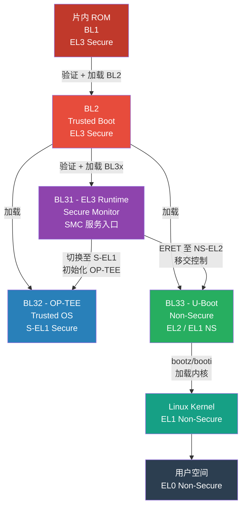
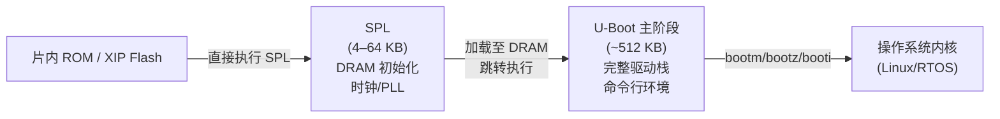

# Bootloader 逆向：U-Boot 与 ATF

## 概述与定位（TL;DR）

> [!abstract] 核心摘要
> Bootloader 是嵌入式系统最早执行的软件，也是固件安全链的根基。U-Boot 是 IoT 设备最广泛使用的开源 Bootloader，ARM Trusted Firmware（ATF）则定义了 ARMv8-A 的安全启动信任根。理解两者的结构、镜像格式与逆向技巧，是突破嵌入式设备安全防线的必备基础。

在 IoT 固件逆向中，Bootloader 处于整个信任链的最底层。能否在 Bootloader 阶段介入，决定了攻击者能否：

- 绕过安全启动（Secure Boot）限制，加载未签名固件
- 在系统启动前窃取密钥材料（在 TEE 初始化前读取 eFuse/OTP）
- 通过 UART 命令行直接操作硬件内存与 Flash

本章覆盖两大主题：**U-Boot**（开源通用 Bootloader）和 **ARM Trusted Firmware**（ARMv8-A 安全固件框架）。两者在现代 IoT 设备（路由器、IP 摄像头、工业控制器）中通常配合使用，构成完整的多阶段启动链。

---

## 原理与机制

### ARM 完整启动链（Mermaid）



**安全世界（Secure World）**：BL1/BL2/BL31/BL32 均在安全状态下运行，AArch64 通过 `SCR_EL3.NS` 位区分。  
**非安全世界（Non-Secure World）**：BL33（U-Boot）及后续 OS/应用运行在 NS 状态，无法直接访问安全内存。

### U-Boot 两阶段启动原理



SPL 极为精简：它只需把 DRAM 训练好，把 U-Boot 主镜像从 Flash 拷到 DRAM，然后跳转。U-Boot 主阶段再负责初始化网络、USB、文件系统驱动等完整子系统，提供命令行给调试使用。

---

## U-Boot 结构与详解

### 1. uImage 头格式（`image_header_t`）

旧式 `uImage` 格式由 `mkimage` 工具生成，头部固定 **64 字节**，布局如下：

| 字节偏移 | 字段名 | 大小（字节） | 说明 |
|----------|--------|-------------|------|
| 0x00 | `ih_magic` | 4 | 魔数 `0x27051956`（大端）|
| 0x04 | `ih_hcrc` | 4 | 头部 CRC32 校验（计算时此字段置 0）|
| 0x08 | `ih_time` | 4 | Unix 时间戳（镜像生成时间）|
| 0x0C | `ih_size` | 4 | 数据区字节数（不含头）|
| 0x10 | `ih_load` | 4 | 加载地址（Load Address）|
| 0x14 | `ih_ep` | 4 | 入口点（Entry Point）|
| 0x18 | `ih_dcrc` | 4 | 数据区 CRC32 校验 |
| 0x1C | `ih_os` | 1 | OS 类型（`5`=Linux，`6`=NetBSD…）|
| 0x1D | `ih_arch` | 1 | 架构（`2`=ARM，`3`=x86，`12`=AArch64）|
| 0x1E | `ih_type` | 1 | 镜像类型（`2`=kernel，`3`=ramdisk，`4`=multi…）|
| 0x1F | `ih_comp` | 1 | 压缩方式（`0`=无，`1`=gzip，`2`=bzip2）|
| 0x20 | `ih_name` | 32 | 镜像名称（ASCII，NUL 填充）|

> [!tip] 快速识别 uImage
> 在 Ghidra/IDA 中定位魔数 `27 05 19 56`（大端）即可找到镜像头。`ih_ep` 字段直接给出内核入口地址，可用于指导反编译器的分析起点。

**查看 uImage 信息的标准命令：**

```bash
mkimage -l uImage
# 输出示例：
# Image Name:   Linux-5.4.0
# Created:      Mon Jun 30 12:00:00 2026
# Image Type:   ARM Linux Kernel Image (gzip compressed)
# Data Size:    4194304 Bytes = 4096.00 KiB = 4.00 MiB
# Load Address: 80008000
# Entry Point:  80008000
# Verifying Checksum ... OK
```

```bash
# 用 Python 解析 uImage 头（逆向脚本片段）
import struct, sys

with open(sys.argv[1], 'rb') as f:
    hdr = f.read(64)

magic, hcrc, ts, size, load, ep, dcrc, os_t, arch, img_type, comp = \
    struct.unpack('>IIIIIIIBBBBB', hdr[:0x1F])

print(f"Magic:  {magic:#010x}")
print(f"Load:   {load:#010x}")
print(f"EP:     {ep:#010x}")
print(f"Arch:   {arch} (2=ARM, 12=AArch64)")
print(f"Comp:   {comp} (0=none, 1=gzip)")
```

### 2. FIT（Flattened Image Tree）格式

FIT 是 U-Boot 的新式镜像格式，以 **Device Tree Source（DTS）** 描述多个子镜像，支持数字签名：

```
/dts-v1/;
/ {
    description = "Kernel+DTB+Initrd";
    #address-cells = <1>;

    images {
        kernel {
            description = "Linux kernel";
            data = /incbin/("zImage");
            type = "kernel";
            arch = "arm";
            os = "linux";
            compression = "gzip";
            load = <0x80008000>;
            entry = <0x80008000>;
            hash-1 { algo = "sha256"; };
        };
        fdt-1 {
            description = "Device Tree Blob";
            data = /incbin/("board.dtb");
            type = "flat_dt";
            arch = "arm";
            compression = "none";
            hash-1 { algo = "sha256"; };
        };
        ramdisk-1 {
            description = "Initramfs";
            data = /incbin/("rootfs.cpio.gz");
            type = "ramdisk";
            ...
        };
    };

    configurations {
        default = "conf-1";
        conf-1 {
            description = "Default config";
            kernel = "kernel";
            fdt = "fdt-1";
            ramdisk = "ramdisk-1";
            signature-1 {
                algo = "sha256,rsa4096";
                key-name-hint = "dev";
                sign-images = "fdt", "kernel";
            };
        };
    };
};
```

逆向要点：FIT 镜像以 `d0 0d fe ed` 魔数开头（DTB 标准魔数），可用 `fdtdump` 解析完整结构，签名节点 `signature-1` 中的 `algo` 字段揭示安全策略。

### 3. 环境变量系统

U-Boot 的环境变量存储在 Flash 的固定分区（或 eMMC 的专用分区）中，CRC32 校验保护。固件提取后可离线解析：

```bash
# 从固件 bin 中提取 U-Boot 环境变量分区
dd if=firmware.bin of=env.bin bs=1 skip=$((0x40000)) count=131072
strings env.bin | grep -E "^[a-zA-Z_]+=.*"
```

| 变量名 | 典型含义 |
|--------|---------|
| `bootcmd` | 上电自动执行的启动命令 |
| `bootargs` | 传给内核的命令行参数 |
| `bootdelay` | 倒计时秒数（设为 `-1` 禁用中断）|
| `ipaddr`/`serverip` | TFTP 网络启动参数 |
| `loadaddr` | 默认内存加载地址 |

---

## U-Boot 逆向实战

### 1. UART 中断启动（最常用入口）

> [!warning] 实战操作注意
> 上电后在 `bootdelay` 倒计时结束前，向 UART 发送任意字符（通常是空格或回车），即可中断自动启动流程进入命令行。不同设备的波特率常见值：115200、57600、38400。若 `bootdelay` 被设为 -1，则此方法失效，需要硬件方案（短接 Flash 引脚、JTAG）。

```bash
# minicom 连接 UART（替换为实际设备）
minicom -D /dev/ttyUSB0 -b 115200

# 上电后立即按空格键，出现提示符 =>
# => printenv
# => printenv bootcmd
# => printenv bootargs
```

### 2. 内存读写命令

在 U-Boot 命令行中，可以直接操作物理内存，是逆向分析的利器：

```
# 内存显示（十六进制转储）
=> md.b 0x80000000 0x40       # 以字节显示 64 字节
=> md.w 0x80000000 0x20       # 以字（16位）显示
=> md.l 0x80000000 0x10       # 以双字（32位）显示

# 内存写入（可修改内核镜像、绕过校验）
=> mw.b 0x80008000 0x90       # 写入单字节 NOP（ARM Thumb）
=> mw.l 0x80008000 0xe3a00000 # 写入 ARM MOV r0,#0 指令

# 内存拷贝
=> cp.b 0x80000000 0x81000000 0x1000   # 从 0x80000000 拷 4KB 到 0x81000000
```

### 3. 文件传输与固件上传

```
# Y-modem 接收（在 minicom 按 Ctrl+A S 发送文件）
=> loady 0x80000000
# 等待 minicom 切换到发送模式，选择文件

# TFTP 网络加载（需要先配置 IP）
=> setenv ipaddr 192.168.1.100
=> setenv serverip 192.168.1.1
=> tftp 0x80000000 uImage

# 加载后直接执行（替换 bootcmd）
=> bootm 0x80000000
```

> [!warning] 安全边界警告
> `mw.b` 可以写入任意物理地址。向运行中的 U-Boot 代码段写入会导致立即死机；向安全 SRAM 写入（若 MMU/MPU 无保护）可能覆盖密钥材料。实验时务必备份 Flash，避免砖机。

### 4. Flash 操作命令

```
# NAND Flash
=> nand info                          # 查看 NAND 信息
=> nand read 0x80000000 0x000000 0x300000   # 读取 3MB 到内存

# NOR Flash（CFI）
=> flinfo                             # 查看 NOR Flash 信息
=> cp.b 0x80000000 0x00000000 0x10000  # 写回 Flash

# eMMC/SD
=> mmc list
=> mmc dev 0
=> mmc read 0x80000000 0 0x800        # 读取 1MB（512*0x800）
```

### 5. 在 IDA/Ghidra 中加载 U-Boot

U-Boot 通常无符号，是裸二进制，需要手动指定加载地址：

- **找加载基址**：串口日志中 `U-Boot 2023.01 (Jun 30 2026)` 行之后会打印 `relocating to 0x...`，这是运行时地址。也可在 `printenv` 中查 `bootaddr`，或分析 `md.l 0x00000000` 附近的向量表。
- **Ghidra**：新建项目 → Language 选 `ARM:LE:32:v7` 或 `AARCH64:LE:64:v8A` → Raw Binary → Base Address 填实际加载地址
- **IDA Pro**：File → Load File → Binary → Processor 选 ARM → Manual Load → 填 `Loading offset`
- **搜索关键字符串**：`"Hit any key to stop autoboot"` 是 U-Boot 标志性字符串，据此定位 `bootdelay` 处理代码

---

## ATF（ARM Trusted Firmware）架构与逆向

### 1. 各 BL 阶段详解

| 阶段 | 执行环境 | 核心职责 | 典型大小 |
|------|----------|----------|----------|
| **BL1** | 片内 ROM，EL3 Secure | CPU 最小初始化，从存储加载 BL2，验证签名 | 16–32 KB |
| **BL2** | SRAM，EL3 Secure | Trusted Boot：验证 BL31/BL32/BL33 签名，配置 TZC-400 等安全外设 | 64–128 KB |
| **BL31** | DRAM Secure Region，EL3 | EL3 常驻运行时，处理 SMC 调用（PSCI/SiP/OEM），从不退出 | 64–256 KB |
| **BL32** | Secure DRAM，S-EL1 | 可选 Trusted OS（OP-TEE），提供 TEE 环境 | 1–4 MB |
| **BL33** | Non-Secure DRAM，EL2 NS | 通常为 U-Boot，最终加载 OS 内核 | 512 KB |

### 2. SMC 调用规约（SMCCC）

SMC（Secure Monitor Call）是非安全世界请求 EL3 服务的唯一合法通道：

```
EL1/EL2 NS              EL3 (ATF BL31)
    │                        │
    │  W0 = function_id      │
    │  W1-W7 = 参数          │
    │──── SMC #0 ────────>   │  触发 Synchronous Exception to EL3
    │                        │  查 rt_svc_descs 路由表
    │                        │  分发到对应处理函数
    │  W0 = 返回值           │
    │<───────────────────────│  ERET 返回 NS
    │                        │
```

**PSCI 功能码表**（ARM Power State Coordination Interface）：

| 功能码 | 名称 | 描述 |
|--------|------|------|
| `0x80000001` | `CPU_SUSPEND` (32-bit) | 暂停 CPU（低功耗）|
| `0x84000001` | `CPU_SUSPEND` (64-bit) | 同上（AArch64）|
| `0x84000002` | `CPU_OFF` | 关闭当前 CPU 核 |
| `0x84000003` | `CPU_ON` | 启动指定 CPU 核 |
| `0x84000004` | `AFFINITY_INFO` | 查询 CPU 亲和状态 |
| `0x84000008` | `SYSTEM_RESET` | 系统复位 |
| `0x84000009` | `SYSTEM_OFF` | 系统关机 |
| `0x8400000E` | `PSCI_VERSION` | 返回 PSCI 版本号 |

> [!tip] 识别 SMC 处理函数
> 在 IDA/Ghidra 搜索立即数 `0x84000001` 或 `0x80000000`（PSCI 功能码基值），即可定位 BL31 的 SMC 分发路由表 `rt_svc_descs`。

### 3. ATF BL31 逆向技巧

**ELF 加载**：ATF 编译时生成 ELF，生产固件通常 `strip` 后提取 BIN 段。如果能拿到 ELF（有些设备 OTA 包未剥符号），IDA 可直接解析调试符号。

**无符号 BIN 的分析流程**：

1. **定位加载地址**：BL31 通常加载到 `0x04000000`（ARM Juno/RK3399）或 `0xBF000000`（MediaTek），看链接脚本 `plat/<soc>/plat.ld` 中的 `BL31_BASE`
2. **搜索 SMCCC 分发表**：`rt_svc_descs_indices` 是 256 项的字节数组，每项指向 `rt_svc_descs` 表条目；也可搜功能码范围比较指令（`CMP W0, #0x84000000`）
3. **识别 PSCI handler**：`psci_cpu_on_start` 等函数有典型的 `BL31_ENTRYPOINT` 尾调用模式
4. **安全配置分析**：BL2 中的 `bl2_plat_get_image_desc` 揭示每个 BL 镜像的验证策略；`PLAT_ARM_BOOT_UART_BASE` 等常量可识别平台

```python
# Ghidra 脚本：批量搜索 PSCI 功能码引用
from ghidra.program.model.scalar import Scalar

PSCI_CODES = [0x84000001, 0x84000002, 0x84000003, 0x84000008]
listing = currentProgram.getListing()

for code in PSCI_CODES:
    refs = getReferencesTo(toAddr(code))
    for ref in refs:
        print(f"PSCI {code:#010x} referenced at {ref.fromAddress}")
```

### 4. 安全启动（Secure Boot）绕过研究

ATF BL2 的签名验证通常依赖平台 ROM 中的公钥哈希（存储于 eFuse/OTP）。常见攻击面：

| 攻击面 | 描述 | 难度 |
|--------|------|------|
| eFuse 未烧录 | 开发板未锁定，可替换公钥 | 低 |
| BL2 实现漏洞 | 整数溢出、边界检查缺陷 | 高 |
| Glitch 攻击 | 电压/时钟毛刺跳过签名校验指令 | 中 |
| Debug 接口未关闭 | JTAG 在量产固件仍可用 | 中 |
| rollback protection 缺失 | 可降级到有漏洞的旧版 BL | 中 |

---

## 安全性与正确使用

### Secure Boot 设计要点

> [!important] 安全启动必要条件
> 完整的 Secure Boot 链需要满足：（1）片内 ROM 代码不可篡改；（2）eFuse 已烧录公钥哈希且 OTP 已锁定；（3）BL2 验证失败时立即停机（不 fallback）；（4）BL33 环境变量分区也需签名或只读保护。U-Boot 的 `CONFIG_ENV_IS_READONLY` 可防止攻击者通过修改 `bootargs` 注入 Linux 内核参数。

### U-Boot 环境变量安全

```bash
# 不安全配置（任何人可改 bootargs）
setenv bootargs "console=ttyS0 root=/dev/mtd2 rw init=/bin/sh"
# 通过此方式可直接获得 root shell！

# 安全加固措施：
# 1. 在 U-Boot 编译时设置 CONFIG_BOOTARGS_OVERRIDE=n
# 2. 启用 CONFIG_ENV_LOCKDOWN（只读环境变量）
# 3. 使用 FIT 镜像签名，bootm 验证后才执行
```

### ATF 安全配置核查清单

| 配置项 | 安全值 | 风险值 |
|--------|--------|--------|
| `ENABLE_ASSERTIONS` | 0（生产）| 1（信息泄露）|
| `TRUSTED_BOARD_BOOT` | 1 | 0（无验证）|
| `GENERATE_COT` | 1 | 0 |
| `DEBUG` | 0 | 1（串口泄露寄存器状态）|
| `ENABLE_STACK_PROTECTOR` | `strong` | `none` |
| eFuse BL_AUTH_KEY | 已烧录锁定 | 未烧录（允许任意 BL）|

> [!note] OP-TEE 联动
> BL32（OP-TEE）运行于 S-EL1，通过 SMC 向 REE（Rich Execution Environment，即 Linux）暴露 GlobalPlatform TEE API。逆向 TA（Trusted Application）需要先提取 BL32 内存转储，再用 OP-TEE 的 ELF 格式分析器解析 `.ta` 文件。详见系列后续章节。

---

## 逆向工具链汇总

| 工具 | 用途 | 典型命令/说明 |
|------|------|--------------|
| `mkimage` | 解析/生成 uImage | `mkimage -l uImage` |
| `fdtdump` | 解析 FIT/DTB | `fdtdump fit.itb` |
| `binwalk` | 固件中提取 U-Boot/ATF 段 | `binwalk -e firmware.bin` |
| IDA Pro 8+ | AArch64 反汇编 | 加载 ELF/BIN，设基址 |
| Ghidra | 开源反编译 | AARCH64 LE 处理器 |
| `strings` | 快速定位版本字符串 | `strings uboot.bin \| grep "U-Boot"` |
| minicom/picocom | UART 串口通信 | `minicom -D /dev/ttyUSB0 -b 115200` |
| OpenOCD + JTAG | 硬件调试 | 配合 JLink/DAPLink |
| `dfu-util` | DFU 固件上传（若支持）| `dfu-util -a 0 -D image.bin` |

---

## 实战案例：路由器 U-Boot UART 提权

> [!example] 真实场景摘要
> 某家用路由器（MT7621 MIPS SoC），固件 `bootdelay=3`，UART 默认开放。步骤：
> 1. 以 3.3V TTL 转 USB 连接 UART（115200,8N1）
> 2. 上电后 3 秒内按回车，进入 `MT7621 #` 提示符
> 3. `printenv bootargs` 显示 `root=/dev/mtdblock2 console=ttyS0,115200`
> 4. `setenv bootargs "root=/dev/mtdblock2 console=ttyS0,115200 init=/bin/sh"`
> 5. `boot`（执行 `bootcmd`）→ 内核启动后直接进入 root shell，无需密码
> 6. `saveenv` 永久保存（使改动在断电后仍然有效）

此案例说明：**U-Boot 命令行 + 可修改 `bootargs`** = 完整 root 访问权限。安全设备必须锁定 UART 或启用环境变量只读保护。

---

## 小结

- **U-Boot** 分 SPL + 主阶段，通过 UART 可直接进入命令行操控硬件，`bootargs` 可注入 `init=/bin/sh` 获 root
- **uImage 头**（`0x27051956` 魔数，64 字节）记录加载地址和入口点，是逆向定位内核的起点
- **FIT 格式** 支持多子镜像和 RSA 签名，是现代 Secure Boot U-Boot 的基础
- **ATF BL31** 常驻 EL3，所有 SMC 调用经由此处路由；PSCI 功能码是识别 SMC handler 的钥匙
- **BL2** 实现 Trusted Boot，失守则整个安全链崩溃；eFuse 未烧录是最低挂果
- 逆向顺序建议：UART → 环境变量 → uImage 解析 → U-Boot 二进制分析 → ATF BL31 SMC handler 追踪

---

## 相关阅读

- [[21.Asm/43 启动流程与Bootloader.md]]
- [[15.操作系统加载与启动/01.固件与BIOS启动流程]]
- [[39.固件与IoT嵌入式逆向/05.MIPS与RISC-V嵌入式架构速查]]
- [[39.固件与IoT嵌入式逆向/07.嵌入式Linux内核与设备树]]
- [[39.固件与IoT嵌入式逆向/00.固件与IoT嵌入式逆向总览]]

---

⬅️ 上一篇 [[05.MIPS与RISC-V嵌入式架构速查]] ｜ 🏠 [[00.固件与IoT嵌入式逆向总览]] ｜ 下一篇 [[07.嵌入式Linux内核与设备树]] ➡️
