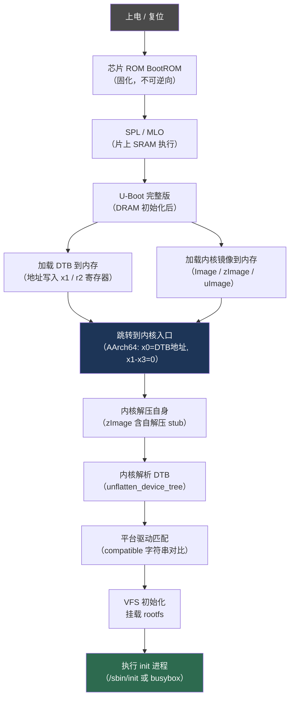

# 嵌入式Linux内核与设备树

## 概述与定位（TL;DR）

> [!abstract] TL;DR
> 嵌入式 Linux 内核以 `zImage`/`Image`/`uImage` 形式存在；设备树 DTB（魔数 `0xd00dfeed`）由 U-Boot 传递，描述硬件拓扑；`dtc -I dtb -O dts` 反编译获取 `bootargs`、寄存器映射、设备驱动匹配信息。

嵌入式 Linux 系统的启动过程不同于桌面 x86 世界：没有统一的 BIOS/UEFI，硬件信息不能动态枚举，内核镜像格式多样，硬件描述依赖**设备树（Device Tree）**在运行时传递。理解这一层对 IoT 固件逆向至关重要——它决定了**内核从哪里加载、哪些外设被激活、根文件系统挂载到哪个设备、串口在哪个波特率输出调试信息**。

本章系统梳理以下核心知识：

- 嵌入式 Linux 内核的几种镜像格式及识别方法
- 设备树（DTS/DTB）的结构、关键属性与二进制格式
- 平台驱动如何通过 `compatible` 属性与设备树节点匹配
- 逆向分析时从设备树提取有价值信息的实战技巧

与系列前章的关系：第06章分析了 U-Boot 如何加载内核；本章承接其后，聚焦于**内核本身的格式与硬件描述机制**；第08章将延伸至 RTOS 的静态链接世界。

互链参考：[[15.操作系统加载与启动/00.操作系统加载与启动总览]]

---

## 原理与机制

### 嵌入式 Linux 启动全流程



上图呈现了从上电到 `init` 进程的完整链路。逆向分析的关键节点集中在 D→G 阶段：U-Boot 将 DTB 地址放入寄存器，内核依此找到硬件描述，决定后续所有驱动行为。

---

## 内核镜像格式详解

嵌入式 Linux 内核以多种格式分发，不同格式对应不同架构与 Bootloader 组合。逆向时首先需要识别格式，才能正确提取和分析内核代码。

### Image（AArch64 原始格式）

`Image` 是 ARM64（AArch64）的标准内核镜像，**无压缩，无自解压逻辑**，直接包含可执行的内核代码段。

**文件头结构**（前 64 字节）：

```
偏移  大小  含义
0x00   4   跳转指令（b 跳过头部）
0x04  36   保留
0x28   8   text_offset（内核加载偏移量）
0x30   8   image_size（内核镜像大小）
0x38   8   flags（bit0: 小端 / 大端）
0x40   8   res2（保留）
0x48   8   res3（保留）
0x50   8   res4（保留）
0x38   4   magic = 0x644d5241  ("ARM\x64" 小端序)
0x3c   4   res5
```

魔数 `0x644d5241` 对应 ASCII 字符串 `ARM\x64`（即 `41 52 4D 64` 大端视图）。`binwalk` 可识别此魔数：

```bash
$ binwalk kernel.img
DECIMAL       HEXADECIMAL     DESCRIPTION
0             0x0             Linux kernel ARM64 Image, load offset: 0x80000,
                              image size: 22020096 bytes, little endian
```

### zImage（ARM32 自解压格式）

`zImage` 是 ARM32 平台最常见的内核格式，**内嵌自解压 stub**。执行时，stub 先将压缩数据（通常为 gzip）解压到目标内存地址，再跳转到真正的内核入口。

结构示意：

```
[ 自解压头部（ARM 汇编代码）]
[ 压缩的内核数据（gzip/lzma）]
[ 解压位置信息               ]
```

识别方法：

```bash
$ file zImage
zImage: Linux kernel ARM boot executable zImage (little-endian)

$ binwalk zImage
DECIMAL       HEXADECIMAL     DESCRIPTION
0             0x0             Linux kernel ARM boot executable zImage (little-endian)
19872         0x4DA0          gzip compressed data, from Unix, last modified: ...
```

`binwalk` 会识别内嵌的 gzip 流，可直接 `-e` 提取解压后的内核 ELF/原始二进制。

### uImage（U-Boot 封装格式）

`uImage` 是 U-Boot 定义的通用包装格式，在原始内核（通常为 zImage 或 Image）前面添加 **64 字节的 `image_header`**：

```c
typedef struct image_header {
    uint32_t    ih_magic;   /* 0x27051956 魔数 */
    uint32_t    ih_hcrc;    /* 头部 CRC32    */
    uint32_t    ih_time;    /* 时间戳        */
    uint32_t    ih_size;    /* 数据长度      */
    uint32_t    ih_load;    /* 加载地址      */
    uint32_t    ih_ep;      /* 入口点地址    */
    uint32_t    ih_dcrc;    /* 数据 CRC32   */
    uint8_t     ih_os;      /* OS 类型       */
    uint8_t     ih_arch;    /* CPU 架构      */
    uint8_t     ih_type;    /* 镜像类型      */
    uint8_t     ih_comp;    /* 压缩类型      */
    uint8_t     ih_name[32]; /* 镜像名称     */
} image_header_t;
```

魔数 `0x27051956` 大端序（U-Boot 历史上偏好大端），是 U-Boot `mkimage` 工具的标识符。

**分析工具**：

```bash
$ mkimage -l kernel.img
Image Name:   Linux-5.4.0
Created:      Mon Jan  1 00:00:00 2024
Image Type:   ARM Linux Kernel Image (uncompressed)
Data Size:    6291456 Bytes = 6144.00 KiB = 6.00 MiB
Load Address: 80008000
Entry Point:  80008000
```

> [!tip] 加载地址的逆向价值
> `ih_load` 和 `ih_ep` 字段直接告诉你内核期望被加载的物理地址及入口点，这对于后续在 Ghidra/IDA 中设置内核基地址至关重要。

### vmlinuz（x86 压缩格式）

`vmlinuz` 主要见于 x86/x86_64 桌面/服务器 Linux，嵌入式系统极少使用。如果在 IoT 设备固件中遇到，通常是运行 x86 架构的工控设备或 x86 SoC 网关。识别同样依赖 `strings` 扫描版本字符串。

### 识别工具速查

| 工具 | 用途 |
|------|------|
| `binwalk kernel.img` | 识别格式、扫描内嵌压缩数据 |
| `file kernel.img` | 快速格式判断 |
| `mkimage -l kernel.img` | 解析 uImage 头部元数据 |
| `strings kernel.img \| grep "Linux version"` | 提取内核版本字符串 |
| `hexdump -C kernel.img \| head -4` | 手动查看魔数字节 |

---

## 设备树（Device Tree）

### 什么是设备树

设备树（Device Tree，简称 DT）是一种**描述硬件拓扑的数据结构**，诞生于 PowerPC 架构，后被 ARM 内核广泛采纳。它解决了一个根本问题：**嵌入式硬件无法像 x86 PCIe 那样自动枚举设备**，内核无法"猜"到外设的寄存器基址、中断号、时钟配置。

在设备树机制引入前，ARM Linux 的做法是在内核源码中硬编码大量 `board file`（如 `arch/arm/mach-xxx/board-xxx.c`），每块开发板对应一个文件。Linus Torvalds 在 2011 年著名地将 ARM 树称为"a fucking pain in the ass"——设备树因此被强制推广。

**传递机制**：

1. U-Boot 将 DTB（编译后的二进制设备树）加载到内存某地址
2. 跳转内核时，将该地址写入特定寄存器（AArch64: `x0`；ARM32: `r2`）
3. 内核入口代码读取该寄存器，找到 DTB，调用 `unflatten_device_tree()` 解析

### DTS 语法结构

DTS（Device Tree Source）是设备树的文本形式，DTB（Device Tree Blob）是编译后的二进制形式。

**完整 DTS 示例**（路由器 SoC 场景）：

```dts
/dts-v1/;
/ {
    #address-cells = <1>;
    #size-cells = <1>;
    model = "Generic MT7621 Router";
    compatible = "mediatek,mt7621-soc";

    cpus {
        #address-cells = <1>;
        #size-cells = <0>;
        cpu@0 {
            compatible = "mips,mips1004Kc";
            reg = <0>;
        };
        cpu@1 {
            compatible = "mips,mips1004Kc";
            reg = <1>;
        };
    };

    memory@0 {
        device_type = "memory";
        reg = <0x00000000 0x10000000>;  /* 256MB @ 0x00000000 */
    };

    /* 串口控制器 */
    uart0: serial@1e000c00 {
        compatible = "ns16550a";
        reg = <0x1e000c00 0x100>;
        reg-shift = <2>;
        reg-io-width = <4>;
        interrupts = <26>;
        clock-frequency = <50000000>;
        status = "okay";
    };

    /* 以太网 */
    ethernet@1e100000 {
        compatible = "mediatek,mt7621-eth";
        reg = <0x1e100000 0x10000>;
        interrupts = <3>;
        status = "okay";
    };

    /* 闪存控制器 */
    spi@1e000b00 {
        compatible = "ralink,mt7621-spi";
        reg = <0x1e000b00 0x100>;
        #address-cells = <1>;
        #size-cells = <0>;
        status = "okay";

        flash@0 {
            compatible = "jedec,spi-nor";
            reg = <0>;
            spi-max-frequency = <10000000>;

            partitions {
                compatible = "fixed-partitions";
                #address-cells = <1>;
                #size-cells = <1>;

                partition@0 {
                    label = "u-boot";
                    reg = <0x0 0x30000>;
                    read-only;
                };
                partition@30000 {
                    label = "kernel";
                    reg = <0x30000 0x200000>;
                };
                partition@230000 {
                    label = "rootfs";
                    reg = <0x230000 0x5c0000>;
                };
            };
        };
    };

    /* 启动参数（逆向必看节点）*/
    chosen {
        bootargs = "console=ttyS0,57600 root=/dev/mtdblock3 rootfstype=squashfs ro";
        linux,initrd-start = <0x82000000>;
        linux,initrd-end   = <0x82800000>;
    };
};
```

### 关键属性解析

**`compatible`** — 驱动匹配核心

```dts
compatible = "mediatek,mt7621-eth", "mediatek,mt7620-eth";
```

`compatible` 是一个字符串列表，格式为 `"厂商,型号"`。内核驱动通过 `of_match_table` 声明自己支持哪些 `compatible` 字符串，设备树节点与驱动的绑定即通过此字段完成。列表顺序代表优先级，先尝试精确匹配，再回退到更通用版本。

**逆向价值**：`compatible` 字符串直接揭示 SoC 型号和外设型号，是识别硬件的最直接线索。

---

**`reg`** — 寄存器映射

```dts
reg = <0x1e000c00 0x100>;
```

`reg` 格式由父节点的 `#address-cells` 和 `#size-cells` 决定。上例表示：基地址 `0x1e000c00`，长度 `0x100` 字节。对逆向分析而言，这是**重建内存映射（Memory Map）的关键数据**——知道了 UART 的寄存器基址，就能在固件中定位 UART 输出函数。

---

**`/chosen/bootargs`** — 内核启动参数

```dts
bootargs = "console=ttyS0,57600 root=/dev/mtdblock3 rootfstype=squashfs ro";
```

这是逆向分析中价值最高的节点之一：

| 参数 | 含义 |
|------|------|
| `console=ttyS0,57600` | 调试串口：`/dev/ttyS0`，波特率 57600 |
| `root=/dev/mtdblock3` | 根文件系统在 MTD 分区 3（需对照分区表） |
| `rootfstype=squashfs` | 文件系统类型为 SquashFS |
| `ro` | 以只读方式挂载根文件系统 |

拿到这些信息，就能确定**调试串口配置**和**根文件系统提取目标**，为后续动态调试和静态分析铺路。

---

**`status`** — 设备启用状态

```dts
status = "okay";   /* 启用 */
status = "disabled"; /* 禁用（但节点存在，可供参考） */
```

`"disabled"` 节点对应的硬件存在于 PCB 上，但厂商出于某种原因（功耗、版本差异、未公开功能）将其关闭。逆向时可关注这些节点——它们可能是未公开的调试接口或隐藏功能。

### DTB 二进制格式

DTB 是 DTS 编译后的扁平二进制格式（FDT，Flattened Device Tree）：

```
偏移    内容
0x00    magic = 0xd00dfeed  (大端，即 0xed 0xfe 0x0d 0xd0)
0x04    totalsize           (整个 DTB 大小)
0x08    off_dt_struct       (结构块偏移)
0x0c    off_dt_strings      (字符串块偏移)
0x10    off_mem_rsvmap      (内存保留块偏移)
0x14    version             (通常为 17)
0x18    last_comp_version   (向后兼容版本)
0x1c    boot_cpuid_phys     (启动 CPU ID)
0x20    size_dt_strings     (字符串块大小)
0x24    size_dt_struct      (结构块大小)
```

**魔数识别**：`0xd00dfeed`（"d00d feed"，一个幽默的命名）以**大端**字节序存储，即文件前 4 字节为 `D0 0D FE ED`。`binwalk` 能识别此特征。

> [!warning] DTB 可能内嵌于内核镜像末尾
> 部分厂商（尤其是 Qualcomm、MediaTek）会将 DTB 直接附加在内核镜像末尾，称为 **appended DTB**。内核通过编译选项 `CONFIG_ARM_APPENDED_DTB` 支持此模式。此时 U-Boot 不需要单独传递 DTB 地址——内核自己找到末尾附加的 DTB。逆向时用 `binwalk` 扫描整个内核镜像，若在末尾发现 `0xd00dfeed` 魔数，即为 appended DTB。

### DTC 工具使用

`dtc`（Device Tree Compiler）是处理 DTS/DTB 的核心工具：

```bash
# DTB → DTS 反编译（逆向最常用）
$ dtc -I dtb -O dts -o output.dts input.dtb

# DTS → DTB 编译
$ dtc -I dts -O dtb -o output.dtb input.dts

# 直接从 /proc/device-tree 转储运行时设备树（设备在线时）
$ dtc -I fs -O dts /proc/device-tree

# 指定包含路径（处理有 #include 的 DTS）
$ dtc -I dts -O dtb -i /path/to/include -o output.dtb input.dts
```

> [!warning] dtc 版本与 -@ 选项
> 较旧版本 `dtc` 不支持 `-@` 选项（用于保留符号供 overlay 使用）。如果反编译厂商 DTB 时出现警告或属性丢失，尝试升级到 dtc 1.6.0+。部分厂商 DTB 包含自定义属性，`dtc` 会报 `Warning (avoid_unnecessary_addr_size)`，一般不影响分析，加 `-W no-avoid_unnecessary_addr_size` 可抑制警告。

---

## 平台驱动加载机制

### Platform Driver 注册与匹配

嵌入式 Linux 中，大多数片上外设（UART、SPI、I2C、GPIO）通过**平台驱动**（Platform Driver）模型管理：

```c
/* 驱动声明支持的 compatible 字符串 */
static const struct of_device_id mt7621_eth_of_ids[] = {
    { .compatible = "mediatek,mt7621-eth" },
    { .compatible = "mediatek,mt7620-eth" },
    { /* sentinel */ }
};

/* 注册平台驱动 */
static struct platform_driver mt7621_eth_driver = {
    .probe  = mt7621_eth_probe,
    .remove = mt7621_eth_remove,
    .driver = {
        .name           = "mt7621-eth",
        .of_match_table = mt7621_eth_of_ids,
    },
};
module_platform_driver(mt7621_eth_driver);
```

**匹配流程**：

1. 内核解析 DTB，为每个 `status = "okay"` 的节点创建 `platform_device`
2. 遍历已注册的 `platform_driver`，对比 `of_match_table` 中的 `compatible` 字符串
3. 匹配成功时调用驱动的 `.probe` 函数，传入 `platform_device`（含 DTS 属性）
4. 驱动在 `.probe` 中从设备树读取 `reg`/`interrupts`/`clock-frequency` 等属性完成初始化

### 内核模块（.ko）

闭源厂商驱动（Wi-Fi 芯片固件、摄像头 ISP、私有加解密模块）常以 `.ko`（内核对象文件）形式存在于根文件系统中：

```bash
# 固件文件系统中常见路径
/lib/modules/$(uname -r)/kernel/drivers/
/lib/modules/extra/
/lib/wifi/        # 部分路由器厂商自定义路径
```

`.ko` 是标准 ELF 文件，可直接用 Ghidra/IDA 分析：

```bash
$ file wlan.ko
wlan.ko: ELF 32-bit LSB relocatable, MIPS, MIPS32 rel2 version 1 (SYSV), not stripped

$ readelf -s wlan.ko | grep -E "FUNC|OBJECT" | head -20
```

> [!tip] .ko 通常比内核本身更容易逆向
> 内核主体通常 strip 掉符号，但厂商 `.ko` 有时因疏忽保留了符号表（`not stripped`）。即使被 strip，`.ko` 的 ELF 节头也提供了相对完整的结构，比裸内核映像更易于 Ghidra 自动分析。

### Device Tree Overlay

Device Tree Overlay（DTO）允许在运行时动态叠加设备树片段，常见于树莓派生态和支持热插拔扩展板的开发板：

```dts
/dts-v1/;
/plugin/;

&uart0 {
    status = "okay";
    /* overlay 激活 uart0 节点 */
};
```

逆向场景：树莓派类固件中，`/boot/config.txt` 控制哪些 overlay 被加载，通过 `dtoverlay=xxx` 指令。分析此文件可了解启用了哪些外设扩展。

---

## 逆向分析视角与实战

### 实战一：从 DTB 提取启动参数

**场景**：拿到一个路由器固件 `firmware.bin`，目标是确定调试串口配置和根文件系统位置。

```bash
# Step 1：全局扫描，定位所有组件
$ binwalk firmware.bin
DECIMAL       HEXADECIMAL     DESCRIPTION
0             0x0             uImage header, header size: 64 bytes, ...
64            0x40            LZMA compressed data
1310720       0x140000        Squashfs filesystem, little endian, version 4.0
...

# Step 2：提取并分解
$ binwalk -e firmware.bin
# 生成 _firmware.bin.extracted/ 目录

# Step 3：寻找 DTB（扫描 0xd00dfeed 魔数）
$ binwalk -y dtb _firmware.bin.extracted/*
# 或直接 hexgrep
$ grep -rl $'\xd0\x0d\xfe\xed' _firmware.bin.extracted/

# Step 4：反编译 DTB
$ dtc -I dtb -O dts -o board.dts board.dtb

# Step 5：提取关键信息
$ grep -A2 "bootargs\|chosen" board.dts
    chosen {
        bootargs = "console=ttyS0,57600 root=/dev/mtdblock3 rootfstype=squashfs ro";
    };
```

**结论**：串口调试配置 57600 波特率，`/dev/ttyS0`；根文件系统在 MTD 分区 3，SquashFS 格式。

### 实战二：重建硬件内存映射

从 DTS 提取所有 `reg` 属性，可重建 SoC 的片上外设地址空间：

```bash
$ grep -E "compatible|reg\s*=" board.dts | paste - - | \
  awk '{print $2, $NF}' | sort -t'x' -k2
```

或手动整理为表格：

| 节点 | 基地址 | 大小 | 用途 |
|------|--------|------|------|
| `serial@1e000c00` | `0x1e000c00` | `0x100` | UART0 |
| `spi@1e000b00` | `0x1e000b00` | `0x100` | SPI 闪存控制器 |
| `ethernet@1e100000` | `0x1e100000` | `0x10000` | 以太网 MAC |

在 Ghidra 中加载内核镜像时，使用此表设置内存映射（Memory Map），可以让 Ghidra 正确解析对外设寄存器的访问代码（否则这些地址对 Ghidra 毫无意义）。

### 实战三：内核版本识别与符号还原

**版本识别**：

```bash
# 方法一：strings 扫描（适用于未压缩或已解压镜像）
$ strings vmlinuz | grep "Linux version"
Linux version 4.14.90 (user@builder) (gcc version 7.3.0) #1 SMP Fri Jan 10 00:00:00 CST 2020

# 方法二：运行时（有 shell 访问权限时）
$ cat /proc/version
Linux version 4.14.90 (user@builder) (gcc version 7.3.0) #1 SMP
```

**符号还原**（三种来源，优先级递减）：

```bash
# 来源1：/proc/kallsyms（运行时，有 root 权限）
$ cat /proc/kallsyms | grep " T " | head -20
80008000 T _text
80400000 T start_kernel
...

# 来源2：文件系统中的 System.map
$ find /tmp/rootfs -name "System.map*" 2>/dev/null
/boot/System.map-4.14.90

# 来源3：内核镜像末尾的符号区段（部分厂商遗留）
$ strings kernel.img | grep -E "^[0-9a-f]{8} [TtBb] [a-z_A-Z]" | head
```

找到 `System.map` 后，可在 Ghidra 中编写脚本批量导入符号，将无名函数还原为有意义的名称。

### 实战四：识别隐藏 / 禁用外设

```bash
# 查找所有 disabled 节点
$ grep -B10 'status = "disabled"' board.dts
```

特别关注的节点类型：

- `jtag@...`：JTAG 调试接口（常被厂商禁用但 PCB 留有测试点）
- `uart@...`（第二个串口）：隐藏调试串口
- `usb@...`：在某些仅 Wi-Fi 版型中禁用的 USB 接口

逆向提示：在 PCB 上用万用表测量对应 `reg` 基地址的引脚，有时能确认实际硬件是否存在。

---

## 安全性与正确使用

### 信息泄露风险

设备树包含大量敏感信息，但许多厂商直接将其暴露在固件中（有时甚至暴露于 `/proc/device-tree`）：

| 泄露内容 | 位置 | 影响 |
|----------|------|------|
| 内核版本 | `strings` 扫描 | 已知 CVE 利用 |
| 串口波特率 | `/chosen/bootargs` | 物理调试接入 |
| 内存布局 | `memory@` 节点 | 堆喷地址计算 |
| 闪存分区表 | `partitions` 子节点 | 固件提取点 |
| 寄存器基址 | `reg` 属性 | 硬件后门开发 |

### DTB 完整性验证

设备树通常**不受加密或签名保护**（除非平台实现了安全启动并包含 DTB 验签步骤）。攻击者可修改 DTB 改变内核行为：

- 修改 `bootargs` 注入 `init=/bin/sh` 获得单用户模式 shell
- 修改 `status` 启用被禁用的调试接口
- 修改内存配置触发内核崩溃（DoS）

> [!warning] 研究边界
> 修改 DTB 绕过安全机制属于授权渗透测试范畴。在对目标设备拥有明确授权前，仅进行静态分析（读取、反编译 DTB）。修改闪存内容可能永久损坏设备。

### 防御建议（设备厂商）

1. **安全启动链**：在 U-Boot 中验证 DTB 签名（`CONFIG_SPL_FIT_SIGNATURE`），拒绝加载未签名 DTB
2. **最小化信息暴露**：运行时通过 `/proc/device-tree` 暴露完整设备树可能泄露敏感映射；考虑限制 `/proc/kallsyms` 访问（`kptr_restrict=2`）
3. **禁用未用接口**：JTAG、调试串口在生产固件中应通过 `status = "disabled"` 及物理熔丝（eFuse）双重禁用

---

## 小结

| 主题 | 核心要点 |
|------|----------|
| 内核格式识别 | `binwalk` + `file` + `mkimage -l`，注意 appended DTB |
| DTB 魔数 | `0xd00dfeed`（大端），`dtc -I dtb -O dts` 反编译 |
| 最高价值节点 | `/chosen/bootargs`：串口配置 + 根文件系统设备 |
| 驱动匹配 | `compatible` 字符串 → `of_match_table` → `.probe()` |
| 符号获取 | `/proc/kallsyms`（运行时）> `System.map`（文件系统）> strings |
| 隐藏外设 | 搜索 `status = "disabled"` 节点，关注 JTAG/UART |

---

## 相关阅读

- [[06.Bootloader逆向：U-Boot与ATF]] — U-Boot 如何加载内核并传递 DTB 地址
- [[08.RTOS逆向：FreeRTOS与VxWorks与ThreadX]] — 无设备树的 RTOS 世界：硬编码硬件映射
- [[15.操作系统加载与启动/00.操作系统加载与启动总览]] — 启动链全局视角
- [[00.固件与IoT嵌入式逆向总览]] — 系列导航

---

⬅️ 上一篇 [[06.Bootloader逆向：U-Boot与ATF]] ｜ 🏠 [[00.固件与IoT嵌入式逆向总览]] ｜ 下一篇 [[08.RTOS逆向：FreeRTOS与VxWorks与ThreadX]] ➡️
