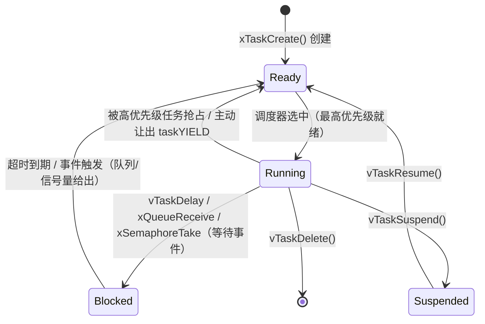

# 固件与IoT（08）· RTOS逆向：FreeRTOS与VxWorks与ThreadX

## 概述与定位

> [!abstract] TL;DR
> RTOS（实时操作系统）固件是嵌入式逆向中最难建立"全局观"的类型：整个系统静态链接为单一二进制，没有文件系统，没有符号，任务与通信模式分散在数十个调用站点。本章覆盖三大主流 RTOS（FreeRTOS、VxWorks、ThreadX）的内核结构、核心 API 特征、数据结构（TCB/QCB）与逆向识别方法，提供在 IDA/Ghidra 中重建任务拓扑图的完整流程，以及 Cortex-M 平台上的动态调试技巧。

RTOS（Real-Time Operating System，实时操作系统）广泛部署在 MCU 级微控制器（ARM Cortex-M0/M3/M4/M7/M33）、工业 PLC、汽车 ECU、医疗输液泵、航空航天传感器节点等对时序有严格要求的设备上。与桌面操作系统不同，RTOS 通常不提供进程间地址隔离，所有任务共享同一地址空间，内核与应用静态链接为单一 `.elf`/裸二进制镜像烧写进 Flash。

### 为什么逆向 RTOS 固件

**攻击面独特**：RTOS 设备常运行在医疗、工控等高价值目标中，漏洞影响往往超出 IoT 消费品。

**逆向挑战**：
- **无文件系统、无共享库**：所有代码静态链接，`binwalk -e` 无 SquashFS 可解包
- **无符号表（strip）**：商业固件几乎从不附带调试符号，需手动恢复函数/结构
- **调度模型不透明**：任务间通过队列/信号量/事件标志通信，控制流分散、难以追踪
- **硬件外设紧耦合**：逻辑行为取决于特定外设寄存器状态（CAN/SPI/ADC），仿真困难

**逆向目标**：
1. 确定使用的 RTOS 及其版本
2. 枚举所有任务（Task），建立任务名→入口函数→优先级映射表
3. 分析任务间通信（队列/信号量），重建系统消息流图
4. 定位安全敏感任务（固件更新、加密操作、网络通信），优先深入分析

---

## 原理与机制

### RTOS 调度模型

RTOS 的核心是**抢占式优先级调度器**：每个任务有固定优先级，高优先级任务就绪时立即抢占低优先级任务，保证最高优先级就绪任务在固定时间内得到 CPU。

任务状态机（以 FreeRTOS 为例）：



**关键时钟节拍（Tick）**：SysTick 定时器以 `configTICK_RATE_HZ`（常见 100 Hz/1000 Hz）频率产生中断，调度器在 Tick 中断中检查是否需要切换任务。`pdMS_TO_TICKS(ms)` 宏将毫秒转换为 Tick 计数，在反汇编中常表现为除法或乘法序列。

### RTOS 在内存中的布局

Cortex-M 裸机 RTOS 固件的典型内存映射：

```
Flash（ROM，0x08000000~）:
  向量表（256字节）
  ├── 0x00: 初始栈指针（指向 RAM 顶）
  └── 0x04: Reset_Handler 地址
  Reset_Handler → main()
  main():
    ├── BSP 初始化（时钟/GPIO/UART）
    ├── xTaskCreate(Task_A, ...)
    ├── xTaskCreate(Task_B, ...)
    └── vTaskStartScheduler()  ← 不返回

RAM（SRAM，0x20000000~）:
  .bss / .data（全局变量，含 pxCurrentTCB）
  堆（heap_4.c 管理，TCB 和栈从此分配）
  各任务栈（由 TCB 的 pxStack 指向）
```

---

## 结构、逆向与详解

### FreeRTOS 深入分析

FreeRTOS 是嵌入式 MCU 市场占有率最高的开源 RTOS，在路由器（IoT）、工控、医疗设备上均有部署。

#### 核心 API 特征

| API | 原型（简化） | 用途 |
|-----|------------|------|
| `xTaskCreate` | `(TaskFunc, Name, StackDepth, Param, Priority, &Handle)` | 创建任务，分配 TCB+栈 |
| `vTaskDelay` | `(pdMS_TO_TICKS(ms))` | 阻塞当前任务指定 Tick 数 |
| `vTaskDelayUntil` | `(&LastWakeTime, Period)` | 周期性精确延时（绝对时间） |
| `xQueueCreate` | `(Length, ItemSize)` | 创建消息队列 |
| `xQueueSend` | `(Queue, &Item, Timeout)` | 向队列发送消息（阻塞/超时） |
| `xQueueReceive` | `(Queue, &Buffer, Timeout)` | 从队列接收消息 |
| `xSemaphoreCreateBinary` | `()` | 创建二进制信号量 |
| `xSemaphoreCreateMutex` | `()` | 创建互斥量（含优先级继承） |
| `xSemaphoreTake` | `(Sem, Timeout)` | P 操作（等待） |
| `xSemaphoreGive` | `(Sem)` | V 操作（释放） |
| `xTimerCreate` | `(Name, Period, AutoReload, ID, CallbackFn)` | 创建软件定时器 |
| `xTimerStart` | `(Timer, Timeout)` | 启动/重启定时器 |
| `vTaskStartScheduler` | `()` | 启动调度器，不返回 |
| `vTaskDelete` | `(Handle)` | 删除任务并释放资源 |
| `uxTaskGetStackHighWaterMark` | `(Handle)` | 查询栈水位线（剩余空间） |

#### TCB 结构（`tskTCB` / `TCB_t`）

TCB（任务控制块）是 FreeRTOS 调度的核心数据结构。**第一个字段 `pxTopOfStack` 是关键**：任务切换时（`portSAVE_CONTEXT`/`portRESTORE_CONTEXT`），汇编直接从 TCB 基址偏移 0 处读取/写入栈顶指针，因此该字段必须在偏移 0。

```c
typedef struct tskTaskControlBlock {
    /* 偏移 0x00 — 任务切换时汇编直接用此字段，必须首个 */
    volatile StackType_t   *pxTopOfStack;

    /* 偏移 0x04/0x08 — 任务状态链表节点（Ready/Blocked/Suspended 对应不同列表） */
    ListItem_t              xStateListItem;

    /* 偏移 0x18/0x20 — 事件等待链表节点（队列/信号量等待时挂入对应链表） */
    ListItem_t              xEventListItem;

    /* 偏移 0x2C/0x38 — 任务优先级（0 最低，configMAX_PRIORITIES-1 最高） */
    UBaseType_t             uxPriority;

    /* 偏移 0x30/0x3C — 栈底指针（调试/栈溢出检测用） */
    StackType_t            *pxStack;

    /* 偏移 0x34/0x40 — 任务名，字符数组，configMAX_TASK_NAME_LEN 字节（默认 16） */
    char                    pcTaskName[configMAX_TASK_NAME_LEN];

    /* 以下字段随编译配置（configUSE_TRACE_FACILITY 等）出现或消失 */
    UBaseType_t             uxTCBNumber;          /* 调试序号 */
    UBaseType_t             uxTaskNumber;          /* 运行时任务号 */
    UBaseType_t             uxBasePriority;        /* 互斥量优先级继承前的原始优先级 */
    UBaseType_t             uxMutexesHeld;         /* 持有的互斥量数量 */
    /* ... MPU 配置、统计计数器等 ... */
} tskTCB;
typedef tskTCB TCB_t;
```

**逆向识别 TCB 的方法**：

1. 在 IDA 中搜索 ASCII 字符串，过滤 4–16 字节的英文任务名（`"MQTT"`、`"wifi_task"`、`"httpd"`、`"sensor_rx"`）
2. 对每个字符串做交叉引用（`Xref to`），找到将其地址作为第二参数传入某函数的调用——该函数即 `xTaskCreate`
3. `xTaskCreate` 的六个参数对应：`(TaskFunc, pcName, usStackDepth, pvParams, uxPriority, &pxCreatedTask)`，由此得到任务入口函数地址和优先级
4. 在运行时（OpenOCD/GDB 调试），`pxCurrentTCB` 全局变量指向当前运行任务的 TCB，直接 `x /s pxCurrentTCB_addr+0x34` 可读任务名

#### FreeRTOS 特征模式识别

**`vTaskStartScheduler()` 识别**：调用后进入无限循环，永不返回。在 IDA 中，`main()` 末尾调用某函数后代码路径死掉（无后续引用），且该函数内有 `portENABLE_INTERRUPTS()`（对应 `CPSIE I` 指令）和 `portSW_ENABLE_TICK_IRQ()` 调用，即为调度器入口。

**`pdMS_TO_TICKS` 识别**：`vTaskDelay(pdMS_TO_TICKS(100))` 在编译为 `configTICK_RATE_HZ=1000` 时，实际传入值为 100；若 `configTICK_RATE_HZ=100`，则传入值为 10。逆向时注意反推乘数，推断节拍频率。

**队列句柄识别**：`xQueueCreate` 返回 `QueueHandle_t`（本质是 `QueueDefinition *` 指针），全局变量若被 `xQueueSend`/`xQueueReceive` 同时引用，即为队列句柄。队列结构体头部含项目大小（`uxItemSize`）和队列长度（`uxLength`）。

**Heap 分配追踪**：FreeRTOS 默认使用 `heap_4.c`（合并空闲块的首次适应算法），`pvPortMalloc` 是内部分配函数。TCB 和任务栈都通过 `pvPortMalloc` 分配。若在 IDA 中找到 `pvPortMalloc`，其调用者大概率是 `xTaskCreate` 或队列/信号量创建函数。

---

### VxWorks 深入分析

VxWorks 是 Wind River Systems 的商业 RTOS，广泛用于航空航天、军事、工业自动化、网络设备（Cisco 路由器、部分交换机）、汽车（AUTOSAR Classic 平台）。

#### 核心 API 特征

| API | 说明 |
|-----|------|
| `taskSpawn(name, priority, options, stackSize, entryPt, arg1..arg10)` | 创建并立即启动任务（**10 个参数**，特征鲜明） |
| `taskDelete(tid)` | 删除任务 |
| `taskSuspend(tid)` / `taskResume(tid)` | 挂起/恢复 |
| `semBCreate(options, initialState)` | 创建二进制信号量 |
| `semMCreate(options)` | 创建互斥信号量（Mutual Exclusion） |
| `semCCreate(options, initialCount)` | 创建计数信号量 |
| `semTake(semId, timeout)` | P 操作（等待） |
| `semGive(semId)` | V 操作（释放） |
| `msgQCreate(maxMsgs, maxMsgLen, options)` | 创建消息队列 |
| `msgQSend(msgQId, buffer, nBytes, timeout, priority)` | 发送消息 |
| `msgQReceive(msgQId, buffer, maxNBytes, timeout)` | 接收消息 |
| `wdCreate()` / `wdStart(wd, delay, func, arg)` | 看门狗定时器 |
| `intConnect(INUM_TO_IVEC(n), handler, arg)` | 注册中断处理程序 |

**`taskSpawn` 的 10 参数特征**：这是 VxWorks 最明显的辨识标志。在 ARM 架构下，前 4 个参数通过 R0–R3 传递，后 6 个参数通过栈传递，调用点处往往有连续的 `PUSH`/`STR` 序列将 6 个额外参数压栈，逆向工程师一眼即可识别。

#### Symbol Table（符号表恢复）

VxWorks 的最大逆向红利是**内嵌符号表**。许多 VxWorks 固件（尤其是开发版、调试版、航电设备维护版）在二进制中保留了完整的 `sysSymTable`，包含每个函数/全局变量的名称和地址。

**符号表结构（每条记录）**：
```c
typedef struct symEntry {
    /* name: 以 \0 结尾的字符串，指向字符串池 */
    char    *name;
    /* value: 符号地址 */
    void    *value;
    /* type: 符号类型（函数/数据/BSS 等） */
    uint8_t  type;
    /* group: 模块组号 */
    uint16_t group;
} SYMBOL;
```

**IDA 脚本批量恢复符号**：

```python
# IDA Python：从 VxWorks sysSymTable 批量恢复符号
# 先手动定位符号表起始地址 SYM_TBL_BASE 和条目数 SYM_COUNT

import idc
import idaapi

SYM_TBL_BASE = 0x00300000  # 根据固件调整
SYM_ENTRY_SIZE = 0x10       # 32位固件每条 16 字节（指针4+地址4+类型1+pad3+group2+pad2）
SYM_COUNT = 2048             # 先估算，扫描到 name=0 为止

for i in range(SYM_COUNT):
    entry = SYM_TBL_BASE + i * SYM_ENTRY_SIZE
    name_ptr = idc.get_wide_dword(entry + 0x00)
    value    = idc.get_wide_dword(entry + 0x04)
    sym_type = idc.get_wide_byte(entry + 0x08)

    if name_ptr == 0 or value == 0:
        break

    name = idc.get_strlit_contents(name_ptr, -1, idc.STRTYPE_C)
    if name:
        name = name.decode('ascii', errors='replace')
        # 重命名函数
        if sym_type & 0x0F in (0x05, 0x09):  # 函数类型
            idc.set_name(value, name, idc.SN_NOWARN)
            idaapi.add_func(value)
        else:
            idc.set_name(value, name, idc.SN_NOWARN)

print(f"[*] 符号恢复完成")
```

**定位符号表**：搜索字符串 `"taskLib"`、`"semLib"`、`"msgQLib"`、`"sysSymTable"` 或 `"VxWorks"` 版本字符串（如 `"VxWorks5.5.1"`、`"VxWorks6.9"`），交叉引用附近区域即可找到符号表起始。

#### VxWorks 内核特征字符串

```bash
# 在 binwalk 或 strings 中寻找的关键字符串
"Wind River Systems"
"VxWorks"
"WRS"
"taskLib"
"Copyright Wind River"
"usrAppInit"       # 用户应用初始化入口
"sysInit"          # 硬件初始化入口
```

---

### ThreadX 深入分析

ThreadX（现为 Azure RTOS ThreadX，由 Microsoft 维护）是 Express Logic 开发的商业 RTOS，以极低的中断延时和确定性著称。广泛用于医疗设备、打印机、工业传感器、USB 控制器固件（微软收购后进入 Azure IoT 生态）。

#### 核心 API 特征

| API | 原型（简化） | 说明 |
|-----|------------|------|
| `tx_thread_create` | `(&tcb, name, entry, arg, stack_ptr, stack_size, priority, preempt_threshold, time_slice, auto_start)` | 创建线程（10 参数，类似 VxWorks） |
| `tx_thread_sleep` | `(timer_ticks)` | 延时指定 Tick |
| `tx_thread_suspend` | `(&tcb)` | 挂起线程 |
| `tx_thread_resume` | `(&tcb)` | 恢复线程 |
| `tx_semaphore_create` | `(&sem, name, initial_count)` | 创建计数信号量 |
| `tx_semaphore_get` | `(&sem, wait_option)` | P 操作 |
| `tx_semaphore_put` | `(&sem)` | V 操作 |
| `tx_mutex_create` | `(&mutex, name, inherit)` | 创建互斥量（支持优先级继承） |
| `tx_mutex_get` | `(&mutex, wait_option)` | 获取互斥量 |
| `tx_mutex_put` | `(&mutex)` | 释放互斥量 |
| `tx_queue_create` | `(&queue, name, msg_size, queue_start, queue_size)` | 创建消息队列 |
| `tx_queue_send` | `(&queue, src_ptr, wait_option)` | 发送消息 |
| `tx_queue_receive` | `(&queue, dest_ptr, wait_option)` | 接收消息 |
| `tx_event_flags_create` | `(&group, name)` | 创建事件标志组 |
| `tx_event_flags_set` | `(&group, flags, set_option)` | 设置事件标志 |
| `tx_event_flags_get` | `(&group, req_flags, get_option, &actual, wait_option)` | 等待事件标志 |
| `tx_kernel_enter` | `()` | 启动 ThreadX 内核（类似 `vTaskStartScheduler`） |

#### `TX_THREAD` 控制块结构

```c
typedef struct TX_THREAD_STRUCT {
    /* 偏移 0x00：魔数，固定为 TX_THREAD_ID（0x54485244），用于识别/校验 */
    ULONG           tx_thread_id;

    /* 偏移 0x04：线程名指针（指向字符串） */
    CHAR           *tx_thread_name;

    /* 偏移 0x08：当前栈指针（上下文切换时更新） */
    VOID           *tx_thread_stack_ptr;

    /* 偏移 0x0C：栈起始地址（低地址边界） */
    VOID           *tx_thread_stack_start;

    /* 偏移 0x10：栈结束地址（高地址边界） */
    VOID           *tx_thread_stack_end;

    /* 偏移 0x14：栈大小（字节） */
    ULONG           tx_thread_stack_size;

    /* 偏移 0x18：线程优先级（0 最高，TX_MAX_PRIORITIES-1 最低） */
    UINT            tx_thread_priority;

    /* 偏移 0x1C：抢占阈值（高于此优先级的任务才能抢占本线程） */
    UINT            tx_thread_preempt_threshold;

    /* 偏移 0x20：时间片（0=禁用时间片轮转） */
    ULONG           tx_thread_time_slice;

    /* 偏移 0x24：线程状态（TX_READY/TX_COMPLETED/TX_TERMINATED/TX_SUSPENDED/...） */
    UINT            tx_thread_state;

    /* 链表指针（就绪列表双向链表） */
    struct TX_THREAD_STRUCT *tx_thread_ready_next;
    struct TX_THREAD_STRUCT *tx_thread_ready_previous;

    /* 入口函数指针和参数 */
    VOID          (*tx_thread_entry)(ULONG id);
    ULONG           tx_thread_entry_parameter;

    /* ... 更多字段：定时器、统计、事件通知等 ... */
} TX_THREAD;
```

**识别 `TX_THREAD` 的方法**：在固件中搜索字节序列 `54 48 52 44`（`TX_THREAD_ID` 魔数，小端 = `0x54485244`，对应 ASCII `"THRD"`），找到魔数位置后，偏移 +4 处为名称指针——这是识别所有 ThreadX 线程的快速入口。

**识别 `tx_kernel_enter()`**：与 FreeRTOS 的 `vTaskStartScheduler()` 类似，在 `main()` 末尾调用，之后代码不返回。但 ThreadX 的初始化在 `tx_application_define()` 回调中完成，该函数由内核启动流程调用，在其中可以找到所有 `tx_thread_create` 调用。

---

## 逆向视角与实战

### 通用 RTOS 识别方法

**第一步：字符串扫描识别 RTOS 类型**

```bash
# 在 IDA strings 窗口或命令行搜索以下特征字符串
strings firmware.bin | grep -iE \
  "FreeRTOS|VxWorks|ThreadX|QNX|INTEGRITY|RTEMS|embOS|uC/OS|Nucleus"

# FreeRTOS 特征串
"FreeRTOS"              # 版本字符串
"vTaskStartScheduler"   # 若未 strip（罕见）
"IDLE"                  # IDLE 任务名（FreeRTOS 自动创建）
"Tmr Svc"               # Timer Service 任务名

# VxWorks 特征串
"Wind River VxWorks"
"usrAppInit"
"VxWorks5."/"VxWorks6."/"VxWorks7."

# ThreadX 特征串
"Azure RTOS ThreadX"
"Express Logic's ThreadX"
"THRD"                  # TX_THREAD_ID 魔数（二进制搜索）
```

**第二步：从 Reset_Handler 到 main() 追踪启动链**

在 Cortex-M 固件中：
- Flash 基址 `0x08000000`（STM32）或 `0x00000000`（LPC）前 8 字节为向量表
- `[0x00000000]` = 初始 SP 值，`[0x00000004]` = Reset_Handler 地址（奇数 = Thumb 模式）
- Reset_Handler 初始化 BSS/data，调用 `SystemInit()`，最终跳入 `main()`

```
(gdb) x/2x 0x08000000
0x08000000: 0x20020000  0x08001234   <- SP初值 | Reset_Handler
(gdb) set $pc = 0x08001234
(gdb) stepi    # 单步追踪直到调用 main()
```

**第三步：在 main() 中枚举任务创建调用**

一旦确认 RTOS 类型，在 IDA 中：

1. 搜索 `xTaskCreate`/`taskSpawn`/`tx_thread_create` 的特征（参数个数、典型常量）
2. 使用 `Edit → Find All Occurrences` 或 Ghidra 的 `Search → For Instruction Patterns`
3. 建立任务清单表（见下节示例）

**第四步：建立任务拓扑图**

```
任务清单示例（FreeRTOS IoT 设备）：
┌─────────────────┬─────────────────┬──────┬────────┬──────────────────────────┐
│ 任务名           │ 入口函数         │ 优先级 │ 栈大小  │ 备注                     │
├─────────────────┼─────────────────┼──────┼────────┼──────────────────────────┤
│ "wifi_mgr"      │ sub_08004A20    │   5  │ 4096 B │ 管理 Wi-Fi 连接           │
│ "mqtt_client"   │ sub_08006B10    │   4  │ 8192 B │ MQTT 消息收发             │
│ "sensor_read"   │ sub_08003D80    │   3  │ 2048 B │ 采集传感器数据             │
│ "ota_task"      │ sub_08009C40    │   2  │ 8192 B │ 固件 OTA 下载更新（重点！）│
│ "IDLE"          │ prvIdleTask     │   0  │ 128 B  │ FreeRTOS 自动创建         │
│ "Tmr Svc"       │ prvTimerTask    │   5  │ 512 B  │ FreeRTOS 软件定时器服务    │
└─────────────────┴─────────────────┴──────┴────────┴──────────────────────────┘
```

### 在 IDA 中分析 FreeRTOS 通信

**队列通信分析示例**：

```c
// 反编译视图（sensor_read 任务发送，mqtt_client 任务接收）
// sensor_read 任务
void sensor_read_task(void *pvParam) {
    SensorData_t data;
    QueueHandle_t hQueue = *(QueueHandle_t *)0x20001234;  // 全局队列句柄

    while (1) {
        data.temperature = read_adc(ADC_TEMP_CHANNEL);
        data.humidity    = read_adc(ADC_HUM_CHANNEL);
        xQueueSend(hQueue, &data, pdMS_TO_TICKS(10));
        vTaskDelay(pdMS_TO_TICKS(500));  // 500ms 周期采样
    }
}

// mqtt_client 任务
void mqtt_client_task(void *pvParam) {
    SensorData_t data;
    QueueHandle_t hQueue = *(QueueHandle_t *)0x20001234;  // 同一队列

    while (1) {
        if (xQueueReceive(hQueue, &data, portMAX_DELAY) == pdPASS) {
            char payload[64];
            snprintf(payload, sizeof(payload),
                     "{\"temp\":%d,\"hum\":%d}", data.temperature, data.humidity);
            mqtt_publish("sensor/data", payload, strlen(payload));
        }
    }
}
```

**逆向识别队列关系的步骤**：
1. 找到 `xQueueCreate` 调用，记录返回值存入的全局变量地址
2. 搜索所有对该全局变量的 `xQueueSend` 引用（找到生产者任务）
3. 搜索所有对该全局变量的 `xQueueReceive` 引用（找到消费者任务）
4. 由此建立生产者→队列→消费者的消息流图

### Cortex-M 上的 RTOS 动态调试

**使用 OpenOCD + GDB 调试 FreeRTOS**：

```bash
# 连接到目标（以 STM32 + ST-Link 为例）
openocd -f interface/stlink.cfg -f target/stm32f4x.cfg &
arm-none-eabi-gdb firmware.elf -ex "target extended-remote :3333"

# 暂停并查看当前任务
(gdb) monitor halt
(gdb) x/s 0x20001000   # 假设 pxCurrentTCB 在此地址
(gdb) p/x *((char **)0x20001000 + 0x34/4)  # 读取任务名（偏移 0x34）

# 在任务入口下断点
(gdb) break *0x08004A20   # wifi_mgr 任务入口
(gdb) continue

# 查看任务栈内容
(gdb) x/32x $sp

# 查看队列状态（需知道队列句柄地址）
(gdb) x/8x 0x2000A000   # 队列控制块起始
```

**GDB + FreeRTOS RTOS-Aware Debugging 插件**：

OpenOCD 自带 FreeRTOS 感知插件（`FreeRTOS.so`），启用后 GDB 可直接查看所有任务列表：

```
(gdb) info threads
  Id   Target Id         Frame
  1    process 1         "wifi_mgr" 0x08004a8c in wifi_connect ()
  2    process 2         "mqtt_client" 0x08006b44 in mqtt_wait_message ()
  3    process 3         "sensor_read" 0x08003dc0 in vTaskDelay ()
* 4    process 4         "IDLE" 0x080098a0 in prvIdleTask ()
```

### 实战：识别固件更新任务（OTA 安全分析）

OTA 任务是 IoT 安全分析中的高价值目标，通常负责下载、校验、写入新固件。分析要点：

```c
// 典型 OTA 任务逆向片段（FreeRTOS）
void ota_task(void *pvParam) {
    uint8_t *fw_buffer = pvPortMalloc(MAX_FW_SIZE);
    uint32_t fw_size;

    // 关键问题1：是否校验 HTTPS 证书？
    int ret = https_get(OTA_SERVER_URL, fw_buffer, &fw_size);

    // 关键问题2：是否校验固件签名？
    // 理想情况：rsa_verify(fw_buffer, fw_size, PUBLIC_KEY) == SUCCESS
    // 漏洞情况：仅校验 CRC32，或根本不校验
    if (crc32(fw_buffer, fw_size) == get_expected_crc()) {
        // 关键问题3：是否防止降级攻击？
        flash_write(FW_BASE_ADDR, fw_buffer, fw_size);
    }
    pvPortFree(fw_buffer);
    vTaskDelete(NULL);
}
```

分析清单：
- [ ] OTA URL 是否为 HTTP（明文，中间人攻击风险）
- [ ] 固件校验是否仅用 CRC/MD5（可伪造），还是 RSA/ECDSA 签名
- [ ] 是否存在版本号比较（防降级）
- [ ] Flash 写入地址是否可由 OTA 数据控制（任意写漏洞）

---

## 安全性与正确使用

> [!caution] 合规边界
> RTOS 固件逆向技术仅限以下合法用途：
> - **自有设备的安全研究**：您拥有该嵌入式设备，目的是发现并修复自己产品的安全问题
> - **授权渗透测试**：持有书面授权，在约定范围内对委托方的工控/医疗/汽车设备进行安全评估
> - **CTF 竞赛**：在规则范围内分析题目提供的固件
> - **漏洞赏金 / 学术研究**：遵循厂商安全披露政策（Responsible Disclosure），先私下报告再公开
>
> **明确禁止**：
> - 对未授权的工控系统、医疗设备、航电设备发起任何测试或干扰
> - 利用 RTOS 逆向所得信息中断生产环境的关键系统
> - 将 OTA 签名绕过方法武器化用于未授权设备

### RTOS 固件常见安全问题

**问题一：任务栈溢出（无 MPU 保护）**

Cortex-M0/M3 通常不启用 MPU（内存保护单元），任务栈溢出会静默覆盖相邻任务的 TCB 或栈，导致不可预测崩溃。逆向时注意：
- `uxTaskGetStackHighWaterMark()` 返回值接近 0 → 栈快满
- FreeRTOS `configCHECK_FOR_STACK_OVERFLOW` 未配置 → 溢出检测不工作

**问题二：优先级反转（Priority Inversion）**

低优先级任务持有互斥量，高优先级任务等待；中间优先级任务抢占低优先级任务，导致高优先级任务被间接阻塞（火星探路者宕机事件的 VxWorks 经典案例）。分析固件时，若发现 `xSemaphoreCreateMutex` 而非 `xSemaphoreCreateRecursiveMutex`，需关注是否配置了优先级继承（`configUSE_MUTEXES=1`）。

**问题三：消息队列溢出数据丢失**

`xQueueSend(..., 0)` 使用零超时——队列满时立即返回 `errQUEUE_FULL`，调用方若不处理此错误，数据静默丢失。安全影响：若丢失的是告警消息或认证令牌，可能导致安全机制失效。

**问题四：共享内存无保护**

RTOS 中多任务共享全局变量时，若没有互斥量或关键区保护（`taskENTER_CRITICAL()`），存在竞态条件（Race Condition）。逆向时搜索对同一全局地址既有读又有写的多个函数，检查是否有同步保护。

### 防御建议（针对 RTOS 固件开发者）

- **启用 MPU**：Cortex-M3/M4/M7/M33 均有 MPU，为每个任务栈配置 `no-execute` + 边界保护，将任务栈溢出变为可检测的 `MemManage_Handler` 异常
- **固件签名**：OTA 固件使用 ECDSA P-256 或 RSA-2048 签名，Bootloader 在跳入固件前验签
- **禁用 JTAG（生产环境）**：通过 OTP eFuse 禁用 JTAG/SWD，防止直接内存转储
- **堆完整性检查**：使用 `heap_5.c` 并开启 `configHEAP_TASK_TRACKING`，定期检查堆碎片和泄漏
- **最小化特权**：若使用 ARMv8-M（Cortex-M23/M33）的 TrustZone，将密钥操作移入 Secure World（参考第12章）

---

## 小结

本章系统覆盖了三大主流 RTOS 的逆向方法论：

1. **为什么难**：RTOS 固件无文件系统、无符号、单一二进制，任务调度和通信模型分散在数十个调用站点，必须重建全局任务拓扑才能理解系统行为。

2. **FreeRTOS**：开源、MCU 最广泛。核心识别点：任务名字符串→`xTaskCreate` 调用→TCB 中 `pxTopOfStack` 在偏移 0、任务名在偏移 0x34；`vTaskStartScheduler()` 标志调度器入口；`pxCurrentTCB` 全局变量是运行时调试入口。

3. **VxWorks**：商业、工控/航电。核心识别点：`taskSpawn` 的 10 参数特征；内嵌 `sysSymTable` 可批量恢复符号，是逆向大礼包；搜索 `"Wind River"` 字符串定位内核库区域。

4. **ThreadX**：商业、医疗/Azure IoT。核心识别点：`TX_THREAD_ID` 魔数 `0x54485244`（`"THRD"`）可直接定位所有线程控制块；`tx_application_define()` 回调是所有线程创建的起点；10 参数的 `tx_thread_create` 特征明显。

5. **通用方法**：字符串扫描识别 RTOS → Reset_Handler 追踪到 main() → 枚举任务创建调用 → 分析队列/信号量通信 → 重建消息流图 → 聚焦安全敏感任务（OTA/加密/网络）。

6. **安全聚焦点**：OTA 固件更新流程（签名验证、降级保护）、共享内存竞态、任务栈溢出、优先级反转是 RTOS 固件最常见的安全问题类别。

---

## 相关阅读

- [[21.Asm/11 ARM.md]] — ARM Cortex-M Thumb-2 指令集与向量表详解
- [[21.Asm/43 启动流程与Bootloader.md]] — Reset_Handler 到 main() 的完整启动链
- [[39.固件与IoT嵌入式逆向/07.嵌入式Linux内核与设备树]] — 对比：Linux vs RTOS 调度模型
- [[39.固件与IoT嵌入式逆向/10.硬件调试接口：JTAG与SWD与UART]] — OpenOCD + GDB 动态调试技巧
- [[39.固件与IoT嵌入式逆向/12.TrustZone与OP-TEE安全世界逆向]] — ARMv8-M TrustZone 与 Secure World 保护
- [[44.调试器原理与实战/00.调试器原理与实战总览]] — 调试器原理与 GDB 高级用法
- [[33.二进制漏洞与利用基础/00.二进制漏洞与利用基础总览]] — 栈溢出与内存安全基础

---

⬅️ 上一篇 [[07.嵌入式Linux内核与设备树]] ｜ 🏠 [[00.固件与IoT嵌入式逆向总览]] ｜ 下一篇 [[09.IoT通信协议逆向]] ➡️
