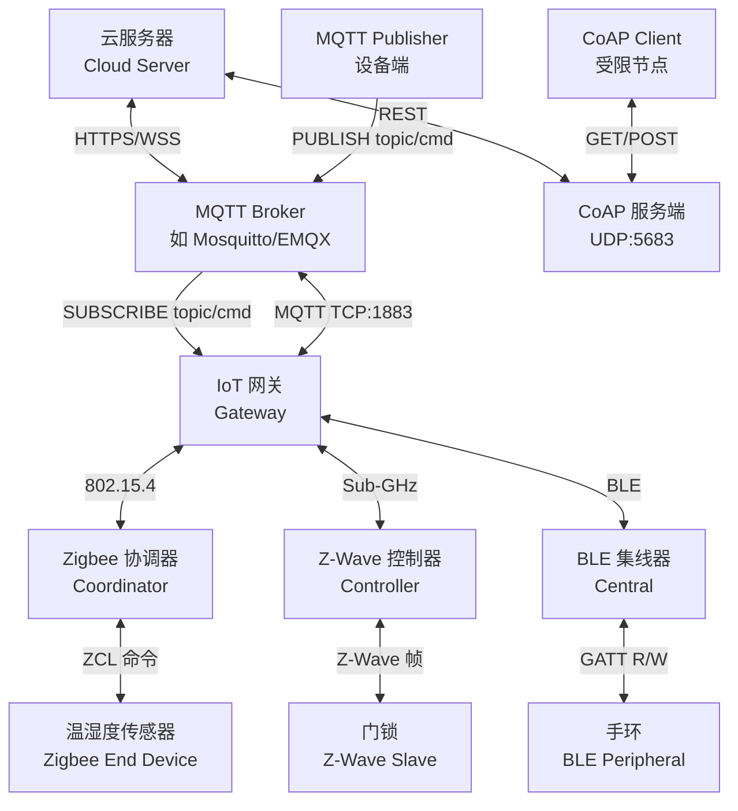
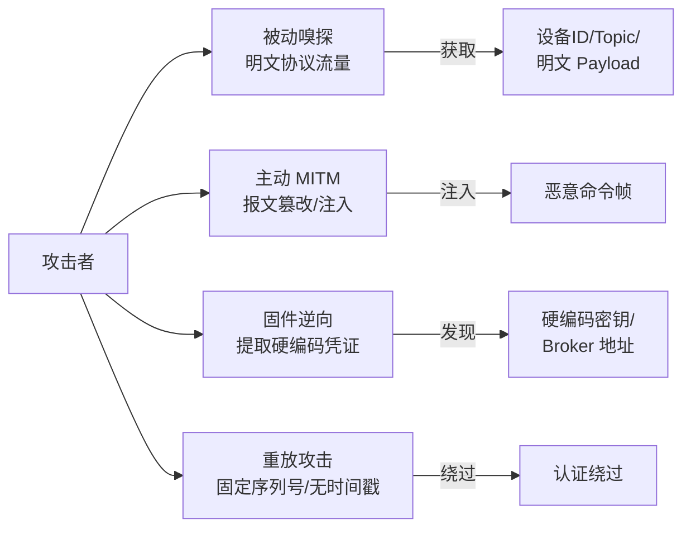

# 固件与IoT（09）· IoT通信协议逆向

## 概述与定位

> [!abstract] TL;DR
> IoT 设备通过 MQTT、CoAP、Zigbee、Z-Wave、BLE 等协议相互通信。逆向这些协议的核心路径是：固件字符串定位协议痕迹 → 二进制分析报文处理逻辑 → 抓包验证协议实现 → 识别安全漏洞（弱认证、明文传输、硬编码密钥）。掌握各协议的报文格式是分析固件通信行为、挖掘命令注入与权限绕过漏洞的基础。

物联网设备构成了一个异质化的通信生态：传感器用 Zigbee 汇报数据，网关用 MQTT 上报云端，手机 App 通过 BLE 直连设备，资源受限节点使用 CoAP 与服务端交互。从攻防角度看，IoT 协议逆向有三条主线：

1. **流量分析**：捕获设备通信流量，理解协议结构，重放或篡改报文；
2. **固件静态分析**：在二进制中定位协议实现代码，逆向命令解析逻辑；
3. **协议安全评估**：识别认证机制、加密配置、错误处理中的缺陷。

本章系统覆盖主流 IoT 协议的报文结构、抓包方法和固件逆向识别技术。

---

## 原理与机制

### IoT 通信协议体系

IoT 通信协议按网络层次和适用场景分为两大类：**基于 IP 的应用层协议**（MQTT/CoAP）和**近距离无线协议**（Zigbee/Z-Wave/BLE）。前者通常运行在 Wi-Fi/以太网设备上，后者主要用于资源极度受限的传感器和执行器节点。



### 协议安全威胁模型



---

## 结构/工具/详解

### MQTT 协议详解

#### 架构与传输

MQTT（Message Queuing Telemetry Transport）是发布/订阅模式的轻量级协议，由 IBM 于 1999 年设计，专为带宽受限、不稳定网络环境而生。三个核心角色：

- **Broker**：消息中心，负责路由所有消息（Mosquitto、EMQX、HiveMQ）；
- **Publisher**：向指定 Topic 发布消息的客户端（通常是传感器/设备端）；
- **Subscriber**：订阅感兴趣的 Topic 并接收消息的客户端（通常是服务端/网关）。

传输层：TCP，明文默认 **1883**，TLS 加密默认 **8883**，WebSocket 默认 **9001**。

#### MQTT 报文结构

每个 MQTT 控制报文由三部分组成：

| 字段 | 长度 | 说明 |
|------|------|------|
| Fixed Header | 1–5 字节 | 报文类型 + Flags + Remaining Length |
| Variable Header | 可变 | 依报文类型而定（如 CONNECT 含协议名） |
| Payload | 可变 | 实际数据（Client ID、Topic、消息内容等） |

**Fixed Header 第一字节结构**：

```
Bit:  7  6  5  4  |  3  2  1  0
      控制报文类型  |  类型相关 Flags
```

**控制报文类型速查**：

| 值 | 报文类型 | 方向 | 说明 |
|----|----------|------|------|
| 1 | CONNECT | Client → Broker | 请求建立连接 |
| 2 | CONNACK | Broker → Client | 连接确认 |
| 3 | PUBLISH | 双向 | 发布消息 |
| 4 | PUBACK | 双向 | QoS 1 发布确认 |
| 5 | PUBREC | 双向 | QoS 2 第一阶段确认 |
| 6 | PUBREL | 双向 | QoS 2 第二阶段确认 |
| 7 | PUBCOMP | 双向 | QoS 2 完成 |
| 8 | SUBSCRIBE | Client → Broker | 订阅请求 |
| 9 | SUBACK | Broker → Client | 订阅确认 |
| 12 | PINGREQ | Client → Broker | 心跳请求 |
| 13 | PINGRESP | Broker → Client | 心跳响应 |
| 14 | DISCONNECT | Client → Broker | 断开连接 |

**CONNECT 报文 Payload 详细结构**：

```
协议名长度 (2 bytes, MSB 优先): 0x00 0x04
协议名 (4 bytes):               "MQTT"
协议版本 (1 byte):              0x04 (v3.1.1) / 0x05 (v5.0)
Connect Flags (1 byte):
  Bit 7: User Name Flag    (1=Payload 含用户名)
  Bit 6: Password Flag     (1=Payload 含密码)
  Bit 5: Will Retain
  Bit 4-3: Will QoS
  Bit 2: Will Flag
  Bit 1: Clean Session     (1=不保留会话状态)
  Bit 0: Reserved (必须为 0)
Keep Alive (2 bytes):            心跳间隔秒数
--- Payload 开始 ---
Client ID (长度前缀 UTF-8 字符串)
[Will Topic (若 Will Flag=1)]
[Will Message (若 Will Flag=1)]
[Username (若 User Name Flag=1)]
[Password (若 Password Flag=1)]
```

**Remaining Length 编码**：采用可变长编码，每字节低 7 位为数值，最高位为延续标志（1=后续还有字节），最多 4 字节，可表示最大约 256 MB。

#### MQTT 抓包分析

Wireshark 过滤语法：

```wireshark
# 捕获所有 MQTT 流量（明文）
tcp.port == 1883

# 只看 PUBLISH 报文（类型 3，高 4 位 = 0011）
mqtt.msgtype == 3

# 过滤特定 Topic
mqtt.topic contains "device"

# 过滤 CONNECT 报文
mqtt.msgtype == 1

# 捕获 TLS 加密 MQTT（需配合 SSL 密钥解密）
tcp.port == 8883
```

Wireshark 的 MQTT 解析插件会自动识别 1883 端口流量，字段面板中显示 `MQTT Control Packet Type`、`Topic`、`Message`、`QoS Level` 等字段。

命令行工具快速测试（需安装 `mosquitto-clients`）：

```bash
# 订阅所有 Topic（通配符 #），用于嗅探设备发布内容
mosquitto_sub -h <broker_ip> -p 1883 -t "#" -v

# 向设备命令 Topic 发布重启命令（测试未认证 Broker）
mosquitto_pub -h <broker_ip> -t "device/DEV001/cmd" -m '{"action":"reboot"}'

# 带认证连接
mosquitto_sub -h <broker_ip> -u admin -P password -t "#" -v
```

---

### CoAP 协议详解

#### 架构与传输

CoAP（Constrained Application Protocol，RFC 7252）是专为受限节点（MCU 级，< 1 MHz CPU，< 10 KB RAM）设计的应用层协议，基于 UDP（默认 **5683**，DTLS 加密 **5684**），实现类似 HTTP 的 REST 语义（GET/POST/PUT/DELETE），适用于 LwM2M（轻量级 M2M 协议）场景。

#### CoAP 报文结构

CoAP 报文头部仅 4 字节（固定），极度紧凑：

```
 0                   1                   2                   3
 0 1 2 3 4 5 6 7 8 9 0 1 2 3 4 5 6 7 8 9 0 1 2 3 4 5 6 7 8 9 0 1
+-+-+-+-+-+-+-+-+-+-+-+-+-+-+-+-+-+-+-+-+-+-+-+-+-+-+-+-+-+-+-+-+
|Ver| T |  TKL  |      Code     |          Message ID           |
+-+-+-+-+-+-+-+-+-+-+-+-+-+-+-+-+-+-+-+-+-+-+-+-+-+-+-+-+-+-+-+-+
|   Token (if any, TKL bytes) ...                               |
+-+-+-+-+-+-+-+-+-+-+-+-+-+-+-+-+-+-+-+-+-+-+-+-+-+-+-+-+-+-+-+-+
|   Options (if any) ...                                        |
+-+-+-+-+-+-+-+-+-+-+-+-+-+-+-+-+-+-+-+-+-+-+-+-+-+-+-+-+-+-+-+-+
|1 1 1 1 1 1 1 1|    Payload (if any) ...                      |
+-+-+-+-+-+-+-+-+-+-+-+-+-+-+-+-+-+-+-+-+-+-+-+-+-+-+-+-+-+-+-+-+
```

| 字段 | 位宽 | 说明 |
|------|------|------|
| Ver | 2 bit | 协议版本，当前固定为 `01` |
| T (Type) | 2 bit | 消息类型：`00`=CON / `01`=NON / `10`=ACK / `11`=RST |
| TKL | 4 bit | Token 长度（0–8 字节） |
| Code | 8 bit | 高 3 位为 Class，低 5 位为 Detail（如 `0.01`=GET，`2.05`=Content） |
| Message ID | 16 bit | 消息去重/关联 ID |
| Token | 可变 | 请求/响应关联 Token |
| Options | 可变 | URI-Path、Content-Format 等选项（Delta 编码） |
| Payload | 可变 | 前缀 `0xFF` 分隔符，后跟实际内容 |

**消息类型语义**：

| 类型 | 缩写 | 说明 |
|------|------|------|
| Confirmable | CON | 需要对端回 ACK 的可靠消息 |
| Non-Confirmable | NON | 不需要确认的不可靠消息（适合传感器周期上报） |
| Acknowledgement | ACK | 对 CON 消息的确认（可携带响应） |
| Reset | RST | 无法处理对应 CON 消息时发送 |

**CoAP Code 常用值**：

| Code | 含义 |
|------|------|
| 0.01 | GET |
| 0.02 | POST |
| 0.03 | PUT |
| 0.04 | DELETE |
| 2.01 | Created |
| 2.04 | Changed |
| 2.05 | Content |
| 4.04 | Not Found |
| 5.00 | Internal Server Error |

#### CoAP 抓包分析

```wireshark
# CoAP 协议过滤（Wireshark 自动识别）
coap

# 按端口过滤
udp.port == 5683

# 过滤 GET 请求
coap.code == 1

# 过滤资源路径
coap.opt.uri_path contains "temperature"
```

命令行工具（`libcoap` 的 `coap-client`）：

```bash
# GET 资源
coap-client -m get coap://192.168.1.100/sensors/temp

# POST 数据
coap-client -m post -f payload.json coap://192.168.1.100/actuator/led

# 带 DTLS 的加密连接
coap-client -m get -k "preshared_key" coap+tcp://192.168.1.100/config
```

---

### Zigbee 协议详解

#### 协议栈结构

Zigbee 是基于 IEEE 802.15.4 的低功耗无线网格协议，常用于智能家居、工业传感、楼宇自动化场景。协议栈从下到上：

```
应用层 (APL)
  ├── ZCL (Zigbee Cluster Library) — 定义设备功能集（Cluster）
  ├── ZDO (Zigbee Device Object) — 设备发现、绑定、网络管理
  └── AF  (Application Framework) — 端点 (Endpoint) 管理

网络层 (NWK)   — 路由、Mesh 组网
MAC 层         — IEEE 802.15.4 介质访问控制
PHY 层         — IEEE 802.15.4 物理层（2.4 GHz / 868/915 MHz）
```

**设备角色**：
- **Coordinator（协调器）**：建立和管理 PAN 网络，唯一地址 `0x0000`；
- **Router（路由器）**：中继报文，扩展网络覆盖，全功能设备（FFD）；
- **End Device（终端设备）**：叶节点，支持睡眠省电，精简功能设备（RFD）。

**频段与信道**：2.4 GHz（全球，16 个信道，信道 11–26）；868 MHz（欧洲）；915 MHz（美洲）。

#### Zigbee 抓包

硬件嗅探器选择：

| 工具 | 价格区间 | 说明 |
|------|----------|------|
| CC2531 USB Dongle | 低 | TI CC2531 芯片，配合 Wireshark 的 `extcap` 插件 |
| HackRF One | 中 | 通用 SDR，需 GNU Radio + Zigbee 解码插件 |
| ATUSB | 中 | Atmel AT86RF231，Linux 驱动原生支持 |
| Ubiqua Protocol Analyzer | 商业 | 专业 Zigbee 分析仪，GUI 友好 |

Wireshark 过滤：

```wireshark
# IEEE 802.15.4 帧
wpan

# Zigbee 网络层
zbee_nwk

# Zigbee 应用层（ZCL 命令）
zbee_zcl

# 过滤特定 Cluster（如 On/Off Cluster = 0x0006）
zbee_zcl.cluster_id == 0x0006

# 过滤 ZCL 命令
zbee_zcl.cmd.id == 0x01
```

#### Zigbee 安全弱点

Zigbee 安全层使用 AES-128-CCM 加密，但历史上存在严重漏洞：

1. **默认网络密钥（Network Key）**：早期实现使用已知固定密钥 `0x5A6967426565416C6C69616E636530 3039` 或全零密钥；
2. **Join 过程密钥传输**：新设备加入网络时，Trust Center 以明文或弱加密传输 Network Key；
3. **重放攻击**：帧计数器（Frame Counter）机制在设备重启后可能重置，导致攻击者重放历史命令帧；
4. **KillerBee 工具集**：专用于 Zigbee 攻击的 Python 工具包（网络嗅探、注入、重放）。

---

### Z-Wave 协议详解

#### 协议概述

Z-Wave 是 Silicon Labs 的专有无线协议，专为家居自动化设计，工作在 **Sub-GHz 频段**（欧洲 868.42 MHz，北美 908.42/916 MHz），有效规避与 Wi-Fi/Zigbee 的 2.4 GHz 干扰。

网络架构：**Controller（主控）** 管理网络，最多支持 232 个节点；每个节点有 8 位 Node ID。Z-Wave 的 Mesh 路由最多跳转 4 次。

**Z-Wave 帧结构（基础）**：

```
Home ID (4 bytes) | Source Node ID (1 byte) | Frame Type | Length
| Dest Node ID (1 byte) | Command Class (1 byte) | Command (1 byte)
| Parameters ... | Checksum (1 byte)
```

关键 Command Class：

| Command Class 值 | 名称 | 功能 |
|-----------------|------|------|
| 0x25 | SWITCH_BINARY | 开关控制 |
| 0x26 | SWITCH_MULTILEVEL | 亮度/速度控制 |
| 0x37 | SWITCH_COLOR | 彩灯控制 |
| 0x62 | DOOR_LOCK | 门锁控制 |
| 0x98 | SECURITY | S0 安全封装 |
| 0x9F | SECURITY_2 | S2 安全封装 |

#### Z-Wave 安全演进

| 版本 | 安全机制 | 弱点 |
|------|----------|------|
| 无安全 | 明文传输 | 任意嗅探注入 |
| S0 (Security 0) | AES-128-OFB + 临时密钥 | 配对过程临时密钥以明文传输，可被嗅探 |
| S2 (Security 2) | AES-128-CCM + ECDH 密钥协商 | 当前推荐方案，配对需 DSK（设备特定密钥） |

Z-Wave 抓包工具：**Z-Wave.Me UZB** 或 **Sigma Designs USB Stick** + **Zniffer** 软件。

---

### BLE 低功耗蓝牙协议详解

#### GAP 与 GATT 架构

BLE（Bluetooth Low Energy）协议栈的两个核心规范：

**GAP（Generic Access Profile）**：定义设备如何广播（Advertising）和建立连接：
- `ADV_IND`：通用可连接广播（最常见）；
- `ADV_NONCONN_IND`：不可连接广播（Beacon）；
- `SCAN_RSP`：扫描响应，扩展广播数据。

**GATT（Generic Attribute Profile）**：基于 ATT（Attribute Protocol）的数据交换框架：

```
GATT Server (外设/Peripheral)
  └── Service (服务，UUID 标识)
        ├── Characteristic (特征，UUID + Properties + Value)
        │     ├── Properties: READ / WRITE / NOTIFY / INDICATE
        │     └── Descriptor (描述符，如 CCCD 0x2902 控制通知)
        └── Characteristic ...

GATT Client (中心设备/Central)
  → ATT Read Request / Write Request / Notification
```

**标准 GATT UUID（16 位简写）**：

| UUID | 含义 |
|------|------|
| 0x1800 | Generic Access Service |
| 0x1801 | Generic Attribute Service |
| 0x180A | Device Information Service |
| 0x180D | Heart Rate Service |
| 0x2A00 | Device Name Characteristic |
| 0x2A01 | Appearance Characteristic |
| 0x2A19 | Battery Level Characteristic |
| 0x2A29 | Manufacturer Name String |
| 0x2902 | Client Characteristic Configuration Descriptor (CCCD) |

#### BLE 抓包方法

**方法一：Android HCI Snoop Log**

```
开发者选项 → 启用蓝牙 HCI 信息收集
抓包文件路径：/sdcard/Android/data/btsnoop_hci.log
              或 /data/misc/bluetooth/logs/btsnoop_hci.log（root）
导出后用 Wireshark 打开，选择 NORDIC_BLE 或 HCI_H4 链路层类型
```

**方法二：nRF Sniffer（推荐）**

Nordic Semiconductor 提供的硬件嗅探方案：
- 硬件：nRF52840 Dongle（约 ¥100）；
- 固件：刷写 nRF Sniffer 固件；
- 软件：Wireshark + nRF Sniffer `extcap` 插件。

Wireshark 过滤：

```wireshark
# 所有 BLE 流量
btle

# GATT 层（ATT 协议）
btatt

# 过滤写请求（ATT Write Request，Opcode 0x12）
btatt.opcode == 0x12

# 过滤特定 UUID 的读操作
btatt.handle == 0x0025

# 过滤 GATT Notification（Opcode 0x1b）
btatt.opcode == 0x1b

# 广播包
btle.advertising_header.pdu_type == 0x00
```

**方法三：gatttool / bluetoothctl（Linux）**

```bash
# 扫描周边 BLE 设备
sudo hcitool lescan

# 连接设备并枚举所有服务和特征
gatttool -b AA:BB:CC:DD:EE:FF -I
  > connect
  > primary          # 列举所有服务
  > characteristics  # 列举所有特征
  > char-read-hnd 0x0025      # 读取 handle 0x0025
  > char-write-req 0x0026 01  # 写入数据

# 使用 bluetoothctl（更现代的接口）
bluetoothctl
  > scan on
  > connect AA:BB:CC:DD:EE:FF
  > menu gatt
  > list-attributes
```

---

## 逆向视角/实战

### 固件中协议识别通用方法

在获取固件二进制后，第一步是快速定位协议痕迹：

#### 第一步：字符串扫描

```bash
# 全面搜索协议关键词
strings firmware.bin | grep -iE "mqtt|coap|zigbee|z-wave|bluetooth|broker|topic|subscribe|publish|1883|5683|8883"

# 搜索 Broker 地址或域名（常见云平台）
strings firmware.bin | grep -iE "amazonaws|aliyun|mqtt\.|emqx|mosquitto|iot\."

# 搜索 Topic 路径模式（带格式化符号，说明是动态拼接）
strings firmware.bin | grep -E "device/|%s/cmd|/status|/telemetry|/shadow"

# 搜索 GATT UUID（十六进制字符串或字面量）
strings firmware.bin | grep -iE "2a00|2a19|180a|ffe0|fff0"
```

#### 第二步：交叉引用定位关键函数

以 MQTT 为例，在 Ghidra 或 IDA Pro 中：

```python
# Ghidra Python：搜索 "MQTT" 字符串并找所有引用
from ghidra.program.model.symbol import SymbolType

# 1. 在 Defined Strings 中找 "MQTT"
# 2. 右键 → References → Show References to
# 3. 找调用该字符串的函数（通常是 mqtt_init 或 mqtt_connect）

# 搜索 mqtt_connect 函数名（如果符号表存在）
# Function Manager → 搜索 "mqtt"
```

常见 MQTT 客户端库（固件中常用）：

| 库名 | 特征字符串/函数名 | 常见平台 |
|------|-----------------|----------|
| paho-mqtt-c | `MQTTClient_connect` / `paho` | Linux 设备 |
| eclipse/mosquitto | `mosquitto_new` / `mosquitto_connect` | Linux 设备 |
| wolfMQTT | `MqttClient_Init` / `wolfMQTT` | 嵌入式 RTOS |
| AWS IoT SDK | `aws_iot_mqtt_connect` / `aws-iot` | AWS IoT 设备 |
| MiniMQTT (CircuitPython) | `miniMQTT` | 资源受限设备 |

#### 第三步：分析 Topic 路径和命令结构

Topic 路径是设备逻辑的高度浓缩，典型 IoT 设备 Topic 设计：

```
device/{device_id}/cmd       # 下行命令
device/{device_id}/status    # 上行状态
device/{device_id}/ota       # OTA 升级
$aws/things/{thing_name}/shadow/update  # AWS IoT Shadow
```

在固件中找到 Topic 字符串后，追踪到 `mqtt_subscribe` 调用，再分析订阅回调函数（通常是函数指针）：

```c
// 典型的 MQTT 消息处理模式（逆向后伪代码）
void mqtt_message_callback(char *topic, uint8_t *payload, int len) {
    cJSON *root = cJSON_Parse((char*)payload);
    char *action = cJSON_GetObjectItem(root, "action")->valuestring;
    
    if (strcmp(action, "reboot") == 0) {
        trigger_reboot();
    } else if (strcmp(action, "ota") == 0) {
        char *url = cJSON_GetObjectItem(root, "url")->valuestring;
        start_ota(url);  // 注意：是否验证签名？
    } else if (strcmp(action, "exec") == 0) {
        char *cmd = cJSON_GetObjectItem(root, "cmd")->valuestring;
        system(cmd);     // 严重：命令注入漏洞！
    }
}
```

#### 第四步：分析 JSON/TLV 解析

常见嵌入式 JSON 库识别：

```bash
# cJSON（最常见）
strings firmware.bin | grep -iE "cjson|cJSON_Parse|cJSON_GetObject"

# jsmn（轻量级，token-based）
# 特征：结构体中 jsmntype_t 枚举，JSMN_OBJECT/JSMN_ARRAY/JSMN_STRING/JSMN_PRIMITIVE

# 自定义 TLV 协议识别（搜索固定魔术字节）
python3 -c "
import sys
data = open('firmware.bin','rb').read()
# 搜索常见 TLV 魔术头
for magic in [b'\xAA\x55', b'\x55\xAA', b'\xFE\xFF', b'\x7E']:
    pos = data.find(magic)
    if pos != -1:
        print(f'Found {magic.hex()} at offset {pos:#x}')
        print(data[pos:pos+32].hex())
"
```

#### 第五步：动态验证（MQTT 协议重放）

```bash
# 捕获真实设备流量后，提取 Payload 进行重放
# 步骤 1：ARP 欺骗 + 抓包（设备未加密时）
sudo arpspoof -i eth0 -t 192.168.1.100 192.168.1.1 &
sudo tcpdump -i eth0 -w mqtt_capture.pcap 'tcp port 1883'

# 步骤 2：用 tshark 提取 MQTT Payload
tshark -r mqtt_capture.pcap -Y "mqtt.msgtype==3" \
  -T fields -e mqtt.topic -e mqtt.msg

# 步骤 3：重放命令（测试服务端是否有防重放机制）
mosquitto_pub -h <broker> -t "device/DEV001/cmd" \
  -m '{"action":"reboot","ts":1234567890}'
```

### BLE 设备逆向实战

针对 BLE 固件的逆向流程：

```bash
# 1. 枚举目标设备的所有 GATT 服务（黑盒阶段）
bluetoothctl scan on
# 记录目标 MAC，然后：
gatttool -b AA:BB:CC:DD:EE:FF --char-read --uuid=0x2a00  # 读设备名

# 2. 在固件中搜索自定义 UUID（通常是 128 位格式）
strings firmware.bin | grep -iE "[0-9a-f]{8}-[0-9a-f]{4}-[0-9a-f]{4}-[0-9a-f]{4}-[0-9a-f]{12}"

# 3. 找到 UUID 后，在 Ghidra 中搜索对应字节序列（注意小端序）
# UUID: 6E400001-B5A3-F393-E0A9-E50E24DCCA9E (Nordic UART Service)
# 在二进制中以小端 16 字节序列出现

# 4. 找到 Characteristic 的 write handler，分析协议格式
# 典型命令格式：命令字节 + 参数
# 如：0x01 0x00 = 开灯，0x01 0x01 = 关灯，0x02 <r> <g> <b> = 设置颜色
```

---

## 安全性与正确使用

> [!caution] 未授权协议攻击的法律风险
> 对他人 IoT 设备实施 MQTT 注入、Zigbee 重放、BLE 劫持等攻击，在中国《网络安全法》、美国 CFAA 等法律下属于违法行为。本章所有技术仅适用于：
> - **自有设备**的安全评估；
> - 已签署渗透测试协议的委托评估；
> - CTF 竞赛及封闭实验环境；
> - 合规的安全研究（漏洞报告而非利用）。
> 在进行无线协议分析时，即使被动嗅探他人设备流量也可能触及隐私法律。

### IoT 协议安全加固清单

**MQTT 安全**：

| 加固项 | 不安全配置 | 安全配置 |
|--------|-----------|----------|
| 传输加密 | TCP 明文 1883 | TLS 1.2+ 端口 8883 |
| 身份认证 | 无用户名/密码 | 客户端证书双向认证 |
| Topic 权限 | 允许订阅 `#` | ACL 限制每客户端 Topic 范围 |
| Clean Session | CleanSession=0（持久会话泄露历史） | 按业务需求配置 |
| QoS 级别 | QoS 0（无确认） | 关键命令使用 QoS 1/2 |

**CoAP 安全**：
- 生产环境使用 DTLS（RFC 7252 §9）；
- 对 PUT/DELETE 请求实施资源访问控制；
- 启用 Block-wise 传输时防止分片重组攻击。

**Zigbee 安全**：
- 使用 Zigbee 3.0 规范（强制安装码配对，规避明文 Join）；
- 禁用全零 Network Key；
- 定期轮换 Network Key（`Transport Key` 命令）。

**BLE 安全**：
- 避免 `Just Works` 配对（无 MITM 保护）；
- 使用 LE Secure Connections（Passkey Entry 或 Numeric Comparison）；
- 对敏感 Characteristic 启用 Authenticated Encryption（需先配对加密）；
- 自定义 UUID 的通信内容额外加密（不依赖 BLE 传输层加密单独防护）。

> [!warning] 固件中的协议实现常见漏洞
> 1. **硬编码 Broker 凭证**：固件中明文存储 MQTT 用户名/密码，可通过 `strings` 直接提取；
> 2. **OTA URL 未验证签名**：通过 MQTT 命令下发的 OTA URL 直接 `wget` 执行，可替换为恶意固件；
> 3. **MQTT Payload 命令注入**：JSON 字段未做安全过滤直接传入 `system()`；
> 4. **BLE 无认证写**：关键 Characteristic 的 Properties 设为 `WRITE WITHOUT RESPONSE`，任何人可写；
> 5. **Zigbee S0 降级**：攻击者强制使用 Security 0 配对，在网络加入时嗅探明文 Network Key。

---

## 小结

IoT 通信协议逆向是固件安全分析的核心能力之一，本章要点回顾：

| 协议 | 传输层 | 默认端口 | 抓包工具 | 固件识别关键字 |
|------|--------|----------|----------|----------------|
| MQTT | TCP | 1883/8883 | Wireshark（mqtt 插件）| `"MQTT"`、`mqtt_connect`、Broker 域名 |
| CoAP | UDP | 5683/5684 | Wireshark（coap 插件）| `"coap"`、`5683`、`coaps` |
| Zigbee | 802.15.4 | 信道 11–26 | CC2531 + Wireshark | `"zigbee"`、ZCL Cluster ID |
| Z-Wave | Sub-GHz | 868/908 MHz | Zniffer | Z-Wave Home ID、Node ID |
| BLE | 2.4 GHz | — | nRF Sniffer / HCI log | GATT UUID、`"ble"`、Characteristic |

**固件逆向工作流**总结：
1. `strings` 定位协议字符串和 Broker/Topic 配置；
2. 交叉引用定位 `*_connect` / `*_subscribe` 函数；
3. 分析消息回调函数，还原命令协议格式；
4. 识别 JSON/TLV 解析库，理解 Payload 结构；
5. 抓包验证分析结论，尝试重放关键命令；
6. 检查 TLS/DTLS/加密配置，识别降级攻击面。

掌握协议报文格式是分析的起点，理解命令处理逻辑才是挖掘漏洞的核心。

---

## 相关阅读

- [[72.抓包与协议分析实战/00.抓包与协议分析实战总览]]
- [[08.RTOS逆向：FreeRTOS与VxWorks与ThreadX]]
- [[10.硬件调试接口：JTAG与SWD与UART]]
- MQTT v3.1.1 规范：OASIS MQTT Version 3.1.1 (2014)
- RFC 7252：The Constrained Application Protocol (CoAP)
- Zigbee Specification Rev. 22 (2017)：Zigbee Alliance
- Bluetooth Core Specification 5.4：Bluetooth SIG

---

⬅️ 上一篇 [[08.RTOS逆向：FreeRTOS与VxWorks与ThreadX]] ｜ 🏠 [[00.固件与IoT嵌入式逆向总览]] ｜ 下一篇 [[10.硬件调试接口：JTAG与SWD与UART]] ➡️
