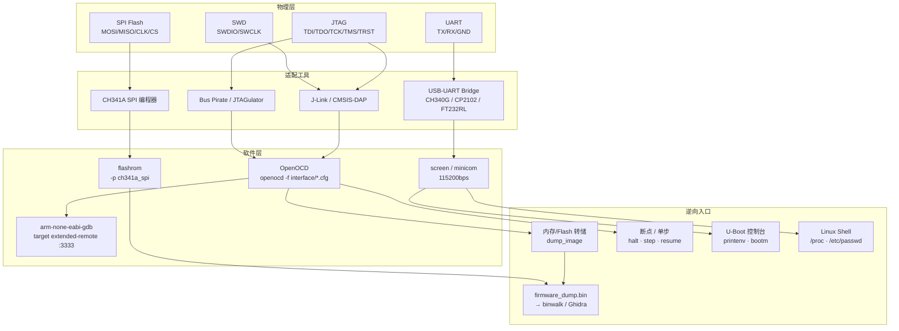

# 固件与IoT（10）· 硬件调试接口：JTAG与SWD与UART

## 概述与定位（TL;DR）

> [!abstract] TL;DR
> JTAG（IEEE 1149.1）通过 TAP 状态机实现边界扫描与 CPU 调试；SWD 是 ARM 专属两线精简替代，Cortex-M 标配；UART 串口控制台暴露 U-Boot 命令行与 Linux shell；SPI Flash 直读是无接口时的终极手段。OpenOCD + GDB 是 JTAG/SWD 调试的标准工具链。

嵌入式设备在出厂前，工程师需要一套"后门"来烧录固件、验证逻辑、单步调试——这套后门就是**硬件调试接口**。对逆向工程师而言，这些接口往往是在无操作系统支持、无网络连接的情况下唯一能"进入"目标设备的通道。

本章覆盖三种最核心的硬件调试接口：

| 接口 | 定位 | 关键词 |
|------|------|--------|
| **JTAG** | IEEE 1149.1 标准，通用边界扫描与调试 | TAP 状态机、OpenOCD、多芯片菊花链 |
| **SWD** | ARM 专属两线调试，JTAG 的精简替代 | SWDIO/SWCLK、Cortex-M、J-Link |
| **UART** | 异步串口控制台，固件启动日志与 shell | U-Boot、getty、CH340G |

此外补充 **SPI Flash 直读**——当目标芯片完全无调试接口可用时，直接从存储芯片读取固件的终极手段。

> **核心洞察**：IoT 厂商为节省 BOM 或降低开发难度，往往在量产板上仍保留调试引脚（只是不焊接头）。一根万用表探针、一块逻辑分析仪板、一颗 USB-UART 芯片，足以打开大多数消费级路由器或智能设备。

---

## 原理与机制全景



---

## JTAG 深度解析

### 信号定义（IEEE 1149.1）

JTAG 标准由五根信号线组成（`TRST` 为可选）：

| 信号 | 方向（主机视角） | 功能描述 |
|------|-----------------|----------|
| `TCK` | 输出 | Test Clock，所有信号在此时钟沿采样 |
| `TMS` | 输出 | Test Mode Select，控制 TAP 状态机跳转 |
| `TDI` | 输出 | Test Data In，移入数据到目标寄存器 |
| `TDO` | 输入 | Test Data Out，从目标寄存器移出数据 |
| `TRST` | 输出（可选） | Test Reset，强制 TAP 状态机复位（异步） |

> 地线（GND）必须连接，否则信号参考电平浮动，通信完全失败。电源引脚视具体调试器而定。

### 常见连接器

- **20-pin ARM JTAG**（0.1" / 2.54mm 间距）：最常见于开发板，引脚布局标准化
- **10-pin ARM CoreSight**（0.05" / 1.27mm 间距）：紧凑型，量产板更常见
- **JTAG-OCD / 自定义排针**：厂商自定义间距与引脚顺序，需对照原理图或用 JTAGulator 扫描

### TAP 状态机

JTAG 的核心是 **16 状态 TAP（Test Access Port）状态机**，通过 `TMS` 的位序列在状态间跳转：

```
复位（Test-Logic-Reset）：连续发送 5 个 TMS=1
进入 DR-Scan 路径：TMS 序列 0→1→0→0
进入 IR-Scan 路径：TMS 序列 0→1→1→0
```

两条主要扫描路径：
- **IR-Scan**：写入指令寄存器（选择操作模式，如 BYPASS / EXTEST / IDCODE）
- **DR-Scan**：读写数据寄存器（根据当前指令，操作边界扫描链或调试数据）

多个 TAP（即多个芯片）可以**菊花链**（Daisy Chain）串联：TDO₁ → TDI₂，形成一条长移位寄存器链。OpenOCD 通过 `newtap` 命令逐一声明链中的每个 TAP。

### OpenOCD 实战命令

**启动 OpenOCD 连接目标**：

```bash
# 使用 J-Link 连接 ARM Cortex-M3 目标
openocd -f interface/jlink.cfg -f target/stm32f1x.cfg

# 使用 Bus Pirate 连接通用 JTAG 目标
openocd -f interface/buspirate.cfg \
        -f target/at91sam9g45.cfg

# 通用 JTAG 扫描（未知目标，自动发现 TAP）
openocd -f interface/ftdi/jlink.cfg \
        -c "transport select jtag; \
            jtag newtap auto0 tap -irlen 4 -expected-id 0; \
            init; scan_chain"
```

**连接 OpenOCD 控制台**（OpenOCD 默认监听 4444 端口）：

```bash
telnet localhost 4444
```

**控制台常用命令**：

```tcl
# 暂停 CPU
halt

# 恢复执行
resume

# 单步执行一条指令
step

# 读内存（以字为单位，读 16 个字）
mdw 0x20000000 0x10

# 写内存
mww 0x20000010 0xDEADBEEF

# 转储内存区域到文件（读取 Flash 或 RAM）
dump_image output.bin 0x08000000 0x00100000

# 将文件写入目标内存
load_image patch.bin 0x20000000

# 查看寄存器
reg

# 设置断点（地址）
bp 0x08001234 4 hw

# 删除断点
rbp 0x08001234
```

**通过 GDB 远程调试**：

```bash
# 在另一终端启动 GDB（OpenOCD 默认 GDB 端口 3333）
arm-none-eabi-gdb firmware.elf
(gdb) target extended-remote localhost:3333
(gdb) monitor reset halt
(gdb) load
(gdb) break main
(gdb) continue
```

> [!warning]
> `mww`（写内存）和 `load_image` 操作直接修改目标设备的运行状态或 Flash 内容，对生产设备执行写操作可能造成**不可逆损坏**。在不清楚内存映射的情况下，始终先用 `mdw` 只读验证地址，再决定是否写入。

### 识别 JTAG 引脚

当目标板无原理图时，需要主动识别 JTAG 引脚：

**方法一：JTAGulator（专用硬件工具）**
- 连接目标板的所有可疑测试点到 JTAGulator 的通道引脚
- 通过串口控制台运行 `BYPASS` 扫描，自动枚举 TDI/TDO/TCK/TMS 组合
- 支持 3.3V / 1.8V VREF 电平

**方法二：逻辑分析仪目视识别**
- `TCK`：规则的对称方波（时钟），频率固定
- `TMS`：在 TCK 上升沿变化的控制信号，模式不规则
- `TDI`：在 TCK 上升沿采样的数据流，随操作变化
- `TDO`：在 TCK 下降沿输出，与 TDI 有相位延迟

**方法三：万用表初筛**
- 通电状态下，JTAG 引脚通常为高电平（3.3V 或 1.8V）
- 悬空引脚可能飘动；GND 引脚测得 0V
- TCK/TMS 在调试器连接后会出现脉冲

---

## SWD 深度解析

### 两线架构

SWD（Serial Wire Debug）是 ARM 在 ADIv5 规范中定义的调试传输协议，仅需两根信号线：

| 信号 | 方向 | 功能 |
|------|------|------|
| `SWDIO` | 双向 | 数据线（主机与目标轮流驱动） |
| `SWCLK` | 输出 | 时钟线（主机始终驱动） |

SWD 使用**包协议**（packet-based），每个包含有：起始位、地址/方向位、奇偶校验位、确认响应（OK / WAIT / FAULT）。与 JTAG 的移位寄存器模型不同，SWD 是请求-响应式的。

### 与 JTAG 的对比

| 特性 | JTAG | SWD |
|------|------|-----|
| 引脚数 | 4-5（TDI/TDO/TCK/TMS/TRST） | 2（SWDIO/SWCLK） |
| 适用范围 | 通用（多芯片、多厂商） | ARM Cortex-M/A/R 专用 |
| 多设备链 | 支持菊花链（多 TAP） | 仅单设备（每条总线一个目标） |
| 板空间占用 | 大（需要4-5个引脚） | 小（2个引脚，可复用现有引脚） |
| 调试速度 | 中（受 TCK 频率限制） | 中（类似，协议开销稍低） |
| ETM 追踪支持 | 支持（通过 TRACE 引脚） | 部分支持（SWO 单线输出） |
| 常见工具 | OpenOCD + 任意 JTAG 适配器 | J-Link / ST-Link / CMSIS-DAP |

### SWD 实战配置

**OpenOCD 切换到 SWD 传输**：

```bash
# ST-Link V2 + STM32 Cortex-M4 目标
openocd -f interface/stlink.cfg \
        -c "transport select swd" \
        -f target/stm32f4x.cfg

# CMSIS-DAP（DAPLink）+ nRF52840
openocd -f interface/cmsis-dap.cfg \
        -c "transport select swd" \
        -f target/nrf52.cfg
```

**SWO（Serial Wire Output）追踪**：SWD 支持通过 `SWO` 引脚（第三根线，可选）输出 ITM（Instrumentation Trace Macrocell）日志，无需中断 CPU 即可查看 `printf` 输出，是嵌入式调试的利器。

### 硬件工具选择

| 工具 | 特点 | 适用场景 |
|------|------|----------|
| **J-Link**（Segger） | 高速、稳定、IDE集成好 | 专业开发，支持几乎所有 ARM |
| **ST-Link V2/V3** | 低成本（可山寨），ST 系列首选 | STM32 / STM8 目标 |
| **CMSIS-DAP / DAPLink** | 开源固件，USB HID | 教育/研究用途，跨平台 |
| **J-Link OB** | 集成在开发板上的精简版 J-Link | 评估板（如 nRF DK） |

---

## UART 串口控制台深度解析

### UART 基础

UART（Universal Asynchronous Receiver/Transmitter）是最古老也最普遍的串行通信接口。它**异步**（无时钟线），通过固定波特率约定采样时机：

```
空闲状态：Tx 线保持高电平（Mark）
起始位：Tx 拉低一个位时间（Space）
数据位：LSB first，通常 8 位
停止位：Tx 拉高一个或两个位时间
可选奇偶校验位：在数据位和停止位之间
```

典型配置：`8N1`（8 数据位、无奇偶校验、1 停止位），这也是绝大多数 IoT 设备使用的配置。

### 识别 UART 引脚

**步骤一：目视定位候选引脚**
- 寻找 3-4 个相邻排列的通孔焊盘或测试点（TX/RX/GND，有时含 VCC）
- 常见标注：`J1`、`CON1`、`DEBUG`、`UART`、`CONSOLE`，或完全无标注
- 2.54mm 间距排针最常见；1.27mm / 2mm 间距也有

**步骤二：万用表电压测量（设备通电）**

```
TX 引脚（空闲）：稳定高电平，3.3V 系统测得 ~3.3V，5V 系统测得 ~5V
RX 引脚（悬空）：通常也为高电平，或轻微浮动
GND 引脚：0V（同时与外壳/接地平面导通）
VCC 引脚（若有）：稳定 3.3V 或 5V
```

**步骤三：逻辑分析仪波形捕获**
- 将探针接到可疑 TX 引脚，设备上电后 TX 会立即输出启动日志
- 使用 Pulseview（Sigrok）的 `UART` 解码器，尝试常见波特率：

```
常见波特率：115200（路由器最常见）/ 57600 / 38400 / 9600 / 19200
```

- 识别标志：波形包含清晰的起始位下降沿 + 规则的数据帧，解码出可读 ASCII 文本即确认

**步骤四：波特率自动检测**
- 测量最短脉冲宽度 T（单位秒），波特率 ≈ 1/T
- 例：T = 8.68μs → 波特率 ≈ 115200

### UART 连接硬件

```
目标设备              USB-UART 桥接芯片
-----------           ------------------
TX (3.3V) ─────────→ RX
RX (3.3V) ←───────── TX
GND ─────────────── GND
（不要连接 VCC，由 USB 供电即可）
```

常见 USB-UART 芯片：

| 芯片 | 特点 |
|------|------|
| **CH340G / CH341** | 极低价，广泛使用，需安装驱动 |
| **CP2102** | Silicon Labs，免驱动（macOS/Linux），稳定 |
| **FT232RL** | FTDI 正品，支持 3.3V/5V 切换跳线 |
| **PL2303** | 老款常见，驱动有兼容性问题 |

> [!caution]
> **电压匹配至关重要**：若目标 UART 为 3.3V 电平，必须确认 USB-UART 桥接器的 VCC/IO 跳线设为 3.3V 模式。将 5V 信号线接入 3.3V UART 引脚会损坏目标芯片的 GPIO，严重时烧毁 SoC。FT232RL 模块通常有 3.3V/5V 跳线，CH340G 模块需检查是否有 3V3 模式焊桥。测量目标 TX 引脚电压即可确认其 IO 电平。

### 连接终端软件

**Linux / macOS**：

```bash
# screen（最简单）
screen /dev/ttyUSB0 115200

# minicom（功能更完整）
minicom -D /dev/ttyUSB0 -b 115200

# picocom（轻量）
picocom -b 115200 /dev/ttyUSB0

# 退出 screen：Ctrl+A 然后 K
```

**Windows**：
- PuTTY：Serial → COM3 → 115200 → 8N1
- TeraTerm：Serial → COM3 → 115200

### U-Boot 控制台利用

U-Boot 是 IoT 设备最常见的 Bootloader，其串口控制台是逆向入口之一：

**中断启动进入 U-Boot shell**：

```
上电后 3 秒内，连续按回车键或发送任意字符
→ 出现 "Hit any key to stop autoboot" 倒计时
→ 中断后进入 => 提示符
```

**U-Boot 常用命令**：

```bash
# 查看所有环境变量（包含启动命令、内核地址）
=> printenv

# 修改启动参数（追加 init=/bin/sh 获取 root shell）
=> setenv bootargs 'console=ttyS0,115200 root=/dev/mtdblock2 init=/bin/sh'

# 从 Flash 启动内核（地址从 printenv 的 kernel_addr 获取）
=> bootm 0x9F050000

# 读取 Flash 到内存（NAND/NOR）
=> nand read 0x80000000 0x00200000 0x00400000
=> sf probe; sf read 0x80000000 0x00200000 0x00400000

# 通过 TFTP 加载并启动（需配置网络）
=> setenv ipaddr 192.168.1.100; setenv serverip 192.168.1.1
=> tftpboot 0x80000000 uImage; bootm 0x80000000

# 查看内存内容
=> md.b 0x80000000 0x100

# 写内存（危险，可能破坏 Flash）
=> mw.b 0x80000000 0xFF 0x100
```

### Linux 串口 Shell 利用

设备完成启动后，串口通常接入 Linux `getty`，提供登录提示符：

```bash
# 登录后信息采集
cat /proc/version          # 内核版本
cat /proc/cpuinfo          # CPU 型号
uname -a                   # 系统信息
ls /etc                    # 配置文件
cat /etc/passwd            # 用户列表（是否有无密码账户）
cat /etc/shadow            # 密码哈希（需 root）
cat /proc/mounts           # 挂载点
ls /dev/mtd*               # Flash 分区设备
dd if=/dev/mtd0 of=/tmp/mtd0.bin   # 读取 Flash 分区
```

常见弱口令：`admin/admin`、`root/root`、`root/（空）`、`admin/password`

> [!warning]
> 部分设备在串口登录失败多次后会触发安全锁定机制（如某些 Cisco/Juniper 设备），或者触发防篡改报警。在对目标设备进行串口访问前，应确认对该设备拥有完全的所有权和授权。

---

## SPI Flash 直读（补充方法）

当 JTAG/SWD/UART 均不可用，或目标芯片已启用调试锁（Debug Lock/RDP），直接从存储芯片读取固件是最后手段。

### 识别 SPI Flash 芯片

**外观特征**：
- **SOIC-8 封装**（8 脚小外形集成电路）是最常见的 SPI Flash 封装
- **丝印识别**：芯片表面印有型号，如 `W25Q128`（Winbond，128Mbit）、`MX25L12835`（Macronix）、`GD25Q64`（GigaDevice）
- 数据手册查找：芯片型号 + "datasheet" 即可找到引脚图

**SOIC-8 SPI Flash 标准引脚**（以 W25Q128 为例）：

```
引脚1: CS#（片选，低有效）     引脚8: VCC（3.3V）
引脚2: DO/IO1（MISO）         引脚7: HOLD#（拉高）
引脚3: WP#/IO2（写保护，拉高） 引脚6: SCLK（时钟）
引脚4: GND                    引脚5: DI/IO0（MOSI）
```

### 在线读取 vs 离线读取

**在线读取**（芯片焊在板上，目标系统断电）：
- 将 SOIC-8 测试夹夹到芯片上，引出 8 根信号线
- 确认目标系统**完全断电**（拔掉电源，电容放电完毕）
- 某些情况下需要将 `CS#` 引脚与板上其他驱动源隔离（剪断一个脚）

**离线读取**（热风枪拆下芯片，放入 SOIC-8 插座）：
- 更可靠，但对焊接要求较高
- 拆下后放入 ZIF 插座（含 SOIC-8 适配器）

### flashrom 操作

```bash
# 列出 CH341A 支持的 Flash 芯片（过滤 Winbond W25 系列）
flashrom -p ch341a_spi --list-supported | grep W25

# 读取固件（强烈建议读两次并对比 MD5）
flashrom -p ch341a_spi -r firmware_dump_1.bin
flashrom -p ch341a_spi -r firmware_dump_2.bin
md5sum firmware_dump_1.bin firmware_dump_2.bin

# 指定芯片型号（当自动检测失败时）
flashrom -p ch341a_spi -c W25Q128.V -r firmware_dump.bin

# 写入固件（危险操作，会覆盖原始内容）
flashrom -p ch341a_spi -c W25Q128.V -w modified_firmware.bin

# 仅写入变化部分（更快，更安全）
flashrom -p ch341a_spi -c W25Q128.V -w modified_firmware.bin --noverify-all
```

> [!caution]
> CH341A 编程器的 VCC 默认输出 5V，但大多数现代 SPI Flash 芯片为 3.3V 器件（W25Q 系列）。部分 CH341A 模块已将 VCC 改为 3.3V，但 SPI 信号线仍为 5V 电平。务必使用带**电平转换**的 CH341A 模块（标注 3.3V SPI），或在信号线串联 100Ω 限流电阻降低损坏风险。长时间施加 5V 信号会缩短 3.3V Flash 芯片寿命，甚至立即损坏。

读取完成后，使用标准固件分析工具处理：

```bash
# 文件系统分析
binwalk -e firmware_dump.bin

# 熵分析（判断是否加密/压缩）
binwalk -E firmware_dump.bin

# 加载到 Ghidra 进行静态分析
# File → Import File → firmware_dump.bin
# 选择正确的处理器架构（MIPS LE / ARM LE 等）
```

---

## 安全性与正确使用

### 授权边界

硬件调试接口操作属于**物理访问攻击**范畴，其合法性受到严格限制：

- **自有设备研究**：对自己购买、拥有完整所有权的设备进行硬件调试，在大多数司法管辖区是合法的
- **合同授权渗透测试**：持有书面授权书，明确说明允许物理接触目标设备
- **CTF / 硬件挑战赛**：在竞赛规则范围内进行，通常不涉及法律风险
- **企业设备**：雇主的设备需要明确的书面许可，即使是 IT 人员也不例外

> [!caution]
> **禁止未授权访问**：未经授权对他人设备进行 JTAG/SWD 调试或 SPI 读取，在多数国家和地区构成违法（如美国 CFAA、中国网络安全法）。即使设备物理上在你手中（如维修、二手购买），对存储器中他人数据的未授权读取也可能违法。务必在操作前确认法律地位和书面授权。

> [!warning]
> **电气安全风险**：
> - 电压不匹配是最常见的损坏原因：3.3V GPIO 接 5V 信号、或 1.8V GPIO 接 3.3V 信号，轻则功能异常，重则芯片报废
> - 在线读取 SPI Flash 时，必须确保目标系统完全断电，否则两个电源域互相干扰会导致 CH341A 或目标板损坏
> - 焊接 SOIC-8 芯片时，热风枪温度过高（>350°C）或停留时间过长会损坏 PCB 基板或周边元件
> - 连接调试器前，用万用表确认目标板 JTAG/SWD 引脚电平，不要假设电压

---

## 小结

本章系统梳理了嵌入式逆向的三大硬件调试接口：

**JTAG** 是功能最完整的调试接口：通过 OpenOCD 可实现内存读写、CPU 控制、断点调试、固件导出。识别未知引脚可借助 JTAGulator 或逻辑分析仪。

**SWD** 是 ARM Cortex 设备的轻量替代：只需两根线，J-Link/ST-Link/CMSIS-DAP 都支持，OpenOCD 通过 `transport select swd` 切换，调试能力与 JTAG 相当。

**UART** 是最容易获取的调试入口：识别三根线（TX/RX/GND），USB-UART 桥接器连接，`screen`/`minicom` 接入。U-Boot 控制台和 Linux Shell 是最常见的收获，往往无需任何密码即可获得 root 权限。

**SPI Flash 直读** 是终极手段：当所有软件调试接口均锁死时，夹住存储芯片直接用 `flashrom` 读取，获取完整固件映像后离线分析。

关键实践要点：
1. 始终先用万用表测量目标引脚电压，再连接调试器
2. 只读操作（`mdw`、`flashrom -r`）先于写操作，避免破坏目标
3. 每次读取 Flash 重复两次并校验 MD5，确保读取完整性
4. 所有操作须在授权范围内进行

---

## 相关阅读

- [[09.IoT通信协议逆向]] — MQTT / CoAP / Zigbee 协议层逆向，与本章硬件层形成互补
- [[11.固件漏洞分析]] — 获取固件后的漏洞挖掘：栈溢出、格式化字符串、命令注入
- [[06.Bootloader逆向：U-Boot与ATF]] — U-Boot 内部结构、环境变量机制、Secure Boot 绕过
- [[02.固件提取：物理逻辑OTA方法]] — 固件提取全景，本章 JTAG/UART/SPI 是其中的物理方法详解
- [[03.固件解包与文件系统]] — `dump_image` / `flashrom` 获取固件后，如何解包分析

---

⬅️ 上一篇 [[09.IoT通信协议逆向]] ｜ 🏠 [[00.固件与IoT嵌入式逆向总览]] ｜ 下一篇 [[11.固件漏洞分析]] ➡️
