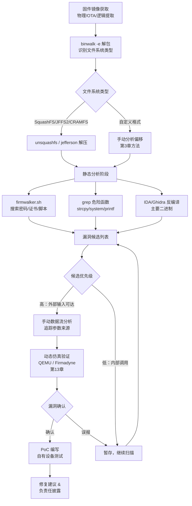

# 固件漏洞分析

## 概述与定位

> [!abstract] TL;DR
> 固件漏洞核心类型：栈溢出（`strcpy`/`sprintf` 无边界检查）、命令注入（`system()` 拼接用户输入）、格式化字符串（`printf(user_input)`）。静态审计（binwalk 解包 → 危险函数交叉引用）结合动态仿真验证，全程防御研究视角。

固件漏洞分析是 IoT 安全研究的核心环节。区别于传统桌面软件，嵌入式固件运行在资源受限的硬件上，通常缺乏现代操作系统提供的安全缓解机制，历史漏洞密度极高。本章聚焦三类最典型的内存安全漏洞（栈溢出、堆溢出、格式化字符串）与命令注入，讲解其成因、逆向识别方法及静态/动态审计流程。

> [!caution] 合规边界与使用约束
> 本章所有内容仅用于**自有设备安全研究、CTF 学习与防御性安全审计**。
>
> - **禁止**：对他人未授权设备实施渗透、利用本章知识构造可落地 0day 链、传播或出售武器化漏洞利用代码。
> - **合规原则**：漏洞研究须遵守《网络安全法》及设备购买协议；向厂商进行负责任披露（Responsible Disclosure）后，等待修复期满再公开技术细节。
> - **PoC 验证**：只在自己拥有的测试设备或经书面授权的实验环境中运行，切勿在生产网络中执行。
>
> 本章的技术描述以「识别成因 → 静态定位 → 理解影响」为主线，**不提供完整武器化利用链**。

### 漏洞类型速查

| 漏洞类型 | 典型成因 | 逆向关键点 |
|---|---|---|
| 栈溢出 | `strcpy`/`gets` 无长度限制 | 找固定栈缓冲区 + 不安全拷贝调用 |
| 命令注入 | `system()` 拼接用户输入 | 交叉引用 `system`/`popen`，追 CGI 参数 |
| 格式化字符串 | `printf(user_input)` 直接传入 | 第一参数来源是否可控 |
| 堆溢出 | `malloc` 后 `memcpy` 不检查长度 | `malloc`/`free` 配对 + 后续拷贝大小 |
| 认证绕过 | 硬编码账号/逻辑缺陷 | 字符串搜索 `admin`/`password` + 比较逻辑 |

---

## IoT 设备为何多漏洞

### 1 系统性根因

**资源受限，缺乏安全缓解**：低端 ARM Cortex-M/MIPS SoC 内存仅数百 KB，芯片厂商的 SDK 工具链版本陈旧，编译时未开启 `-fstack-protector`、`-D_FORTIFY_SOURCE` 等防护；更无 ASLR（地址空间布局随机化）或 NX（不可执行内存，部分 Cortex-A 通过 MMU 支持但未必使能）。

**代码老旧，长期无人维护**：路由器、摄像头固件大量沿用 2005–2012 年的 uClibc、BusyBox 和 openssl 0.9.x，这些版本的已知 CVE 数以百计，而厂商推送更新的速度极慢，甚至设备停产后完全停止维护。

**快速迭代无安全测试**：IoT 硬件生命周期短，软件迭代追求市场速度，安全测试往往缺席或流于形式，"功能可用即出货"是行业常态。

**更新机制缺失或被绕过**：部分设备无 OTA 通道，用户终身使用出厂固件；有 OTA 的设备也存在签名校验缺失（见第12章），更新报文可被中间人劫持。

### 2 漏洞全景分类

```
固件漏洞
├── 内存安全
│   ├── 栈缓冲区溢出（Stack BOF）
│   ├── 堆缓冲区溢出（Heap BOF）
│   ├── 格式化字符串（Format String）
│   └── 整数溢出 → 内存误分配
├── 注入类
│   ├── 命令注入（OS Command Injection）
│   └── SQL/LDAP 注入（嵌入式数据库）
├── 认证与授权
│   ├── 硬编码凭据
│   ├── 认证绕过（逻辑漏洞）
│   └── 会话管理缺陷
└── 更新与供应链
    ├── 不安全 OTA（无签名/弱签名）
    └── 硬编码后门账号
```

---

## 原理与审计流程（Mermaid）



---

## 栈溢出（Stack Buffer Overflow）

### 1 成因

栈溢出发生在程序将外部数据复制进固定大小的栈上缓冲区时未做长度校验。攻击者通过提供超长输入，覆盖相邻的栈帧数据——局部变量、保存的帧指针，乃至返回地址（x86/x64）或链接寄存器保存值（ARM）。

**常见危险函数**：

| 函数 | 危险原因 |
|---|---|
| `strcpy(dst, src)` | 按 `\0` 终止，无长度限制 |
| `strcat(dst, src)` | 追加时不检查剩余空间 |
| `gets(buf)` | 直接读到换行，无任何限制（C11 已删除） |
| `sprintf(buf, fmt, ...)` | 格式化后写入无上界 |
| `recv(fd, buf, len, 0)` | `len` 若来自攻击者则可超出 `buf` |
| `scanf("%s", buf)` | `%s` 匹配到空白为止，无长度限制 |

### 2 危险 vs 安全写法对比

| 危险写法 | 安全替代 |
|---|---|
| `strcpy(buf, input)` | `strncpy(buf, input, sizeof(buf)-1); buf[sizeof(buf)-1]='\0';` 或 `strlcpy` |
| `sprintf(buf, "val=%s", input)` | `snprintf(buf, sizeof(buf), "val=%s", input)` |
| `gets(buf)` | `fgets(buf, sizeof(buf), stdin)` |
| `strcat(dst, src)` | `strncat(dst, src, sizeof(dst)-strlen(dst)-1)` |
| `scanf("%s", buf)` | `scanf("%63s", buf)`（硬编码宽度） |

### 3 代码模式（IDA/Ghidra 识别）

```c
// === 危险模式 1：strcpy 无界拷贝 ===
void handle_login(char *username) {
    char buf[64];          // 固定栈缓冲区
    strcpy(buf, username); // 若 username > 64 字节 → 栈溢出
    // ...
}

// === 危险模式 2：sprintf 格式化溢出 ===
void build_response(char *input) {
    char resp[256];
    sprintf(resp, "HTTP/1.0 200 OK\r\nResult: %s\r\n", input);
    // input 过长 → resp 溢出
}

// === 危险模式 3：recv 后不检查 ===
void read_packet(int sock) {
    char pkt[512];
    int n = recv(sock, pkt, 0x1000, 0); // 接收上限 0x1000 > buf 大小
    process(pkt, n);
}
```

**反汇编特征（ARM Thumb）**：

```asm
; 典型危险模式：栈上分配 + BL strcpy
PUSH    {R4, LR}
SUB     SP, SP, #0x40      ; 分配 64 字节栈空间
MOV     R1, R0             ; src = 用户输入
ADD     R0, SP, #0         ; dst = 栈缓冲区起始
BL      strcpy             ; 无长度限制拷贝 ← 危险
ADD     SP, SP, #0x40
POP     {R4, PC}           ; PC = 保存的 LR，若已被覆盖 → 控制流劫持
```

### 4 嵌入式特殊性

- **无 ASLR**：Cortex-M 裸机和多数 OpenWRT 早期版本无地址随机化，栈地址固定，Shellcode 地址可预测。
- **Cortex-M EXC_RETURN**：M 系列 CPU 不用 `RET` 指令，而是将 LR 设为特殊值（如 `0xFFFFFFF9`）通过异常返回，`POP {PC}` 等效。溢出覆盖栈上保存的 LR 即可劫持。
- **RTOS 任务栈独立**：FreeRTOS 为每个 task 分配独立 TCB 和栈段，溢出通常只影响本任务，但若栈紧邻关键数据结构（如任务句柄链表），仍可扩大影响。
- **Cortex-A（Linux）**：开启 MMU 的 SoC 可配置 NX，但早期 uClibc 编译的 httpd 往往未启用，且内核版本太旧不支持 PIE。

### 5 逆向识别步骤

1. **定位危险函数调用**：IDA 中 `Edit → Find all occurrences` 搜索 `strcpy`/`sprintf`；或 `grep -r "strcpy\|strcat\|sprintf\|gets" ./squashfs-root/usr/sbin/`
2. **检查目标缓冲区大小**：反编译窗口看局部变量声明，注意 `char buf[N]` 中 N 的大小
3. **追踪源参数来源**：向上追溯入参，判断是否经过 CGI 解析（`getenv("QUERY_STRING")`、`cgiGetStr`）或 socket 接收，确认外部可控
4. **验证有无长度校验**：查看 `strcpy` 前是否有 `strlen(src) < sizeof(buf)` 类似检查
5. **交叉引用调用链**：确认该函数是否从 HTTP 处理、SNMP 或 Telnet 等入口可达

---

## 命令注入（OS Command Injection）

### 1 成因

Web 管理后台、CGI 或守护进程在执行系统命令时，将用户可控的参数直接拼接到命令字符串后传给 `system()`/`popen()`，导致攻击者可通过 Shell 特殊字符（`;`、`|`、`` ` ``、`$(...)`）注入额外命令。

### 2 危险 vs 安全写法对比

| 危险写法 | 安全替代 |
|---|---|
| `sprintf(cmd, "ping %s", host); system(cmd)` | 用 `execve()` 传参数数组，完全绕过 Shell |
| `popen(user_cmd, "r")` | 白名单校验输入；仅允许字母/数字/点/连字符 |
| `system("reboot " + param)` | 硬编码命令，不接受外部参数 |
| 字符黑名单过滤 | 白名单正则：`^[0-9]{1,3}(\.[0-9]{1,3}){3}$`（IP 地址） |

### 3 代码模式

```c
// === 危险模式：直接拼接 host 参数到 system() ===
void cgi_ping(void) {
    char *qs = getenv("QUERY_STRING");  // GET 参数字符串
    char host[64];
    cgiGetStr(qs, "host", host, sizeof(host));  // 提取 host 字段

    char cmd[256];
    sprintf(cmd, "ping -c 4 %s", host);  // 直接拼接用户输入
    system(cmd);                          // 执行 Shell 命令 ← 危险
    // 攻击者传入：host = "8.8.8.8; cat /etc/shadow"
    // 实际执行：ping -c 4 8.8.8.8; cat /etc/shadow
}

// === 安全替代：execve 传参数数组，不经过 Shell ===
void safe_ping(const char *host) {
    // 白名单校验：只允许 IP 地址格式
    if (!is_valid_ip(host)) return;

    char *args[] = { "/bin/ping", "-c", "4", (char*)host, NULL };
    execve(args[0], args, NULL);  // 不经过 /bin/sh，无 Shell 注入
}
```

### 4 逆向识别步骤

1. **枚举危险函数**：在 IDA 中查找 `system`、`popen`、`execve`、`doSystem`（厂商封装）的所有交叉引用（`X` 键）
2. **追溯参数来源**：点击 `system` 调用处，查看第一参数的构造路径——是否有 `sprintf`/`snprintf` 拼接外部字符串
3. **定位 CGI 入口**：Web 服务（lighttpd/uhttpd/mini_httpd）一般通过 `cgiGetVar`/`getenv("QUERY_STRING")`/`nvram_get` 获取用户参数；搜索这些函数找入口点
4. **验证过滤机制**：检查是否有字符过滤（`strchr`/`strpbrk` 查找特殊字符）或正则白名单；黑名单过滤通常可绕过
5. **常见危险位置**：`/www/cgi-bin/`、`/usr/sbin/httpd`、`/bin/rc`（配置重载脚本）、固件升级接口

**典型汇编模式**：

```asm
; IDA 示意：识别 sprintf + system 组合
ADD   R0, SP, #cmd_buf    ; R0 = cmd 缓冲区（栈上）
LDR   R1, =aPingC4_fmt    ; R1 = "ping -c 4 %s"
LDR   R2, [SP, #host_off] ; R2 = 用户输入的 host
BL    sprintf              ; 格式化命令字符串
ADD   R0, SP, #cmd_buf    ; 再次取 cmd 地址
BL    system               ; 执行命令 ← 若 host 含 ";" 则注入
```

---

## 格式化字符串漏洞（Format String Vulnerability）

### 1 成因

`printf`/`fprintf`/`syslog` 等函数的第一个参数为格式字符串；当该参数直接由用户输入控制时，攻击者可用 `%x`、`%s`、`%n` 等格式说明符读取栈内存或向任意地址写入数据。

### 2 影响

| 利用方式 | 效果 |
|---|---|
| `%x %x %x %x` | 依次读取栈上数据（信息泄露：地址、canary 值） |
| `%s` | 将栈上某值作为指针解引用，读取指向内存 |
| `%n` | 将已输出字符数写入对应参数指向的地址（任意写） |
| `%100x%n` | 控制写入值的大小（写入值 = 已输出字节数） |

ARM 架构同样支持 `%n`，嵌入式 Linux 的 glibc/uClibc 均实现了该格式符。

### 3 危险 vs 安全写法对比

| 危险写法 | 安全替代 |
|---|---|
| `printf(user_input)` | `printf("%s", user_input)` |
| `fprintf(log, device_name)` | `fprintf(log, "%s", device_name)` |
| `syslog(LOG_INFO, user_msg)` | `syslog(LOG_INFO, "%s", user_msg)` |
| `sprintf(buf, input)` | `snprintf(buf, sizeof(buf), "%s", input)` |

### 4 逆向识别步骤

1. **搜索格式化函数调用**：`grep -r "printf\|fprintf\|syslog\|dprintf\|vprintf"` 或 IDA 交叉引用
2. **检查第一参数**：反编译后确认 `printf(R0, ...)` 中 R0 是否为字面字符串（`"..."` 常量）或来自用户数据
3. **常见危险场景**：设备名/SSID 显示（如 `printf(nvram_get("ssid"))`）、日志输出（`syslog(LOG_ERR, errmsg)`）、Web 界面错误提示
4. **确认外部可控**：SSID 由用户设置 → 格式化字符串可控；日志内容包含网络包载荷 → 同样可控

---

## 认证绕过与硬编码凭据

### 1 硬编码凭据

固件中常出现硬编码的默认账号密码或后门账号，用于生产测试或远程维护：

```bash
# 搜索可能的硬编码凭据（在解包目录中执行）
grep -r "password\|passwd\|secret\|admin\|root" ./squashfs-root/etc/ --include="*.conf"
grep -r "telnet\|ssh\|ftp" ./squashfs-root/etc/init.d/
strings ./squashfs-root/usr/sbin/httpd | grep -E "admin|pass|1234|default"
```

### 2 认证绕过逻辑漏洞

常见模式：

```c
// 危险：字符串比较返回值误判
int check_auth(char *pass) {
    // strcmp 返回 0 表示相等，非零表示不相等
    // 若误写为：if (strcmp(input, stored_pass)) → 非零即通过 → 逻辑反转
    if (strcmp(pass, "secret123")) {  // BUG：应为 !strcmp
        return AUTH_OK;               // 任意非空密码均通过
    }
    return AUTH_FAIL;
}

// 危险：长度不一致时早返回
int memcmp_auth(char *input, char *stored, int len) {
    // 部分实现对长度不匹配直接返回 0（"相等"）
    if (strlen(input) != strlen(stored)) return 0; // BUG：应返回非零（不等）
    return memcmp(input, stored, len);
}
```

---

## 固件安全审计工具与流程

### 1 工具清单

| 工具 | 用途 | 命令示例 |
|---|---|---|
| `binwalk` | 固件解包、格式识别 | `binwalk -e firmware.bin` |
| `firmwalker` | 自动搜索密码/证书/脚本 | `firmwalker.sh ./squashfs-root` |
| `grep` / `ripgrep` | 危险函数枚举 | `rg "system\|strcpy\|sprintf\|printf" ./` |
| `strings` | 提取可打印字符串 | `strings -n 8 httpd \| grep pass` |
| `IDA Pro` / `Ghidra` | 反汇编/反编译 | 加载 ELF，启用 ARM 分析 |
| `radare2` | 命令行逆向 | `r2 -A ./httpd` |
| `checksec` | 检查安全编译选项 | `checksec --file=httpd` |
| `Firmadyne` | 系统级固件仿真 | 见第13章 |
| `AFL++` | 覆盖率引导模糊测试 | `afl-fuzz -i input -o out ./target @@` |
| `FACT` | 固件分析与比对框架 | Web 界面，Docker 部署 |

### 2 分阶段审计流程

**阶段 1：自动化静态扫描**

```bash
# 1. 解包固件
binwalk -e firmware.bin -C ./output

# 2. 自动搜索敏感信息
./firmwalker.sh ./output/_firmware.bin.extracted/squashfs-root

# 3. 枚举危险函数调用
cd ./output/_firmware.bin.extracted/squashfs-root
grep -rn "strcpy\|strcat\|gets\|sprintf\|system\|popen" --include="*.c" .
# 对二进制文件：
find . -type f -executable | xargs -I{} strings {} | grep -E "system|strcpy|popen"

# 4. 检查二进制安全属性
find . -type f -executable | xargs -I{} checksec --file={}
```

**阶段 2：手动漏洞挖掘**

```
1. 识别 Web 服务二进制（httpd/lighttpd/uhttpd）
2. 在 IDA/Ghidra 中加载，启用正确架构（ARM LE/BE/MIPS）
3. 找 CGI 处理函数入口（搜索 "QUERY_STRING"/"REQUEST_METHOD"）
4. 对每个 CGI 入口追踪数据流：
   GET 参数 → cgiGetStr/getenv → 本地变量 → 危险函数
5. 记录候选漏洞：函数名、偏移、输入来源、影响范围
```

**阶段 3：动态验证（自有设备/仿真）**

```bash
# QEMU 用户模式仿真单个二进制
cp $(which qemu-arm-static) ./squashfs-root/
chroot ./squashfs-root qemu-arm-static /usr/sbin/httpd

# 使用 Firmadyne 进行系统级仿真（见第13章）
# AFL 模糊测试 HTTP 解析函数
afl-fuzz -i http_inputs/ -o findings/ -- ./httpd_instrumented @@
```

**阶段 4：CVE 对比与差分**

```bash
# 在 NVD 搜索同型号历史漏洞
# https://nvd.nist.gov/vuln/search → product: "vendor model"

# 下载不同版本固件，差分对比修复内容（见第14章）
bindiff patched_httpd original_httpd
```

### 3 自动化扫描脚本片段

```bash
#!/bin/bash
# 固件危险函数快速枚举（在解包根目录运行）
ROOTFS="$1"
echo "[*] 扫描目标: $ROOTFS"

echo "=== 危险 C 函数调用 ==="
grep -rn "strcpy\|strcat\|gets\b\|sprintf\b\|system\b\|popen\b" \
    "$ROOTFS" --include="*.c" --include="*.h" 2>/dev/null

echo "=== 可执行文件中的字符串特征 ==="
find "$ROOTFS" -type f -executable 2>/dev/null | while read bin; do
    strings "$bin" | grep -E "(password|passwd|admin|backdoor|secret)" \
        | sed "s|^|[$bin] |"
done

echo "=== CGI 脚本中的 system 调用 ==="
grep -rn "system\|popen\|exec" "$ROOTFS/www" "$ROOTFS/cgi-bin" 2>/dev/null
```

---

## 安全性与正确使用

### 1 防御性编译选项

```makefile
# Makefile 示例：启用安全编译选项
CFLAGS += -fstack-protector-strong    # 栈 Canary
CFLAGS += -D_FORTIFY_SOURCE=2         # 缓冲区边界检查
CFLAGS += -Wformat -Wformat-security  # 格式化字符串警告
CFLAGS += -pie -fPIE                  # 位置无关可执行（ASLR 依赖）
LDFLAGS += -Wl,-z,relro,-z,now       # RELRO（GOT 保护）
LDFLAGS += -Wl,-z,noexecstack        # 不可执行栈
```

使用 `checksec --file=./httpd` 验证编译结果：

```
RELRO           STACK CANARY      NX            PIE
Full RELRO      Canary found      NX enabled    PIE enabled
```

### 2 代码审计清单

- [ ] 所有字符串拷贝使用带 `n` 限制的版本（`strncpy`/`strlcpy`/`strncat`）
- [ ] `sprintf` 全部替换为 `snprintf`，长度参数正确计算
- [ ] `printf` 第一参数永远是字面量格式字符串，不直接传入用户数据
- [ ] `system`/`popen` 调用前对输入做白名单校验或改用 `execve`
- [ ] 整数运算传入 `malloc`/`memcpy` 前检查上溢
- [ ] 敏感凭据不出现在固件字符串中（使用 `strings` + `grep` 验证）

### 3 负责任披露流程

```
发现漏洞 → 在自有设备验证 → 撰写漏洞报告
    → 联系厂商安全响应团队（PSIRT）
    → 等待 90 天修复期（业界标准）
    → 厂商发布补丁后协调公开披露
    → CVE 申请（MITRE/CNA）
```

> [!tip] 推荐披露渠道
> - 厂商 security@vendor.com 或官方 Bug Bounty 平台
> - CNCERT/CC（国家互联网应急中心）：cncert.org.cn
> - CNVD（国家信息安全漏洞共享平台）：cnvd.org.cn

---

## 小结

本章系统梳理了 IoT 固件漏洞的根因与三大典型类别：

- **栈溢出**：因无界字符串操作（`strcpy`/`sprintf`/`gets`）覆盖返回地址，逆向时重点追踪固定栈缓冲区后的不安全拷贝函数。
- **命令注入**：`system()` 拼接用户参数最为常见，逆向从 `system`/`popen` 交叉引用出发向上追溯 CGI 入口。
- **格式化字符串**：`printf(user_data)` 导致信息泄露乃至任意写，识别关键在于格式函数第一参数的来源。

审计流程遵循「自动化扫描枚举候选 → 手动数据流分析确认 → 动态仿真验证」的三阶段闭环。安全编译选项（栈 Canary、NX、PIE、RELRO）是防御侧的第一道防线，但在老旧 IoT 固件中普遍缺失，这也是该生态漏洞密度居高不下的根本原因。

---

## 相关阅读

- [[33.二进制漏洞与利用基础/02.栈溢出基础]]
- [[33.二进制漏洞与利用基础/00.二进制漏洞与利用基础总览]]
- [[39.固件与IoT嵌入式逆向/03.固件解包与文件系统]] — 解包方法详解
- [[39.固件与IoT嵌入式逆向/08.RTOS逆向：FreeRTOS与VxWorks与ThreadX]] — RTOS 栈结构背景
- [[39.固件与IoT嵌入式逆向/13.固件仿真：QEMU与Firmadyne]] — 动态验证环境搭建
- [[39.固件与IoT嵌入式逆向/14.固件差分与补丁分析]] — CVE 对比方法

---

⬅️ 上一篇 [[10.硬件调试接口：JTAG与SWD与UART]] ｜ 🏠 [[00.固件与IoT嵌入式逆向总览]] ｜ 下一篇 [[12.TrustZone与OP-TEE安全世界逆向]] ➡️
