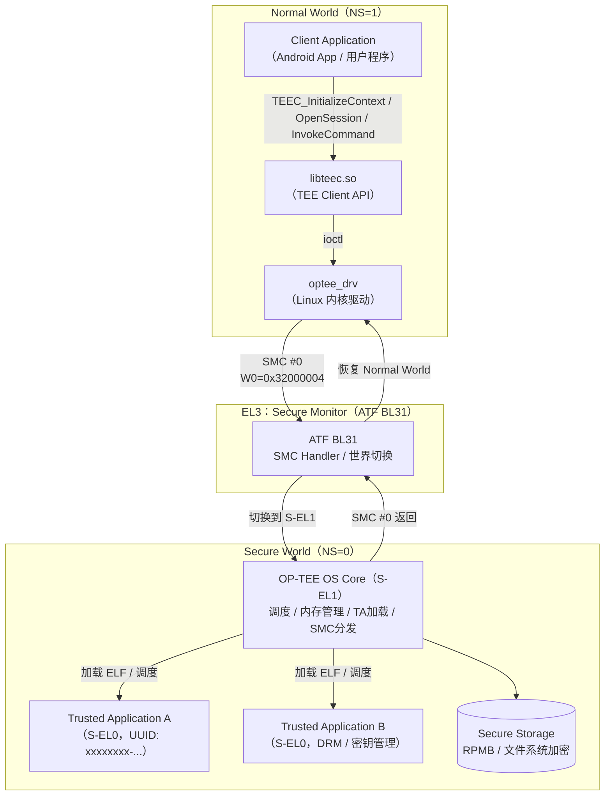

# 第12章 · TrustZone 与 OP-TEE 安全世界逆向

## 1. 概述与定位

> [!abstract] TL;DR
> ARMv8-A TrustZone 将处理器划分为 Normal World（EL0/EL1）和 Secure World（S-EL0/S-EL1），EL3 Secure Monitor 通过 `SMC` 指令切换；OP-TEE 是开源 Trusted OS，CA（Normal World）通过 `TEEC_InvokeCommand` 调用 TA（Secure World），每个 TA 有唯一 UUID，逆向入口为 `TA_InvokeCommandEntryPoint`。

ARM TrustZone 是 ARMv8-A（以及部分 ARMv7-A/M）处理器的硬件安全扩展，通过将系统分为 **Normal World**（非安全世界）和 **Secure World**（安全世界）两个完全隔离的执行环境，为可信执行环境（TEE，Trusted Execution Environment）提供硬件基础。OP-TEE 是运行在 Secure World 的开源 TEE OS，由 Linaro 维护，广泛部署于移动端（Android 生态）、IoT 网关、Automotive 等场景，负责密钥保护、DRM、安全支付、设备认证等高价值功能。

从固件逆向的角度，理解 TrustZone/OP-TEE 架构意味着：
- 能够定位并分析 Trusted Application（TA）的业务逻辑
- 理解 Normal World ↔ Secure World 的数据流与安全边界
- 发现 TA 实现层面的逻辑漏洞（输入验证、TOCTOU、密钥暴露）

> [!caution]
> **防御与分析视角声明**
> 本章所有技术内容均面向**安全研究、固件审计、防御加固**，遵循"理解以防御"原则。TrustZone 保护的往往是 DRM 密钥、支付凭证、设备身份根证书等高价值资产。**本章不提供绕过 TrustZone 硬件隔离的武器化利用步骤**，不讨论如何在未授权设备上提取 Secure World 密钥或绕过安全启动链。任何针对生产设备的安全研究应在合法授权、负责任披露框架下进行。

### 本章定位

| 前置章节 | 关联内容 |
|----------|----------|
| [[06.Bootloader逆向：U-Boot与ATF]] | ATF BL31 即 EL3 Secure Monitor，是 TrustZone 的守门人 |
| [[38.Windows内核与驱动逆向/00.Windows内核与驱动逆向总览]] | 对比 Windows VBS/VSM 安全隔离机制 |

---

## 2. ARMv8-A TrustZone 原理与架构

### 2.1 双世界隔离模型

ARMv8-A 定义了四个异常级别（Exception Level，EL0–EL3），TrustZone 在此基础上引入 **安全状态位（Secure State）**，使每个 EL 都可以在安全或非安全两种状态下运行（EL3 始终为安全状态）：

```
Normal World（NS=1）          Secure World（NS=0）
─────────────────────         ────────────────────
EL0  用户态（Android App）    S-EL0  Trusted Application
EL1  OS 内核（Linux/Android） S-EL1  Trusted OS（OP-TEE Core）
EL2  Hypervisor（可选）       ─（EL2 在安全世界 ARMv8.4 起可用）
─────────────────────         ────────────────────
         EL3（Secure Monitor / ATF BL31）——始终为安全状态
```

**关键隔离点**：
- **NS 位**：AXI 总线事务携带 NS 标志；TZASC 根据 NS 位决定内存访问权限
- **Secure World 可访问所有物理内存**；Normal World 访问被 TZASC 标记为 Secure 的内存区域，会触发 AXI 总线级错误（外设级隔离类似，由 TZPC 控制）
- **寄存器组独立**：两个世界各有独立的寄存器 banked 副本（部分寄存器），上下文切换由 EL3 负责保存/恢复

### 2.2 TZASC：内存安全划分

TZASC（TrustZone Address Space Controller）是一个 AXI 总线中间件，接收来自各 Master（CPU、DMA 等）的内存访问请求：

| TZASC 区域类型 | Normal World 访问 | Secure World 访问 |
|---------------|------------------|------------------|
| Non-Secure    | 允许              | 允许              |
| Secure        | 拒绝（AXI 错误）  | 允许              |
| Mixed（分页）  | 按页属性          | 允许              |

OP-TEE 在启动时（通过 ATF BL31 → BL32）配置 TZASC，将 Secure World 的代码/数据内存（通常为 32–64 MB 的固定区域）划定为 Secure 区域，之后 Normal World 无法读写这块内存，即使是 root 权限的 Linux 内核也不行。

### 2.3 EL3 与 SMC 调用机制

**EL3（Secure Monitor）**是两个世界的仲裁者和切换执行者，由 ARM Trusted Firmware（ATF）的 BL31 组件承担。`SMC`（Secure Monitor Call）指令是 Normal World 进入 EL3 的唯一合法途径：

**SMC 调用流程**：

1. Normal World EL1（Linux 内核驱动 `optee_drv`）将功能号写入 `W0`/`X0`，参数写入 `X1–X7`，执行 `SMC #0`
2. CPU 陷入 EL3（ATF BL31 的 SMC 处理向量）
3. BL31 检查 `W0` 功能号范围：
   - `0x84000000–0x8400001F`：PSCI（电源管理），BL31 直接处理，返回 Normal World
   - `0x32000000–0x3200FFFF`（OP-TEE 功能范围）：切换到 Secure World，跳转 OP-TEE 入口
   - 其他厂商自定义范围：由各 SiP Service Handler 处理
4. OP-TEE（S-EL1）接管，分发到对应的 TA 或内部服务
5. OP-TEE 处理完毕，执行 `SMC #0` 返回 EL3
6. BL31 保存 Secure World 上下文，恢复 Normal World 上下文，返回 EL1

**SMC 功能号分发表（OP-TEE 范围，部分）**：

| 功能号（W0） | 含义 | 方向 |
|-------------|------|------|
| `0x32000001` | `OPTEE_SMC_CALLS_COUNT` | NW → SW |
| `0x32000002` | `OPTEE_SMC_GET_CAPABILITIES` | NW → SW |
| `0x32000004` | `OPTEE_SMC_CALL_WITH_ARG` | NW → SW（主调用入口） |
| `0x32000005` | `OPTEE_SMC_GET_SHM_CONFIG` | NW → SW（获取共享内存配置） |
| `0xB2000000` | `OPTEE_SMC_CALL_TRUSTED_OS_UID` | NW → SW（获取 TEE UUID）|
| `0xFF000000` | Secure World 返回到 Normal World | SW → NW（切换信号）|

> **逆向提示**：在 Normal World 内核驱动（`/drivers/tee/optee/`）中搜索 `SMC` 调用点，可以找到 `optee_smccc_smc()` 和功能号宏定义，理解所有合法入口。

---

## 3. OP-TEE 架构详解

### 3.1 整体架构 Mermaid 图



### 3.2 TEE Client API（CA 侧）

CA（Client Application）通过 GlobalPlatform TEE Client API 与 OP-TEE 交互，核心函数链：

```c
// 1. 初始化 TEE 上下文（打开 /dev/tee0）
TEEC_Result TEEC_InitializeContext(const char *name, TEEC_Context *context);

// 2. 打开到指定 TA 的会话（通过 UUID 定位 TA）
TEEC_Result TEEC_OpenSession(
    TEEC_Context       *context,
    TEEC_Session       *session,
    const TEEC_UUID    *destination,   // TA 的 UUID
    uint32_t            connectionMethod,
    const void         *connectionData,
    TEEC_Operation     *operation,     // 可选初始参数
    uint32_t           *returnOrigin
);

// 3. 向 TA 发送命令
TEEC_Result TEEC_InvokeCommand(
    TEEC_Session       *session,
    uint32_t            commandID,     // TA 自定义命令号
    TEEC_Operation     *operation,     // 入参/出参
    uint32_t           *returnOrigin
);

// 4. 关闭会话 / 销毁上下文
void TEEC_CloseSession(TEEC_Session *session);
void TEEC_FinalizeContext(TEEC_Context *context);
```

**定位 CA 代码的方法**：在 Normal World 固件文件系统中，`grep -r "TEEC_InvokeCommand\|libteec\|/dev/tee"` 可快速找到所有调用 TEE 的用户态程序，进而确定系统使用了哪些 TA UUID 及命令号。

### 3.3 TEEC_Operation 参数类型

每次 `TEEC_InvokeCommand` 可携带最多 4 个参数（`params[0..3]`），每个参数的类型由 `paramTypes` 字段的 nibble 指定：

| 参数类型常量 | 值 | 说明 |
|------------|----|----- |
| `TEEC_NONE` | `0x0` | 此参数槽不使用 |
| `TEEC_VALUE_INPUT` | `0x1` | 两个 32 位值 `a/b`，NW→SW |
| `TEEC_VALUE_OUTPUT` | `0x2` | 两个 32 位值 `a/b`，SW→NW |
| `TEEC_VALUE_INOUT` | `0x3` | 双向 |
| `TEEC_MEMREF_TEMP_INPUT` | `0x5` | 临时内存缓冲区，NW→SW（只读） |
| `TEEC_MEMREF_TEMP_OUTPUT` | `0x6` | 临时内存缓冲区，SW→NW（输出） |
| `TEEC_MEMREF_TEMP_INOUT` | `0x7` | 双向临时缓冲区 |
| `TEEC_MEMREF_WHOLE` | `0xC` | 整个已注册共享内存块 |
| `TEEC_MEMREF_PARTIAL_INPUT` | `0xD` | 共享内存的部分区域，NW→SW |
| `TEEC_MEMREF_PARTIAL_OUTPUT` | `0xE` | 共享内存的部分区域，SW→NW |
| `TEEC_MEMREF_PARTIAL_INOUT` | `0xF` | 双向部分共享内存 |

**paramTypes 编码**：`TEEC_PARAM_TYPES(p0, p1, p2, p3)` 宏将四个 nibble 打包为一个 `uint32_t`：
```c
// 示例：param[0]=VALUE_INPUT，param[1]=MEMREF_TEMP_OUTPUT，其余 NONE
uint32_t pt = TEEC_PARAM_TYPES(
    TEEC_VALUE_INPUT,
    TEEC_MEMREF_TEMP_OUTPUT,
    TEEC_NONE,
    TEEC_NONE
);  // = 0x00000061
```

### 3.4 OP-TEE OS Core（TEE Core）

OP-TEE OS 运行于 S-EL1，是 Secure World 的操作系统内核，负责：

- **SMC 分发**：接收来自 EL3 转发的 SMC 请求，判断是会话管理请求还是命令请求
- **TA 生命周期管理**：加载/验证/卸载 TA ELF；每个 TA 运行在独立的 S-EL0 进程（类似 Linux 用户态进程，有独立虚拟地址空间）
- **共享内存管理**：在 Normal World 和 Secure World 之间建立安全的共享缓冲区（基于 TZASC 配置的特定内存窗口）
- **Secure Storage**：通过 RPMB（Replay Protected Memory Block）或加密文件系统为 TA 提供持久化安全存储

### 3.5 Trusted Application（TA）

TA 是实际执行安全业务逻辑的 S-EL0 用户态程序：

- **文件格式**：AArch64（或 AArch32）ELF，通常以 `<UUID>.ta` 命名
- **存储位置**：
  - `/lib/optee_armtz/<UUID>.ta`（只读文件系统，厂商预装）
  - `/data/tee/<UUID>.ta`（可更新区域，OTA 更新）
- **签名验证**：OP-TEE OS 加载 TA 时验证签名（RSA 或 ECDSA），防止恶意 TA 注入；签名密钥由设备制造商持有

**TA 入口函数（GlobalPlatform 规定，必须导出）**：

| 函数名 | 调用时机 | 说明 |
|--------|---------|------|
| `TA_CreateEntryPoint` | `TEEC_OpenSession` | TA 第一次被加载时调用，初始化全局状态 |
| `TA_OpenSessionEntryPoint` | `TEEC_OpenSession` | 每次新会话建立时调用 |
| `TA_InvokeCommandEntryPoint` | `TEEC_InvokeCommand` | 每次命令调用，`cmd_id` 决定执行路径 |
| `TA_CloseSessionEntryPoint` | `TEEC_CloseSession` | 会话关闭时清理 |
| `TA_DestroyEntryPoint` | TA 被卸载 | 全局清理 |

---

## 4. TA 逆向分析实战

### 4.1 获取 TA 文件

**从固件文件系统提取**：
```bash
# 解包固件（参考第03章 binwalk 工具）
binwalk -e firmware.img

# 搜索 .ta 文件（UUID 格式命名）
find . -name "*.ta" -type f
# 示例输出：
# ./lib/optee_armtz/8aaaf200-2450-11e4-abe2-0002a5d5c51b.ta  （PKCS#11 TA）
# ./lib/optee_armtz/023f8f1a-292a-432b-8fc4-de8471358067.ta  （自定义 DRM TA）

# 确认文件类型
file 8aaaf200-2450-11e4-abe2-0002a5d5c51b.ta
# ELF 64-bit LSB shared object, ARM aarch64, dynamically linked
```

**从运行中系统提取（需 root）**：
```bash
# ADB 拉取（Android 设备）
adb shell "ls /lib/optee_armtz/"
adb pull /lib/optee_armtz/

# 注意：/data/tee/ 下可能有用户安装的 TA，需 root 权限
adb shell su -c "ls /data/tee/"
```

### 4.2 IDA Pro 逆向 TA

**步骤一：加载 ELF**

1. 打开 IDA Pro，选择 `AArch64 ELF`（64位）或 `ARM ELF`（32位）
2. TA 通常已 strip（去除调试符号），但 GlobalPlatform 规定的 4 个入口函数必须以导出符号形式保留
3. `File → Load file → ELF for ARM64`，IDA 自动识别导出函数

**步骤二：定位关键入口**

在 `Functions` 窗口或 `Exports` 窗口找到：
- `TA_InvokeCommandEntryPoint`：**核心逆向入口**，所有业务逻辑从这里展开
- `TA_CreateEntryPoint`：初始化逻辑，关注密钥加载、全局状态建立

**步骤三：分析命令分发逻辑**

`TA_InvokeCommandEntryPoint(uint32_t cmd_id, TEE_Param params[4])` 的典型结构：

```c
// 典型反编译结果（Ghidra/IDA 输出示意）
TEE_Result TA_InvokeCommandEntryPoint(
    void *sess_ctx, uint32_t cmd_id,
    uint32_t param_types, TEE_Param params[4])
{
    switch (cmd_id) {
    case 0x00:  // CMD_GENERATE_KEY
        return cmd_generate_key(param_types, params);
    case 0x01:  // CMD_ENCRYPT
        return cmd_encrypt(param_types, params);
    case 0x02:  // CMD_DECRYPT
        return cmd_decrypt(param_types, params);
    case 0x10:  // CMD_GET_DEVICE_ID
        return cmd_get_device_id(param_types, params);
    default:
        return TEE_ERROR_BAD_PARAMETERS;
    }
}
```

**步骤四：识别 TEE Internal Core API 调用**

TA 通过 GlobalPlatform TEE Internal Core API 与 OP-TEE OS 交互，这些函数名在 IDA 中通常显示为导入符号：

| API 函数 | 功能 | 逆向关注点 |
|---------|------|-----------|
| `TEE_GenerateKey` | 生成密钥对象 | 密钥算法/长度/属性 |
| `TEE_CipherInit` | 初始化对称加密 | 算法（AES-CBC/CTR/GCM）、IV 来源 |
| `TEE_CipherDoFinal` | 执行加解密 | 输入输出缓冲区大小验证 |
| `TEE_AEInit` | 初始化认证加密 | AAD 处理、Tag 长度 |
| `TEE_AsymmetricSignDigest` | RSA/ECDSA 签名 | 私钥句柄来源 |
| `TEE_CreatePersistentObject` | 写入 Secure Storage | 存储ID、访问权限 |
| `TEE_OpenPersistentObject` | 读取 Secure Storage | 读取的对象类型 |
| `TEE_GetREETime` / `TEE_GetSystemTime` | 获取时间 | 时间戳用于什么逻辑 |
| `TEE_MemCompare` | 安全内存比较 | 是否为常数时间比较（防时序攻击）|
| `TEE_Panic` | TA 崩溃 | 追踪 panic 路径了解错误处理 |

**步骤五：Ghidra 补充分析**

对于复杂 TA，可结合 Ghidra 的数据流分析：
```bash
# 使用 Ghidra headless 批量分析
analyzeHeadless /tmp/ghidra_proj TrustZone \
    -import 8aaaf200-2450-11e4-abe2-0002a5d5c51b.ta \
    -processor AARCH64 \
    -postScript ExportFunction.java "TA_InvokeCommandEntryPoint"
```

### 4.3 识别已知 TA UUID

ARM/Linaro 维护了公开的标准 TA UUID 列表：

| UUID | TA 功能 |
|------|--------|
| `8aaaf200-2450-11e4-abe2-0002a5d5c51b` | PKCS#11（密钥管理） |
| `484d4143-2dca-4ad9-acbe-0f81285cb5d8` | HMAC-Based OTP |
| `b3091a65-9505-a7c4-ce5e-df9b5e679bfc` | AVB（Android Verified Boot） |
| `023f8f1a-292a-432b-8fc4-de8471358067` | 厂商 DRM（示例，各厂商自定义）|

发现未知 UUID 时，可以：
1. 在 CA 代码（`libteec` 调用处）搜索该 UUID 字符串，了解 CA 期望的功能
2. 逆向 TA 的 `TA_InvokeCommandEntryPoint` 命令表，重建功能清单
3. 搜索固件中的字符串（`strings <UUID>.ta`），获取调试日志和错误信息

---

## 5. 安全边界分析（防御视角）

### 5.1 CA↔TA 数据流威胁模型

Normal World 对 Secure World 而言是**不可信的输入来源**。即使 CA 是系统 App，也可能被恶意代码替换或注入。TA 必须对所有来自 Normal World 的数据持怀疑态度：

```
[恶意 CA / 被攻陷的 CA]
        |
        | TEEC_InvokeCommand(cmd=0x01, params=[大缓冲区/越界长度/恶意指针])
        v
[OP-TEE 共享内存区域]
        |
        | TA 读取参数
        v
[TA 内部处理]  ← 必须验证：长度边界/类型匹配/值范围
```

**常见 TA 实现缺陷（审计检查点）**：

| 缺陷类型 | 表现 | 审计方法 |
|---------|------|---------|
| **整数溢出导致堆溢出** | `memcpy(buf, input, size)` 未检查 `size` 上界 | 追踪所有 `MEMREF_INPUT.size` 的使用路径 |
| **TOCTOU（Time-of-Check-to-Time-of-Use）** | TA 检查共享内存值后，Normal World 修改该值，TA 再次读取 | 检查 TA 是否在验证后立即将数据复制到 Secure 内存 |
| **命令号越界** | `switch(cmd)` 无 `default` 分支，或 `cmd` 用于数组索引 | 检查 `TA_InvokeCommandEntryPoint` 的 `cmd_id` 验证 |
| **参数类型验证缺失** | CA 传入 `VALUE_INPUT` 但 TA 按 `MEMREF` 处理 | 检查 `paramTypes` 的 nibble 验证逻辑 |
| **密钥泄漏到共享内存** | `TEE_GetOperationInfo` 结果或密钥材料写入 Normal World 可读缓冲区 | 审计所有写 `MEMREF_OUTPUT` 的路径 |
| **弱随机数** | 使用 `TEE_GetREETime` 作为随机种子（REE 时间不可信） | 应使用 `TEE_GenerateRandom`（硬件 TRNG）|

### 5.2 TOCTOU 详解

TOCTOU 是 TA 安全中最常见的设计缺陷之一：

```c
// 有漏洞的 TA 代码（示意）
TEE_Result cmd_process(uint32_t pt, TEE_Param params[4]) {
    uint8_t *nw_buf = params[0].memref.buffer;  // Normal World 内存指针
    size_t   nw_len = params[0].memref.size;

    // 检查（Check）
    if (nw_len > MAX_SIZE) return TEE_ERROR_BAD_PARAMETERS;

    // ← 此处 Normal World 可修改 nw_buf[0..nw_len] 的内容
    //   或者修改 nw_len 本身（如果是 INOUT 参数）

    // 使用（Use）—— 使用的已是被篡改的数据
    TEE_MemMove(secure_buf, nw_buf, nw_len);
}

// 正确的 TA 代码（防御）
TEE_Result cmd_process_safe(uint32_t pt, TEE_Param params[4]) {
    uint8_t *nw_buf = params[0].memref.buffer;
    size_t   nw_len = params[0].memref.size;

    if (nw_len > MAX_SIZE) return TEE_ERROR_BAD_PARAMETERS;

    // 立即复制到 Secure 内存，之后只使用 secure_copy
    uint8_t secure_copy[MAX_SIZE];
    TEE_MemMove(secure_copy, nw_buf, nw_len);

    // 所有后续操作使用 secure_copy，不再访问 nw_buf
    process_data(secure_copy, nw_len);
}
```

### 5.3 Secure Storage 安全性

OP-TEE 提供两种 Secure Storage 实现：

| 存储类型 | 底层介质 | 保护机制 | 防重放 |
|---------|---------|---------|--------|
| `TEE_STORAGE_PRIVATE_REE` | Normal World 文件系统（`/data/tee/`）| OP-TEE 对象加密（AES-GCM）+ HMAC | 有限（依赖 Normal World FS 诚实性） |
| `TEE_STORAGE_PRIVATE_RPMB` | eMMC RPMB 分区 | 同上 + RPMB 硬件防重放计数器 | 强（硬件级防重放） |

**逆向关注点**：通过 `TEE_CreatePersistentObject` / `TEE_OpenPersistentObject` 的 `storageID` 参数，可以判断设备对防重放的重视程度。使用 `TEE_STORAGE_PRIVATE_REE` 的高安全性应用存在潜在的重放风险（Normal World 可以替换加密文件，但不能解密——这是完整性保护，不是重放保护）。

### 5.4 TA 验证机制（正确使用 TrustZone 的基础）

OP-TEE 在加载 TA 时执行签名验证：

```
TA 文件结构（.ta ELF）
├── ELF Header + Program Segments（TA 代码/数据）
└── TA_SHDR_BOOTSTRAP_TA 签名段
    ├── Magic: 0x4f545348 ("OTSH")
    ├── img_type: TA_BINARY_TYPE
    ├── algo: TEE_ALG_RSASSA_PKCS1_V1_5_SHA256
    ├── hash_size: 32
    ├── sig_size: 256
    └── signature[256]: RSA-2048 签名（对 ELF 内容的哈希）
```

验证失败（签名不匹配）时，`TA_InvokeCommandEntryPoint` 永远不会被调用，OP-TEE OS 直接拒绝加载并返回 `TEE_ERROR_SECURITY`。

---

## 6. 工具链与实战资源

### 6.1 常用工具

| 工具 | 用途 | 获取 |
|------|------|------|
| IDA Pro（AArch64） | TA ELF 静态分析 | 商业 |
| Ghidra | 开源替代，支持 AArch64 | NSA 开源 |
| `readelf -a <ta>` | 查看 ELF 结构、导出符号、节头 | binutils |
| `strings <ta>` | 提取字符串常量（日志/错误信息）| binutils |
| `objdump -d <ta>` | 反汇编（快速验证） | binutils |
| OP-TEE optee_client | 包含 `libteec` 头文件，辅助理解 API | GitHub/linaro-swg |
| tee-supplicant | Normal World 守护进程，负责 TA 文件加载 | OP-TEE 源码 |
| qemu-aarch64 + OP-TEE | 搭建本地 OP-TEE 测试环境 | OP-TEE 官方 QEMU 支持 |

### 6.2 搭建 OP-TEE 分析环境（QEMU）

在没有真实设备的情况下，可以用官方 QEMU 方案：

```bash
# 克隆 OP-TEE 的 manifest
mkdir optee && cd optee
repo init -u https://github.com/OP-TEE/manifest.git -m qemu_v8.xml
repo sync -j4

# 构建（需要 AArch64 交叉编译工具链）
cd build
make toolchains -j4
make -j4

# 运行 QEMU（会启动包含 ATF + OP-TEE + Linux 的完整系统）
make run-only

# 在 Normal World shell 中测试
xtest                     # 运行 OP-TEE 官方测试套件
xtest -t regression       # 回归测试
```

此环境可用于：理解 SMC 调用流程、测试自己编写的 TA、分析 OP-TEE OS 源码与运行行为的对应关系。

---

---

## 安全性与正确使用

> [!caution] 合规边界
> TrustZone/OP-TEE 逆向分析用于**自有设备安全研究、防御验证、合规审计**；不提供绕过 TrustZone 安全隔离的武器化利用步骤；不针对他人设备。固件逆向研究须符合当地法律法规及设备授权条款。

### 防御视角

- **输入验证**：TA 必须验证 Normal World 传入的所有参数（不信任 CA 侧数据）
- **安全存储**：密钥仅通过 `TEE_CreatePersistentObject` 存入 Secure Storage，不写入 Normal World 可读区域
- **TOCTOU 防范**：TA 读取共享内存参数后立即复制到 Secure 内存，避免被 Normal World 并发修改
- **TA 签名验证**：OP-TEE 加载 TA 时验证签名（ta-sign-key），防止恶意 TA 注入
- **最小权限**：TA 只申请必要的 TEE API 权限，避免过度授权

## 7. 小结

本章梳理了 TrustZone/OP-TEE 的完整架构与逆向分析方法：

**架构层面**：
- TrustZone 通过硬件 NS 位将系统分为 Normal World（EL0/EL1/EL2）和 Secure World（S-EL0/S-EL1/EL3），由 ATF BL31 在 EL3 充当 Secure Monitor
- TZASC 在内存总线层面强制隔离，Secure World 数据对 Normal World 物理不可见
- SMC 指令是两个世界通信的唯一合法通道，功能号决定调用路由

**OP-TEE 层面**：
- OP-TEE OS（S-EL1）管理 TA 生命周期；TA（S-EL0）是实际执行安全逻辑的 AArch64 ELF
- GlobalPlatform API 规范了 CA↔TA 的接口（TEEC_Operation 四参数结构）
- Secure Storage（RPMB）提供防重放的持久化密钥存储

**逆向分析层面**：
- 从固件文件系统提取 `/lib/optee_armtz/*.ta`，用 IDA/Ghidra 加载 AArch64 ELF
- 以 `TA_InvokeCommandEntryPoint` 为入口，分析 `cmd_id` 分发表重建功能清单
- 识别 `TEE_*` API 调用，理解密钥算法、存储方式、加密模式
- 安全审计重点：输入验证、TOCTOU 防护、参数类型检查、Secure Storage 类型选择

**防御关键点**：TA 必须将所有 Normal World 输入视为不可信；TOCTOU 防护的核心是"验证后立即复制到 Secure 内存"；高安全场景应使用 RPMB 而非 REE 文件系统存储密钥。

---

## 8. 相关阅读

- **系列内部**：[[06.Bootloader逆向：U-Boot与ATF]]（ATF BL31 完整生命周期）、[[11.固件漏洞分析]]（TA 漏洞挖掘方法论）、[[13.固件仿真：QEMU与Firmadyne与Avatar2]]（OP-TEE QEMU 仿真）
- **跨系列对比**：[[38.Windows内核与驱动逆向/00.Windows内核与驱动逆向总览]]（VBS/VSM 与 TrustZone 对比）
- **标准规范**：GlobalPlatform TEE Client API Specification v1.0；GlobalPlatform TEE Internal Core API Specification v1.3.1
- **开源参考**：OP-TEE OS 源码（`github.com/OP-TEE/optee_os`）；ARM Trusted Firmware 源码（`github.com/ARM-software/arm-trusted-firmware`）

---

⬅️ 上一篇 [[11.固件漏洞分析]] ｜ 🏠 [[00.固件与IoT嵌入式逆向总览]] ｜ 下一篇 [[13.固件仿真：QEMU与Firmadyne与Avatar2]] ➡️
