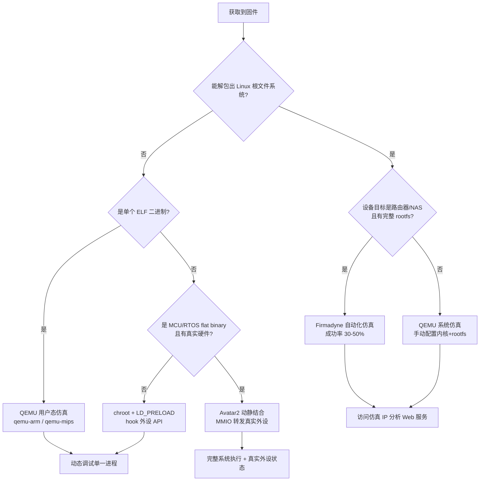

## 概述与定位

> [!abstract] TL;DR
> 固件仿真让安全研究员无需物理硬件即可动态分析 IoT 设备固件：在 x86 主机上跑起路由器的 MIPS httpd、调试 Cortex-M 闪存控制器、对 NAS 做模糊测试。本章系统覆盖三条主路径——**QEMU**（灵活的通用虚拟机，系统仿真 + 用户态仿真两种模式）、**Firmadyne**（针对 Linux 路由器固件的全自动仿真流水线）、**Avatar2**（动静结合框架，将 QEMU 执行与真实硬件外设转发打通）——并给出 chroot 快速法与工具选型对比表。

固件仿真（Firmware Emulation）是 IoT 安全研究中的关键加速器。真实路由器、NAS、IP 摄像头往往数量有限且重启耗时，而一次固件更新可能引入十几处新的攻击面，批量测试不借助仿真几乎不可能完成。从**逆向分析**视角，仿真环境提供：

- **动态行为观测**：运行时内存布局、实际调用路径、真实的 NVRAM 配置读取逻辑
- **GDB 远程调试**：QEMU 内建 gdbserver，可对内核或用户进程下断点，单步跟踪
- **模糊测试集成**：AFL++/LibFuzzer 可以对仿真中的网络服务发包，无需触碰真机
- **漏洞验证**：概念验证（PoC）在仿真环境中跑通后再确认是否在真机复现

---

## 仿真挑战：为什么 IoT 固件难仿真

IoT 固件并不是标准的 Linux 发行版，仿真面临多层障碍：

### 外设依赖

路由器固件通常调用厂商私有驱动读取 GPIO 状态（网口 LED、按钮）、访问以太网交换芯片（如 Broadcom BCM 系列）、与 DSL 调制解调器芯片通信。QEMU 不带这些外设模型，调用时要么崩溃要么挂起。

### NVRAM 初始化

大量 IoT 设备使用 NVRAM（Non-Volatile RAM，通常是一块 MTD 分区或闪存区域）存储网络配置（LAN IP、WAN 模式、密码哈希）。路由器 httpd 启动时第一步往往是调用 `nvram_get("lan_ipaddr")` 获取本机 IP，若该函数返回空或崩溃，整个 Web 服务就无法正常初始化。

### 网络接口

仿真环境中需要建立 TAP/TUN 或 bridge 接口，让仿真的路由器 httpd 能通过虚拟网络接受 HTTP 请求，而不是只能访问 localhost。

### 基址重定位

部分固件不是标准 ELF，而是 flat binary（纯二进制 blob），没有 ELF 头，运行时依赖特定加载基址。QEMU 系统仿真需要手动确定正确的加载地址，否则全部相对寻址计算错误。

---

## 原理与机制

### 固件仿真决策树



### QEMU 两种仿真模式对比

QEMU 提供两种完全不同的仿真层次，理解二者的边界是选型的关键：

| 模式 | 命令前缀 | 仿真范围 | 使用场景 |
|------|----------|----------|----------|
| **系统仿真**（System Mode） | `qemu-system-*` | 完整虚拟机：CPU + 内存 + 外设 + 内核 | 运行完整 Linux 固件，分析内核行为 |
| **用户态仿真**（User Mode） | `qemu-arm / qemu-mips` 等 | 仅翻译用户态指令，系统调用转发到宿主内核 | 快速运行单个 ELF，测试 httpd/cgi 行为 |

---

## QEMU 系统仿真

### 基础使用

QEMU 系统仿真的三要素：**机器类型**（`-M`）、**内核**（`-kernel`）、**根文件系统**（`-drive`）。

**MIPS EL Linux 路由器固件（典型 Netgear/D-Link 类）：**

```bash
# ARM 系统仿真（MIPS EL Linux 路由器固件）
qemu-system-mipsel -M malta -kernel vmlinux \
  -drive file=rootfs.ext2,format=raw \
  -append "rootwait root=/dev/hda" \
  -nographic
```

> [!warning] 内核与机器型号必须匹配
> `-M malta` 对应 MIPS Malta 开发板，适合通用 MIPS Linux 内核。若使用厂商原版内核（如 Broadcom 定制内核），机器型号需调整或使用 Firmadyne 预编译内核。MIPSEL（小端）与 MIPSEB（大端）命令不同：小端用 `qemu-system-mipsel`，大端用 `qemu-system-mips`。

**ARM Cortex-A 仿真（带 DTB 设备树）：**

```bash
# ARM Cortex-A 仿真（带 DTB）
qemu-system-arm -M virt -cpu cortex-a15 \
  -kernel zImage -dtb virt.dtb \
  -drive file=rootfs.img,format=raw,if=virtio \
  -append "root=/dev/vda console=ttyAMA0" \
  -nographic
```

`-M virt` 是 QEMU 内置的通用 ARM 虚拟机，支持 GICv2/GICv3 中断控制器和 VirtIO 设备，适合运行上游 ARM Linux 内核。`-dtb` 传入设备树 blob，告诉内核内存布局和虚拟外设地址。

**网络配置（TAP 接口，访问仿真 httpd）：**

```bash
# 宿主机配置 TAP 接口（需 root）
ip tuntap add dev tap0 mode tap
ip link set tap0 up
ip addr add 192.168.0.100/24 dev tap0

# QEMU 启动时连接 TAP
qemu-system-mipsel -M malta -kernel vmlinux \
  -drive file=rootfs.ext2,format=raw \
  -append "rootwait root=/dev/hda" \
  -net nic,model=e1000 \
  -net tap,ifname=tap0,script=no,downscript=no \
  -nographic
```

仿真系统内部执行 `ifconfig br0 192.168.0.1` 后，宿主机即可通过 `curl http://192.168.0.1/` 访问路由器管理界面。

### 用户态仿真

用户态仿真（User Mode）不启动完整内核，只翻译 ELF 的用户态指令并将 `syscall` 转发到宿主 Linux 内核处理。这是测试单个二进制最快的方式：

```bash
# 用户态仿真（单个 ELF 二进制）
qemu-arm -L /path/to/rootfs /path/to/rootfs/usr/bin/httpd

# MIPS EL 二进制
qemu-mipsel -L /extracted/rootfs /extracted/rootfs/usr/sbin/mini_httpd -d /www

# 带环境变量覆盖（模拟 NVRAM）
qemu-arm -L /rootfs \
  -E LD_PRELOAD=/rootfs/lib/libnvram-faker.so \
  /rootfs/usr/bin/httpd
```

> [!warning] `-L` 参数指定 sysroot
> `-L /path/to/rootfs` 告诉 QEMU 从该路径寻找 `ld-linux.so`、`libc.so` 等动态库。若不指定，QEMU 会用宿主 x86 的 `/lib`，加载 ARM 库立即出错。务必使用从固件中提取的完整 rootfs。

### GDB 远程调试

QEMU 内建 GDB stub，`-s` 开放 TCP 1234 端口，`-S` 让 CPU 在启动时暂停等待调试器接入：

```bash
# 启动 QEMU（暂停等待 GDB）
qemu-system-arm -s -S \
  -M virt -cpu cortex-a15 \
  -kernel zImage -dtb virt.dtb \
  -drive file=rootfs.img,format=raw,if=virtio \
  -nographic

# 另一终端，启动交叉编译 GDB
arm-linux-gnueabihf-gdb vmlinux
(gdb) target remote :1234
(gdb) b *0x80008000        # 在内核入口下断点
(gdb) continue
```

对用户进程调试（需配合 `gdbserver`）：

```bash
# 仿真系统内启动 gdbserver（需 gdbserver 二进制）
gdbserver :4444 /usr/bin/httpd

# 宿主机 GDB 连接
arm-linux-gnueabihf-gdb /extracted/rootfs/usr/bin/httpd
(gdb) target remote 192.168.0.1:4444
(gdb) b strcpy          # 在不安全函数下断点
(gdb) continue
```

### NVRAM 模拟

大量路由器二进制（httpd、upnpd、dnsmasq 包装脚本）在启动时调用 `nvram_get()`、`nvram_set()`、`nvram_commit()`。这些函数通常来自 `libnvram.so`（厂商私有），在 x86 仿真环境下加载该库会失败。

**方案一：LD_PRELOAD libnvram-faker**

`libnvram-faker`（[GitHub: nicowillis/libnvram-faker](https://github.com/zcutlip/nvram-faker)）提供一套假实现，从 `/tmp/nvram.ini` 或环境变量读取配置值：

```bash
# 准备 NVRAM 配置文件
cat > /tmp/nvram.ini << 'EOF'
lan_ipaddr=192.168.0.1
lan_netmask=255.255.255.0
wan_proto=dhcp
http_passwd=admin
EOF

# 注入 LD_PRELOAD
qemu-arm -L /rootfs \
  -E LD_PRELOAD=/rootfs/lib/libnvram-faker.so \
  -E NVRAM_FILE=/tmp/nvram.ini \
  /rootfs/usr/bin/httpd
```

**方案二：预置 `/tmp/nvram` 目录结构**

部分固件将 NVRAM 内容以键值文件存储在 `/tmp/nvram/<key>` 中，可直接在 chroot 环境内预置：

```bash
mkdir -p /tmp/nvram
echo "192.168.0.1" > /tmp/nvram/lan_ipaddr
echo "admin" > /tmp/nvram/http_passwd
```

---

## chroot 快速法

chroot 不需要完整仿真，只是将进程的根目录切换到提取出的 rootfs，结合 QEMU 用户态仿真可以提供最快的"跑起来看看"体验：

```bash
# 将 QEMU 用户态 helper 复制进 rootfs（qemu-arm-static 是静态编译版本）
cp $(which qemu-arm-static) /extracted/rootfs/usr/bin/

# chroot 进入并运行 httpd
sudo chroot /extracted/rootfs /usr/bin/qemu-arm-static \
  /usr/bin/httpd -p 8080

# 或者完整交互式 shell
sudo chroot /extracted/rootfs /usr/bin/qemu-arm-static /bin/sh
```

> [!warning] binfmt_misc 自动化
> 若宿主 Linux 配置了 `binfmt_misc`（自动调用对应 QEMU 翻译 ARM ELF），则 chroot 后可直接运行 ARM 二进制，无需显式指定 `qemu-arm-static`。检查：`ls /proc/sys/fs/binfmt_misc/`，找到 `qemu-arm` 条目即可。

---

## Firmadyne：自动化 IoT 固件仿真

### 架构与组件

Firmadyne 是由 CMU 开发的全自动化 Linux IoT 固件仿真平台，专为路由器/NAS 类设备设计。核心组件：

```
firmadyne/
├── sources/extractor/extractor.py  # 固件解包（调用 binwalk）
├── scripts/
│   ├── getArchitecture.sh          # 识别架构（ARM/MIPS/x86）
│   ├── makeImage.sh                # 构建带 TAP 网络的 QEMU 磁盘镜像
│   ├── inferNetwork.sh             # 推断固件原始网络配置
│   └── run.sh（生成在 scratch/<ID>/）# 启动 QEMU 仿真
├── binaries/                        # 预编译 Firmadyne 内核（MIPS/ARM/x86）
└── database/                        # PostgreSQL 数据库（存储固件元数据）
```

Firmadyne 的关键设计决策是**使用预编译通用内核**（非厂商原版内核），这套内核内置了 Firmadyne 的 NVRAM 模块，能捕获并重放 `nvram_get()`/`nvram_set()` 调用，从而绕过厂商 libnvram 依赖。

### 典型工作流

```bash
cd /opt/firmadyne

# Step 1：解包固件（写入 PostgreSQL，ID=1）
./sources/extractor/extractor.py \
    -b Netgear \
    -sql 127.0.0.1 \
    -np -nk \
    firmware.bin \
    images/

# Step 2：识别架构
./scripts/getArchitecture.sh 1

# Step 3：构建 QEMU 磁盘镜像（含 Firmadyne 内核注入）
./scripts/makeImage.sh 1

# Step 4：推断网络配置（扫描 init 脚本中的 ifconfig/ip 调用）
./scripts/inferNetwork.sh 1

# Step 5：启动仿真（生成的脚本位于 scratch/1/run.sh）
./scratch/1/run.sh

# Step 6：等待启动完成（通常 30-120 秒），访问推断出的 IP
# inferNetwork 输出中会看到如 192.168.0.1 或 10.0.0.1
curl http://192.168.0.1/
```

> [!warning] 数据库配置
> Firmadyne 依赖 PostgreSQL 存储固件元数据。首次使用需初始化数据库：`createdb -O firmadyne firmadyne`，并执行 `database/schema` 建表。`extractor.py` 的 `-sql` 参数指定数据库主机。

### Firmadyne 内核 NVRAM 模块机制

Firmadyne 预编译内核中包含一个内核模块（`nvram.ko`），该模块在内核空间拦截 NVRAM 操作：

```
用户态 httpd 调用 nvram_get("lan_ipaddr")
    ↓
Firmadyne libnvram.so（替换厂商版本）
    ↓
通过 ioctl() 传递给内核 NVRAM 模块
    ↓
内核模块从 /firmadyne/nvram/ 文件系统读取配置
    ↓
返回值（makeImage.sh 预置的默认值）
```

这套机制能让大多数路由器 httpd 在不需要真实 Flash 分区的情况下正常完成初始化。

### inferNetwork.sh 工作原理

网络配置推断是 Firmadyne 最关键的步骤之一。该脚本在仿真系统启动后：

1. 监控 `ifconfig`、`ip addr add` 命令的调用（通过 `strace` 或内核审计）
2. 解析初始化脚本（`/etc/init.d/`、`/etc/rc.d/`）中的网络配置命令
3. 从 NVRAM 默认值（如 `lan_ipaddr=192.168.0.1`）推断
4. 输出推断 IP，更新 QEMU TAP 接口的宿主端路由

### 局限性

| 局限 | 影响 |
|------|------|
| **成功率约 30-50%** | 硬件相关外设调用导致进程崩溃或卡死 |
| **仅支持 Linux 固件** | VxWorks/ThreadX/裸机 MCU 固件无法使用 |
| **内核版本约束** | Firmadyne 预编译内核为 Linux 2.6.x/3.x，部分新固件需 4.x+ |
| **加密固件** | 解包失败时整个流水线无从开始（需先解密） |
| **DSP/NPU 外设** | 音视频编解码等硬件加速器无法仿真，调用直接失败 |

---

## Avatar2：动静结合仿真

### 架构概述

Avatar2 是由波鸿鲁尔大学（Ruhr University Bochum）开发的**多目标仿真框架**，核心思路是：

> **让软件（代码）在 QEMU 中执行，让硬件访问（MMIO 读写）转发到真实物理设备。**

这解决了纯软件仿真中"外设行为不可预测"的根本问题——读取真实传感器、真实网络芯片寄存器，返回真实值，而不是猜测或桩（Stub）。

### 核心概念

**Avatar（框架入口）**：编排整个仿真会话，管理多个 Target 的生命周期和内存映射。

**Target（目标后端）**：
- `QemuTarget`：QEMU 虚拟机，执行主要代码
- `OpenOCDTarget`：通过 JTAG/SWD 连接真实物理设备，用于外设访问
- `GDBTarget`：通过 GDB 远程协议连接调试器
- `PandaTarget`：PANDA 动态分析平台（支持记录回放）

**MemoryRange（内存区域映射）**：

```
地址空间：
0x00000000 - 0x000FFFFF  ROM（来自 firmware.bin 文件）
0x20000000 - 0x2001FFFF  SRAM（QEMU 分配）
0x40000000 - 0x40000FFF  外设 MMIO ← 转发到真实硬件 !!
0xE000E000 - 0xE000EFFF  Cortex-M SysTick/NVIC（QEMU 内建）
```

**MMIO Forwarding（核心机制）**：

```
QEMU 执行指令：LDR R0, [0x40000004]  ; 读取 UART 状态寄存器
    ↓ QEMU 捕获该内存访问（forwarded=True）
    ↓ 通过 OpenOCD 远程协议发送读请求到真实 MCU
    ↓ OpenOCD 对物理设备发起 JTAG 读操作
    ↓ 读取真实 UART 状态寄存器值（0x00000020，TX 就绪）
    ↓ 返回给 QEMU，R0 = 0x00000020
QEMU 继续执行
```

### Avatar2 安装

```bash
pip install avatar2

# 可选后端
pip install avatar2[qemu]      # QEMU 后端
pip install avatar2[panda]     # PANDA 后端
```

### 典型示例：分析 STM32 Cortex-M3 设备

```python
from avatar2 import *

# 初始化 Avatar，指定目标架构
avatar = Avatar(arch=ARM_CORTEX_M3,
                output_directory='/tmp/avatar_work')

# 添加 QEMU 目标（软件执行引擎）
qemu = avatar.add_target(QemuTarget,
    executable='/usr/bin/qemu-system-arm',
    cpu_model='cortex-m3',
    gdb_executable='arm-none-eabi-gdb')

# 添加 OpenOCD 目标（真实硬件，通过 JTAG ST-Link 连接）
openocd = avatar.add_target(OpenOCDTarget,
    openocd_script='stm32f103.cfg',
    gdb_executable='arm-none-eabi-gdb')

# 映射 Flash ROM（从文件加载，在 QEMU 中执行）
avatar.add_memory_range(0x08000000, 0x80000,
    name='flash',
    file='firmware.bin')

# 映射 SRAM（QEMU 分配）
avatar.add_memory_range(0x20000000, 0x20000,
    name='sram')

# 映射外设 MMIO → 转发到真实硬件读取真实值
avatar.add_memory_range(0x40000000, 0x10000000,
    name='periph',
    forwarded=True,
    forwarded_to=openocd)

# Cortex-M 内置外设（SysTick/NVIC）→ QEMU 模拟即可
avatar.add_memory_range(0xE0000000, 0x10000000,
    name='nvic',
    forwarded=False)

# 初始化所有目标
avatar.init_targets()

# 设置 PC/SP（从向量表读取）
import struct
with open('firmware.bin', 'rb') as f:
    sp = struct.unpack('<I', f.read(4))[0]   # 0x00: 初始栈指针
    pc = struct.unpack('<I', f.read(4))[0]   # 0x04: Reset_Handler

qemu.regs.sp = sp
qemu.regs.pc = pc & ~1  # 清除 Thumb bit

# 下断点分析关键函数
qemu.set_breakpoint(0x08001234)  # 自定义的 crypto_init()
qemu.cont()

# 等待断点命中
avatar.wait()

# 读取寄存器、内存
print(f"R0 = {hex(qemu.regs.r0)}")
print(f"密钥缓冲区: {qemu.read_memory(0x20000100, 32)}")
```

### Avatar2 高级特性：录制与回放

Avatar2 支持与 PANDA 集成，在带真实硬件的情况下录制执行轨迹，之后离线回放（无需硬件）：

```python
# 需要 PandaTarget 后端（PANDA = Platform for Architecture-Neutral Dynamic Analysis）
from avatar2 import Avatar, PandaTarget

avatar = Avatar(arch=ARM_CORTEX_M3)
panda = avatar.add_target(PandaTarget, ...)

# 录制：连接硬件，运行并记录所有内存/寄存器访问
panda.record('session_001')
panda.cont()
# ... 等待录制结束 ...
panda.stop_record()

# 回放：无需硬件，离线确定性重放
panda.replay('session_001')
```

这对"硬件只有一台且不能破坏"的场景极为重要——只需连硬件录制一次，后续反复回放分析。

### Avatar2 常见 Forwarding 策略

**全外设转发**（最准确，要求全程连接硬件）：

```python
# 所有 MMIO 转发到真实设备
avatar.add_memory_range(0x40000000, 0x20000000, forwarded=True, forwarded_to=openocd)
```

**选择性转发**（只转发关键外设，其余用 Stub）：

```python
# UART（分析串口输出）转真实硬件
avatar.add_memory_range(0x40004400, 0x400, name='uart1',
    forwarded=True, forwarded_to=openocd)

# SPI Flash 控制器用 Stub（返回固定值）
avatar.add_memory_range(0x40013000, 0x400, name='spi1',
    forwarded=False, emulate=spi_stub_function)
```

---

## 逆向视角：仿真环境中的实战技巧

### 定位 NVRAM 访问与初始化逻辑

仿真路由器固件时，第一步往往是让 httpd 顺利完成初始化。逆向思路：

1. **静态分析**：在 IDA/Ghidra 中搜索 `nvram_get`、`nvram_set` 交叉引用，梳理启动时依赖的配置键列表
2. **动态观察**：用 QEMU + strace 查看实际调用序列：
   ```bash
   qemu-arm -L /rootfs -strace /rootfs/usr/bin/httpd 2>&1 | grep nvram
   ```
3. **LD_PRELOAD 插桩**：编写自定义 `libnvram.so`，在 `nvram_get` 中打印参数和返回值，记录所有键查询

### 网络服务模糊测试

仿真环境稳定运行后，可以直接用模糊测试工具对网络接口发包：

```bash
# 对路由器 HTTP 接口模糊测试（boofuzz/AFL++ 网络模式）
python3 fuzz_http.py --target 192.168.0.1 --port 80

# 对 UPnP SSDP 发包（路由器常见攻击面）
python3 ssdp_fuzzer.py --target 192.168.0.1 --port 1900
```

> [!warning] 仿真崩溃不等于真机崩溃
> 仿真环境中的崩溃需要在真实设备上验证。QEMU 用户态仿真的系统调用语义与真机内核可能有细微差别，部分崩溃是仿真 Bug 而非固件 Bug，部分真机崩溃在仿真中无法复现（依赖特定外设状态）。

### Avatar2 用于固件漏洞分析

Avatar2 与 Taint Analysis 工具集成时，可以追踪外部输入（网络包、传感器读值）在代码中的传播路径：

1. 在网络接收函数下断点（如 `recv`/`recvfrom`）
2. 对接收缓冲区标记 Taint
3. 单步执行，检测 Tainted 数据是否流入危险函数（`strcpy`/`memcpy`/`system`）

### 提取运行时密钥材料

固件在仿真环境中运行时，内存中可能存在明文密钥、临时 token、会话密钥。可以在关键函数（如 `AES_set_encrypt_key`、`EVP_EncryptInit`）下断点，命中后 dump 密钥参数：

```python
# Avatar2 读取 OpenSSL AES 密钥
# 假设 R1 指向密钥缓冲区（AAPCS 第二参数）
key_addr = qemu.regs.r1
key_bytes = qemu.read_memory(key_addr, 16)
print(f"AES-128 Key: {key_bytes.hex()}")
```

---

## 工具对比与选型

| 工具 | 适用场景 | 优势 | 局限 |
|------|----------|------|------|
| **QEMU 系统仿真** | Linux 固件、有完整根文件系统 | 灵活、社区大、GDB 集成完善 | 外设需手动处理，配置复杂 |
| **QEMU 用户态** | 单个 ELF 二进制快速测试 | 启动快、轻量、strace 友好 | 无完整系统行为，内核差异 |
| **Firmadyne** | 路由器/NAS Linux 固件、批量自动化 | 全自动、NVRAM 预处理、适合大规模扫描 | 成功率 30-50%，仅 Linux |
| **Avatar2** | MCU/RTOS，有真实硬件在手 | 真实外设交互、录制回放、Taint 集成 | 配置复杂，依赖物理连接 |
| **chroot + LD_PRELOAD** | Web 服务快速原型测试 | 最简单、最快上手 | 内核依赖，不适合完整系统分析 |

**选型建议流程**：

1. **有完整 rootfs + 是 Linux 路由器/NAS** → 先试 Firmadyne；失败率高则换 QEMU 系统仿真手动配置
2. **只有单个 ELF，快速看行为** → QEMU 用户态 + strace
3. **MCU 固件 + 有 JTAG 连接** → Avatar2（MMIO 转发保证外设真实性）
4. **快速验证 Web 服务漏洞 PoC** → chroot + LD_PRELOAD（最快）
5. **需要模糊测试规模化** → Firmadyne 批量仿真 + 自动化扫描脚本

---

## 安全性与正确使用

> [!caution] 合规边界
> 固件仿真是合法的安全研究手段，但其使用必须限于：
> - **自有设备**：你拥有或获得书面授权分析的设备固件
> - **CTF 竞赛**：题目提供的固件镜像
> - **授权渗透测试**：甲方明确授权的固件评估项目
> - **厂商自查**：固件发布前的内部安全测试
>
> **禁止行为**：
> - 仿真他人设备固件以发现并利用漏洞，在未授权情况下对真实设备发起攻击
> - 使用仿真环境提取他人设备的密钥材料（如 VPN 证书、API 密钥）后用于欺诈
> - 将仿真出的漏洞利用链打包为武器化工具针对特定厂商产品批量攻击
>
> 合规研究发现的漏洞应通过**负责任披露（Responsible Disclosure）**告知厂商，给予合理修复期（通常 90 天）后再公开技术细节。

### 仿真环境的安全注意事项

**仿真不等于安全隔离**：QEMU 虚拟机在安全方面有已知逃逸漏洞历史（VM escape）。分析恶意固件时，建议在专用物理机或严格隔离的 VM 中运行仿真，不要在开发主机上直接分析未知来源的固件。

**网络隔离**：仿真路由器固件时，TAP 接口连通了仿真系统和宿主网络。若固件本身带有恶意后门或蠕虫行为，可能扫描宿主机网络。分析未知固件时，TAP 接口应限制在 host-only 网络或使用 `iptables` 隔离出站流量。

**Firmadyne 批量分析风险**：Firmadyne 常用于批量分析数百个固件镜像（如 FirmSec 数据集）。批量运行时需监控 QEMU 进程资源消耗，防止某个固件进入死循环耗尽系统资源影响其他任务。

### 常见仿真陷阱与排查

| 症状 | 可能原因 | 排查方法 |
|------|----------|----------|
| httpd 立即崩溃（segfault） | NVRAM 未初始化，`nvram_get` 返回 NULL 被解引用 | strace 观察，补全 NVRAM 配置文件 |
| 进程挂起不动 | 等待硬件外设响应（如 GPIO 状态轮询） | ltrace/strace 查看最后一次系统调用 |
| 网络无法访问 | TAP 接口配置错误或固件 IP 与宿主路由不匹配 | tcpdump 抓包，检查 inferNetwork 输出 |
| Firmadyne 成功但无 HTTP 响应 | httpd 监听了内网接口，推断 IP 不正确 | 登录仿真系统 shell，`netstat -tlnp` 查看实际监听 |
| Avatar2 MMIO 转发超时 | OpenOCD 连接不稳定或 JTAG 速度过低 | 降低 OpenOCD 速度，检查物理连接 |

---

## 小结

固件仿真打破了"必须有物理设备才能动态分析"的限制，是现代 IoT 安全研究的核心基础设施。本章覆盖了从简单到复杂的四条路径：

1. **QEMU 用户态仿真**：最快捷的单进程测试方式，strace/GDB 随手可用
2. **QEMU 系统仿真**：完整 Linux 环境，需要手动处理 NVRAM 和网络接口，灵活性最高
3. **Firmadyne**：路由器/NAS 固件的全自动流水线，适合批量分析，但成功率受外设依赖制约
4. **Avatar2**：MCU/RTOS 固件的动静结合方案，将 QEMU 执行与真实外设转发结合，是处理硬件依赖问题的最彻底解法

四种方法并非互斥——复杂研究项目常常将它们结合使用：Firmadyne 快速筛选、QEMU 系统仿真深入分析、Avatar2 处理特定外设交互。掌握仿真技术后，[[14.固件差分与补丁分析]] 将在此基础上引入固件版本间差异分析，辨别厂商究竟修补了什么漏洞。

---

## 相关阅读

- [[39.固件与IoT嵌入式逆向/03.固件解包与文件系统]] — binwalk 提取 rootfs，为 Firmadyne/QEMU 提供素材
- [[39.固件与IoT嵌入式逆向/07.嵌入式Linux内核与设备树]] — 理解 DTB 设备树结构，配置 QEMU `-dtb` 参数
- [[39.固件与IoT嵌入式逆向/08.RTOS逆向：FreeRTOS与VxWorks与ThreadX]] — Avatar2 目标场景：MCU RTOS 固件
- [[39.固件与IoT嵌入式逆向/10.硬件调试接口：JTAG与SWD与UART]] — Avatar2 的物理后端：OpenOCD + JTAG/SWD
- [[39.固件与IoT嵌入式逆向/11.固件漏洞分析]] — 仿真环境是固件漏洞动态验证的运行平台
- [[44.调试器原理与实战/00.调试器原理与实战总览]] — GDB 远程调试协议原理
- [[33.二进制漏洞与利用基础/00.二进制漏洞与利用基础总览]] — 仿真中发现的崩溃的漏洞成因分析

---

⬅️ 上一篇 [[12.TrustZone与OP-TEE安全世界逆向]] ｜ 🏠 [[00.固件与IoT嵌入式逆向总览]] ｜ 下一篇 [[14.固件差分与补丁分析]] ➡️
