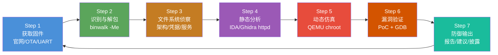

# 固件与IoT（15）· 实战：路由器固件全流程分析

## 概述与定位

> [!abstract] TL;DR
> 本章是系列终章，将前 14 章所有知识整合为一条**端到端的实战流程**：以一台典型 MIPS Linux 家用路由器为分析对象，从获取固件到产出防御建议，完整走完 7 个阶段。每个步骤对应具体命令、工具调用和分析判断，可直接用于自有设备安全研究。

> [!caution] 合规边界——请在继续阅读前确认
> **本章所有技术内容仅适用于以下合法场景**：
> 1. **自有设备**：你已拥有该路由器的物理所有权，且有权对其固件进行安全研究
> 2. **授权测试**：在合法授权书约束下对客户网络设备进行渗透测试
> 3. **CTF/沙盒环境**：在隔离的比赛或实验室环境中操作
>
> **禁止行为**：针对他人网络设备、公共基础设施或未经授权系统的固件提取与漏洞利用；将本章发现的技术直接用于攻击真实目标网络。发现真实漏洞时，请遵循负责任披露（Responsible Disclosure）路径：厂商 PSIRT → 协商修复周期 → CVE 申请公开。

路由器固件分析是固件逆向工程中最经典、最完整的练习场景：硬件成本低廉、架构典型（MIPS/ARM Linux）、Web 管理界面提供了丰富的攻击面、文件系统结构与桌面 Linux 有足够的相似性让逆向者有迹可循，但又在 NVRAM 配置机制、CGI 路由模式、嵌入式 libc 等细节上保留了嵌入式的独特性。

### 本章实验环境

本章以**通用案例**描述分析流程，不指向特定设备型号或已披露 CVE，以保持教学普适性。假设目标路由器具备：

| 属性 | 典型值 |
|------|--------|
| CPU 架构 | MIPS32 Big-Endian（MIPSBE） |
| Flash | 16MB SPI NOR |
| RAM | 128MB DDR2 |
| 操作系统 | 嵌入式 Linux（内核 2.6.x / 4.x） |
| 文件系统 | SquashFS 3.0（lzma 压缩） |
| Web 后台 | 自研 httpd（CGI 模式） |
| 固件格式 | TRX header + LZMA 内核 + SquashFS 根文件系统 |

---

## 原理与机制——7步全流程图



该流程是循环而非单次线性：防御输出阶段产生的固件加固建议，会驱动对新版本固件重复 Step 1 → Step 2 → Step 3 的验证，确认漏洞已被修复或引入新的变化。

---

## 7步全流程详解

### Step 1：获取固件

固件获取是分析的起点，也往往是安全研究中最受法律边界约束的一步。

#### 方法 A：官网直接下载（最简单、合规）

绝大多数路由器厂商在支持页面提供固件下载。下载后立即记录哈希，确保整个分析周期基于同一版本：

```bash
# 下载固件（以假设 URL 示意）
wget https://vendor.example.com/firmware/router_v2.8.5.bin -O firmware.bin

# 记录版本指纹
md5sum firmware.bin      # 发布前后对比用
sha256sum firmware.bin   # 报告存档用
file firmware.bin        # 初步类型判断
```

`file` 输出示例：
```
firmware.bin: data
```

`data` 意味着 `file` 无法识别文件魔数——这是固件常态，因为厂商自定义头部（如 TRX）不在 `file` 的魔数数据库中。真正的格式识别要靠 binwalk。

#### 方法 B：OTA 流量截包

若设备支持在线升级，可在受控网络中用中间人代理（mitmproxy）捕获升级流量：

```bash
# 在分析机上监听代理
mitmproxy -p 8080 --mode transparent

# 配置路由器将流量导向代理（需控制同一局域网路由器）
# 触发设备的"检查更新"操作后，从代理日志找到固件下载 URL
```

> [!note] OTA 注意事项
> 现代设备越来越多采用 HTTPS + 服务端证书固定（Certificate Pinning），直接截包会失败。此时需要在设备 httpd 中找到验证证书的代码路径，配合动态调试绕过——这本身就是一个独立的逆向任务，参考 `[[11.固件漏洞分析]]`。

#### 方法 C：UART U-Boot 控制台导出

当官网已下架旧版固件，或需要获取**运行时内存映像**时，通过硬件 UART 接口在 U-Boot 阶段导出：

```
# 打断 U-Boot 自动启动（上电后 3 秒内按任意键）
Hit any key to stop autoboot: 3...2...1...0
Router>

# 方法1：从 Flash 地址直接读取到 TFTP 服务器
Router> tftp 0x80200000 0x9F000000 0x1000000   # 将 Flash 内容读到 RAM
Router> ping 192.168.1.10                        # 测试 TFTP 服务器可达
Router> tftp 192.168.1.10 /firmware_dump.bin     # 上传到 PC

# 方法2：md5 校验 Flash 内容（快速验证）
Router> md5sum 0x9F000000 0x1000000
```

参考：`[[02.固件提取：物理逻辑OTA方法]]`、`[[06.Bootloader逆向：U-Boot与ATF]]`、`[[10.硬件调试接口：JTAG与SWD与UART]]`

---

### Step 2：固件识别与解包

获得 `firmware.bin` 后，用 binwalk 扫描内部结构。

#### 2.1 初步扫描

```bash
binwalk firmware.bin
```

输出示例（示意，非真实设备数据）：

```
DECIMAL       HEXADECIMAL     DESCRIPTION
--------------------------------------------------------------------------------
0             0x0             TRX firmware header, little endian,
                              image size: 8388608 bytes, CRC32: 0x1A2B3C4D,
                              flags: 0x0, version: 1
28            0x1C            LZMA compressed data, properties: 0x6D,
                              dictionary size: 8388608 bytes, uncompressed size: 4194304 bytes
1376256       0x150000        Squashfs filesystem, little endian, version 3.0,
                              compression: lzma, size: 6987776 bytes,
                              1024 inodes, block size: 65536 bytes,
                              created: 2023-08-15 07:32:11
```

三个关键偏移量的含义：
- `0x0`：TRX 头部——厂商自定义固件封装格式，包含 CRC、版本、各分区偏移
- `0x1C`：LZMA 压缩的 Linux 内核（`zImage` 或 `uImage`）
- `0x150000`：SquashFS 根文件系统镜像，这是逆向的主战场

#### 2.2 递归自动提取

```bash
# -M 递归提取，-e 提取到当前目录下的 _firmware.bin.extracted/
binwalk -Me firmware.bin

# 查看提取结果
ls -la _firmware.bin.extracted/
```

输出目录结构：
```
_firmware.bin.extracted/
├── 1C                    # LZMA 解压后的内核 ELF
├── 1C.7z                 # 原始 LZMA 压缩包
├── 150000.squashfs       # 原始 squashfs 镜像
└── squashfs-root/        # ← 解压后的根文件系统，分析主要在此
    ├── bin/
    ├── etc/
    ├── lib/
    ├── sbin/
    ├── tmp/
    ├── usr/
    └── www/
```

若 binwalk 无法自动解包 SquashFS（版本过旧或非标准压缩），手动：

```bash
# 用 unsquashfs 手动解包（工具来自 squashfs-tools 包）
dd if=firmware.bin bs=1 skip=$((0x150000)) of=rootfs.squashfs
unsquashfs -d squashfs-root rootfs.squashfs
```

参考：`[[03.固件解包与文件系统]]`

---

### Step 3：文件系统侦察

进入 `squashfs-root/` 开始系统性情报收集，目标是快速建立设备的"画像"。

#### 3.1 架构与工具链识别

```bash
cd _firmware.bin.extracted/squashfs-root

# 识别 busybox 架构（几乎所有路由器的 userspace 核心）
file bin/busybox
# 输出示例：
# bin/busybox: ELF 32-bit MSB executable, MIPS, MIPS-I version 1 (SYSV),
# dynamically linked, interpreter /lib/ld-uClibc.so.0, stripped

strings bin/busybox | grep "BusyBox v"
# BusyBox v1.28.4 (2023-08-15 07:20:55 UTC)
```

关键信息提取：
- `MSB`（Most Significant Byte first）= 大端 MIPS，IDA 加载选 **MIPSBE 32-bit**
- `ld-uClibc.so.0`：嵌入式精简 libc，与 glibc 函数签名有差异
- `stripped`：无调试符号，逆向难度上升

#### 3.2 快速凭据收集

```bash
# 查看 passwd（是否有无密码 root）
cat etc/passwd
# root:$1$AbCdEfGh$XxXxXxXxXxXxXxXxXxXxX0:0:0:root:/root:/bin/sh
# admin::1000:1000::/home/admin:/bin/sh  ← 空密码！

# 如果 shadow 存在（含哈希，可离线爆破）
cat etc/shadow 2>/dev/null || echo "无 shadow 文件"

# 尝试快速破解 MD5Crypt（$1$）哈希
# john --format=md5crypt --wordlist=/usr/share/wordlists/rockyou.txt etc/shadow
```

> [!warning] 哈希破解仅适用于自有设备。发现他人密码哈希时应立即停止并履行漏洞通报义务。

```bash
# NVRAM / UCI 配置文件
ls etc/config/ 2>/dev/null    # OpenWrt UCI 配置
ls etc/nvram.conf 2>/dev/null # 传统 NVRAM 配置文件

# 搜索硬编码凭据（高命中率）
grep -r "password\|passwd\|admin\|secret\|default" etc/ \
    --include="*.conf" --include="*.cfg" --include="*.ini" -l

# 在二进制共享库中搜索敏感字符串
strings lib/libconfig.so 2>/dev/null | grep -i "pass\|key\|token\|secret" | head -20
strings usr/lib/libcfm.so 2>/dev/null | grep -i "admin\|pass" | head -10
```

#### 3.3 Web 服务面貌

```bash
# 找 Web 服务二进制
ls usr/sbin/ | grep -i "http\|web\|cgi\|mini"
# 典型输出：httpd  lighttpd  mini_httpd

# 枚举 CGI 脚本
find usr/share/www -name "*.cgi" -o -name "*.asp" 2>/dev/null | sort
find www -name "*.cgi" -o -name "*.asp" 2>/dev/null | sort
# 示例输出：
# www/cgi-bin/login.cgi
# www/cgi-bin/tools_ping.cgi
# www/cgi-bin/firmware.cgi
# www/cgi-bin/info.cgi

# 找启动脚本，了解服务启动逻辑
grep -r "httpd\|uhttpd" etc/init.d/ --include="*.sh" -l
cat etc/init.d/httpd 2>/dev/null | head -30
```

#### 3.4 SSL/TLS 证书与密钥

```bash
# 硬编码私钥是严重问题（影响所有同型号设备）
find . -name "*.pem" -o -name "*.key" -o -name "*.crt" 2>/dev/null
grep -r "BEGIN RSA PRIVATE KEY\|BEGIN EC PRIVATE KEY" . 2>/dev/null -l
```

---

### Step 4：静态分析 Web 后台（httpd）

Web 管理后台是路由器固件中攻击面最丰富的组件。将 `usr/sbin/httpd` 加载进 IDA 或 Ghidra 进行深度静态分析。

#### 4.1 加载配置

在 IDA Pro 中加载时的参数设置：

| 选项 | 值 |
|------|-----|
| 处理器类型 | `MIPS MSB 32-bit` |
| 文件类型 | ELF for Linux |
| 加载地址 | 保持 ELF 默认（从 `.text` 段地址） |
| 内核模式 | 否 |

首次分析时，开启 IDA 的 `FLIRT` 签名匹配：
- `File → Load file → FLIRT signature file`
- 加载 `mipsb_le.sig`（uclibc mips）自动识别标准库函数

#### 4.2 定位 CGI 路由分发

大多数自研 httpd 会维护一张 URL → 处理函数的映射表。搜索关键字符串定位路由：

```
# IDA 字符串视图（Shift+F12）搜索：
"cgi-bin"
"/login.cgi"
"tools_ping"
"QUERY_STRING"
"REQUEST_METHOD"
```

找到字符串后，交叉引用（`X` 键）跳到使用处，通常是如下结构的路由表（伪代码）：

```c
struct cgi_handler {
    const char *path;          // URL 路径
    void (*handler)(void);     // 处理函数指针
};

static const struct cgi_handler cgi_table[] = {
    { "/login.cgi",      handle_login      },
    { "/tools_ping.cgi", handle_tools_ping },
    { "/firmware.cgi",   handle_firmware   },
    { "/info.cgi",       handle_info       },
    { NULL, NULL }
};
```

#### 4.3 登录认证分析（`/login.cgi`）

重命名并分析 `handle_login` 函数，关注认证逻辑：

```c
// 简化后的 handle_login 伪代码（IDA F5 输出风格）
void handle_login(void) {
    char user_buf[64];
    char pass_buf[64];
    char stored_pass[64];

    cgiGetStr("username", user_buf, 64);    // 从 QUERY_STRING 取参数
    cgiGetStr("password", pass_buf, 64);

    nvram_get("http_passwd", stored_pass);  // 从 NVRAM 读存储密码

    // ！危险：strcmp 明文比较，且 pass_buf 无长度校验
    if (strcmp(pass_buf, stored_pass) == 0) {
        set_auth_cookie();
        redirect("/index.asp");
    } else {
        http_error(401, "Unauthorized");
    }
}
```

问题发现：
1. `cgiGetStr` 有 64 字节限制，但内部 `sscanf` 实现可能无边界检查 → 潜在栈溢出
2. 明文密码存储于 NVRAM（`http_passwd`）
3. 无暴力破解保护（无限制重试）

#### 4.4 命令注入分析（`/tools_ping.cgi`）

诊断工具类 CGI 是命令注入的高发区，原因是需要调用系统命令：

```
IDA 数据流追踪（关键路径）：

getenv("QUERY_STRING")
    ↓
cgiGetStr("host", host_buf, 64)     # 从 URL 参数取目标主机
    ↓
sprintf(cmd, "ping -c 4 %s", host_buf)   # ← 危险！直接字符串拼接
    ↓
popen(cmd, "r")                     # 将拼接后的字符串传给 shell 执行
    ↓
读取输出返回给浏览器
```

若攻击者在 `host` 参数传入 `8.8.8.8; cat /etc/passwd`，则 `cmd` 变为：
```
ping -c 4 8.8.8.8; cat /etc/passwd
```
Shell 执行两条命令，后者输出被 `popen` 读回。

> [!tip] IDA 分析技巧
> - 用 `Y` 键手动定义函数签名（`cgiGetStr` 的参数类型）
> - 在 `popen`/`system` 的调用处设置书签（`Alt+M`），系统性检查每处调用的参数来源
> - 对 `sprintf`/`snprintf` 格式字符串中的 `%s` 参数做污点追踪（手动标记 "tainted" 注释）

#### 4.5 固件升级分析（`/firmware.cgi`）

固件升级接口的安全性决定了设备能否被永久控制：

```c
// 伪代码示意
void handle_firmware_upload(void) {
    char tmp_path[256];
    int content_len;

    content_len = atoi(getenv("CONTENT_LENGTH"));
    
    // ！危险：未验证 Content-Length 上限
    // 若 content_len 极大，可能导致临时文件写满 /tmp（tmpfs）
    
    read_multipart_to_file(stdin, content_len, "/tmp/firmware_upload.bin");
    
    // 签名验证？
    // if (!verify_signature("/tmp/firmware_upload.bin")) return;  // 此行若被注释掉...
    
    // 直接写入 Flash
    system("mtd write /tmp/firmware_upload.bin firmware");
}
```

关键审计点：签名验证是否真实执行（而非空函数或被条件绕过）。

参考：`[[05.MIPS与RISC-V嵌入式架构速查]]`

---

### Step 5：动态仿真验证

静态分析建立假设，动态仿真验证假设。使用 QEMU 用户模式仿真在 x86 Linux 主机上运行 MIPS 二进制。

#### 5.1 准备仿真环境

```bash
# 安装 QEMU 用户模式仿真（Debian/Ubuntu）
sudo apt install qemu-user-static

# 将 qemu-mipsel-static 复制进 chroot 根（或 qemu-mips-static 对应大端）
sudo cp $(which qemu-mips-static) \
    _firmware.bin.extracted/squashfs-root/usr/bin/qemu-mips-static

# 进入 chroot 环境
sudo chroot _firmware.bin.extracted/squashfs-root /bin/sh
```

在 chroot 内执行：

```sh
# 测试基本 MIPS 二进制是否可运行
/bin/busybox echo "仿真成功"

# 创建必要的伪文件系统（有些程序依赖 /proc /dev）
mount -t proc none /proc
mount -t devtmpfs none /dev
```

#### 5.2 启动 httpd

```bash
# 在 chroot 外（主机）准备 NVRAM 伪造环境
# 许多路由器 httpd 启动时会调用 nvram_get() 获取配置
# 若无 NVRAM 库，进程会直接崩溃

# 方案A：使用 libnvram-faker（开源 NVRAM 模拟库）
# 编译 mips 版本的 libnvram-faker.so，或直接用 Firmadyne 中的版本
export LD_PRELOAD=/usr/lib/libnvram-faker.so

# 方案B：简单环境变量注入（部分 httpd 从 /var/nvram 读配置）
mkdir -p squashfs-root/var/nvram
echo "http_passwd=admin" > squashfs-root/var/nvram/nvram.db
echo "http_enable=1"    >> squashfs-root/var/nvram/nvram.db

# 启动 httpd（chroot 内）
chroot squashfs-root \
    /usr/bin/qemu-mips-static \
    /usr/sbin/httpd -p 8080
```

#### 5.3 验证 Web 界面

```bash
# 另开终端，测试 httpd 响应
curl -v http://127.0.0.1:8080/

# 测试登录 CGI
curl -v "http://127.0.0.1:8080/cgi-bin/login.cgi?username=admin&password=admin"

# 测试诊断 ping CGI（注意 URL 编码）
curl -v "http://127.0.0.1:8080/cgi-bin/tools_ping.cgi?host=127.0.0.1"
```

#### 5.4 常见仿真问题与解决

| 问题现象 | 原因 | 解决方案 |
|---------|------|---------|
| httpd 立即 SIGABRT | NVRAM 初始化失败 | 使用 `libnvram-faker.so` LD_PRELOAD |
| Segmentation fault 0x0 | 函数指针未初始化（依赖 NVRAM 配置） | 预置必要 NVRAM 键值 |
| 端口未监听 | 大小端错误（用了 mipsel 模拟器但固件是 BE） | 确认 `file bin/busybox` 输出 MSB/LSB |
| SSL 握手失败 | httpd 要求 HTTPS，未提供证书 | 先用 `-http` 选项或修改配置禁 SSL |

参考：`[[13.固件仿真：QEMU与Firmadyne与Avatar2]]`

---

### Step 6：漏洞验证与 PoC（自有设备研究）

在仿真环境中验证 Step 4 静态分析发现的安全问题。

#### 6.1 命令注入 PoC 测试

```bash
# 在仿真环境中测试命令注入（自有设备研究）
# 发送 ping CGI 请求，在 host 参数中注入命令

# 基础测试：检测注入是否可行
curl "http://127.0.0.1:8080/cgi-bin/tools_ping.cgi?host=127.0.0.1%3Becho%20INJECTED"
# %3B = ;    注入 echo INJECTED

# 若响应中出现 "INJECTED" 字样，则命令注入已确认
```

> [!caution] PoC 仅在 chroot 仿真环境中执行
> 绝对不要对真实运行中的路由器（即便是自有设备）在生产网络上执行 PoC，会导致网络中断或设备不可恢复状态。应始终在隔离的仿真环境或测试网络中验证。

#### 6.2 GDB 动态调试

```bash
# 以 GDB 服务器模式启动 httpd
chroot squashfs-root \
    /usr/bin/qemu-mips-static \
    -g 1234 \
    /usr/sbin/httpd -p 8080 &

# 在主机用 mips 版 GDB 连接（需安装 gdb-multiarch 或 mips-linux-gnueabi-gdb）
gdb-multiarch -ex "set arch mips" \
              -ex "target remote localhost:1234" \
              -ex "set sysroot _firmware.bin.extracted/squashfs-root" \
              usr/sbin/httpd
```

GDB 内操作：

```gdb
# 在 popen 处设置断点，捕获命令拼接结果
(gdb) break popen
(gdb) continue

# 当断点触发时，查看第一个参数（MIPS: $a0 = 命令字符串地址）
(gdb) x/s $a0
# 0x7fff1234: "ping -c 4 127.0.0.1; echo INJECTED"

# 确认注入已发生
(gdb) info registers a0 a1 a2 a3
```

#### 6.3 栈溢出验证（`login.cgi` 场景）

```bash
# 发送超长 password 参数测试缓冲区边界
python3 -c "print('A'*200)" | \
    curl "http://127.0.0.1:8080/cgi-bin/login.cgi?username=admin&password=$(python3 -c 'print(\"A\"*200)')"

# 若 httpd 崩溃（进程退出/连接重置），说明存在缓冲区溢出
# QEMU GDB 模式下可捕获到 SIGSEGV，查看 $pc 是否被覆盖为 0x41414141
```

#### 6.4 漏洞记录模板

发现漏洞时，按以下维度立即记录：

| 字段 | 内容示例 |
|------|---------|
| 漏洞类型 | OS 命令注入（CWE-78） |
| 触发路径 | `GET /cgi-bin/tools_ping.cgi?host=<payload>` |
| 鉴权要求 | 无需认证（匿名访问即可触发） |
| 影响范围 | 所有运行该固件版本的设备 |
| CVSS v3.1 | 9.8 Critical（AV:N/AC:L/PR:N/UI:N/S:U/C:H/I:H/A:H） |
| 修复建议 | 用 `execve()` 替代 `system()`；对 host 参数做 IP 格式白名单校验 |

参考：`[[11.固件漏洞分析]]`、`[[33.二进制漏洞与利用基础/02.栈溢出基础]]`

---

### Step 7：防御建议与输出

分析的最终价值在于输出可落地的防御措施和负责任的漏洞处置。

#### 7.1 负责任披露路径

当在自有设备上发现可能影响所有同型号用户的安全漏洞时：

```
发现漏洞
    ↓
整理 PoC + 影响范围 + CVSS 评分
    ↓
通过厂商官网/Security Center 找到 PSIRT 邮箱
（如 security@vendor.com 或 psirt@vendor.com）
    ↓
发送漏洞报告（加密邮件，附厂商公钥）
    ↓
等待厂商确认（通常 5-10 个工作日）
    ↓
协商修复时间表（建议 90 天窗口期）
    ↓
修复版本发布后申请 CVE（通过 MITRE/CVE Numbering Authority）
    ↓
漏洞公开披露（含 CVE 编号）
```

> [!note] 中国用户注意
> 中国境内还可通过 **CNVD（国家信息安全漏洞库）** 提交漏洞：`https://www.cnvd.org.cn/`，CNVD 会协助推动厂商修复并分配 CNVD 编号。

#### 7.2 固件加固建议清单

针对本章发现的典型问题，给出具体的代码修复方向：

**命令注入修复（最高优先级）**

```c
// ❌ 危险：字符串拼接 + system/popen
sprintf(cmd, "ping -c 4 %s", host_buf);
popen(cmd, "r");

// ✅ 安全：execve 数组传参（shell 不参与，无注入风险）
char *args[] = { "/bin/ping", "-c", "4", host_buf, NULL };
// 在 fork 后的子进程中：
execve("/bin/ping", args, NULL);

// ✅ 备选：输入白名单校验（IP 地址格式正则）
if (!is_valid_ip(host_buf)) {
    http_error(400, "Invalid host format");
    return;
}
// 通过验证后再执行 ping
```

**缓冲区安全**

```c
// ❌ 危险：固定大小缓冲区 + 无边界检查的 scanf
char buf[64];
sscanf(qs, "host=%s", buf);  // %s 不限长度

// ✅ 安全：限制读取长度
char buf[64];
sscanf(qs, "host=%63s", buf);  // 最多读 63 个字符

// ✅ 更安全：专用 CGI 解析函数加强参数验证
cgiGetStr("host", buf, sizeof(buf));  // 确保内部使用 strncpy
```

**编译器安全选项**

```makefile
# 在工具链 Makefile 中加入安全编译选项
CFLAGS += -fstack-protector-strong    # Stack Canary
CFLAGS += -D_FORTIFY_SOURCE=2         # glibc 缓冲区检测（uclibc 有限支持）
LDFLAGS += -Wl,-z,relro,-z,now        # RELRO：只读重定位表
LDFLAGS += -pie -fPIE                 # PIE：地址空间随机化
```

**其他加固方向**

| 问题 | 修复措施 |
|------|---------|
| UART 控制台在生产版本开启 | 编译时禁用或设置强 UART 密码；参考 `[[06.Bootloader逆向：U-Boot与ATF]]` |
| 默认弱密码 | 强制首次使用时更改密码；随机化出厂密码（基于序列号哈希） |
| 固件升级无签名验证 | 实现 RSA-2048 或 ECDSA-P256 签名；验证失败拒绝写入 |
| HTTP 而非 HTTPS | 生成唯一设备证书（出厂预置私钥）；强制 HTTPS |
| 硬编码私钥 | 每台设备独立生成密钥对（制造阶段写入安全存储） |

#### 7.3 固件修复验证（差分分析）

厂商发布安全更新后，对旧版与新版固件做差分，验证修复是否针对本章发现：

```bash
# 解包新版固件
binwalk -Me firmware_v2.8.6.bin

# 比较 httpd 二进制的变化
bindiff \
    _firmware_v2.8.5.bin.extracted/squashfs-root/usr/sbin/httpd \
    _firmware_v2.8.6.bin.extracted/squashfs-root/usr/sbin/httpd

# 重点看 handle_tools_ping 函数是否有新增的输入校验逻辑
```

参考：`[[14.固件差分与补丁分析]]`

---

## 逆向视角：跨步骤方法论总结

### 高效率分析的经验法则

经过 7 个步骤的完整实战，有几条方法论值得特别强调：

**1. 字符串驱动的逆向路径**

路由器固件中，字符串密度远高于通用软件：URL 路径、NVRAM 键名、错误消息、调试日志——每个字符串都是进入相关函数的入口。在 IDA 中，80% 的关键函数可以通过"搜索字符串 → 交叉引用 → 到达函数"路径定位，比盲目分析反汇编效率高 10 倍。

**2. 污点追踪的思维框架**

手动污点分析的核心问题只有一个：**用户可控的输入，能否在未经充分验证的情况下，到达危险函数？**

危险函数清单（嵌入式 Web 服务重点关注）：
- 命令执行：`system()`, `popen()`, `execve()`, `execl()`
- 文件操作：`fopen()`, `open()`, `unlink()`, `rename()`
- 内存操作：`strcpy()`, `sprintf()`, `gets()`, `memcpy()`
- 格式化：`printf(user_input)`, `fprintf(user_input)`

**3. MIPS 特有的逆向注意事项**

```
# 延迟槽（Delay Slot）——MIPS 逆向陷阱
jal    handle_login     # 跳转到 handle_login
nop                     # 延迟槽：跳转前先执行此处指令（通常是 nop）

# 实际执行顺序：先执行 nop，然后跳转
# IDA 通常会在反汇编中标注 delay slot，但手动读汇编时要注意
```

```
# 函数参数（O32 ABI）
# $a0, $a1, $a2, $a3 = 前四个参数
# 超过四个的参数通过栈传递
# $v0 = 返回值
# $ra = 返回地址（jr $ra 返回调用者）

# 识别 popen 调用（未优化的 O32 调用约定）：
lui   $a0, 0x4007          # 高 16 位
addiu $a0, $a0, 0x1234     # 低 16 位 → $a0 = cmd 字符串地址
lui   $a1, 0x4006
addiu $a1, $a1, 0x5678     # $a1 = "r" 字符串地址
jal   popen
nop
```

### 工具协同使用建议

| 任务 | 首选工具 | 备选工具 |
|------|---------|---------|
| 固件解包 | `binwalk -Me` | `Firmware Mod Kit` |
| 静态反汇编 | IDA Pro（商业）| Ghidra（免费）|
| MIPS 动态仿真 | `qemu-mips-static` + chroot | Firmadyne（自动化） |
| GDB 多架构调试 | `gdb-multiarch` | `mips-linux-gdb` |
| 网络请求测试 | `curl` | Burp Suite（HTTPS）|
| 二进制差分 | BinDiff（IDA 插件）| Diaphora（免费）|
| 固件仿真平台 | QEMU 手动 | Avatar2、Firmadyne |

---

## 安全性与正确使用

### 法律与道德框架

固件逆向工程在不同司法管辖区有不同的法律地位，分析前必须明确以下边界：

> [!caution] 操作前必读法律事项
> - **中国**：《网络安全法》第二十七条明确禁止未经授权入侵他人网络设备；《数据安全法》规制数据的非法获取。自有设备研究应记录购买凭证备查。
> - **美国**：CFAA（计算机欺诈与滥用法）对未授权访问计算机系统有严格约束；但 DMCA 第 1201(f) 条款为安全研究目的的逆向工程提供有限豁免。
> - **通用原则**：无论哪个国家，对他人设备进行固件提取、漏洞利用均构成违法行为。自有设备研究应在与生产网络物理隔离的环境中进行。

### 研究环境隔离清单

在开始任何固件分析前，确认以下隔离措施到位：

- [ ] 分析主机与生产网络（家庭 Wi-Fi/企业网络）物理隔离，或使用独立 VLAN
- [ ] 被分析路由器不接入公网（使用本地回环或隔离测试网段）
- [ ] PoC 仅在 chroot 仿真环境或空气隔离（air-gapped）实验机上运行
- [ ] 分析结果（特别是 PoC 代码）不上传至公开平台（GitHub/Pastebin）直至漏洞修复公开
- [ ] 若使用 UART/JTAG 直连设备，断开设备的 WAN 口网线

### 常见合规陷阱

**陷阱 1：把"自有设备"理解为"任意路由器"**

购买了某型号路由器，不等于可以攻击同型号的他人设备。固件分析的发现只能用于：改善自己那台设备的安全、向厂商负责任披露漏洞，而不是发展武器化利用工具。

**陷阱 2：公开 0-day PoC**

在厂商修复之前公开可利用的 PoC，会将所有用户置于风险中。遵循 CVE/CNVD 的协调披露流程，给厂商合理的修复窗口期。

**陷阱 3：忽视固件许可证**

部分固件基于 GPL 开源代码构建（BusyBox、Linux 内核、OpenSSL）。分析是合法的，但若基于固件进行二次开发并发布，需遵循相应开源许可证。

---

## 分析报告模板

完成分析后，按以下结构产出专业报告：

```markdown
# 路由器固件安全分析报告

## 1. 基本信息

| 字段 | 内容 |
|------|------|
| 设备型号 | 待填写 |
| 固件版本 | 待填写 |
| 固件 MD5 | 待填写 |
| CPU 架构 | MIPS32 BE / MIPSEL / ARM（勾选） |
| 文件系统 | SquashFS / JFFS2 / UBIFS（勾选） |
| Web 服务 | httpd / lighttpd / uhttpd（勾选） |
| 分析日期 | 待填写 |
| 分析人员 | 待填写 |

## 2. 分析摘要

（2-3 句话概述发现的核心问题和整体风险等级）

## 3. 发现问题列表

### 3.1 高危（Critical/High）

| ID | 位置 | 类型 | CWE | CVSS v3.1 | 状态 |
|----|------|------|-----|-----------|------|
| VUL-001 | /cgi-bin/tools_ping.cgi | 命令注入 | CWE-78 | 9.8 | 已确认 |
| VUL-002 | /cgi-bin/login.cgi | 栈溢出 | CWE-121 | 8.1 | 待确认 |

### 3.2 中危（Medium）

（同上表格格式）

### 3.3 低危（Low）

（同上表格格式）

## 4. 详细分析（每个漏洞一节）

### VUL-001：tools_ping.cgi 命令注入

**触发路径**：`GET /cgi-bin/tools_ping.cgi?host=<payload>`

**代码位置**：`usr/sbin/httpd`，函数 `handle_tools_ping`，偏移 `0x402234`

**PoC 请求**：（仿真环境验证，生产设备不执行）
```
GET /cgi-bin/tools_ping.cgi?host=127.0.0.1%3Becho%20INJECTED HTTP/1.1
Host: 127.0.0.1:8080
```

**影响**：未认证远程代码执行，可获取 root shell

**修复建议**：改用 `execve()` 数组参数；对 host 参数做 IPv4/IPv6 格式白名单校验

## 5. 风险等级总结

| 级别 | 数量 |
|------|------|
| Critical | 0 |
| High | 2 |
| Medium | 1 |
| Low | 0 |
| **总计** | **3** |

**整体风险评级**：High（存在无需认证的 RCE）

## 6. 修复建议优先级

1. 【立即】修复 VUL-001 命令注入（CVSS 9.8）
2. 【1周内】修复 VUL-002 栈溢出
3. 【下个版本】加固编译选项（Stack Canary、PIE）
4. 【规划中】实现固件签名验证

## 7. 附录

- binwalk 扫描输出（完整）
- IDA 关键函数截图
- GDB 调试日志
- PoC 代码（仅限内部，不公开）
```

---

## 小结

本章以一台典型 MIPS Linux 路由器固件为脉络，完整串联了整个系列的核心技术：

| 步骤 | 核心工具 | 对应前序章节 |
|------|---------|------------|
| Step 1 获取固件 | wget/mitmproxy/U-Boot | 02、06、10 |
| Step 2 识别解包 | binwalk、unsquashfs | 03 |
| Step 3 文件系统侦察 | file/strings/grep | 01、05 |
| Step 4 静态分析 | IDA Pro/Ghidra | 05、11 |
| Step 5 动态仿真 | QEMU chroot | 13 |
| Step 6 漏洞验证 | GDB、curl | 11 |
| Step 7 防御输出 | BinDiff + 报告模板 | 14 |

7 步流程不是线性单次的——它是一个闭环：每次固件版本更新都应触发新一轮从 Step 1 到 Step 7 的迭代，直至设备达到可接受的安全基线。

固件逆向工程的价值，最终体现在两个方向：
- **对研究者**：积累对嵌入式系统底层机制的理解，建立可复用的分析方法论
- **对设备制造商**：在产品发布前发现并修复安全缺陷，保护终端用户

这也是本系列从第一章就贯穿的核心理念：**理解系统是为了更好地保护系统**。

---

## 相关阅读

- `[[02.固件提取：物理逻辑OTA方法]]`——固件获取三条路径详解
- `[[03.固件解包与文件系统]]`——binwalk 深度使用与 SquashFS/JFFS2 差异
- `[[05.MIPS与RISC-V嵌入式架构速查]]`——MIPS O32 ABI、延迟槽、大小端识别
- `[[11.固件漏洞分析]]`——命令注入、栈溢出、格式化字符串漏洞原理
- `[[13.固件仿真：QEMU与Firmadyne与Avatar2]]`——仿真平台选择与 NVRAM 伪造
- `[[14.固件差分与补丁分析]]`——BinDiff 使用与补丁验证流程
- `[[33.二进制漏洞与利用基础/02.栈溢出基础]]`——通用栈溢出原理
- `[[00.固件与IoT嵌入式逆向总览]]`——系列全貌与章节导航

---

⬅️ 上一篇 [[14.固件差分与补丁分析]] ｜ 🏠 [[00.固件与IoT嵌入式逆向总览]] ｜ ➡️ 下一篇 [[16.SDR与射频信号逆向]]
