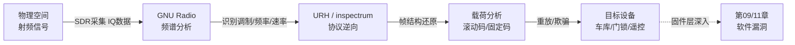
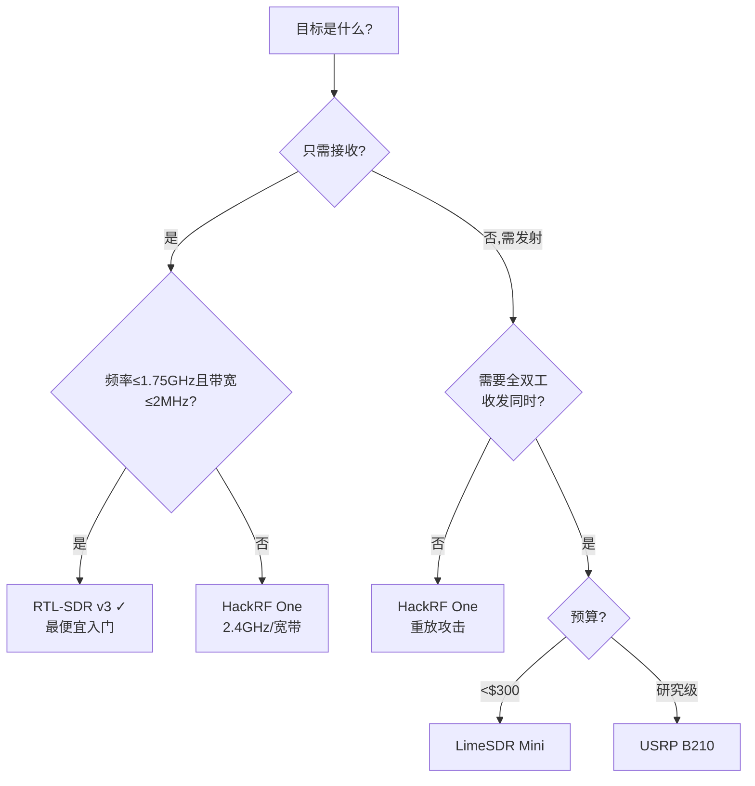
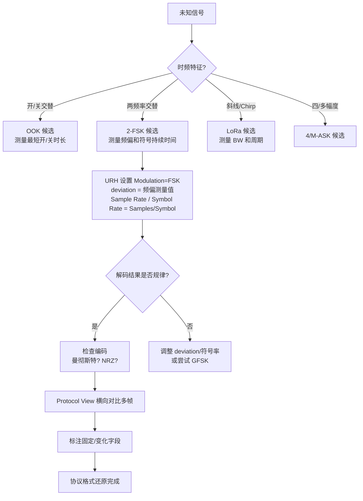

---
tags:
  - 固件
  - IoT
  - tier3
  - SDR
  - 射频
---
# SDR 与射频信号逆向
> [!abstract] TL;DR
> 软件定义无线电（SDR）把原本由硬件实现的调制/解调逻辑下沉到软件层，使研究者可以用廉价硬件捕获任意频段的射频信号，再借助 GNU Radio、URH、inspectrum 等工具完成频谱分析、协议解调、帧结构逆向直至重放攻击。覆盖 315/433/868/915 MHz 及 2.4 GHz ISM 频段的车钥匙、门铃、无线遥控、智能家居等大量IoT设备因缺乏加密或使用弱滚动码而暴露在射频层的攻击面下。本章从 SDR 物理原理出发，穿透 IQ 数据→调制方式→解调流程→协议逆向工具→重放/欺骗攻击→法规边界的全链路。

## 概述与定位

### 为什么射频逆向自成一章

系列前 15 章处理的攻击面都建立在"已拿到固件"或"已能接触调试接口"的前提上。然而大量 IoT 设备的第一个可攻击接口根本不在 JTAG 针脚或 TCP 端口，而是在**空中的射频信号**。一个车库门遥控，一把汽车钥匙，一套无线门铃——攻击者无需物理接触设备本体，只需在有效距离内捕获信号就能开始逆向。

射频逆向与软件协议逆向（第09章覆盖的 MQTT/CoAP/Zigbee/BLE）有根本性的方法论差异：

| 维度 | 软件协议逆向 | 射频信号逆向 |
|------|------------|------------|
| 切入点 | 固件中的协议栈代码 | 空中的模拟/数字信号 |
| 工具链 | Wireshark、IDA、Ghidra | SDR 硬件 + GNU Radio + URH |
| 核心技能 | 二进制分析、状态机还原 | 信号处理、调制理论 |
| 基础数学 | 数据结构、汇编 | 傅里叶变换、采样定理 |
| 典型产物 | 协议格式、加密方案 | 频率/调制/帧结构/重放载荷 |

本章的定位是**射频信号逆向的完整方法论体系**，从物理层原理到实战工具到安全边界，补齐系列在无线信号维度的盲区。

### 射频信号在 IoT 攻击链中的位置



射频逆向通常是 IoT 攻击的**前置阶段**——发现射频协议弱点后，有时需要进入第09章的应用层协议分析，或者通过第02章提取固件后验证加密实现缺陷。

---

## 原理与机制

### 2.1 软件定义无线电的本质

传统无线电收发机的调制/解调、滤波、信道编解码全部由模拟电路或专用 ASIC 实现，更换频段或调制方式意味着更换硬件。SDR 的核心思想是**把尽可能多的信号处理逻辑移到软件层**：

```
天线 → 低噪声放大器(LNA) → 带通滤波 → 混频器(下变频) → ADC → [数字信号处理软件]
                                        ↑
                               本振(Local Oscillator)
                               由软件控制频率
```

ADC 之后的所有操作——滤波、解调、纠错、协议解析——都在通用 CPU/GPU 上以软件实现。这意味着同一块硬件通过更换软件就能处理 FM 广播、门铃信号、LoRa 帧、ADS-B 飞机应答机，只要频率和采样率在硬件规格范围内。

### 2.2 IQ 数据：复基带信号的基础表示

SDR 硬件输出的原始数据不是大家直觉上的"0/1 码流"，而是**IQ（In-phase / Quadrature）采样**。

**为什么用 IQ 而不直接采样射频信号？**

若载波频率为 433 MHz，直接采样需要奈奎斯特定理要求至少 866 MSPS 的 ADC，这在成本上不可接受。混频器将射频信号下变频到**基带（Baseband）**或**中频（IF）**：

```
射频信号：s(t) = A(t) · cos(2π·fc·t + φ(t))

混频后得到复基带：
  I(t) = A(t) · cos(φ(t))   ← 实部（同相分量）
  Q(t) = A(t) · sin(φ(t))   ← 虚部（正交分量）

复数表示：z(t) = I(t) + j·Q(t) = A(t)·e^{jφ(t)}
```

IQ 数据捕获了信号的**完整幅度和相位信息**，是一切后续解调的原始材料。SDR 软件如 GNU Radio 和 URH 读取的 `.iq`、`.cfile`、`.bin` 文件，本质上就是按时间顺序排列的 `[I₀, Q₀, I₁, Q₁, ...]` 浮点数序列。

**奈奎斯特采样定理的实际约束**

若信号带宽为 B，则采样率 fs 必须满足 fs ≥ 2B。对于一个占 200 kHz 带宽的 FSK 信号，2 MSPS 的采样率足够，但需要预先将本振调到目标频率附近使信号落入基带。

常见陷阱：直流偏置（DC Offset）——IQ 混频器的不平衡会在 0 Hz 产生一个虚假的直流分量，在频谱上表现为中心频率处的强烈尖峰。这不是真实信号，逆向时需识别并过滤。

### 2.3 奈奎斯特与混叠：采样率不够时发生什么

若目标信号频率高于 fs/2（奈奎斯特频率），信号会发生**混叠（Aliasing）**——高频分量"折叠"到低频，与真实的低频分量叠加，产生无法还原的失真。

实践上，RTL-SDR 的最大采样率约 3.2 MSPS（稳定运行建议 2.4 MSPS），HackRF One 最高 20 MSPS。对于 2.4 GHz 频段的宽带协议（如 WiFi 占 20 MHz 带宽），RTL-SDR 带宽不够，需要 HackRF 或 USRP。

### 2.4 调制方式详解

调制是将数字比特信息映射到射频信号物理参数（幅度/频率/相位）变化的过程。逆向的第一步是**识别调制方式**。

#### ASK（幅移键控）与 OOK（开关键控）

ASK 通过幅度变化编码信息，OOK 是 ASK 的特例（0 = 无载波，1 = 满幅载波）：

```
OOK 波形示意（比特序列 1011）：
时间 →
▓▓▓▓░░░░▓▓▓▓▓▓▓▓
  1    0    1    1
```

OOK 是最简单的调制，大量廉价门铃、遥控开关使用。在 URH 频谱图上表现为信号时域上有明显的"开"/"关"段，解调极为简单：以幅度门限判决，超过门限为1，低于为0。

**边界陷阱**：曼彻斯特编码（Manchester Encoding）常与 OOK 组合使用。每个比特由跳变方向（下降沿→1，上升沿→0 或反之）而非电平高低决定，直接按幅度判决会得到错误的比特序列，需要进一步解曼彻斯特编码。

#### FSK（频移键控）与 GFSK（高斯频移键控）

FSK 通过频率变化编码：1 → 频率 f₁，0 → 频率 f₀，两者之差称为**频偏（Deviation）**，典型值 25 kHz 或 50 kHz。

GFSK 在 FSK 基础上对频率跳变施加高斯滤波，使频谱更紧凑（旁瓣更小），BLE 使用 GFSK（BT=0.5）。

在频谱瀑布图（Waterfall）上，FSK 信号在两个频率间来回跳动，呈现"两轨道"的特征形态。

解调方法：
1. **鉴频器法**：对 IQ 信号求瞬时频率 f = (1/2π) · dφ/dt，再与判决门限比较。
2. **差分解调**：z[n] · conj(z[n-1]) 的相角即瞬时相位差，近似于频率。

#### PSK（相移键控）：BPSK / QPSK / 8PSK

PSK 通过相位变化编码，BPSK（二相，0°/180°）最简单，QPSK（四相，0°/90°/180°/270°）每符号携带 2 bit。

**IQ 星座图**是识别 PSK 阶数的核心工具：
- BPSK：星座点在实轴（I 轴）上，只有两个点。
- QPSK：四个点分布在四个象限。
- 8PSK：八个点均匀分布在圆周上。

在 URH 的 "Interpretation" 视图或 GNU Radio 的 QT GUI Constellation Sink 中可直接观察。

#### LoRa CSS（线性调频扩频）

LoRa 是 Semtech 专有但已被广泛逆向研究的调制方案。CSS（Chirp Spread Spectrum，啁啾扩频）使用**线性调频信号（Chirp）**作为符号：

```
上啁啾（Up-Chirp）：频率从 f_低 线性增加到 f_高（用于前导码）
数据符号：频率起点相对于上啁啾的偏移量编码数据
```

关键参数：
- **扩频因子（SF, Spreading Factor）**：SF7–SF12，SF 越大，每符号携带更多 bit（2^SF 个频率偏移），但速率越低、距离越远。
- **带宽（BW）**：典型 125/250/500 kHz，决定啁啾速率。
- **编码率（CR）**：前向纠错开销，4/5–4/8。

LoRa 的扩频增益使其在极低信噪比（SNR 低至 -20 dB）下依然可以通信，城市中单个网关可覆盖数公里。逆向 LoRa 需要理解 LoRaWAN MAC 层（Join-Request/Join-Accept、DevAddr、NwkSKey、AppSKey），而不只是物理层解调。

---

## 结构/算法/伪代码详解

### 3.1 SDR 硬件横向对比

| 硬件 | 频率范围 | 采样率 | 带宽 | 发射能力 | 价格（参考） | 适用场景 |
|------|---------|--------|------|---------|------------|---------|
| **RTL-SDR v3** | 500 kHz–1.75 GHz | 最高 3.2 MSPS（稳定 2.4） | ~2.4 MHz | 无（纯接收） | ~$25 | 入门、ISM 频段捕获、ADS-B |
| **HackRF One** | 1 MHz–6 GHz | 20 MSPS | 20 MHz | 有（半双工） | ~$300 | 2.4 GHz 宽带、重放攻击 |
| **USRP B210** | 70 MHz–6 GHz | 61.44 MSPS（每通道） | 56 MHz | 有（全双工） | ~$1,500 | 研究级、同步收发 |
| **LimeSDR Mini** | 10 MHz–3.5 GHz | 30.72 MSPS | 30 MHz | 有（全双工） | ~$170 | 性价比全双工，5G NR 研究 |
| **bladeRF 2.0** | 47 MHz–6 GHz | 61.44 MSPS | 56 MHz | 有（全双工） | ~$480 | 多通道、精密测量 |

**选择决策树**：



**RTL-SDR 特别说明**：原是 DVB-T 电视棒，由于廉价（最低 $8–$25）且驱动开源，被 Osmocom 项目改装为通用 SDR。内部芯片 RTL2832U + Rafael Micro R820T2。灵敏度不及专业设备，但对于 433 MHz OOK/FSK 信号已经足够，是射频逆向入门首选。

### 3.2 GNU Radio 流程图体系

GNU Radio 是开源的信号处理框架，核心概念是**数据流图（Flowgraph）**：每个处理单元是一个 **Block**，块之间通过数据流连接，GRC（GNU Radio Companion）提供图形化编辑界面。

典型的 FM 解调流程图（用于参考理解结构）：

```
[osmocom Source]      ← SDR 硬件驱动，输出 IQ 复数流
    │ complex
    ↓
[Low Pass Filter]     ← 隔离目标频道，带宽设为 FM 信道宽度
    │ complex
    ↓
[WBFM Receive]        ← 宽带 FM 解调，内含鉴频+去加重
    │ float
    ↓
[Rational Resampler]  ← 从 SDR 采样率重采样到音频采样率 48 kHz
    │ float
    ↓
[Audio Sink]          ← 播放音频
```

**常用 Block 分类**：

| 类别 | Block 示例 | 用途 |
|------|-----------|------|
| 信源 | `osmocom Source`, `File Source` | SDR 硬件或 IQ 文件读入 |
| 滤波 | `Low Pass Filter`, `Band Pass Filter`, `Decimating FIR` | 隔离信道、降采样 |
| 解调 | `Quadrature Demod`, `Clock Recovery MM`, `Binary Slicer` | FSK 鉴频、符号同步、判决 |
| 可视化 | `QT GUI Frequency Sink`, `QT GUI Waterfall Sink`, `QT GUI Constellation Sink` | 频谱/瀑布/星座图 |
| 数学 | `Multiply`, `Add`, `Complex to Mag`, `Arg` | 信号运算 |
| 文件 | `File Sink` | 保存 IQ 数据 |

**FSK 解调完整流程（伪代码级 Block 序列）**：

```
osmocom Source (center_freq=433.92e6, sample_rate=2e6)
  → Low Pass Filter (cutoff=100e3, transition=10e3)   # 隔离 200kHz 信道
  → Quadrature Demod (gain=2e6/(2*pi*deviation))      # 鉴频，输出瞬时频率
  → Low Pass Filter (cutoff=10e3)                      # 去除噪声
  → Clock Recovery MM (omega=samples_per_symbol)       # 符号定时恢复
  → Binary Slicer (lo=0, hi=1)                        # 判决
  → File Sink("output.bits")                           # 保存比特流
```

**关键参数计算**：
- `Quadrature Demod` 的 gain = `sample_rate / (2 * π * deviation)`，其中 deviation 是 FSK 频偏（如 25 kHz）
- `Clock Recovery MM` 的 omega = `sample_rate / symbol_rate`（每个符号的采样点数）

这两个参数是 GNU Radio FSK 解调最常出错的地方：deviation 估算错误会导致判决逻辑反转，symbol_rate 不准会导致符号边界漂移、误码率极高。

### 3.3 频谱分析：从瀑布图读取信号参数

在逆向未知信号时，频谱分析是第一步。工具推荐使用 **GQRX**（基于 GNU Radio 的图形化 SDR 接收机）或 **SDR++**。

**从频谱瀑布图提取的关键参数**：

```
1. 中心频率（Center Frequency）
   → 信号能量集中的频率轴位置
   → 方法：调节本振频率，使信号出现在瀑布图中央

2. 信号带宽（Bandwidth）
   → 信号在频率轴上占据的宽度（-3 dB 或 -10 dB 处）
   → 方法：目测或用频谱分析仪的 Band Power 工具测量
   → 对于 OOK：带宽 ≈ 2 × 符号率
   → 对于 FSK：带宽 ≈ 2 × (频偏 + 符号率)（Carson 公式）

3. 符号率（Symbol Rate / Baud Rate）
   → 方法一：时域上测量单个最短符号的持续时间 T，符号率 = 1/T
   → 方法二：FSK 信号频谱上两个峰之间的距离 ≈ 2 × 频偏

4. 调制方式判断
   → OOK：时域有开/关交替，频谱无分裂
   → 2-FSK：频谱分裂为两个对称峰
   → QPSK：星座图4点均匀分布
   → LoRa CSS：瀑布图中出现特征性斜线（Chirp 的时频轨迹）
```

**实战陷阱：同频干扰与多设备**

433 MHz ISM 频段是公共频段，温度传感器、车库门、无线门铃、宠物追踪器都可能在同一频率上工作。瀑布图中同时出现多个信号时，需要区分：
1. 不同的载波频率（即使只差几十 kHz）→ 分别捕获
2. 同一频率但不同时刻发射 → 分别记录时间段
3. 真正的同频干扰 → 信号叠加，难以分离，需要靠近发射源

### 3.4 URH（Universal Radio Hacker）协议逆向流程

URH 是专为射频协议逆向设计的工具，提供从 IQ 文件到协议字段的完整流水线，无需手写 GNU Radio 流程图。

**URH 工作流程**：

```
第一步：录制
  文件 → 直接接入 SDR 硬件（支持 RTL-SDR/HackRF 等）
  设置 center_freq、采样率，按下录制，按动被测设备按键

第二步：信号视图（Signal View）
  ├── 分析（Analysis）标签：自动检测调制类型、比特率
  ├── 手动设置：Modulation（OOK/ASK/FSK/GFSK/PSK）
  ├── 设置 Sample Rate、Bit Length（每 bit 的采样点数）
  └── 输出：比特序列（Decoded Bits）

第三步：解码（Decodings）
  常用解码器：曼彻斯特编码、差分曼彻斯特、NRZ、米勒码
  逆向时需要猜测并验证编码方案

第四步：协议（Protocol View）
  对多次捕获的帧进行横向对比
  ├── 固定字段（前导码、同步字、设备ID）
  └── 变化字段（命令字节、滚动码、校验）
  使用"协议标签"功能对字段命名

第五步：发生器（Generator / Fuzzer）
  根据还原的协议格式构造发射帧
  或使用 Fuzzer 枚举字段值

第六步：发射
  需要具备发射能力的 SDR（HackRF/USRP）
```

**inspectrum 的互补优势**：

URH 做协议逆向，inspectrum 做**低层信号可视化**。inspectrum 的时频图（时间轴 × 频率轴的热力图）特别适合分析符号边界模糊或有预加重的信号，可以手动调整符号栅格，精确标定每个符号的起止位置，对 LoRa Chirp 的可视化尤为出色。

### 3.5 常见 ISM 频段与典型目标

| 频段 | 主要地区 | 典型应用 | 常见调制 |
|------|---------|---------|---------|
| **315 MHz** | 北美 | 车库门、汽车钥匙（北美市场） | OOK、FSK |
| **433.92 MHz** | 欧洲/亚洲 | 无线门铃、遥控开关、气象站、TPMS | OOK、ASK、FSK |
| **868 MHz** | 欧洲 | LoRa/LoRaWAN、Z-Wave（欧洲版）、智能电表 | FSK、LoRa CSS |
| **915 MHz** | 北美/澳洲 | LoRa/LoRaWAN（北美版）、RFID、无线水表 | FSK、LoRa CSS |
| **2.4 GHz** | 全球 | BLE、Zigbee、WiFi、无线鼠标键盘 | GFSK、OQPSK、DSSS |

**为什么 433.92 MHz 最受逆向研究者关注**：它是欧亚市场消费级无线产品的默认频率，设备数量庞大，OOK 调制实现极简单，大量廉价设备不加密，RTL-SDR 即可完整覆盖，构成最低门槛的射频逆向入口。

### 3.6 重放攻击与滚动码

**固定码（Fixed Code）系统的脆弱性**

早期无线遥控使用固定编码（如 Keeloq 早期版本、廉价门铃）：每次按键发送相同的比特序列。攻击方案极为简单：

```
攻击步骤（固定码）：
1. 在目标设备有效距离内录制一次合法的"开"命令帧
2. 使用 URH 解调，得到比特序列
3. 使用 HackRF 在相同频率重放该比特序列
4. 目标设备执行相应动作
```

这就是**重放攻击（Replay Attack）**，无需理解协议语义，只需记录并原样发出。

**滚动码（Rolling Code）的防御机制**

为对抗重放攻击，现代遥控系统（如汽车中控锁的 KeeLoq、HCS301/HCS200 系列）引入滚动码：

```
滚动码工作原理（简化）：
发射端（遥控器）：
  counter（32 bit 计数器）← 每次按键 +1
  encrypted_code = Encrypt(counter, key)
  发送：[fixed_serial | hop_code | button_state]
  其中 hop_code = KeeLoq(counter, key)

接收端（车门）：
  接收 hop_code
  用 key 解密得到 counter_received
  验证 counter_received ∈ [last_counter+1, last_counter+N]（N 为同步窗口）
  若在窗口内，接受并更新 last_counter = counter_received
```

**滚动码攻击向量**：
1. **代码提取攻击**：获取遥控器物理器件，读取 EEPROM 中的 key 和 counter，构造任意 hop_code。
2. **Rolljam 攻击（Samy Kamkar，2015）**：在合法用户按键时，用另一个 SDR 干扰接收端（使第一次按键对车失效），同时录制该 hop_code；用户以为没反应再按一次，攻击者录制第二个 hop_code 同时将第一个重放使车开锁；第二个 hop_code 仍未被车消费，攻击者可在之后使用。这个攻击绕过了滚动码的时序防御。
3. **KeeLoq 密码分析**：Courtois 等人证明对 KeeLoq 可行的滑动攻击和代数攻击，但需要 10^14 级别的已知明文对，实际场景中不现实。

**横向对比**：车钥匙使用的加密强度

| 系统 | 算法 | 已知攻击 |
|------|------|---------|
| 廉价门铃/遥控 | 固定码（无加密）| 直接重放 |
| KeeLoq（HCS200/300）| 64位专有分组密码 | Rolljam、物理提取 |
| 特斯拉 Model S（早期）| AES-128（但实现弱）| Wouters et al. 2019 中间相遇攻击 |
| 现代汽车（PEPS）| UWB+AES | ToA 测距难以模拟，尚无实用攻击 |

### 3.7 LoRa 物理层逆向深度分析

LoRa 的 Chirp 信号在时频域的结构：

```
上啁啾（Preamble Up-Chirp）在时频图中：
频率
f_高 ─────────────────/
                      /
                     /
f_低 ─────/──────────
          ↑时间→

数据符号（以 SF=7 为例）：
每个符号有 2^7=128 个可能的起始频率偏移
符号 k 的 Chirp 起点 = f_低 + k × (f_高 - f_低) / 128
然后循环（到 f_高 后回绕到 f_低 继续）
```

**解调步骤**：
1. 前导码检测：匹配 8 个上啁啾
2. 同步字（Sync Word）识别：区分 LoRa 公网和私网（默认 0x34/0x12）
3. 基于 FFT 的符号解调：将接收信号与本地下啁啾（Down-Chirp）相乘，FFT 后的峰值位置即为符号值
4. 解扩、解交织、卷积解码（里德-所罗门纠错），输出比特

**开源实现**：`gr-lora`（GNU Radio LoRa 收发模块）可完成完整的 LoRa 物理层解调，支持 SF7–SF12、BW 125/250/500 kHz。

**LoRaWAN 层的逆向要点**：
- Join-Request：Device 用 AppKey 生成 MIC，Join-Accept 含加密的 NwkSKey 和 AppSKey
- 数据帧：由 NwkSKey 保护 MIC 完整性，AppSKey 加密 Payload
- 历史漏洞：部分厂商硬编码 AppKey（如多台设备共用 AppKey），或使用设备序列号派生密钥（可预测）

---

## 工具视角与实战

### 4.1 环境搭建

**Linux（Kali/Ubuntu）最小安装路径**：

```bash
# RTL-SDR 驱动
sudo apt install rtl-sdr librtlsdr-dev

# 黑名单 DVB-T 内核驱动（防止冲突）
echo "blacklist dvb_usb_rtl28xxu" | sudo tee /etc/modprobe.d/rtlsdr.conf

# GNU Radio + GRC
sudo apt install gnuradio gr-osmosdr

# URH
pip install urh

# inspectrum
sudo apt install inspectrum

# gqrx（图形化接收机）
sudo apt install gqrx-sdr

# SDR++ (更现代的图形接收机)
# 从 https://github.com/AlexandreRouma/SDRPlusPlus 下载

# 验证硬件
rtl_test -t
```

**测试 RTL-SDR 是否工作**：

```bash
# 录制 433.92 MHz 附近 5 秒，采样率 2 MSPS，保存为 IQ 文件
rtl_sdr -f 433920000 -s 2000000 -n 10000000 capture.iq

# 然后在 URH 中打开 capture.iq（格式选 raw/u8，采样率 2M）
```

### 4.2 实战案例：逆向无线门铃

**场景**：某 433 MHz 无线门铃，目标是还原协议格式并构造重放载荷。

**步骤一：录制**

```bash
# 方法 A：命令行录制（按 5 次门铃按钮，每次间隔 2 秒）
rtl_sdr -f 433920000 -s 2000000 -n 20000000 doorbell.iq

# 方法 B：URH 直接录制（File → Record Signal → 配置参数）
```

**步骤二：URH 分析**

1. 打开 `doorbell.iq`，选择格式 `raw/u8`，采样率 `2000000`
2. 在 Signal View → Analysis 标签，URH 通常能自动检测到 OOK 调制和比特率
3. 若自动检测失败：
   - 时域查看信号包络，测量最短脉冲宽度 T（如 250 μs）
   - 符号率 = 1/T = 4000 baud
   - 在参数框手动输入 Samples/Symbol = 采样率 / 符号率 = 2000000 / 4000 = 500

4. 解码后观察比特流（5 次按键应看到 5 个相似的帧）：
   ```
   帧 1: 10101010 10101010 10101010 01101001 10100110 0
   帧 2: 10101010 10101010 10101010 01101001 10100110 0
   帧 3: 10101010 10101010 10101010 01101001 10100110 0
   ```

5. 字段解析：
   - `10101010 10101010 10101010` → 前导码（Preamble）
   - `01101001` → 同步字或设备 ID（第一段固定字段）
   - `10100110` → 命令/按钮编码
   - 最后的 `0` → 结束位

**步骤三：构造重放（需要 HackRF）**

```python
# 使用 URH 的 Generator 视图：
# 1. 将解析出的帧拖入 Generator
# 2. 设置 Modulation: OOK, Samples/Symbol: 500, Carrier Freq: 433.92 MHz
# 3. 点击 "Send" → 选择 HackRF → 发射
```

或使用命令行工具 `hackrf_transfer`：

```bash
# URH 导出为 .complex16s 文件
urh_cli generate --protocol doorbell_protocol.proto --output replay.c16

# 发射（需反复确认合规性，详见第5章）
hackrf_transfer -t replay.c16 -f 433920000 -s 2000000 -x 20
```

### 4.3 实战案例：识别未知协议

**场景**：在 433 MHz 瀑布图上发现未知信号，特征为 2 个等幅频率交替出现。

**诊断流程**：



**曼彻斯特编码判断方法**：若每个比特中间都有强制跳变，将比特流按 2 比特一组重新分组，看是否只有 `01`（代表 0）和 `10`（代表 1）这两种模式出现，`00` 和 `11` 不出现则高度疑似曼彻斯特编码。

### 4.4 频谱分析工具对比

| 工具 | 优势 | 局限 | 适用场景 |
|------|------|------|---------|
| **GQRX** | 实时频谱+瀑布，操作直觉 | 无协议逆向功能 | 信号发现、参数测量 |
| **SDR++** | 更现代UI，支持插件 | 同 GQRX | 日常监听、扫描 |
| **GNU Radio** | 完整信号处理，可编程 | 学习曲线陡峭 | 自定义解调流程 |
| **URH** | 端到端协议逆向，自动检测 | 对复杂调制支持有限 | ISM 频段 IoT 逆向 |
| **inspectrum** | 精细时频可视化 | 无解调功能 | 辅助确认符号边界 |
| **SigDigger** | 实时分析+历史回放 | 社区较小 | 宽带扫描 |

---

## 安全性与正确使用

### 5.1 无线电法规与频谱合规

射频信号逆向涉及两个独立的法律层面：**接收**和**发射**。

**接收（监听）**：

大多数国家/地区允许接收公开频段的信号（不需要许可证），包括：
- 中国：依据《中华人民共和国无线电管理条例》，ISM 频段（433.05–434.79 MHz、868.0–868.6 MHz 等）可免许可使用，接收不违法。
- 美国：依据 FCC Part 15，被动接收不需许可证。但《电子通信隐私法》（ECPA）禁止截听他人蜂窝/DECT/分组数据通信。
- 欧盟：依据 ETSI EN 300 220，ISM 频段可无照接收。

**发射（主动）**：

在任何频段的主动发射需要满足当地监管要求：
- ISM 频段发射功率有上限（433 MHz 频段在中国限制为 10 mW，欧洲 ERP 25 mW）
- 违规使用 HackRF/USRP 以大功率干扰合法通信（如航空频率 108–137 MHz）可能触犯刑法
- 汽车钥匙滚动码的"Rolljam"攻击若针对他人车辆，在大多数司法管辖区构成犯罪

**实践原则**：
1. 接收合法：ISM 频段信号的接收（监听、录制、分析）在大多数国家无违法风险
2. 仅对自有设备发射：重放攻击、协议验证只对自己购买/拥有的设备进行
3. 功率合规：发射时使用短天线、屏蔽箱（法拉第笼）或直接连接（HackRF TX 输出 → 电阻衰减 → 接收天线）而非对空中辐射
4. 实验室环境：在法拉第笼中进行测试彻底消除法规风险并防止干扰他人设备

### 5.2 研究边界与道德准则

射频逆向的合法研究范畴：
- **安全研究（CVD）**：发现漏洞后向厂商负责任披露，公开前给予修复时间
- **互操作性研究**：为兼容开源家居系统（Home Assistant、openHAB）而逆向专有协议
- **个人设备测试**：验证自己购买的设备安全性

超出边界的行为：
- 对他人车辆、门锁进行实际重放攻击
- 利用 SDR 干扰航空、航海、蜂窝通信
- 对未授权的 LoRaWAN 网关实施数据窃取

**负责任披露案例**：Wouters 等人 2019 年对多种汽车无线门钥匙（特斯拉 Model S、Pors- che、McLaren）发现 AES 密钥提取漏洞，采用了完整的 CVD 流程（提前 90 天通知厂商），发表于 USENIX Security 2019 是射频安全研究的典范之作。

### 5.3 技术对抗：防御视角

逆向研究者同时需要理解如何正确防御，这有助于评估目标设备的安全成熟度：

| 防御措施 | 实现要点 | 对攻击者的影响 |
|---------|---------|--------------|
| 滚动码（如 AES-CMAC） | 每次发射使用新的一次性码，服务器维护计数器 | 重放攻击失效 |
| 双向认证 | 接收端发送挑战，发射端签名回应 | 需要双工信道，增加协议复杂度 |
| 时间窗口验证 | 码的有效时间窗口极短（如 1 秒） | Rolljam 类攻击需要实时转发 |
| 频率跳变（FHSS）| 每个符号使用不同频率，按伪随机序列跳变 | 需知道跳频序列才能接收，提高录制难度 |
| 信号强度检测 | 拒绝信号强度异常高/低的请求 | 对抗中继攻击（Relay Attack） |

---

## 小结

本章系统梳理了 SDR 射频信号逆向的完整方法论：

**物理层理解**：IQ 数据是射频逆向的原始材料，奈奎斯特采样定理决定了硬件选型，DC 偏置是常见陷阱。调制识别（OOK/FSK/GFSK/PSK/LoRa CSS）是进入协议层的前提，每种调制方式在频谱和星座图上有各自的特征指纹。

**工具链**：RTL-SDR + GQRX 解决信号发现和参数测量，GNU Radio 解决自定义解调流程，URH 解决端到端协议逆向，HackRF/USRP 解决主动发射与重放。这四个层次并非替代关系而是协作链。

**协议逆向要点**：前导码/同步字识别、固定字段与变化字段区分、编码方案推断（曼彻斯特/NRZ/差分）、校验算法验证（CRC-8/CRC-16 是 ISM 设备最常用的）。

**安全边界**：重放攻击对固定码系统有效，对滚动码系统需要 Rolljam 类复杂攻击，现代 AES 滚动码的主要突破口在密钥提取（侧信道或固件读取）而非密码分析。所有实验须合规，优先在自有设备和法拉第笼环境中进行。

**与系列其他章节的衔接**：射频逆向定位到协议弱点后，可向下进入第09章（应用层协议逆向）深入分析 LoRaWAN/Zigbee 栈；若需验证固件中的加密实现，走第02→03章的固件提取解包路径；若需绕过签名获取固件，参考第17章（硬件侧信道与故障注入）。

---

## 相关阅读

- Osmocom RTL-SDR 项目：<https://osmocom.org/projects/rtl-sdr/wiki>
- GNU Radio 官方文档：<https://wiki.gnuradio.org/>
- Universal Radio Hacker 文档：<https://github.com/jopohl/urh/wiki>
- inspectrum：<https://github.com/miek/inspectrum>
- Samy Kamkar — RollJam（2015 DEF CON 23 演讲）：<https://samy.pl/rolljam/>
- Wouters 等，"Fast, Furious and Insecure: Passive Keyless Entry and Start Systems in Modern Supercars"，TCHES 2019
- Semtech AN1200.22 LoRa Modulation Basics
- ETSI EN 300 220（ISM 频段无线设备欧盟标准）
- gr-lora GNU Radio LoRa 模块：<https://github.com/rpp0/gr-lora>
- RTL-SDR Blog SDR 入门教程：<https://www.rtl-sdr.com/rtl-sdr-quick-start-guide/>

---

[[00.固件与IoT嵌入式逆向总览|⬆ 系列总览]] | [[15.实战：路由器固件全流程分析|← 上一章]] | [[17.硬件侧信道与故障注入|→ 下一章]]
