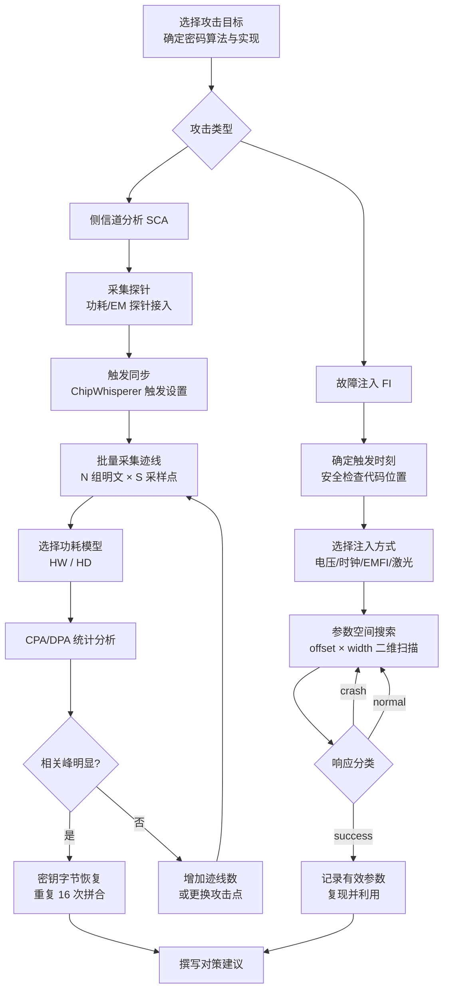
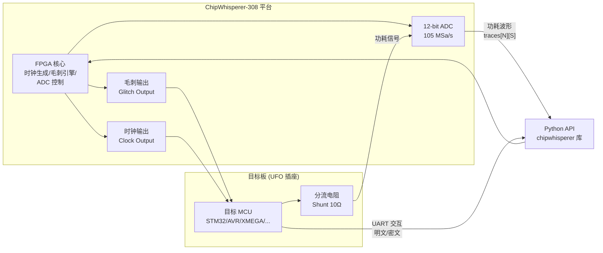

---
tags:
  - 固件
  - IoT
  - tier3
  - 侧信道
  - 硬件安全
---
# 硬件侧信道与故障注入

> [!abstract] TL;DR
> 硬件侧信道攻击（Side-Channel Analysis, SCA）与故障注入（Fault Injection, FI）是突破嵌入式安全边界的两类核心物理手段。SCA 通过观测设备执行密码运算时泄露的功耗、电磁辐射、时序等"旁路"信息，无需直接读取密钥即可恢复秘密数据；FI 则通过向设备注入异常的电压、时钟、电磁或光脉冲，扰乱正常指令执行，从而跳过安全检查、绕过 Secure Boot 或破坏密码比较。两者共同构成了对密码芯片、安全微控制器和 IoT 固件保护机制的最强硬件层攻击手段，理解其原理是设计健壮对策的前提。

## 概述与定位

在嵌入式安全的攻击面层次中，软件漏洞（栈溢出、命令注入等）居于高层，硬件调试接口（JTAG/SWD）居于中层，而侧信道与故障注入则位于最底层——直接对硅芯片的物理执行行为发动攻击。这一层次的攻击具有以下鲜明特征：

**绕过软件防护**：无论固件实现多严密的访问控制、代码签名验证或加密保护，只要密钥或安全判断逻辑在芯片内物理执行，物理层攻击就有可能成立。一颗实施了读出保护（RDP）、禁用了所有调试接口的 STM32 微控制器，仍可能通过电压毛刺恢复出其 Flash 中的固件。

**非破坏性或低破坏性**：功耗分析和电磁分析在不物理改动芯片的前提下即可操作（非侵入式）；电压/时钟毛刺对芯片的损伤风险低（半侵入式）；激光故障注入则需要开封芯片（侵入式），但在学术和安全评估中仍被广泛使用。

**历史背景**：功耗分析攻击（Power Analysis Attack）由 Paul Kocher 等人于 1999 年提出，发表在论文《Differential Power Analysis》中，彻底改变了密码硬件的评估范式。此后数十年，该领域持续发展，催生了差分故障分析（DFA）、相关功耗分析（CPA）、互信息分析（MIA）等大量变种，并形成了标准化的 Common Criteria（CC）评估方法论（AVA_VAN 漏洞分析）和 EMVCo 支付芯片安全认证体系。

**IoT 时代的新意义**：传统侧信道研究以智能卡（JavaCard、EMV 芯片）为主要靶标。随着 IoT 设备大量部署，以 ARM Cortex-M 系列为代表的低端微控制器运行着从 AES 到 ECDSA 的各类密码算法，但设计者往往欠缺专业的侧信道对策知识，使得攻击面大幅扩展。ChipWhisperer 这类开源、低成本的平台更将原本昂贵的评估工具带入了研究者和安全竞赛的视野。

## 原理与机制

### 功耗侧信道：从物理到数学

**物理基础**：CMOS 电路的功耗由两部分主导——静态漏电流功耗（几乎恒定，忽略不计）和动态开关功耗。动态功耗与单位时间内发生翻转（0→1 或 1→0）的晶体管数量正相关，而翻转数量取决于操作数的汉明距离（Hamming Distance, HD）或结果值的汉明重量（Hamming Weight, HW）。

具体而言，若一条总线从值 `a` 变为值 `b`，则翻转的位数为 `HD(a,b) = HW(a XOR b)`。对于纯 CMOS 实现，功耗大致正比于 HD；而若总线预充电（如 precharge-to-zero 架构），则功耗正比于 HW(b)——即目标数据本身的比特数。在实际采集的功耗波形中，这种相关性在噪声中若隐若现，却可通过统计方法放大。

**简单功耗分析（SPA, Simple Power Analysis）**：SPA 通过直接观测单条（或少量）功耗迹线来推断操作。例如 RSA 的平方-乘法（Square-and-Multiply）算法：每个密钥比特若为 0 则只执行 Square，若为 1 则执行 Square 和 Multiply，两者在功耗波形上呈现不同的时间轮廓，直接可见。SPA 要求波形质量高、信噪比好，实际操作中常见于 ECC 点乘的标量比特泄露。

**差分功耗分析（DPA, Differential Power Analysis）**：DPA 是经典的统计攻击，步骤如下：

1. 采集大量（通常数百至数千条）带有不同明文的功耗迹线 `t_1, t_2, ..., t_N`
2. 猜测密钥字节的某个候选值 `k'`
3. 对每条迹线，利用 `k'` 和已知明文 `p_i` 计算中间值 `v_i = SubBytes(p_i XOR k')`（以 AES 第一轮为例）
4. 根据预测的功耗模型（HW 或 HD），将迹线划分为高功耗组（`D1`）和低功耗组（`D0`）
5. 对两组迹线求均值之差 `ΔP(t) = mean(D1) - mean(D0)`
6. 若 `k'` 正确，则在特定时刻 `t*`（即中间值被写入总线的时刻）会出现显著的功耗差异峰值；否则峰值应接近零

**相关功耗分析（CPA, Correlation Power Analysis）**：CPA 是 DPA 的改进版，效率更高。其核心在于用皮尔逊相关系数替代均值差：

```
r(k', t) = pearsonr(H(v_i), P_i(t))
```

其中 `H(v_i)` 是预测的功耗模型值（如 HW），`P_i(t)` 是时刻 `t` 的实测功耗采样。正确密钥猜测会使 `r` 在泄露时刻接近 ±1，错误猜测产生接近 0 的相关性。CPA 比 DPA 更高效（所需迹线更少），也更适合实际实现中的噪声环境。

**汉明重量模型的 AES 第一轮攻击**：以攻击 AES-128 的第一轮密钥为例：

```
target = SubBytes(plaintext[byte_index] XOR key[byte_index])
hypothetical_power = HW(target)  # 汉明重量模型
```

对于 16 字节密钥的每个字节，穷举 256 个候选值，分别计算相关系数，相关峰最高的候选即为该字节密钥。16 个字节独立攻击后拼合得到完整 128 位密钥，总计算量远低于暴力穷举 `2^128`。

**高阶 DPA（HO-DPA）**：针对一阶掩码（masking）对策设计。一阶掩码将秘密值 `s` 拆分为 `s = s' XOR m`（`m` 为随机掩码），使单个中间值不再泄露 `s` 的信息。HO-DPA 通过同时观测两个时刻（分别处理 `s'` 和 `m` 的时刻），利用两阶矩（如积或绝对差均值）组合两点泄露，绕过一阶掩码。

### 电磁侧信道（EM Side-Channel）

电磁侧信道的物理原理与功耗分析相同（均源于电流变化产生的磁场）但具有重要差异：

- **局部性**：EM 探针（微型线圈，直径 50μm–500μm）可定位到芯片特定区域采集信号，而功耗测量采集整个芯片的电流。这种局部性使得 EM 攻击有时对小尺寸目标（如单个运算单元）信噪比更优，甚至可以区分多核处理器的不同核心。
- **非接触性**：不需要在电源引脚串入测量电阻（shunt resistor），适用于目标设备无法直接接触电源线的场景。
- **电磁故障注入（EMFI）**：同一探针通过施加大电流脉冲，也可实施故障注入——详见后文。

采集 EM 信号的典型装置包括：手工绕制的空心线圈探针、商业 EM 探针（如 Langer RF 系列）、配合 XYZ 移动平台做空间扫描（EM Mapping）以定位最敏感区域。

### 时序侧信道

时序攻击（Timing Attack）利用密码运算的执行时间依赖于秘密数据这一事实。典型场景：

**非常数时间比较（Non-Constant-Time Comparison）**：若 `strcmp()` 或 MAC 比较函数在遇到第一个不匹配字节时立即返回，则返回时间与共同前缀长度正相关，攻击者可逐字节猜测正确值，将 `O(2^n)` 的暴力搜索降至 `O(n * 256)`。

**RSA 私钥指数的时序泄露**：早期 OpenSSL 的 RSA 实现（pre-0.9.7）因模幂运算使用了数据依赖分支，导致不同私钥对应不同时序，通过网络时序测量即可实施攻击（Brumley & Boneh, 2003）。嵌入式设备上网络时序噪声更小，攻击更易实施。

**缓存时序攻击**：主要针对处理器缓存行为的泄露。在嵌入式 Cortex-A（带 MMU 和 Cache）上，AES S-Box 查表可能导致依赖密钥的缓存命中/失效模式（Bernstein 攻击的变种）。Cortex-M（通常无 Cache）受此攻击影响较小，但部分高端 Cortex-M7 带缓存。

### 故障注入：扰乱正常执行

故障注入的目标是在特定时刻使处理器执行出错，产生以下效果之一：

1. **指令跳跃（Instruction Skip）**：使处理器跳过某条关键指令，如跳过 `if (auth_failed) goto error;`
2. **操作数损坏（Operand Corruption）**：使寄存器或内存中的值发生随机翻转，用于差分故障分析（DFA）以恢复密钥
3. **分支结果翻转（Branch Flip）**：使条件跳转的结果取反，例如使 `BEQ` 在 ZF=0 时跳转
4. **复位跳过（Reset Skip）**：某些安全检查触发软复位，毛刺可使复位指令无效

**电压毛刺（Voltage Glitching）**：通过在目标芯片的 VCC 电源线上叠加一个极短暂（数十至数百纳秒）的负脉冲（下拉或短接到 GND），使处理器的工作电压短暂跌落。SRAM 和触发器对电压敏感，适当的毛刺宽度和深度可使单个时钟周期内的操作产生错误，而不导致整体复位。

关键参数：毛刺宽度（glitch width）通常为 1–10 个处理器时钟周期；毛刺偏移（glitch offset）决定毛刺相对于触发点的精确时序，需要通过参数空间搜索（Parameter Space Exploration）确定有效窗口。

**时钟毛刺（Clock Glitching）**：通过短暂插入额外的时钟边沿或删除一个时钟周期，使处理器的时序约束被违反。组合逻辑来不及稳定即被采样，导致计算结果错误。相比电压毛刺，时钟毛刺精度更高，因为时钟是全局同步信号；但对于内部 RC 振荡器运行、时钟源不可控的目标则无效。

实现方式：用 FPGA 生成受控时钟信号，直接替换目标板晶振或注入到时钟引脚。ChipWhisperer 的 FPGA 核心可产生亚纳秒级精度的时钟毛刺。

**电磁故障注入（EMFI, ElectroMagnetic Fault Injection）**：通过微型探针在芯片表面上方施加强磁脉冲，在芯片内部感应涡流，扰动特定区域的操作。EMFI 的优势在于：无需物理连接电源引脚；通过 XYZ 移动平台可选择注入位置；某些情况下可穿透封装直接作用于裸片（但效果弱于激光）。Riscure 的 Spider 和 EM-FI Transient Probe 是商业 EMFI 工具的代表。

**激光故障注入（Laser Fault Injection, LFI）**：精度最高的故障注入手段，但需要开封（decapsulate）芯片。激光光子轰击芯片内部的晶体管，在局部产生瞬态电流，导致特定存储单元（SRAM bit、寄存器位）翻转。LFI 可定位到单个存储单元级别的精度，是评估最高安全等级（如 CC EAL6+）芯片的标准手段。反向侧（backside）LFI 可穿透硅底板（衬底）攻击，无需正面开封。

### AES 密钥恢复的完整 DPA/CPA 流程

以 ChipWhisperer 平台攻击运行 AES-128 的 STM32F0 为例，完整流程如下：

1. **目标准备**：目标板运行 AES 加密程序，加密已知明文，触发引脚在加密开始时产生上升沿
2. **触发同步**：ChipWhisperer CW308 采集板监听触发引脚，在触发后立即采集功耗波形
3. **批量采集**：对 N 组不同明文（通常 1000–5000 组）各采集一条功耗迹线，存储为矩阵 `T[N × S]`（`S` 为采样点数）
4. **攻击第一轮**：对第一个密钥字节（`key[0]`）枚举 256 个候选值 `k' ∈ [0, 255]`
5. **假设功耗计算**：`H[i, k'] = HW(AES_SBOX[plaintext[i][0] XOR k'])` 计算假设功耗矩阵
6. **相关系数矩阵**：计算 `R[k', t] = pearsonr(H[:, k'], T[:, t])` 对所有候选和时刻求相关
7. **峰值定位**：找到使 `max(|R[k', t]|)` 最大的候选 `k'*`，即为正确密钥字节
8. **重复 16 次**：对 16 个字节分别执行步骤 4–7，拼合得到完整密钥

所需迹线数量与信噪比（SNR）和泄露模型精度成反比。在无对策的裸机 AES 上，通常数百条迹线即可实现完整密钥恢复。

## 结构/算法/伪代码详解

### CPA 攻击核心算法

```python
import numpy as np

def cpa_attack(traces: np.ndarray, plaintexts: np.ndarray,
               byte_index: int) -> tuple[int, float]:
    """
    CPA 攻击单个密钥字节。
    
    参数：
        traces:     (N, S) 形矩阵，N 条迹线，每条 S 个采样点
        plaintexts: (N, 16) 形矩阵，N 组 16 字节明文
        byte_index: 攻击第几个密钥字节（0–15）
    
    返回：
        (best_key_byte, max_correlation)
    """
    N, S = traces.shape
    AES_SBOX = _aes_sbox()  # 256 元素查找表
    
    best_key = -1
    best_corr = 0.0
    
    for k_guess in range(256):
        # 1. 计算假设中间值并取汉明重量
        mid_vals = AES_SBOX[plaintexts[:, byte_index] ^ k_guess]  # (N,)
        hw = np.array([bin(v).count('1') for v in mid_vals])       # (N,)
        
        # 2. 与每个采样点计算皮尔逊相关系数
        # 向量化实现：一次计算所有时刻
        hw_centered = hw - hw.mean()
        hw_std = hw.std()
        if hw_std == 0:
            continue
        
        traces_centered = traces - traces.mean(axis=0, keepdims=True)
        traces_std = traces.std(axis=0)
        
        # corr shape: (S,)
        corr = (hw_centered @ traces_centered) / (N * hw_std * (traces_std + 1e-12))
        
        # 3. 取最大绝对相关
        peak = np.max(np.abs(corr))
        if peak > best_corr:
            best_corr = peak
            best_key = k_guess
    
    return best_key, best_corr


def recover_full_key(traces: np.ndarray,
                     plaintexts: np.ndarray) -> bytes:
    """恢复 AES-128 全部 16 字节密钥。"""
    key = bytearray(16)
    for i in range(16):
        k_byte, corr = cpa_attack(traces, plaintexts, i)
        key[i] = k_byte
        print(f"key[{i:02d}] = {k_byte:02X}  (corr = {corr:.4f})")
    return bytes(key)
```

### 电压毛刺参数搜索伪代码

```python
def voltage_glitch_search(target_fn, trigger_delay_range, glitch_width_range):
    """
    电压毛刺参数空间搜索。
    
    target_fn: 与目标板交互的函数，返回 (response, fault_type)
    fault_type: 'success' / 'crash' / 'normal' / 'timeout'
    """
    results = []
    
    for offset in sweep(trigger_delay_range, step=1):    # 单位：时钟周期
        for width in sweep(glitch_width_range, step=1):  # 单位：时钟周期
            
            # 配置 ChipWhisperer glitch 参数
            cw.glitch.ext_offset = offset
            cw.glitch.width = width
            
            # 触发目标执行并采集结果
            response, fault_type = target_fn()
            
            results.append({
                'offset': offset, 'width': width,
                'fault_type': fault_type, 'response': response
            })
            
            if fault_type == 'success':
                print(f"[GLITCH] Fault injected! offset={offset}, width={width}")
                print(f"         Response: {response.hex()}")
    
    return results
```

### 时序测量与非常数时间比较攻击

```python
import time

def timing_oracle(target_url: str, guess: bytes) -> float:
    """向目标发送猜测，测量响应时间。"""
    start = time.perf_counter_ns()
    response = send_request(target_url, guess)
    elapsed = time.perf_counter_ns() - start
    return elapsed

def byte_by_byte_timing_attack(target_url: str, secret_length: int,
                                charset: bytes, num_trials: int = 50) -> bytes:
    """
    针对非常数时间 MAC 比较的逐字节时序攻击。
    对每个候选字节取多次测量的中值，减小网络抖动影响。
    """
    recovered = bytearray()
    
    for pos in range(secret_length):
        timings = {}
        for candidate in charset:
            # 构造带当前猜测的前缀
            guess = bytes(recovered) + bytes([candidate]) + b'\x00' * (secret_length - pos - 1)
            
            # 多次测量取中值
            times = [timing_oracle(target_url, guess) for _ in range(num_trials)]
            timings[candidate] = sorted(times)[num_trials // 2]  # 中值
        
        # 时间最长的候选最可能是正确字节（匹配字节数最多）
        best = max(timings, key=timings.get)
        recovered.append(best)
        print(f"pos[{pos}] = {best:02X} ({chr(best) if 32 <= best < 127 else '?'})")
    
    return bytes(recovered)
```

### 典型攻击流程 Mermaid 图



### ChipWhisperer 平台结构



### 安全启动绕过的故障注入链

典型的基于电压毛刺绕过 STM32 RDP（Read-Out Protection）Level 1 的攻击（已修复，仅供对策研究）大致原理如下：

```
攻击目标：STM32F1xx 的 Option Bytes 读保护检查

时序：
  T=0：设备上电复位
  T≈100μs：BootROM 执行，读取 Option Bytes 判断 RDP 级别
  T≈110μs：<-- 注入毛刺时刻（精确到数百纳秒窗口）
  T≈120μs：RDP 检查跳过，继续执行 Flash 读操作

效果：
  正常流程：BootROM 发现 RDP=0xBB，禁止 SRAM 调试/读Flash
  毛刺后：  RDP 读取或比较结果损坏，误认为 RDP=0xAA（未设保护）
            BootROM 继续允许 Flash 读操作
            攻击者通过 UART BootROM 接口 dump 完整 Flash
```

此类漏洞已经通过 ST 的硬件修订或更高安全级别（RDP Level 2，一次性写入）被修复，但它完美说明了为何软件层的访问控制必须辅以硬件对策。

## 工具视角与实战

### ChipWhisperer 平台详解

ChipWhisperer 是 NewAE Technology 开发的开源侧信道与故障注入平台，由硬件和 Python 库两部分组成，是学术研究和 IoT 安全评估的事实标准低成本工具。

**硬件系列**：
- **CW-Lite（CWLITE）**：入门款，集成 FPGA（Spartan 6）、12-bit 105 MSa/s ADC 和毛刺引擎，通过 USB 连接 PC。配套 XMEGA、STM32F3 目标板，约 500 美元级别。
- **CW-Pro**：专业款，增加更高性能 ADC（200 MSa/s）、串行总线嗅探、DDR 存储缓冲，适合工业评估。
- **CW308 UFO Board**：通用目标板框架，支持插卡式目标板（STM32、AVR、ATSAM、RISC-V 等数十种），可与 CW-Lite/Pro 配合。
- **CW Husky**：最新款，FPGA 升级、更高精度 ADC、改进的时序精度。

**关键 Python API**：

```python
import chipwhisperer as cw
import chipwhisperer.analyzer as cwa

# 连接设备
scope = cw.scope()
target = cw.target(scope, cw.targets.SimpleSerial2)

# 配置时钟（目标 MCU 的工作频率）
scope.clock.clkgen_freq = 7.37e6   # 7.37 MHz
scope.clock.adc_src = "clkgen_x4" # ADC 以目标时钟 4x 采样

# 配置采集窗口
scope.adc.samples = 5000           # 每条迹线采样 5000 点
scope.adc.offset = 0               # 触发后 0 个周期开始采集
scope.adc.basic_mode = "rising_edge"

# 配置毛刺（电压毛刺模式）
scope.glitch.clk_src = "clkgen"
scope.glitch.output = "enable_only"  # 仅在毛刺期间输出低电平
scope.glitch.trigger_src = "ext_single"
scope.glitch.ext_offset = 1500        # 触发后 1500 个周期注入
scope.glitch.width = 10               # 毛刺宽度 10 个时钟周期（约 1.36 μs）

# 批量采集迹线
traces = []
texts = []
for i in range(1000):
    text = cw.randword(16)
    target.simpleserial_write('p', bytearray(text))
    scope.arm()
    ret = scope.capture()
    if not ret:  # 未超时
        traces.append(scope.get_last_trace())
        texts.append(text)

# 转 numpy 数组进行分析
import numpy as np
traces = np.array(traces)
texts = np.array(texts)

# 调用 CPA 分析
leak = cwa.leakage_models.sbox_output
attack = cwa.cpa()
attack.run(project)
```

**触发与同步**：精确的触发是侧信道采集的核心问题。常见触发方式：

1. **GPIO 触发**：目标固件在密码运算开始前/后拉高/低一个 GPIO 引脚，ChipWhisperer 监测该引脚电平变化触发采集。需要修改目标固件，但精度最高。

2. **SAD 触发（Sum of Absolute Differences）**：ChipWhisperer 在功耗迹线上实时寻找与参考片段匹配的位置自动触发。无需修改固件，适合黑盒目标。CW-Pro 和 CW-Husky 支持此功能。

3. **UART 触发**：监测 UART 传输特定字节序列后触发，常见于目标通过 UART 接收明文并立即开始加密的场景。

### Riscure Inspector 与商业评估工具

Riscure Inspector 是商业级 SCA/FI 评估平台，用于 CC AVA_VAN 等级评估：

- **Inspector SCA**：支持 DPA/CPA/MIA 等多种攻击方法，波形管理、统计分析、频域分析（DEMA）一体化
- **Inspector FI**：电压毛刺控制器（VCGlitcher）、EMFI 控制器（Spider）、激光台集成
- **Riscure EM Probe Station**：专业 XYZ 移动台 + 自动扫描，EM 场图可视化（EMVScan）

其他相关工具：
- **picoscope**：高带宽示波器，配合自定义触发，用于手工功耗采集
- **lascar**：Python 侧信道分析库（已开源），与 ChipWhisperer 无关但兼容 numpy 数组格式
- **scared**：eShard 开源的 Python SCA 框架，支持 CPA/MIA/NICV（Normalized Inter-Class Variance）

### 实战案例：攻击 nRF52 BLE SoC 的 AES 实现

Nordic Semiconductor nRF52 系列是 IoT BLE 设备的热门 SoC，内置硬件 AES 加速器（AES ECB/CCM）。攻击思路：

1. **目标**：恢复 BLE Link Layer 使用的 LTK（Long-Term Key，用于 BLE 数据加密）
2. **物理接入**：在 VCC 引脚串入 10Ω 分流电阻，连接 ChipWhisperer ADC 差分输入
3. **触发**：修改固件在 `NRF_ECB->TASKS_STARTECB` 写入时拉高 GPIO（或使用 SAD 触发）
4. **采集**：硬件 AES 的运算时间约 16 个时钟周期（单轮 0.1μs@16MHz），采集窗口 200 个采样点即够
5. **分析**：硬件 AES 的功耗泄露较软件实现更弱（硬件并行、物理布局均匀），通常需要更多迹线（5000–20000）
6. **结果**：成功 CPA 恢复 LTK 后，可被动解密已录制的 BLE 通信

此案例说明即使是硬件加速的密码运算也存在侧信道风险，除非实施了特定的掩码或屏蔽设计。

### 电压毛刺绕过 Secure Boot 实战框架

对于目标 MCU 存在签名验证逻辑的场景，毛刺攻击流程：

1. **静态分析**：反编译 BootROM 或 Bootloader，定位签名验证函数（如 `RSA_verify`、`ECDSA_verify` 或自定义哈希比较）
2. **识别关键时刻**：通过功耗预分析（观察 BootROM 执行阶段的功耗轮廓），识别验证函数执行的时间范围
3. **粗粒度扫描**：以 100 周期步长扫描 `ext_offset`，同时以较大 `width` 扫描，关注 crash/success 的比例变化
4. **细粒度确认**：在粗粒度找到的有效区间内以 1–5 周期步长精化，确定成功率最高的参数
5. **结果评估**：若目标返回"boot successful"或进入操作系统，则毛刺注入成功

## 安全性与正确使用

> [!caution]
> **侧信道分析与故障注入属于物理层攻击技术，仅合法用途包括**：
> - 对**自有设备**或**产品原型**进行安全评估
> - 在正式**书面授权**下对第三方设备开展渗透测试
> - 学术研究机构在受控实验室环境中的科研工作
> - 符合 Common Criteria、FIPS 140-3、EMVCo 等标准的产品安全认证评估
>
> **严禁将本文技术用于**：未经授权的他人设备；绕过商业产品（智能卡、支付终端、游戏机）的版权或访问控制保护；任何目的在于未授权访问、数据窃取或知识产权侵犯的行为。
>
> 本文重点在于**帮助防御者理解攻击原理以设计有效对策**，所有实战步骤描述均以公开学术文献和已修复漏洞为基础，不提供针对在售商业产品的完整可落地利用方案。

### 对策设计：掩码（Masking）

掩码是抵抗功耗分析的最成熟软件对策，核心思想是用随机数打破中间值与功耗的相关性。

**布尔掩码（Boolean Masking）**：将秘密值 `s` 表示为 `s' = s XOR m`，其中 `m` 为随机掩码。所有后续运算在掩码域进行，只有在最终输出前才去掩。

对于 AES，挑战在于 SubBytes（S-Box）是一个非线性操作（GF(2^8) 上的求逆），在布尔掩码域中不能简单通过 XOR 传播。主要解决方案：

- **掩码 S-Box 查表**：为每个随机掩码值预计算对应的掩码 S-Box 表（即 `masked_sbox[x] = sbox[x XOR m_in] XOR m_out`），在线操作只需查表。代价：需要 16 张 256B 表（或更大的共享表），增加内存开销；且 S-Box 预计算本身也可能泄露，需要对预计算过程也做保护。
- **算术域转换**：将布尔掩码转换为算术掩码（`s = s' + m mod 2^n`）以支持加法运算，再转换回来进行 XOR 操作，代价是转换本身的功耗泄露。
- **门级掩码（Threshold Implementation, TI）**：基于秘密共享的硬件掩码方案，通过将每个逻辑门的输入/输出分成多个份额（shares），保证一阶功耗泄露为零。TI 是当前硬件 AES 掩码的主流方法，代价是面积倍增（2–3 份额需要 2–3 倍逻辑资源）。

**高阶掩码**：为对抗高阶 DPA，需要 d+1 阶掩码抵抗 d 阶攻击，代价随阶数指数增长。

### 对策设计：隐藏（Hiding）

隐藏通过减少功耗的信息内容或使泄露时刻随机化，增加攻击难度：

- **随机插入伪操作（Dummy Operations）**：在密码运算中随机插入无用的计算（执行真实 SubBytes 操作但丢弃结果），使泄露时刻在迹线上的位置随机化。攻击者需要对齐迹线（trace alignment）才能有效分析。
- **随机化执行顺序（Shuffling）**：随机打乱 AES 各字节的处理顺序（16 个 SubBytes 操作的顺序随机化），使同一密钥字节在不同次运行中出现在不同采样时刻。
- **均衡功耗（Power Equalization）**：使用不依赖数据的固定功耗电路（WDDL, Wave Dynamic Differential Logic），或在软件中对每个操作添加互补操作使总翻转数恒定。

### 对策设计：常数时间实现（Constant-Time）

针对时序攻击，所有密码路径必须在不依赖秘密数据的情况下执行相同数量的操作：

```c
/* 错误：非常数时间 MAC 验证 */
int mac_verify_unsafe(const uint8_t *expected, const uint8_t *actual, size_t len) {
    for (size_t i = 0; i < len; i++) {
        if (expected[i] != actual[i]) return 0;  // 提前返回泄露信息
    }
    return 1;
}

/* 正确：常数时间 MAC 验证 */
int mac_verify_ct(const uint8_t *expected, const uint8_t *actual, size_t len) {
    volatile uint8_t diff = 0;
    for (size_t i = 0; i < len; i++) {
        diff |= expected[i] ^ actual[i];  // 累积所有差异，不提前退出
    }
    return diff == 0;  // 仅在全部比较后返回结果
}
```

注意：`volatile` 修饰符在嵌入式 C 中防止编译器将循环优化为提前退出。但编译器的激进优化（如 LTO）仍可能破坏常数时间保证，建议配合 `__attribute__((noinline))` 和汇编实现关键路径，或使用 `timingsafe_bcmp()`（OpenBSD libc 提供）。

### 对策设计：故障注入对策

**冗余执行（Redundant Computation）**：关键操作执行两次，比较结果一致后才继续：

```c
int verify_signature(const uint8_t *sig, const uint8_t *data) {
    int result1 = _ecdsa_verify(sig, data);
    int result2 = _ecdsa_verify(sig, data);  // 冗余验证
    
    if (result1 != result2) {
        // 两次结果不一致：可能发生了故障注入
        security_halt();  // 进入安全停机状态
    }
    return result1 && result2;  // 两次都必须通过
}
```

**传感器与监控（Sensors）**：硬件级故障检测器，常见于高安全微控制器（如 Infineon SLB9XX、NXP SE05x）：
- **电压传感器**：检测 VCC 超出正常范围（± 10%）时触发复位或锁定
- **时钟频率传感器**：检测时钟频率突变（毛刺导致频率异常）
- **温度传感器**：异常低温（液氮冷却）会改变半导体特性，辅助某些攻击
- **光传感器**：检测开封后的激光注入（封装内集成光敏二极管阵列）

**安全标志与看门狗**：确保代码路径中不可能因跳指令而跳过关键安全检查：

```c
/* 安全标志模式：强制执行路径验证 */
#define FLAG_INIT     0xDEAD0000
#define FLAG_CHECK1   0xDEAD0001
#define FLAG_CHECK2   0xDEAD0002
#define FLAG_COMPLETE 0xDEAD0003

volatile uint32_t security_flag = FLAG_INIT;

void secure_boot_verify(void) {
    security_flag = FLAG_INIT;
    
    if (!check_signature()) goto boot_fail;
    security_flag = FLAG_CHECK1;  // 必须到达此点
    
    if (!verify_hash()) goto boot_fail;
    security_flag = FLAG_CHECK2;  // 必须到达此点
    
    if (!check_version()) goto boot_fail;
    security_flag = FLAG_COMPLETE;
    
    /* 最终检查：标志必须经过所有步骤 */
    if (security_flag != FLAG_COMPLETE) goto boot_fail;
    
    boot_application();
    return;
    
boot_fail:
    security_halt();  // 不可恢复的安全停机
}
```

若故障注入跳过了任何一步，`security_flag` 将不是预期的 `FLAG_COMPLETE`，最终检查将捕获异常。

**RDP Level 2（一次性写入）**：对于 STM32 类 MCU，选择最高读出保护级别（RDP Level 2）会将熔丝永久写入，任何电压毛刺都无法将其改回（因为 Level 2 的判断逻辑在不同位置且有冗余），是防止 Flash 提取的最终手段。代价是设备不可调试、不可恢复。

### NICV 与 TVLA：泄露评估方法

在设计了对策之后，如何验证其有效性？两种标准化测试：

**NICV（Normalized Inter-Class Variance）**：
```
NICV(t) = var_class(E[trace(t) | class]) / var(trace(t))
```
NICV 在区分不同明文类的时刻会产生峰值，峰值位置揭示泄露的采样点。对比加对策前后的 NICV 曲线可评估对策效果。

**TVLA（Test Vector Leakage Assessment）**：
使用 Welch t-test 检验两组迹线（固定明文组 vs 随机明文组）的均值是否有显著差异：
```
t(t) = (mean_fixed(t) - mean_random(t)) / sqrt(var_fixed(t)/N_f + var_random(t)/N_r)
```
`|t| > 4.5`（对应 99.999% 置信度）视为存在一阶泄露。TVLA 是 FIPS 140-3 和 EMVCo 认证的标准测试方法，不依赖具体攻击假设，是通用泄露评估工具。

## 小结

硬件侧信道攻击与故障注入代表了嵌入式安全中的物理层对抗前沿。功耗分析（SPA/DPA/CPA）通过统计方法从噪声中提取密钥信息，AES 密钥恢复在无对策设备上仅需数百条迹线即可实现；电磁侧信道提供了非接触式的局部化攻击手段；时序攻击以极低成本利用实现缺陷。故障注入（电压、时钟、EMFI、激光）则通过扰乱正常执行流程，绕过 Secure Boot 验证、破坏密码操作完整性或跳过访问控制检查。ChipWhisperer 将这些技术带入了低成本开源工具范畴，显著降低了评估门槛。

应对这些攻击的对策涵盖软件层（掩码、常数时间实现、冗余校验、安全标志）和硬件层（传感器、均衡逻辑、TI 硬件掩码、最高 RDP 级别）。理解攻击原理是有效设计对策的前提；泄露评估（NICV/TVLA）提供了量化验证对策效果的科学方法。对于安全等级要求高的 IoT 设备（支付终端、工业控制、汽车 ECU），物理层攻击评估应作为产品开发的必要环节，而非事后补救措施。

## 相关阅读

- [ChipWhisperer 官方文档与教程](https://chipwhisperer.readthedocs.io/)：完整的硬件平台文档和实验教程，从入门到 AES CPA 全流程
- Kocher, P., Jaffe, J., Jun, B. (1999). *Differential Power Analysis.* CRYPTO 1999. — DPA 奠基论文
- Brier, E., Clavier, C., Olivier, F. (2004). *Correlation Power Analysis with a Leakage Model.* CHES 2004. — CPA 原创论文
- Mangard, S., Oswald, E., Popp, T. (2007). *Power Analysis Attacks: Revealing the Secrets of Smart Cards.* Springer. — 侧信道领域最权威教材
- Tiri, K., Verbauwhede, I. (2004). *A Logic Level Design Methodology for a Secure DPA Resistant ASIC or FPGA Implementation.* DATE 2004. — WDDL 硬件对策
- Nikova, S., Rechberger, C., Rijmen, V. (2006). *Threshold Implementations Against Side-Channel Attacks and Glitches.* ICICS 2006. — TI 掩码方案
- [Riscure 技术博客](https://www.riscure.com/blog/)：专业评估实验室的技术文章，涵盖最新的 SCA/FI 研究
- Bar-El, H. 等 (2006). *The Sorcerer's Apprentice Guide to Fault Attacks.* Proceedings of the IEEE. — 故障注入综述
- [TVLA 规范文档](https://csrc.nist.gov/publications)：FIPS 140-3 相关测试向量泄露评估方法论

[[00.固件与IoT嵌入式逆向总览|⬆ 系列总览]] | [[16.SDR与射频信号逆向|← 上一章]] | [[18.工业控制协议逆向|→ 下一章]]
