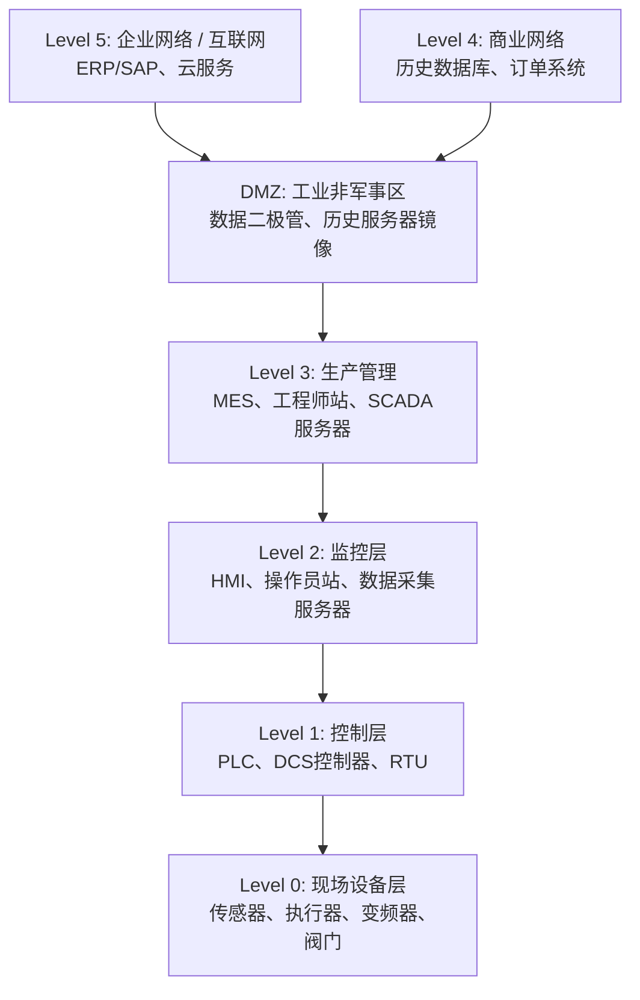
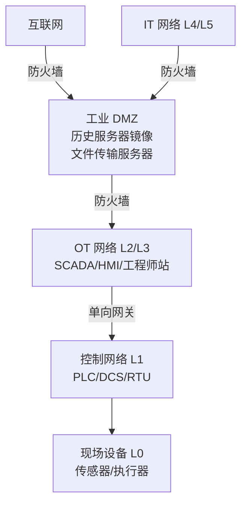

---
tags:
  - 固件
  - IoT
  - tier3
  - 工业协议
  - ICS
---
# 工业控制协议逆向（Modbus/DNP3/OPC-UA/S7）

> [!abstract] TL;DR
> 工业控制系统（ICS/SCADA）所用的通信协议与消费级 IoT 在设计哲学上截然不同：确定性实时、高可用冗余、物理后果严重，但同时伴随着几十年的历史包袱——明文无认证、私有协议栈、封闭生态。本章系统梳理 Purdue 模型分层、Modbus/DNP3/OPC-UA/S7comm/Profinet 等主流工控协议的报文结构与逆向方法，剖析 PLC 梯形图固件分析流程，结合 Stuxnet 等真实案例讲解安全隐患，最后给出网络分段、单向网关、工控 IDS 等防御思路。掌握本章内容是进行 ICS 安全研究、OT 网络渗透测试（须授权）和工控设备固件审计的核心基础。

## 概述与定位

### 工业控制系统的独特性

工业控制系统（Industrial Control Systems, ICS）是运行电厂、水处理厂、石油管道、制造产线、核设施等物理基础设施的核心神经。它与消费级 IoT 或企业 IT 的根本区别在于：

**确定性与实时性**：PLC 的扫描周期通常在 1–100 ms 量级，控制回路必须在严格的时间窗口内完成采样-计算-输出，协议延迟超限可能导致物理设备失控。Modbus RTU 在 RS-485 上的轮询时序、Profinet IRT 的等时同步通信，都是为实时确定性而设计的。

**可用性优先**：在 CIA 三角中，OT（Operational Technology）世界将可用性（Availability）置于最高位。系统宁可带病运行，也不能轻易停机——一条化工管线停产一小时的损失可达数百万美元，核电站的控制中断则可能引发安全事故。这直接导致补丁更新极为保守，许多系统运行着 Windows XP/2003 甚至更老的操作系统，Modbus 设备的固件可能十年未更新。

**物理后果**：OT 网络的攻击后果不止于数据泄露，而是可能造成管道爆炸、大规模停电、化学品泄漏等物理灾难。Stuxnet 通过篡改西门子 S7 PLC 的离心机控制参数，摧毁了伊朗纳坦兹核设施约 1000 台离心机，是迄今最具代表性的 ICS 攻击案例。

**协议历史包袱**：Modbus 诞生于 1979 年，DNP3 于 1993 年标准化，设计之初完全不考虑安全性——网络隔离被视为唯一的安全手段。随着工业以太网和工业互联网的普及，这些协议被暴露在更广泛的网络威胁之下，其先天缺陷（无认证、明文传输、无完整性校验）变得极为危险。

### 与消费级 IoT 逆向的方法论差异

本系列第 09 章已覆盖 MQTT/CoAP/Zigbee/BLE 等消费级 IoT 协议的逆向方法，工控协议逆向在以下维度存在本质差异：

| 维度 | 消费级 IoT | 工控 ICS/SCADA |
|------|-----------|--------------|
| 抓包环境 | 可随时 replay/fuzz | 生产环境绝对禁止；需离线/仿真环境 |
| 协议文档 | 私有居多，需盲逆向 | 多数有公开标准，但私有扩展普遍 |
| 设备可用性 | 可随意断电重启 | 停机代价极高，测试需协调维护窗口 |
| 物理访问 | 通常可拆机 | 工控现场访问受严格限制 |
| 安全机制 | TLS/DTLS/OSCORE | 多数无认证，安全扩展各自为政 |
| 逆向参照 | 开源固件对比 | 工程软件（STEP 7/Studio 5000）作为参照 |

工控协议逆向的核心方法是：**用工程软件生成已知操作，用抓包工具捕获对应报文，通过已知-明文对照解析私有字段**。这与消费级 IoT 的盲逆向路线截然不同。

## 原理与机制

### Purdue 模型：ICS 的分层体系

Purdue 参考模型（也称 ISA-95 / ISA-99）将 ICS 网络划分为 5 个层次，是理解工控网络流量的基本框架：



- **Level 0（现场设备层）**：物理传感器（温度计、压力计、流量计）和执行器（电机、阀门、泵）。这一层的通信介质可能是 4–20 mA 模拟电流信号、HART 协议、Profibus DP，或直接的数字 I/O 线。
- **Level 1（控制层）**：PLC（可编程逻辑控制器）、DCS（分布式控制系统）控制器、RTU（远程终端单元）。这是工控协议最密集的层，Modbus、Profibus、DeviceNet、CANopen、EtherNet/IP 都在这一层运行。
- **Level 2（监控层）**：HMI（人机界面）和 SCADA（数据采集与监控）服务器。操作员通过 HMI 查看过程状态、发送控制指令。OPC-UA 常在 L1-L2 接口使用。
- **Level 3（生产管理层）**：工程师站、MES（制造执行系统）、历史数据库（如 OSIsoft PI、Wonderware Historian）。工程师在这里上传 PLC 程序、配置 HMI 画面。
- **DMZ（工业非军事区）**：用于在 OT 和 IT 网络之间传递数据而不直接打通路由。数据二极管（单向网关）、DMZ 历史服务器等都部署在这里。
- **Level 4/5（企业/互联网层）**：传统 IT 域，ERP、云服务等。

逆向分析中，流量分层意义重大：L1 的 Modbus 轮询是高频、确定性的短帧；L2 的 OPC-UA 订阅则是长连接、事件驱动的 XML/二进制流；L3 的工程软件通讯（如 S7comm PUT/GET）携带完整的程序块。不同层的流量特征差异显著，抓包时需要明确自己在哪一层工作。

### 关键设备角色详解

**PLC（可编程逻辑控制器）**：工控世界的 CPU。执行用户编写的控制程序（梯形图/功能块图/结构化文本），扫描输入信号，执行逻辑，驱动输出。主流厂商：西门子（S7-1200/S7-1500/S7-300/S7-400）、罗克韦尔自动化（Allen-Bradley ControlLogix/CompactLogix）、施耐德（Modicon M340/M580）、欧姆龙、三菱。每家厂商都有专有的编程软件和通信协议。

**RTU（远程终端单元）**：分布在地理上分散的现场站点（油井、变电站、气象站），通过串口或低速网络与 SCADA 中心通信。DNP3 是 RTU 的主流通信协议。RTU 通常资源极为有限，固件运行在裸机或简单 RTOS 上。

**DCS（分布式控制系统）**：与 PLC 不同，DCS 是面向过程控制（连续流程，如化工、石化、造纸）的整体解决方案。主流厂商：霍尼韦尔（Experion PKS）、艾默生（DeltaV）、ABB（800xA）、西门子（PCS7）。DCS 内部通常使用私有的高速现场总线（如 Profibus DP、FOUNDATION Fieldbus），外部接口越来越多采用 OPC-UA。

**HMI（人机界面）**：运行在 Windows 工控机上的 SCADA 客户端软件（如 WinCC、FactoryTalk View、Wonderware InTouch），通过 OPC-UA 或私有协议连接到 L1 控制器。HMI 软件本身运行在操作系统上，其二进制可逆向分析，且常包含硬编码凭证、私有协议实现。

## 结构/算法/伪代码详解

### Modbus 协议深度剖析

Modbus 是 1979 年 Modicon 公司（现施耐德电气）为其 PLC 创建的串行通信协议，如今是工控领域最广泛使用的协议，估计全球安装量超过 3 亿台设备。它以简单著称，也以脆弱著称。

#### 数据模型

Modbus 将 PLC 数据组织为 4 个地址空间：

| 地址空间 | 类型 | 访问方式 | 典型用途 |
|---------|------|---------|---------|
| 线圈（Coil, 0x, 00001-09999） | 1位读写 | 读/写 | 数字输出（继电器、电机启停） |
| 离散输入（Discrete Input, 1x, 10001-19999）| 1位只读 | 读 | 数字输入（开关量传感器） |
| 输入寄存器（Input Register, 3x, 30001-39999） | 16位只读 | 读 | 模拟输入（温度、压力 ADC 值） |
| 保持寄存器（Holding Register, 4x, 40001-49999） | 16位读写 | 读/写 | 控制参数、设定值、配置 |

地址编号在不同厂商实现中存在"偏移 1"的混淆（地址 40001 对应寄存器 0，或 40000 对应寄存器 0），逆向时须注意核对实际偏移。

#### 功能码（Function Code）详解

功能码是 Modbus 协议的核心，指定操作类型：

| FC | 名称 | 说明 |
|----|------|------|
| FC01 | Read Coils | 读线圈状态（位）|
| FC02 | Read Discrete Inputs | 读离散输入（位）|
| FC03 | Read Holding Registers | 读保持寄存器（16位）|
| FC04 | Read Input Registers | 读输入寄存器（16位）|
| FC05 | Write Single Coil | 写单个线圈（FF00=ON, 0000=OFF）|
| FC06 | Write Single Register | 写单个保持寄存器 |
| FC15 (0x0F) | Write Multiple Coils | 写多个线圈 |
| FC16 (0x10) | Write Multiple Registers | 写多个保持寄存器 |
| FC08 | Diagnostics | 诊断/回环测试 |
| FC17 | Report Server ID | 获取设备标识 |
| FC43 (0x2B) | Read Device Identification | MEI 设备识别 |
| FC65-FC72 | 厂商自定义 | 私有扩展，需逆向 |

异常响应：若请求非法（非法功能码、非法地址、非法数据值、设备故障），从站返回功能码 + 0x80（即 FC03 的错误响应为 0x83），后跟一字节异常码（01=非法功能、02=非法地址、03=非法数据、04=设备故障）。

#### Modbus RTU 帧格式（串口）

Modbus RTU 运行在 RS-232/RS-485 串口上，帧间以至少 3.5 个字符时间的静默标识。帧结构：

```
[Slave Address 1B][Function Code 1B][Data N×B][CRC16 2B]
```

CRC16 采用特定的 Modbus 多项式（0xA001，按位反转的 0x8005），LSB first。

以 FC03（读保持寄存器）为例，读从站 1 的寄存器 0（40001）起 2 个寄存器：

```
请求: 01 03 00 00 00 02 C4 0B
       |  |  |-----|  |-----| |---------|
       站  FC  起始地址  数量    CRC16(LE)
       addr=1  reg=0   count=2

响应: 01 03 04 01 2C 00 64 XX XX
       |  |  |  |-----|  |-----|
       站  FC  字节数  Reg0=300  Reg1=100
```

#### Modbus TCP 帧格式（以太网）

Modbus TCP 将 RTU 协议封装在 TCP 之上（默认端口 502），增加 6 字节的 MBAP（Modbus Application Protocol）头：

```
[Transaction ID 2B][Protocol ID 2B=0000][Length 2B][Unit ID 1B][FC 1B][Data N×B]
```

- **Transaction ID**：主站为每个请求递增，从站在响应中回显，用于异步关联（类似 DNS ID）。可用于枚举请求序列和检测重放。
- **Protocol ID**：固定 0x0000，标识 Modbus 协议。
- **Length**：后续字节数（Unit ID + FC + Data）。
- **Unit ID**：在 TCP 模式下通常为 0xFF（或 1），但通过以太网-串口网关访问 RTU 设备时，Unit ID 对应串口上的从站地址。

Modbus TCP **无任何认证机制**，任何能路由到 TCP 502 端口的主机都可以发送任意功能码请求，读取或写入 PLC 数据。在互联网暴露的 Modbus 设备上，FC16 可直接修改控制参数（如泵速设定值、阀门开度）。

#### Modbus 逆向实战流程

```
1. 网络扫描识别 Modbus 设备
   nmap -p 502 --script modbus-discover <target>
   Shodan: port:502 "Modbus"

2. 使用 pymodbus 枚举寄存器空间
   from pymodbus.client import ModbusTcpClient
   client = ModbusTcpClient('192.168.1.100', port=502)
   client.connect()
   # 扫描保持寄存器 0-999
   for start in range(0, 1000, 125):
       result = client.read_holding_registers(start, 125, slave=1)
       if not result.isError():
           print(f"reg[{start}:{start+125}] = {result.registers}")

3. 关联工程软件：用 STEP 7/GX Works/Studio 5000 在线查看
   同时 Wireshark 捕获 → 对照寄存器地址与工艺参数含义

4. 时序分析：SCADA 轮询周期、写操作触发时机
   统计 FC01/FC03 的轮询间隔（通常 100ms-1s）
   识别 FC06/FC16 写操作的触发条件（操作员动作 vs 自动控制）
```

### DNP3 协议深度剖析

DNP3（Distributed Network Protocol 3）由 Westronic 于 1993 年开发，专为电力 SCADA 设计，后成为 IEEE 1815 标准。它比 Modbus 复杂得多，支持时间戳、事件上报、文件传输和完整性轮询。

#### DNP3 分层架构

DNP3 模仿 OSI 模型，分为三个内部层次：

```
应用层（Application Layer）  ← 功能码、对象、数据点
传输层（Transport Layer）    ← 分帧，支持大于 249 字节的 APDU 分片
数据链路层（Data Link Layer） ← 帧界、地址、CRC
```

#### 数据链路帧结构

DNP3 数据链路帧（DL Frame）结构：

```
[0x0564 2B][LEN 1B][CTL 1B][DST 2B][SRC 2B][CRC16 2B][Data block...]

每个 16 字节数据块后跟 2 字节 CRC16
最后一个块可以是 1-16 字节数据 + 2 字节 CRC

示例帧头（16进制）：
05 64 14 C4 01 00 03 00 D8 AF
|----| |--| |--| |-----| |-----| |-----|
同步码  长度 控制  目标   源站   CRC16
```

- 同步码 0x0564（"ENQ" + "d" 的传统）
- 控制字节：高 4 位为帧计数（FCV/FCB）、低 4 位为功能码（Request Data，Unconfirmed User Data 等）
- 地址：16 位，支持多达 65535 个从站（Outstation），0xFFFF 为广播

#### 应用层：对象与变体（Object/Variation）

DNP3 应用层最独特的设计是**对象-变体（Object/Variation）**机制。每种数据类型（模拟输入、数字输入、计数器、时间等）称为一个"组（Group）"，组内不同精度/时间戳格式的变体（Variation）：

| Group | 名称 | 典型 Variation |
|-------|------|--------------|
| G1 | 二进制输入 | V1=无时间戳, V2=带绝对时间 |
| G10 | 二进制输出状态 | V2=单个带状态 |
| G20 | 计数器 | V1=32位无标志, V5=32位带标志 |
| G30 | 模拟输入 | V1=32位整型, V5=带标志32位浮点 |
| G32 | 模拟变化事件 | V7=带绝对时间浮点 |
| G40 | 模拟输出块 | V3=单精度浮点 |
| G50 | 时间和日期 | V1=绝对时间 |
| G60 | 类别数据 | 触发完整性轮询 |
| G120 | 认证请求 | SAv5 专用 |
| G122 | 认证状态 | SAv5 专用 |

逆向 DNP3 私有扩展时，关注 Group 70（文件传输，用于固件升级！）和 Group 60（完整性轮询的触发对象）。

#### DNP3 安全认证（Secure Authentication v5）

基础 DNP3 同样无认证。IEEE 1815-2012 引入了 Secure Authentication version 5（SAv5），核心机制：

- 挑战-响应（Challenge-Response）：使用 HMAC-SHA256 或 AES-GMAC
- 密钥更新协议（Key Update）：使用 AES Key Wrap（RFC 3394）分发会话密钥
- 关键请求认证：FC operate（写控制命令）前必须完成认证握手

SAv5 的逆向要点：Group 120（认证挑战）和 Group 121（认证响应）是关键对象。如果抓到的 DNP3 流量没有 G120/G121，则目标未启用 SAv5，是高危配置。

### OPC-UA 协议深度剖析

OPC（OLE for Process Control）从 OPC-DA（基于 DCOM，Windows 专属）演进到 OPC-UA（Unified Architecture），成为跨平台、跨厂商的工业互联网统一接口。OPC Foundation 规范（IEC 62541）详细定义了信息模型和服务集。

#### 信息模型：节点与地址空间

OPC-UA 的核心抽象是**节点（Node）**和**地址空间（Address Space）**。节点类型包括：

- **Object**：代表系统中的实体（PLC、传感器）
- **Variable**：存储实际数据值（温度读数、阀门状态）
- **Method**：可被客户端调用的服务（启动泵、复位报警）
- **DataType**：数据类型定义
- **View**：地址空间的子集视图

节点通过**节点 ID（NodeId）**唯一标识：`ns=<namespace_index>;<type>=<id>`，例如：
- `ns=2;i=1001`：命名空间 2，整数 ID 1001
- `ns=1;s=Temperature`：命名空间 1，字符串 ID

逆向时，枚举 OPC-UA 地址空间（Browse/BrowseNext 服务）可以获得整个 PLC/DCS 的数据点树，相当于获取了设备的"数据字典"。

#### 安全策略与传输模式

OPC-UA 支持多种安全模式，逆向时需识别目标的安全配置：

| SecurityMode | SecurityPolicy | 说明 |
|-------------|---------------|------|
| None | None | 明文无签名，极不安全 |
| Sign | Basic256Sha256 | 消息签名（防篡改），无加密 |
| SignAndEncrypt | Basic256Sha256 | 签名+加密（AES256-CBC + SHA256 HMAC） |
| SignAndEncrypt | Aes128_Sha256_RsaOaep | 现代推荐配置 |

`SecurityMode=None` 是工控现场的常见"默认配置"，所有报文明文可读。即使启用了 SecurityMode=Sign，仍可读取消息内容，只是无法篡改而不被检测。

OPC-UA 传输协议：
- **OPC-UA Binary（opc.tcp://）**：高效的二进制序列化，端口 4840
- **OPC-UA HTTPS（https://）**：基于 SOAP/XML，端口 443/4843
- **OPC-UA WebSocket**：新增支持，面向 Web 集成场景

#### OPC-UA 服务集逆向要点

OPC-UA 定义了多个服务集，从逆向和安全角度重点关注：

- **Discovery 服务（GetEndpoints, FindServers）**：端口 4840 的发现接口，无需认证即可枚举服务器的所有 Endpoint（包括安全配置）
- **Session 服务（CreateSession, ActivateSession）**：会话建立，证书交换在此进行
- **Browse 服务（Browse, BrowseNext, TranslateBrowsePathsToNodeIds）**：遍历地址空间
- **Read/Write 服务（Read, Write）**：读写节点值
- **Call 服务（Call）**：调用 Method 节点

```python
# 使用 python-opcua 枚举 OPC-UA 服务器（仅研究/授权环境）
from opcua import Client

client = Client("opc.tcp://192.168.1.100:4840")
client.connect()

# 获取 Endpoint 信息（无需认证）
endpoints = client.get_endpoints()
for ep in endpoints:
    print(f"URL: {ep.EndpointUrl}")
    print(f"SecurityMode: {ep.SecurityMode}")
    print(f"SecurityPolicy: {ep.SecurityPolicyUri}")

# Browse 根节点
root = client.get_root_node()
objects = root.get_child(["0:Objects"])
for child in objects.get_children():
    print(f"Node: {child.get_display_name()} ID: {child.nodeid}")
```

### S7comm：西门子 ISO-on-TCP 协议

西门子 S7 系列 PLC（S7-300/400/1200/1500）使用专有的 S7comm 协议，承载在 ISO-on-TCP（RFC 1006，端口 102）上。

#### 协议栈分层

```
TCP/IP
  └── ISO-on-TCP (TPKT+COTP)
        └── S7comm PDU
```

**TPKT（RFC 1006）头**（4字节）：
```
[Version=0x03][Reserved=0x00][Length 2B]
```

**COTP（ISO 8073/X.224 Connection-Oriented Transport Protocol）**：
- DT（数据传输）PDU：`[LI=0x02][PDU Type=0xF0][TPDU Num/EOT]`
- CR（连接请求）PDU：包含 TSAP（Transport Service Access Point），用于指定 PLC 机架/槽号

TSAP 编码（西门子私有）：`0x0100 + (rack << 4) + slot`
例如：机架 0 槽 1 → TSAP = 0x0101

#### S7comm PDU 结构

S7comm PDU 分为请求（Job）和响应（Ack-Data）：

```
[Header 10B][Parameters N×B][Data N×B]

Header:
  Protocol ID: 0x32
  PDU Type: 0x01=Job, 0x02=Ack, 0x03=Ack-Data, 0x07=UserData
  Reserved: 0x0000
  PDU Reference: 2B
  Parameter Length: 2B
  Data Length: 2B
  [Error Class: 1B][Error Code: 1B] (仅 Ack-Data)
```

#### S7comm 功能类型

| 功能码 | 名称 | 用途 |
|-------|------|------|
| 0x04 | Read Var | 读取 PLC 变量（DB/MB/IB/QB）|
| 0x05 | Write Var | 写入 PLC 变量 |
| 0x1A | Request Download | 开始下载程序块 |
| 0x1B | Download Block | 传输程序块数据 |
| 0x1C | Download Ended | 结束下载 |
| 0x1D | Start Upload | 开始上传程序块 |
| 0x1E | Upload | 传输上传数据 |
| 0x28 | PI Service | 启动/停止 PLC、激活配置 |
| 0x29 | PLC Stop | 停止 PLC 运行 |

**Read Var 请求的变量地址编码**：
```
[Syntax ID=0x12][Length][Syntax][Transport Size][Byte Count/Bit Count][DB Number][Area][Byte Offset][Bit Offset]

Area 值：
  0x81 = I（输入区 IB/IW/ID）
  0x82 = Q（输出区 QB/QW/QD）
  0x83 = M（标志区 MB/MW/MD）
  0x84 = DB（数据块）
  0x85 = DI（实例数据块）
  0x86 = L（局部数据）
  0x87 = V（前一个局部数据）
  0x1C = C（计数器）
  0x1D = T（定时器）
```

#### S7comm+ (S7-1200/1500 TIA Portal 协议)

西门子 TIA Portal 针对 S7-1200/1500 引入了增强版 S7comm，增加了：
- **加密通信选项**（TLS，需要激活授权）
- **访问保护（Access Level）**：1=无保护，2=写保护，3=读写保护，4=完全保护
- **S7 Security**：基于挑战-响应的认证（但仍未被广泛启用）

在 Wireshark 中，S7comm+ 的 UserData PDU 功能组 0x04 子功能 0x01（Push notation）用于变量监控，子功能 0x05 用于块信息枚举——这是 SCADA 软件自动发现 PLC 数据点的机制，同时也是逆向分析的切入点。

### Profinet 与 EtherNet/IP 概览

**Profinet**（西门子主导的工业以太网标准，IEC 61158）分三个实时等级：
- **Profinet NRT**（非实时）：基于 TCP/UDP，用于参数配置和 HMI 通信，端口 34964
- **Profinet RT**（实时，循环周期 ≥ 250μs）：基于原始以太网帧（EtherType 0x8892），绕过 TCP/IP 栈
- **Profinet IRT**（等时实时，循环周期 31.25μs）：需要专用硬件（ERTEC 芯片）

Profinet 设备发现使用 **DCP（Discovery and Configuration Protocol）**，基于以太网广播，可以在没有 IP 配置的情况下发现和配置设备。`Wireshark > Edit > Preferences > Protocols > PN-DCP` 可以解码 DCP 帧。

**EtherNet/IP**（罗克韦尔/ODVA 主导，Allen-Bradley PLC 使用）基于 **CIP（Common Industrial Protocol）**，使用标准以太网 TCP（端口 44818，显式报文）和 UDP（端口 2222，隐式/I/O 报文）。CIP 对象模型通过 Class ID/Instance ID/Attribute ID 三元组定位数据。

逆向 EtherNet/IP 时，`cip` Wireshark 解析器可以完整解析 CIP 帧；Allen-Bradley 的"Non-Blocking Read"（ENIP List Services）可无需认证枚举设备信息。

## 工具视角与实战

### 协议逆向工具矩阵

```mermaid
graph LR
    subgraph 抓包与解析
        WS["Wireshark<br/>全协议支持<br/>Modbus/DNP3/S7/Profinet"]
        NG["ngrep/tcpdump<br/>现场快速抓包"]
    end
    subgraph 主动扫描
        NM["Nmap<br/>modbus-discover<br/>enip-info 脚本"]
        PY["pymodbus/python-snap7<br/>自定义扫描/读写"]
    end
    subgraph 固件分析
        GH["Ghidra/IDA Pro<br/>PLC 固件反汇编"]
        SE["SEME/PLCScan<br/>S7 枚举"]
    end
    subgraph 安全测试（授权）
        CY["Claroty/Nozomi<br/>工控流量分析"]
        MS["Metasploit<br/>industrial 模块"]
        SR["SilentTrinity<br/>S7 渗透"]
    end
    WS --> NM
    NM --> PY
    PY --> GH
```

### Wireshark 工控协议解析实战

Wireshark 内置多种工控协议解析器，关键配置技巧：

**Modbus TCP 解析**：默认端口 502 自动识别。若目标使用非标准端口（如 1502），右键流量 > Decode As > Modbus/TCP。

```
Wireshark 过滤器常用表达式：
modbus.func_code == 16        # 过滤写多个寄存器操作
modbus.reference_num < 100    # 过滤低地址寄存器访问
s7comm.param.func == 0x05     # 过滤 S7 写操作
dnp3.ctl.prm == 1            # 过滤 DNP3 主站发起帧
opcua.transport.type == "MSG" # 过滤 OPC-UA 消息帧
```

**S7comm 解析**：Wireshark 内置 s7comm 解析器，但 S7comm+ 加密会话需要知道密钥（或会话密钥交换发生在会话建立时可抓取）。关注 `s7comm.param.func` 和 `s7comm.data.blockcontrol`。

**DNP3 解析**：`dnp3` 过滤器，关注 `dnp3.al.obj`（对象组）和 `dnp3.al.var`（变体）字段。Group 70 文件传输和 Group 120 认证挑战是高价值目标。

### PLC 固件逆向流程

PLC 固件逆向是工控逆向中最技术密集的环节，因为 PLC 运行的是专有 CPU 架构或标准架构上的专有操作系统。

#### 固件获取路径

1. **通过 JTAG/SWD 直接读取**（第 10 章方法）：适用于物理可访问设备，需要识别调试接口
2. **通过工程软件上传**：S7-300/400 可通过 STEP 7 上传程序块（Program Block），需要 PLC 处于未保护状态
3. **通过 OTA/更新包**：西门子 SIMATIC 更新包、罗克韦尔 .ACD 文件（ZIP 格式，可直接解压查看 XML+二进制）
4. **通过厂商网站**：部分 RTU/智能仪表的固件可直接从厂商下载页获取（如研华、凌华的工控机固件）

#### 程序块（Program Block）结构

西门子 S7 PLC 程序以"块"（Block）为单位组织：

- **OB（Organization Block）**：组织块，定义程序执行框架（OB1=主扫描周期，OB35=定时中断，OB100=暖启动）
- **FC（Function）**：无静态变量的函数
- **FB（Function Block）**：带实例数据块（DB）的函数，适合封装设备控制逻辑
- **DB（Data Block）**：纯数据存储，不含代码
- **SFC/SFB**：系统函数/系统函数块，操作系统级调用（如 SEND/RECV 通信、系统时钟）

从 PLC 上传的程序块是 MC7 字节码（S7-300/400）或 MC7+ 字节码（S7-1200/1500），Ghidra 的 Simatic 处理器模块（第三方插件）或 IDA 的 MC7 插件可反汇编为 STL（Statement List），再对照梯形图（LAD）理解控制逻辑。

#### Stuxnet 的梯形图操纵手法

Stuxnet 是迄今工控安全研究中分析最透彻的案例，其 PLC 攻击模块完美展示了工控固件逆向的逆向工程方向：

1. **感染载体**：通过 Windows 工程师站感染，利用 STEP 7 的 DLL 劫持（s7otbxdx.dll 替换），在工程师站上劫持 S7 API
2. **PLC 代码注入**：拦截 STEP 7 对 PLC 的通信，在下载程序块时悄悄附加恶意 OB35 块（定时中断，100ms 执行一次），篡改 FC1021 的变频器控制参数
3. **隐蔽性**：拦截读取 PLC 操作，向工程师返回"干净"的原始代码镜像，隐藏恶意注入
4. **物理破坏**：周期性地将离心机转速从 1064 Hz 提高到 1410 Hz 或降低到 2 Hz，同时欺骗 SCADA 显示正常读数，导致离心机因振动超限而损毁

从逆向角度，Stuxnet 演示了：梯形图/STL 代码的结构分析、S7 API 拦截方法、以及工控设备缺乏代码签名验证的致命弱点——任何人（有权限）都可以向 S7-300/400 写入任意 MC7 字节码。

### 工控协议主动侦察（授权环境）

在授权的安全评估中，以下脚本和工具用于发现和枚举工控设备：

```bash
# Nmap 工控协议扫描
nmap -p 102,502,44818,2222,4840,4843,34964 \
     --script modbus-discover,s7-info,enip-info,bacnet-info \
     -sV -O <target_range>

# S7 设备枚举（python-snap7）
import snap7
client = snap7.client.Client()
client.connect('192.168.1.100', 0, 1)  # rack=0, slot=1
info = client.get_cpu_info()
print(f"Module type: {info.ModuleTypeName}")
print(f"SN: {info.SerialNumber}")
print(f"AS name: {info.ASName}")

# Modbus 设备识别（FC17 Report Server ID）
from pymodbus.client import ModbusTcpClient
client = ModbusTcpClient('192.168.1.100')
client.connect()
result = client.report_slave_id(slave=1)
print(f"Device ID: {result.information}")
```

## 安全性与正确使用

### 工控系统的先天安全缺陷

工控协议在设计之初（1979-1993 年代）完全假设运行在物理隔离的封闭网络中，导致以下结构性安全缺陷在今天的部署中极为危险：

**无认证机制（Modbus/早期 DNP3/S7-300/400）**：任何能访问端口 502/102 的主机都可以读写 PLC 数据。Shodan 搜索 `port:502` 可以发现数万个直接暴露在互联网上的 Modbus 设备，其中许多是真实运行的工业设备。

**明文传输**：Modbus TCP/RTU、DNP3 基础版、S7comm 基础版均无加密。流量捕获后可直接读取所有工艺参数、控制指令。在工厂以太网中实施中间人攻击（ARP 欺骗）后，可以完整还原生产数据甚至注入虚假指令。

**无完整性保护**：S7-300/400 接受任何来自工程师站 IP 的程序下载，无数字签名验证。攻击者只需 ARP 欺骗工程师站 IP，即可向 PLC 注入任意梯形图代码。Modbus 的 CRC16 仅防止随机误码，不能防止主动篡改。

**易受 DoS 攻击**：DNP3 帧格式中，功能码 0x09（Reset Link）可以不经认证重置数据链路层状态机。大量 Modbus 异常响应可以使某些 RTU 进入错误状态。PLC 的 TCP 连接数通常极为有限（S7-300 最多 8 个并发连接），SYN Flood 即可拒绝服务。

**私有协议缺乏审计**：西门子 S7comm 长期未公开完整规范，第三方安全研究者难以审计。Reid Wightman 等研究者通过逆向才揭示其完整结构（Project Basecamp, 2012），此后才有完整的 Wireshark 解析器。

### OT 网络安全原则：绝不在生产网络测试

**这是 ICS 安全研究的铁律**：任何主动扫描、协议模糊测试、功能码注入，都绝对禁止在生产 OT 网络中执行，原因如下：

- **主动扫描触发 PLC 异常**：某些老旧 PLC（如 ABB AC500、施耐德 Quantum）在收到未知协议选项时会进入错误模式甚至 CPU 停止（CPU STOP），导致生产中断
- **Modbus/DNP3 无会话概念**：没有"只读扫描"的安全保证，写功能码和读功能码在同一端口，误操作直接改变工艺参数
- **实时控制的时序脆弱性**：即使"无害"的网络广播也可能增加 L1 网络的抖动，超过 Profinet RT 的时间窗口导致控制错误

ICS 安全研究的正确实验环境：
- **厂商提供的仿真器**：西门子 PLCSIM、罗克韦尔 Logix Echo 提供软件 PLC 仿真
- **专用测试台**：购置或借用真实设备搭建隔离测试环境
- **协议录制回放**：在生产环境被动录制流量（用 SPAN/镜像端口），在实验室环境回放分析
- **数字孪生**：基于设备规格和历史流量构建虚拟环境

### 防御体系：纵深防御在 ICS 中的实施

**网络分段（Network Segmentation）**是 ICS 安全的基础防线，根据 IEC 62443（工控系统信息安全）标准：



**单向安全网关（Data Diode）**：硬件级强制单向数据流，常见实现：Waterfall Security、Belden Tofino Unidirectional、磐石数据单向隔离网闸。数据只能从 OT 流向 IT（如历史数据同步），物理上阻断反向通信路径，是防止 IT 侧攻击蔓延到 OT 的最强手段。

**工控入侵检测（ICS-IDS）**：

传统 IT IDS（Snort/Suricata）需要专门的工控规则集。在 Snort 中启用工控规则：

```
# Snort 3 工控规则示例（Modbus 异常写操作检测）
alert tcp any any -> any 502 (
    msg:"ICS MODBUS Write Multiple Registers FC16";
    flow:to_server,established;
    content:"|10|";
    offset:7;
    depth:1;
    detection_filter:track by_src, count 10, seconds 60;
    sid:9000001;
    rev:1;
)

# DNP3 控制操作检测（FC3=OPERATE）
alert tcp any any -> any 20000 (
    msg:"ICS DNP3 Control Operation";
    flow:to_server,established;
    content:"|05 64|";
    depth:2;
    byte_test:1,&,0x04,3;  # CTL 字节 DIR=1 (主站方向)
    sid:9000002;
    rev:1;
)
```

专用工控 IDS/ICS 安全平台（被动流量分析，不产生主动流量）：
- **Claroty**（原 Indegy）：深度包解析 300+ 工控协议，建立资产清单和通信基线
- **Nozomi Networks Guardian**：基于 AI 的异常检测，支持 Purdue 模型分层可视化
- **Dragos Platform**：专注 OT 威胁情报，含针对工控的威胁指标（ICS MITRE ATT&CK 框架）
- **Cisco Cyber Vision**：集成在工业交换机（IE3400 等）内的流量分析

**白名单工控防火墙**：与通用防火墙不同，工控防火墙（如 Tofino Modbus Enforcer）在允许 Modbus 流量通过的同时，限制只有特定功能码（如只允许 FC01/FC02/FC03/FC04，阻断 FC05/FC06/FC15/FC16 写操作），甚至限制只能读写特定寄存器范围。

**PLC 访问保护**：
- 西门子 TIA Portal：启用"完全保护（Full Protection）"阻止在线查看和修改
- 罗克韦尔 ControlLogix：Source Protection（源代码保护）+ 控制器密码
- 通用原则：生产 PLC 的编程端口（TCP 102、TCP 44818）不应出现在生产控制网络中，应由专用工程师站隔离访问

**固件完整性验证**：现代 PLC（西门子 S7-1500、罗克韦尔 Compact GuardLogix 5380）支持 Secure Boot 和程序完整性签名，防止 Stuxnet 式的程序块注入。启用这些功能是阻断固件级攻击的关键。

### ICS 安全框架参考

- **NERC CIP**（北美电力可靠性公司关键基础设施保护标准）：针对电网 SCADA 系统的合规要求
- **IEC 62443**（工业自动化和控制系统信息安全）：通用 ICS 安全标准，定义安全等级（SL1-SL4）
- **NIST SP 800-82**（工控系统安全指南）：美国联邦政府 ICS 安全指南
- **ICS MITRE ATT&CK**：针对工控的 TTP 矩阵，涵盖 ICS 特有技术（如 Modify Control Logic, Spoof Reporting Message）

## 小结

工控协议逆向是固件与 IoT 安全领域中物理后果最为严重、安全门槛也最高的子方向。核心要点回顾：

**架构理解**：Purdue 模型的分层认知是工控网络分析的基础框架，决定了流量特征预期和安全控制措施的部署位置。PLC/RTU/DCS/HMI 各自角色不同，对应的协议和逆向方法也有差异。

**协议特征**：Modbus 以简单著称——32 字节以内的请求/响应，4 种数据类型，14 个核心功能码；DNP3 以复杂和电力专用著称——事件驱动、时间戳、SA 认证扩展；OPC-UA 以统一架构著称——信息模型、服务集、可选安全策略；S7comm 以西门子私有著称——MC7 字节码、程序块体系、ISO-on-TCP 传输。

**逆向方法**：工程软件 + 已知操作 + 抓包对照是工控协议逆向的基本路线；PLC 固件逆向需要 MC7/MC7+ 反汇编能力；被动流量分析优先于主动探测。

**安全隐患**：无认证、明文、无完整性保护是工控协议的结构性缺陷，Stuxnet 的教训证明了这些缺陷在国家级攻击面前的危险性。

**防御体系**：纵深防御（网络分段 + 单向网关 + 工控 IDS + 白名单防火墙 + PLC 访问控制 + 固件签名）是 ICS 安全的基本要求，绝非银弹，需要各层叠加。

**实操纪律**：任何主动测试必须在完全隔离的实验环境中进行，生产 OT 网络的被动监听已是最大限度的安全研究边界。

## 相关阅读

- **协议规范**：Modbus 官方规范（modbus.org）、IEEE 1815-2012（DNP3）、IEC 62541（OPC-UA）、ISO/IEC 61158（Fieldbus）
- **安全研究**：Project Basecamp 报告（2012, Digital Bond）、Stuxnet 深度分析（Langner Communications）、Ralph Langner 的 "To Kill a Centrifuge"
- **工具**：Wireshark（含工控解析器文档）、python-snap7 GitHub、pymodbus 文档、python-opcua/asyncua
- **标准**：NERC CIP 系列、IEC 62443 标准族、NIST SP 800-82 Rev.3、ICS MITRE ATT&CK（attack.mitre.org/matrices/ics）
- **书籍**：《Industrial Network Security》(Knapp/Langill, Syngress)、《Hacking Exposed Industrial Control Systems》(Bodungen et al.)
- **课程**：SANS ICS515（工控可见性与攻击检测）、Idaho National Laboratory ICS-CERT 培训材料

[[00.固件与IoT嵌入式逆向总览|⬆ 系列总览]] | [[17.硬件侧信道与故障注入|← 上一章]] | [[19.车载总线与汽车ECU逆向|→ 下一章]]
