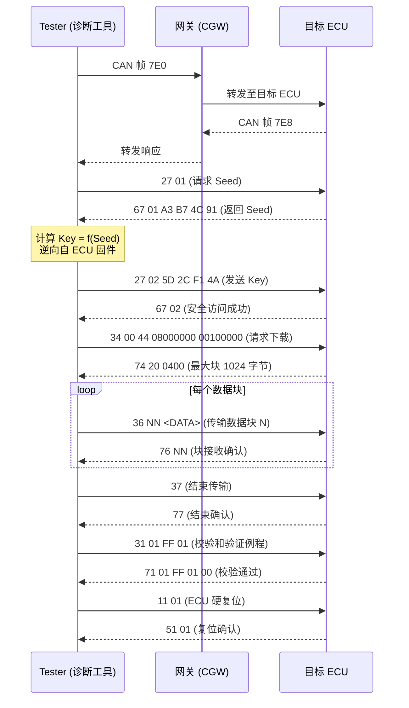

---
tags:
  - 固件
  - IoT
  - tier3
  - 车载
  - CAN
---
# 车载总线与汽车 ECU 逆向

> [!abstract] TL;DR
> 现代汽车是由数十乃至上百颗 ECU 组成的分布式嵌入式系统，各 ECU 通过 CAN/LIN/FlexRay/车载以太网互联。逆向分析汽车系统的核心路径是：用 OBD-II 接口或物理线束接入总线 → 用 candump/CANoe 抓包 → 解析 ISO-TP 分段 → 还原 UDS 诊断会话 → 破解 Seed-Key 算法 → 读取/刷写 ECU 固件。整个过程无需拆解硬件即可完成相当程度的分析，但也因总线无内置认证而带来显著的安全隐患。

## 概述与定位

### 汽车嵌入式的规模与现状

二十年前，一辆普通轿车只有寥寥几颗 ECU（Electronic Control Unit，电子控制单元），仅负责发动机管理和自动变速箱控制。如今，一辆中高档车型通常搭载 70～150 颗 ECU，而高端电动车（如特斯拉 Model S、奔驰 EQS）的 ECU 数量可超过 200 颗，涵盖动力总成、底盘、车身、信息娱乐、高级驾驶辅助（ADAS）、远程信息处理（Telematics）等域。

每颗 ECU 本质上是一颗微控制器（MCU），运行实时操作系统（通常是 AUTOSAR 架构下的 OSEK/VDX 或 AUTOSAR OS），执行特定功能并通过车内总线与其他 ECU 通信。从固件逆向视角看，ECU 固件是标准的嵌入式二进制，用到了 ARM Cortex-M/R、Renesas RH850、Infineon Tricore 等架构，与系列前几篇的方法论高度衔接——差异在于物理接入方式和通信协议体系。

### 为什么研究车载总线逆向

- **漏洞研究与安全审计**：Charlie Miller 和 Chris Valasek 2015 年对吉普切诺基的远程控制演示（通过 Telematics 单元 UConnect 入侵 CAN 总线）是汽车安全领域的标志性事件，此后催生了大量公开研究和 Pwn2Own Automotive 竞赛。
- **ECU 固件提取**：通过诊断协议读取 ECU 内部 Flash，无需物理拆解芯片或焊接 JTAG，是最低门槛的固件获取手段。
- **定制化与刷写**：ECU 调校（如发动机 ECU 重新映射、仪表盘里程修改）长期存在于改装市场，理解其原理有助于识别非法改装。
- **OEM 供应链分析**：识别多品牌车型共用的 ECU 固件版本，在一个型号上发现的漏洞往往影响整个平台。

### 在系列中的定位

本章衔接第09章（IoT 通信协议逆向，覆盖消费级无线协议）和第18章（工业控制协议逆向），聚焦汽车领域专有的总线体系和诊断协议栈。与工业控制协议不同，车载协议有更完整的 ISO 标准体系，且已有丰富的开源工具生态（SocketCAN、python-can、python-uds）。

---

## 原理与机制

### 车内网络架构全景

现代汽车采用分域（Domain）网络架构，不同域之间通过网关（Central Gateway，CGW）互联：

```
┌─────────────────────────────────────────────────────────┐
│                   中央网关 (CGW)                         │
│              [IP路由 + 协议转换 + 防火墙]                 │
└────┬──────────┬──────────┬──────────┬──────────┬────────┘
     │          │          │          │          │
  动力域      底盘域     车身域    信息娱乐域  ADAS域
  (CAN-FD)  (CAN-FD)   (LIN/CAN) (车载以太网) (FlexRay/以太网)
     │          │          │          │          │
  发动机ECU  ABS/ESP    车窗/灯光  中控/仪表   摄像头/雷达
  变速箱ECU  转向EPS    门锁/天窗  导航/娱乐   ADAS控制器
  电池BMS    悬架CDC    座椅/空调  HUD         域控制器
```

远程接入面（外部攻击面）则包括：OBD-II 诊断接口、蓝牙（车机配对）、Wi-Fi（热点）、V2X（车路通信）、Telematics/4G 模块（远程 OTA）。

### CAN 总线（Controller Area Network）

CAN 由 Bosch 于 1983 年开发，1993 年成为 ISO 11898 标准，是目前车内最普及的总线。

**物理层特性：**

- 差分双绞线（CAN_H 和 CAN_L），隐性状态电压约 2.5V，显性状态 CAN_H≈3.5V、CAN_L≈1.5V
- 总线访问：CSMA/CD with NDA（非破坏性仲裁），ID 越小优先级越高（显性位胜出）
- 速率：低速 CAN（ISO 11898-3）最高 125 kbps，高速 CAN（ISO 11898-2）最高 1 Mbps

**CAN 标准帧格式（11 位 ID）：**

```
SOF(1) | ID[10:0](11) | RTR(1) | IDE(0) | r0(1) | DLC(4) | DATA(0~64位) | CRC(15) | CRC-DEL(1) | ACK(1) | ACK-DEL(1) | EOF(7) | IFS(3)
```

**CAN 扩展帧（29 位 ID）：**

```
SOF(1) | ID[28:18](11) | SRR(1) | IDE(1) | ID[17:0](18) | RTR(1) | r1(1) | r0(1) | DLC(4) | DATA | CRC | ACK | EOF | IFS
```

关键字段含义：
- **ID**：报文标识符，既是地址也是优先级，11 位或 29 位
- **DLC**（Data Length Code）：数据域长度，0～8 字节
- **RTR**（Remote Transmission Request）：远程帧请求位，置 1 表示请求帧
- **IDE**（Identifier Extension）：0=标准帧，1=扩展帧
- **CRC**：15 位 CRC，多项式 0x4599（x^15+x^14+x^10+x^8+x^7+x^4+x^3+1）

**位填充规则：** 为维持同步，连续 5 个相同极性位后强制插入 1 个相反极性的填充位（stuffed bit），接收端自动剥离。这是 CAN 的内置机制，不属于上层协议。

**最关键的安全特性（或者说缺失）：** CAN 帧本身**无源地址字段、无认证、无加密**。总线上任何节点都可以发送任意 ID 的帧，接收节点无法验证发送方身份。这是 CAN 协议设计时代的历史局限，也是车载安全的根本挑战所在。

### CAN-FD（CAN with Flexible Data-Rate）

CAN-FD 由 Bosch 于 2012 年提出，ISO 11898-1:2015 标准化，解决了经典 CAN 的两个瓶颈：
1. 数据域最大 64 字节（vs 经典 CAN 的 8 字节）
2. 数据段可切换至更高速率（通常 2～8 Mbps），仲裁段仍保持 ≤1 Mbps

DLC 扩展编码：DLC>8 时按 9→12、10→16、11→20、12→24、13→32、14→48、15→64 字节映射。

CAN-FD 帧新增 BRS（Bit Rate Switch）和 ESI（Error State Indicator）位，接收端凭此识别速率切换边界。

### LIN 总线（Local Interconnect Network）

LIN 是比 CAN 更低成本的单线串行总线，运行在 12V 单线上，速率 1～20 kbps（标准 19.2 kbps），采用主从架构（单一 Master，多个 Slave），Master 发起所有通信。

典型应用场景：车窗电机、座椅调节、雨刮器、车灯开关等对实时性要求不高的执行器。从逆向角度看，LIN Slave 节点通常是极简单的 MCU，固件极小，但物理上接入 LIN 需要 LIN 收发器或特殊适配器。

**LIN 帧结构：**
```
Break(13位显性) | Sync(0x55) | PID(6位ID + 2位校验) | Data(1~8字节) | Checksum(1字节)
```

### FlexRay

FlexRay 是面向安全关键系统（Safety-Critical）的车载总线，由宝马、戴姆勒、飞利浦等联合开发，ISO 17458 标准，速率最高 10 Mbps/通道，支持两个独立通道（Channel A/B）冗余，采用 TDMA（时分多址）确定性时隙调度。

FlexRay 主要用于底盘控制（主动悬架、线控转向 SbW、线控制动 BbW）等安全关键场景，但因成本较高，部分场景已被 CAN-FD 取代。FlexRay 分析工具较少，Vector 提供商业支持，开源工具有限。

### 车载以太网与 SOME-IP / DoIP

随着 ADAS、OTA、车机带宽需求爆炸式增长，100BASE-T1（博通 BroadR-Reach）和 1000BASE-T1（IEEE 802.3bp）车载以太网开始大规模部署。

**SOME/IP（Scalable service-Oriented MiddlewarE over IP）：** AUTOSAR 定义的车载以太网应用层协议，支持服务发现（SD）、事件订阅、远程方法调用（RPC），类似微服务架构但针对汽车实时性要求优化。

SOME/IP 报文头（16字节）：
```
Service ID(2) | Method/Event ID(2) | Length(4) | Client ID(2) | Session ID(2) | Protocol Version(1) | Interface Version(1) | Message Type(1) | Return Code(1) | Payload(...)
```

**DoIP（Diagnostics over IP，ISO 13400）：** 允许通过以太网进行 UDS 诊断，是 OTA 刷写和远程诊断的关键协议。DoIP 在 TCP（端口 13400）或 UDP（端口 13400）上传输 UDS 报文，网关节点负责在以太网与 CAN 之间进行协议转换。

### ISO-TP（ISO 15765-2，传输协议）

CAN 单帧最多 8 字节，而 UDS 诊断报文通常远超 8 字节（如固件数据块）。ISO-TP 是 CAN 上的传输层协议，负责将大报文分段传输。

**帧类型：**

| 类型 | 首字节高 4 位 | 描述 |
|------|------------|------|
| SF（单帧）| 0x0N | 报文 ≤7 字节（经典 CAN）或 ≤62 字节（CAN-FD），N 为数据长度 |
| FF（首帧）| 0x1N (N≤0xFFF) | 多帧传输的第一帧，携带总长度 |
| CF（连续帧）| 0x2N | 序号 N=1..F(循环)，携带后续数据 |
| FC（流控帧）| 0x3N | 接收方发出，控制发送窗口（BS=块大小，STmin=帧间最小间隔）|

**传输序列示例（请求大于7字节）：**

```
发送方 → [FF: 0x10 0x1A 0x22 0x01 0x02 0x03 0x04 0x05]  首帧，总长 26 字节
接收方 → [FC: 0x30 0x00 0x0A]  流控：BS=0(无限制), STmin=10ms
发送方 → [CF: 0x21 0x06 0x07 0x08 ...]  连续帧1
发送方 → [CF: 0x22 ...]  连续帧2
...
```

### UDS（统一诊断服务，ISO 14229）

UDS 是现代汽车诊断的核心协议，定义了 ECU 如何响应诊断工具（Tester）的请求。UDS 运行在 ISO-TP 之上（CAN 场景）或 DoIP 之上（以太网场景）。

**诊断会话（Session）：**

| Session ID | 名称 | 用途 |
|------------|------|------|
| 0x01 | 默认会话（DefaultSession）| 基本 OBD 功能，始终可用 |
| 0x02 | 编程会话（ProgrammingSession）| 固件刷写，通常需要安全访问 |
| 0x03 | 扩展诊断会话（ExtendedDiagnosticSession）| 高级诊断、参数修改 |
| 0x40～0x5F | OEM 自定义 | 厂商专有会话 |

切换会话：`10 02` → 切换至编程会话；响应：`50 02 [P2 Server Max] [P2* Server Max]`

**核心服务 ID（SID）：**

| SID | 服务名 | 典型功能 |
|-----|-------|---------|
| 0x10 | DiagnosticSessionControl | 切换诊断会话 |
| 0x11 | ECUReset | 复位 ECU（硬复位/软复位/关键循环）|
| 0x14 | ClearDiagnosticInformation | 清除故障码（DTC）|
| 0x19 | ReadDTCInformation | 读取故障码（DTC）|
| 0x22 | ReadDataByIdentifier | 按 DID 读参数（VIN、ECU 信息等）|
| 0x23 | ReadMemoryByAddress | 按内存地址直接读取（如果 ECU 允许）|
| 0x27 | SecurityAccess | 安全访问（Seed-Key 认证）|
| 0x28 | CommunicationControl | 控制总线通信（关闭/开启收发）|
| 0x2C | DynamicallyDefineDataIdentifier | 动态定义 DID |
| 0x2E | WriteDataByIdentifier | 按 DID 写参数 |
| 0x2F | InputOutputControlByIdentifier | 控制 ECU 输出（如继电器、电机）|
| 0x31 | RoutineControl | 执行例程（如检验和计算、擦除 Flash）|
| 0x34 | RequestDownload | 请求下载（刷写前声明）|
| 0x35 | RequestUpload | 请求上传（固件读取前声明）|
| 0x36 | TransferData | 传输数据块 |
| 0x37 | RequestTransferExit | 结束传输 |
| 0x3D | WriteMemoryByAddress | 按地址写内存 |
| 0x3E | TesterPresent | 心跳保活（防止 ECU 超时退回默认会话）|
| 0x85 | ControlDTCSetting | 开启/关闭 DTC 记录 |

**安全访问（SecurityAccess，SID 0x27）：** 这是 UDS 唯一的访问控制机制，采用 Seed-Key（挑战-响应）模式：

```
Tester → ECU:  27 01          # 请求种子（Seed），Level 1
ECU → Tester:  67 01 AA BB CC DD  # 返回种子（4字节示例）
Tester → ECU:  27 02 XX YY ZZ WW  # 发送密钥（Key）
ECU → Tester:  67 02          # 认证成功
```

`Level = subfunction byte`，奇数字节请求种子，偶数字节发送密钥（Level N 种子对应 Level N+1 密钥）。

Key = f(Seed, SecretParam)，算法完全由 OEM 自定义，常见形式包括：
- 简单异或/移位：`Key = (Seed XOR 0xC541A9FD) + 0x48211413`（某 OEM 实际算法）
- HMAC-SHA256（现代实现）
- 自定义多项式运算（大多数量产 ECU）

安全访问的强度完全取决于算法保密性，若能逆向 ECU 固件提取算法，安全访问即被绕过。

### OBD-II 与 PIDs

OBD-II（On-Board Diagnostics II）是美国 1996 年起强制要求的车辆诊断接口标准，使用标准化 16 针 D 形连接器（SAE J1962），位于驾驶舱易触及位置（通常在方向盘下方）。

OBD-II 物理层支持多种协议（取决于车型年份和地区）：CAN（ISO 15765，2008 年起美国强制）、K-Line（ISO 9141-2）、KWP2000（ISO 14230）等。现代车辆几乎全部使用 CAN。

**OBD-II 功能模式（Mode）：**

| Mode | 功能 |
|------|------|
| 0x01 | 读实时数据（PIDs）|
| 0x02 | 读冻结帧数据 |
| 0x03 | 读故障码（DTC）|
| 0x04 | 清除故障码 |
| 0x05 | 氧传感器测试结果 |
| 0x09 | 读车辆信息（VIN、校准 ID）|

**常用 Mode 01 PIDs（参数 ID）：**

| PID | 描述 | 公式 |
|-----|------|------|
| 0x0C | 发动机转速（RPM）| A×256+B / 4 |
| 0x0D | 车速（km/h）| A |
| 0x05 | 冷却液温度 | A - 40 (°C) |
| 0x11 | 节气门位置 | A×100/255 (%) |
| 0x1C | OBD 标准 | 枚举值 |

OBD-II 的物理接入（接 OBD 适配器）是逆向分析汽车 CAN 总线的最低门槛入口点。

---

## 结构/算法/伪代码详解

### ECU 固件读取流程（UDS Upload 路径）

通过 UDS 服务读取 ECU 内部 Flash 的完整流程如下（需要 ECU 支持该功能且安全访问通过后）：

```
1. 切换诊断会话
   Request:  10 03       (ExtendedDiagnosticSession)
   Response: 50 03 ...

2. 请求安全访问（Level 1 - 读权限）
   Request:  27 01
   Response: 67 01 <SEED[4]>
   计算 KEY = computeKey(SEED, SECRET_CONSTANT)
   Request:  27 02 <KEY[4]>
   Response: 67 02       (成功)

3. 请求上传
   Request:  35 00 44 00 08000000 00100000
             │     │  │  │         └─ 长度 0x100000 (1MB)
             │     │  │  └─ 起始地址 0x08000000 (STM32 Flash 基地址示例)
             │     │  └─ 长度格式(4字节) + 地址格式(4字节)
             │     └─ 数据压缩/加密方式(0=无)
             └─ SID 0x35
   Response: 75 00 <maxBlockLen[2]>  # ECU 返回最大块大小

4. 循环传输数据块
   Request:  36 01   # 块序号 01
   Response: 76 01 <DATA[maxBlockLen]>
   Request:  36 02
   Response: 76 02 <DATA[...]>
   ...直到所有数据传输完成

5. 结束传输
   Request:  37
   Response: 77
```

大多数量产 ECU 不允许通过 OBD-II 接口直接上传固件（出于安全考虑），但 ECU 开发版或经过漏洞利用后的 ECU 可能支持此操作。

### ECU 固件刷写流程（Download 路径）

刷写是上传的逆向过程，典型步骤增加了 Flash 擦除例程：

```python
def flash_ecu(can_interface, ecu_id, firmware_data):
    # 1. 进入编程会话
    send_uds(can_interface, ecu_id, [0x10, 0x02])
    wait_response(expected_sid=0x50)
    
    # 2. 安全访问（Level 03 - 写权限通常比读权限更高 Level）
    seed = request_seed(can_interface, ecu_id, level=0x03)
    key = compute_key(seed)  # 逆向得到的算法
    send_uds(can_interface, ecu_id, [0x27, 0x04] + key)
    wait_response(expected_sid=0x67)
    
    # 3. 关闭 DTC 记录（防止刷写中产生误故障码）
    send_uds(can_interface, ecu_id, [0x85, 0x02])
    
    # 4. 擦除 Flash（通过 RoutineControl）
    send_uds(can_interface, ecu_id, [0x31, 0x01, 0xFF, 0x00,
                                      0x08, 0x00, 0x00, 0x00,  # 起始地址
                                      0x00, 0x10, 0x00, 0x00]) # 长度
    wait_response(expected_sid=0x71, timeout=30)  # 擦除可能需要较长时间
    
    # 5. 请求下载
    send_uds(can_interface, ecu_id, [0x34, 0x00, 0x44,
                                      0x08, 0x00, 0x00, 0x00,  # 起始地址
                                      0x00, 0x10, 0x00, 0x00]) # 总长度
    resp = wait_response(expected_sid=0x74)
    max_block_len = parse_block_len(resp)
    
    # 6. 分块传输固件
    blocks = chunk(firmware_data, max_block_len - 2)  # 减去序号和SID开销
    for i, block in enumerate(blocks, start=1):
        seq = i & 0xFF
        send_uds(can_interface, ecu_id, [0x36, seq] + block)
        wait_response(expected_sid=0x76)
    
    # 7. 结束传输
    send_uds(can_interface, ecu_id, [0x37])
    
    # 8. 验证完整性（CheckSum 例程）
    send_uds(can_interface, ecu_id, [0x31, 0x01, 0x02, 0x02])
    wait_response(expected_sid=0x71)
    
    # 9. 复位 ECU
    send_uds(can_interface, ecu_id, [0x11, 0x01])
```

### Seed-Key 算法逆向

Seed-Key 算法存在于 ECU 固件的安全访问处理函数中，逆向步骤：

```
1. 定位安全访问处理函数
   - 搜索 UDS SID 0x27 的分发表
   - 在 Ghidra/IDA 中搜索常量 0x27 附近的跳转表
   - 通常有 computeSeed() 和 verifyKey() 两个关键子函数

2. 提取 computeKey 函数逻辑（典型模式）
   # 示例：某国产车 ECU 实际 Seed-Key 算法
   def compute_key(seed):
       seed = struct.unpack('>I', seed)[0]  # 大端 4 字节整数
       # 步骤1: 位旋转
       key = ((seed << 3) & 0xFFFFFFFF) | (seed >> 29)
       # 步骤2: 异或常数
       key ^= 0x76B5A3C2
       # 步骤3: 加法常数
       key = (key + 0x1D42F33A) & 0xFFFFFFFF
       # 步骤4: 再次旋转
       key = ((key >> 5) | (key << 27)) & 0xFFFFFFFF
       return struct.pack('>I', key)

3. 验证提取结果
   - 用 python-uds 或 scapy 发送真实 Seed，验证计算的 Key 是否被 ECU 接受
   - 若逆向正确，ECU 应返回 67 04（Positive Response）
```

### DBC 文件与信号解析

DBC（Database CAN）文件是 Vector 定义的 CAN 信号数据库格式，定义了每个 CAN 报文 ID 中各信号的位置、长度、缩放因子和偏移量，是将原始 CAN 帧解码为物理量（如转速 = 1250 rpm）的关键。

```
// DBC 文件片段示例
BO_ 0x316 ENGINE_STATUS: 8 ECU_ENGINE
 SG_ ENGINE_RPM : 0|16@1+ (0.25,0) [0|16383.75] "rpm" Vector__XXX
 SG_ VEHICLE_SPEED : 16|8@1+ (1,-40) [0|214] "km/h" Vector__XXX  
 SG_ THROTTLE_POS : 24|8@1+ (0.3922,0) [0|100] "%%" Vector__XXX
 SG_ COOLANT_TEMP : 32|8@1+ (1,-40) [-40|215] "degC" Vector__XXX
 SG_ ENGINE_LOAD : 40|8@1+ (0.3922,0) [0|100] "%%" Vector__XXX
```

字段说明：
- `BO_ <MSG_ID> <MSG_NAME>: <DLC> <TX_NODE>` — 报文定义
- `SG_ <SIG_NAME> : <StartBit>|<Length>@<ByteOrder><ValueType> (<Factor>,<Offset>) [Min|Max] "<Unit>"` — 信号定义
- `@1` = 小端（Intel）字节序，`@0` = 大端（Motorola）字节序
- `+` = 无符号，`-` = 有符号

实际物理值 = 原始值 × Factor + Offset。

DBC 文件通常由 OEM 保密，逆向分析时需通过以下方法重建：
1. **被动嗅探 + 统计分析**：驾驶时录制所有 CAN 帧，分析信号变化与已知操作（踩油门、转向）的相关性
2. **CAN 总线逆向工具**（SavvyCAN、cabana）：可视化分析信号波形
3. **参考已有数据库**（OpenDBC、opendbc 项目）：Tesla、GM、Honda 等部分 DBC 已公开

### CAN 报文注入与重放

由于 CAN 总线无认证，任何连接到总线的节点均可发送任意 ID 的帧：

```bash
# 使用 candump 嗅探所有 CAN 帧（需要 SocketCAN 接口 vcan0 或物理 can0）
candump can0 -l  # -l 记录到文件

# 发送单帧（注入车窗控制指令示例）
cansend can0 0316#DEADBEEF01020304

# 重放录制文件
canplayer -I candump.log

# 发送 UDS 诊断帧（使用 isotp 工具）
echo "10 02" | isotpsend -s 0x7E0 -d 0x7E8 can0

# 接收 UDS 响应
isotprecv -s 0x7E8 -d 0x7E0 can0
```

Mermaid 图：UDS 诊断会话完整交互流程：



---

## 工具视角与实战

### 硬件接入工具

**OBD-II 适配器：**
- **ELM327 系列**：最普及的廉价 OBD-II 适配器（USB/蓝牙/Wi-Fi），使用 AT 命令协议，支持 OBD-II PID 查询，但不支持完整 UDS 或 ISO-TP 分段，仅适合入门级 OBD 数据读取
- **PEAK PCAN-USB**：专业级 CAN 适配器，Linux 下原生 SocketCAN 支持，可精确控制 CAN 帧发送，支持 CAN-FD，是逆向分析的主力硬件（约 100～200 美元）
- **KVASER Leaf Light**：与 PEAK 类似定位，Vector 软件生态兼容性更好
- **socketcand + Raspberry Pi**：低成本方案，使用 MCP2515（SPI 转 CAN 芯片）连接树莓派，运行 socketcand 后可通过网络访问
- **CANtact/CANable**：开源低成本 USB-CAN 适配器，支持 SocketCAN，固件基于 candleLight，约 30～50 美元
- **Bus Pirate v4**：通用总线调试工具，支持 CAN 的嗅探（通过 SPI 桥接 MCP2515），更多用于低速调试

### 软件工具链

**SocketCAN（Linux 内核原生 CAN 栈）：**

SocketCAN 将 CAN 接口抽象为标准网络接口（如 `can0`），允许使用标准 socket API 访问 CAN 总线：

```bash
# 加载内核模块
sudo modprobe can
sudo modprobe can_raw
sudo modprobe vcan  # 虚拟 CAN（用于测试）

# 创建虚拟 CAN 接口
sudo ip link add dev vcan0 type vcan
sudo ip link set up vcan0

# 配置物理 CAN 接口（500kbps）
sudo ip link set can0 up type can bitrate 500000

# 可以监控 CAN 总线实时帧
candump can0
# 输出格式: <接口>  <ID>#<数据HEX>
# 例: can0  316#DEADBEEF00000000

# 过滤特定 ID
candump can0,7E0:7FF,7E8:7FF  # 只显示 OBD/UDS 相关 ID

# 记录到文件并回放
candump -l can0
canplayer -I candump-XXXX.log
```

**python-can：** Python CAN 总线抽象库，支持 SocketCAN、PEAK、Vector、KVASER 等多种后端：

```python
import can

# 连接 CAN 接口
bus = can.interface.Bus(channel='vcan0', bustype='socketcan')

# 发送帧
msg = can.Message(arbitration_id=0x7E0, data=[0x02, 0x10, 0x02],
                  is_extended_id=False)
bus.send(msg)

# 接收帧（设置过滤器）
bus.set_filters([{"can_id": 0x7E8, "can_mask": 0x7FF, "extended": False}])
while True:
    msg = bus.recv(timeout=1.0)
    if msg:
        print(f"ID: {msg.arbitration_id:03X} Data: {msg.data.hex()}")
```

**python-uds：** 高级 UDS 客户端库，封装了 ISO-TP 和 UDS 协议细节：

```python
from uds import Uds, IsoTp

# 创建 UDS 连接
conn = IsoTp(txId=0x7E0, rxId=0x7E8, interface='socketcan', channel='can0')
client = Uds(conn)

# 读取 VIN
response = client.send([0x09, 0x02])  # Mode 09 PID 02

# 切换诊断会话
client.send([0x10, 0x03])

# 读取 DID（如软件版本）
response = client.send([0x22, 0xF1, 0x89])
print("SW Version:", response[3:].decode('ascii', errors='replace'))
```

**SavvyCAN：** 开源 CAN 帧分析工具（Qt 跨平台），核心功能：
- 实时捕获与回放
- 信号波形可视化（辅助 DBC 逆向）
- DBC 文件导入/导出
- 帧差异分析（before/after 对比，用于定位控制信号）
- 内置 UDS/OBD 解析

**Vector CANoe / CANalyze（商业）：** 行业标准工具，OEM 和 Tier-1 供应商广泛使用：
- CANoe：完整的 CAN/CAN-FD/LIN/FlexRay/以太网网络仿真与测试平台
- CANalyze：纯分析工具（CANoe 的简化版）
- 优势：CAPL 脚本（类 C 语言）、完整的 DBC/FIBEX/ARXML 支持
- 劣势：价格高昂（数万美元/节点授权），不适合个人研究

**Wireshark：** 支持 CAN、ISO-TP、UDS、SOME/IP、DoIP 的解析器，通过 SocketCAN 的 pcap 捕获文件可用 Wireshark 分析，是车载以太网抓包的首选工具。

**cabana（openpilot 项目）：** comma.ai 开源的 CAN 信号分析工具，Web 界面，集成 OpenDBC 数据库，适合快速识别主流车型信号。

**IDA Pro / Ghidra（ECU 固件逆向）：** ECU 固件拿到手后（通常是裸机二进制），需要反汇编分析：
- 主流 ECU MCU 架构：ARM Cortex-M（Infineon AURIX TriCore 用 Ghidra 插件）、Renesas RH850、NXP S32K
- 关键字符串/常量定位：搜索 UDS SID（0x10、0x22、0x27 等）的跳转表
- AUTOSAR BSW 符号识别：AUTOSAR Comstack 有固定的 API 前缀（`CanIf_`、`PduR_`、`Dcm_`），有助于快速定位诊断服务处理代码

### 实战场景：从 OBD 接口提取真实 CAN 流量

```bash
# 环境：Linux PC + PEAK PCAN-USB + 目标车辆 OBD-II 接口
# 车辆静止、点火钥匙 ACC 档（发动机不启动，但 ECU 上电）

# 1. 确认 CAN 接口就绪
ip link show can0

# 2. 设置波特率（多数现代车 500kbps，部分 250kbps）
sudo ip link set can0 up type can bitrate 500000

# 3. 开始抓包（同时记录时间戳）
candump -t a -l can0 &

# 4. 发送 UDS 广播请求 VIN
echo "02 09 02" | isotpsend -s 0x7DF -d 0x7E8 can0
# 0x7DF 是 OBD-II 广播地址

# 5. 扫描活跃 ECU（发送诊断请求到各 ECU 地址）
for ecu_id in $(seq 0x700 0x7FF); do
    response=$(echo "01 10 01" | isotpsend -s $ecu_id -d $((ecu_id+8)) can0 2>/dev/null)
    if [ -n "$response" ]; then
        echo "活跃 ECU: $(printf '0x%X' $ecu_id)"
    fi
done
```

### 实战场景：逆向未知 ECU 的 Seed-Key 算法

```
# 目标：逆向某 ECU 固件中的 SecurityAccess Key 计算函数

1. 获取固件（通过 JTAG 物理提取或已知漏洞）
   - 若 ECU 使用 Infineon TC297T（常见于发动机 ECU）
   - 通过 Lauterbach 调试器连接 TriCore JTAG 接口
   - 使用 flashdump.cmm 脚本 dump 内部 Flash

2. 在 Ghidra 中加载固件
   - 加载器：Raw Binary，架构选择 TriCore 或对应 MCU
   - 基地址：通常是 MCU Flash 起始地址（如 0x80000000）

3. 定位安全访问处理函数
   # 搜索 0x27 常量
   Search > Memory > 27  # 结合上下文筛选 SID 0x27 的 case 标签
   # 追踪 Dcm_ReadActiveDiagnosticSession 调用链
   # 定位 Dcm_Dsp_SecurityAccess_ComputeKey 函数

4. 提取算法逻辑（Ghidra 伪代码示例）
   uint32 ComputeKey_Level01(uint32 seed) {
       uint32 temp = seed ^ 0x94380A05;
       temp = __rlwinm(temp, 7, 0, 31);  // 循环左移 7 位
       temp += 0x5A3CF21B;
       temp ^= (temp >> 13);
       return temp;
   }

5. 用 Python 复现并验证
   import struct
   def rl32(val, n): return ((val << n) | (val >> (32-n))) & 0xFFFFFFFF
   def compute_key(seed_bytes):
       s = struct.unpack('>I', seed_bytes)[0]
       k = s ^ 0x94380A05
       k = rl32(k, 7)
       k = (k + 0x5A3CF21B) & 0xFFFFFFFF
       k ^= (k >> 13)
       return struct.pack('>I', k)
```

---

## 安全性与正确使用

### 合法与授权边界

车载总线逆向研究必须在以下场景中进行：

- **自有车辆**：在自己名下的车辆上进行测试，无需额外授权，但需注意改动固件可能使车辆失去厂家保修
- **授权测试**：获得车企或 Tier-1 供应商书面授权的安全研究，通常通过漏洞悬赏计划（如大众、通用、宝马均设有 VDP）或合作协议
- **实验室/测试台架**：购置二手 ECU 组成 bench（离线测试台），ECU 不连接真实车辆，是最安全的研究环境
- **Pwn2Own Automotive 等竞赛**：在受控比赛环境中，组织方提供目标车辆和明确的测试范围

**明确禁止的行为：**
- 在公共道路上对行驶中车辆进行任何总线注入测试——这可能直接危及生命
- 未授权接入他人车辆的 OBD-II 接口
- 向任何车辆总线注入安全关键信号（制动、转向、安全气囊）而不在受控的静止状态下

### CAN 总线注入的物理风险

CAN 总线注入不同于纯软件漏洞利用，注入错误指令可能导致：
- **发动机控制**：异常喷油/点火指令可能损坏发动机
- **制动系统（ABS/ESP）**：错误的制动释放指令在行驶中将直接造成事故
- **安全气囊**：触发气囊展开命令可能导致乘员受伤
- **转向系统（EPS）**：在高速行驶时改变转向辅助可能导致失控

因此，**任何注入测试必须在静止状态下进行**，且应首先通过 SID 0x28（CommunicationControl）禁止 ECU 发出真实执行命令，或通过硬件隔离断开执行器（如断开 ABS 液压控制单元的继电器）。

### 总线安全防御机制（SecOC）

AUTOSAR 规范中的 SecOC（Secure Onboard Communication）是目前最主流的 CAN 总线消息认证方案：

**工作原理：**
1. 发送方：对 PDU 数据和计数器使用共享密钥计算 MAC（通常 CMAC/HMAC，截断为 24/32 位）
2. 在 CAN 帧中附加截断 MAC 和 Freshness Counter（防重放）
3. 接收方：用相同密钥验证 MAC，拒绝未通过验证的帧

SecOC 的挑战：CAN 帧数据域仅 8 字节，留给 MAC 的空间极为有限；Freshness Counter 的同步需要额外机制（通常通过 Trip Counter 管理）。

**CAN IDS（入侵检测）：**

由于 CAN 无内置认证，CAN IDS 是另一道防线，检测异常总线行为：

| IDS 检测方法 | 原理 | 优势 | 局限 |
|------------|------|------|------|
| 报文频率检测 | 合法 ECU 以固定周期发送，注入会改变频率 | 简单高效 | 无法检测低速注入、精确计时攻击 |
| 电气指纹 | 不同 ECU 的信号上升沿/噪声特征各异 | 可识别物理伪造者 | 需要专用硬件传感器 |
| 报文序列异常 | 检测罕见的状态转移序列 | 覆盖语义异常 | 需要大量正常数据建模 |
| 机器学习异常检测 | LSTM/Autoencoder 学习正常流量特征 | 可检测 0day 注入 | 误报率、计算资源 |

### 漏洞披露与 VDP

车辆安全研究发现漏洞后，建议通过以下渠道进行协调披露（Coordinated Vulnerability Disclosure）：
- 直接联系 OEM 安全团队（各大车企均有 Product Security / PSIRT）
- 通过 AutoISAC（汽车信息共享与分析中心）协调
- 参考 ISO/SAE 21434（汽车网络安全工程标准）的披露框架

远程攻击面（Telematics）的漏洞尤其应快速披露，因为一旦漏洞公开，攻击者可批量攻击同型号的所有在网车辆。

---

## 小结

车载总线逆向的核心知识结构可以归纳为三个层次：

**物理与链路层：** CAN 总线的差分信号、位填充、仲裁机制是基础。CAN-FD 扩展了带宽，LIN 覆盖低速执行器，FlexRay 保障安全关键系统，车载以太网驱动 ADAS 和 OTA。物理接入从最低门槛的 OBD-II 接口到 JTAG 调试接口构成了一个成本-能力的梯度。

**传输与应用层：** ISO-TP 解决了 CAN 帧大小限制，UDS 定义了 ECU 诊断的统一接口。UDS 服务 ID 体系（0x10 切换会话、0x27 安全访问、0x22/0x2E 读写参数、0x34-0x37 固件传输）是所有 ECU 逆向和固件提取的操作基础。Seed-Key 算法是安全访问的核心障碍，也是逆向工作的核心目标。

**工具与实践：** SocketCAN/can-utils 构成 Linux 下的零成本分析基础；python-can/python-uds 提供编程接口；SavvyCAN 辅助信号逆向；Ghidra/IDA 负责固件级逆向；Vector 商业工具是工业界标准但价格高昂。

安全维度上，CAN 总线的无认证设计是根本性的协议缺陷；SecOC 和 CAN IDS 是现阶段的防御路径，但普及率仍然有限；远程攻击面（Telematics/OTA）是当前最受关注的高危入口。

面向研究的完整路径建议：从购置二手 ECU 台架 + PEAK PCAN-USB 开始，用 candump 熟悉 CAN 流量，用 python-uds 完成 UDS 基本操作，然后通过 JTAG 提取 ECU 固件，在 Ghidra 中定位 Seed-Key 函数，最终构建端到端的安全研究能力。

---

## 相关阅读

- **ISO 11898**：CAN 总线协议规范（物理层与数据链路层）
- **ISO 15765-2**：ISO-TP（CAN 上的传输层协议）完整规范
- **ISO 14229**：UDS 统一诊断服务协议规范
- **ISO 13400**：DoIP（以太网上的诊断通信）协议规范
- **AUTOSAR SecOC 规范**：`AUTOSAR_SWS_SecureOnboardCommunication.pdf`
- **Charlie Miller & Chris Valasek, "Remote Exploitation of an Unaltered Passenger Vehicle" (2015)**：吉普切诺基远程攻击演示技术报告，DEF CON 23
- **Ken Tindell, "Hacking the CAN Bus" 系列文章**：CAN 协议安全深度分析
- **OpenGarages / Car Hacker's Handbook**：Craig Smith 著，汽车安全入门标准参考书，开源免费
- **opendbc 项目**（github.com/commaai/opendbc）：主流车型 DBC 文件开源数据库
- **socketcan-tutorial**：Linux 官方内核文档 Documentation/networking/can.rst
- **Javier Balmaceda, "UDS for Dummies"**：UDS 协议工程师友好入门
- **GENIVI Vehicle Security Working Group**：车辆信息安全标准文档集

---

[[00.固件与IoT嵌入式逆向总览|⬆ 系列总览]] | [[18.工业控制协议逆向|← 上一章]] | [[20.UEFI与BIOS固件逆向|→ 下一章]]
