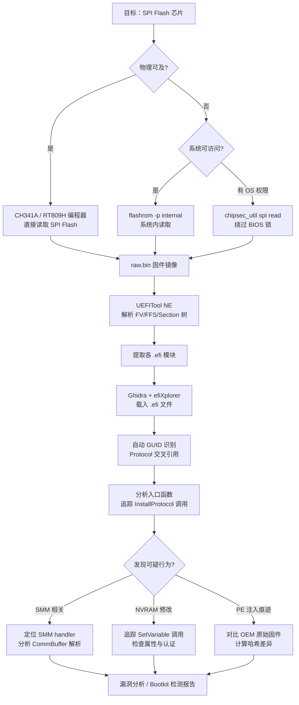

---
tags:
  - 固件
  - IoT
  - tier3
  - UEFI
  - BIOS
---
# UEFI 与 BIOS 固件逆向

> [!abstract] TL;DR
> UEFI（Unified Extensible Firmware Interface）是现代 x86/x86-64 平台主板固件的事实标准，取代了传统 BIOS 的 16 位实模式接口。其核心规范 UEFI PI（Platform Initialization）将启动过程划分为 SEC→PEI→DXE→BDS→TSL→RT 六大阶段，每个阶段加载不同类型的 EFI 模块（PEIM / DXE Driver / Application）。固件物理存储于 SPI Flash 中，以 UEFI PI 定义的 FV/FFS/Section 层次组织。逆向分析时需掌握：flashrom / SPI 编程器的固件提取、UEFITool 的固件解剖、Ghidra + efiXplorer 插件对 EFI PE32+ 可执行文件的反汇编与 GUID/Protocol 交叉引用、chipsec 的运行时安全审计，以及 SMM（System Management Mode）的特权攻击面。本章与系列 15（可信启动链）衔接，重点覆盖 LoJax / MoonBounce / BlackLotus 等现实 UEFI Bootkit 的技术原理与检测思路。

## 概述与定位

### 从传统 BIOS 到 UEFI 的演变

传统 BIOS（Basic Input/Output System）诞生于 1975 年，运行于 x86 16 位实模式，使用中断向量表（INT 10h / INT 13h 等）提供硬件抽象。其根本局限在于：16 位地址空间仅能访问 1 MB 内存、MBR（Master Boot Record）只有 512 字节可存放引导代码、缺乏模块化加载机制、无法原生支持 GUID 分区表（GPT）大容量磁盘。

Intel 在 1990 年代末主导开发了 EFI（Extensible Firmware Interface）1.x，后来演变为 UEFI 规范（当前最新版本 2.10，2022 年发布），由 UEFI Forum 负责维护。与此同时，Platform Initialization（PI）规范定义了从上电到操作系统加载器移交控制权全过程的固件体系结构。UEFI 与 PI 是互补关系：PI 定义固件内部如何初始化平台（阶段划分、模块加载），UEFI 定义固件对操作系统/引导程序暴露的接口（Boot Services / Runtime Services / Protocol）。

### 与嵌入式 Bootloader 的本质区别

系列第 06 章讨论的 U-Boot/ATF 运行于 ARM 架构、针对嵌入式 SoC，而 UEFI 主要面向 x86（以及部分 ARM64 服务器）平台。两者在以下维度存在根本差异：

| 维度 | 嵌入式 Bootloader（U-Boot） | UEFI/PI |
|---|---|---|
| 架构 | ARM（Cortex-A/M）、MIPS、RISC-V | x86-64（主流）、ARM64（服务器/Ampere） |
| 模块化程度 | 静态编译、功能由 Kconfig 裁剪 | 动态加载 .efi 模块，Protocol/GUID 接口注册 |
| 权限层次 | EL0/EL1/EL3（TrustZone） | Ring 0 / SMM（x86 独有的 Ring -2 类权限） |
| 存储格式 | uImage/FIT 镜像、raw binary | UEFI FV/FFS/Section 层次，PE32+/TE 可执行 |
| 逆向生态 | Ghidra ARM 内置支持 | 需 efiXplorer / idat 插件做 GUID 识别 |

理解这一区别是进入 UEFI 逆向领域的第一步：面对一块 SPI Flash 时，你需要先判断它是 ARM 嵌入式固件还是 x86 UEFI 固件，采用完全不同的解析策略。

### 在系列中的定位

本章是系列 39 第 20 篇，在内容层次上属于「平台固件逆向」子专题，与：
- 第 02 章（固件提取物理方法）共享 SPI Flash 读取技术基础
- 第 06 章（Bootloader 逆向）形成 ARM/x86 的横向对比
- 系列 15（操作系统加载与启动）在 UEFI Secure Boot → Shim → GRUB/Windows Boot Manager 的可信启动链上深度衔接
- 第 21 章（安全启动链绕过）将使用本章知识讨论 BlackLotus 等 UEFI Bootkit 的绕过机制

## 原理与机制

### UEFI PI 启动阶段详解

PI 规范将平台初始化划分为六个阶段，每个阶段有明确的入场/退出条件和可使用的服务集合：

```
上电复位
  │
  ▼
┌──────────────────────────────────────────────────────────────────┐
│ SEC (Security Phase)                                            │
│ ● CPU 处于实模式或保护模式早期，Cache-As-RAM (CAR) 尚未就绪        │
│ ● 验证 PEI Core 的完整性（哈希/签名）                            │
│ ● 建立临时内存（通常利用 CPU Cache 模拟 RAM，即 CAR 技术）         │
│ ● 将控制权移交 PEI Core                                          │
└─────────────────────────────┬────────────────────────────────────┘
                              │
                              ▼
┌──────────────────────────────────────────────────────────────────┐
│ PEI (Pre-EFI Initialization)                                    │
│ ● 运行 PEIM（PEI Module），以 PEIM-to-PEIM Interface (PPI) 通信   │
│ ● 完成内存控制器初始化（DDR 训练），启用真正的 DRAM              │
│ ● 检测系统拓扑（CPU 型号、PCH 版本、内存条 SPD 信息）             │
│ ● 建立 Hand-Off Blocks (HOBs) 链表，将平台信息传递给 DXE         │
│ ● 验证并加载 DXE Foundation                                       │
└─────────────────────────────┬────────────────────────────────────┘
                              │
                              ▼
┌──────────────────────────────────────────────────────────────────┐
│ DXE (Driver Execution Environment)                              │
│ ● 核心：DXE Foundation（DxeCore）初始化 Handle/Protocol 数据库   │
│ ● 按依赖关系顺序加载 DXE Driver（.efi PE32+）                     │
│ ● 提供完整的 UEFI Boot Services / Runtime Services              │
│ ● 初始化 PCI 总线、USB 控制器、网卡、存储控制器                  │
│ ● 加载 SMM Foundation，初始化 SMM 环境                           │
└─────────────────────────────┬────────────────────────────────────┘
                              │
                              ▼
┌──────────────────────────────────────────────────────────────────┐
│ BDS (Boot Device Selection)                                     │
│ ● 呈现固件菜单（F2/DEL 键进入 Setup）                            │
│ ● 读取 NVRAM 变量 BootOrder / BootXXXX 确定启动顺序             │
│ ● 加载并执行 UEFI 启动加载器（\EFI\BOOT\BOOTX64.EFI 等）        │
│ ● 若无可用引导项，进入 Recovery 流程                             │
└─────────────────────────────┬────────────────────────────────────┘
                              │
                              ▼
┌──────────────────────────────────────────────────────────────────┐
│ TSL (Transient System Load) / OS Loader 阶段                    │
│ ● 即 UEFI Application（如 BOOTX64.EFI）运行阶段                  │
│ ● 应用程序可调用 Boot Services（内存分配、Protocol 查找等）      │
│ ● 调用 ExitBootServices() 后进入 RT 阶段                         │
└─────────────────────────────┬────────────────────────────────────┘
                              │ ExitBootServices()
                              ▼
┌──────────────────────────────────────────────────────────────────┐
│ RT (Runtime)                                                    │
│ ● Boot Services 不再可用；仅 Runtime Services 保留               │
│ ● 包括：GetVariable/SetVariable、GetNextHighMonotonicCount、     │
│          ResetSystem、GetTime/SetTime                            │
│ ● 操作系统内核通过 UEFI Runtime Services 表读取固件信息          │
└──────────────────────────────────────────────────────────────────┘
```

**Cache-As-RAM (CAR) 技术**：在真正 DRAM 可用之前，SEC/PEI 早期代码无可用内存堆栈。Intel 平台通过将 CPU L2/L3 Cache 配置为非回写模式来模拟一段 SRAM，提供临时栈空间（通常 64–256 KB），这是 x86 固件特有的技巧。逆向这段代码时会看到大量 MSR 操作（`WRMSR`/`RDMSR`）用于配置 MTRR（内存类型范围寄存器）。

### PEIM 与 DXE Driver 的架构差异

**PEIM**（PEI Module）是 PEI 阶段的执行单元。PEIM 之间通过 PPI（PEIM-to-PEIM Interface）通信：每个 PPI 是一个结构体指针，通过 GUID 在 PPI 数据库中注册/查找。典型的 PEIM 入口如下（伪代码）：

```c
EFI_STATUS EFIAPI MyPeim (
  IN EFI_PEI_FILE_HANDLE    FileHandle,
  IN CONST EFI_PEI_SERVICES **PeiServices
) {
  MY_PPI *Ppi;
  // 查找依赖 PPI
  Status = (**PeiServices).LocatePpi(PeiServices, &gMyDepPpiGuid,
                                      0, NULL, (VOID**)&Ppi);
  // 安装自身 PPI
  Status = (**PeiServices).InstallPpi(PeiServices, &mMyPpiDesc);
  return EFI_SUCCESS;
}
```

**DXE Driver** 通过 Protocol/GUID/Handle 三元组体系工作，比 PEIM 复杂得多：
- **Handle**：一个不透明的 `VOID*` 指针，代表一个设备或抽象实体
- **Protocol**：与 Handle 绑定的接口结构体，通过 GUID 标识
- **GUID**：128 位全局唯一标识符，是 UEFI 世界的"类型标签"

DXE Driver 的关键服务调用模式：

```c
// 安装 Protocol
gBS->InstallMultipleProtocolInterfaces(
    &Handle,
    &gEfiBlockIoProtocolGuid, &gBlockIoProtocol,
    NULL
);

// 查找所有实现某 Protocol 的 Handle
gBS->LocateHandleBuffer(ByProtocol, &gEfiBlockIoProtocolGuid,
                        NULL, &HandleCount, &HandleBuffer);

// 从 Handle 获取 Protocol 接口
gBS->HandleProtocol(HandleBuffer[i], &gEfiBlockIoProtocolGuid,
                    (VOID**)&BlockIo);
```

逆向 DXE Driver 时，识别 GUID 值是关键——efiXplorer 工具会自动将已知 GUID 替换为可读名称，将类似 `{0x964E5B22, 0x6459, 0x11D2, ...}` 的原始字节变为 `gEfiSimpleFileSystemProtocolGuid`。

### Protocol/GUID/Handle 数据库的内部结构

DXE Core 维护一个全局 Handle 数据库（实质是一个双向链表），每个节点是 `IHANDLE` 结构：

```c
typedef struct {
  UINTN          Signature;        // 'hndl'
  LIST_ENTRY     AllHandles;       // 全局链表指针
  LIST_ENTRY     Protocols;        // 此 Handle 安装的 Protocol 列表
  UINTN          LocateRequest;
  UINT64         Key;
} IHANDLE;
```

每个 Protocol 在 Handle 上的安装记录是 `PROTOCOL_INTERFACE` 结构，包含 GUID 指针和接口指针。理解这一内存布局对于在 Ghidra 中手动重建 Protocol 调用图至关重要：当你看到固件代码通过固定偏移访问某结构体成员时，正是通过 `PROTOCOL_INTERFACE` 取接口函数表。

### SMM：x86 固件中的"Ring -2"

SMM（System Management Mode）是 x86 架构中权限最高的执行模式，甚至高于 Ring 0 内核。其特征：

**触发机制**：CPU 收到 SMI（System Management Interrupt，通过 SMI# 引脚拉低触发）时，无条件保存全部处理器状态到 SMRAM（System Management RAM），随即跳转到 SMBASE + 0x8000 执行 SMM handler。这一过程对操作系统完全透明，OS 无感知。

**SMRAM 保护**：SMRAM 通常位于物理内存 0xA0000 以下的某个区域（TSEG，Top of Lower USABLE DRAM），由 CPU 和 PCH 的 SMRR（SMRAM Range Register）和锁定寄存器保护，OS/Hypervisor 理论上无法访问。

**SMM 服务**：SMM handler 注册通过 SMM Communication Protocol / SMM Handler 机制实现：

```c
// DXE 阶段注册 SMM handler
SmmBase2->SmmAllocatePool(EfiRuntimeServicesData, Size, &CommBuffer);
SmmControl2->Trigger();  // 发送 SMI，让 SMM 代码完成初始化

// SMM 内部注册 handler
SmmSystem->SmiHandlerRegister(MySmmiHandler, &gMyHandlerGuid, &DispatchHandle);
```

**SMM 的攻击意义**：一旦攻击者能在 SMM 中执行任意代码（即 SMM rootkit），其权限超过一切 OS 层面的防御，甚至能绕过 Hypervisor 的内存隔离，因为 SMM 可以读写任意物理内存。这也是 CHIPSEC 等工具专门针对 SMM 配置进行检查的原因。

## 结构/算法/伪代码详解

### 固件卷层次：FV / FFS / Section

UEFI 固件存储在 SPI Flash 上，采用三层嵌套结构：

```
SPI Flash（例如 16 MB）
├── Firmware Volume 0 (FV)
│   ├── EFI_FIRMWARE_VOLUME_HEADER
│   │   ├── Signature: '_FVH'
│   │   ├── GUID（FV 类型标识）
│   │   ├── FvLength（此 FV 总长度）
│   │   └── BlockMap（Flash 块映射）
│   ├── FFS File 1
│   │   ├── EFI_FFS_FILE_HEADER
│   │   │   ├── Name（GUID，唯一标识此文件）
│   │   │   ├── Type（EFI_FV_FILETYPE_*）
│   │   │   └── Size
│   │   ├── Section 1（EFI_COMMON_SECTION_HEADER）
│   │   │   ├── Type: EFI_SECTION_PE32 → 含 PE32+ 可执行
│   │   │   └── Data: PE32+ binary
│   │   └── Section 2
│   │       ├── Type: EFI_SECTION_USER_INTERFACE → 模块名称字符串
│   │       └── Data: L"MyDxeDriver\0"
│   └── FFS File 2 ...
├── Firmware Volume 1 (NVRAM FV)
│   └── （NVRAM 变量存储区，格式由 UEFI Variable Service 管理）
└── ...
```

**FV 文件类型（EFI_FV_FILETYPE）**关键值：

| 值 | 名称 | 用途 |
|---|---|---|
| 0x01 | RAW | 原始二进制数据（无特殊语义） |
| 0x02 | FREEFORM | 通用容器 |
| 0x03 | SECURITY_CORE | SEC 阶段核心（SECCORE.efi） |
| 0x04 | PEI_CORE | PEI Core（PeiCore.efi） |
| 0x05 | DXE_CORE | DXE Foundation（DxeMain.efi） |
| 0x06 | PEIM | PEI 模块 |
| 0x07 | DRIVER | DXE 驱动 |
| 0x09 | APPLICATION | UEFI Application（bootloader） |
| 0x0B | SMM_CORE | SMM Core |
| 0x0D | MM_STANDALONE | 独立 MM 驱动 |

### EFI 可执行格式：PE32+ 与 TE

DXE Driver 和 UEFI Application 使用 **PE32+**（64 位 PE 格式）：标准 Windows PE 格式，但不使用 IMAGE_DOS_HEADER 中的 DOS stub，Magic 为 `0x020B`（PE32+）。关键差异：

- **无基于 0 的加载**：EFI 可执行被加载到任意物理地址，必须支持重定位（`.reloc` section 不可为空）
- **入口点签名**：`EFI_STATUS EFIAPI ImageEntry(EFI_HANDLE ImageHandle, EFI_SYSTEM_TABLE *SystemTable)`
- **子系统**：`IMAGE_SUBSYSTEM_EFI_APPLICATION` (10) / `EFI_BOOT_SERVICE_DRIVER` (11) / `EFI_RUNTIME_DRIVER` (12)

**TE（Terse Executable）格式**：为了节省 Flash 空间，PI 规范定义了 TE 格式，从 PE32/PE32+ 头部去除冗余字段，将 DOS stub、NT Optional Header 大部分内容精简为一个 60 字节的 `EFI_TE_IMAGE_HEADER`：

```c
typedef struct {
  UINT16  Signature;           // 'VZ' (0x5A56)
  UINT16  Machine;             // 与 PE 相同（0x8664 = x64）
  UINT8   NumberOfSections;
  UINT8   Subsystem;
  UINT16  StrippedSize;        // 从 PE 头中去除的字节数（用于修正地址）
  UINT32  AddressOfEntryPoint;
  UINT32  BaseOfCode;
  UINT64  ImageBase;
  IMAGE_SECTION_HEADER Sections[0];
} EFI_TE_IMAGE_HEADER;
```

**TE 地址修正**：由于去除了 PE 头，所有 RVA（相对虚拟地址）都需要减去 `StrippedSize` 才能得到正确的文件偏移。Ghidra/IDA 的 UEFI 插件会自动处理这一修正，手动分析时务必注意。

### NVRAM 变量存储结构

UEFI 变量通过 `GetVariable()`/`SetVariable()` 访问，存储在 SPI Flash 的 NVRAM FV 中。其内部格式（EDK2 实现）：

```
VARIABLE_STORE_HEADER（位于 NVRAM FV 起始）
  ├── Signature GUID
  ├── Size（存储区总大小）
  └── State（VARIABLE_STORE_HEALTHY = 0xFE）

每个变量：VARIABLE_HEADER
  ├── StartId: 0x55AA
  ├── State: 变量生命周期状态位
  │   ├── VAR_IN_DELETED_TRANSITION = 0xFE（标记为待删除）
  │   └── VAR_DELETED = 0xFD（已删除，空间待回收）
  ├── Attributes（EFI_VARIABLE_NON_VOLATILE | BOOTSERVICE_ACCESS | RUNTIME_ACCESS）
  ├── NameSize（变量名长度，UTF-16LE 字节数）
  ├── DataSize（变量数据字节数）
  ├── VendorGuid（命名空间 GUID）
  ├── Name[NameSize/2]（UTF-16LE 变量名）
  └── Data[DataSize]（变量值）
```

对逆向者而言，重要的 NVRAM 变量包括：

- **`BootOrder`**（`gEfiGlobalVariableGuid`）：`UINT16[]` 数组，定义启动项优先顺序
- **`Boot####`**（`gEfiGlobalVariableGuid`）：每个启动项的 `EFI_LOAD_OPTION` 结构
- **`SecureBoot`**（`gEfiGlobalVariableGuid`）：`UINT8`，1 = Secure Boot 已启用
- **`db` / `dbx` / `KEK` / `PK`**：Secure Boot 证书数据库，存储签名白名单和黑名单
- **`Setup`**（厂商 GUID）：BIOS Setup 配置，结构因厂商而异，无公开规范

NVRAM 变量的安全性关键：`EFI_VARIABLE_AUTHENTICATED_WRITE_ACCESS` 属性的变量（如 `SecureBoot`/`PK`）在写入时需要附带 `EFI_VARIABLE_AUTHENTICATION_2` 头，内含时间戳和 CMS SignedData 签名。BlackLotus 的关键漏洞（CVE-2023-24932）利用了对 `BootMgFw.efi` 的验证缺陷绕过了这一机制。

### Mermaid：UEFI 逆向工作流



### SMM 漏洞典型模式：CommBuffer 验证缺失

SMM handler 通过 SMM Communication Protocol 接收来自 OS/DXE 代码的请求，数据通过 CommBuffer 传递。历史上最常见的 SMM 漏洞类型：

```c
// 典型存在漏洞的 SMM handler（伪代码）
EFI_STATUS EFIAPI VulnerableSmmHandler (
  IN EFI_HANDLE    DispatchHandle,
  IN CONST VOID    *Context    OPTIONAL,
  IN OUT VOID      *CommBuffer OPTIONAL,
  IN OUT UINTN     *CommBufferSize OPTIONAL
) {
  MY_SMM_COMM_DATA *Data = (MY_SMM_COMM_DATA*)CommBuffer;

  // ❌ 漏洞1：未验证 CommBuffer 指针不在 SMRAM 内
  // 攻击者可传入指向 SMRAM 的指针，实现 SMRAM 任意读写
  if (CommBuffer == NULL) return EFI_INVALID_PARAMETER;

  // ❌ 漏洞2：未验证 CommBufferSize
  // 攻击者可使 Data->Offset + Data->Length 整数溢出越界访问
  CopyMem(Data->Destination, Data->Source, Data->Length);

  // 正确做法：
  // SmmIsBufferOutsideSmmValid(CommBuffer, *CommBufferSize)
  // 检查 [CommBuffer, CommBuffer+CommBufferSize) 与 SMRAM 无交集
  return EFI_SUCCESS;
}
```

已知的 SMM 漏洞 CVE 案例：
- **CVE-2021-44758**（InsydeH2O）：多个 SMM handler 的 CommBuffer 越界写，允许 OS 攻击者写入 SMRAM
- **ThinkPwn（2016）**：联想 BIOS 中 `SystemSmmAhciAsSpiFvDxe` 的 SMM callout 漏洞，调用了 Boot Services（`gBS`）而 gBS 已可被 OS 修改

**SMM callout 漏洞**：SMM 代码在执行时调用了 DXE/OS 可见内存中的函数指针（如通过 gBS / gRT 调用 Boot Services），攻击者覆盖相关函数指针即可劫持 SMM 执行流。

## 工具视角与实战

### 固件提取工具链

**flashrom**：开源 SPI Flash 编程工具，支持通过多种接口读写 SPI Flash。

```bash
# 检测内部 Flash 控制器（需 root 权限，在目标机执行）
flashrom -p internal

# 读取完整 SPI Flash 内容到文件
flashrom -p internal -r firmware.bin

# 指定 SPI Flash 芯片型号（当自动检测失败时）
flashrom -p internal -c "MX25L12835F/MX25L12845E/MX25L12865E" -r firmware.bin

# 通过 CH341A 外部编程器读取（芯片已焊接，夹子探针）
flashrom -p ch341a_spi -r firmware.bin

# 通过 Linux SPI 主控（BeagleBone/Raspberry Pi）
flashrom -p linux_spi:dev=/dev/spidev0.0,spispeed=4000 -r firmware.bin
```

**注意**：Intel Boot Guard 在某些平台上会锁定 `PRx`（Protected Range）寄存器，`flashrom` 无法写入（只能读取，且某些厂商连读也锁）。此时需要物理拆焊 SPI Flash 芯片，使用独立编程器（如 RT809H、CH341A、MinPRG）。

**CHIPSEC**：Intel 开源的固件安全评估框架，可在 OS 层检查多种固件安全配置：

```bash
# 安装（在目标 Linux 系统执行）
pip install chipsec

# 运行全套安全检查
python chipsec_main.py

# 仅读取 SPI Flash 内容
python chipsec_util.py spi read 0 0x1000000 firmware.bin

# 检查 SMRR 配置（SMRAM 是否正确锁定）
python chipsec_util.py memconfig smrr

# 检查 SPI Flash 写保护寄存器
python chipsec_util.py spi info
```

CHIPSEC 输出每项检查的 PASS/FAIL/WARNING，关注：
- `[+] PASSED: SPI Flash is write protected`（PR0-PR4 覆盖关键区域）
- `[!] FAILED: SMRAM is not locked`（SMM 保护未启用）
- `[!] FAILED: Intel Boot Guard is not enabled`

### UEFITool：固件解剖

UEFITool NE（New Engine，与旧版 UEFITool 不兼容）是 UEFI 固件分析的首选工具：

```
# 安装
# 下载预编译二进制：https://github.com/LongSoft/UEFITool/releases

# 基本使用流程：
# 1. File > Open image file → 打开 firmware.bin
# 2. 左侧树状视图展示 FV/FFS/Section 层次
# 3. 右键 → Extract as-is：提取原始二进制（含头部）
# 4. 右键 → Extract body：提取负载（如 PE32+ 内容，不含 Section 头）
# 5. Action → Search → Hex pattern / GUID / Text：全局搜索
```

**UEFITool 的 GUID 识别**：NE 版本内置 GUID 数据库（来自 EDK2），能将已知模块 GUID 显示为可读名称（如 `DxeMain`、`MpInitLib`）。未知 GUID 显示为原始十六进制，可能是 OEM 私有模块，需要重点关注。

**UEFIExtract**（命令行工具，配套 UEFITool）：

```bash
# 批量提取固件中所有模块
UEFIExtract firmware.bin all

# 提取结果目录结构：
# firmware.bin.dump/
# ├── 1 Volume/
# │   ├── 0 File DxeCore/
# │   │   └── 1 Section PE32 image/  ← 即 DxeCore 的 PE32+ 文件
# │   ├── 1 File AcpiTableDxe/
# │   └── ...
```

### Ghidra + efiXplorer：静态分析

**efiXplorer** 是 Ghidra 的 UEFI 分析插件（同时也有 IDA 版本）：

安装路径（Ghidra 插件目录）：
```
~/.ghidra/.ghidra_<version>/Extensions/
```

使用流程：

```
1. Ghidra 导入 .efi 文件（PE32+ / TE 格式均支持）
2. 选择处理器：x86:LE:64:default（64 位 UEFI Driver）
3. 分析完成后，运行 efiXplorer 插件：
   Script Manager → efiXplorer.java → Run
4. 插件自动执行：
   a. 识别 EFI_SYSTEM_TABLE / EFI_BOOT_SERVICES / EFI_RUNTIME_SERVICES
   b. 将 GUID 常量替换为可读名称
   c. 标注 Protocol 安装/查找调用
   d. 生成 Protocol 依赖图（JSON/SVG 输出）
   e. 标注已知危险模式（可能的 SMM callout）
```

**手动分析技巧**：当 efiXplorer 无法自动识别时，从模块入口点开始追踪：

```python
# Ghidra Python 脚本：查找所有 InstallProtocolInterface 调用
from ghidra.app.script import GhidraScript

gBS_offset_InstallProtocol = 0x80  # gBS->InstallMultipleProtocolInterfaces 偏移

for ref in getReferencesTo(toAddr(gBS_offset_InstallProtocol)):
    print(ref.getFromAddress(), ref.getReferenceType())
```

### PSPTool / AMDFirmTool：AMD 固件分析

AMD 平台的 UEFI 固件包含 PSP（Platform Security Processor，即 ARM Cortex-A5 安全处理器）专属分区：

```bash
# 安装 PSPTool
pip install psptool

# 解析 AMD 固件镜像
psptool firmware.bin

# 输出示例：
# +---------+-------+-------+-------+------+-----+
# | Address | Magic | Type  | Size  | Ver  | ... |
# +---------+-------+-------+-------+------+-----+
# |  0x2000 | $PSP  | 0x00  | 0x240 | n/a  |     |  ← PSP FW header
# |  0x4A00 | ~     | 0x01  | 256KB | 3.0  |     |  ← PSP Boot Loader
# |  0x8000 | ~     | 0x08  | 128KB | ...  |     |  ← SMU Firmware
```

**AMD PSP 简介**：AMD PSP（现称 AMD SP，即 AMD Security Processor）是集成于 CPU 中的独立 Cortex-A5 核心，运行专有固件，负责：
- Secure Boot 链验证（类似 Intel Boot Guard）
- fTPM（固件 TPM 2.0）实现
- 内存加密（AMD SME/SEV）密钥管理
- 固件认证与解密

PSP 固件通常经过 RSA 签名，公钥硬编码在 CPU 熔丝中，理论上无法被篡改。但研究者已发现部分早期 PSP 固件存在解析漏洞（如 2021 年发现的 PSP Directory Table 栈溢出）。

### Intel ME（Management Engine）简述

Intel ME（现称 CSME，Converged Security and Management Engine）是集成于 Intel PCH 中的独立处理器（Intel Quark 或 Minuten 架构），运行 MINIX 3 微内核，在系统上电后即开始运行，独立于主 CPU。

关键特性：
- 拥有独立的 RAM 区域（PCH 内部）
- 可通过 ME Interface（HECI）与主 CPU 通信
- 负责：AMT（主动管理技术）、Boot Guard（硬件级安全启动验证）、PTT（Platform Trust Technology，即固件 TPM）
- Intel Boot Guard 在 ME 中运行，验证 UEFI 固件的 ACM（Authenticated Code Module）签名

**ME 固件提取**：

```bash
# 使用 intelmetool（需 root）
intelmetool -s  # 读取 ME 状态

# 使用 MEAnalyzer 分析 ME 固件区域
python MEAnalyzer.py firmware.bin

# 使用 me_cleaner 了解 ME 固件结构（仅用于研究，不建议实操）
python me_cleaner.py -s firmware.bin  # 仅显示信息，不修改
```

**ME 攻击面**：2017 年发现的 INTEL-SA-00086 漏洞允许攻击者通过 HECI 接口向 ME 注入任意代码，完全控制 ME（能够访问所有内存、网络，即使主机关机也可运行）。此后 Intel 大幅收紧 ME 固件的签名验证。

## 安全性与正确使用

### 刷写固件的风险管理

物理刷写 SPI Flash 是最高风险的操作，处置不当会造成永久变砖（brick）：

**变砖风险点与规避**：

1. **固件版本不匹配**：主板型号相同但 PCB 版本不同可能导致 Flash 布局差异。始终验证目标机型的确切子版本号，在刷写前备份原始固件：
   ```bash
   flashrom -p ch341a_spi -r backup_original.bin
   md5sum backup_original.bin  # 记录哈希供验证
   ```

2. **断电保护**：刷写过程中断电会导致 Flash 只被部分写入，大概率变砖。使用 UPS 或确保笔记本接电源。对于台式机，建议在 BIOS 备份区（Dual BIOS 机型）或 BIOS Flashback 机制支持的情况下操作。

3. **SPI 时序问题**：CH341A 硬件默认 3.3V 逻辑电平，而某些芯片（尤其是薄型笔记本）可能使用 1.8V SPI Flash，直接连接会损坏芯片。使用电平转换器或支持 1.8V 的编程器（如 RT809H）。

4. **写保护机制**：Intel Boot Guard 开启时，固件的某些区域（IBB，Initial Boot Block）被硬件写保护，flashrom 写入会失败并报错。此时尝试用外部编程器直接连 SPI Flash 芯片绕过。

**验证刷写结果**：

```bash
# 刷写后验回读一遍，对比哈希
flashrom -p ch341a_spi -r written_back.bin
diff <(md5sum target_firmware.bin) <(md5sum written_back.bin)
```

### 固件 Rootkit 检测

**UEFI Bootkit 现实案例**：

**LoJax（2018）**：APT28 使用，第一个被公开发现的野外 UEFI rootkit。通过修改 `rkloader`（合法的 LoJack/Computrace Agent 模块）在 SPI Flash 中植入恶意 DXE Driver，在 OS 启动前恢复 ring0 payload。

**MoonBounce（2022）**：Winnti Group 使用，比 LoJax 更复杂。通过 Hook `CORE_DXE` 模块（固件内核组件）中的函数表，在 DXE 阶段劫持内存分配，最终在 OS 中注入驱动。其关键创新是不新增 FFS 文件，而是修改现有合法模块，因此 UEFITool 的文件列表比对无法发现。

**BlackLotus（2023）**：第一个被公开发现绕过 UEFI Secure Boot 的 野外 Bootkit（CVE-2023-24932）。针对 Windows Boot Manager（`bootmgfw.efi`）的已知漏洞版本，利用版本回滚（将合法旧版 bootmgr 写入系统）绕过 Secure Boot，随后在 `bootmgr` 中 Hook 执行流植入 kernel-mode rootkit。

**检测方法**：

1. **基于哈希的固件完整性验证（CHIPSEC）**：
   ```bash
   # 提取当前固件并与 OEM 基线对比
   python chipsec_util.py spi read 0 0x1000000 current.bin
   # 对比 OEM 提供的参考固件（从厂商网站下载）
   # 差异可能指示 Rootkit 或合法更新
   ```

2. **TPM 远程证明**：利用 TPM PCR（Platform Configuration Register）记录的固件度量值。PCR[0] 存储 CRTM（Core Root of Trust for Measurement），PCR[7] 存储 Secure Boot 状态。通过远程证明协议可验证固件度量链是否符合预期。

3. **运行时 SMM 配置检查**（CHIPSEC）：
   ```bash
   python chipsec_main.py -m common.smm
   python chipsec_main.py -m common.smm_dma
   # 检查 SMRR 是否启用、SMBASE 是否在受保护区域内
   ```

4. **Secure Boot 数据库检查**：
   ```bash
   # Linux 下查看 Secure Boot 状态
   mokutil --sb-state
   # 查看 db（允许列表）/ dbx（黑名单）内容
   efi-readvar -v db
   efi-readvar -v dbx
   ```

5. **ESET UEFI Scanner** / **Binarly UEFI Guardian**：专业固件安全扫描工具，维护已知恶意模块签名数据库，可扫描 SPI Flash 镜像中的 Bootkit 痕迹。

### 供应链信任与 SBOM

现代 OEM 固件通常基于 AMI/Insyde/Phoenix 等 BIOS 厂商（IBV）提供的代码库，加上 OEM 定制模块。供应链攻击可在任意一层植入恶意代码：

- **IBV 层**：2022 年发现 AMI MegaRac BMC 固件供应链问题，影响大量品牌服务器
- **OEM 定制层**：国家级 APT 可通过供给 IBV 污染多个品牌

**Binarly REsearch** 维护了 UEFI 固件的已知漏洞数据库（FirmwareBlind/FwHunt 规则集），可用于自动化扫描：

```bash
# FwHunt（YARA-like 规则引擎，针对 UEFI 固件）
pip install fwhunt_scan
fwhunt_scan analyze -f firmware.bin -r rules/
```

**固件 SBOM 生成**：通过 UEFIExtract 提取所有模块，结合 GUID 数据库识别 IBV 组件版本，再与已知 CVE 库（NVD）交叉比对，生成固件层面的软件物料清单。

### 研究伦理边界

UEFI/SMM 逆向研究的合规性边界：

- **本机固件研究**：对自有硬件进行固件分析、安全加固完全合规
- **固件漏洞研究**：发现漏洞后遵循负责任披露（Responsible Disclosure）流程，厂商协调修复时间窗通常 90 天
- **SMM rootkit 开发**：纯学术/CTF 环境可行；部署于非自有系统属于计算机犯罪
- **供应链审计**：企业/政府采购场景中对固件做完整性审计是合法的安全实践

## 小结

UEFI 固件逆向是 x86/x86-64 平台安全研究的核心专题，其复杂性源于多层次的信任模型、高权限执行环境（SMM）、以及模块化但不透明的架构。本章覆盖的核心知识体系：

**理论层面**：PI 规范的六阶段模型（SEC→PEI→DXE→BDS→TSL→RT）、PEIM/DXE Driver 的 PPI/Protocol 接口机制、FV/FFS/Section 存储层次、PE32+/TE 可执行格式、NVRAM 变量结构、SMM 的特权模型与 SMI 触发机制、Intel ME / AMD PSP 的协处理器角色。

**实践层面**：flashrom/CHIPSEC 的固件提取、UEFITool NE 的结构解析与模块提取、Ghidra+efiXplorer 的静态反汇编与 Protocol 图构建、PSPTool 的 AMD 固件分析。

**安全层面**：SMM 漏洞类型（CommBuffer 验证缺失、SMM callout）、LoJax/MoonBounce/BlackLotus 三代 UEFI Bootkit 的技术演进、基于 TPM 度量链和 CHIPSEC 运行时检查的检测方法、供应链 SBOM 与 FwHunt 规则扫描。

进入下一章前，建议读者在虚拟机（或二手旧硬件）上实际运行 CHIPSEC，体会固件安全配置的实际状态；用 UEFITool 解析一份从厂商网站下载的 BIOS 更新包，观察其 FV 结构与模块组成。

## 相关阅读

- **EDK2 官方文档**：[https://github.com/tianocore/tianocore.github.io/wiki/UEFI-EDKII-Learning-Dev](https://github.com/tianocore/tianocore.github.io/wiki/UEFI-EDKII-Learning-Dev)
- **UEFI 规范（2.10）**：[https://uefi.org/specifications](https://uefi.org/specifications)
- **PI 规范（1.8）**：[https://uefi.org/sites/default/files/resources/PI_Spec_1_8_final.pdf](https://uefi.org/sites/default/files/resources/PI_Spec_1_8_final.pdf)
- **efiXplorer GitHub**：[https://github.com/binarly-io/efiXplorer](https://github.com/binarly-io/efiXplorer)
- **CHIPSEC GitHub**：[https://github.com/chipsec/chipsec](https://github.com/chipsec/chipsec)
- **UEFITool NE**：[https://github.com/LongSoft/UEFITool](https://github.com/LongSoft/UEFITool)
- **PSPTool**：[https://github.com/PSPTool/PSPTool](https://github.com/PSPTool/PSPTool)
- **SMM 漏洞系列（Eclypsium）**：[https://eclypsium.com/research/](https://eclypsium.com/research/)
- **LoJax 分析（ESET）**：[https://www.welivesecurity.com/2018/09/27/lojax-first-uefi-rootkit-found-wild/](https://www.welivesecurity.com/2018/09/27/lojax-first-uefi-rootkit-found-wild/)
- **BlackLotus UEFI Bootkit（ESET）**：[https://www.welivesecurity.com/en/eset-research/blacklotus-becomes-first-uefi-bootkit-bypassing-uefi-secure-boot-windows-11/](https://www.welivesecurity.com/en/eset-research/blacklotus-becomes-first-uefi-bootkit-bypassing-uefi-secure-boot-windows-11/)
- **系列内衔接**：系列 15《操作系统加载与启动》UEFI Secure Boot 章节；系列 39 第 06 章《Bootloader 逆向：U-Boot 与 ATF》；第 12 章《TrustZone 与 OP-TEE 安全世界逆向》

[[00.固件与IoT嵌入式逆向总览|⬆ 系列总览]] | [[19.车载总线与汽车ECU逆向|← 上一章]] | [[21.安全启动链绕过技术|→ 下一章]]
