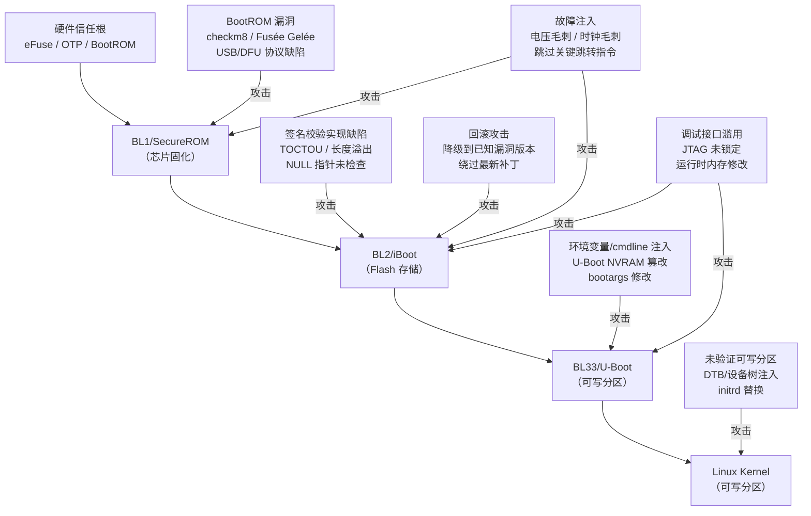

---
tags:
  - 固件
  - IoT
  - tier3
  - 安全启动
  - 固件安全
---
# 安全启动链绕过技术

> [!abstract] TL;DR
> 安全启动（Secure Boot）通过逐级验签构建从硬件信任根到操作系统的信任链，任何一级验签缺陷都可能导致整条链的崩溃。本章系统梳理 BootROM 漏洞、签名校验实现缺陷、环境变量注入、回滚攻击、故障注入、调试接口滥用等绕过手法的原理与防御加固策略，以防御视角帮助研究者理解攻击面从而构建更健壮的固件安全体系。

## 概述与定位

安全启动（Secure Boot）是现代嵌入式设备与移动平台的核心安全基础设施，其设计目标是确保设备从加电到操作系统完全运行的整个过程中，每一步执行的代码都经过设备制造商的授权与签名验证。一旦安全启动被绕过，攻击者便可加载未授权的 bootloader 或内核，进而在设备上建立持久化的、操作系统层面无法感知的恶意代码驻留。

在固件与 IoT 逆向工程体系中，安全启动绕过研究处于"攻击链综合"的位置：它需要综合利用第 06 章（Bootloader 逆向与 ATF 架构）、第 10 章（JTAG 等硬件调试接口）、第 12 章（TrustZone 安全世界）、第 17 章（硬件故障注入与侧信道）等多个方向的知识，是理解嵌入式设备整体安全纵深的"综合考题"。

本章的知识覆盖三个维度：

1. **信任链原理**：从硅片级的不可变 ROM 到 Linux 内核的逐级验签机制；
2. **绕过手法分析**：每种绕过手段的技术原理、历史案例（checkm8、Fusée Gelée 等）以及利用条件；
3. **防御加固策略**：针对各类攻击向量的防护措施，包括 anti-rollback、measured boot、JTAG 锁定等。

本章严格采用防御/教育视角，所有技术分析均服务于"理解攻击面以便更好地防御"这一目的。

## 原理与机制

### 信任根的本质：不可变性与硬件绑定

安全启动的基础是**信任根（Root of Trust，RoT）**，它必须满足两个不可妥协的属性：**不可变性**和**不可伪造性**。

在工程实现上，信任根通常由以下两类机制承载：

**BootROM（Boot ROM）**：集成在片上系统（SoC）内部的只读存储器，在芯片生产时已固化代码，出厂后无法通过任何软件手段修改。BootROM 是设备加电后 CPU 执行的第一段代码，它的完整性天然由硬件架构保证——没有任何运行时可写的存储路径可以改变 BootROM 的内容。

**eFuse/OTP（One-Time Programmable）**：一次性可编程保险丝，用于存储设备的根公钥哈希（Root Public Key Hash）或 Root of Trust 标识符。eFuse 一旦熔断便永久写入，无法恢复为出厂状态。典型实现包括 Apple 的 GID/UID 密钥、高通的 QFPROM、以及多数 ARM SoC 厂商的 OTP 控制器。

两者共同构成硬件信任根：BootROM 持有执行逻辑，eFuse/OTP 持有验证材料（公钥哈希），两者均不可被运行时攻击篡改。

### ARM 信任链：BL1 → BL2 → BL31/BL33 → 内核

以 ARM Trusted Firmware（ATF，现更名为 TF-A）为参考实现，典型 ARMv8-A 平台的启动链如下：

```
加电复位
   │
   ▼
[BootROM] ← 硬件固化，读取 eFuse 中的根公钥哈希，验证 BL1 签名
   │  验签通过
   ▼
[BL1 - Boot Loader Stage 1] ← 存于可信存储（通常是 eMMC/NOR Flash 的受保护分区）
   │  BL1 验证 BL2 签名（使用 BL1 中内嵌的 trusted key 或 eFuse 派生密钥）
   ▼
[BL2 - Boot Loader Stage 2] ← 初始化安全世界，加载 BL31/BL32/BL33
   │  BL2 验证每个镜像的签名
   ├──→ [BL31 - EL3 Runtime Firmware] ← 常驻 Secure EL3，提供 SMC 服务
   ├──→ [BL32 - Secure-OS/OP-TEE] ← 可选，安全世界操作系统
   └──→ [BL33 - Non-secure BL / U-Boot / UEFI] ← 普通世界引导程序
            │  BL33 验证 Linux 内核镜像（FIT image + kernel 签名）
            ▼
         [Linux Kernel] ← 可选：内核 initrd/模块签名验证（IMA/dm-verity）
```

每一级的验签都使用非对称加密（通常是 RSA-2048/4096 或 ECDSA P-256/P-384），签名材料（公钥或公钥哈希）来自上级可信环境。这种"链式委托"机制确保任何一级代码的修改都无法逃过上级的验证，除非同时攻破上级的密钥或实现。

### Apple A 系列芯片的 Secure Boot 模型

Apple 的安全启动在业界极具代表性，因为 checkm8 漏洞的公开使其成为最深入研究的案例之一。

Apple 设备的启动链为：

```
SecureROM (BootROM)
   ↓ 验证 iBoot 签名（SHSH2 机制 + APTicket）
iBoot (Low-Level Bootloader)
   ↓ 验证主 iBoot 签名
iBoot (Main)
   ↓ 验证内核缓存（kernelcache）签名
XNU Kernel + 内核扩展（需要签名）
```

Apple 在 eFuse 中存储了设备唯一的根密钥（UID），并要求每次固件版本升级必须通过苹果服务器颁发 SHSH2（Signed Hash）票据，确保用户无法降级到已知漏洞版本——这是 anti-rollback 的典型实现。

### Android 设备的 Verified Boot（AVB）

Android 通过 Android Verified Boot 2.0（AVB 2.0）实现启动验证：

- **启动关键分区**：`boot`、`system`、`vendor`、`dtbo` 等分区均有 dm-verity 哈希树保护；
- **VBMeta 结构**：每个分区的哈希被汇总到 VBMeta 描述符，VBMeta 本身由设备厂商的私钥签名；
- **Rollback Index**：存储在 eFuse 或 RPMB（Replay Protected Memory Block）中，防止版本降级。

AVB 2.0 的设计将整个验证流程解耦为链式描述符，便于 OEM 定制，但也带来了额外的攻击面：VBMeta 链中任何一个描述符的实现错误都可能被利用。

## 结构/算法/伪代码详解

### 签名验证的标准实现模式

一个正确实现的签名验证流程应当遵循以下步骤（以 RSA-PSS 为例）：

```c
// 安全的签名验证伪代码
int verify_image(const uint8_t *image, size_t image_len,
                 const uint8_t *sig, size_t sig_len,
                 const rsa_pubkey_t *pubkey) {
    // 步骤1：验证公钥哈希是否与 eFuse 中存储的值匹配
    uint8_t computed_hash[SHA256_DIGEST_SIZE];
    sha256(pubkey->raw_bytes, pubkey->len, computed_hash);
    
    if (!constant_time_compare(computed_hash, efuse_read_root_pubkey_hash(),
                               SHA256_DIGEST_SIZE)) {
        return ERR_PUBKEY_MISMATCH;  // 公钥不可信
    }
    
    // 步骤2：验证镜像长度在合理范围内（防止整数溢出/越界）
    if (image_len == 0 || image_len > MAX_IMAGE_SIZE) {
        return ERR_INVALID_LENGTH;
    }
    
    // 步骤3：计算镜像哈希
    sha256(image, image_len, computed_hash);
    
    // 步骤4：RSA 验签（内部：RSA 公钥运算 + PKCS#1 v2.1 PSS 解码）
    if (rsa_verify_pss(pubkey, sig, sig_len,
                       computed_hash, SHA256_DIGEST_SIZE) != 0) {
        return ERR_SIGNATURE_INVALID;
    }
    
    // 步骤5：验证 Rollback Index（防降级）
    uint32_t image_version = extract_version_from_header(image);
    if (image_version < efuse_read_min_version()) {
        return ERR_ROLLBACK_DETECTED;
    }
    
    // 所有检查通过，镜像可信
    return SUCCESS;
}
```

上述流程中，任何一个步骤的省略或实现错误都可能成为绕过点：步骤 1 对应"公钥替换攻击"，步骤 2 对应"长度/边界错误"，步骤 5 对应"回滚攻击"。

### checkm8 类型 BootROM 漏洞的原理分析

checkm8 是由 axi0mX 于 2019 年发布的针对 Apple SoC（A5 至 A11 Bionic）的 BootROM 漏洞，因其存在于不可修补的 ROM 中而成为永久性漏洞。理解其原理对评估 BootROM 安全性有重要意义。

checkm8 的核心是 **USB DFU（Device Firmware Upgrade）处理程序中的 use-after-free 漏洞**：

```
USB DFU 设置阶段（Setup Phase）与数据阶段（Data Phase）的竞争条件：

正常流程：
  Host 发送 DFU_DNLOAD 请求 → BootROM 分配 IO 缓冲区 → 等待数据 → 接收数据 → 释放缓冲区

漏洞场景：
  1. Host 发送带有 wLength=0 的 DFU_DNLOAD Setup 包
  2. BootROM 在设置阶段就调用 usb_core_complete_endpoint_io() 准备释放 IO 请求对象
  3. 但 IO 请求对象中的回调指针在下一次 OUT 事务到达时仍然可被访问
  4. 攻击者通过精确控制 USB 总线时序，在对象被"半释放"的窗口内
     发送特制数据包，触发对已释放内存的回调指针解引用
  5. 结合对 USB 控制器 DMA 缓冲区的内存布局喷射（Heap Spray）
     将回调指针指向可控的 shellcode 区域
```

此类漏洞之所以"永久不可修补"，是因为 BootROM 本身是出厂固化的，苹果无法通过 OTA 更新修复它。唯一的修复途径是更换搭载新版 BootROM 的 SoC（如 A12 Bionic 已修复）。

Fusée Gelée（Nintendo Switch Tegra X1 漏洞）与之类似，也是 USB 处理代码中的越界写入，同样存在于 BootROM 无法修补的区域。

### Mermaid：安全启动绕过攻击面全景



### TOCTOU（Time-Of-Check Time-Of-Use）攻击模型

TOCTOU 是签名校验实现中最危险的缺陷类型之一。其基本模型如下：

```
正确实现（检查与使用在同一内存视图下）：
  1. 从可信存储将镜像加载到 SRAM
  2. 对 SRAM 中的镜像计算哈希并验签
  3. 从 SRAM 中执行已验证的镜像
  全程操作同一份内存，DMA 无法在验签后修改 SRAM

错误实现（TOCTOU 漏洞）：
  1. 对 Flash 中镜像的"元数据区域"计算哈希并验签 ← Check
  2. 验签通过后，从 Flash 加载实际代码到执行区域 ← Use
  攻击者可在步骤1和步骤2之间修改 Flash/DMA 目标
  使验签通过的是一个合法镜像，执行的却是修改后的镜像

更隐蔽的 DMA 竞争（典型于早期 MediaTek SoC）：
  1. CPU 触发 DMA 从 eMMC 加载镜像到 DRAM
  2. CPU 对 DRAM 中的镜像进行验签 ← Check
  3. DMA 仍在后台运行，继续修改 DRAM 中的内容 ← 竞争窗口
  4. CPU 跳转到 DRAM 中执行 ← Use（此时内容已被 DMA 篡改）
```

防御 TOCTOU 的正确实践是：在验签完成后且 DMA 完全停止前，禁止执行任何来自 DRAM 的代码，或对最终执行的内存区域进行二次哈希校验。

### 整数溢出导致的长度绕过

签名验证代码中的长度计算错误是历史上出现频率最高的漏洞类型：

```c
// 存在整数溢出漏洞的代码（历史案例概念还原）
int verify_signed_image(const uint8_t *header) {
    uint32_t image_size  = *(uint32_t *)(header + 4);   // 攻击者可控
    uint32_t sig_offset  = *(uint32_t *)(header + 8);   // 攻击者可控
    
    // 漏洞：image_size + sig_offset 可能溢出为小值
    // 例如 image_size = 0xFFFFFFF0, sig_offset = 0x20
    // 相加结果 = 0x00000010，绕过了合理性检查
    if (image_size + sig_offset > MAX_FLASH_SIZE) {
        return ERR_TOO_LARGE;  // 溢出后检查失效
    }
    
    // 真实签名数据可能在有效载荷范围之外
    uint8_t *sig_ptr = header + sig_offset;
    
    // 对 image_size 字节的内容计算哈希，但实际内存中
    // image_size 长度的数据可能跨越合法范围
    sha256(header + HEADER_SIZE, image_size, computed_hash);
    
    return rsa_verify(sig_ptr, computed_hash);
}
```

正确防御需要在所有算术运算上使用溢出安全函数（如 `__builtin_add_overflow`）或显式的上下界检查。

### 回滚攻击（Rollback Attack）详解

回滚攻击不是破解签名算法，而是利用"旧版本的合法签名镜像"加载到设备上，然后利用旧版本中存在的已修复漏洞获得进一步控制权。

```
回滚攻击流程：

当前状态：设备运行 v3.0，已修复 v2.0 中的 CVE-2023-XXXX（BL2 内存越界）

攻击者目标：降级到 v2.0，利用 CVE-2023-XXXX

条件：
  - 攻击者拥有 v2.0 的签名镜像（v2.0 由厂商合法签名，签名验证通过）
  - 设备没有实现 Anti-Rollback 机制（或 Anti-Rollback 实现存在缺陷）

攻击步骤：
  1. 通过 UART/JTAG/fastboot 进入 bootloader 刷写模式
  2. 使用 fastboot flash boot boot_v2.0.img（该镜像签名合法，验签通过）
  3. 设备加载 v2.0 BL2，其中包含 CVE-2023-XXXX 缓冲区溢出
  4. 利用该漏洞在 BL2 中执行任意代码，加载未签名内核

Anti-Rollback 防护：
  - 在 eFuse 中存储"最小可接受版本号"（Minimum Version Counter）
  - 验签通过后，额外检查镜像头部的 version 字段
  - 若 version < eFuse 中的 min_version，拒绝启动
  - 每次安全补丁发布时，通过软件工具将 eFuse 中的版本号熔断递增
  - 熔断操作不可逆：设备永久无法回到旧版本
```

### DTB/设备树注入

在 Linux 启动流程中，设备树二进制（DTB）用于描述硬件拓扑，内核在初始化阶段解析它来配置驱动程序。许多 Android 设备的 `dtbo`（Device Tree Blob Overlay）分区单独存放，而历史上部分设备的验签实现只验证了 `boot.img`（内核+initrd），未对 `dtbo` 进行签名验证。

```
DTB 注入攻击场景（历史漏洞模式）：

设备分区布局：
  boot   → 已签名并验证：内核 + initrd
  dtbo   → 未签名或签名检查被跳过

攻击者修改 dtbo 的方式：
  1. 通过 UART Shell 或 ADB（如 Bootloader 已解锁）写入修改后的 dtbo
  2. 修改内容示例：
     - 添加 chosen 节点中的 bootargs 追加 "init=/bin/sh"
     - 修改某驱动的 reg 属性使其 MMIO 映射到其他设备的寄存器区域
     - 通过 gpio 配置影响 UART 调试输出路由

后果：即使内核本身是可信的，其行为也被攻击者控制的 DTB 所左右
```

AVB 2.0 通过将 `dtbo` 也加入 VBMeta 链来解决这一问题，但前提是设备实现了完整的 VBMeta 链验证。

## 工具视角与实战

### 安全研究环境搭建原则

合法的安全启动研究必须在**自有设备**或**授权实验室设备**上进行。典型研究环境包括：

- **开发板**：NVIDIA Jetson（支持 Secure Boot 研究且有完整文档）、Raspberry Pi 4（有 Secure Boot 原型实现）、NXP i.MX 系列（有完整 HAB/AHAB 参考实现）；
- **手机**：自购的解锁版测试机，非用户生产设备；
- **网络设备**：自购路由器、NAS，用于分析其固件验签机制。

### fastboot 与 U-Boot 环境变量分析工具

**fastboot 工具链**：Android 设备标准刷写接口，合法 Bootloader 解锁后可使用：

```bash
# 检查当前 Bootloader 状态
fastboot getvar unlocked
fastboot getvar secure
fastboot getvar ro.boot.verifiedbootstate

# 查看 AVB VBMeta 信息（需 avbtool）
avbtool info_image --image boot.img
avbtool info_image --image vbmeta.img

# 验证镜像签名（离线验证，无需设备）
avbtool verify_image --image boot.img --key vendor_pubkey.pem
```

**U-Boot 环境变量分析**：U-Boot 将其配置存储在 Flash 的特定区域（`uboot-env` 分区），可以通过以下途径分析：

```bash
# 方法1：通过 UART 进入 U-Boot shell
# 上电时按指定组合键（如空格/回车/特定字符）中断启动

# U-Boot shell 中查看环境变量
> printenv

# 特别关注以下变量（历史上曾被注入利用）：
# bootargs  - 内核命令行，可能影响 init 进程
# bootcmd   - 启动命令序列
# boot_check_sum - 部分实现中是可篡改的完整性检查

# 方法2：从 Flash 转储中提取 U-Boot 环境
# 使用 strings 工具在固件转储中搜索 "bootargs=" 等字符串
strings firmware.bin | grep -E "^boot(args|cmd|delay)="

# 方法3：使用 fw_printenv（Linux 用户空间工具）
# 在目标设备的 Linux 系统中运行
fw_printenv bootargs
```

### checkm8 的公开参考实现分析

checkm8 的原始利用工具已在 GitHub 公开（ipwndfu、checkra1n），但本章仅分析其技术原理用于理解防御：

```
checkm8 利用流程（仅原理，防御用途）：

1. 发现阶段：
   - 通过 USB VID/PID 0x5ac/0x1227 识别设备处于 DFU 模式
   - 读取设备芯片型号（A11 = T8015，A10 = T8010 等）确认是否易受攻击

2. Heap 喷射（Spray）阶段：
   - 发送大量 USB Control Transfer 请求，在 USB Heap 上建立可预测布局
   - 目标：在特定偏移处放置可控数据，为后续回调跳转做准备

3. 触发漏洞阶段：
   - 发送精确构造的 wLength=0 DFU_DNLOAD Setup 包触发 UAF
   - 在回调指针被解引用时跳转到预置 shellcode

4. 执行阶段：
   - Shellcode 在 BootROM 上下文（最高特权）中运行
   - 通常功能：修补内存中的签名验证函数，使其永远返回"验证通过"
   - 此后加载的所有镜像都不再经过真实验签

防御启示：
   - USB 协议处理代码应进行彻底的模糊测试（fuzz）
   - 长度字段处理必须有显式边界检查
   - Heap 布局应引入随机化以对抗喷射
   - USB DFU 模式应在生产设备上默认禁用
```

### IDA/Ghidra 分析 BootROM 的签名验证函数

当研究者获得 BootROM 转储（如通过故障注入或历史遗留的调试接口）时，定位签名验证函数是首要任务：

```
在 IDA/Ghidra 中定位 RSA 验签函数的策略：

1. 搜索已知常量：
   - RSA 模幂运算中常见的 Montgomery Multiplication 魔数
   - SHA-256 初始化向量（H0-H7 的固定值）
   - PKCS#1 padding 字节序列 0x00 0x01 0xFF...

2. 交叉引用字符串：
   - 搜索 "verify"、"signature"、"hash mismatch" 等字符串
   - 从字符串引用回溯到调用函数

3. 识别 eFuse 读取函数：
   - 搜索 eFuse 控制器的 MMIO 基地址（因 SoC 而异，如高通 0x00058000）
   - 追踪 eFuse 读取结果的流向，找到与之比较的哈希验证逻辑

4. 分析关键判断节点：
   - 找到关键的条件跳转（CBZ/BEQ/CMP-BNE）
   - 判断此跳转是否是"验签失败则 halt"的控制流
   - 分析在故障注入场景下跳过此跳转的后果
```

### binwalk 与手工分析 signed image 格式

各平台的签名镜像格式各有不同，但有通用的分析方法：

```bash
# 分析 Android boot.img 结构
binwalk -e boot.img

# 查看 AVB footer
python3 -c "
import struct
with open('system.img', 'rb') as f:
    f.seek(-64, 2)  # AVB footer 在文件末尾
    footer = f.read(64)
    if footer[:4] == b'AVBf':
        print('AVB Footer found')
        version, blk_size, img_size = struct.unpack('>BBQ', footer[4:14])
        print(f'Block size: {blk_size}, Image size: {img_size}')
"

# 分析 U-Boot FIT (Flattened Image Tree) 格式
dumpimage -l fitImage  # 需要 u-boot-tools
# 输出各子镜像的哈希算法、签名算法、公钥名称

# 提取并验证 FIT 中的内核签名
dumpimage -T flat_dt -p 0 -o kernel.bin fitImage
openssl dgst -sha256 -verify public_key.pem -signature kernel.sig kernel.bin
```

### RPMB 与 Anti-Rollback Index 分析

RPMB（Replay Protected Memory Block）是 eMMC/UFS 内置的防篡改存储区域，Android 设备常用它存储 Rollback Index：

```
RPMB 访问流程分析（防御理解）：

写入 RPMB：
  1. 主机向 eMMC 请求认证密钥（由 TEE/Secure OS 管理）
  2. 构造写入请求：计数器 + 数据 + HMAC-SHA256 MAC
  3. eMMC 内部验证 MAC，仅接受有效请求
  4. 存储带递增计数器的数据，拒绝重放旧请求

逻辑绕过场景（研究视角）：
  - 如果 TEE（OP-TEE/QSEE）被攻破：攻击者可以用 TEE 访问 RPMB 并清零 Rollback Index
  - 如果 eMMC 被物理替换：新 eMMC 中无已存储的计数器，计数器归零
  - 上述两种场景均需要严重的前提条件（TEE 已沦陷或物理硬件访问）

这说明 Anti-Rollback 的强度依赖于整个信任链的强度，而非 RPMB 机制本身的孤立强度。
```

### JTAG 未锁定的利用窗口

在生产阶段未正确锁定 JTAG 的设备，攻击者可以在 Bootloader 运行期间通过 JTAG 实时修改内存：

```
JTAG 运行时内存修改绕过 Secure Boot（概念流程）：

环境：
  - 目标设备：JTAG 物理接口暴露且未通过软件/熔丝锁定
  - 工具：OpenOCD + JTAG 调试器（J-Link / FT2232H 自制）

流程：
  1. 上电，通过 JTAG 连接（此时 CPU 可能在 BootROM 中执行）
  2. 在 BL2 验签函数入口设置断点（需要先分析 BootROM 确定地址）
  3. 断点触发后：
     a. 检查调用栈，确认当前处于签名验证上下文
     b. 定位签名验证函数的返回值寄存器或返回路径
     c. 修改内存中的签名验证结果：将失败路径的条件跳转 patch 为无条件跳转
     d. 或直接将签名验证函数的第一条指令替换为 "mov r0, #0; bx lr"（ARM：返回0=成功）
  4. 继续执行，Bootloader 认为验签通过，加载并执行未签名镜像

防御措施：
  - 生产固件中通过向 DAP Lock eFuse 写入特定值来锁定 JTAG
  - 通过软件禁用 CoreSight 组件（DBGDSCR、MDSCR 中的 HDBGEN/UDCCD 位）
  - 将 Secure Debug 绑定到设备证书，仅授权的调试器可连接
```

## 安全性与正确使用

> [!caution]
> 安全启动绕过技术的研究与实践存在严格的法律与道德边界。本章所述的所有技术手法，包括但不限于 BootROM 漏洞利用、JTAG 调试接口操控、故障注入验签绕过、回滚攻击，均**只能**在以下场景中合法使用：
>
> 1. **自有设备**：研究者对设备拥有完整的所有权，且该研究不违反设备制造商的服务条款（如学术研究、个人破解自用设备的某些辖区豁免）；
> 2. **书面授权的渗透测试**：拥有目标设备所有方（企业、机构）出具的明确书面授权，明确规定测试范围、时间和边界；
> 3. **厂商漏洞披露项目（Bug Bounty）**：在厂商的安全研究计划范围内，按照 CVD（Coordinated Vulnerability Disclosure）流程进行研究，发现漏洞后在厂商修复并完成协调期后才公开披露。
>
> **本章不提供**针对他人设备、商业设备保护机制或在生产环境中实施的武器化步骤。对第三方设备进行未授权的 Secure Boot 绕过在大多数辖区构成违法行为（包括但不限于《计算机欺诈和滥用法》CFAA、《欧盟网络与信息安全指令》NIS2、中国《网络安全法》及《数据安全法》）。
>
> 研究者应遵循 **CERT/CC 负责任披露时间线**（通常为 90 天）向受影响厂商报告漏洞，并在修复发布后再进行公开演讲或发表。任何研究成果的分享都应仔细评估"武器化潜力"，避免公开可直接用于攻击未修复设备的完整利用代码。

### 各绕过向量的防御加固矩阵

| 攻击向量 | 技术原理 | 防御措施 | 防御强度 |
|---------|---------|---------|---------|
| BootROM UAF/溢出 | USB/UART 处理代码内存错误 | 代码审计 + Fuzzing；新版本 ROM 修复；物理方法无法回滚 | 中（ROM 不可更新） |
| 签名验证 TOCTOU | 验签与执行间的内存竞争 | 验签后锁定内存；二次校验；使用 SRAM 而非 DRAM 执行 | 高（软件可修复） |
| 长度整数溢出 | 算术溢出绕过大小检查 | 使用溢出安全算术；边界检查全面审计 | 高（软件可修复） |
| 环境变量注入 | 修改 U-Boot 变量影响启动 | 锁定 env 分区（LOCK bit）；验证 bootargs 格式；禁用 saveenv | 高（配置可加固） |
| 回滚攻击 | 降级到有漏洞旧版本 | Anti-Rollback Counter（eFuse）；RPMB Rollback Index | 高（需 eFuse 支持） |
| 故障注入 | 电压/时钟毛刺跳过验签 | 电压检测电路；时钟监控；冗余验签；逻辑包裹（Sensor+Alarm） | 中高（硬件成本） |
| JTAG 未锁 | 运行时内存修改 | 生产阶段熔断 DAP Lock eFuse；软件禁用 CoreSight | 高（需生产流程管控） |
| DTB 注入 | 修改设备树影响内核行为 | 将 dtbo 加入 VBMeta 链验签；内核启动后只读挂载 | 高（软件可修复） |
| 物理 eMMC 替换 | 绕过 RPMB 存储的 Rollback Index | 绑定设备唯一密钥（UID）到 Rollback Index 存储；启动时 TEE 验证 | 高（需 TEE 配合） |

### Measured Boot 与 Attestation

超越 Verified Boot 的下一个安全层级是 **Measured Boot**：不仅验证镜像签名，还将每级镜像的哈希值记录到安全存储（如 TPM 的 PCR 寄存器，或 ARM 平台的 TrustZone 保护内存），形成完整的"启动度量日志"。

```
Measured Boot 工作流程：

1. BootROM 执行 BL1 前，计算 BL1 的 SHA-256 哈希，扩展到 TPM PCR[0]
2. BL1 执行 BL2 前，计算 BL2 哈希，扩展到 PCR[1]
3. 依次类推，直到操作系统
4. 操作系统加载完成后，远程验证方（Attestation Server）可以：
   a. 向设备请求包含 PCR 值的 TPM Quote（由 TPM AK 私钥签名）
   b. 将 PCR 值与已知良好启动路径的预期值对比
   c. 若匹配，设备处于"可信状态"，颁发访问令牌/解密密钥
   d. 若不匹配（有任何镜像被篡改），设备被隔离

与 Secure Boot 的区别：
  Secure Boot = 拒绝不合法的镜像运行（阻止执行）
  Measured Boot = 记录实际运行了什么（允许执行，但建立可审计的信任链）
  两者互补，共同构成完整的平台完整性验证体系
```

### 故障注入防护的硬件实现原则

在设计需要抵抗故障注入的安全芯片时，以下硬件防护原则被广泛采用（参考 Common Criteria EAL5+ 要求）：

```
电压故障注入防护：
  - 电压检测器（Voltage Tamper Detector）：在 VDD 轨上设置上下界监控
  - 一旦检测到异常电压脉冲，立即触发安全清除（Secure Wipe）或进入锁定状态
  - 电容旁路（Decoupling）设计要仔细权衡，过强的滤波会影响正常工作，
    过弱则无法抑制精确注入的毛刺

时钟故障注入防护：
  - 时钟监控器（Clock Glitch Detector）：检测异常短的时钟周期
  - 片上晶振（On-chip Oscillator）代替外部晶振，降低时钟操控面
  - 使用异步逻辑或双轨逻辑（Dual-rail）使时序攻击更难以精确

软件层防护（配合硬件）：
  - 关键验签函数的冗余执行：执行两次验签，比较结果，若不一致视为故障
  - 时间随机化（Jitter）：在密码操作前加入随机延迟，使攻击者难以精确定时
  - 失败计数器：连续失败超过阈值后锁定设备，防止暴力尝试故障注入
```

### 供应链安全与 Secure Boot 密钥管理

Secure Boot 的安全性最终依赖于签名私钥的安全性。即使实现完美的 Secure Boot 逻辑，若私钥泄露，攻击者可以签署任意恶意镜像，使其通过所有验证。

密钥管理的最佳实践：

- **硬件安全模块（HSM）**：私钥永远不以明文形式离开 HSM，签名操作在 HSM 内部完成；
- **多方授权（Multi-Party Authorization）**：触发签名操作需要多个授权方的分布式密钥；
- **密钥层次结构**：使用根密钥（Root Key）签发中间密钥（Intermediate Key），中间密钥用于日常签名，根密钥离线保存（冷存储）；
- **密钥撤销机制**：通过 eFuse 熔断某个密钥槽的"有效"位来吊销已泄露密钥，前提是设计了多密钥槽；
- **代码签名流水线审计**：所有签名操作留下审计日志，检测异常签名请求。

## 小结

安全启动链是现代嵌入式设备最重要的安全防线，其强度由最薄弱的环节决定。通过本章的系统梳理，可以得出以下核心结论：

**信任根的不可动摇性**是整个体系的基础。BootROM 中的代码缺陷（如 checkm8、Fusée Gelée）一旦被发现便成为永久弱点，因为它们存在于硬件固化的 ROM 中无法通过 OTA 修补。这要求芯片设计阶段就要对 USB/UART 等引导接口的协议处理代码进行严格的安全审计和模糊测试。

**签名校验的实现质量**决定软件层防御的上限。TOCTOU 竞争条件、整数溢出导致的长度绕过、未对所有分区（如 DTB）进行验签等问题均属软件层可修复的缺陷，但在实际产品中反复出现，说明安全编码实践在 Bootloader 开发中仍未得到充分重视。

**Anti-Rollback 机制**是防御已知漏洞版本降级的必要手段，但其有效性依赖 eFuse 的不可逆性，且需要完整的密钥管理流水线配合——每次安全补丁发布后都要递增版本计数器并熔断对应 eFuse 位。

**物理攻击界面**（JTAG 未锁定、故障注入）提醒我们安全启动不能只是软件工程问题。生产流程中的 JTAG 锁定、防故障注入的电压/时钟监控电路，以及硬件安全评估（如 CC 认证的物理防护等级）是完整防御体系不可或缺的组成部分。

**Measured Boot 与远程证明**代表了超越 Verified Boot 的下一代完整性验证范式，通过将启动链的度量记录与云端远程验证结合，实现了对设备运行时状态的持续监控，而不仅仅是加载时的一次性验证。

这些知识共同构成固件安全工程师在设计、审计和防御嵌入式设备安全启动体系时的核心知识框架。

## 相关阅读

- **第 06 章**：《Bootloader 逆向：U-Boot 与 ATF》——深入了解 BL1/BL2/BL31 的代码结构与 ATF 实现细节；
- **第 10 章**：《硬件调试接口：JTAG 与 SWD 与 UART》——JTAG 接口的物理连接、OpenOCD 使用和调试原语；
- **第 12 章**：《TrustZone 与 OP-TEE 安全世界逆向》——TrustZone 安全世界的隔离机制与 TA/CA 逆向分析；
- **第 17 章**：《硬件侧信道与故障注入》——差分功耗分析、电压/时钟毛刺攻击的原理与 ChipWhisperer 实战；
- **第 20 章**：《UEFI 与 BIOS 固件逆向》——x86 平台 UEFI Secure Boot（基于 Shim/MOK）的对应实现；
- **ARM TF-A 官方文档**：[https://trustedfirmware-a.readthedocs.io](https://trustedfirmware-a.readthedocs.io)——BL1-BL33 启动流程权威参考；
- **Android AVB 源码与文档**：AOSP `system/vboot_reference/` 目录——AVB 2.0 实现与 `avbtool` 使用；
- **axi0mX checkm8 技术分析**：[https://github.com/axi0mX/ipwndfu](https://github.com/axi0mX/ipwndfu)——仅供学术分析参考；
- **ROP Gadgets 与 BootROM 分析**：marcan 的 Fusée Gelée 公开报告（2018 Fail0verflow）；
- **Common Criteria 嵌入式平台 PP（Protection Profile）**：理解工业级 Secure Boot 的安全需求规范来源。

---

[[00.固件与IoT嵌入式逆向总览|⬆ 系列总览]] | [[20.UEFI与BIOS固件逆向|← 上一章]] | [[22.eMMC与NAND芯片级取证|→ 下一章]]
