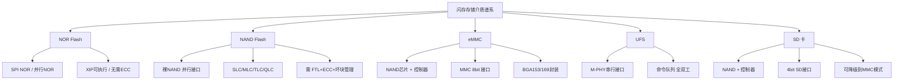
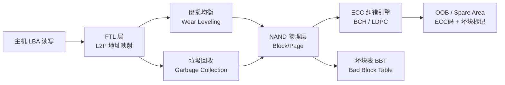
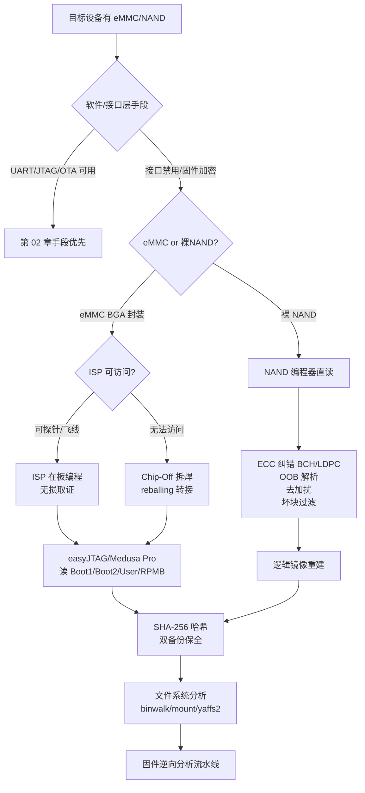

---
tags:
  - 固件
  - IoT
  - tier3
  - eMMC
  - 取证
---
# eMMC 与 NAND 芯片级取证

> [!abstract] TL;DR
> eMMC/NAND 芯片级取证是固件逆向中最具破坏性也最强大的物理提取手段。当 JTAG、UART、SPI 等接口被禁用或加密时，直接读取存储芯片往往是唯一出路。本章系统梳理存储介质体系（NOR/NAND/eMMC/UFS/SD）、eMMC 内部架构（控制器、分区、扩展 CSD）、芯片级读取方法（chip-off 拆焊、ISP 在板编程、boundary scan）、NAND 裸读难题（ECC/OOB/坏块/地址加扰）、闪存转换层（FTL）原理、专业工具（easyJTAG/PC-3000/Xgpro）、RPMB 认证机制、取证流程与证据完整性保全，并与第 02 篇（固件提取）充分衔接。

## 概述与定位

固件逆向的基础是"拿到二进制"。第 02 章介绍了最常见的逻辑提取路径（串口/FTP/OTA 截包）和初级物理路径（SPI Flash 直读、JTAG 调试接口）。然而，现代消费级 IoT 设备、智能手机、NVR、工控终端越来越多地采用 **eMMC（embedded Multi-Media Card）** 或裸 **NAND Flash** 作为主存储，这两种介质与传统 SPI NOR Flash 存在根本性区别，无法用同一套方法处理。

**本章的定位**：当常规软件/接口层手段全部失效——芯片已 fuse、调试接口 disable、固件加密且无漏洞可用——芯片级取证是最后的物理手段。它要求研究者同时具备硬件操作（焊接、BGA 返工）、存储介质协议（MMC/NAND 规范）、ECC 算法恢复和文件系统重组等多领域能力，是固件逆向体系中技术门槛最高、破坏性最大的一环。

### 与第 02 章的边界划分

| 手段 | 第 02 章 | 本章 |
|------|---------|------|
| SPI NOR Flash（SOIC-8/16） | 覆盖（flashrom + CH341A） | 不重复 |
| JTAG 接口读 Flash | 覆盖（OpenOCD + boundary scan 基础） | 扩展 boundary scan 细节 |
| eMMC 在板 ISP 读取 | 提及但不深入 | 重点覆盖 |
| eMMC chip-off 拆焊重焊 | 未覆盖 | 重点覆盖 |
| 裸 NAND + ECC 恢复 | 未覆盖 | 重点覆盖 |
| RPMB 保护分区 | 未覆盖 | 覆盖 |

---

## 原理与机制

### 存储介质全景对比

理解 eMMC 取证，首先要理清各类闪存介质的技术谱系。

#### NOR Flash

NOR Flash 是最古老也最简单的闪存形态。其核心特征是**字节可寻址**（byte-addressable），CPU 可以直接在总线上执行 NOR Flash 中的代码（XIP，eXecute In Place）。NOR 采用并行或 SPI 接口，容量通常较小（1 MB ～ 256 MB），读延迟极低（约 100 ns），但写/擦速度慢。

NOR Flash 不需要 ECC，因为它的单元结构（浮栅晶体管 + 源极直接接地）天然出错率极低。SPI NOR 是物联网 Bootloader 的标配，flashrom + CH341A 即可直读，第 02 章已完整覆盖。

#### NAND Flash

NAND Flash 以"页（Page）"为最小读写单位，以"块（Block）"为最小擦除单位。典型参数：

- **SLC（Single Level Cell）**：每个浮栅存 1 bit，可靠性最高，用于工业/汽车级
- **MLC（Multi Level Cell）**：每个浮栅存 2 bit，消费级主流，P/E 寿命约 3000～10000 次
- **TLC（Triple Level Cell）**：3 bit/cell，现代高密度 NAND
- **QLC（Quad Level Cell）**：4 bit/cell，以耐久性换密度

NAND 的关键挑战：**天然存在出厂坏块**，且随使用磨损持续产生新坏块；每页读写都需要 **ECC 纠错**；**OOB（Out-of-Band）区域**（每页附带的冗余字节）存储 ECC 码和坏块标记；大容量 NAND 还引入**地址加扰（Address Scrambling）**防止相邻位干扰。这些机制使裸 NAND 的芯片级读取远比 NOR 复杂。

#### eMMC

eMMC 是"NAND Flash 芯片 + NAND 控制器"的集成封装，遵循 JEDEC JESD84 标准（eMMC 4.x/5.x/5.1）。控制器负责：

- **FTL（Flash Translation Layer）**：将逻辑地址映射到物理 NAND 地址
- **磨损均衡（Wear Leveling）**：均匀分配写操作，延长寿命
- **坏块管理**：透明地替换坏块，上层看不到坏块
- **ECC**：对主机完全透明，控制器内部完成
- **加密（可选）**：部分 eMMC 芯片内置 AES 加密引擎

eMMC 对主机呈现的接口是 **8 位并行 MMC 接口**（CMD 线 + DAT0-7 数据线 + CLK 时钟线），电压 1.8 V 或 3.3 V，最高速率模式为 HS400（400 MB/s）。封装以 **BGA（Ball Grid Array）** 为主，常见 BGA153（11.5×13mm）和 BGA169（12×16mm）两种标准封装，以及部分厂商私有小封装。

#### UFS（Universal Flash Storage）

UFS 是 eMMC 的继任者，采用 **M-PHY + UniPro** 差分串行接口，全双工，支持命令队列（Command Queue），速度远超 eMMC（UFS 3.1 理论峰值约 2.1 GB/s）。现代旗舰手机和部分高端 IoT 设备已全面迁移至 UFS。取证难度高于 eMMC，但方法论类似（需专用适配器或 ISP）。

#### SD 卡

SD 卡在内部结构上与 eMMC 高度相似（同样是 NAND + 控制器），但接口略不同（使用 4 位 SD 接口而非 8 位 MMC 接口）。部分 eMMC 芯片可通过特殊引脚配置以 SD 模式工作，这是 ISP 取证的重要基础。



### eMMC 内部深度解析

#### 物理封装与引脚

eMMC BGA153 封装的引脚排列遵循 JEDEC 标准，关键信号线：

| 信号 | 描述 |
|------|------|
| CLK | 时钟，最高 200 MHz（HS400 模式） |
| CMD | 命令线，双向，主机发命令/芯片返回响应 |
| DAT0–DAT7 | 8 位数据总线 |
| RST_n | 硬件复位，低有效 |
| VCCQ | 信号电压（1.8 V / 3.3 V） |
| VCC | NAND 核心供电（2.7–3.6 V） |

在板读取时，必须用万用表或示波器找到这 13 根关键信号线。部分厂商会故意将 eMMC 芯片埋入 PCB 内层（Package on Package，PoP，常见于手机 SoC 直接叠封 eMMC）使物理访问更困难。

#### 分区结构

eMMC 向主机呈现 4 类分区：

**Boot1 / Boot2 分区（各 128 KB～4 MB）**：专用于引导加载程序存储，可配置为只读。上电后控制器根据 `BOOT_CONFIG` 寄存器决定从哪个分区引导。Bootloader 通常存在这里，且往往受到额外写保护。

**RPMB（Replay Protected Memory Block）分区**：防重放保护分区，用于存储设备密钥、计数器、TrustZone/TEE 中的安全数据（如 Widevine 密钥、FRP 锁定标志）。访问 RPMB 需要通过 HMAC-SHA-256 认证，主机必须持有 256 bit 鉴权密钥。RPMB 对取证意味着：**即使物理读到芯片，RPMB 数据也无法直接解密**，除非掌握密钥（通常保存在 TrustZone 安全世界或硬件熔丝中）。

**General Purpose Partitions（GPP，最多 4 个）**：可选的通用分区，部分厂商用于存储特定数据。

**User Data Area（UDA）**：主存储区域，操作系统分区（system、data、cache、userdata 等）都在这里。这是取证的主要目标。

#### 扩展 CSD 寄存器

扩展 CSD（Extended Card-Specific Data）是 512 字节的寄存器，包含 eMMC 的核心配置：

- **BOOT_CONFIG（Byte 179）**：指定引导分区和访问模式
- **BOOT_BUS_CONDITIONS（Byte 177）**：引导时总线宽度和速率配置
- **PARTITION_CONFIG（Byte 179）**：当前访问的分区选择
- **WR_REL_SET（Byte 167）**：写可靠性配置
- **RPMB_SIZE_MULT（Byte 168）**：RPMB 分区大小（× 128 KB）
- **SEC_FEATURE_SUPPORT（Byte 231）**：是否支持安全擦除/修剪
- **EXT_SECURITY_ERR（Byte 505）**：安全错误标志

读取扩展 CSD 需要发送 CMD8 命令（SEND_EXT_CSD），这在 ISP 模式下可以直接完成。分析扩展 CSD 是芯片级取证的第一步，帮助确认分区布局、写保护状态和加密配置。

### NAND 裸读的五大技术挑战

当研究对象是裸 NAND Flash（而非 eMMC 封装）时，取证面临截然不同的技术挑战。

#### 挑战一：ECC（纠错码）

NAND 存储单元天然存在翻转率，每读一页都必须进行 ECC 纠错，否则数据不可信。常见 ECC 算法：

**Hamming 码**：最早期方案，1 bit 纠错能力，适用于 SLC NAND。OOB 区域存储 Hamming 码，每 256 字节数据对应 3 字节 ECC。

**BCH（Bose–Chaudhuri–Hocquenghem）码**：现代 NAND 主流，可配置纠错能力（通常 4 bit/512B 到 40 bit/1KB）。BCH 码多项式的阶数决定纠错能力。公式：对于 GF(2^m) 上的 BCH 码，t 位纠错需要 m×t bit 的校验位。

**LDPC（Low-Density Parity-Check）码**：TLC/QLC NAND 常用，纠错能力更强（可达 80 bit/1KB），但解码计算量大。TLC NAND 不使用 LDPC 则读取不可靠。

**关键问题**：不同 NAND 控制器使用的 BCH 多项式、初始化向量、步长（stride）各不相同，且通常不公开。研究者必须通过逆向 NAND 控制器固件（或通过已知好数据反推）来恢复 ECC 参数，否则纠错后数据依然是乱的。

#### 挑战二：OOB / Spare Area 布局

每个 NAND 页由主数据区（Main Area，通常 2048 B 或 4096 B）和 OOB 区（Out-of-Band / Spare Area，通常 64 B 或 128 B）组成。OOB 区的布局因控制器而异：

```
典型 2KB页 + 64B OOB 布局（以 Linux MTD/YAFFS2 为例）：
Byte 0:      坏块标记（非 0xFF 表示坏块）
Byte 1:      坏块标记（镜像）
Byte 2-5:    页标签（YAFFS2 chunk 序号）
Byte 6-63:   ECC 数据
```

不同文件系统（JFFS2、YAFFS2、UBIFS）对 OOB 的使用方式不同，且私有控制器的 OOB 布局可能完全自定义。裸读必须正确解析 OOB 才能重建文件系统。

#### 挑战三：坏块管理

NAND 出厂时存在初始坏块，坏块标记通常在 OOB 区第 0 字节（非 0xFF）。读取时跳过坏块的逻辑必须与原始控制器一致，否则逻辑地址映射错误会导致整个文件系统无法解析。

坏块表（Bad Block Table，BBT）可能存储在：NAND 末尾专用块（Linux 方案）、NAND 起始 OOB 中（YAFFS2 方案）、控制器内部 SRAM（私有方案）。

#### 挑战四：地址加扰（Scrambling）

现代 NAND 控制器（尤其是三星、海力士、东芝）在写入前对数据进行 XOR 加扰，防止存储大量 0x00 或 0xFF 引起的相邻单元干扰（Pattern Sensitivity）。加扰种子（seed）通常与物理块/页地址有关，公式大致为：

```
scrambled_data[i] = raw_data[i] XOR LFSR_output(seed + i)
```

LFSR（线性反馈移位寄存器）的多项式和初始种子是私有参数，需要逆向控制器代码或通过已知明文攻击（写入已知数据后读回对比）来恢复。

#### 挑战五：多 Plane 操作

高密度 NAND 划分为多个 Plane（平面），每个 Plane 独立操作，控制器利用 Plane 并行化来提升带宽。多 Plane 地址交织（Plane Interleaving）改变了数据在物理地址空间的排列，取证读取时必须理解 Plane 拓扑。

---

## 结构/算法/伪代码详解

### eMMC 读取流程（ISP 模式）

ISP（In-System Programming，在板编程）是最常用的无损 eMMC 取证方式。核心思路：在设备上电状态下，通过探针或焊接飞线引出 eMMC 的 MMC 接口，用专用设备模拟"主机"直接与 eMMC 控制器通信。

```
ISP 取证流程伪代码：

1. 物理准备
   a. 确认 eMMC 型号（读取芯片丝印 → 查 datasheet）
   b. 用示波器/逻辑分析仪在 PCB 上识别 CMD/CLK/DAT0-7/RST_n 引脚
   c. 焊接 0.1mm 飞线至各信号点，或使用弹簧探针（pogos）夹具

2. 上电与复位
   a. 给 PCB 上电（或对 eMMC 单独供电：VCC=3.3V, VCCQ=1.8V/3.3V）
   b. 拉低 RST_n 至少 1 μs，然后拉高（硬件复位）
   c. 等待 eMMC 完成内部初始化（≥74 个时钟周期）

3. 初始化序列（遵循 JEDEC eMMC 规范）
   CMD0  → GO_IDLE_STATE：复位到 Idle 态
   CMD1  → SEND_OP_COND：协商工作电压，等待 eMMC ready
            (轮询直到 OCR.busy=1)
   CMD2  → ALL_SEND_CID：获取 CID（芯片 ID，含制造商/型号/序列号）
   CMD3  → SET_RELATIVE_ADDR：设置 RCA（Relative Card Address）
   CMD7  → SELECT/DESELECT_CARD：选中 eMMC
   CMD8  → SEND_EXT_CSD：读取 512 B 扩展 CSD（记录分区信息）

4. 切换分区访问
   对每个目标分区（Boot1/Boot2/RPMB/User）：
   CMD6  → SWITCH（PARTITION_CONFIG.ACC_BITS = 目标分区编号）
   等待 busy 解除

5. 块读取循环
   CMD16 → SET_BLOCKLEN（blocklen = 512）
   对 LBA=0 到 LBA=total_sectors-1：
       CMD18 → READ_MULTIPLE_BLOCK（起始 LBA）
       读取 DAT0-7 数据（DMA 或 PIO 模式）
       接收 STOP_TRANSMISSION（CMD12）
       写入原始镜像文件
       每 1GB 计算 SHA-256 校验点

6. 完整性验证
   计算整体 SHA-256 / MD5
   与参考已知设备对比（若有）
   记录 CID、扩展 CSD、起止时间、操作人
```

### chip-off 拆焊重焊流程

当 ISP 无法实施（PCB 设计无法探针访问、或已断电设备）时，chip-off 拆焊是最彻底的方法。

```
Chip-Off 标准流程：

1. 前期准备
   a. 拍摄 PCB 高分辨率照片（正面/背面/芯片区域特写）
   b. 记录 eMMC 丝印（用于查 datasheet 确认封装和引脚图）
   c. 记录设备序列号和 PCB 版本号

2. 热风拆焊
   a. 预热：PCB 背面 150°C 预热板，防止热冲击
   b. 涂助焊剂（低残留无卤助焊剂）于 eMMC 周围
   c. 热风枪：370-400°C，风量中等，螺旋扫射 BGA 上方
   d. 每隔 30s 用镊子轻试移动，熔化后平移取下
   e. 不可垂直上拔（会扯断焊球残留物损伤 PCB 焊盘）

3. 焊球重植（Reballing）
   a. 清洁芯片底部：吸锡带 + 酒精清洁残余焊料
   b. 选取匹配焊球直径（BGA153 标准：0.5mm 焊球，0.8mm pitch）
   c. 钢网定位 + 焊球摆放 + 回流（峰值 245°C，30s）
   d. 用显微镜检查焊球球形度和排列完整性
   e. 重植后的芯片可安装到 eMMC 专用转接板（BGA153→SD/MMC 连接器）

4. 转接读取
   a. 将 eMMC 焊接到转接板（或使用弹簧座免焊夹持）
   b. 转接板插入取证设备（easyJTAG Plus、Medusa Pro 等）
   c. 执行上述 ISP 初始化序列读取数据

5. 失败处理
   若焊球损伤或芯片无法正常响应：
   - 检查焊球连接质量（X 射线检测最理想）
   - 确认供电电压正确
   - 降低时钟速率（从 400 KHz 慢速模式开始）
   - 排查 CMD 线是否有上拉电阻（通常需要 47-100kΩ 上拉至 VCCQ）
```

### NAND 数据重组伪代码

从裸 NAND 编程器读出的原始 dump 包含"正确"和"损坏"两种状态数据，且物理地址顺序不等于逻辑地址顺序，必须经过重组：

```python
# NAND dump 重组伪代码（Python 风格）

PAGE_SIZE = 2048        # 主数据区大小（字节）
OOB_SIZE  = 64         # OOB/Spare 区大小（字节）
PAGES_PER_BLOCK = 64   # 每块包含的页数
TOTAL_BLOCKS = 4096    # 芯片总块数

# 步骤 1：BCH ECC 纠错
def bch_correct(main_data: bytes, oob: bytes) -> bytes | None:
    """
    从 OOB 提取 BCH 校验码，对 main_data 进行纠错。
    返回纠错后数据，若超出纠错能力返回 None（不可恢复）。
    BCH 多项式需针对具体控制器逆向确认。
    """
    ecc_from_oob = extract_ecc(oob)   # 解析 OOB 布局取 ECC 字节
    syndrome = compute_syndrome(main_data, ecc_from_oob)
    if syndrome == 0:
        return main_data              # 无错误
    error_positions = berlekamp_massey(syndrome)
    if len(error_positions) > T:      # T = 最大纠错能力
        return None                   # 不可恢复错误
    corrected = bytearray(main_data)
    for pos in error_positions:
        corrected[pos // 8] ^= (1 << (pos % 8))
    return bytes(corrected)

# 步骤 2：去加扰（Descrambling）
def descramble(data: bytes, block: int, page: int) -> bytes:
    """XOR 去除地址相关的 LFSR 加扰"""
    seed = compute_seed(block, page)  # 种子算法需逆向控制器确认
    lfsr = LFSR(seed)
    return bytes(b ^ next(lfsr) for b in data)

# 步骤 3：坏块过滤与逻辑地址重建
def reconstruct_logical_image(dump_file, output_file):
    bad_blocks = []
    good_pages = {}                   # logical_page_num → data
    
    for block in range(TOTAL_BLOCKS):
        # 读第一页 OOB 检查坏块标记
        first_page_oob = read_oob(dump_file, block, page=0)
        if first_page_oob[0] != 0xFF:
            bad_blocks.append(block)
            continue                  # 跳过坏块
        
        for page in range(PAGES_PER_BLOCK):
            raw_main, raw_oob = read_page(dump_file, block, page)
            
            # ECC 纠错
            corrected = bch_correct(raw_main, raw_oob)
            if corrected is None:
                log_error(block, page, "ECC 不可恢复")
                continue
            
            # 去加扰
            descrambled = descramble(corrected, block, page)
            
            # 解析 OOB 中的逻辑块号（不同文件系统格式不同）
            logical_block = parse_logical_block_tag(raw_oob)
            
            if logical_block is not None:
                logical_page = logical_block * PAGES_PER_BLOCK + page
                good_pages[logical_page] = descrambled
    
    # 写出逻辑镜像（以逻辑页号排序）
    with open(output_file, 'wb') as f:
        for lp in sorted(good_pages.keys()):
            f.write(good_pages[lp])
    
    return bad_blocks, len(good_pages)
```

### FTL（闪存转换层）原理

FTL 是 eMMC 控制器的核心软件层，解决了 NAND 不能原地改写（必须先擦后写）的根本矛盾。

#### 地址映射

FTL 维护一张**逻辑块到物理块的映射表（L2P Table）**，存储在 NAND 的专用区域（通常是前几个预留块）。主机发出的 LBA（Logical Block Address）经 FTL 翻译后才变成 NAND 的物理块/页地址。

```
主机写入 LBA=1000 的数据：
  FTL 找到空闲物理页 P_new（来自 GC 后的干净块）
  将数据写入 P_new
  更新 L2P Table[1000] = P_new
  旧数据所在物理页标记为"失效"（Stale）

主机读取 LBA=1000：
  查 L2P Table → 得到 P_new
  从 P_new 读出数据返回
```

#### 磨损均衡（Wear Leveling）

动态磨损均衡（Dynamic Wear Leveling）：写新数据时，优先选择 P/E 次数最少的空闲块。

静态磨损均衡（Static Wear Leveling）：定期将"冷数据"（长期未修改的数据，如系统分区）迁移到新块，把旧块释放出来接受写操作，防止热点块过度磨损。

这意味着：**从取证角度，已删除的文件数据可能仍以"失效页"形式留在 NAND 物理空间中**，只是 L2P 表已经取消了引用。chip-off 读到的原始 NAND dump 可能包含这些逻辑上已删除但物理上未擦除的数据，这对取证有重要价值。

#### GC（垃圾回收）

随着使用，失效页累积，可用空间减少。GC 过程：

1. 选择"受害块"（包含最多失效页的物理块）
2. 将受害块中的有效页（仍在 L2P 中引用的）复制到空闲块
3. 擦除受害块，变为空闲块

GC 会永久销毁失效页（无法从已擦除块中恢复数据），这是取证中的"证据消失点"。及时进行 chip-off 可以在 GC 触发前保留更多残留数据。



---

## 工具视角与实战

### 专业硬件取证设备

#### easyJTAG Plus / easyJTAG 2

easyJTAG（Easy JTAG）是手机取证/修复领域最流行的多功能盒子，由 Z3X Team 开发。主要能力：

- **eMMC 直读**：支持 ISP 模式和 chip-off 适配器，支持 BGA 153/169/221 多种封装
- **UFS 支持**：easyJTAG Plus 版本支持 UFS 2.x 芯片
- **SD/eMMC 适配器系列**：配套多种转接板（EFT Dongle Pro 适配器兼容）
- **扩展 CSD 读取**：自动解析分区结构、写保护状态
- **RPMB 读取（有限）**：无法解密，但可读取 RPMB 加密数据块本身

软件界面基于 Windows，提供图形化操作，可自动识别 eMMC 型号并配置参数。

#### Medusa Pro / Medusa Pro 2

同为手机修复取证工具，在某些 QUALCOMM 和 MTK 平台上支持**通过 SoC 的 JTAG/AHB 接口读取 eMMC**（无需飞线直接接 eMMC），利用芯片内部 DMA 通路绕过软件加密层。

#### PC-3000 Flash

Ace Laboratory 出品的专业数据恢复设备，在法证机构广泛使用。PC-3000 Flash 的独特优势：

- 支持**数百种**主流 NAND 控制器，内置私有 ECC 参数库
- 提供**数据重组（Translator）**功能：自动识别控制器类型并还原逻辑数据
- 支持裸 NAND、eMMC、SSD（SATA/NVMe）、SD 卡多种介质
- 对 SandForce、Marvell、SMI 等主流 SSD 控制器有专用支持
- 价格昂贵（数万美元），主要用于商业数字取证实验室

#### RIFF Box / RIFF Box 2

RIFF（Real Image Forensic Framework）主要针对安卓手机维修市场，支持通过 JTAG 接口读取 eMMC，配合 RIFF Manager 软件。特点是 JTAG 引脚识别数据库较全，适合处理常见品牌（三星、LG、华为老款机型）。

#### RT-809H / RT-809F 编程器

通用 IC 编程器，支持裸 NAND、eMMC、SPI NOR、并行 NOR 等多种介质。RT-809H 的优势在于**价格低廉、芯片兼容列表较长**，适合实验室日常使用。注意：对 MLC/TLC NAND 的 ECC 参数支持不完整，读出的裸数据需要额外处理。

#### Xgpro（SuperPro/UltraPro）

志研（Xeltek）系列编程器，工业级品质，支持 NAND/eMMC/NOR，提供 GUI 和命令行接口。在工控设备 NAND 取证场景较常用。

#### 开源替代：nanddump + mtd-utils

对于可以通过 Linux MTD 子系统访问的 NAND（设备仍可启动或通过 UART 获得 shell）：

```bash
# 查看 MTD 设备
cat /proc/mtd
# 示例输出：
# dev:    size   erasesize  name
# mtd0: 00200000 00020000 "boot"
# mtd1: 00200000 00020000 "kernel"
# mtd2: 01c00000 00020000 "rootfs"

# 读取 MTD 分区（含 OOB）
nanddump -f /tmp/rootfs.bin --oob /dev/mtd2

# 检查坏块
nandtest -r 0 /dev/mtd2

# 将镜像写到 PC
# （通过 netcat 或 scp 传输）
```

#### open-source: MMC Utils

```bash
# Linux 下读取 eMMC 扩展 CSD
mmc extcsd read /dev/mmcblk0

# 读取 CID（芯片标识）
cat /sys/bus/mmc/devices/mmc0\:0001/cid

# 切换到 Boot1 分区
mmc bootpart enable 1 1 /dev/mmcblk0
dd if=/dev/mmcblk0boot0 of=/tmp/boot1.img bs=512

# 创建全盘镜像（User Data Area）
dd if=/dev/mmcblk0 of=/media/usb/emmc_userdata.img bs=4M status=progress
```

### 实战场景：路由器 eMMC 取证案例

**目标设备**：某国产 4G 路由器，移除了 UART 调试口，JTAG fuse 已熔断，固件加密，OTA 更新走签名验证。

**PCB 分析**：用 X 射线扫描（或高倍显微镜）识别 eMMC BGA 芯片位置，丝印为"KLMxGxJENx"（三星 eMMC）。

**ISP 尝试**：
1. 用 0.1mm 飞线焊接 CMD/CLK/DAT0-7/RST_n 共 11 根线至 easyJTAG Plus
2. 上电后设备正常启动（不影响路由器运行），easyJTAG 识别为三星 5.1 eMMC，容量 8 GB
3. 读取扩展 CSD：BOOT_CONFIG 显示 Boot1 启动，WR_REL_SET 显示 User 区无写保护
4. 依次读取 Boot1（含 U-Boot SPL）、User Area（含 Linux rootfs）
5. 总读取时间约 45 分钟（HS200 模式，约 160 MB/s），生成 SHA-256 校验值

**数据分析**：
- Boot1 分区：`binwalk` 识别 U-Boot 镜像，`strings` 找到调试日志
- User Area：`fdisk -l emmc.img` 显示 GPT 分区表，挂载 ext4 分区直接访问文件系统
- system 分区：发现加密的 squashfs（自定义 AES 加密头），转入固件加解密分析流程

### 实战场景：NVR NAND 取证

**目标设备**：某款网络摄像头 NVR，存储采用东芝 512 MB SLC NAND，通过并行 NAND 接口直连 SoC。

**提取过程**：
1. 拆焊 TSOP48 封装 NAND（热风枪 340°C）
2. 安装到 RT-809H 编程器 TSOP48 万能座
3. 读取原始 dump（4096 块 × 64 页 × (2048+64) B）
4. 使用 `nandecco` 工具分析 OOB 布局，识别为 Hamming 纠错

**数据重组**：
```python
# 使用 nandreader 工具（开源）
nandreader -i raw_dump.bin -p 2048 -s 64 -e hamming -o output.img

# 用 binwalk 分析重组后的镜像
binwalk -e output.img

# YAFFS2 文件系统挂载
mkyaffs2image 无法直接用，改用 yaffs2utils
unyaffs output.img ./extracted/
```

---

## 安全性与正确使用

### 取证合规与证据完整性

eMMC/NAND 芯片级取证属于**破坏性操作**（chip-off 拆焊不可逆），在司法取证场景中必须严格遵循取证规程。

#### 操作前记录（Documentation Before Action）

在任何操作之前，必须建立完整的案件记录：

- 拍摄设备全貌（正面、背面、侧面）、PCB 局部特写、eMMC 芯片丝印
- 记录设备序列号、IMEI、MAC 地址（若可见）
- 记录操作人员姓名、资质、操作时间（精确到分钟）、操作地点
- 对于司法案件，应在见证人或监督人在场下进行

#### 写保护（Write Protection）

取证操作的第一原则是"不修改原始证据"。eMMC 提供多层写保护机制：

**永久写保护（Permanent Write Protection）**：一旦设置，无法解除（连接 CMD28/29 命令）。取证工具通常提供"只读模式"选项，确保不发出任何写命令。

**临时写保护（Temporary Write Protection）**：通过 CMD28 设置，上电复位后解除。取证读取全程应避免发送任何写相关命令（CMD24/25/26/27/28/29/38）。

easyJTAG 等专业取证工具内置"只读保护"模式，物理上拦截写命令。如果使用 Linux dd 读取，挂载为只读：

```bash
# 以只读方式访问 eMMC
blockdev --setro /dev/mmcblk0

# 验证只读状态
blockdev --getro /dev/mmcblk0  # 返回 1 表示只读
```

#### 哈希校验与双备份

每次读取完成后，立即生成多个哈希值：

```bash
# 同时生成 MD5、SHA-256、SHA-512（三重校验）
md5sum emmc_full.img    > hashes.txt
sha256sum emmc_full.img >> hashes.txt
sha512sum emmc_full.img >> hashes.txt

# 验证哈希（每次使用前验证）
sha256sum -c hashes.txt

# 使用 dcfldd（取证版 dd）自动计算哈希
dcfldd if=/dev/mmcblk0 of=emmc_full.img hash=sha256 hashwindow=1G hashlog=hash_log.txt bs=4M
```

原始镜像至少保留两份，存储在不同物理介质（如一份写入光盘/一次写 BD-R，一份存入加密取证硬盘）。

#### chip-off 的破坏性风险告知

chip-off 拆焊是**不可逆操作**。焊接过程中存在以下风险：

- **焊盘损坏**：过热或操作不当可能撕裂 PCB 焊盘，导致芯片无法再回焊到原板
- **芯片损坏**：热应力超过 NAND 颗粒耐热极限（通常 260°C/30s）可能损伤芯片
- **数据损坏**：极端情况下高温可能导致 NAND 单元电荷泄漏，数据永久丢失

因此，chip-off 应视为"最后手段"，优先尝试 ISP（不破坏 PCB）。若 ISP 有任何可能性，不应贸然拆焊。

### RPMB 的取证限制

RPMB 分区采用 HMAC-SHA-256 认证，读取流程如下：

1. 主机生成一次性随机数（Nonce）
2. 主机发送认证读请求（Write Counter + Nonce）
3. eMMC 用内部存储的鉴权密钥计算 HMAC
4. 返回数据 = RPMB 块 + HMAC + Nonce

**取证现实**：鉴权密钥（256 bit）在 eMMC 出厂后通过 RPMB 鉴权密钥编程命令（CMD25 + RPMB request）一次性写入，**无法从芯片外部读取**。该密钥通常由 TrustZone 安全世界生成并保管，存储在 ARM TrustZone 的 OP-TEE 或类似 TEE 中。

因此，即使完整 chip-off 读出 eMMC，RPMB 中的数据（如 FRP（Factory Reset Protection）锁定标志、Widevine 密钥）依然无法解密。除非：

- 通过 TrustZone 漏洞获取密钥（见第 12 章）
- 设备厂商配合提供密钥（法律程序）
- 利用 bootloader 漏洞在 Boot 阶段截获密钥

### 取证工具校准与资质

专业取证实验室的 eMMC/NAND 取证还要求：

- **工具验证**：使用已知内容的参考介质定期校验取证工具的读取准确性（国际标准 ISO/IEC 27037、NIST CFTT 工具测试）
- **操作人员资质**：建议持有 EnCE（EnCase Certified Examiner）、GCFE 等数字取证认证
- **环境控制**：芯片级操作需要防静电工作台、ESD 腕带、温湿度记录
- **链式监管（Chain of Custody）**：每次转移证据必须记录，证据容器加密封条

---

## 小结

eMMC 与 NAND 芯片级取证的技术栈横跨硬件工程、存储介质规范和数字取证规程三个领域。核心知识点总结如下：

**存储介质理解是基础**：NOR（字节寻址 XIP）→ 裸 NAND（ECC+FTL+OOB）→ eMMC（NAND+控制器+分区）→ UFS（串行高速）构成完整谱系。eMMC 将复杂度封装在控制器内，简化了主机侧操作，但也使得 FTL 成为黑盒。

**两条读取路径各有优劣**：ISP 在板编程（无损，需要引脚访问）和 chip-off 拆焊（完整访问，破坏性不可逆）。优先选择 ISP，chip-off 作为最后手段。

**裸 NAND 三大难题**：ECC 算法（BCH/LDPC 参数需逆向）、OOB 布局（控制器私有）、地址加扰（LFSR 种子需恢复）。PC-3000 Flash 凭借内置参数库在商业场景占主导，开源工具需要大量手动逆向。

**FTL 的取证含义**：磨损均衡和 GC 使得删除的数据有机会以"失效页"形式留存，及早提取比延迟操作能保留更多数据。

**RPMB 是取证的硬边界**：无密钥无法解密，突破路径依赖 TrustZone 漏洞或厂商配合。

**完整性保全是取证的生命线**：写保护、双哈希、双备份、操作记录缺一不可，chip-off 风险必须事前告知并记录。



---

## 相关阅读

- **JEDEC JESD84-B51**：eMMC 5.1 官方规范，分区结构与 CSD 寄存器权威参考
- **Open NAND Flash Interface（ONFI）规范**：裸 NAND 接口标准，地址映射与 OOB 定义
- **Linux MTD Subsystem Documentation**：内核 MTD 层对 NAND/NOR 的软件抽象，`Documentation/driver-api/mtd/`
- **nandreader / NAND data recovery (google-code)**：开源 NAND ECC 分析工具
- **Binwalk Wiki**：固件提取与文件系统识别，与 eMMC 镜像分析直接衔接
- **Android eMMC Write Protection**：Google Android 文档中 eMMC 写保护的实现细节
- **"eMMC Hacks" by Constanze Roedig (VivoKey / SRLabs)**：eMMC 固件漏洞与 ISP 取证的公开研究
- **PC-3000 Flash 技术文档**（Ace Laboratory）：商业取证工具的技术白皮书，ECC 参数库说明
- **"The Art of NAND Flash Recovery"（FTK/AccessData 白皮书）**：取证机构对 NAND 数据恢复的方法论综述
- **第 02 章：固件提取——物理逻辑OTA方法**：SPI Flash 直读与 JTAG 基础，本章的前置知识
- **第 12 章：TrustZone与OP-TEE安全世界逆向**：RPMB 密钥存储的 TEE 侧实现
- **第 10 章：硬件调试接口：JTAG与SWD与UART**：Boundary Scan 基础，本章 ISP 方法的接口层基础

---

[[00.固件与IoT嵌入式逆向总览|⬆ 系列总览]] | [[21.安全启动链绕过技术|← 上一章]] | [[23.固件仿真进阶Qiling与HALucinator|→ 下一章]]
