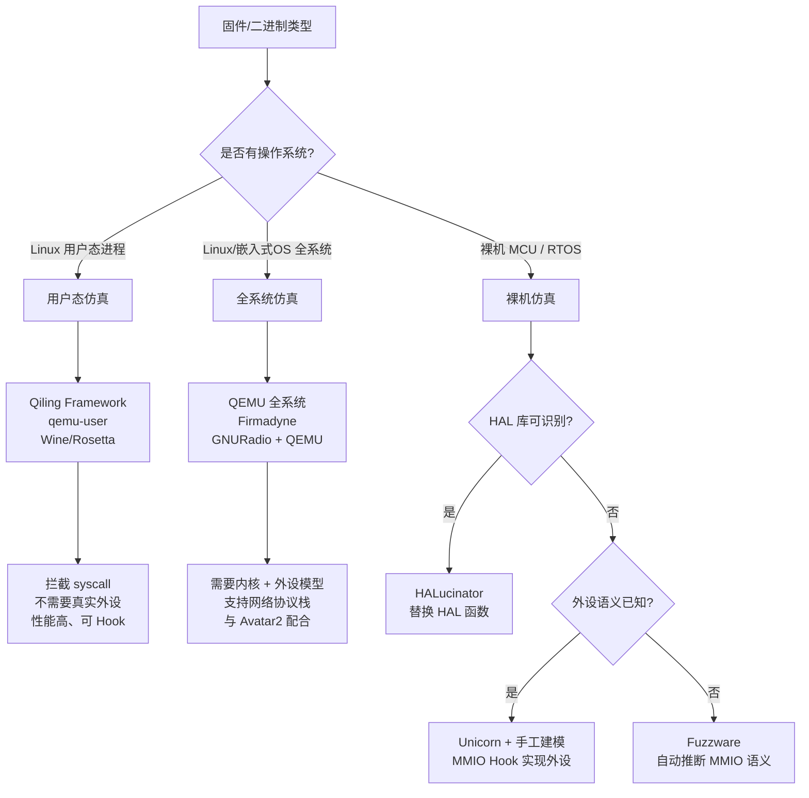

---
tags:
  - 固件
  - IoT
  - tier3
  - 仿真
  - Qiling
---
# 固件仿真进阶：Qiling 与 HALucinator

> [!abstract] TL;DR
> QEMU/Firmadyne 覆盖了有 OS 的 Linux 固件仿真，但裸机固件（MCU/RTOS 二进制）面临严峻的外设依赖问题。本章系统讲解三种进阶路径：Qiling Framework（基于 Unicorn 的跨平台用户态/全系统仿真+Hook 框架）、HALucinator（通过拦截 HAL 库函数实现裸机固件仿真）、Fuzzware（自动推断 MMIO 建模）。理解这些工具的内部机制、适用场景与集成 fuzzing 的方法，是将固件仿真从"跑通 Shell"提升至"发现未知漏洞"的关键跨越。

---

## 概述与定位

### 为何需要超越 QEMU 全系统仿真

第 13 章介绍的 QEMU/Firmadyne/Avatar2 覆盖了基于 Linux 的路由器、NAS、摄像头固件仿真。这类固件有完整的操作系统内核，QEMU 可以模拟 CPU 和必要的外设（网卡、串口），内核自身处理其余的硬件抽象。

裸机固件则完全不同。STM32、NXP Kinetis、Texas Instruments Tiva C 等微控制器上运行的固件直接操作寄存器，没有操作系统层做缓冲。一个典型的 UART 初始化可能是：

```c
// STM32 HAL
HAL_UART_Init(&huart1);
// 最终展开为向 USART1->BRR、USART1->CR1 等 MMIO 寄存器写值
```

在 QEMU 全系统仿真下，即使为 STM32 创建了机器定义（`-M stm32f405`），大多数外设寄存器的行为也是未实现的（返回 0 或触发 `hw_error`）。固件在等待 UART 状态寄存器 `USART_SR_TXE` 置位时会无限循环，仿真死锁。

外设建模难题可以归纳为三类：

1. **MMIO 状态机**：很多外设（USB、CAN、以太网 MAC）有复杂的状态机，单凭规格书建模工作量巨大且容易出错。
2. **中断时序**：DMA 完成、定时器溢出、外部中断的精确时序影响固件逻辑分支，错误的时序导致固件走不同代码路径。
3. **硬件特有的副作用**：某些外设寄存器读操作本身有副作用（如清空 FIFO），纯模拟寄存器映射无法复现。

为此，学术界和工业界发展出多种"部分仿真"（Partial Emulation）策略，本章覆盖的三套工具分别代表不同层次的解法：

| 工具 | 核心策略 | 适用固件类型 | 外设处理方式 |
|------|---------|------------|------------|
| Qiling | 用户态/OS API Hook | Linux 用户态二进制、有 OS 固件 | 模拟系统调用，不需真实外设 |
| HALucinator | HAL 函数替换 | 裸机 MCU/RTOS（有 HAL 库） | 替换 HAL 函数为 Python handler |
| Fuzzware | MMIO 自动建模 | 裸机 MCU（无 OS 或 FreeRTOS） | 符号执行推断 MMIO 语义 |
| Avatar2 + 真实硬件 | 硬件转发 | 任意 | 将 MMIO 读写转发到真实硬件 |
| Unicorn + 手工建模 | 白盒外设实现 | 特定目标，有规格书 | 手工实现 MMIO read/write hook |

---

## 原理与机制

### Unicorn Engine：纯 CPU 仿真内核

Unicorn Engine 是所有进阶仿真工具的基石。它从 QEMU 的 TCG（Tiny Code Generator）派生，剥离了设备模型、总线模拟、BIOS 固件等一切非 CPU 部分，提供一个干净的 C API 和多语言绑定（Python、Go、Rust、Java 等）。

Unicorn 的架构极度简洁：

```
用户代码
   │
   ▼
uc_open(arch, mode)        ← 创建引擎实例
uc_mem_map(uc, addr, size) ← 映射内存区域
uc_mem_write(uc, addr, bytes) ← 写入代码/数据
uc_hook_add(uc, type, callback) ← 注册钩子
uc_emu_start(uc, begin, until) ← 开始执行
```

Unicorn 支持的钩子类型是实现外设建模的关键：

- `UC_HOOK_MEM_READ`：捕获内存读操作（含 MMIO 读）
- `UC_HOOK_MEM_WRITE`：捕获内存写操作（含 MMIO 写）
- `UC_HOOK_CODE`：每条指令执行前回调
- `UC_HOOK_BLOCK`：每个基本块入口回调
- `UC_HOOK_INTR`：软中断（SVC、INT 指令）
- `UC_HOOK_INSN`（x86 only）：特定指令（IN/OUT 端口操作）

用 Unicorn 手工建模一个简单的 UART 外设示例（Python）：

```python
import unicorn
from unicorn import *
from unicorn.arm_const import *

UART_BASE = 0x40011000  # STM32F4 USART1 基地址
UART_SR   = UART_BASE + 0x00  # 状态寄存器
UART_DR   = UART_BASE + 0x04  # 数据寄存器
UART_BRR  = UART_BASE + 0x08  # 波特率寄存器

def hook_mmio_read(uc, access, addr, size, value, user_data):
    if addr == UART_SR:
        # 模拟 TXE=1（发送缓冲空）和 RXNE=1（接收数据就绪）
        uc.mem_write(addr, (0xC0).to_bytes(4, 'little'))
    elif addr == UART_DR:
        # 提供一个字节的模拟输入
        uc.mem_write(addr, b'\x0a\x00\x00\x00')

def hook_mmio_write(uc, access, addr, size, value, user_data):
    if addr == UART_DR:
        # 捕获固件发送的字符
        print(f"[UART TX] 0x{value:02x} = '{chr(value)}'")

mu = Uc(UC_ARCH_ARM, UC_MODE_THUMB)
mu.mem_map(0x08000000, 0x100000)  # Flash
mu.mem_map(0x20000000, 0x20000)   # SRAM
mu.mem_map(UART_BASE, 0x400)       # UART 外设

with open("firmware.bin", "rb") as f:
    mu.mem_write(0x08000000, f.read())

mu.hook_add(UC_HOOK_MEM_READ, hook_mmio_read)
mu.hook_add(UC_HOOK_MEM_WRITE, hook_mmio_write)
mu.emu_start(0x08000001, 0x08100000)  # Thumb 模式，地址+1
```

这种手工建模方式对于简单外设可行，但面对复杂外设（USB 枚举序列、以太网 PHY 协商、CAN 仲裁）时，工作量呈指数级增长。

### Qiling Framework：构建在 Unicorn 上的全栈仿真层

Qiling 于 2020 年由 NightSky 开发，其核心理念是：**在 Unicorn 的 CPU 仿真之上，提供完整的操作系统抽象层（OS Abstraction Layer）**，使得无需真实 OS 即可运行 Linux/Windows/macOS/FreeBSD 的用户态二进制。

Qiling 的层次结构：

```
┌─────────────────────────────────────────┐
│           用户分析脚本 (Python)           │
│   ql.hook_address() / ql.os.intercept() │
├─────────────────────────────────────────┤
│           Qiling OS 层                   │
│  syscall 路由 / 文件系统映射 / 动态链接器  │
├─────────────────────────────────────────┤
│           Qiling Loader 层               │
│   ELF/PE/MachO/DOS/UEFI 加载器          │
├─────────────────────────────────────────┤
│           Unicorn Engine (CPU)           │
│   ARM/AArch64/x86/x86-64/MIPS/...       │
└─────────────────────────────────────────┘
```

**rootfs 沙箱机制**是 Qiling 区别于 qemu-user 的核心特性。Qiling 允许指定一个虚假的根文件系统目录，所有的文件操作（`open("/etc/passwd")`）都被重定向到这个目录下的对应路径，而不是主机真实的文件系统。这对分析 IoT 固件中的守护进程极为重要——固件可能读取 `/var/etc/config.xml` 或 `/proc/cpuinfo`，通过构造相应的 rootfs 文件即可满足这些依赖。

```python
from qiling import Qiling
from qiling.const import QL_VERBOSE

# 分析 MIPS 大端 Linux 用户态二进制（路由器守护进程）
ql = Qiling(
    argv=["rootfs/usr/sbin/httpd", "-p", "8080"],
    rootfs="rootfs/",                   # 提取的固件 rootfs
    archtype="mips",
    ostype="linux",
    verbose=QL_VERBOSE.DEBUG,
    endian="big"
)

# Hook strcpy 检测缓冲区溢出
def hook_strcpy(ql):
    dst = ql.os.function_args[0]
    src_ptr = ql.os.function_args[1]
    src = ql.mem.string(src_ptr)
    print(f"[strcpy] dst=0x{dst:x}, src='{src[:64]}'")

ql.os.set_api("strcpy", hook_strcpy, QL_INTERCEPT.CALL)
ql.run()
```

**Syscall Hook 的实现原理**：当仿真的二进制执行系统调用指令（ARM 的 `svc #0`、MIPS 的 `syscall`、x86 的 `int 0x80`/`syscall`），Unicorn 触发 `UC_HOOK_INTR` 回调，Qiling 的 OS 层读取当前 ABI 约定的系统调用号寄存器，查表分发到对应的 Python 实现（如 `ql_syscall_open`、`ql_syscall_write`），这些 Python 实现再操作 Qiling 自己的虚拟文件描述符表，完全不涉及主机 OS 的真实文件操作（除非显式转发）。

**Snapshot（快照）机制**：Qiling 支持保存和恢复完整的仿真状态（所有寄存器值、内存内容、文件描述符表）。这使得在一个特定的执行点（如身份验证函数入口）保存快照，然后多次从该点恢复并注入不同输入，成为模糊测试的天然配合。

**UEFI 仿真支持**：Qiling 实现了 UEFI 固件镜像（`.efi` 文件）的仿真能力，包括 DXE 驱动的加载、Protocol 接口调用的拦截。这与第 20 章（UEFI 逆向）的内容形成互补——可以在 Qiling 中动态运行 UEFI 模块，观察其与 Boot Services/Runtime Services 的交互。

### HALucinator：裸机固件的 HAL 层拦截

HALucinator（2020 年，论文 "HALucinator: Firmware Re-hosting Through Abstraction Layer Emulation"）提出了一个与传统外设建模完全不同的视角：**不要建模底层外设寄存器，而是在 HAL（硬件抽象层）函数边界进行拦截和替换**。

其核心洞察是：现代 MCU 固件几乎都使用厂商提供的 HAL 库（STM32 HAL/LL、NXP SDK、TI Driverlib、Atmel ASF）。这些 HAL 库的函数签名是标准化的、有文档的，而且它们的语义与底层寄存器操作无关。如果能够：

1. 识别二进制中的 HAL 函数（通过 LibMatch 技术）
2. 用 Python 实现的"handler"替换这些函数
3. Handler 直接返回成功状态，并在需要时向固件注入模拟数据

则固件可以"认为"外设正常工作并继续执行，而实际上从未接触过任何真实外设寄存器。

```
固件执行流（仿真中）：
                                                        
  app_code()                                            
    │                                                   
    ├─ HAL_UART_Init(&huart)                           
    │     │                                             
    │     └─ [HALucinator 拦截] → handler_uart_init()  
    │           → 返回 HAL_OK，不执行真实寄存器操作       
    │                                                   
    ├─ HAL_UART_Receive(&huart, buf, 10, 1000)         
    │     │                                             
    │     └─ [HALucinator 拦截] → handler_uart_receive()
    │           → 从 fuzzer 获取输入，写入 buf，返回 HAL_OK
    │                                                   
    └─ process_received_data(buf)                       
          ← 这里才是我们真正想分析的代码！               
```

**LibMatch 技术**：自动识别二进制中的 HAL 函数是 HALucinator 的关键前提。LibMatch 使用函数特征哈希（考虑函数长度、基本块数量、调用图结构）在已知 HAL 库的数据库中搜索匹配。STM32 HAL 库在不同固件版本、不同编译器优化级别下的特征具有足够的稳定性，匹配准确率在真实评估数据集上达到 85% 以上。

对于 LibMatch 无法自动识别的函数，HALucinator 支持通过函数地址手动指定 handler 映射：

```yaml
# halucinator_config.yaml
handlers:
  - func_name: HAL_UART_Transmit
    addr: 0x080023c4
    handler: halucinator.handlers.stm32.uart:HAL_UART_Transmit
  - func_name: HAL_UART_Receive  
    addr: 0x080024a8
    handler: halucinator.handlers.stm32.uart:HAL_UART_Receive
  - func_name: HAL_Delay
    addr: 0x080012f0
    handler: halucinator.handlers.generic.hal_delay:HAL_Delay
```

Handler 实现示例（Python）：

```python
# halucinator/handlers/stm32/uart.py
from halucinator.peripheral_models.uart_model import UARTModel

def HAL_UART_Receive(avatar, args, cpu, halucinator):
    """
    HAL_StatusTypeDef HAL_UART_Receive(UART_HandleTypeDef *huart,
                                        uint8_t *pData, uint16_t Size,
                                        uint32_t Timeout);
    """
    huart_ptr, pData, size, timeout = args[0], args[1], args[2], args[3]
    
    # 从外设模型获取数据（可以是 fuzzer 注入的数据）
    data = UARTModel.read(size)
    
    if data is not None:
        # 将数据写入固件内存中的 pData 缓冲区
        cpu.write_memory(pData, 1, data, raw=True)
        # 返回 HAL_OK = 0x00
        cpu.set_return_value(0x00)
    else:
        # 超时，返回 HAL_TIMEOUT = 0x03
        cpu.set_return_value(0x03)
    
    # 跳过真实函数体，直接返回
    halucinator.return_from_call(cpu)
```

**中断注入**：HALucinator 支持在仿真执行过程中向 CPU 注入中断，这对于模拟 DMA 完成、定时器溢出等异步事件至关重要。

```python
# 在适当时机注入 SysTick 中断（IRQ 15）
def inject_systick(halucinator, cpu):
    cpu.trigger_interrupt(15)  # SysTick 中断号
```

### Fuzzware：MMIO 语义的自动推断

HALucinator 的局限在于它依赖 HAL 函数识别，而有些固件（特别是老旧或高度定制的固件）直接操作寄存器而没有使用标准 HAL 库。Fuzzware（2022 年 USENIX Security）针对这种情况提出了自动化的 MMIO 语义推断方法。

Fuzzware 的核心是"MMIO 访问模式分析"：

1. 运行固件时记录所有 MMIO 读操作（地址、返回值、读后代码路径）
2. 使用符号执行分析：如果某个 MMIO 寄存器的值只影响一个二值判断（如 `if (reg & STATUS_READY)`），则该寄存器只需要提供 0 或 1 两种值，无需完整建模
3. 将"有用"的 MMIO 字节（影响代码路径分支的字节）标记为 fuzzer 输入，无用字节返回常量 0

这种方法将裸机固件 fuzzing 中"喂给 MMIO 的字节数"从朴素方法的数百字节/周期减少到十几字节/周期，大幅提高 fuzzer 的效率。

---

## 结构/算法/伪代码详解

### 用户态仿真 vs 全系统仿真 vs 裸机仿真的对比架构



### HALucinator 执行流程伪代码

```
function halucinator_run(firmware_path, config_path):
    config = load_yaml(config_path)
    
    # 1. 初始化 Unicorn / Avatar2 仿真环境
    mu = Unicorn(arch=ARM, mode=THUMB)
    load_firmware(mu, firmware_path)
    setup_memory_regions(mu, config.memory)
    
    # 2. 注册 HAL 函数 Hook
    for handler_entry in config.handlers:
        addr = resolve_address(handler_entry)
        # 在函数入口写入断点（ARM: BKPT 指令）
        mu.mem_write(addr, ARM_BREAKPOINT_BYTES)
        hook_registry[addr] = handler_entry.handler
    
    # 3. 注册断点 Hook
    def on_breakpoint(mu, addr, size, user_data):
        if addr in hook_registry:
            handler = hook_registry[addr]
            args = read_function_args(mu, calling_convention=AAPCS)
            # 调用 Python handler
            result = handler(args, mu)
            # 设置返回值并跳过原函数体
            set_return_value(mu, result)
            set_pc(mu, read_lr_register(mu))  # PC = LR（返回地址）
    
    mu.hook_add(UC_HOOK_INTR, on_breakpoint)
    
    # 4. 设置外设模型输入源（可以是 AFL fuzzer 管道）
    setup_peripheral_models(config.peripherals)
    
    # 5. 开始仿真
    entry_point = read_reset_handler(firmware_path)  # 向量表偏移 4
    mu.emu_start(entry_point, 0xFFFFFFFF)
```

### Qiling Snapshot + AFL 集成的 fuzzing 流程

```
┌─────────────────────────────────────────────────────────────────┐
│  AFL++ (afl-fuzz)                                               │
│                                                                  │
│  语料库 ──→ 变异 ──→ 子进程 pipe ──→ Qiling 仿真进程             │
│    ↑                                      │                      │
│    │                                      ▼                      │
│    └──── 覆盖率反馈 ←── bitmap ←── 代码覆盖 Hook               │
└─────────────────────────────────────────────────────────────────┘
                               │
                               ▼
  Qiling 仿真进程内部流程：
  
  1. 恢复 Snapshot（目标函数入口状态）
  2. 从 stdin/pipe 读取 AFL 生成的测试输入
  3. 将输入注入仿真内存（如模拟 recv() 返回的网络数据）
  4. 执行 Hook 收集基本块地址 → 写入 AFL shared memory bitmap
  5. 检测崩溃：SIGSEGV / 断言失败 / 内存越界写
  6. 如有崩溃，保存当前输入；返回步骤 1
```

具体实现使用 `qiling-afl` 或 `afl-unicorn` 接口：

```python
# qiling_fuzz.py
from qiling import Qiling
from qiling.extensions.afl import ql_afl_fuzz

def target_func(ql: Qiling) -> None:
    pass  # 在 ql.run() 触发 afl_fuzz 时自动处理

ql = Qiling(
    argv=["rootfs/usr/bin/parse_config", "@@"],  # @@ = AFL 输入文件
    rootfs="rootfs/",
    archtype="arm",
    ostype="linux"
)

# 在 parse_config 读取文件后的处理函数处保存快照
ql.hook_address(lambda ql: ql.save(reg=True, mem=True), 
                address=PARSE_FUNC_ENTRY)

ql_afl_fuzz(ql, input_file=sys.argv[1], 
            place_input_callback=inject_input,
            exits=[PARSE_FUNC_EXIT])
```

### 中断注入的时序控制

裸机固件仿真中，中断注入的时机是影响代码覆盖率的关键因素。Cortex-M 的 NVIC（嵌套中断控制器）允许多个中断源，每个中断源都有优先级和使能位。

```
SysTick 中断注入策略：

方法1：基于指令计数（固定周期）
  每执行 N 条指令，注入一次 SysTick（IRQ 15）
  → 简单，但不模拟真实时序

方法2：基于 RCC 寄存器分析（时钟感知）
  解析固件中 HAL_RCC_ClockConfig 调用，推算系统时钟频率
  根据 SysTick->LOAD 寄存器值计算精确周期
  → 复杂，但更接近真实行为

方法3：按需注入（由 HAL handler 触发）
  当 HAL_Delay(ms) handler 被调用时，
  立即注入 ms 次 SysTick 并递增 HAL_GetTick() 计数器
  → HALucinator 采用的实用方法
```

### Fuzzware MMIO 建模的推断算法（简化版）

```
algorithm InferMMIOModel(firmware, mmio_ranges):
  accesses = []
  
  # Phase 1: 收集 MMIO 访问记录
  run_with_symbolic_mmio(firmware):
    on_mmio_read(addr, size):
      sym_val = create_symbolic_value(addr)
      accesses.append(Access(addr, sym_val, pc))
      return sym_val
  
  # Phase 2: 分析每个 MMIO 地址的使用模式
  for addr, access_list in group_by_address(accesses):
    constraints = collect_path_constraints(access_list)
    
    if all_constraints_are_boolean(constraints):
      # 只有 0/1 两种有效值，建模为 BitFlag
      models[addr] = BitFlagModel(bit_mask=extract_relevant_bits(constraints))
    
    elif value_range_is_small(constraints):
      # 值域有限（如状态机状态 0-7），建模为枚举
      models[addr] = EnumModel(valid_values=extract_value_set(constraints))
    
    else:
      # 值域宽泛，直接作为 fuzzer 输入
      models[addr] = FuzzerInputModel(size=size)
  
  return models
```

---

## 工具视角与实战

### Qiling 实战：分析 MIPS 路由器守护进程

以分析某路由器的 `uhttpd`（uHTTPd，基于 OpenWrt）为例，演示 Qiling 的实际使用流程。

**步骤 1：准备 rootfs**

```bash
# 从 Binwalk 提取固件
binwalk -e firmware.bin
cd _firmware.bin.extracted/squashfs-root

# 确认架构
file usr/sbin/uhttpd
# uhttpd: ELF 32-bit MSB executable, MIPS, MIPS32 version 1 (SYSV)
```

**步骤 2：修复缺失的动态库**

```bash
# Qiling 的 rootfs 需要包含正确的 musl/uClibc 动态链接器
ls lib/ld-uClibc.so.0  # 检查是否存在
# 如不存在，从 OpenWrt buildroot 或 QEMU 工具链复制
cp /path/to/uclibc-mips/lib/ld-uClibc.so.0 lib/
```

**步骤 3：编写分析脚本**

```python
from qiling import Qiling
from qiling.const import QL_VERBOSE
from qiling.os.posix.syscall.socket import ql_syscall_bind

vuln_candidates = []

def hook_sprintf(ql):
    """检测格式化字符串和缓冲区溢出候选"""
    fmt_ptr = ql.os.function_args[1]
    fmt_str = ql.mem.string(fmt_ptr) if fmt_ptr else ""
    if any(dangerous in fmt_str for dangerous in ['%s', '%n', '%x']):
        vuln_candidates.append({
            'pc': ql.arch.regs.pc,
            'format': fmt_str[:128]
        })

def hook_system(ql):
    """检测命令注入"""
    cmd_ptr = ql.os.function_args[0]
    cmd = ql.mem.string(cmd_ptr) if cmd_ptr else ""
    print(f"[ALERT] system() called: {cmd}")

ql = Qiling(
    argv=["rootfs/usr/sbin/uhttpd", "-p", "0.0.0.0:8080"],
    rootfs="squashfs-root/",
    archtype="mips",
    ostype="linux",
    verbose=QL_VERBOSE.DISABLED,
    endian="big"
)

ql.os.set_api("sprintf", hook_sprintf, QL_INTERCEPT.CALL)
ql.os.set_api("system", hook_system, QL_INTERCEPT.CALL)

# 模拟网络请求（覆盖 accept() 返回模拟的客户端连接）
FAKE_HTTP_REQUEST = b"GET /cgi-bin/test?cmd=$(id) HTTP/1.0\r\n\r\n"

def hook_read(ql):
    fd = ql.os.function_args[0]
    buf = ql.os.function_args[1]
    count = ql.os.function_args[2]
    if fd > 2:  # 非 stdin/stdout/stderr，可能是 socket fd
        ql.mem.write(buf, FAKE_HTTP_REQUEST[:count])
        ql.os.set_return_value(min(len(FAKE_HTTP_REQUEST), count))
        ql.os.return_value = min(len(FAKE_HTTP_REQUEST), count)

ql.os.set_api("read", hook_read, QL_INTERCEPT.CALL)
ql.run(timeout=10 * 1000 * 1000)  # 10秒超时

print(f"发现 {len(vuln_candidates)} 个格式化字符串候选")
```

### HALucinator 实战：STM32 协议解析器仿真

**目标**：对某工业控制器的 STM32 固件进行仿真，该固件解析 Modbus RTU 帧。

**步骤 1：二进制加载与 HAL 函数识别**

```bash
# 安装 HALucinator
pip install halucinator

# 使用 LibMatch 识别 HAL 函数
halucinator-func-matcher --binary firmware.elf \
    --hal-db halucinator/hal_databases/stm32f4.json \
    --output config/hal_handlers.yaml
```

典型输出：

```yaml
# config/hal_handlers.yaml（自动生成，需人工校验）
handlers:
  - func_name: HAL_UART_Receive_IT
    addr: 0x08003d24
    handler: halucinator.handlers.stm32.uart:HAL_UART_Receive_IT
    confidence: 0.91
  - func_name: HAL_TIM_Base_Start_IT
    addr: 0x08004188
    handler: halucinator.handlers.stm32.tim:HAL_TIM_Base_Start_IT
    confidence: 0.87
  - func_name: HAL_Delay
    addr: 0x08001abc
    handler: halucinator.handlers.generic:HAL_Delay
    confidence: 0.95
```

**步骤 2：配置内存布局**

```yaml
# config/memory.yaml
memories:
  - name: flash
    base_addr: 0x08000000
    size: 0x100000
    permissions: r-x
    file: firmware.bin
    offset: 0
  - name: sram
    base_addr: 0x20000000
    size: 0x20000
    permissions: rw-
  - name: peripherals
    base_addr: 0x40000000
    size: 0x10000000
    permissions: rw-
    emulate: true
```

**步骤 3：运行仿真并注入测试输入**

```bash
# 运行 HALucinator，通过 ZeroMQ 接收/发送外设数据
halucinator-rehost --config config/hal_handlers.yaml \
    --memory config/memory.yaml \
    --uart0-in-port 5555 \
    --uart0-out-port 5556 &

# 在另一个终端发送 Modbus RTU 帧
python3 -c "
import zmq, struct
ctx = zmq.Context()
sock = ctx.socket(zmq.PUSH)
sock.connect('tcp://127.0.0.1:5555')

# Modbus RTU: 站地址=1, 功能码=03(读保持寄存器), 
#             起始地址=0x0000, 数量=2, CRC
frame = bytes([0x01, 0x03, 0x00, 0x00, 0x00, 0x02, 0xC4, 0x0B])
sock.send(frame)
"
```

### 与第 13 章（QEMU/Firmadyne/Avatar2）的对比

| 维度 | Firmadyne/QEMU | HALucinator | Qiling |
|------|---------------|-------------|--------|
| 目标固件 | 路由器/NAS Linux 固件 | 裸机 MCU/RTOS 固件 | Linux/Windows 用户态二进制 |
| 外设处理 | QEMU 设备模型（有限） | HAL 函数替换（无外设建模） | syscall 模拟（无外设概念） |
| 自动化程度 | 高（Firmadyne 全自动） | 中（需 LibMatch + 手工校验） | 高（脚本驱动） |
| 适合场景 | 网络协议漏洞挖掘 | 协议解析、输入处理漏洞 | CGI/守护进程漏洞分析 |
| Fuzzing 集成 | AFL++ + QEMU 模式 | AFL++ + 外设输入管道 | AFL++ + Qiling 快照 |
| 局限 | 无法处理裸机固件 | 依赖 HAL 函数识别率 | 仅用户态，无法分析内核模块 |
| 与 Avatar2 关系 | Avatar2 可转发 MMIO | Avatar2 可配合真实硬件 | 独立，不依赖 Avatar2 |

### AFL++ 与 Qiling 集成的完整 fuzzing 配置

```python
# fuzz_target.py - 使用 Qiling + AFL++ 对 CGI 二进制 fuzzing
import sys
import os
from qiling import Qiling
from qiling.extensions.afl import ql_afl_fuzz

TARGET_BINARY = "rootfs/usr/bin/cgi_handler"
ROOTFS = "squashfs-root/"

def place_input(ql: Qiling, input_bytes: bytes, persistent_round: int) -> bool:
    """AFL 每轮调用，将测试输入注入仿真环境"""
    # 将 input_bytes 作为 HTTP POST body 写入内存
    buf_addr = ql.mem.map(0x7ff00000, len(input_bytes) + 1)
    ql.mem.write(buf_addr, input_bytes + b'\x00')
    
    # 设置环境变量 CONTENT_LENGTH 和 CONTENT_TYPE
    ql.os.env["CONTENT_LENGTH"] = str(len(input_bytes))
    ql.os.env["CONTENT_TYPE"] = "application/x-www-form-urlencoded"
    
    # 覆盖 stdin 读取，返回 input_bytes
    ql.os.posix.fd[0].write(input_bytes)
    return True

def main():
    input_file = sys.argv[1]  # AFL 通过命令行传递输入文件
    
    ql = Qiling(
        argv=[TARGET_BINARY],
        rootfs=ROOTFS,
        archtype="mips",
        ostype="linux",
        verbose=0,
        endian="big"
    )
    
    # 设置 CGI 环境变量
    ql.os.env.update({
        "REQUEST_METHOD": "POST",
        "GATEWAY_INTERFACE": "CGI/1.1",
        "SERVER_PROTOCOL": "HTTP/1.0",
    })
    
    # 在 main 函数入口保存快照（避免每次都重新初始化）
    MAIN_ADDR = 0x400b20  # 从 Ghidra/IDA 确认
    snapshot_saved = [False]
    
    def save_snapshot(ql):
        if not snapshot_saved[0]:
            ql.save("/tmp/ql_snapshot.bin")
            snapshot_saved[0] = True
    
    ql.hook_address(save_snapshot, MAIN_ADDR)
    
    # 运行 AFL fuzzing
    ql_afl_fuzz(ql, 
                input_file=input_file,
                place_input_callback=place_input,
                exits=[0x0],
                always_validate=True)

if __name__ == "__main__":
    main()
```

运行命令：

```bash
# 生成初始语料库
mkdir corpus
echo "user=admin&pass=admin" > corpus/01.txt
echo "user=test&pass=1234" > corpus/02.txt

# 启动 AFL++
afl-fuzz -i corpus -o findings \
    -Q \  # QEMU 模式（如果不用 Qiling 原生插桩）
    -- python3 fuzz_target.py @@
```

### 使用 boofuzz 进行基于协议的固件 fuzzing

对于有网络服务的固件，boofuzz（Sulley 的继承者）与 HALucinator 或 Qiling 结合可以进行协议感知的 fuzzing：

```python
from boofuzz import Session, Target, TCPSocketConnection
from boofuzz import s_initialize, s_block, s_string, s_byte, s_static

# 定义 Modbus TCP 协议语法
s_initialize("modbus_read")
with s_block("mbap_header"):
    s_word(0x0001, name="transaction_id", endian=">", fuzzable=False)
    s_word(0x0000, name="protocol_id", endian=">", fuzzable=False)
    s_word(0x0006, name="length", endian=">", fuzzable=False)
    s_byte(0x01, name="unit_id", fuzzable=True)  # 站地址，可 fuzz

with s_block("pdu"):
    s_byte(0x03, name="function_code", fuzzable=True)  # 功能码，可 fuzz
    s_word(0x0000, name="start_addr", endian=">", fuzzable=True)
    s_word(0x0002, name="quantity", endian=">", fuzzable=True)

# 目标：Qiling 仿真的固件监听端口
session = Session(target=Target(
    connection=TCPSocketConnection("127.0.0.1", 502)
))
session.connect(s_get("modbus_read"))
session.fuzz()
```

---

## 安全性与正确使用

### 仿真环境的隔离原则

固件仿真本质上是在受控的沙箱环境中运行未知代码，这需要严格的隔离措施：

**网络隔离**：仿真中的固件可能包含主动扫描、C2 回连等恶意行为（若分析的是恶意固件）。应在隔离的网络命名空间或 VLAN 中运行仿真：

```bash
# 使用 Linux 网络命名空间隔离仿真网络
ip netns add firmware-analysis
ip netns exec firmware-analysis python3 analyze_firmware.py

# 或使用 firejail 沙箱
firejail --net=none --blacklist=/etc/shadow python3 qiling_analyze.py
```

**文件系统权限**：Qiling 的 rootfs 应为只读挂载点（或使用 overlayfs），防止仿真中的写操作影响分析环境：

```bash
mount -o ro,bind extracted_rootfs/ analysis_rootfs/
```

**资源限制**：裸机固件仿真可能触发死循环（如等待外设就绪）。应设置仿真超时和内存上限：

```python
# Qiling 超时设置（单位：微秒）
ql.run(timeout=30 * 1000 * 1000)  # 30 秒

# Unicorn 指令计数限制
mu.emu_start(begin, end, timeout=0, count=1_000_000)  # 最多执行 100万条指令
```

### 授权与合法性边界

固件逆向的合法性取决于授权状态：

- **自有设备固件**：合法，无需额外授权。
- **公开发布的固件更新包**：通常合法（用于安全研究），但需阅读 EULA。某些厂商明确禁止逆向工程（如 DJI 的固件授权条款）。
- **从设备物理提取的固件**：在"计算机欺诈与滥用法"（CFAA）、DMCA 第 1201 条（美国）以及中国《网络安全法》框架下，授权机构/设备所有者进行的安全研究属于合规范围；未经授权对他人设备提取固件并分析属违法行为。
- **Bug Bounty 范围内的设备**：遵循厂商公布的 Bug Bounty 规则，通常允许对特定型号/版本进行安全研究。

### Qiling 沙箱逃逸风险

Qiling 的 rootfs 沙箱并非绝对隔离。以下情况可能导致主机泄露：

1. `ql.os.set_api("open", ...)` 如果 handler 直接调用 Python `open()` 而不使用 rootfs 路径，可能访问主机文件。
2. Qiling 默认允许某些 syscall 直接透传到主机（如 `clock_gettime`）。
3. 通过 `/proc/self/maps` 类路径可能泄露主机进程信息。

安全的做法是在 Docker 容器或 VM 内运行 Qiling 分析脚本，不在生产环境的裸机上直接运行。

### 仿真结果的可信度局限

仿真结果与真实硬件行为之间存在差距（Emulation Gap），需要在报告发现时明确标注：

- **HALucinator 的 handler 可能不完整**：若某个 HAL 函数的 handler 未正确实现副作用（如设置 DMA 完成标志），固件可能走不同的代码路径，导致漏洞在仿真中无法复现但在真实硬件上存在（或反之）。
- **时序差异**：仿真中的执行速度与真实硬件差异巨大，依赖精确时序的竞态条件（Race Condition）通常在仿真中无法复现。
- **硬件特有的错误处理**：某些 MCU 在总线错误、ECC 错误时触发特殊的 fault 处理程序，纯软件仿真难以精确复现。

在将仿真发现的漏洞作为 PoC 提交 Bug Bounty 时，应尽量在真实硬件上验证，或在报告中明确注明"仿真环境下发现，待硬件验证"。

---

## 小结

固件仿真的进化路径从"能不能跑起来"演进到"能不能发现漏洞"，关键是在外设依赖与分析精度之间找到平衡点：

1. **Qiling Framework** 是分析有 OS 的 IoT 固件的利器——其 syscall Hook、rootfs 沙箱、Snapshot 机制的组合，使得针对路由器 CGI、NAS 守护进程的快速 fuzzing 成为可能，且学习曲线比手工编写 Unicorn 脚本低得多。

2. **HALucinator** 解决了裸机固件仿真中最困难的问题：外设依赖。通过在 HAL 库边界进行拦截，它将"外设建模"转化为"HAL 函数语义实现"，后者有充分的文档支撑，可以批量实现。LibMatch 的自动化识别进一步降低了人工标注成本。

3. **Fuzzware** 代表了更激进的自动化方向：用符号执行推断 MMIO 语义，完全绕过"必须理解外设行为"的要求。其代价是符号执行本身的计算开销较高，适合作为 HALucinator 的补充而非替代。

4. **Unicorn + 手工外设建模** 在上述工具失效时（高度定制化外设、无 HAL 库、非标准厂商）仍是保底方案，但需要详细的芯片参考手册和大量调试投入。

5. **Fuzzing 集成** 是仿真工具链的终极目的地。AFL++ 的覆盖率引导与 Qiling Snapshot 的组合，或 AFL++ 与 HALucinator 外设输入管道的组合，使得在固件仿真中进行大规模漏洞发现成为工程上可行的选项，而不仅仅是研究论文中的理论构型。

与第 13 章 QEMU/Firmadyne/Avatar2 的内容共同构成完整的固件仿真工具链知识图谱：有 Linux 的设备走 Firmadyne 路线，裸机设备走 HALucinator/Fuzzware 路线，用户态分析走 Qiling 路线，三者覆盖了 IoT/嵌入式固件安全研究的绝大多数场景。

---

## 相关阅读

- HALucinator 原论文：Clements et al., "HALucinator: Firmware Re-hosting Through Abstraction Layer Emulation", USENIX Security 2020
- Fuzzware 原论文：Scharnowski et al., "Fuzzware: Using Precise MMIO Modeling for Effective Firmware Fuzzing", USENIX Security 2022
- Qiling 官方文档：https://docs.qiling.io
- Unicorn Engine 官方文档：https://www.unicorn-engine.org/docs/
- afl-unicorn：Michele Corrente 的 AFL++ 与 Unicorn 集成项目
- P2IM（Peripheral Interface in Memory）：裸机固件仿真外设建模的早期学术工作（IEEE S&P 2020）
- μEmu（Micro-Emulation）：基于符号执行的裸机固件仿真（CCS 2021）
- renode：开源多节点嵌入式系统仿真框架，支持 Cortex-M 外设精确建模（https://renode.io）
- boofuzz 文档：https://boofuzz.readthedocs.io
- 第 13 章：[[13.固件仿真：QEMU与Firmadyne与Avatar2]] — 基础仿真方法
- 第 08 章：[[08.RTOS逆向：FreeRTOS与VxWorks与ThreadX]] — 裸机固件的 RTOS 背景
- 第 11 章：[[11.固件漏洞分析]] — 仿真发现漏洞后的分析方法

---

[[00.固件与IoT嵌入式逆向总览|⬆ 系列总览]] | [[22.eMMC与NAND芯片级取证|← 上一章]] | [[24.BMC与IPMI服务器带外管理|→ 下一章]]
