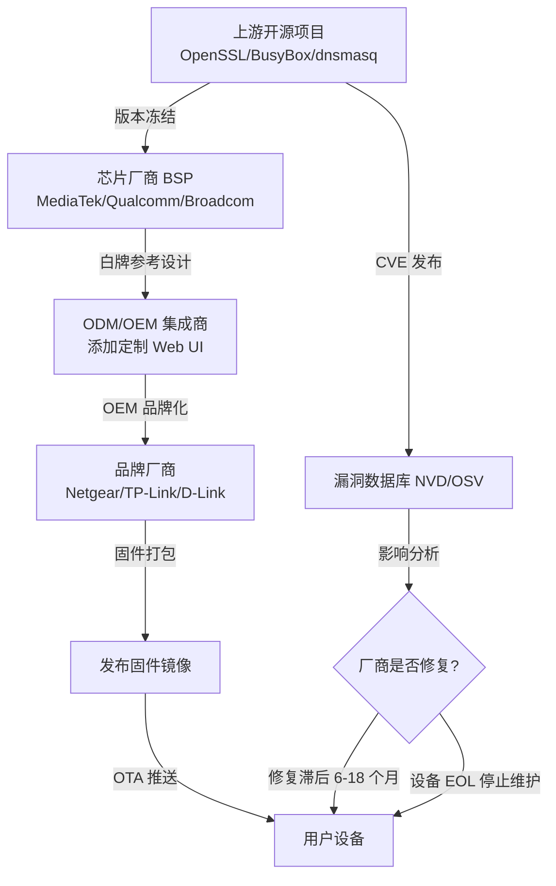
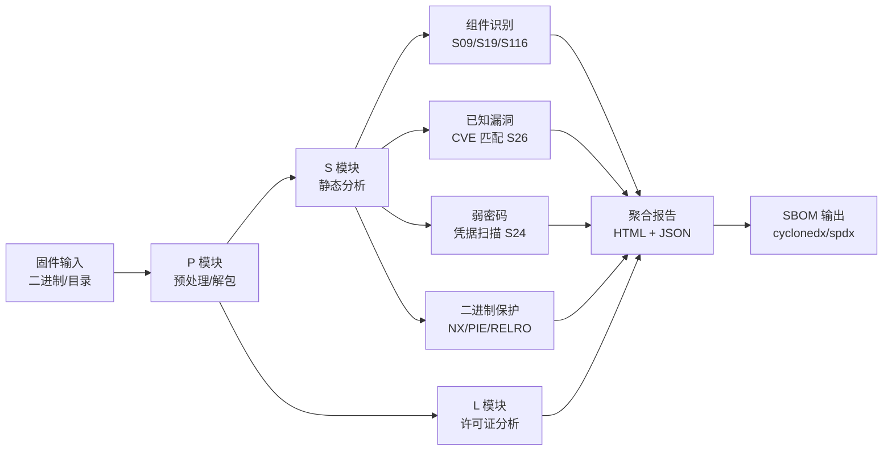
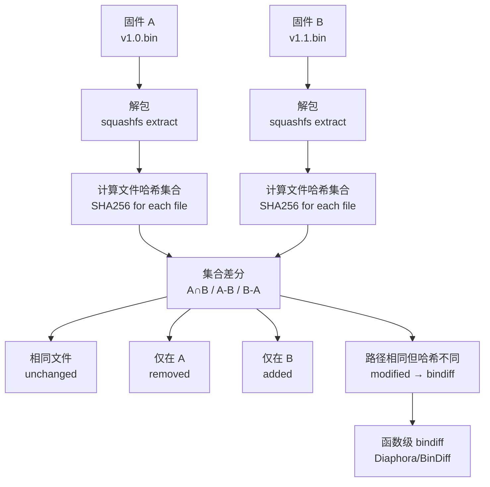
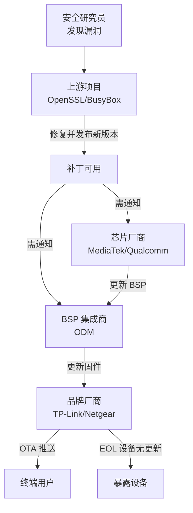

---
tags:
  - 固件
  - IoT
  - tier3
  - 供应链
  - SBOM
---
# 固件供应链与 SBOM 分析

> [!abstract] TL;DR
> 固件供应链是指从芯片 SDK、BSP、第三方开源库到最终设备镜像的完整软件传导链路。供应链漏洞的核心特征是「一点击破、全线受害」：上游一个过时的 OpenSSL 版本可以同时影响数百万设备。SBOM（Software Bill of Materials）技术通过自动化提取固件中的软件清单，并与 CVE/CPE 数据库交叉比对，让安全审计从「盲查」变为「精准定向」。本章系统讲解供应链风险传导机制、二进制成分分析原理、SPDX/CycloneDX 格式规范、EMBA/FACT/Trivy/cve-bin-tool 等工具实战、固件差分溯源方法、GPL 许可证合规、PSIRT 流程与负责任披露实践。

## 概述与定位

### 固件的软件构成现实

一台消费级路由器的固件通常包含数十乃至数百个独立的开源或闭源组件。以 Netgear R7000 的 DD-WRT 固件为例，其 squashfs 根文件系统解包后可以找到：

- **BusyBox**（1.x 版本，提供 100+ 个 Unix 工具的精简实现）
- **uClibc/musl**（替代 glibc 的轻量级 C 库）
- **OpenSSL 或 mbedTLS/wolfSSL**（TLS/加密库）
- **dnsmasq**（DNS/DHCP 服务）
- **miniupnpd**（UPnP 守护进程）
- **hostapd / wpa_supplicant**（Wi-Fi AP/STA 管理）
- **iptables / nftables**（包过滤）
- **curl / wget**（HTTP 客户端）
- **lighttpd / uhttpd**（Web 服务器，提供管理界面）
- 芯片厂商专有驱动闭源 blob（如博通 wl.ko、高通 qca-wifi.ko）
- 厂商定制的 Web 应用（CGI/Lua/Node.js 脚本）

这些组件来自不同的上游项目、不同的发行时间线、由不同的 OEM 白牌集成商在不同版本的 BSP 上组合。其结果是：**当上游某个版本存在 CVE 时，设备厂商往往在漏洞公开后数月乃至数年内仍在出货受影响版本**。

### 供应链漏洞的传导路径



这条链路有几个关键延迟节点：

1. **BSP 冻结**：芯片厂商 BSP 发布后，其中的库版本往往不再随上游更新，ODM 直接基于旧 BSP 构建，导致「BSP 版本锁定漏洞」。
2. **ODM 集成惰性**：ODM 以成本为导向，缺乏安全更新的激励，固件功能稳定即停止迭代。
3. **品牌厂商能力不足**：品牌厂商依赖 ODM 代码，自身缺乏固件安全工程能力，无法独立修复上游漏洞。
4. **EOL 孤立**：设备停止官方支持后，历史固件版本永久暴露在已知漏洞中。

### 供应链安全与 SBOM 的定位

SBOM 源于软件供应链安全领域，2021 年美国拜登政府「改善国家网络安全」行政令（EO 14028）将 SBOM 作为联邦软件采购的强制要求，加速了整个行业的落地。对于固件安全：

- **防御侧**（PSIRT/产品安全团队）：使用 SBOM 快速评估新 CVE 的影响范围，加速漏洞响应
- **研究侧**（安全研究员/渗透测试员）：通过 SBOM 找到高概率存在已知漏洞的组件，定向挖掘
- **合规侧**（法务/采购）：GPL 许可证义务跟踪、开源合规审计
- **监管侧**：IEC 62443、NIST SP 800-193 等工控/嵌入式安全标准正在逐步引用 SBOM 要求

## 原理与机制

### 二进制成分分析（Binary Composition Analysis，BCA）

与源码级 SCA（Software Composition Analysis）不同，固件通常以编译后的二进制形式交付，源码不可得。BCA 的核心任务是**从二进制中识别组件身份和版本**，主要有以下几条技术路线：

#### 1. 字符串指纹（String Fingerprinting）

最直接的方法。大量开源组件会在二进制中嵌入版本字符串：

```
BusyBox v1.23.2 (2017-01-05 11:28:31 UTC) multi-call binary.
OpenSSL 1.0.2k  26 Jan 2017
dnsmasq version 2.72  Copyright (c) 2000-2014 Simon Kelley
```

通过预先构建一个「已知版本字符串数据库」（可从 NVD CPE、各项目发布历史生成），即可实现高精度匹配。局限性在于：字符串可被 strip 或混淆，且同一字符串可能存在 patch 版差异（1.0.2k 存在多个 security patch，字符串不变）。

#### 2. 符号哈希（Symbol Hash / Function Hash）

利用 ELF 符号表（未 strip 时）或调试信息中的函数名，计算函数名集合的哈希作为组件指纹：

- **导出符号集合哈希**：对 `.dynsym` 中所有导出符号名排序后取 MD5/SHA256
- **tlsh/ssdeep 模糊哈希**：对函数字节码计算局部敏感哈希，允许小版本差异时仍能匹配
- **IDA/Ghidra bindiff 函数哈希**：对函数控制流图（CFG）取哈希，不受地址随机化影响

工具 EMBA 使用函数哈希识别已知库；Binarly 的商业工具 FWAP 也基于类似原理。

#### 3. 代码相似性搜索（Code Similarity Search）

更先进的方法，使用向量嵌入（embedding）或图神经网络（GNN）表示函数，在向量数据库中检索相似函数：

- **Asm2Vec / SAFE**：将汇编指令序列映射为稠密向量，跨编译器/优化级别仍可匹配
- **jTrans**：基于 Transformer 的二进制函数相似性模型，在 BinKit 基准上 MRR 超过传统方法
- **BSIM（Ghidra 插件）**：NSA 开源的二进制相似性搜索，支持大规模固件库索引

#### 4. 元数据与路径证据

固件文件系统中通常残留大量元数据：

- `/usr/share/doc/` 目录下的 `changelog.Debian.gz` / `copyright` 文件（OpenWRT/Buildroot 系统）
- 包管理器数据库：`/usr/lib/opkg/info/*.list`（OpenWRT ipkg）、`/var/lib/dpkg/status`（基于 Debian 的嵌入式系统）
- CMake/Autoconf 生成的版本头文件残留：`/usr/include/openssl/opensslv.h`
- `pkg-config` `.pc` 文件：`/usr/lib/pkgconfig/libssl.pc`
- 构建系统日志残留（少见，但有时在 `/tmp` 或 `/build_info` 中可见）

这些元数据精度最高，但不稳定——厂商经常清理这些文件以减小固件体积或隐藏组件信息。

### CVE 与 CPE 的映射机制

识别出组件名称和版本后，需要与漏洞数据库匹配。核心标准是 CPE（Common Platform Enumeration）：

```
cpe:2.3:a:openssl:openssl:1.0.2k:*:*:*:*:*:*:*
cpe:2.3:a:busybox:busybox:1.23.2:*:*:*:*:*:*:*
cpe:2.3:a:thekelleys:dnsmasq:2.72:*:*:*:*:*:*:*
```

CPE 采用 `part:vendor:product:version:update:edition:language:sw_edition:target_sw:target_hw:other` 格式。NVD 数据库中每条 CVE 都关联一个 CPE 影响范围（Applicability Statement），描述受影响版本区间（如 `versionStartIncluding` / `versionEndExcluding`）。

版本匹配并非简单的字符串等值比较，而是需要实现：

1. **语义版本比较**（semver）：`1.0.2k < 1.0.2l`，但 `1.1.0` > `1.0.2k`
2. **CPE 通配符展开**：`*` 匹配任意值，`-` 表示「不适用」
3. **影响范围区间查询**：给定版本 V，判断是否满足 `startIncluding <= V < endExcluding`
4. **运行环境过滤**：某些 CVE 仅影响特定 OS/架构，需结合固件环境信息过滤

### SBOM 格式标准

#### SPDX（Software Package Data Exchange）

SPDX 由 Linux Foundation 主导，ISO/IEC 5962:2021 标准，是最成熟的 SBOM 格式：

```
SPDXVersion: SPDX-2.3
DataLicense: CC0-1.0
SPDXID: SPDXRef-DOCUMENT
DocumentName: firmware-rootfs
DocumentNamespace: https://example.com/firmware/sbom-1.0

PackageName: openssl
SPDXID: SPDXRef-openssl
PackageVersion: 1.0.2k
PackageDownloadLocation: https://www.openssl.org/source/openssl-1.0.2k.tar.gz
FilesAnalyzed: false
PackageLicenseConcluded: OpenSSL
PackageLicenseDeclared: OpenSSL
PackageCopyrightText: Copyright (c) 1998-2017 The OpenSSL Project

Relationship: SPDXRef-DOCUMENT DESCRIBES SPDXRef-openssl
```

SPDX 支持多种序列化格式：标签-值对（.spdx）、JSON（.spdx.json）、RDF（.spdx.rdf）、YAML（.spdx.yaml）。

#### CycloneDX

CycloneDX 由 OWASP 主导，专为安全场景设计，格式更简洁，对漏洞关联支持更好：

```json
{
  "bomFormat": "CycloneDX",
  "specVersion": "1.5",
  "version": 1,
  "components": [
    {
      "type": "library",
      "name": "openssl",
      "version": "1.0.2k",
      "purl": "pkg:generic/openssl@1.0.2k",
      "licenses": [{"license": {"id": "OpenSSL"}}],
      "hashes": [
        {"alg": "SHA-256", "content": "6b3977c61f2aedf0f96367dcfb5c6e578cf37e7b..."}
      ],
      "externalReferences": [
        {"type": "website", "url": "https://www.openssl.org"}
      ]
    }
  ],
  "vulnerabilities": [
    {
      "id": "CVE-2017-0293",
      "source": {"name": "NVD", "url": "https://nvd.nist.gov/vuln/detail/CVE-2017-0293"},
      "affects": [{"ref": "pkg:generic/openssl@1.0.2k"}]
    }
  ]
}
```

CycloneDX 的 `purl`（Package URL）是跨生态系统的包标识符标准（pkg:generic/rpm/deb/npm/pypi 等），比 CPE 更精确。

#### SPDX vs CycloneDX 选型建议

| 维度 | SPDX | CycloneDX |
|------|------|-----------|
| 标准组织 | Linux Foundation / ISO | OWASP |
| 主要用途 | 许可证合规、法律 | 安全漏洞管理 |
| 漏洞集成 | 需 VEX 扩展 | 原生支持 `vulnerabilities` 字段 |
| 工具生态 | syft、spdx-tools | cdxgen、cyclonedx-bom |
| 嵌入式友好度 | 中 | 高（支持固件/容器/设备组件类型） |
| 合规场景 | GPL 审计、采购合同 | PSIRT 漏洞响应、SCA 流水线 |

### 固件差分溯源

固件差分（Firmware Diffing）在供应链分析中有两个主要用途：

1. **追溯 OEM 白牌来源**：当新发现一款设备固件时，通过与已知固件库比对，识别其底层 BSP 来源（例如确认某品牌设备使用了联发科 MT7628 BSP，从而继承该 BSP 的所有已知漏洞）。
2. **追踪补丁有效性**：厂商发布安全更新后，通过差分验证 CVE 对应的代码路径是否真正被修补，而不仅仅是版本号字符串被更新。

技术实现上，固件差分比单纯的二进制 diff 复杂得多：由于不同固件的编译时间戳、路径宏展开、优化选项不同，同一源码编译出的二进制在字节级别可能差异显著。真正有效的固件差分需要：

- **函数级 CFG 哈希比对**（bindiff/Diaphora）
- **规范化汇编表示**（忽略立即数中的地址偏移、替换寄存器名为抽象符号）
- **语义等价性判断**（对于简单函数可以通过符号执行验证等价性）

## 结构/算法/伪代码详解

### EMBA 固件分析流水线

EMBA（Embedded Linux Analyzer）是目前功能最全面的开源固件分析自动化框架，其核心流水线如下：



EMBA 的 `S09_firmware_base_version_check.sh` 模块专门用于版本字符串检测，维护了一个正则表达式库，覆盖数百种常见组件的版本字符串格式。`S26_kernel_vuln_verifier.sh` 则基于内核版本与 CVE 数据库匹配。

EMBA 运行示例：

```bash
# 安装（需要 Docker）
git clone https://github.com/e-m-b-a/emba
cd emba
sudo ./installer.sh -d

# 分析固件
sudo ./emba.sh -f /path/to/firmware.bin -l /path/to/log/output/

# 分析已解包的目录
sudo ./emba.sh -f /path/to/extracted_rootfs/ -l /path/to/log/ -d

# 使用 EMBA 的 SBOM 模式（输出 CycloneDX JSON）
sudo ./emba.sh -f /path/to/firmware.bin -l /path/to/log/ --sbom
```

EMBA 输出目录结构：

```
/log/output/
├── emba.log          # 主日志
├── html-report/      # 可交互 HTML 报告
├── json/
│   ├── sbom.json    # CycloneDX SBOM
│   ├── cve_results.json
│   └── summary.json
└── modules/          # 各模块原始输出
    ├── S09_firmware_base_version_check/
    ├── S26_kernel_vuln_verifier/
    └── ...
```

### cve-bin-tool 版本匹配算法

Intel 开源的 cve-bin-tool 实现了高精度的二进制 CVE 检测，其核心算法伪代码如下：

```python
def analyze_binary(binary_path: str) -> List[CVEMatch]:
    results = []
    
    # 阶段 1：字符串提取
    strings = extract_strings(binary_path, min_length=4)
    
    # 阶段 2：Checker 匹配
    for checker in REGISTERED_CHECKERS:  # 每个 checker 对应一个组件
        # 每个 checker 维护一个正则表达式列表
        for pattern in checker.BINARY_VERSION_PATTERNS:
            for s in strings:
                match = pattern.search(s)
                if match:
                    version = normalize_version(match.group('version'))
                    component = CVEComponent(
                        vendor=checker.VENDOR,
                        product=checker.PRODUCT,
                        version=version
                    )
                    # 阶段 3：CVE 数据库查询
                    cves = query_nvd_db(component)
                    results.extend(cves)
    
    return deduplicate(results)

def query_nvd_db(component: CVEComponent) -> List[CVE]:
    # 构造 CPE
    cpe = f"cpe:2.3:a:{component.vendor}:{component.product}:{component.version}:*:*:*:*:*:*:*"
    
    # 查询受影响的 CVE（使用本地 SQLite 数据库，数据来自 NVD JSON feed）
    cves = db.query("""
        SELECT cve_id, severity, cvss_score, description
        FROM cve_range
        WHERE product = ? AND vendor = ?
          AND (version_start_including IS NULL OR ? >= version_start_including)
          AND (version_end_excluding IS NULL OR ? < version_end_excluding)
          AND (version_end_including IS NULL OR ? <= version_end_including)
    """, (component.product, component.vendor, 
          component.version, component.version, component.version))
    
    return cves
```

cve-bin-tool 目前支持 340+ 种组件的 checker，覆盖嵌入式固件中最常见的组件（OpenSSL、curl、zlib、libpng、libarchive、busybox 等）。

### 函数哈希指纹生成（用于版本区分）

当字符串指纹无法区分 patch 版本时（例如 OpenSSL 1.1.1t 和 1.1.1w 字符串相同），可以使用函数哈希：

```python
import capstone
import hashlib
from elftools.elf.elffile import ELFFile

def compute_function_hash(elf_path: str, func_addr: int, func_size: int) -> str:
    """
    计算函数的规范化哈希，忽略绝对地址引用
    """
    with open(elf_path, 'rb') as f:
        elf = ELFFile(f)
        # 定位代码段
        for seg in elf.iter_segments():
            if seg.header.p_type == 'PT_LOAD' and seg.header.p_flags & 1:  # 可执行
                vaddr = seg.header.p_vaddr
                offset = seg.header.p_offset
                
        # 读取函数字节
        f.seek(offset + (func_addr - vaddr))
        code = f.read(func_size)
    
    # 反汇编（以 ARM Thumb 为例）
    md = capstone.Cs(capstone.CS_ARCH_ARM, capstone.CS_MODE_THUMB)
    md.detail = True
    
    normalized_insns = []
    for insn in md.disasm(code, func_addr):
        # 规范化：将立即数中可能是地址的值替换为占位符
        op_str = insn.op_str
        for op in insn.operands:
            if op.type == capstone.arm.ARM_OP_IMM:
                if is_likely_address(op.imm):  # 启发式判断
                    op_str = op_str.replace(hex(op.imm), 'ADDR')
        
        normalized_insns.append(f"{insn.mnemonic} {op_str}")
    
    # 计算哈希
    canon = '\n'.join(normalized_insns)
    return hashlib.sha256(canon.encode()).hexdigest()

def is_likely_address(value: int) -> bool:
    """启发式判断立即数是否为地址（依赖架构和固件加载基址）"""
    # 典型 ARM Linux 用户态地址范围
    return 0x10000 <= value <= 0x7fffffff
```

### FACT 固件相似度比对

FACT（Firmware Analysis and Comparison Tool）提供了可视化的多版本固件比对功能，其比对算法基于：

1. **文件哈希集合比对**：两个固件中完全相同文件的占比
2. **组件版本变化追踪**：识别从 v1.0 到 v1.1 哪些库版本发生了变化
3. **新增/删除文件统计**：供应链分析中用于检测 BSP 来源变化



## 工具视角与实战

### EMBA 实战：路由器固件全自动分析

以 TP-Link Archer AX50 固件为例，演示完整的 SBOM 提取流程：

```bash
# 步骤 1：下载固件
wget https://static.tp-link.com/upload/firmware/2022/Archer_AX50_V1_211026.zip
unzip Archer_AX50_V1_211026.zip

# 步骤 2：运行 EMBA 分析
sudo ./emba.sh \
    -f ./Archer_AX50_V1_211026.bin \
    -l ./emba_results/ \
    --sbom \
    -t 8  # 使用 8 个线程

# 步骤 3：查看识别到的组件
cat ./emba_results/json/sbom.json | jq '.components[] | {name, version}'

# 示例输出：
# {"name": "openssl", "version": "1.1.1g"}
# {"name": "busybox", "version": "1.31.1"}
# {"name": "curl", "version": "7.67.0"}
# {"name": "dnsmasq", "version": "2.80"}
# {"name": "hostapd", "version": "2.9"}
# {"name": "linux-kernel", "version": "4.14.167"}

# 步骤 4：查看 CVE 结果
cat ./emba_results/json/cve_results.json | \
    jq '.[] | select(.cvss_score >= 7.0) | {component, version, cve_id, cvss_score}' | \
    head -50
```

### cve-bin-tool 精准 CVE 匹配

```bash
# 安装
pip install cve-bin-tool

# 更新 CVE 数据库
cve-bin-tool --update now

# 扫描解包后的固件目录
cve-bin-tool \
    --format json \
    --output-file firmware_cves.json \
    /path/to/extracted_rootfs/

# 扫描单个二进制
cve-bin-tool /path/to/extracted_rootfs/usr/sbin/dnsmasq

# 生成 SBOM（CycloneDX 格式）
cve-bin-tool \
    --sbom cyclonedx \
    --sbom-output firmware_sbom.json \
    /path/to/extracted_rootfs/

# 过滤高危漏洞
cve-bin-tool \
    --format csv \
    --severity high critical \
    /path/to/extracted_rootfs/

# 与现有 SBOM 结合使用（输入 SPDX SBOM，输出 CVE 报告）
cve-bin-tool \
    --input-file existing_sbom.spdx \
    --format json \
    --output-file cve_results.json
```

典型输出示例：

```
Component   Version    CVE            CVSS   Description
openssl     1.1.1g     CVE-2021-3711  9.8    SM2 Decryption Buffer Overflow
openssl     1.1.1g     CVE-2021-3712  7.4    ASN.1 String Buffer Overflow  
dnsmasq     2.80       CVE-2020-25681 8.1    DNSSEC Buffer Overflow (DNSpooq)
dnsmasq     2.80       CVE-2020-25682 8.1    DNS Response Heap Overflow
curl        7.67.0     CVE-2020-8231  9.8    TFTP receive buffer overflow
linux       4.14.167   CVE-2021-33034 7.8    Bluetooth HCI Use-After-Free
```

### Trivy 固件容器扫描

Trivy 最初用于容器镜像扫描，但也支持扫描固件目录（将其视为 rootfs）：

```bash
# 安装 Trivy
brew install trivy  # macOS
# 或
wget https://github.com/aquasecurity/trivy/releases/download/v0.49.1/trivy_0.49.1_Linux-64bit.tar.gz

# 扫描已解包的固件 rootfs
trivy rootfs \
    --format cyclonedx \
    --output firmware_sbom.json \
    /path/to/extracted_rootfs/

# 扫描 OCI/Docker 格式的固件（某些嵌入式 Linux 使用容器化组件）
trivy image \
    --format table \
    /path/to/rootfs.tar

# 仅显示 HIGH/CRITICAL
trivy rootfs \
    --severity HIGH,CRITICAL \
    /path/to/extracted_rootfs/

# 忽略未修复漏洞（聚焦可修复项）
trivy rootfs \
    --ignore-unfixed \
    /path/to/extracted_rootfs/
```

Trivy 对包管理器（ipkg/opkg/apk/dpkg）的支持特别好，能直接读取 `/usr/lib/opkg/info/` 下的 ipkg 包列表，精度远高于字符串扫描。

### FACT 多版本固件比对实战

```bash
# 安装 FACT（Docker 方式）
git clone https://github.com/fkie-cad/FACT_core
cd FACT_core
./install.py

# 启动 FACT 服务
./start_fact.py

# 通过 Web UI（默认 http://localhost:5000）上传固件
# 或通过 REST API
curl -X POST http://localhost:5000/rest/firmware \
    -H "Content-Type: application/json" \
    -d '{"binary": "<base64_firmware>", "file_name": "fw_v1.0.bin", 
         "version": "1.0", "device_name": "Router X"}'

# 触发两个固件版本的比对
curl -X GET "http://localhost:5000/rest/compare/uid_v1.0_vs_uid_v1.1"
```

FACT 比对报告包含：
- 文件变化统计（新增/删除/修改文件数）
- 组件版本变化明细
- 新增/修复 CVE 的差异
- 可疑的二进制替换（同路径文件哈希变化但内容相似）

### syft + grype 组合流水线

syft（Anchore 开源）专注 SBOM 生成，grype 专注漏洞扫描，两者组合是容器/固件 CI/CD 流水线中常见选择：

```bash
# 安装
curl -sSfL https://raw.githubusercontent.com/anchore/syft/main/install.sh | sh
curl -sSfL https://raw.githubusercontent.com/anchore/grype/main/install.sh | sh

# syft 生成 SBOM
syft dir:/path/to/extracted_rootfs/ \
    -o cyclonedx-json \
    > firmware_sbom.json

# grype 基于 SBOM 扫描漏洞
grype sbom:./firmware_sbom.json \
    --fail-on high \
    --output table

# 直接扫描目录
grype dir:/path/to/extracted_rootfs/ \
    --output json \
    > vuln_report.json

# 过滤条件：仅显示有修复版本的漏洞
grype dir:/path/to/extracted_rootfs/ \
    --only-fixed
```

### 已知高危组件速查：嵌入式固件中的常见漏洞组件

| 组件 | 常见固件版本 | 代表性 CVE | CVSS |
|------|------------|-----------|------|
| OpenSSL 1.0.2x | 大量 2016-2020 年路由器 | CVE-2016-0800 (DROWN) | 5.9 |
| OpenSSL 1.1.1g | 2020-2021 年设备 | CVE-2021-3711 (SM2 BoF) | 9.8 |
| dnsmasq 2.7x | OpenWRT 旧版 | CVE-2020-25681~25687 (DNSpooq) | 8.1 |
| BusyBox 1.2x | 大量嵌入式 Linux | CVE-2022-28391 (ASH RCE) | 9.8 |
| uClibc-ng < 1.0.42 | MIPS 路由器 | CVE-2022-30295 (DNS 预测) | 6.5 |
| curl < 7.79 | 各类固件 OTA 客户端 | CVE-2021-22945 (SMTP BoF) | 9.1 |
| libc/musl 多版本 | 越狱场景 | CVE-2022-22823 (expat RCE) | 9.8 |
| Linux Kernel 4.4 | 大量 ARM SoC 系统 | CVE-2017-7308 (packet_set_ring) | 7.8 |

### GPL 许可证合规审计

固件中包含 GPL 组件（BusyBox、Linux 内核、dnsmasq 等）时，分发方有义务提供对应源码（GPL v2）或 Corresponding Source（GPL v3）。

使用 FOSSology 进行许可证扫描：

```bash
# 安装 FOSSology（Docker 方式）
docker run -d \
    -p 8081:80 \
    --name fossology \
    fossology/fossology

# 或使用 scancode-toolkit 进行轻量级扫描
pip install scancode-toolkit

scancode \
    --license \
    --copyright \
    --output-json scancode_results.json \
    /path/to/extracted_rootfs/

# 查找 GPL 组件
cat scancode_results.json | jq '
    .files[] | 
    select(.licenses[]?.spdx_license_key | test("GPL")) |
    {path: .path, license: [.licenses[].spdx_license_key]}
'
```

EMBA 的 `L15_package_check.sh` 模块也会自动扫描 `copyright` 文件并汇总许可证信息，在 HTML 报告的 License 部分显示。

## 安全性与正确使用

### 供应链审计的核心价值

固件供应链审计在以下场景中具有无可替代的价值：

**场景一：新产品上线前的安全门控**

企业 PSIRT（Product Security Incident Response Team）在新产品发布前，应将 SBOM 扫描纳入 SDL（Secure Development Lifecycle）的必要门控。典型流程：

1. 构建系统在每次固件构建后自动生成 SBOM（集成 syft/cyclonedx-bom 到 CI/CD）
2. 使用 grype/cve-bin-tool 扫描 SBOM，对 CVSS ≥ 7.0 的 CVE 触发告警
3. 安全团队评估每个 CVE 的可利用性（攻击面是否暴露、是否有缓解控制）
4. 未解决的高危 CVE 阻断发布，中危 CVE 需提供缓解计划

**场景二：已在网设备的快速漏洞响应**

当 Log4Shell（CVE-2021-44228）、Heartbleed（CVE-2014-0160）级别的重大漏洞爆发时，PSIRT 需要在数小时内回答「我们多少款产品受影响」。如果预先建立了所有在售产品的 SBOM 数据库，这一查询可以自动化完成：

```python
# 伪代码：查询所有受 Log4Shell 影响的产品
def find_affected_products(cve_id: str) -> List[Product]:
    affected = []
    for product in PRODUCT_DB.all():
        sbom = SBOM_DB.get(product.firmware_version)
        for component in sbom.components:
            if is_affected_by_cve(component, cve_id):
                affected.append(product)
                break
    return affected
```

**场景三：安全研究中的定向漏洞挖掘**

安全研究员在分析一款新设备时，首先运行 EMBA/cve-bin-tool，快速定位最可能存在已知漏洞的组件，再深入分析这些组件的实际可利用性（漏洞代码路径是否可达、是否有 ASLR/PIE 保护等），大幅提升研究效率。

### 负责任披露供应链漏洞的挑战

供应链漏洞的负责任披露比单一产品漏洞复杂得多，因为存在「多层受害者」：



最佳实践：

1. **优先通知上游项目**：即使漏洞是在下游固件中发现的，如果根因在上游库，应先向上游报告，等待 patch 发布后再披露。
2. **协调 CERT/CC**：对于影响面广的供应链漏洞，通过 CERT/CC 或 ICS-CERT 协调多厂商同步修复和披露。
3. **建立 CVE 编号**：通过 CNA（CVE Numbering Authority）为漏洞申请 CVE 编号，使漏洞可被 SBOM 工具自动追踪。
4. **合理披露时间线**：供应链漏洞的影响范围广、修复链条长，标准 90 天时间线往往不够，应与各方协商合理延长。
5. **提供机器可读的漏洞描述**：使用 CSAF（Common Security Advisory Framework）或 VEX（Vulnerability Exploitability eXchange）格式发布安全公告，让下游的自动化工具能直接处理。

### 与 SLSA/构建供应链的关系

本系列第 46 章（构建供应链与 SLSA）将从软件构建流水线视角深入讨论供应链安全，与本章形成互补：

- 本章关注**已交付固件的分析与审计**（防御性、事后分析、SBOM 提取）
- 第 46 章关注**构建过程的可信度保证**（SLSA 框架、构建来源证明 Provenance、in-toto 验证）

两章结合形成完整的固件供应链安全闭环：构建时保证来源可信（SLSA），交付后持续审计成分（SBOM）。

### PSIRT 建立固件 SBOM 数据库的工程实践

对于中大型设备厂商，建立系统化的 SBOM 管理基础设施是 PSIRT 能力建设的核心：

**架构设计要点**：

1. **SBOM 生成自动化**：在固件 CI/CD 流水线中集成 SBOM 生成步骤，每次构建自动生成并存储 SBOM，与固件版本绑定。
2. **CVE 订阅与推送**：订阅 NVD/OSV 等数据源的 RSS/API，新 CVE 发布后自动检索所有历史 SBOM，识别受影响产品。
3. **漏洞状态追踪**：维护每个 CVE 对每个产品线的状态（受影响/不受影响/已修复/缓解），支持 VEX 格式导出。
4. **EOL 产品策略**：明确定义 EOL 产品的漏洞响应策略（是否发补丁、是否公告用户替换），并在 SBOM 数据库中标记。

## 小结

固件供应链安全是嵌入式安全领域中「高价值、低门槛」的切入点：即使没有零日漏洞挖掘能力，通过 SBOM 分析识别过时组件，往往就能找到 CVSS ≥ 9.0 的已知漏洞。核心要点：

1. **供应链传导链条长**：BSP 版本冻结导致漏洞在设备中长期存在，通常滞后上游修复 6-24 个月。
2. **BCA 多维度识别**：字符串指纹（快速、覆盖广）→ 符号哈希（区分 patch 版本）→ 代码相似性（对抗 strip/混淆）三层递进。
3. **SBOM 格式选型**：许可证合规用 SPDX，安全漏洞响应用 CycloneDX，purl 比 CPE 更精准。
4. **工具链组合**：EMBA（全自动全功能）+ cve-bin-tool（精准 CVE 匹配）+ Trivy/syft（CI 集成友好）+ FACT（多版本比对）覆盖不同场景。
5. **差分溯源**：固件相似性分析可识别 OEM 白牌来源和补丁有效性，避免「改版本号不改代码」的虚假修复。
6. **GPL 合规不可忽视**：BusyBox、Linux 内核等组件的 GPL 义务是法律风险，SBOM 是合规审计的技术基础。
7. **PSIRT 流程化**：SBOM 数据库 + CVE 订阅自动化 + VEX 状态追踪，是产品安全团队快速响应供应链漏洞的基础设施。

固件供应链安全的终极目标是缩短「漏洞公开 → 设备修复」的时间窗口，这需要工具自动化（SBOM 扫描）、流程规范化（PSIRT/SDL）和行业生态协同（负责任披露、上游优先修复）的共同推进。

## 相关阅读

- **系列内关联**：
  - [[03.固件解包与文件系统|← 03. 固件解包与文件系统]]（解包是 SBOM 提取的前置步骤）
  - [[11.固件漏洞分析|← 11. 固件漏洞分析]]（SBOM 识别组件后的漏洞深入分析）
  - [[14.固件差分与补丁分析|← 14. 固件差分与补丁分析]]（差分技术与供应链溯源的结合）
  - [[26.工控与无人机专项逆向|→ 26. 工控与无人机专项逆向]]（特定行业的供应链风险）
- **标准与规范**：
  - NTIA「The Minimum Elements For a Software Bill of Materials (SBOM)」(2021)
  - NIST SP 800-193「Platform Firmware Resiliency Guidelines」
  - IEC 62443-4-1「Security for Industrial Automation – Secure Product Development Requirements」
  - SPDX 规范 v2.3：https://spdx.github.io/spdx-spec/v2.3/
  - CycloneDX 规范 v1.5：https://cyclonedx.org/specification/overview/
- **工具文档**：
  - EMBA GitHub：https://github.com/e-m-b-a/emba
  - FACT_core GitHub：https://github.com/fkie-cad/FACT_core
  - cve-bin-tool：https://github.com/intel/cve-bin-tool
  - Trivy 文档：https://trivy.dev/latest/docs/
  - syft：https://github.com/anchore/syft
  - grype：https://github.com/anchore/grype
- **研究论文**：
  - Costin et al.「A Large-Scale Analysis of the Security of Embedded Firmwares」(USENIX Security 2014)
  - Chen et al.「SoK: Beyond the Alphabet Soup of Operating Systems for IoT」(IEEE S&P 2019)
  - Feng et al.「Scalable Graph-based Bug Search for Firmware Images」(CCS 2016)

---

[[00.固件与IoT嵌入式逆向总览|⬆ 系列总览]] | [[24.BMC与IPMI服务器带外管理|← 上一章]] | [[26.工控与无人机专项逆向|→ 下一章]]
