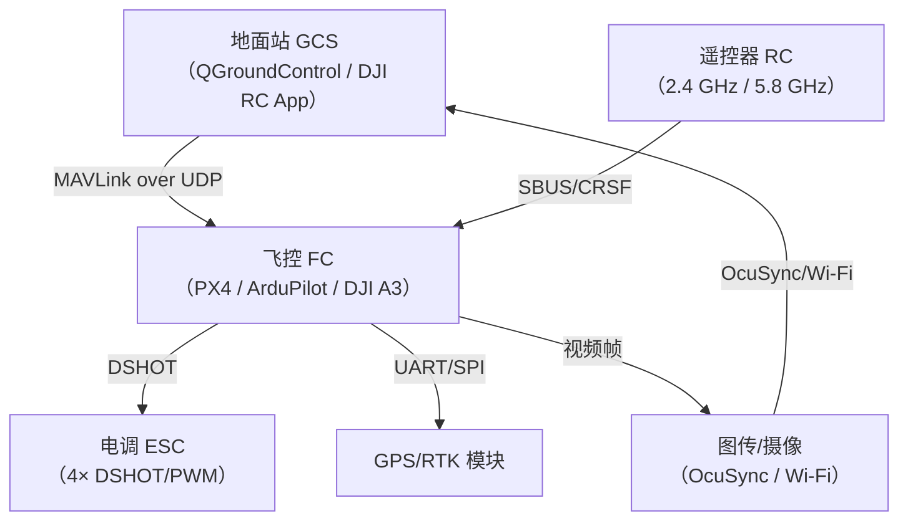

---
tags:
  - 固件
  - IoT
  - tier3
  - 无人机
  - 工控
---
# 工控与无人机专项逆向

> [!abstract] TL;DR
> 工业控制（ICS/PLC）与无人机（UAV）固件逆向是嵌入式安全两个高价值专项方向，均有独特的协议层、加密机制和物理安全后果。PLC 侧以西门子 S7 MC7 字节码反编译、Codesys 运行时分析、梯形图/ST 逻辑还原为核心；无人机侧以 DJI 固件解密（AES-CBC+squashfs）、DUML 协议逆向、MAVLink 帧分析为主线。GPS 欺骗、RC 劫持、地理围栏绕过等攻击面均从**防御与漏洞披露**视角展开，与本系列第 18 章工业协议、第 19 章车载总线形成纵向体系。

## 概述与定位

### 两个专项的共性与差异

工控固件逆向（ICS Firmware RE）与无人机固件逆向（UAV Firmware RE）表面上看是截然不同的方向，但在方法论层面共享若干基础：两者都大量使用专有二进制协议、都有严格的实时约束、都存在"软件逻辑对物理世界直接控制"的安全后果——PLC 的错误逻辑会导致工厂停产乃至设备损毁；飞控固件的漏洞会让无人机失控或被劫持。

差异主要在执行环境：PLC 固件跑在确定性 RTOS（西门子 WinCC/Step 7 后台、Codesys 运行时、AB Logix5000 控制引擎）上，强调循环扫描（scan cycle）的时序确定性；UAV 飞控则分为开源（PX4、ArduPilot）和闭源（DJI、Parrot）两大阵营，有更丰富的通信协议栈（MAVLink、DUML、私有 RC 协议）。

### 与本系列的定位关系

本篇是系列第 26 篇（末篇），在知识地图中居于：

- **上游**：第 03 章（固件解包文件系统）、第 06 章（Bootloader）、第 09 章（IoT 通信协议）
- **横向衔接**：第 18 章工业控制协议（Modbus/DNP3/OPC-UA）、第 19 章车载总线（CAN/UDS）
- **交叉技术**：第 12 章（TrustZone 对应 DJI TEE 分区）、第 13 章（QEMU 仿真对应 ArduPilot SITL）

---

## 原理与机制

### 一、PLC 执行模型与固件结构

#### 1.1 循环扫描模型

PLC（可编程逻辑控制器）的核心执行模型是**循环扫描（Scan Cycle）**，每轮包含三个阶段：

1. **输入映像读取（Input Image Scan）**：将物理 I/O 状态同步到内存中的"输入映像寄存器"（IIR）
2. **程序执行（Program Execution）**：按顺序执行用户逻辑（Ladder / IL / ST / FBD）
3. **输出映像写入（Output Image Scan）**：将内存中的"输出映像寄存器"（OIR）刷到物理 I/O

扫描周期通常为 1–100 ms，超时会触发硬件看门狗（WDT）复位。逆向 PLC 程序时必须理解这个确定性模型——程序执行的"副作用"是对 I/O 寄存器的写操作，而非对某个系统调用的调用。

#### 1.2 西门子 SIMATIC S7 体系

西门子 S7 系列（S7-300/400/1200/1500）是全球市场份额最大的 PLC 产品线。其固件层次如下：

```
┌──────────────────────────────────────┐
│  STEP 7 / TIA Portal (工程软件)      │  ← 运行在 Windows 工程师站
├──────────────────────────────────────┤
│  MPI/PROFIBUS/PROFINET 通信层         │  ← 工业网络
├──────────────────────────────────────┤
│  S7comm/S7comm-Plus 协议栈           │  ← 专有二进制协议
├──────────────────────────────────────┤
│  CPU OS（专有 RTOS）                  │  ← Siemens 闭源
├──────────────────────────────────────┤
│  MC7 字节码 / MC7+ 字节码             │  ← 用户程序编译产物
└──────────────────────────────────────┘
```

用户在 STEP 7 中编写梯形图（LAD）或结构化文本（ST），编译后产生 **MC7 字节码**下载到 PLC CPU 内存。MC7 是一个基于堆栈的虚拟机指令集，每条指令通常 2–4 字节。

#### 1.3 MC7 字节码结构

MC7 字节码以功能块（FB）/功能（FC）/组织块（OB）为单位组织。每个块的二进制头部包含：

| 偏移 | 长度 | 含义 |
|------|------|------|
| 0x00 | 2    | 块类型（0x08=OB, 0x0A=DB, 0x0C=SDB, 0x0E=FC, 0x10=SFC, 0x12=FB, 0x14=SFB） |
| 0x02 | 2    | 块编号 |
| 0x04 | 4    | 块长度 |
| 0x08 | 4    | 局部数据区长度 |
| 0x0C | 变长 | 块接口（输入/输出/In-Out/Temp/Stat 变量定义） |
| 变长 | 变长 | MC7 代码段 |

MC7 指令格式：操作码（1 字节）+ 操作数。主要操作码示例：

```
0x00  NOP
0x54  A   （AND 触点）
0x55  AN  （AND NOT 触点）
0x56  O   （OR 触点）
0x57  ON  （OR NOT 触点）
0x72  =   （线圈赋值）
0x41  L   （Load，装载到累加器）
0x42  T   （Transfer，写入地址）
0x1C  JU  （无条件跳转）
0x1E  JC  （条件跳转）
0x26  CALL （块调用）
0xBE  BE  （块结束）
```

反编译 MC7 的核心工作是：识别操作码 → 解析操作数寻址模式（直接地址 `Q0.0`、间接地址 `*AR1`、DB 地址 `DB1.DBX0.0`）→ 重建梯形图网络（Network）结构。

#### 1.4 Codesys 运行时

**Codesys**（Code System）是一个独立于硬件厂商的 IEC 61131-3 PLC 运行时，被大量第三方 PLC 厂商（倍福 Beckhoff、施耐德 Schneider、B&R）采用。Codesys 编译产生的字节码比 MC7 更接近通用 VM 指令集，逆向友好度稍高。

Codesys V3 的关键点：
- 编译产物为 `.app` 文件（实际是 ZIP 包，内含多个 `.crc` 和 `.ri` 文件）
- 运行时核心库 `CmpApp.so` / `CmpApp.dll` 负责字节码解释
- 提供 TCP 端口 11740（CODESYS Gateway）可远程读写 PLC 内存和程序，历史上存在多个未认证 RCE（CVE-2021-33422、CVE-2022-31805）

#### 1.5 梯形图/IL/ST 的逆向表达

从字节码重建人类可读的 PLC 程序有三种常用表达形式：

**梯形图（Ladder Diagram, LAD）**：最直观的图形表示，源于继电器逻辑。左右两条"电源母线"，中间是"触点"（输入条件）和"线圈"（输出动作）的串并联网络。逆向时，每个 MC7 AND/OR 指令对应一对触点的串/并联。

**指令表（Instruction List, IL）**：类汇编文本形式，是 MC7 字节码最直接的文本映射：

```asm
A     I0.0      ; 检查输入 I0.0（常开触点）
AN    I0.1      ; AND NOT I0.1
O     Q0.0      ; OR 输出线圈 Q0.0（自保）
=     Q0.0      ; 赋值线圈
```

**结构化文本（Structured Text, ST）**：类 Pascal/C 的高级语言，更适合表达复杂运算和循环，反编译时需要识别控制流模式（IF/WHILE/FOR 等 MC7 跳转指令组合）。

---

### 二、无人机系统架构与固件分层

#### 2.1 无人机四大子系统



- **飞控（FC, Flight Controller）**：系统核心，运行姿态估计（EKF）、PID 控制循环、安全监督（failsafe、geofencing）
- **地面站（GCS, Ground Control Station）**：任务规划、参数配置、遥测数据显示，通过 MAVLink 与 FC 通信
- **图传系统**：将摄像头视频流传输到 GCS，可能走 Wi-Fi（早期 DJI Phantom）或私有链路（OcuSync/O3）
- **遥控器（RC）**：操控者的物理输入，SBUS/CRSF 协议将舵量数字化后发给 FC

#### 2.2 DJI 固件加密体系

DJI 是市场份额最大的消费/专业无人机厂商，其固件保护是无人机逆向中最有代表性的案例。

**DJI 固件包格式（`.bin` 文件）**：

```
┌─────────────────────────────────────┐
│  外层包头（明文）                    │
│  - 魔数：0x55 0xAA 0x55 0xAA       │
│  - 固件版本、目标设备型号            │
│  - 各分区偏移表                     │
├─────────────────────────────────────┤
│  分区 1：飞控固件（加密）            │
│  AES-128-CBC，密钥硬编码于设备固件  │
├─────────────────────────────────────┤
│  分区 2：图像处理 DSP 固件（加密）   │
├─────────────────────────────────────┤
│  分区 3：系统镜像                   │
│  经 AES 解密后为 SquashFS 文件系统  │
├─────────────────────────────────────┤
│  分区 N：...                        │
└─────────────────────────────────────┘
```

关键发现（来自安全研究社区公开披露）：
1. AES 密钥存储在设备的特定内存区域，通过物理提取（JTAG 调试接口或 eMMC 直读）可获取
2. 不同代际 DJI 产品使用不同密钥，且部分产品密钥已被研究人员公开（见 `dji-firmware-tools` 项目）
3. 解密后的 SquashFS 根文件系统可用标准 `unsquashfs` 工具提取

**解密工具链（`dji-firmware-tools`）**：

```bash
# 提取固件各分区
python3 dji_fwcon.py -x -p Phantom4_fw_V01.04.0530.bin

# 解密单个分区（需要已知密钥）
python3 dji_mvfc_fwpak.py -d -i FC_FW.bin -o FC_FW_dec.bin

# 提取 SquashFS
unsquashfs -d rootfs/ FC_SquashFS.bin
```

#### 2.3 DUML 协议（DJI Unified Markup Language）

DUML 是 DJI 设备内部通信的专有二进制协议，用于飞控、图传、遥控器、手机 App 各模块之间的指令与遥测交换。帧结构：

```
┌────────┬────────┬────────┬────────┬────────────┬────────┬──────┐
│ SOF    │ LEN    │ VER    │ CRC8   │  Payload   │ CRC16  │      │
│ 0x55   │ 2B     │ 4bit   │ 1B     │  Variable  │ 2B     │      │
└────────┴────────┴────────┴────────┴────────────┴────────┴──────┘
```

Payload 内部字段：

| 字段 | 含义 |
|------|------|
| SEQ  | 序列号（2 字节） |
| SRC  | 源模块 ID（飞控=0x03，App=0x0A，遥控=0x08） |
| DST  | 目标模块 ID |
| CMD_SET | 命令集（0x00=通用，0x01=飞控，0x05=电池，...） |
| CMD_ID  | 具体命令编号 |
| Data    | 命令数据 |

研究人员已对大量 DUML 指令逆向解析，其中包括：
- `CMD_SET=0x01 CMD_ID=0x01`：获取飞行姿态（Roll/Pitch/Yaw）
- `CMD_SET=0x01 CMD_ID=0x03`：获取 GPS 坐标
- `CMD_SET=0x07 CMD_ID=0x30`：读取地理围栏数据库

#### 2.4 MAVLink 协议深度分析

MAVLink（Micro Air Vehicle Link）是开源无人机生态（PX4、ArduPilot）的标准通信协议，也被部分商用产品支持。

**MAVLink 1 帧结构（每帧最大 263 字节）**：

```
┌──────┬──────┬──────┬──────┬──────┬──────────────────┬──────┐
│ 0xFE │ LEN  │ SEQ  │ SYS  │ COMP │  Payload (0-255B) │ CKS  │
│Start │Pld长 │序列号│系统ID│组件ID│  消息内容          │2B校验│
└──────┴──────┴──────┴──────┴──────┴──────────────────┴──────┘
```

**MAVLink 2 帧结构（支持签名）**：

```
┌──────┬──────┬──────┬──────┬────────┬──────────┬──────────────────┬──────┬─────────┐
│ 0xFD │ LEN  │INCOMPAT│COMPAT│  SEQ │  SYS     │  Payload         │ CKS  │SIGNATURE│
│Start │Pld长 │不兼容标│兼容标│序列号│ COMP+MSG │  消息内容          │2B校验│13B可选  │
└──────┴──────┴──────┴──────┴────────┴──────────┴──────────────────┴──────┴─────────┘
```

**MAVLink 2 签名机制**：签名字段（13 字节）= `LINK_ID(1B) + TIMESTAMP(6B) + SIGNATURE(6B)`。签名基于共享密钥（32 字节）和 HMAC-SHA256 计算，截断到前 48 位。但该签名是**可选的**——如果通信双方未协商签名密钥（`SETUP_SIGNING` 消息），所有帧不带签名、也不验证签名，等同于 MAVLink 1 的无认证状态。

**关键消息类型（防御视角）**：

| MSG_ID | 消息名 | 安全含义 |
|--------|--------|----------|
| 0      | HEARTBEAT | 心跳，1Hz，公开系统状态；可用于探测在线无人机 |
| 11     | SET_MODE | 设置飞行模式（MANUAL/AUTO/GUIDED）；无认证时任何人可发送 |
| 21     | PARAM_SET | 修改飞控参数；无认证时可篡改关键参数如最大速度、PID 增益 |
| 22     | PARAM_VALUE | 参数值响应 |
| 76     | COMMAND_LONG | 通用长命令，包含 MAV_CMD_NAV_LAND（强制降落）等危险命令 |
| 84     | SET_POSITION_TARGET_LOCAL_NED | 设置目标位置（位置劫持前提） |

**无认证漏洞原理**：MAVLink 1 及未启用签名的 MAVLink 2 通道对 GCS→FC 方向没有任何认证，网络层可达的攻击者（同一 Wi-Fi/UDP 广播域）可直接注入任意 MAVLink 帧控制无人机。这是开放 MAVLink 端口的根本安全风险。

#### 2.5 开源飞控：PX4 与 ArduPilot

**PX4**（Pixhawk 自动驾驶项目）：
- 基于 NuttX RTOS（类 POSIX API）或 Linux（在 Raspberry Pi 等板上）
- 代码结构清晰，模块化（uORB 发布-订阅消息总线）
- 飞控参数存储在 EEPROM/Flash 的参数服务器中，格式为 `PARAM_VALUE` 消息的键值对
- 固件二进制 `.px4`（实际是 JSON 包装的 `.elf` + 元数据）

**ArduPilot（APM）**：
- 支持最广泛的硬件平台（Pixhawk、APM 2.x、Linux、SITL）
- 基于 AP_HAL 硬件抽象层
- SITL（Software In The Loop）仿真可在 x86 Linux 上完整运行，提供与真实飞控相同的 MAVLink 接口，是安全测试的理想环境

---

## 结构/算法/伪代码详解

### 一、MC7 字节码反编译算法

以下伪代码描述 MC7 → IL（指令表）的反编译核心逻辑：

```python
def decompile_mc7_block(raw_bytes: bytes, interface: BlockInterface) -> list[ILInstruction]:
    """
    将 MC7 字节码序列反编译为指令表（IL）指令列表
    interface: 已解析的块接口（变量名/地址映射）
    """
    instructions = []
    offset = 0
    
    while offset < len(raw_bytes):
        opcode = raw_bytes[offset]
        
        if opcode in (0x54, 0x55, 0x56, 0x57):
            # 位操作：A/AN/O/ON
            # 操作数格式：[区域码(1B)][字节地址(2B)][位号(1B)]
            area, byte_addr, bit_no = parse_bit_operand(raw_bytes, offset + 1)
            operand = format_bit_address(area, byte_addr, bit_no, interface)
            mnemonic = {0x54: 'A', 0x55: 'AN', 0x56: 'O', 0x57: 'ON'}[opcode]
            instructions.append(ILInstruction(mnemonic, operand))
            offset += 4
        
        elif opcode == 0x72:
            # 线圈赋值 =
            area, byte_addr, bit_no = parse_bit_operand(raw_bytes, offset + 1)
            operand = format_bit_address(area, byte_addr, bit_no, interface)
            instructions.append(ILInstruction('=', operand))
            offset += 4
        
        elif opcode == 0x41:
            # L：装载到累加器 ACCU1
            # 操作数类型由下一字节决定：Word/DWord/Real/...
            type_byte = raw_bytes[offset + 1]
            operand = parse_load_operand(raw_bytes, offset + 2, type_byte, interface)
            instructions.append(ILInstruction('L', operand))
            offset += 2 + operand.byte_size
        
        elif opcode == 0x1C:
            # JU：无条件跳转，操作数为相对偏移（有符号 16 位）
            rel_offset = struct.unpack_from('>h', raw_bytes, offset + 1)[0]
            target_offset = offset + rel_offset
            instructions.append(ILInstruction('JU', f'L{target_offset:04X}'))
            offset += 3
        
        elif opcode == 0x26:
            # CALL：块调用
            block_type = raw_bytes[offset + 1]  # FB/FC/SFC 等
            block_no = struct.unpack_from('>H', raw_bytes, offset + 2)[0]
            instructions.append(ILInstruction('CALL', f'{BLOCK_TYPES[block_type]}{block_no}'))
            # 实参区跟随在 CALL 指令后，需额外解析
            offset += 4 + parse_actual_params_size(raw_bytes, offset + 4)
        
        elif opcode == 0xBE:
            # BE：块结束
            instructions.append(ILInstruction('BE', ''))
            break
        
        else:
            # 未知操作码：输出原始十六进制，继续
            instructions.append(ILInstruction(f'?0x{opcode:02X}', ''))
            offset += 1  # 保守步进，可能导致后续失步
    
    return instructions
```

区域码到地址前缀的映射：

```python
AREA_PREFIX = {
    0x81: 'I',   # 输入映像寄存器
    0x82: 'Q',   # 输出映像寄存器
    0x83: 'M',   # 标志位存储区
    0x84: 'DB',  # 数据块（需结合当前打开的 DB 编号）
    0x85: 'L',   # 局部数据（临时变量）
    0x86: 'V',   # 前一实例的局部数据
}
```

### 二、MAVLink 帧注入防御分析

以下伪代码展示 MAVLink 签名验证的防御实现逻辑（来自 ArduPilot MAVLink 库）：

```c
/**
 * 验证 MAVLink 2 签名（防御侧实现参考）
 * 若通道已建立签名密钥，则所有入站帧必须携带有效签名
 */
bool MAVLink_signing_check(const mavlink_message_t *msg,
                           const mavlink_signing_t *signing,
                           const mavlink_signing_streams_t *signing_streams)
{
    /* 若未配置签名密钥，直接放行（降级到无认证模式） */
    if (signing == NULL || !(signing->flags & MAVLINK_SIGNING_FLAG_SIGN_OUTGOING)) {
        return true;  // ← 安全缺陷：应区分"未配置"和"配置为不验证"
    }
    
    /* 检查帧是否携带签名（INCOMPAT_FLAG_SIGNED） */
    if (!(msg->incompat_flags & MAVLINK_IFLAG_SIGNED)) {
        /* 帧不带签名，但通道要求签名 → 拒绝 */
        return false;
    }
    
    /* 提取签名字段（位于 payload 末尾后 13 字节） */
    uint8_t link_id = msg->signature[0];
    uint64_t timestamp = extract_timestamp(msg->signature + 1);  // 6 字节小端
    uint8_t *sig_bytes = msg->signature + 7;                      // 6 字节 HMAC 截断
    
    /* 重放攻击防御：时间戳必须单调递增 */
    mavlink_signing_stream_t *stream = find_stream(signing_streams, msg->sysid,
                                                    msg->compid, link_id);
    if (stream != NULL && timestamp <= stream->last_rx_seq) {
        return false;  // 重放攻击
    }
    
    /* 计算期望签名：HMAC-SHA256(key, CDR || payload || timestamp) 取前 48 bit */
    uint8_t expected_sig[6];
    compute_mavlink2_signature(signing->secret_key, msg, link_id, timestamp, expected_sig);
    
    /* 常数时间比较（防止时序侧信道） */
    if (!constant_time_compare(sig_bytes, expected_sig, 6)) {
        return false;
    }
    
    /* 更新流状态 */
    if (stream != NULL) stream->last_rx_seq = timestamp;
    return true;
}
```

### 三、GPS 欺骗信号原理（防御视角）

GPS 欺骗（GPS Spoofing）是通过发射伪造的 GPS 卫星信号，使接收机计算出错误的位置/时间。从防御角度理解其信号层原理：

GPS L1 C/A 信号结构：
- **载频**：1575.42 MHz
- **扩频码**：PRN（伪随机噪声码），C/A 码 1023 chip，码速率 1.023 Mcps，重复周期 1 ms
- **导航电文**：50 bps，包含星历（ephemeris）、历书（almanac）、卫星时钟校正参数

欺骗攻击分三个递进阶段：

```
阶段 1：信号获取（Acquisition）
  ↓ 攻击者先捕获真实 GPS 信号，确认目标接收机当前跟踪的卫星集合
  
阶段 2：信号伪造（Signal Synthesis）
  ↓ SDR（HackRF/USRP）生成与真实信号相同 PRN 码但时延/多普勒偏移不同的信号
  ↓ 功率需略高于真实信号（约 3–10 dB 以上才能压制）
  
阶段 3：渐进牵引（Meaconing / Gradual Takeover）
  ↓ 初始与真实位置相同，避免接收机检测到跳变
  ↓ 缓慢偏移伪造位置，拖拽目标至期望虚假坐标
```

**检测与防御机制**：

1. **多天线/角度差异检测**：多天线阵列可通过信号到达方向差异识别欺骗（合法卫星来自天顶方向，欺骗信号通常来自地面）
2. **IMU 融合交叉验证**：EKF 将 GPS 位置与 IMU（加速度计/陀螺仪）积分对比，位置跳变超出物理可能范围时报警
3. **信噪比监测（AGC 检测）**：欺骗信号注入会导致 AGC（自动增益控制）读数异常升高
4. **时钟漂移一致性检测**：各卫星伪距的时间戳一致性，欺骗信号不易做到多卫星时序精确同步
5. **飞控防御实现**（PX4 gps_checks.cpp）：检测 GPS 水平精度（EPH）、卫星数量、速度噪声等异常

### 四、DJI 地理围栏（Geofencing）机制

DJI 在飞控固件中内置了基于数据库的地理围栏系统：

```
飞控固件地理围栏模块工作流程：

1. 上电时从 eMMC/Flash 加载围栏数据库
   - 格式：压缩的多边形区域列表 + 属性（禁飞/限高/警告）
   - 定期通过 DJI App → OcuSync/Wi-Fi → 飞控 更新

2. 飞行过程中持续检测：
   if (current_GPS_position in NO_FLY_ZONE):
       if (zone_type == HARD_LIMIT):
           motor.disable()  // 强制降落，无法覆盖
       elif (zone_type == ENHANCED_WARNING):
           allow_unlock_if_user_acknowledged()

3. 解锁逻辑（Enhanced Authorization Zone）：
   - 需连接 DJI App 并联网
   - App 向 DJI 服务器请求临时授权 token
   - token 通过 DUML 消息下发飞控，飞控验证后允许进入
```

逆向研究发现地理围栏数据库文件（`nfz.db` 或类似名称）在解密后的 SquashFS 中可找到，格式为 SQLite 数据库，包含 `fly_zones` 和 `poly_points` 表。

---

## 工具视角与实战

### 一、PLC 固件逆向工具链

#### 1.1 PLCScan / s7scan

扫描网络上的 S7 设备，获取基本信息：

```bash
# 扫描目标网段上的 S7 PLC
python3 s7scan.py -n 192.168.1.0/24

# 输出示例：
# [+] 192.168.1.50:102 - Siemens SIMATIC S7-315-2PN
#     Firmware: V3.3.17
#     Module name: S7315-2PN
#     Plant ID: Line_A_PLC1
```

#### 1.2 python-snap7 / Snap7

与 S7 PLC 通过 S7comm 协议直接通信：

```python
import snap7
from snap7.util import get_bool, set_bool

# 连接 PLC
client = snap7.client.Client()
client.connect('192.168.1.50', 0, 1)  # IP, rack, slot

# 读取输入映像寄存器（授权测试）
i_data = client.read_area(snap7.types.Areas.PE, 0, 0, 1)  # 读 IB0
print(f"I0.0 = {get_bool(i_data, 0, 0)}")
print(f"I0.1 = {get_bool(i_data, 0, 1)}")

# 读取数据块 DB1，从偏移 0 读 10 字节
db_data = client.db_read(1, 0, 10)
```

#### 1.3 TIA Portal + 离线分析

西门子官方工具 TIA Portal（Trial 版可免费使用）能够导入 `.s7l` 项目文件并还原梯形图，但需要注意：
- 加密的 PLC 程序无法直接导入显示源码
- 通过物理提取（JTAG 连接 CPU 的调试接口）可绕过密码保护读取 MC7

```bash
# 使用 Siemens S7 内存读取工具（需已连接 JTAG/MPI）
# 读取 S7-300 CPU 内存中的 OB1 代码块
s7mem_read --cpu s7300 --block OB1 --output ob1.bin

# 使用第三方 MC7 反编译器（如 mc7decompiler）
mc7decompiler -i ob1.bin -o ob1.il
```

#### 1.4 Codesys 逆向

```bash
# 解包 Codesys .app 文件（实际是 ZIP）
unzip PLCApplication.app -d app_extracted/

# 分析 .ri 文件（运行时映像）
# 包含编译后的字节码，需要对照 CmpCodeGeneratorEmbedded.h 理解格式
file app_extracted/*.ri

# 可使用 CodesysDecompiler 开源项目（Python 实现）
python3 codesys_decompile.py -i app_extracted/PLCLogic.ri -o decompiled.st
```

### 二、无人机固件逆向工具链

#### 2.1 dji-firmware-tools

```bash
# 克隆工具链
git clone https://github.com/o-gs/dji-firmware-tools.git
cd dji-firmware-tools

# 列出固件包内容（不解密，仅查看结构）
python3 dji_fwcon.py -l -p Mavic3_FW_V01.00.0500.bin

# 提取所有分区
python3 dji_fwcon.py -x -p Mavic3_FW_V01.00.0500.bin -o extracted/

# 解密飞控分区（需要对应版本密钥）
python3 dji_mvfc_fwpak.py -d -i extracted/m0901_fc.bin -o fc_decrypted.bin

# 解密 SquashFS 镜像
python3 dji_imah_fwsig.py -d -i extracted/m0100_wm220_wm330.pro.fw.sig -o rootfs.squashfs
unsquashfs -d rootfs/ rootfs.squashfs
```

#### 2.2 MAVLink 流量分析

```bash
# 使用 Wireshark + MAVLink 解析插件
# MAVLink 默认 UDP 端口 14550（GCS）和 14540（机载计算机）

# 抓包
tcpdump -i eth0 udp port 14550 -w mavlink_capture.pcap

# Python 解析（使用 pymavlink）
from pymavlink import mavutil

# 连接到真实飞控或 SITL（授权测试）
mav = mavutil.mavlink_connection('udpout:127.0.0.1:14550')
mav.wait_heartbeat()
print(f"系统 {mav.target_system} 组件 {mav.target_component} 心跳收到")

# 读取参数
mav.param_fetch_all()
while True:
    msg = mav.recv_match(type='PARAM_VALUE', blocking=True, timeout=5)
    if msg is None:
        break
    print(f"{msg.param_id}: {msg.param_value}")
```

#### 2.3 ArduPilot SITL 测试环境

SITL（Software In The Loop）是分析 MAVLink 安全性的最佳受控环境：

```bash
# 克隆 ArduPilot 并编译 SITL
git clone https://github.com/ArduPilot/ardupilot.git
cd ardupilot
./waf configure --board sitl
./waf copter

# 启动 SITL 仿真（运行在 localhost）
build/sitl/bin/arducopter --model quad --home -35.363261,149.165230,584,353

# 在另一终端用 QGroundControl 或 pymavlink 连接
# SITL 默认监听 UDP 14550
```

#### 2.4 IDA / Ghidra 分析 DJI 飞控

解密后的 DJI 飞控固件通常是 ARM Cortex-M 裸机固件（.bin 格式），逆向步骤：

```python
# Ghidra 脚本：自动识别 MAVLink 帧解析相关函数
# 查找特征字节 0xFE（MAVLink 1 SOF）的引用
def find_mavlink_parsers(program, monitor):
    memory = program.getMemory()
    # 搜索特征常量 0xFE 0x?? 0x?? 0x?? 0x?? 0x??（MAVLink 帧起始）
    pattern = bytes.fromhex("FE")
    
    found_refs = []
    for func in program.getFunctionManager().getFunctions(True):
        # 在每个函数中搜索对 0xFE 的即时数值引用
        # 通常是 `CMP R0, #0xFE` 这样的比较指令
        for instr in func.getBody():
            if 'FE' in instr.toString():
                found_refs.append(func)
                break
    return found_refs
```

### 三、RC 劫持攻击面分析（防御视角）

RC（遥控器）与无人机之间的通信协议多样，安全特性参差不齐：

| 协议 | 频率 | 调制 | 认证 | 安全特性 |
|------|------|------|------|---------|
| 传统 PWM | 27/35/72 MHz | AM/FM | 无 | 完全无保护，任意同频遥控可接管 |
| DSM2/DSMX | 2.4 GHz | DSSS/FHSS | 无/弱 | 早期版本无加密，可被重放 |
| SBUS（有线） | N/A（UART） | 数字 | N/A | 有线协议，仅在飞控内部 |
| FrSky ACCESS | 2.4 GHz | FHSS | AES-128 | 双向，有加密认证 |
| ExpressLRS | 2.4/900 MHz | LoRa/FLRC | FHSS+绑定 | 超长距，开源，绑定后防劫持 |
| DJI OcuSync 3 | 2.4/5.8 GHz | OFDM | 加密 | 私有协议，闭源 |
| DJI Lightbridge | 2.4/5.8 GHz | OFDM | 加密 | 早期版本有研究记录 |

**SBUS 协议结构**（飞控内部常见接口）：

```
帧格式：100 kbaud, 8E2（8数据位 偶校验 2停止位，信号反相）
帧长：25 字节，固定间隔 7 ms（F.Port）/ 14 ms（标准）

字节 0    : 帧头 0x0F
字节 1-22 : 16 路通道数据（11位/通道，小端排列，跨字节）
字节 23   : 标志字节
           bit7: 帧丢失标志
           bit4: 失控保护激活
           bit3-0: 数字通道 17-20
字节 24   : 帧尾 0x00
```

**劫持防御措施**：
1. 使用支持硬件绑定的现代 RC 协议（ExpressLRS、FrSky ACCESS）
2. 飞控侧启用失控保护（Failsafe），RC 信号丢失时自动返航（RTH）或降落
3. 监测 RSSI/LQ（链路质量）异常波动，低于阈值触发故障安全
4. 对开源飞控，定期审计 SBUS/CRSF 解析代码（历史上有帧解析整数溢出）

---

## 安全性与正确使用

> [!caution]
> **法律与道德边界（必读）**
>
> 本章所有涉及 GPS 欺骗、RC 劫持、MAVLink 注入、PLC 固件提取等技术的描述，均出于**防御研究、安全加固与漏洞责任披露**目的。在实际操作时：
>
> - **GPS 欺骗**属于干扰无线电导航系统行为，在中国受《无线电管理条例》约束，在美国属违反 47 U.S.C. § 333（干扰导航），在几乎所有国家都是刑事犯罪。即使是学术研究也必须在**屏蔽室（Faraday cage）内或专用无线电测试区**进行，并取得无线电主管部门批准。
>
> - **RC 劫持测试**仅限于**自有设备**，在**隔离的 RC 频率测试环境**中进行，绝不针对他人飞行器。干扰他人遥控系统可能导致坠机、人员伤亡，构成刑事破坏罪。
>
> - **MAVLink 注入**和**PLC 固件读取**必须在**自有设备**或**有书面授权的渗透测试合同**下进行。对工业控制系统的未授权访问在多数国家属于计算机犯罪，且可能导致严重生产事故（停产、设备损毁、人员安全事故）。
>
> - **无人机飞行**须遵守《无人驾驶航空器飞行管理暂行条例》（中国）或各国 CAA/FAA 法规：禁飞区禁止飞行，超视距飞行须取得许可，250 g 以上无人机须实名注册。
>
> - 漏洞发现后应通过**负责任披露（Responsible Disclosure）**流程报告厂商（DJI 有官方漏洞赏金计划，ArduPilot 接受 GitHub Security Advisory），给予合理修复周期再公开。
>
> 本文所有技术细节均来自公开发表的安全研究（Black Hat / DEF CON / S4 会议论文、GitHub 开源项目），作者不承担因违法使用导致的任何责任。

### 工控系统安全研究规范

工控（ICS/OT）安全有其特殊规范，不同于 IT 渗透测试：

1. **实验室隔离原则**：任何测试必须在物理隔离的测试 PLC 上进行，绝不连接生产网络。生产 PLC 的错误操作可能直接导致物理设备损毁或人员伤亡。

2. **最小影响原则**：读取操作（读程序块、读参数）风险远低于写入操作（修改输出寄存器、下载程序）。在授权测试中也应先只读后写入，并充分评估每一步的物理后果。

3. **协调停机窗口**：合法渗透测试应与生产运营团队协调在计划停机窗口（Maintenance Window）内进行，避免在生产运行时测试。

4. **紧急恢复预案**：测试前须备份 PLC 程序（完整的 `.s7l` 或 Codesys 项目），确保能在几分钟内恢复。

5. **CVE 披露流程**：发现 ICS 产品漏洞应向 ICS-CERT（美国 CISA）或对应 CERT 报告，不直接公开 PoC，给予厂商至少 90 天修复周期。

---

## 小结

本篇系统覆盖了工控 PLC 与无人机两个专项方向的固件逆向：

**工控 PLC 侧**：
- 循环扫描模型是 PLC 固件逆向的认知基础；程序逻辑以 MC7/Codesys 字节码存储
- MC7 字节码反编译的核心是操作码识别 + 操作数寻址模式解析 + 梯形图网络重建
- Codesys 生态的开放性使其历史漏洞更多，但也有更多开源分析工具
- S7comm 协议（端口 102）是与 S7 PLC 通信的入口，Snap7 库可进行授权访问测试

**无人机 UAV 侧**：
- 无人机四大子系统（FC/GCS/图传/RC）各有不同的协议层和攻击面
- DJI 固件通过 AES-CBC 加密 SquashFS，密钥提取是逆向的前提；`dji-firmware-tools` 提供完整工具链
- DUML 协议是 DJI 设备内部通信的核心，消息集已有大量逆向成果
- MAVLink（开源生态）默认无认证是根本安全风险；MAVLink 2 签名机制设计合理但需主动启用
- GPS 欺骗的多阶段信号模型帮助理解防御检测机制（IMU 融合、AGC 监测、多天线阵列）
- 地理围栏以 SQLite + 多边形数据库实现，分软/硬限制两级控制

**通用原则**：工控和无人机固件逆向的最终价值在于发现安全漏洞、推动厂商修复、提升公共安全水平，所有操作须严格遵守法律授权框架与负责任披露规范。

---

## 相关阅读

- **系列内**：
  - [[18.工业控制协议逆向|第 18 章：工业控制协议逆向（Modbus/DNP3/OPC-UA）]]：工控协议层基础，本篇 PLC 固件逆向的协议前提
  - [[19.车载总线与汽车ECU逆向|第 19 章：车载总线与汽车 ECU 逆向]]：类似专项方向，CAN/UDS 与 MAVLink 方法论对比
  - [[03.固件解包与文件系统|第 03 章：固件解包与文件系统]]：SquashFS 提取基础（DJI 固件解密后步骤）
  - [[09.IoT通信协议逆向|第 09 章：IoT 通信协议逆向]]：BLE/MQTT 协议逆向基础

- **外部资源**：
  - `O-GSi/dji-firmware-tools`（GitHub）：DJI 固件解密工具链，持续更新
  - `mavlink/mavlink`（GitHub）：MAVLink 协议官方规范与参考实现
  - `ArduPilot/ardupilot`（GitHub）：开源飞控，SITL 测试环境
  - Nils Rodday, "Hacking a Professional Drone" (RSA 2016)：专业无人机 RC/图传安全研究
  - Conner Bender et al., "The SPOOKY UAV" (NDSS 2024)：GPS 欺骗对 UAV 的实证研究
  - Dillon Beresford, "Exploiting Siemens Simatic S7 PLCs" (Black Hat 2011)：工控安全经典研究
  - CVE-2019-13945（Siemens SIMATIC）、CVE-2021-33422（Codesys）：典型工控 CVE

---

[[00.固件与IoT嵌入式逆向总览|⬆ 系列总览]] | [[25.固件供应链与SBOM分析|← 上一章]]
