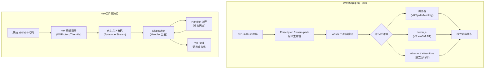
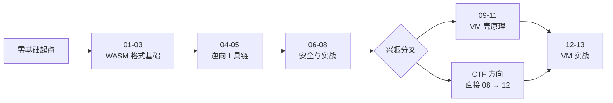

# WASM与虚拟化壳逆向 · 系列总览

## 系列简介

本系列共 **22 篇**（14-22 为扩展专题），分两大主题：

**WebAssembly（WASM）逆向分析**：从二进制格式、指令集、文本格式 WAT，到反编译工具链（Ghidra 插件、wasm-decompile、wasm2c）、动态调试（浏览器 DevTools、wasmer、Frida hook），再到线性内存安全、WASM 混淆壳分析，最终以 WASM CTF 实战收尾。

**虚拟机保护壳（VM 壳）逆向分析**：覆盖 VMProtect、Themida、Code Virtualizer 等主流 VM 壳的保护原理、字节码与 Handler 分析、VTIL 提升框架，以及借助 Intel PIN、Unicorn Engine、Triton/angr 符号执行的自动化分析流程。

**目标读者**：CTF 选手、安全研究员、恶意软件分析师、Web 安全研究员。

> [!caution] 合规边界
> 本系列介绍的分析技术仅限用于：CTF 竞赛解题、自有程序的安全研究、合法授权的安全审计与渗透测试。
> **本系列不提供针对他人商业软件 DRM 的武器化破解步骤，不提供可落地的 0day 利用链。** 请在法律允许的范围内使用所学知识。

---

## WASM 执行流程与 VM 保护架构

---

## 章节索引

### 第一章组：WASM 基础与格式

| 章节 | 标题 | 核心内容 |
|------|------|----------|
| 第 01 章 | [[01.WASM二进制格式与模块结构]] | Section 类型（Custom/Type/Import/Function/Table/Memory/Global/Export/Start/Element/Code/Data）、Magic 字节 `\0asm`、LEB128 编码、Import/Export 语义 |
| 第 02 章 | [[02.WASM指令集与执行模型]] | 栈式 VM 模型、操作码表、value_type（i32/i64/f32/f64/v128）、block_type、控制流指令（block/loop/if/br）、trap 机制 |
| 第 03 章 | [[03.WASM文本格式WAT与反汇编工具]] | WAT 语法（S 表达式）、wat2wasm/wasm2wat 互转、wasm-objdump 段分析、wasm-dis 反汇编输出格式 |

### 第二章组：WASM 逆向工具链

| 章节 | 标题 | 核心内容 |
|------|------|----------|
| 第 04 章 | [[04.WASM反编译：wasm-decompile与Ghidra插件]] | wasm-decompile 类 C 伪代码输出、wasm2c 生成 C 代码、Ghidra WASM 插件安装与使用、类型信息恢复技巧 |
| 第 05 章 | [[05.WASM动态分析与调试]] | wasmer/wabt 运行时调试、浏览器 DevTools WASM Debugger、Source Maps 断点、内存 dump 方法、Frida hook WASM 导出函数 |

### 第三章组：WASM 安全与应用

| 章节 | 标题 | 核心内容 |
|------|------|----------|
| 第 06 章 | [[06.WASM内存模型与线性内存安全]] | 线性内存（平坦地址空间）、64KB 页粒度、memory.grow、Emscripten 堆布局（静态/堆/栈）、WASM Buffer Overflow 条件与绕过 |
| 第 07 章 | [[07.WASM作为混淆壳]] | 敏感逻辑编译入 WASM 的模式、JS 胶水层分析、wasm-opt 混淆手段、逆向策略（Hook + 内存 dump）、防御视角 |
| 第 08 章 | [[08.WASM CTF实战]] | 典型 WASM CTF 题型分类（算法还原/密钥提取/绕过检查）、完整分析流程、工具选型决策树 |

### 第四章组：虚拟机保护壳原理

| 章节 | 标题 | 核心内容 |
|------|------|----------|
| 第 09 章 | [[09.虚拟化保护壳总览]] | VMProtect/Themida/Code Virtualizer 原理对比、保护层次、反调试机制、虚拟机架构类型（RISC/CISC 模拟）|
| 第 10 章 | [[10.VM字节码与Handler分析]] | Dispatcher/Handler 识别方法、字节码流格式分析、Handler 语义提取（污点追踪/模式匹配）、VMContext 结构恢复 |
| 第 11 章 | [[11.VTIL与提升框架]] | VTIL IR 格式、virt_begin/virt_end 边界标记、优化 Pass（死代码消除/常量折叠）、x64 输出重建 |

### 第五章组：VM 壳逆向实战

| 章节 | 标题 | 核心内容 |
|------|------|----------|
| 第 12 章 | [[12.VMProtect逆向实战]] | VMProtect 特征识别（入口 `PUSH×N → CALL vm_dispatcher`）、VM 入口定位、字节码反汇编、Pin/Unicorn 动态追踪 Handler 序列 |
| 第 13 章 | [[13.VM壳自动化分析]] | 符号执行辅助脱壳、Triton 动态污点 + SMT 求解、angr 代码覆盖率引导、自动化 Handler 语义提取 |

---

### 第六章组：加壳与脱壳实战（扩展）

| 章节 | 标题 | 核心内容 |
|------|------|----------|
| 第 14 章 | [[14.Themida与WinLicense逆向实战]] | Oreans SecureEngine、VM-in-VM 嵌套、CISC/FISH/TIGER、Ring0 驱动（防御）|
| 第 15 章 | [[15.传统加壳Enigma与Obsidium与Armadillo]] | 压缩/加密壳、Armadillo Nanomites/双进程、Enigma/Obsidium（防御）|
| 第 16 章 | [[16.脱壳实战OEP与Dump与IAT重建]] | OEP 定位（ESP 定律）、Dump、Scylla IAT 重建、Anti-dump（防御）|

### 第七章组：混淆对抗与模拟脱壳（扩展）

| 章节 | 标题 | 核心内容 |
|------|------|----------|
| 第 17 章 | [[17.代码混淆对抗OLLVM与Tigress]] | OLLVM CFF/BCF/SUB、Tigress、D-810/miasm 反混淆 |
| 第 18 章 | [[18.反调试与反虚拟机检测全景]] | API/PEB/时序/异常/硬件断点反调试、反 VM、ScyllaHide |
| 第 19 章 | [[19.Unicorn与Qiling模拟脱壳]] | CPU 模拟绕反调试、Qiling 全系统仿真、OEP 自动定位 |

### 第八章组：跨平台壳与 WASM 进阶（扩展）

| 章节 | 标题 | 核心内容 |
|------|------|----------|
| 第 20 章 | [[20.NET混淆与VM壳ConfuserEx]] | .NET IL/元数据、ConfuserEx、KoiVM、de4dot/dnSpy（防御）|
| 第 21 章 | [[21.WASI与WASM组件模型]] | WASI preview1/2、capability 安全、Component Model/WIT |
| 第 22 章 | [[22.Java与Android_DEX加固壳]] | DEX 抽取/VMP 加固、FART/frida-dexdump 脱壳、ART hook（防御）|

---

## 学习路径建议

---

## 配套工具总览

| 工具 | 用途 | 适用章节 |
|------|------|---------|
| **wabt**（wat2wasm/wasm2wat/wasm-objdump） | WASM 格式转换与分析 | 01-03 |
| **wasm-decompile / wasm2c** | WASM 反编译（类 C 伪代码/C 代码） | 04 |
| **Ghidra + WASM 插件** | 图形化 WASM 反汇编与反编译 | 04 |
| **Binaryen**（wasm-opt/wasm-as/wasm-dis） | WASM 优化、汇编、反汇编 | 03、07 |
| **浏览器 DevTools** | WASM 动态调试（断点/单步/内存） | 05 |
| **Frida** | WASM 导出函数 Hook | 05、07 |
| **Intel PIN** | x86/x64 动态二进制插桩（Trace） | 12、13 |
| **Unicorn Engine** | 轻量模拟执行（Python API） | 12、13 |
| **Triton** | 动态污点 + 符号执行（SMT） | 13 |
| **angr** | 静态符号执行 + 覆盖率引导 | 13 |
| **VTIL** | VM 字节码提升到 IR | 11 |

---

## 跨系列关联

- 反编译器原理与 VM 逆向深化 → [[45.反编译器与反汇编引擎原理/00.反编译器与反汇编引擎原理总览]]
- 虚拟化保护逆向原理（专题） → [[45.反编译器与反汇编引擎原理/10.虚拟化保护逆向原理]]
- 符号执行与 angr 框架深化 → [[45.反编译器与反汇编引擎原理/11.符号执行与angr框架]]
- 固件与 IoT 逆向（前置系列） → [[39.固件与IoT嵌入式逆向/00.固件与IoT嵌入式逆向总览]]
