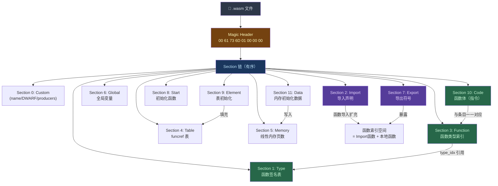

# WASM逆向（01）· WASM二进制格式与模块结构

## 概述与定位

> [!abstract] TL;DR
> WebAssembly（WASM）是一种以紧凑二进制格式存储的低级栈式虚拟机指令集，设计目标是在浏览器和独立运行时中高效、安全地执行。其 `.wasm` 文件由固定 8 字节头部（Magic Number + 版本号）和若干有序 Section 组成。Section 内部大量使用 LEB128 可变长整数编码。掌握文件头、Section 布局、LEB128 解码、值类型编码这四块基础，是所有 WASM 逆向工作的起点。

### 为什么 WASM 逆向与传统二进制逆向不同

传统 ELF/PE 逆向面对的是 x86/x64 指令集——工具链成熟，IDA、Ghidra 开箱即用，符号、节区、重定位、PLT 这些概念已是常识。WASM 则不同：

- **运行时沙盒**：WASM 模块运行在宿主（浏览器/Wasmer/Wasmtime）提供的沙盒里，与宿主通过受控的 Import/Export 接口通信，没有直接系统调用。
- **线性内存模型**：所有内存访问通过从 `0` 开始的线性地址空间，没有栈/堆的操作系统层面区别（WASM 层面的"栈"是宿主管理的值栈，模拟 C 栈是在线性内存里手动维护的）。
- **Section 驱动的格式**：文件由 Section 有序拼接，每个 Section 均携带长度前缀，格式高度自描述，但工具支持远不如 ELF 工具链丰富。
- **混淆与保护**：部分对抗分析的 WASM 会利用 Custom Section 隐藏数据、故意破坏 name section、或通过代码混淆干扰反编译器。

本章聚焦于最底层：二进制字节如何组织成一个合法的 WASM 模块，以及如何用工具验证和解析这个格式。

---

## 原理与机制

### 文件头（Magic Number & Version）

每个合法的 `.wasm` 文件必须以以下 8 字节开头：

```
偏移  字节值      含义
0x00  00 61 73 6D  Magic Number: \0asm（ASCII）
0x04  01 00 00 00  版本号: 1（Little-Endian uint32）
```

- **Magic Number** `\0asm`：以 `0x00` 开头是刻意设计的——目的是防止被当作文本文件处理（文本编辑器通常拒绝以 NUL 开头的文件）。
- **版本号** `0x01000000`：当前唯一正式版本为 1，以 Little-Endian 存储，因此字节序列为 `01 00 00 00`。若读取到其他版本号，运行时应拒绝加载。

用 `xxd`/`hexdump` 检查任何 `.wasm` 文件，头 8 字节必然是这个固定模式，这是快速鉴别 WASM 文件的指纹。

### LEB128 编码

WASM 二进制格式大量使用 **LEB128（Little-Endian Base 128）** 可变长整数编码，用于存储 Section 长度、元素计数、函数索引、常量值等一切整数。理解 LEB128 是手工解析 WASM 字节流的必备基础。

#### 无符号 LEB128（ULEB128）

编码规则：
1. 将整数写成二进制形式。
2. 从最低位起，每 7 位为一组。
3. 每个字节的低 7 位存储数据位，最高位（bit 7）为**继续标志**：
   - `1` = 后面还有更多字节
   - `0` = 这是最后一个字节

**示例：编码 `300`**

```
300 的二进制：100101100
补全到 14 位：00 0000010 0101100
               ^^^^^^^^ ^^^^^^^^
               高 7 位  低 7 位

低 7 位: 0101100 → 加继续位 1 → 10101100 = 0xAC
高 7 位: 0000010 → 最后字节，继续位 0 → 00000010 = 0x02

编码结果: 0xAC 0x02
```

解码验证：`0xAC = 0b10101100`，去掉最高位得 `0101100`；`0x02 = 0b00000010`，去掉最高位得 `0000010`。拼接（高位在左）：`0000010_0101100 = 100101100₂ = 256 + 32 + 8 + 4 = 300`。

**常见单字节值**（0–127 无需继续位，直接等于该字节值）：
- `0x00` = 0，`0x01` = 1，`0x7F` = 127

**两字节边界**：128（`0x80 0x01`）是最小的两字节 ULEB128 值。

#### 有符号 LEB128（SLEB128）

用于编码有符号整数（i32/i64 常量指令操作数）。编码规则与 ULEB128 类似，但最后一个字节的最高数据位（bit 6）是符号位，解码时需要进行符号扩展。

示例：`-1` 编码为 `0x7F`（单字节，所有 7 位均为 1，符号扩展后全 1 = -1）；`-128` 编码为 `0x80 0x7F`。

### Section 结构

Magic Header 之后，文件由若干 **Section** 按顺序拼接而成。每个 Section 格式如下：

```
[id: u8]       -- Section 类型 ID（1 字节）
[size: ULEB128] -- Section 内容字节长度（不含 id 和 size 本身）
[content: u8*] -- Section 内容（size 字节）
```

Section 必须按 ID 升序出现（Custom Section 可出现在任意位置），同类型 Section 通常只出现一次（Custom 可多次）。

### Section 类型全表

| ID | 名称 | 内容 |
|----|------|------|
| 0 | Custom | 自定义段（名称段 `name`、DWARF 调试信息、`producers` 元数据等），不影响语义 |
| 1 | Type | 函数类型签名列表（参数类型向量 + 返回类型向量） |
| 2 | Import | 导入的函数、表、内存、全局变量（引用外部宿主或其他模块提供的实体） |
| 3 | Function | 函数声明列表（每个函数存储其在 Type Section 中的类型索引） |
| 4 | Table | 表定义（`funcref`/`externref` 类型元素的可调整大小序列） |
| 5 | Memory | 线性内存定义（初始页数和可选最大页数，1页 = 64 KiB） |
| 6 | Global | 全局变量（类型、可变性标志 `mut`/`const`、初始值表达式） |
| 7 | Export | 导出列表（名称 → 函数/表/内存/全局变量的索引） |
| 8 | Start | 模块初始化函数索引（加载后自动执行，无参数、无返回值） |
| 9 | Element | 表初始化数据（函数引用列表，用于填充 Table 中指定偏移） |
| 10 | Code | 函数体列表（与 Function Section 一一对应：局部变量声明 + 指令序列） |
| 11 | Data | 线性内存初始化数据（字节数组，加载时拷贝到指定内存偏移） |

> [!note] 索引空间
> WASM 使用统一的**索引空间**：Function 索引从 Import Section 中的导入函数开始计数，然后是 Function Section 中的定义。Code Section 只包含本地定义函数，与 Function Section 中的条目一一对应（不含导入）。

### 值类型编码

WASM 的类型系统紧凑，每个值类型用单字节负数表示（有符号 LEB128 的负值编码技巧，在单字节范围内恰好是 `0x7x` 系列）：

| 字节 | 类型 | 说明 |
|------|------|------|
| `0x7F` | `i32` | 32 位整数 |
| `0x7E` | `i64` | 64 位整数 |
| `0x7D` | `f32` | 32 位浮点 |
| `0x7C` | `f64` | 64 位浮点 |
| `0x7B` | `v128` | 128 位 SIMD 向量（SIMD 提案） |
| `0x70` | `funcref` | 函数引用 |
| `0x6F` | `externref` | 外部引用 |

函数类型签名（`func_type`）以 `0x60` 为前缀。

### WASM 模块整体结构图



---

## 结构/算法/伪代码详解

### Type Section 字节格式逐字节解析

Type Section（ID = `0x01`）存储所有函数类型签名，是整个模块的类型中心。

```
[01]                    -- Section ID = 1 (Type)
[xx]                    -- Section 字节长度 (ULEB128，以下内容的总字节数)
[02]                    -- 函数类型数量 = 2（ULEB128）

-- 类型 0: (i32, i32) -> (i32) --
[60]                    -- func_type 前缀标志（固定为 0x60）
[02]                    -- 参数数量 = 2（ULEB128）
[7F]                    -- 参数 0: i32
[7F]                    -- 参数 1: i32
[01]                    -- 返回值数量 = 1（ULEB128）
[7F]                    -- 返回值 0: i32

-- 类型 1: () -> () --
[60]                    -- func_type 前缀
[00]                    -- 参数数量 = 0
[00]                    -- 返回值数量 = 0
```

逆向时常见的类型签名识别方法：先找到 Type Section（偏移 0x08 开始寻找第一个非 Custom Section），读取类型数量，然后逐条解析 `60 [param_count] [param_types...] [ret_count] [ret_types...]` 结构。

### Function Section 字节格式

Function Section（ID = `0x03`）仅存储每个本地函数的**类型索引**，与 Code Section 中的函数体一一对应：

```
[03]         -- Section ID = 3 (Function)
[04]         -- Section 长度 = 4 字节
[03]         -- 函数数量 = 3
[00]         -- 函数 0 的类型索引 = 0（引用 Type Section 中类型 0）
[00]         -- 函数 1 的类型索引 = 0
[01]         -- 函数 2 的类型索引 = 1
```

这里的函数索引是**本地函数索引**，全局函数索引需要加上 Import Section 中导入函数的数量。

### Code Section 字节格式逐字节解析

Code Section（ID = `0x0A`）存储所有本地函数的函数体，每个函数体独立封装：

```
[0A]              -- Section ID = 10 (Code)
[xx]              -- Section 字节长度（ULEB128）
[01]              -- 函数体数量 = 1

-- 函数体 0 --
[09]              -- 函数体字节长度 = 9（ULEB128，以下到 end 的字节数）
[01]              -- 局部变量组数量 = 1
  [01]            -- 本组局部变量数量 = 1
  [7F]            -- 本组局部变量类型 = i32
                  -- （局部变量 0 是 i32，注意：参数也算"局部变量"，索引从 0 开始）

-- 指令序列 --
[20 00]           -- local.get 0  (操作码 0x20, 局部变量索引 0)
[20 01]           -- local.get 1  (操作码 0x20, 局部变量索引 1)
[6A]              -- i32.add      (操作码 0x6A，弹出两个 i32 相加后压栈)
[0B]              -- end          (操作码 0x0B，函数结束)
```

上面实现了 `(i32, i32) -> i32` 的加法函数。逆向时关键点：

1. **局部变量组**：WASM 对同类型连续局部变量采用"数量 + 类型"压缩存储，`[03 7F]` 表示 3 个 i32 局部变量。
2. **函数体长度字段**：是关键的跳跃点，可以直接跳到下一个函数体，快速遍历所有函数。
3. **`end` 操作码 `0x0B`**：不仅用于函数结束，也用于 `block`、`loop`、`if` 的结束，分析时需结合上下文。

### Import Section 格式

Import Section（ID = `0x02`）声明模块从外部（宿主环境或其他模块）导入的实体：

```
[02]              -- Section ID = 2 (Import)
[xx]              -- Section 长度
[02]              -- 导入数量 = 2

-- 导入 0: 函数导入 --
[03] 65 6E 76    -- 模块名长度=3, 内容="env"
[0B] 6D...       -- 字段名长度=11, 内容="memory_grow"（ULEB128+字节）
[00]              -- 导入类型 = 0x00 (函数)
[05]              -- 函数类型索引 = 5（引用 Type Section）

-- 导入 1: 内存导入 --
[03] 65 6E 76    -- 模块名="env"
[06] 6D...       -- 字段名="memory"
[02]              -- 导入类型 = 0x02 (内存)
[00]              -- limits 类型: 0=只有最小值, 1=有最小值和最大值
[01]              -- 初始页数 = 1（64 KiB）
```

导入的函数会排在全局函数索引空间的最前面，这对逆向分析很重要：如果模块从 `env` 导入了 4 个函数，那么 Code Section 中的"第 0 个函数体"对应的全局函数索引是 4，而不是 0。

### Data Section 与内存初始化

```
[0B]              -- Section ID = 11 (Data)
[xx]              -- Section 长度
[01]              -- 数据段数量 = 1
[00]              -- 段类型: 0=主动（active），指定内存和偏移
[41 00 0B]        -- 偏移表达式: i32.const 0 (0x41=i32.const, 0x00=立即数0), end
[05]              -- 数据字节长度 = 5
[48 65 6C 6C 6F] -- 数据内容: "Hello"
```

这表示在模块实例化时，将字符串 "Hello" 写入线性内存的偏移 0 处。逆向时，Data Section 是寻找字符串常量和硬编码数据的重要入口。

---

## 工具视角/实战

### wasm-objdump 基础用法

`wasm-objdump` 是 WABT（WebAssembly Binary Toolkit）中最常用的静态分析工具，类似于 ELF 逆向中的 `readelf` + `objdump` 的组合。

```bash
# 查看所有 Section 的摘要信息（偏移、大小、元素数量）
wasm-objdump -h input.wasm

# 反汇编 Code Section，输出 WAT（WebAssembly Text Format）格式
wasm-objdump -d input.wasm

# 查看所有 Section 的详细内容（Import/Export/Type 等完整解析）
wasm-objdump -x input.wasm

# 以十六进制转储格式查看原始字节
wasm-objdump -s input.wasm

# 组合使用：详细 + 反汇编
wasm-objdump -dx input.wasm
```

**`-h` 输出示例**（某真实 WASM 文件）：

```
input.wasm:     file format wasm 0x1

Sections:

     Type start=0x0000000a end=0x0000001f (size=0x00000015) count: 3
   Import start=0x00000021 end=0x00000056 (size=0x00000035) count: 4
 Function start=0x00000058 end=0x00000061 (size=0x00000009) count: 8
    Table start=0x00000063 end=0x00000068 (size=0x00000005) count: 1
   Memory start=0x0000006a end=0x0000006d (size=0x00000003) count: 1
   Global start=0x0000006f end=0x00000083 (size=0x00000014) count: 3
   Export start=0x00000085 end=0x000000c5 (size=0x00000040) count: 7
  Element start=0x000000c7 end=0x000000d2 (size=0x0000000b) count: 1
     Code start=0x000000d4 end=0x0000016e (size=0x0000009a) count: 8
     Data start=0x00000170 end=0x000001a2 (size=0x00000032) count: 2
```

**`-d` 反汇编输出示例**：

```
Code Disassembly:

000037 func[4] <add>:
 000038: 20 00                      | local.get 0
 00003a: 20 01                      | local.get 1
 00003c: 6a                         | i32.add
 00003d: 0b                         | end
```

左列是文件偏移，中列是原始字节，右列是助记符。

**`-x` 详细解析示例（Type Section）**：

```
Type[3]:
 - type[0] (i32, i32) -> i32
 - type[1] (i32) -> i32
 - type[2] () -> ()

Import[4]:
 - func[0] sig=1 <env.puts> <- env.puts
 - func[1] sig=2 <env.__assert_fail> <- env.__assert_fail
 - memory[0] pages: initial=256 <- env.memory
 - global[0] i32 mutable=1 <- env.__stack_pointer

Export[7]:
 - func[4] <main> -> "main"
 - func[5] <malloc> -> "malloc"
 - memory[0] -> "memory"
```

### 手工解析字节流的工作流

当遇到 WASM 混淆或工具无法正确解析时，需要手工逐字节解析：

```python
# Python 辅助解析 ULEB128
def read_uleb128(data, offset):
    result = 0
    shift = 0
    while True:
        byte = data[offset]
        offset += 1
        result |= (byte & 0x7F) << shift
        shift += 7
        if (byte & 0x80) == 0:
            break
    return result, offset

# 验证 Magic Header
def check_wasm_header(data):
    magic = data[0:4]
    version = data[4:8]
    assert magic == b'\x00asm', f"非法 Magic: {magic.hex()}"
    assert version == b'\x01\x00\x00\x00', f"非预期版本: {version.hex()}"
    return True

# 遍历所有 Section
def iter_sections(data):
    offset = 8  # 跳过 Magic Header
    while offset < len(data):
        section_id = data[offset]
        offset += 1
        section_size, offset = read_uleb128(data, offset)
        content = data[offset:offset + section_size]
        yield section_id, content
        offset += section_size
```

### wasm-validate 与 wasm-strip

```bash
# 验证 WASM 模块是否符合规范（常用于检测混淆后的合法性）
wasm-validate input.wasm

# 剥离所有 Custom Section（去除调试信息/名称信息）
wasm-strip input.wasm -o stripped.wasm

# 将二进制 WASM 转换为文本格式 WAT
wasm2wat input.wasm -o output.wat

# 将 WAT 转回二进制（修改后重新打包）
wat2wasm output.wat -o repack.wasm
```

> [!tip] 逆向技巧：Name Section 的价值
> Custom Section 中的 `name` 子段（由 Emscripten 等工具链自动生成）包含函数名、局部变量名，是逆向分析的金矿。即使 Export Section 只导出了少数几个符号，`name` Section 通常包含所有函数的调试名称。用 `wasm-objdump -x` 可以直接看到这些名称映射到函数索引的对应关系。

### 二进制差异比对技术

在分析 WASM 混淆或版本差异时，可以利用 Section 边界信息进行定向比对：

```bash
# 提取并比对两个版本的 Type Section
wasm-objdump -x v1.wasm | grep "type\[" > v1_types.txt
wasm-objdump -x v2.wasm | grep "type\[" > v2_types.txt
diff v1_types.txt v2_types.txt

# 使用 wasm-objdump 输出固定格式后 diff
wasm-objdump -d v1.wasm > v1_asm.txt
wasm-objdump -d v2.wasm > v2_asm.txt
diff v1_asm.txt v2_asm.txt
```

---

## 安全性与正确使用

> [!caution] 合规边界
> 本章所有技术均用于 WASM 格式理解、CTF 解题和授权安全审计。WASM 格式解析本身是开放规范，相关工具均为开源项目。切勿将这些技术用于未经授权的软件破解、DRM 绕过或商业软件分析。

### WASM 格式层面的常见安全陷阱

**1. 格式验证绕过**

部分运行时（特别是早期版本）在解析 LEB128 时存在整数溢出漏洞。攻击者可以构造精心设计的 LEB128 序列，使解码后的值溢出，导致内存越界读写。分析可疑 WASM 文件时，应首先用 `wasm-validate` 检查格式合法性。

**2. Custom Section 数据隐藏**

Custom Section 对运行时语义没有任何影响，但可以用于隐藏数据：
- 将恶意 payload 藏在 Custom Section 中，由 JavaScript 代码在运行时读取并解密执行。
- 利用 `name` Custom Section 存储额外的密钥或配置数据。

**3. 内存安全的假象**

WASM 沙盒提供的是**类型安全的执行环境**，不是内存安全保证。WASM 模块内部仍可以存在 C/C++ 层面的缓冲区溢出——只是溢出只影响 WASM 线性内存本身，不会直接覆盖宿主进程的内存。然而，如果漏洞影响到了 WASM 与宿主的接口（Import/Export 调用时传入越界偏移），依然可能产生宿主层面的安全问题。

**4. 函数指针调用混淆**

`call_indirect` 指令通过 Table 进行间接函数调用（类似 C 的函数指针），是 WASM 逆向中的难点。Table 中的函数引用在运行时可以被 Element Section 和 `table.set` 指令动态修改。混淆壳会大量使用 `call_indirect` 来隐藏控制流，使静态分析失效。

### 使用 WABT 工具链的注意事项

- WABT 工具假设输入是合法的 WASM，对于故意破坏格式的混淆文件可能崩溃或产生错误输出。
- `wasm2wat` 在转换包含非标准 Custom Section 的文件时可能丢失信息。
- 对于需要重新打包的分析工作，建议使用 `wasm-opt`（Binaryen 工具）而不是直接手工修改字节，后者容易引入 LEB128 长度计算错误。

---

## 小结

本章系统介绍了 WASM 二进制格式的核心构成：

1. **8 字节固定头部**：Magic Number `\0asm`（`00 61 73 6D`）+ 版本号 `01 00 00 00`，是鉴别 WASM 文件的唯一指纹。

2. **LEB128 可变长编码**：WASM 广泛使用 ULEB128（无符号）和 SLEB128（有符号）编码整数，节省空间的同时增加了手工解析的复杂度。理解"继续位"机制是解析字节流的基础。

3. **12 种 Section 类型**（ID 0–11）：各司其职，构成模块的完整信息——Type 定义签名，Function 引用签名，Code 存函数体，Import/Export 管接口，Data/Element 做初始化。Section 间通过索引相互关联，其中 Function Section 引用 Type Section、Code Section 与 Function Section 一一对应是最关键的关系。

4. **值类型字节编码**：`i32=0x7F`、`i64=0x7E`、`f32=0x7D`、`f64=0x7C`，函数签名以 `0x60` 为前缀，这几个魔法字节在手工逐字节分析时频繁出现。

5. **wasm-objdump 工具**：`-h` 看 Section 布局，`-d` 反汇编，`-x` 看详细元数据，是 WASM 静态逆向的入门标配工具。

掌握这些基础后，下一章将进入 WASM 指令集的详细分析，理解栈式虚拟机的执行模型、结构化控制流（`block`/`loop`/`if`）以及内存操作指令的语义。

---

## 相关阅读

- [[00.WASM与虚拟化壳逆向总览]] — 系列概览与章节索引
- [[02.WASM指令集与执行模型]] — 栈式 VM 指令详解（下一章）
- WebAssembly 核心规范 1.0（W3C）— 二进制格式章节（Chapter 5）
- WABT（WebAssembly Binary Toolkit）— 官方工具链，包含 `wasm-objdump`、`wasm-validate`、`wasm2wat`
- Binaryen — `wasm-opt`、`wasm-dis` 等高级工具
- MDN WebAssembly 文档 — 理解 WASM 与 JavaScript 宿主的交互模型

---

🏠 [[00.WASM与虚拟化壳逆向总览]] ｜ 下一篇 [[02.WASM指令集与执行模型]] ➡️
