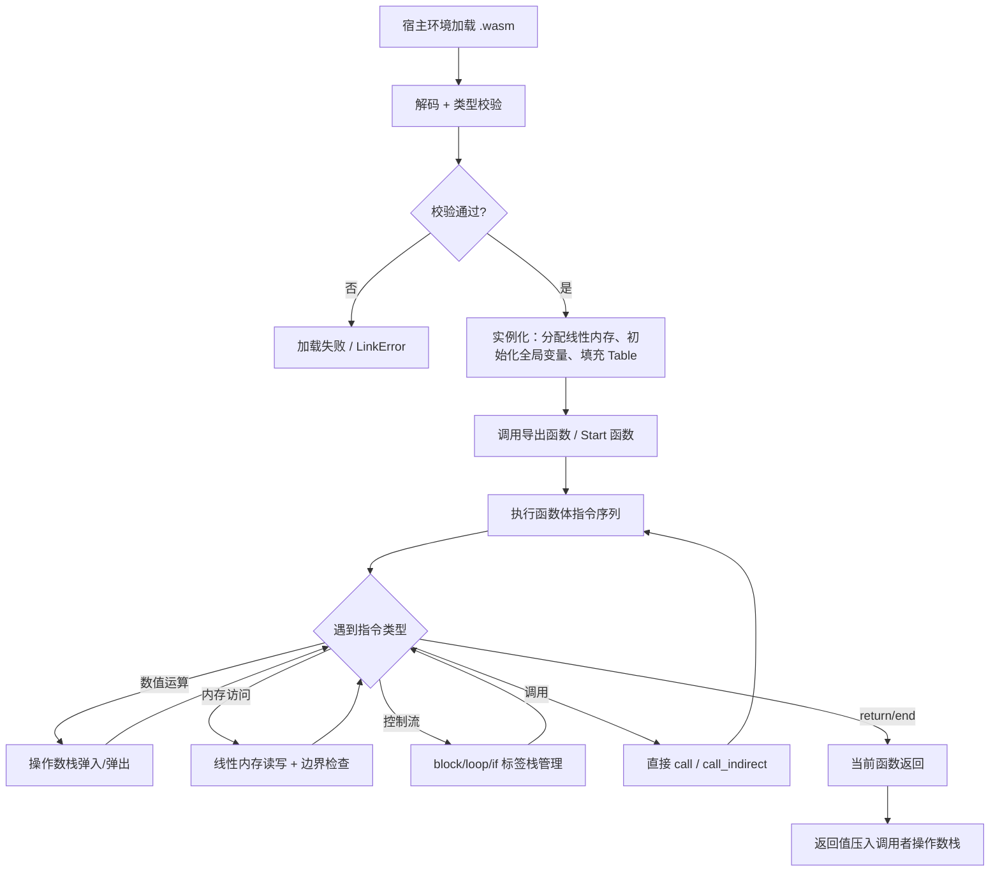
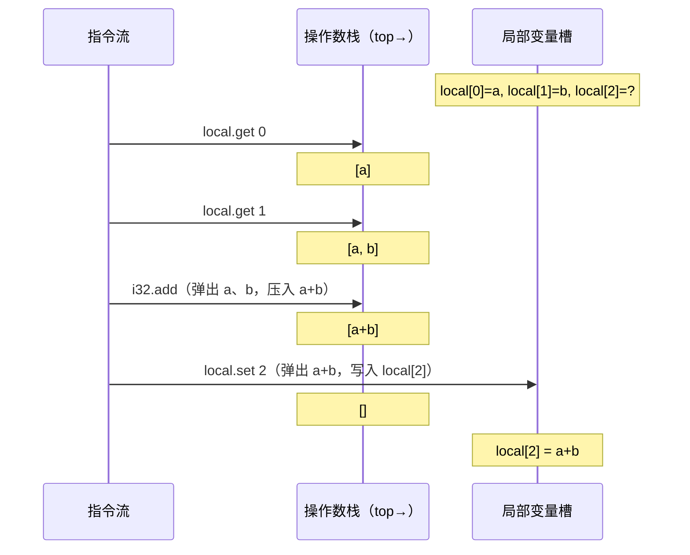
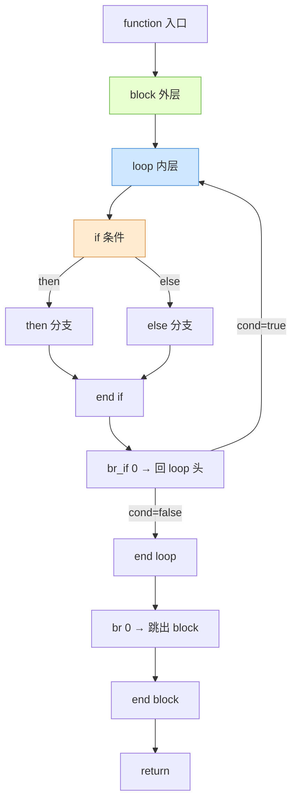

# WASM逆向（02）· WASM指令集与执行模型

## 1. 概述与定位

> [!abstract] TL;DR
> WebAssembly 是一种**栈式虚拟机**指令集：没有通用寄存器文件，所有运算通过操作数栈（Operand Stack）完成。指令按操作数类型划分为控制流、参数操作、内存访问、数值运算四大类，共约两百余条。结构化控制流（`block`/`loop`/`if`+`br`）取代任意 `goto`，`call_indirect` 通过 Table 实现动态调用，`trap` 机制对应不可恢复运行时错误。理解这套执行模型是 WASM 逆向的基础：反编译器的输出、Ghidra/Binary Ninja 的伪代码，本质上都是把这一层翻译回高级语言。

WASM 指令集设计目标有三：**安全沙箱**（线性内存边界检查、类型校验）、**平台无关**（编译到 x86/ARM/RISC-V 时由 JIT/AOT 完成寄存器分配）、**高效解码**（固定单字节 opcode，后跟 LEB128 编码的立即数）。

对于逆向工程师，WASM 的执行模型决定了：

1. 反汇编 `.wasm` 文件时看到的 WAT（WebAssembly Text Format）是什么样的结构；
2. Ghidra/IDA 分析 WASM 时，伪代码中的 `stack[i]` 是从何而来；
3. 虚拟化保护壳（如 Tigress、VMProtect 的 WASM 输出）在指令层面如何混淆。

本章在 [[01.WASM二进制格式与模块结构]] 讲清 Code Section 存放的是函数体之后，进一步拆解函数体内部的指令编码与执行语义。

---

## 2. 原理与机制

### 2.1 栈式虚拟机 vs 寄存器机

x86/ARM 是**寄存器机**：指令明确指定源/目的寄存器（`ADD EAX, EBX`）。WASM 是**栈式虚拟机**：指令隐式操作操作数栈，不存在通用寄存器的概念。

| 维度 | x86（寄存器机）| WASM（栈式机）|
|---|---|---|
| 操作数寻址 | 显式寄存器/内存地址 | 隐式栈顶 |
| `a + b` 的表示 | `MOV EAX, a; ADD EAX, b` | `local.get a; local.get b; i32.add` |
| 中间值存储 | 寄存器（EAX/RCX 等） | 操作数栈 |
| 局部变量 | 栈帧偏移（`[rbp-8]`）或寄存器 | 具名局部变量槽（`local $x i32`）|
| 全局状态 | 段寄存器 / 全局内存 | 全局变量段（Global Section）|
| 控制流 | `JMP`/`JNZ`（任意跳转）| `block`/`loop`/`br`（结构化）|
| 运行时检查 | 一般无（OS/MMU 兜底）| 内存边界检查 + 类型检查 |

#### 执行示例：`c = a + b`

假设 a、b、c 分别是第 0、1、2 号局部变量（`i32` 类型）：

```wat
local.get 0   ;; 读 a，压栈 → stack: [a]
local.get 1   ;; 读 b，压栈 → stack: [a, b]
i32.add       ;; 弹出 a、b，压入 a+b → stack: [a+b]
local.set 2   ;; 弹出 a+b，写入 c → stack: []
```

四条指令，零个显式寄存器引用。这也是为什么 WAT 反汇编看起来"冗长"——每次使用变量都需要显式 `local.get`。

### 2.2 类型系统

WASM MVP 定义四种基本值类型：

| 类型 | 说明 | 大小 |
|---|---|---|
| `i32` | 32 位整数（有/无符号语义由指令决定）| 4 字节 |
| `i64` | 64 位整数 | 8 字节 |
| `f32` | 32 位 IEEE 754 浮点 | 4 字节 |
| `f64` | 64 位 IEEE 754 浮点 | 8 字节 |

WASM 2.0（2022）增加了 `v128`（SIMD）、`funcref`、`externref` 等类型。逆向旧版保护壳时主要接触前四种。

**类型验证**在加载阶段完成（字节码解析时），而非运行时——这是 WASM 与解释型脚本语言的关键区别。

### 2.3 执行流程总览



---

## 3. 指令集详解

### 3.1 控制流指令

控制流指令管理**结构化跳转**与函数调用。WASM 没有任意 goto——所有跳转目标必须是当前嵌套 `block`/`loop`/`if` 的入口或出口，由**标签深度**（label index）引用，`0` 表示最内层，数字越大越外层。

```
opcode  助记符              操作数                说明
──────────────────────────────────────────────────────────────
0x00    unreachable         —                    触发 trap（程序断言违反）
0x01    nop                 —                    空操作（编码后无效果）
0x02    block               blocktype            开始一个 block；br 0 跳到 end
0x03    loop                blocktype            开始 loop；br 0 跳回 loop 头
0x04    if                  blocktype            栈顶 i32 非零则进 then 分支
0x05    else                —                    if 的 else 分支
0x0B    end                 —                    结束 block/loop/if/function
0x0C    br                  label_idx            无条件跳转到指定标签
0x0D    br_if               label_idx            栈顶 i32 非零则跳转，否则继续
0x0E    br_table            vec(label_idx) def   跳转表（按栈顶整数索引）
0x0F    return              —                    函数提前返回（弹出返回值）
0x10    call                func_idx             直接调用函数（静态绑定）
0x11    call_indirect       type_idx table_idx   间接调用（通过 Table 动态绑定）
```

**blocktype** 编码：`0x40` 表示无返回值；单字节负数（LEB128 编码的值类型）表示单个返回类型；`0x00..N` 以上的正整数索引 Type Section 中的函数类型（多值块）。

**br 标签语义**精要：
- 对于 `block`/`if`：`br n` 跳到第 n 层外的 `block` 的 **end** 处（相当于 break）；
- 对于 `loop`：`br n` 当 n=0 时跳回当前 `loop` 的**头部**（相当于 continue）；
- `br_table $l0 $l1 $l2 $default`：弹出栈顶 i32 = k，若 k < 3 则跳 `$lk`，否则跳 `$default`；等价于 C 的 `switch`。

### 3.2 参数指令（局部变量与全局变量）

```
opcode  助记符              操作数       说明
──────────────────────────────────────────────────────────────
0x1A    drop                —           弹出栈顶一个值，丢弃（副作用）
0x1B    select              —           [cond, v2, v1] → 弹出三值；cond≠0 则压 v1，否则压 v2
0x20    local.get           local_idx   读局部变量，压栈
0x21    local.set           local_idx   弹出栈顶，写入局部变量
0x22    local.tee           local_idx   写局部变量，栈顶保留（相当于 set;get）
0x23    global.get          global_idx  读全局变量，压栈
0x24    global.set          global_idx  弹出栈顶，写入全局变量（需 mutable）
```

`local.tee` 在逆向中很常见：它等价于 `$x = expr; use($x);` 连续使用同一个值，不需要额外的 `local.get`。

### 3.3 内存指令

WASM 只有一块**线性内存**（Linear Memory），以字节数组形式存在，按页（page = 64 KiB）管理。所有内存指令携带两个立即数：`align`（对齐提示，用于 JIT 优化，不影响语义）和 `offset`（静态偏移，加到动态地址上）。

有效地址 = `栈顶 i32（动态地址）+ offset（静态立即数）`。若有效地址 + 访问宽度 > `memory.size * 65536`，则触发内存越界 trap。

```
opcode  助记符                   对齐/偏移   说明
──────────────────────────────────────────────────────────────────────
0x28    i32.load   [a][o]                  从线性内存读 4 字节，符号扩展 → i32
0x29    i64.load   [a][o]                  读 8 字节 → i64
0x2A    f32.load   [a][o]                  读 4 字节浮点
0x2B    f64.load   [a][o]                  读 8 字节浮点
0x2C    i32.load8_s  [a][o]               读 1 字节，有符号扩展 → i32
0x2D    i32.load8_u  [a][o]               读 1 字节，零扩展 → i32
0x2E    i32.load16_s [a][o]               读 2 字节，有符号扩展 → i32
0x2F    i32.load16_u [a][o]               读 2 字节，零扩展 → i32
        ... （i64 的 8s/8u/16s/16u/32s/32u 类似）
0x36    i32.store   [a][o]                弹出 [addr, val]，写 4 字节
0x37    i64.store   [a][o]                写 8 字节
0x38    f32.store   [a][o]                写 4 字节浮点
0x39    f64.store   [a][o]                写 8 字节浮点
0x3A    i32.store8  [a][o]               写低 1 字节（截断）
0x3B    i32.store16 [a][o]               写低 2 字节（截断）
        ...
0x3F    memory.size —                    压入当前内存大小（页数，i32）
0x40    memory.grow —                    弹出页数，尝试扩展；返回旧大小（失败返回 -1）
```

逆向注意点：`i32.load8_u` 与 `i32.load8_s` 在 WAT 反汇编中很容易混淆，但符号扩展差异对字符串处理、位运算逻辑影响巨大。

### 3.4 数值指令（以 i32 为主）

数值指令是最密集的一类，i32/i64/f32/f64 各有一套类似指令集。以 i32 为例：

**常量与比较**：
```
opcode  助记符         说明
─────────────────────────────────────────────────────
0x41    i32.const v   将立即数 v（LEB128 有符号）压栈
0x45    i32.eqz       栈顶 == 0 → 1；否则 → 0
0x46    i32.eq        pop(b), pop(a); a == b → 1/0
0x47    i32.ne        a != b
0x48    i32.lt_s      a < b（有符号）
0x49    i32.lt_u      a < b（无符号）
0x4A    i32.gt_s      a > b（有符号）
0x4B    i32.gt_u      a > b（无符号）
0x4C    i32.le_s      a <= b（有符号）
0x4D    i32.le_u      a <= b（无符号）
0x4E    i32.ge_s      a >= b（有符号）
0x4F    i32.ge_u      a >= b（无符号）
```

**算术与位运算**：
```
opcode  助记符         说明
─────────────────────────────────────────────────────
0x67    i32.clz       前导零位数（count leading zeros）
0x68    i32.ctz       后缀零位数（count trailing zeros）
0x69    i32.popcnt    置位位数（popcount）
0x6A    i32.add       加法
0x6B    i32.sub       减法
0x6C    i32.mul       乘法
0x6D    i32.div_s     有符号除法（除以零 → trap）
0x6E    i32.div_u     无符号除法
0x6F    i32.rem_s     有符号取余
0x70    i32.rem_u     无符号取余
0x71    i32.and       按位与
0x72    i32.or        按位或
0x73    i32.xor       按位异或
0x74    i32.shl       左移（shift amount mod 32）
0x75    i32.shr_s     算术右移（符号位填充）
0x76    i32.shr_u     逻辑右移（零填充）
0x77    i32.rotl      循环左移
0x78    i32.rotr      循环右移
```

**类型转换（部分）**：
```
0xA7    i32.wrap_i64      i64 截断为 i32（取低 32 位）
0xAC    i32.trunc_f32_s   f32 截断为有符号 i32（NaN/越界 → trap）
0xAD    i32.trunc_f32_u   f32 截断为无符号 i32
0xBC    i32.reinterpret_f32  按位重解释 f32 为 i32（不修改位模式）
```

`i32.reinterpret_f32` 在密码算法逆向中很重要——它是 C 中 `memcpy(&f, &i, 4)` 的 WASM 表达，常见于浮点常量池的混淆。

---

## 4. 结构化控制流详解与 WAT 示例

### 4.1 if-else 的 WAT 编码

C 代码：`result = (a > b) ? 1 : 0;`（假设 a=local 0，b=local 1，result=local 2）

```wat
;; 完整函数体示例（WAT S 表达式格式）
(func $compare (param $a i32) (param $b i32) (result i32)
  (local $result i32)
  (if
    (i32.gt_s
      (local.get $a)
      (local.get $b)
    )
    (then
      (local.set $result (i32.const 1))
    )
    (else
      (local.set $result (i32.const 0))
    )
  )
  (local.get $result)
)
```

对应的**线性（非 S 表达式）WAT**（更接近实际字节码顺序）：

```wat
local.get 0     ;; push a
local.get 1     ;; push b
i32.gt_s        ;; pop b,a; push (a > b ? 1 : 0)
if              ;; pop cond; cond != 0 进 then
  i32.const 1
  local.set 2   ;; result = 1
else
  i32.const 0
  local.set 2   ;; result = 0
end
local.get 2     ;; push result（函数返回值）
```

### 4.2 while 循环的 loop+br_if 编码

C 代码：
```c
int i = 0;
while (i < n) {
    // body
    i++;
}
```

```wat
;; local 0 = i, local 1 = n
i32.const 0
local.set 0          ;; i = 0

block $break_out     ;; break 目标（br 1 跳到这里）
  loop $loop_head    ;; continue 目标（br 0 跳回这里）

    local.get 0      ;; push i
    local.get 1      ;; push n
    i32.ge_s         ;; i >= n ?
    br_if 1          ;; 若 i >= n，跳出 $break_out（即 break）

    ;; ... loop body ...

    local.get 0
    i32.const 1
    i32.add
    local.set 0      ;; i++

    br 0             ;; 跳回 $loop_head（即 continue）
  end                ;; loop 结束
end                  ;; block 结束
```

这里有一个关键点：`br_if 1` 中的标签深度是 **1**（跳出外层 `block`），而非 0（跳回 loop 头）。逆向时看到 `br_if` 后面跟大于 0 的标签索引，往往对应循环的退出条件。

### 4.3 br_table 与 switch-case

```wat
;; switch (val) { case 0: ...; case 1: ...; case 2: ...; default: ... }
block $default
  block $case2
    block $case1
      block $case0
        local.get $val
        br_table 0 1 2 3   ;; val=0→$case0, val=1→$case1, val=2→$case2, 否则→$default(跳3层)
      end  ;; $case0 落到这里
      ;; case 0 body
      br 3  ;; break（跳出最外层 block）
    end  ;; $case1
    ;; case 1 body
    br 2
  end  ;; $case2
  ;; case 2 body
  br 1
end  ;; $default
;; default body
```

---

## 5. call_indirect 与 Table 机制

### 5.1 原理

`call_indirect` 是 WASM 实现**函数指针**和**C++ 虚函数**的机制。Table（表）是一个可变长度的**函数引用数组**，在 Element Section 初始化。

调用语义：

```
栈顶：[arg_n, ..., arg_1, table_index]
call_indirect [type_idx] [table_idx]
→ 从 table[table_index] 取出函数引用
→ 校验函数签名是否匹配 type_idx 描述的函数类型
→ 类型不匹配 → trap；否则调用
```

### 5.2 WAT 示例

```wat
;; 假设 Table 0 存有函数指针，函数类型 0 = (i32) -> i32
(table 0 funcref)                    ;; 声明 Table
(elem (i32.const 0) $func_a $func_b) ;; 初始化：table[0]=$func_a, table[1]=$func_b

;; 动态调用：通过参数选择调用哪个函数
(func $dispatch (param $idx i32) (param $x i32) (result i32)
  local.get $x       ;; 函数实参
  local.get $idx     ;; table 索引（必须在栈顶）
  call_indirect (type 0) (table 0)
)
```

### 5.3 逆向意义

在 Emscripten 编译的 C++ 代码中，`call_indirect` 大量出现，对应：
- 虚函数调用（vtable 模拟）
- `dynCall_*` 函数族（JS 侧回调 WASM 函数）
- 函数指针数组（如解析器的跳转表）

逆向时看到 `call_indirect`，需要：
1. 找 Element Section，还原 Table 内容；
2. 结合 `type_idx` 确定被调用函数的签名；
3. 追踪 `table_index` 的来源（可能是 vtable 偏移计算）。

---

## 6. Trap 机制与宿主错误处理

### 6.1 Trap 触发场景

Trap 是 WASM 的**不可恢复运行时错误**——类似 CPU 异常，但不可在 WASM 层面捕获（只能由宿主环境处理）：

| 触发条件 | 对应指令/场景 |
|---|---|
| 显式断言违反 | `unreachable` 指令执行 |
| 整数除以零 | `i32.div_s 0`、`i32.rem_s 0`（包含 i64）|
| 整数溢出截断 | `i32.trunc_f32_s`（NaN 或超范围）|
| 内存越界 | `load`/`store` 有效地址超出线性内存大小 |
| Table 越界 | `call_indirect` 时 table_index >= table.size |
| 类型不匹配 | `call_indirect` 签名校验失败 |
| 栈溢出 | 函数调用深度超过实现限制 |

### 6.2 宿主环境处理

```
宿主环境            trap 的表现
─────────────────────────────────────────────────────
浏览器              抛出 WebAssembly.RuntimeError（可被 JS 的 try/catch 捕获）
Node.js             抛出 Error（message 含 "unreachable" / "memory access out of bounds"）
Wasmer/Wasmtime     进程收到 SIGSEGV 或打印错误后 abort
自定义 runtime      取决于 embedder API（一般提供 trap handler callback）
```

逆向中，`unreachable` 指令常被编译器插入作为"永不到达的代码"标记，也被混淆器用来破坏线性反汇编（跳过的代码路径填 `unreachable`）。

---

## 7. 执行模型可视化（Mermaid）

### 7.1 操作数栈执行示例：`c = a + b`



### 7.2 控制流嵌套层次



---

## 8. 工具视角与实战

### 8.1 wasm-objdump 解读指令

```bash
# 安装 wabt（WebAssembly Binary Toolkit）
# Ubuntu: apt install wabt
# macOS: brew install wabt
# Windows: 下载 wabt 预编译包

# 反汇编为线性 WAT
wasm-objdump -d target.wasm | head -100

# 输出示例（函数 $f3，对应 func_idx=3）：
# 000090 func[3] <encrypt>:
#  000091: 20 00             | local.get 0
#  000093: 20 01             | local.get 1
#  000095: 6a                | i32.add
#  000096: 21 02             | local.set 2
```

### 8.2 wat-desugar 与 S 表达式转换

WAT 有两种格式：**线性格式**（更接近字节码顺序，`wasm-objdump -d` 输出）和**S 表达式格式**（嵌套括号，更易阅读）。`wat2wasm`/`wasm2wat` 可互转：

```bash
# 二进制 → WAT（S 表达式格式，便于阅读）
wasm2wat target.wasm -o target.wat

# WAT → 二进制（修改后重新打包）
wat2wasm modified.wat -o modified.wasm
```

### 8.3 Ghidra 中的栈指令映射

Ghidra 的 WASM 插件（GhidraWasm）将操作数栈操作转换为 Pcode/伪代码中的临时变量。在 Ghidra 伪代码中：

```c
// Ghidra 对 local.get 0; local.get 1; i32.add; local.set 2 的表示
local_2 = local_0 + local_1;
```

`call_indirect` 在 Ghidra 中表示为通过函数指针的调用：

```c
// call_indirect type=0, table=0
(*DAT_table0[table_index])(arg1, arg2);
```

### 8.4 逆向时的常见陷阱

1. **br 标签索引的相对性**：标签深度是运行时的嵌套层数，不是字节偏移。`br 0` 在不同位置语义完全不同（block 中 = break，loop 中 = continue）。

2. **有符号/无符号的隐式差异**：WASM 值类型本身不区分有无符号，符号性由指令后缀 `_s`/`_u` 决定。反编译器如果处理不当，会导致比较条件翻转。

3. **offset 立即数的隐蔽性**：`i32.load offset=8` 等价于 `*(i32*)(addr + 8)`，offset 在 WAT 中作为立即数存在，容易在 Ghidra 伪代码中被合并到地址计算里看漏。

4. **`local.tee` 的双重语义**：既写局部变量又保留栈顶，反编译器有时输出两次 `local_x = ...`，或生成不必要的临时变量。

---

## 安全性与正确使用

### 9.1 结构化控制流的安全意义

结构化控制流是 WASM 沙箱安全性的基石之一：

- **无任意跳转**：不能跳到函数中间、不能跳出当前函数、不能修改返回地址——消除了经典 ROP 攻击面；
- **类型验证**：`call_indirect` 的签名检查防止类型混淆调用；
- **内存边界检查**：每条 `load`/`store` 都有越界检查，越界触发 trap 而非未定义行为。

### 9.2 仍然存在的攻击面

| 攻击向量 | 说明 |
|---|---|
| 线性内存内部越界 | WASM 只检查是否超出总内存大小，不检查内存内部的对象边界（类似 C 的堆内越界）|
| 导入函数滥用 | WASM 可导入宿主函数，如果宿主函数不安全，攻击面在宿主侧 |
| 时序侧信道 | WASM JIT 产生的原生代码存在分支预测等微架构侧信道 |
| Spectre/Meltdown | 浏览器需要额外缓解措施（如 SharedArrayBuffer 限制）|
| 逻辑漏洞 | 业务逻辑错误与执行模型无关，WASM 沙箱不提供保护 |

---

## 小结

本章系统梳理了 WASM 栈式虚拟机执行模型的核心要素：

1. **栈式机模型**：无显式寄存器，操作数栈贯穿所有运算，局部变量槽提供命名存储；
2. **四大指令类**：控制流（block/loop/br/call）、参数操作（local/global get/set）、内存访问（load/store + 边界检查）、数值运算（i32/i64/f32/f64 的算术/比较/位运算/转换）；
3. **结构化控制流**：`block`/`loop`/`if` 嵌套 + `br` 标签深度实现循环和分支，`br_table` 实现 switch，无任意 goto；
4. **call_indirect + Table**：WASM 实现函数指针/虚函数的机制，逆向时需还原 Element Section 以确定调用目标；
5. **Trap 机制**：不可恢复运行时错误，由宿主环境捕获，包含越界访问、类型错误、除以零等场景；
6. **逆向注意点**：有符号/无符号差异、br 标签相对性、offset 立即数、`local.tee` 双重语义。

这些知识为后续使用 `wasm2wat`、Ghidra WASM 插件进行自动化反编译打下基础。下一章将实操 WAT 文本格式与 `wasm-objdump`/`wasm-decompile` 等工具链。

---

## 11. 相关阅读

- [[01.WASM二进制格式与模块结构]] — Code Section 存放的正是本章所述的函数体指令序列
- [[03.WASM文本格式WAT与反汇编工具]] — WAT S 表达式格式与 wabt 工具链实操
- [[04.WASM反编译：wasm-decompile与Ghidra插件]] — 反编译器如何将指令序列还原为高级语言伪代码

> [!tip] 延伸阅读
> - WebAssembly 官方规范（Core Spec）第 4 章 Execution：https://webassembly.github.io/spec/core/exec/
> - WABT（WebAssembly Binary Toolkit）工具链源码与文档：https://github.com/WebAssembly/wabt
> - Emscripten 生成的 `dynCall` 机制说明：Emscripten 官方文档 "Interacting with code" 章节

---

⬅️ 上一篇 [[01.WASM二进制格式与模块结构]] ｜ 🏠 [[00.WASM与虚拟化壳逆向总览]] ｜ 下一篇 [[03.WASM文本格式WAT与反汇编工具]] ➡️
