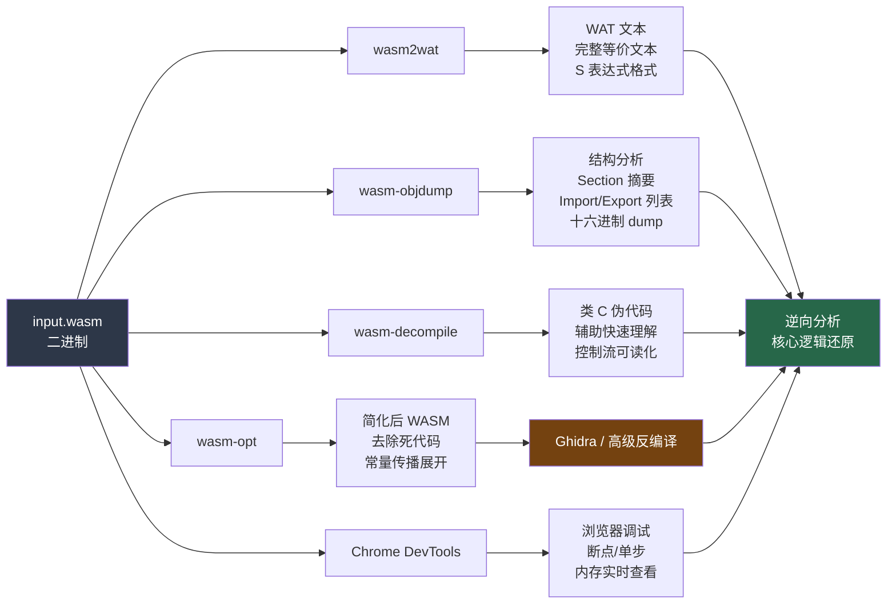

# WASM逆向（03）· WASM文本格式WAT与反汇编工具

> [!abstract] TL;DR
> WAT（WebAssembly Text Format）是 WASM 二进制的 S 表达式人类可读形式，与二进制完全等价。wabt 工具套件提供 `wasm2wat`、`wasm-objdump`、`wasm-decompile` 等核心工具，是 WASM 逆向工程的起点。本章系统介绍 WAT 语法结构、工具集详细用法、wasm-opt 反混淆辅助，以及 Chrome DevTools 浏览器内置调试方案，最终给出六步完整逆向流程。

---

## 一、WAT 文本格式概述

### 1.1 什么是 WAT

WAT（WebAssembly Text Format）是 WebAssembly 二进制格式的**人类可读等价表示**。它与 `.wasm` 二进制文件完全双向转换，本质上是同一套语义的不同编码——二进制面向机器传输与执行，WAT 面向开发者阅读与调试。

WAT 使用 **S 表达式（S-expression）**语法，源自 Lisp 家族语言，特点如下：
- 每个语法单元是一个由括号括起的列表：`(operator operand ...)`
- 嵌套层次对应程序结构（模块 > 函数 > 块 > 指令）
- 支持内联符号名（`$name`），对应二进制中的 name section
- 注释语法：行注释 `;;`，块注释 `(; ... ;)`

WAT 在逆向工程中的作用是：**将不可读的二进制字节序列，转化为可逐行分析的文本指令流**。即使没有源代码和调试符号，也能通过 WAT 理解 WASM 模块的完整逻辑结构。

### 1.2 WAT 与二进制的对应关系

WASM 二进制中的每个 Section 都在 WAT 中有对应的声明：

| WASM Section | WAT 对应语法 | 逆向意义 |
|---|---|---|
| Type Section | `(type ...)` | 函数签名池，理解参数/返回值类型 |
| Import Section | `(import ...)` | 外部依赖，确定运行时环境 |
| Function Section | `(func ...)` 隐含 | 函数数量，快速估算规模 |
| Table Section | `(table ...)` | 间接调用表，分析虚表/函数指针 |
| Memory Section | `(memory ...)` | 线性内存配置 |
| Global Section | `(global ...)` | 全局变量，常存重要状态 |
| Export Section | `(export ...)` | 对外接口，逆向入口点 |
| Start Section | `(start ...)` | 模块初始化函数 |
| Element Section | `(elem ...)` | 表的初始化数据 |
| Code Section | `(func ... 指令)` | 函数体，核心逆向目标 |
| Data Section | `(data ...)` | 内存初始数据，含字符串/常量 |

---

## 二、完整 WAT 模块示例

下面是一个涵盖 WAT 全部主要特性的完整模块示例：

```wat
(module
  ;; 导入：从 env 模块导入 print 函数
  (import "env" "print" (func $print (param i32)))
  
  ;; 内存定义：1页 = 64KB
  (memory (export "memory") 1)
  
  ;; 全局变量：可变 i32
  (global $counter (mut i32) (i32.const 0))
  
  ;; 函数类型签名（可省略，编译器推断）
  (type $add_type (func (param i32 i32) (result i32)))
  
  ;; 函数定义
  (func $add (type $add_type)
    local.get 0
    local.get 1
    i32.add
  )
  
  ;; 另一个函数，使用局部变量
  (func $factorial (param $n i32) (result i32)
    (local $result i32)
    ;; result = 1
    (local.set $result (i32.const 1))
    ;; loop: result *= n; n--
    (block $exit
      (loop $again
        (local.get $n)
        (i32.const 0)
        (i32.le_s)
        (br_if $exit)  ;; if n <= 0, exit
        (local.set $result
          (i32.mul (local.get $result) (local.get $n)))
        (local.set $n
          (i32.sub (local.get $n) (i32.const 1)))
        (br $again)    ;; continue loop
      )
    )
    local.get $result
  )
  
  ;; 导出
  (export "add" (func $add))
  (export "factorial" (func $factorial))
  
  ;; 数据段：初始化线性内存
  (data (i32.const 0) "Hello, WASM!\00")
)
```

### 2.1 关键语法解读

**Import 声明**：`(import "模块名" "符号名" (func $别名 签名))`，逆向时应首先检查所有 Import，了解模块依赖的宿主环境能力（如 JS 侧提供的内存操作、IO 函数）。

**Memory 声明**：`(memory N)` 指定最小页数，1 页 = 64 KB。含保护壳的 WASM 常会申请大量内存页，在这里可观察到异常。

**Global 声明**：`(global $name (mut 类型) 初始值)` 定义全局变量。`mut` 关键字表示可变，省略则为常量。全局变量常被保护壳用于存储解密密钥、状态机状态等关键数据。

**函数体双格式**：WAT 允许两种指令写法——纯栈式（每条指令单独一行）和内联嵌套 S 表达式，两者完全等价。`wasm2wat` 默认输出栈式格式，可读性稍差；手写 WAT 和某些工具偏好嵌套格式。

**块结构与跳转**：`block`、`loop`、`if` 三种结构化控制流，配合 `br`（跳转到块末/头）和 `br_if`（条件跳转）实现所有流程控制。没有任意跳转（jmp），这也是 WASM 安全设计的一部分，使控制流分析相对传统汇编更可靠。

**Data 段**：`(data (i32.const 偏移) "字节内容")` 在模块加载时将数据写入线性内存。字符串、常量数组、加密数据块均从这里初始化——是逆向保护逻辑时最值得关注的区域之一。

---

## 三、wabt 工具套件

wabt（WebAssembly Binary Toolkit）是 WASM 逆向工程的**核心工具集**，由 WebAssembly 官方团队维护（GitHub: WebAssembly/wabt）。

### 3.1 工具速查表

| 工具 | 功能 | 典型用法 |
|------|------|---------|
| `wasm2wat` | 二进制 → WAT 文本（反汇编）| `wasm2wat input.wasm -o output.wat` |
| `wat2wasm` | WAT 文本 → 二进制（汇编）| `wat2wasm input.wat -o output.wasm` |
| `wasm-objdump` | 查看节/反汇编/Section 信息 | `wasm-objdump -x -d input.wasm` |
| `wasm-decompile` | 生成类 C 伪代码 | `wasm-decompile input.wasm -o output.dcmp` |
| `wasm-interp` | WASM 解释器（执行测试）| `wasm-interp input.wasm --run-all-exports` |
| `wasm-validate` | 验证 WASM 格式合法性 | `wasm-validate input.wasm` |
| `wasm-strip` | 去除调试信息 | `wasm-strip -d input.wasm` |

### 3.2 wasm2wat：核心反汇编器

`wasm2wat` 是最直接的反汇编工具，将二进制完全转为 WAT 文本：

```bash
# 基础反汇编
wasm2wat input.wasm -o output.wat

# 保留调试名称信息（如有 name section）
wasm2wat --debug-names input.wasm -o output.wat

# 折叠输出（嵌套 S 表达式，可读性更强）
wasm2wat --fold-exprs input.wasm -o output.wat

# 同时折叠 + 保留名称（推荐逆向时使用）
wasm2wat --fold-exprs --debug-names input.wasm -o output.wat

# 输出到标准输出（配合管道分析）
wasm2wat input.wasm | grep "import\|export"
```

> [!tip] 逆向技巧
> 加 `--fold-exprs` 选项可将平铺的栈式指令合并为嵌套 S 表达式，类似于高级语言语句，大幅提升阅读效率。建议逆向时优先使用折叠格式。

### 3.3 wasm-objdump：结构分析器

`wasm-objdump` 是类 objdump 风格的分析工具，支持多种输出模式，适合快速摸清模块整体结构：

```bash
# 查看 Section 摘要（大小、偏移、函数数量）
wasm-objdump -h input.wasm

# 完整反汇编（WAT 格式指令，含偏移地址）
wasm-objdump -d input.wasm

# 查看所有元数据（Import/Export/Memory/Table/Global 等）
wasm-objdump -x input.wasm

# 显示原始字节（十六进制 dump）
wasm-objdump -s input.wasm

# 仅反汇编指定函数（按函数索引）
wasm-objdump -d --debug-names input.wasm | less

# 组合：完整分析输出到文件
wasm-objdump -x -d -s input.wasm > analysis.txt
```

**`wasm-objdump -h` 典型输出**：

```
input.wasm: file format wasm 0x1

Sections:

     Type start=0x0000000a end=0x0000002b (size=0x00000021) count: 4
   Import start=0x0000002e end=0x00000068 (size=0x0000003a) count: 3
 Function start=0x0000006a end=0x00000070 (size=0x00000006) count: 5
    Table start=0x00000072 end=0x00000077 (size=0x00000005) count: 1
   Memory start=0x00000079 end=0x0000007c (size=0x00000003) count: 1
   Global start=0x0000007e end=0x00000091 (size=0x00000013) count: 2
   Export start=0x00000094 end=0x000000b2 (size=0x0000001e) count: 4
     Code start=0x000000b5 end=0x0000012a (size=0x00000075) count: 5
     Data start=0x0000012d end=0x0000013e (size=0x00000011) count: 1
```

逆向时重点关注：Code Section 大小（判断代码复杂度）、Import count（运行时依赖数量）、Export count（对外接口数量）。

**`wasm-objdump -x` 关键信息**：

```
Section Details:

Type[4]:
 - type[0] (i32) -> i32
 - type[1] (i32, i32) -> i32
 - type[2] () -> nil
 - type[3] (i32) -> nil

Import[3]:
 - func[0] sig=3 <env.print> <- env.print
 - memory[0] pages: initial=1 <- env.memory
 - global[0] i32 mutable=1 <- env.__stack_pointer

Export[4]:
 - func[1] <add> -> "add"
 - func[2] <factorial> -> "factorial"
 - memory[0] -> "memory"
```

Import 列表是逆向的**关键入口**：从中可以看出模块依赖了哪些宿主函数（如 `emscripten_memcpy_big`、`__wasi_fd_write` 等），立即判断运行时环境（Emscripten/WASI/手写胶水代码）。

### 3.4 wasm-decompile：伪代码生成器

`wasm-decompile` 是 wabt 中最接近反编译器的工具，尝试将 WASM 指令序列转换为类 C 语言的伪代码，大幅降低阅读门槛：

```bash
# 生成伪代码
wasm-decompile input.wasm -o output.dcmp

# 同时保留 WAT 注释（推荐）
wasm-decompile --enable-all input.wasm -o output.dcmp
```

**wasm-decompile 输出示例**（对应前文 WAT 模块）：

```c
// wasm-decompile 生成的类 C 伪代码
// 注意：这不是标准 C，只是辅助理解

import "env_print"(a:int) -> void;

export function add(a:int, b:int):int {
  return a + b;
}

export function factorial(n:int):int {
  var result:int = 1;
  loop L {
    if (n <= 0) break;
    result = result * n;
    n = n - 1;
    continue L;
  }
  return result;
}
```

> [!warning] 局限性
> `wasm-decompile` 并非完整反编译器，对于复杂控制流（多层嵌套 block/loop、间接调用、多返回值）的输出质量会显著下降。遇到混淆代码时，应结合 WAT 原始文本一并分析，或使用 Ghidra WASM 插件获取更高质量反编译结果（见第 04 章）。

### 3.5 wasm-validate 与 wasm-strip

```bash
# 验证 WASM 格式合法性（逆向修改后必做）
wasm-validate input.wasm
wasm-validate --enable-all input.wasm  # 启用所有特性扩展

# 去除 name/debug 等自定义 section（缩小体积、对抗 strip 检测）
wasm-strip input.wasm
wasm-strip -d input.wasm  # 仅去除 debug sections

# 移植与验证流程
wat2wasm modified.wat -o modified.wasm && wasm-validate modified.wasm
```

---

## 四、Binaryen wasm-opt

### 4.1 概述

**Binaryen** 是 WebAssembly 的编译器基础设施库，`wasm-opt` 是其主要命令行工具。对于逆向工程而言，`wasm-opt` 有两个互补用途：
1. **模拟混淆**：了解保护者如何通过优化 Pass 使代码复杂化
2. **辅助反混淆**：用特定 Pass 简化目标 WASM，再交给反编译器处理

### 4.2 常用命令

```bash
# 基础优化（O3 级别，多轮内联/常量折叠/死代码消除）
wasm-opt -O3 input.wasm -o output.wasm

# 极限优化（O4，可能改变语义，慎用）
wasm-opt -O4 input.wasm -o output.wasm

# 混淆相关 Pass（理解保护者视角）
wasm-opt --generate-global-effects --optimize-instructions input.wasm -o output.wasm

# 反混淆辅助：应用简化 Pass，降低代码复杂度
wasm-opt --simplify-locals --reorder-locals --vacuum input.wasm -o simplified.wasm

# 更激进的简化（局部变量合并 + 常量传播）
wasm-opt --simplify-locals-nonesting --propagate-globals-globally \
         --const-hoisting --vacuum input.wasm -o simplified.wasm

# 去除不可达代码（清理 dead code，突显核心逻辑）
wasm-opt --remove-unused-names --remove-unused-module-elements \
         --dce input.wasm -o cleaned.wasm

# 查看所有可用 Pass
wasm-opt --help | grep "^\s*--"
```

### 4.3 反混淆工作流

针对虚拟化保护或混淆过的 WASM，建议的 wasm-opt 辅助流程：

1. 先用 `--vacuum --dce` 去除死代码，减少干扰
2. 再用 `--simplify-locals --reorder-locals` 清理局部变量混乱命名
3. 用 `--const-hoisting --propagate-globals-globally` 传播常量，可能展开混淆用的常量跳转表
4. 最后将处理后的文件交给 `wasm-decompile` 或 Ghidra，对比两次反编译结果

> [!tip] 注意
> 部分高度混淆的 WASM（如 Themida WASM 壳）会刻意构造违反 wasm-opt 假设的代码模式，导致某些 Pass 崩溃或产生错误输出。遇到此情况时，逐步添加 Pass、每步验证输出的有效性。

---

## 五、浏览器内置工具

### 5.1 Chrome DevTools WASM 调试

Chrome/Edge 的 DevTools 内置 WASM 反汇编与调试支持，是快速分析浏览器端 WASM 的便捷入口，无需安装额外工具：

**操作步骤**：

1. 打开目标页面，按 `F12` 打开 DevTools → **Sources** 面板
2. 在 Sources 树左侧文件列表中找到 `.wasm` 文件（DevTools 自动将其反汇编为 WAT 格式显示）
3. 点击行号设置断点——支持在 WAT 指令级别断点
4. 触发 WASM 执行后，在右侧面板查看：
   - **Call Stack**：完整调用栈，含 JS 到 WASM 的跨境调用
   - **Local**：当前函数的局部变量值
   - **Stack**：WASM 操作数栈当前内容
   - **Global**：全局变量当前值
5. 使用 **Step Over / Step Into / Step Out** 单步调试

**Source Maps 支持**：若 WASM 由 Emscripten 编译并携带 `-g` 标志生成 DWARF 信息，DevTools 可显示原始 C/C++ 源码级调试视图（需开启 DevTools 实验性 DWARF 支持）。

### 5.2 Memory 面板分析线性内存

**步骤**：

1. DevTools → **Memory** 面板
2. 选择 **Heap snapshot** 或直接在 Console 执行 `WebAssembly.Memory` 相关代码
3. 在 Console 中访问：`Module.HEAPU8` / `Module.HEAPU32`（Emscripten 胶水层暴露的视图）
4. 或通过 `WebAssembly.Instance.exports.memory.buffer` 获取 `ArrayBuffer`，再构造 `DataView` 手动检视内存内容

**定位字符串**：

```javascript
// 在 DevTools Console 执行，扫描线性内存中的 ASCII 字符串
const mem = instance.exports.memory.buffer;
const view = new Uint8Array(mem);
let str = '';
for (let i = 0; i < view.length; i++) {
  if (view[i] >= 0x20 && view[i] < 0x7f) str += String.fromCharCode(view[i]);
  else if (str.length > 4) { console.log(i - str.length, str); str = ''; }
  else str = '';
}
```

### 5.3 网络拦截与动态注入

在 DevTools **Network** 面板中可拦截 `.wasm` 文件下载，配合 Service Worker 或 Overrides（DevTools → Sources → Overrides）替换为修改版 WASM，实现动态插桩分析。

---

## 六、Mermaid：wabt 工具流程



---

## 七、完整逆向流程（六步）

### 7.1 标准分析流程

针对一个未知 WASM 文件，推荐按以下顺序展开分析，从宏观到微观逐步深入：

**第一步：摸清整体结构**

```bash
wasm-objdump -h input.wasm
```

获取各 Section 的大小、偏移和计数。重点观察：
- Code Section 大小 → 代码复杂度估算
- Type/Function count → 函数规模
- Custom Section → 是否有 name/debug 调试信息

**第二步：确定对外接口**

```bash
wasm-objdump -x input.wasm | grep -A 50 "Export\|Import"
```

Import 揭示模块依赖的宿主环境（WASI/Emscripten/手写 JS）；Export 是逆向**入口点清单**——从已知的导出函数名开始追踪是最高效的路径。

**第三步：获取完整 WAT 源码**

```bash
wasm2wat --fold-exprs --debug-names input.wasm -o input.wat
```

生成可搜索、可编辑的 WAT 文本。此时可用编辑器的全文搜索定位关键指令序列（如 `call $verify`、`i32.load` 等）。

**第四步：生成伪 C 代码辅助理解**

```bash
wasm-decompile input.wasm -o input.dcmp
```

对导出函数附近的逻辑用伪代码快速理解高层语义，无需逐条阅读 WAT 指令。

**第五步：导入 Ghidra 深度反编译**

见第 04 章详细介绍。Ghidra WASM 插件提供比 `wasm-decompile` 更高质量的 C 伪代码，支持交叉引用、函数重命名、数据结构标注等完整逆向工程特性。

```bash
# 先用 wasm-opt 预处理，提升反编译质量
wasm-opt --simplify-locals --vacuum --dce input.wasm -o input_simplified.wasm
# 再将 input_simplified.wasm 导入 Ghidra
```

**第六步：根据导出函数名定位关键逻辑**

```bash
# 列出所有导出函数
wasm-objdump -x input.wasm | grep "Export" -A 100 | grep "func"

# 在 WAT 中定位函数定义
grep -n "\$verify\|\$check\|\$decrypt\|\$license" input.wat

# 追踪调用链
grep -n "call \$verify" input.wat
```

从具有语义的导出名称出发（`verify`、`check_license`、`decrypt` 等），在 WAT 中快速定位并向上/下追踪调用链，聚焦核心保护逻辑。

### 7.2 发现保护壳的特征信号

在按上述流程分析时，以下特征提示存在虚拟化保护或混淆：

- Code Section 异常庞大（相对模块功能规模），且导出函数极少
- 大量使用 `call_indirect`（间接调用），配合 Table Section 中的密集函数表
- `wasm-decompile` 输出包含大量无意义局部变量名、复杂多层 block 嵌套
- Data Section 存在大段疑似加密的随机字节数据
- Import 中存在 `memory.copy`/`memory.fill` 等内存操作原语，但导出函数逻辑看似简单

这些信号在第 05 章（虚拟机保护器识别）中会进一步详细分析。

---

## 安全性与正确使用

> [!tip] 合规使用说明
> 本章介绍的 wabt 工具链及 WAT 文本格式分析技术用于：
> - **合法逆向研究**：自有软件分析、CTF 竞赛题目、安全审计
> - **开发辅助**：验证 WASM 编译输出的正确性、调试 WASM 模块
>
> 不应将这些技术用于未经授权的第三方软件逆向或商业软件 DRM 绕过。

### 常见安全注意事项

- **工具版本**：使用最新版 wabt 避免已知漏洞
- **不信任输入**：分析来自不可信来源的 WASM 文件时，在沙箱环境中执行
- **数据保护**：反编译含敏感数据的 WASM 时注意信息泄露风险

## 小结

本章覆盖了 WASM 文本格式 WAT 的完整语法（模块/函数/导入/导出/内存/数据段），掌握了 wabt 工具套件（`wasm2wat`/`wat2wasm`/`wasm-objdump`/`wasm-decompile`/`wasm-interp`），以及 Binaryen `wasm-opt` 的优化与反混淆用法。标准6步逆向流程（从 `-h` 看摘要到 Ghidra 深度分析）为后续实战提供了方法论。

---

## 延伸阅读

- 参见 [[01.WASM二进制格式与模块结构]] 了解各 Section 在二进制层面的编码细节
- 参见 [[04.WASM反编译：wasm-decompile与Ghidra插件]] 学习更高质量的反编译方案

---

⬅️ 上一篇 [[02.WASM指令集与执行模型]] ｜ 🏠 [[00.WASM与虚拟化壳逆向总览]] ｜ 下一篇 [[04.WASM反编译：wasm-decompile与Ghidra插件]] ➡️
