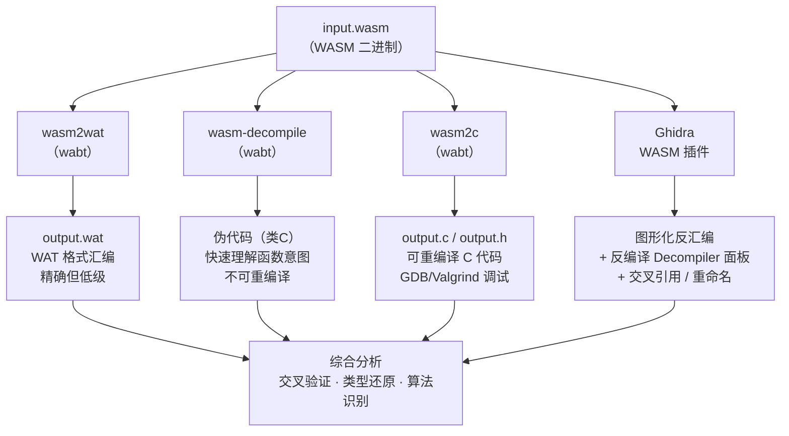

# WASM逆向（04）· WASM反编译：wasm-decompile与Ghidra插件

> [!abstract] TL;DR
> WASM 反编译是将二进制字节码提升到人类可读伪代码的过程，主要工具链分四条路径：`wasm2wat` 精确还原 WAT 汇编、`wasm-decompile` 快速生成类 C 伪代码（不可重编译）、`wasm2c` 生成真正可重编译的 C 代码（配合 GDB/Valgrind 调试）、Ghidra WASM 插件提供图形化深度逆向。四种方式各有适用场景，实际工作中通常交叉使用。类型信息恢复是 WASM 逆向的核心难点，可综合利用 Type Section、内存访问指令、DWARF Custom Section 四种策略辅助还原。

---

## 概述与定位

本章在 [[03.WASM文本格式WAT与反汇编工具]] 讲清 wabt 基础工具之后，系统介绍将 WASM 字节码提升为高级语言伪代码的四条路径：`wasm2wat`（精确 WAT 汇编）、`wasm-decompile`（快速类C伪代码）、`wasm2c`（可重编译C代码）以及 Ghidra WASM 插件（交互式深度逆向）。本章的核心难点在于类型信息恢复——WASM 仅保留 i32/i64/f32/f64 四种值类型，结构体、类、枚举等高级类型均已消失，需借助多种策略辅助还原。

---

## 一、从字节码到伪代码：反编译的挑战

WASM 的设计目标是高效执行而非人类可读，编译器在将 C/C++/Rust 源码编译到 WASM 时，会丢弃大量调试信息：

- **变量名**在编译时被抹去，剩下 `local.get 0`、`local.set 1` 等匿名索引
- **类型系统**仅剩 i32/i64/f32/f64 四种值类型，结构体/类/枚举全部消失
- **控制流**被编码为结构化块（`block`/`loop`/`if`），复杂函数经过多轮优化后尤为晦涩
- **符号信息**默认不随二进制输出（Custom Section `name` 需要编译时显式保留）

面对这些限制，反编译工具各走不同的提升路径。本章详细拆解四条路径的原理、输出形态与局限，并介绍如何用 Ghidra 进行交互式深度分析。



---

## 二、wasm-decompile：快速获取伪代码

### 2.1 工具定位与使用

`wasm-decompile` 是 wabt（WebAssembly Binary Toolkit）的子工具，将 WASM 二进制直接输出类 C 风格的伪代码表示。

```bash
# 基本用法
wasm-decompile input.wasm -o output.dcmp

# 同时输出 WAT 格式对照
wasm-decompile input.wasm --wat -o output.dcmp

# 查看帮助
wasm-decompile --help
```

对于一个简单的阶乘函数，`wasm-decompile` 的输出可能如下：

```
// wasm-decompile 伪代码（非合法 C，仅辅助阅读）
export function factorial(a:int):int {
  var b:int = 1;
  loop L_a {
    if (a <= 0) break L_a;
    b = b * a;
    a = a + -1;
    continue L_a;
  }
  return b;
}
```

输出的语法借用了 C 的表达式形式，但包含 WASM 特有的 `loop`/`break`/`continue` 标签语义，是二者的混合体。

### 2.2 wasm-decompile 的核心局限

理解局限对于避免误判至关重要：

**（1）变量名全部丢失**
编译器在优化阶段就会消除局部变量名。`wasm-decompile` 按出现顺序命名：参数为 `a`/`b`/`c`，局部变量为 `d`/`e`/`f` 或 `var_0`/`var_1`。阅读含十几个局部变量的函数时，跟踪变量含义需要手动标注。

**（2）类型信息严重缺失**
WASM 只有四种值类型（i32/i64/f32/f64），所有整数一律显示为 `int`，无论原始代码是 `uint8_t`、`size_t` 还是指针。区分指针与整数、有符号与无符号，需要依赖上下文推断。

**（3）不处理 Emscripten 运行时约定**
Emscripten 编译的 WASM 包含大量运行时辅助函数（`__wasm_call_ctors`、`dynCall_*`、`emscripten_stack_*`），`wasm-decompile` 将其与业务代码等同对待，不做任何区分，导致输出混乱。

**（4）复杂控制流可能不准确**
WASM 的结构化控制流在经过编译器优化（尤其是循环变换、条件合并）后，还原时可能出现嵌套层次错位或条件逻辑反转。对关键算法务必与 WAT 汇编对照验证。

**（5）输出不是合法 C 代码**
这一点是最常见的误解。`wasm-decompile` 的输出**不能直接送入 C 编译器**。它只是辅助阅读的可视化表示，如果需要可重编译的 C 代码，必须使用 `wasm2c`。

---

## 三、wasm2c：生成可重编译的 C 代码

### 3.1 wasm2c 的定位

`wasm2c` 也是 wabt 的子工具，但目标与 `wasm-decompile` 完全不同——它生成**严格等价、可被 C 编译器重新编译**的 C 代码。输出精度远高于伪代码，代价是冗长且含有大量运行时 shim。

```bash
# 基本转换
wasm2c input.wasm -o output.c
# 同时生成 output.c 和 output.h

# 配合 wabt 自带的 wasm runtime 编译
gcc output.c /path/to/wabt/wasm2c/wasm-rt-impl.c \
    -I /path/to/wabt/wasm2c \
    -o analysis_binary \
    -lm

# 加 ASAN/调试符号
gcc -g -fsanitize=address output.c wasm-rt-impl.c \
    -I /path/to/wabt/wasm2c \
    -o analysis_asan -lm
```

生成的文件结构：
- `output.c`：所有函数实现、线性内存初始化、Table 初始化
- `output.h`：类型定义、函数声明、内存/Table 外部声明
- 需要链接：`wasm-rt-impl.c`（提供内存边界检查、trap 处理等运行时支持）

### 3.2 wasm2c 输出示例：factorial 完整解析

以下是 `wasm2c` 对 factorial 函数的完整输出，并附详细注释：

```c
// ============================================================
// wasm2c 生成的 C 代码（可重新编译，精确等价于原 WASM 语义）
// ============================================================
#include "output.h"
#include "wasm-rt.h"

// ── 线性内存 ──────────────────────────────────────────────
// WASM 的线性内存映射为 C 的 wasm_rt_memory_t 结构
// 实际数据在 w2c_memory.data 指针指向的堆内存中
wasm_rt_memory_t w2c_memory;

// ── Table（间接调用函数指针表）──────────────────────────
// WASM call_indirect 指令通过 Table 实现虚拟分派
// 等价于 C 的函数指针数组
wasm_rt_funcref_table_t w2c_table;

// ── 函数实现：factorial(n) -> result ────────────────────
// 原型由 Type Section 决定：(func (param i32) (result i32))
// p0 = 参数 n（i32）
u32 w2c_factorial(u32 p0) {
  // 局部变量声明（对应 WASM locals）
  // l0 = result 累乘器，初始值来自 WASM local.set
  u32 l0 = 0;

  // l0 = 1：result 初始化为 1
  l0 = 1;

  // L0: 对应 WASM 的 loop 块
  // goto 是 WASM 结构化控制流转换为 C 的标准方式
  L0: {
    // WASM br_if 指令：条件跳出循环
    // s32 转型：将 u32 解释为有符号整数比较（i32.le_s）
    if ((s32)p0 <= 0) goto B0;

    // result *= n  （i32.mul）
    l0 = l0 * p0;

    // n--  （i32.sub）
    p0 = p0 - 1;

    // 回到循环顶部  （br 到 loop 标签）
    goto L0;
  }
  // B0: 对应 WASM block 的出口标签（break destination）
  B0:;

  // return result  （return）
  return l0;
}
```

### 3.3 wasm2c 的逆向用途

**本机 GDB 调试**：将生成的 `analysis_binary` 加载到 GDB，可以在 C 代码层面单步、设断点、查看内存，完全绕开 WASM 运行时的调试限制：

```bash
gdb ./analysis_binary
(gdb) break w2c_factorial
(gdb) run
(gdb) print p0    # 查看参数
(gdb) print l0    # 查看局部变量
```

**Valgrind 内存分析**：检测 WASM 线性内存的越界访问（在 wasm-rt 边界检查被绕过时尤为有用）：

```bash
valgrind --leak-check=full ./analysis_asan
```

**clang 静态分析**：利用 Clang Static Analyzer 扫描逻辑漏洞：

```bash
scan-build gcc output.c wasm-rt-impl.c -I /path/to/wabt/wasm2c -lm
```

**插桩（Instrumentation）**：在 `output.c` 关键函数前后插入日志，追踪执行路径和参数：

```c
// 在 output.c 中插入 hook
u32 w2c_factorial(u32 p0) {
    fprintf(stderr, "[HOOK] factorial called with n=%u\n", p0);
    // ... 原始代码 ...
}
```

---

## 四、Ghidra WASM 插件：深度图形化逆向

### 4.1 插件安装

Ghidra 的 WASM 支持通过插件形式提供，有两条获取路径：

**路径 A：使用社区插件（功能最完整）**
```
GitHub: nneonneo/ghidra-wasm-plugin
下载：Releases 页面的 ghidra_X.X_PUBLIC_XXXXXX_ghidra_wasm.zip
```

**路径 B：Ghidra 内置 WASM 支持（Ghidra 10.1+）**
Ghidra 从 10.1 版本开始内置基础 WASM 支持，无需额外安装，但功能弱于社区插件。

**安装步骤（以社区插件为例）**：
1. 打开 Ghidra → 菜单 `File` → `Install Extensions...`
2. 点击右上角绿色「+」按钮
3. 选择下载的 `.zip` 文件（**不要解压**，直接选 zip）
4. 勾选插件复选框 → 点击 `OK`
5. **必须重启 Ghidra** 才能激活插件

重启后验证安装：`File` → `Import File` 时，如果 WASM 文件被自动识别为 `WebAssembly Binary Module`，则安装成功。

### 4.2 导入与分析 WASM 文件

**导入流程**：
1. Ghidra 主界面 → `New Project`（或打开已有项目）
2. `File` → `Import File...`，选择 `.wasm` 文件
3. 格式检测：Ghidra 应自动识别为 `WebAssembly Binary Module`；若未识别，手动在下拉菜单中选择
4. 点击 `OK`，查看摘要（段数、函数数、导入/导出符号数）
5. 双击导入的文件打开 CodeBrowser

**自动分析配置**：
1. CodeBrowser 打开时会提示是否自动分析 → 选 `Yes`
2. 在分析选项中，**确保勾选**以下分析器：
   - `WASM Analyzer`：解析所有 Section
   - `Decompiler Parameter ID`：辅助推导函数参数类型
   - `Non-Returning Functions`：识别不返回的函数（`abort`/`unreachable`）
3. 点击 `Analyze`，等待完成（大文件可能需要数分钟）

### 4.3 Ghidra WASM 分析能力详解

**Section 视图**：在 `Window` → `Memory Map` 中可看到所有 WASM Section 作为独立内存区域：
- `.type`：函数类型签名表
- `.import`：导入的函数/内存/Table
- `.function`：函数到类型的映射
- `.export`：导出名到索引的映射
- `.code`：函数体字节码
- `.data`：线性内存数据段初始值

**函数列表与命名**：
- 无导出名的函数：按索引命名为 `wasm_func_0000`、`wasm_func_0001`
- 有导出名的函数：直接使用导出名（`main`、`encrypt`、`malloc`）
- 导入函数：显示为 `import::env::函数名`

**反汇编视图**：Listing 面板显示 WAT 格式的逐指令反汇编，包含操作码、立即数、注释（如跳转目标标签）。

**Decompiler 面板**：Ghidra 的通用反编译引擎（基于 P-Code 中间语言）将 WASM 字节码提升到伪 C，效果通常优于 `wasm-decompile`，因为它利用了数据流分析和类型传播。相关原理见 `[[45.反编译器与反汇编引擎原理/08.Ghidra反编译器与P-Code分析]]`。

**交叉引用**：右键函数 → `References` → `Find References to`，可找出所有调用该函数的位置。对于 `call_indirect` 间接调用，Ghidra 会尝试分析 Table 并解析目标。

### 4.4 Ghidra Script：批量重命名函数

WASM 逆向中一个高频操作是将 Export Section 中的导出名批量应用到函数上（有时插件不会自动完成），或者根据自定义规则重命名。以下 GhidraScript 演示基础框架：

```java
// GhidraScript：遍历函数并根据导出名重命名
// 保存为 RenameWasmFunctions.java，放入 Ghidra 脚本目录
// Script → Manage Scripts → 添加目录 → 运行

import ghidra.app.script.GhidraScript;
import ghidra.program.model.symbol.*;
import ghidra.program.model.listing.*;
import ghidra.program.model.address.*;

public class RenameWasmFunctions extends GhidraScript {

    @Override
    public void run() throws Exception {
        println("=== WASM Function Renamer ===");

        // 获取符号表和函数管理器
        SymbolTable symTable = currentProgram.getSymbolTable();
        FunctionManager funcMgr = currentProgram.getFunctionManager();

        // 遍历所有函数
        FunctionIterator funcs = funcMgr.getFunctions(true);
        int renamed = 0;
        int skipped = 0;

        while (funcs.hasNext()) {
            Function f = funcs.next();
            String currentName = f.getName();

            // 只处理自动命名的 wasm_func_XXXX 形式
            if (!currentName.startsWith("wasm_func_")) {
                skipped++;
                continue;
            }

            // 查找该地址是否有 Export 符号
            Address entry = f.getEntryPoint();
            SymbolIterator syms = symTable.getSymbolsAsIterator(entry);
            String exportName = null;

            while (syms.hasNext()) {
                Symbol sym = syms.next();
                // Export 符号通常有 ExternalEntryPoint 标记
                if (sym.isExternalEntryPoint() && !sym.getName().startsWith("wasm_func_")) {
                    exportName = sym.getName();
                    break;
                }
            }

            if (exportName != null) {
                // 重命名函数
                f.setName(exportName, SourceType.USER_DEFINED);
                println("Renamed: " + currentName + " -> " + exportName
                        + " @ " + entry);
                renamed++;
            }
        }

        println("Done. Renamed: " + renamed + ", Skipped: " + skipped);
    }
}
```

运行步骤：
1. `Window` → `Script Manager`
2. 点击「新建脚本」按钮，选择 Java 类型
3. 粘贴上述代码，保存为 `RenameWasmFunctions.java`
4. 在脚本列表中找到该脚本，点击「运行」（三角形按钮）
5. 在 Ghidra Console 查看输出日志

---

## 五、类型信息恢复：四种策略

WASM 只有 i32/i64/f32/f64 四种基本值类型，高层语义的类型信息必须通过逆向推断恢复。

### 策略一：利用 Type Section（最可靠）

Type Section 存储所有函数的签名，这是编译器无法消除的信息——WASM 运行时需要它来做类型检查。用 `wasm-objdump` 读取：

```bash
wasm-objdump -s --section=type input.wasm
```

输出示例：
```
Type[5]:
 - type[0] (i32) -> i32          # 接受/返回 i32
 - type[1] (i32, i32) -> i32     # 接受两个 i32，返回 i32
 - type[2] (i32, i32, i32) -> i32
 - type[3] () -> void            # 无参数，无返回
 - type[4] (f64) -> f64          # 浮点运算函数
```

函数签名中出现 f64 可立即排除该参数是指针的可能性；出现多个 i32 参数时，结合调用位置可推断哪些是指针、哪些是值。

### 策略二：内存访问指令推断

WASM 内存访问指令（load/store 族）携带精确的宽度和符号扩展信息，可用来还原原始类型：

| WASM 指令 | 等价 C 类型 | 说明 |
|-----------|------------|------|
| `i32.load8_s` | `int8_t` / `char` | 8位有符号加载 |
| `i32.load8_u` | `uint8_t` / `unsigned char` | 8位无符号加载 |
| `i32.load16_s` | `int16_t` / `short` | 16位有符号加载 |
| `i32.load16_u` | `uint16_t` / `unsigned short` | 16位无符号加载 |
| `i32.load` | `int32_t` / `int` / `float*` | 32位加载 |
| `i64.load` | `int64_t` / `long long` | 64位加载 |
| `f32.load` | `float` | 单精度浮点 |
| `f64.load` | `double` | 双精度浮点 |

在 Ghidra 的 Listing 面板中，找到对某内存地址（线性内存偏移）的访问指令，记录所有 load 类型，即可推断结构体字段的类型布局。

### 策略三：Emscripten 命名约定

Emscripten 编译的 WASM 保留了一套可解码的函数名约定（即使经过优化，辅助函数名通常不变）：

- `dynCall_v`：调用签名 `() -> void`（v = void）
- `dynCall_i`：调用签名 `() -> i32`
- `dynCall_ii`：调用签名 `(i32) -> i32`（两个 i，第一个是参数，第二个是返回）
- `dynCall_iiii`：调用签名 `(i32, i32, i32) -> i32`
- `dynCall_vii`：调用签名 `(i32, i32) -> void`
- `__wasm_call_ctors`：模块构造函数（类似 `.init_array`）
- `emscripten_stack_init`：Emscripten 栈初始化

识别这些函数后可以直接跳过或作为运行时基础设施处理，聚焦业务逻辑。

### 策略四：DWARF 调试信息（name Section / .debug_*）

如果目标 WASM 是用 `-g` 或 `-gsource-map` 编译的，Custom Section 中会保留调试信息：

**`name` Section（最常见）**：记录函数名、局部变量名，存储格式为 LEB128 编码的映射表。以下 Python 脚本提取函数名映射：

```python
# 解析 WASM name section（Custom Section id=0, name="name"）
import struct

def read_uleb128(data: bytes, offset: int):
    """读取 LEB128 无符号整数，返回 (value, bytes_consumed)"""
    result = 0
    shift = 0
    n = 0
    while True:
        byte = data[offset + n]
        n += 1
        result |= (byte & 0x7F) << shift
        shift += 7
        if (byte & 0x80) == 0:
            break
    return result, n

def parse_name_section(data: bytes) -> dict:
    """
    解析 name section，返回 {func_index: name_str} 映射。
    data 是 name section 的 payload（去掉 section id 和长度字段后的内容）。
    """
    names = {}
    i = 0
    while i < len(data):
        if i >= len(data):
            break
        subsec_id = data[i]
        i += 1
        subsec_len, n = read_uleb128(data, i)
        i += n
        subsec_end = i + subsec_len

        if subsec_id == 1:          # Subsection 1 = Function Names
            count, n = read_uleb128(data, i)
            i += n
            for _ in range(count):
                func_idx, n = read_uleb128(data, i)
                i += n
                name_len, n = read_uleb128(data, i)
                i += n
                name = data[i:i + name_len].decode('utf-8', errors='replace')
                i += name_len
                names[func_idx] = name
        elif subsec_id == 2:        # Subsection 2 = Local Names
            # 可扩展：解析局部变量名映射
            i = subsec_end          # 跳过本子节
        else:
            i = subsec_end          # 跳过未知子节

    return names


def extract_names_from_wasm(wasm_path: str) -> dict:
    """从 WASM 文件提取 name section 的函数名映射"""
    with open(wasm_path, 'rb') as f:
        data = f.read()

    # 验证 WASM magic + version
    assert data[:4] == b'\x00asm', "Not a WASM file"
    assert data[4:8] == b'\x01\x00\x00\x00', "Unsupported WASM version"

    offset = 8
    while offset < len(data):
        sec_id = data[offset]
        offset += 1
        sec_len, n = read_uleb128(data, offset)
        offset += n
        sec_payload = data[offset:offset + sec_len]

        if sec_id == 0:             # Custom Section
            # Custom Section 开头是名称字符串
            name_len, n = read_uleb128(sec_payload, 0)
            sec_name = sec_payload[n:n + name_len].decode('utf-8', errors='replace')
            if sec_name == 'name':
                # 解析 name section payload（跳过名称字段）
                payload = sec_payload[n + name_len:]
                return parse_name_section(payload)

        offset += sec_len

    return {}   # 未找到 name section


# 使用示例
if __name__ == '__main__':
    import sys
    if len(sys.argv) < 2:
        print("Usage: python parse_names.py input.wasm")
        sys.exit(1)

    func_names = extract_names_from_wasm(sys.argv[1])
    if func_names:
        print(f"Found {len(func_names)} function names:")
        for idx, name in sorted(func_names.items()):
            print(f"  func[{idx:4d}] = {name}")
    else:
        print("No name section found (stripped binary)")
```

**`.debug_info` / `.debug_str`（DWARF）**：如果编译时传入 `-g`，Emscripten 会生成完整的 DWARF Custom Sections。可用 `dwarfdump` 或 `llvm-dwarfdump` 解析：

```bash
# 检查是否含 DWARF
wasm-objdump -h input.wasm | grep debug

# 用 llvm-dwarfdump 解析
llvm-dwarfdump --all input.wasm 2>/dev/null | head -100
```

找到 DWARF 信息意味着可以还原到接近源码级别的类型名和变量名，大幅降低逆向难度。

---

## 六、四条路径横向对比

| 工具 | 输出形式 | 适用场景 | 优势 | 核心局限 |
|------|----------|----------|------|----------|
| `wasm2wat` | WAT 格式汇编 | 快速查看字节码结构 | 精确还原，字节完全对应 | 可读性差，变量名为索引 |
| `wasm-decompile` | 类 C 伪代码 | 快速理解函数意图 | 输出直观，上手快 | 不可重编译，类型不准，复杂控制流可能出错 |
| `wasm2c` | 可编译 C 代码 | 本机调试、插桩、静态分析 | 可 GDB 单步，可 Valgrind，可插桩 | 代码冗长（goto 满篇），需链接 wasm-rt 运行时 |
| Ghidra WASM 插件 | 图形化反汇编 + 伪 C | 深度逆向，交叉引用分析 | 反编译质量高，支持重命名/注释，交叉引用完整 | 需安装配置，大文件分析较慢 |

**推荐工作流**：
1. 用 `wasm2wat` 或 `wasm-decompile` 快速浏览，确定目标函数范围
2. 对关键函数用 Ghidra 做深度分析（反编译 + 交叉引用）
3. 对需要动态验证的逻辑用 `wasm2c` 生成可执行版本，GDB 单步确认
4. 利用 name Section 脚本或 DWARF 信息补充符号，缩短分析周期

---

## 七、实战注意事项

**混淆 WASM 的反编译**：经过 wasm-opt 高度优化或专用混淆工具处理的 WASM，控制流会被拆散为大量 `block`/`br_table` 指令，`wasm-decompile` 的输出可能面目全非。此时优先用 Ghidra，利用其数据流分析能力处理不透明谓词。详见后续章节 `[[05.WASM动态分析与调试]]` 的动态插桩方案。

**大型 Emscripten 模块**：实际项目的 WASM 模块可能包含数千个函数（包含 libc、libc++、第三方库）。建议先用 Export Section 定位业务函数，忽略 `emscripten_*`、`__cxa_*`、`__wasm_*` 等运行时函数，聚焦目标逻辑。

**wasm2c 的内存模型**：`w2c_memory.data` 是 WASM 线性内存的宿主指针，WASM 内的"地址"（i32 值）是线性内存内的偏移，换算公式为：`host_ptr = w2c_memory.data + wasm_addr`。在 GDB 中查看 WASM 地址对应的内容时需要做这个换算。

**Ghidra 的 P-Code 精度**：Ghidra 的反编译依赖 P-Code 中间表示，WASM 插件的 P-Code 生成质量直接影响反编译结果。社区插件（nneonneo 版）的 P-Code 质量普遍优于 Ghidra 内置版，针对循环和条件分支的处理尤为明显。

---

## 安全性与正确使用

> [!tip] 合规使用说明
> 本章介绍的反编译工具（`wasm-decompile`、`wasm2c`、Ghidra）用于：
> - **合法逆向研究**：自有 WASM 模块分析、CTF 题目、安全审计与漏洞研究
> - **开发辅助**：验证编译器优化输出、调试 WASM 模块运行时行为
>
> 不应将这些工具用于未经授权的第三方商业软件逆向或绕过 DRM 保护机制。

### 注意事项

- **Ghidra 插件来源**：使用社区插件前确认来源可信，避免分析恶意样本时使用存在漏洞的旧版插件
- **沙箱隔离**：分析来自不可信来源的 WASM 文件时，在隔离环境（虚拟机/容器）中执行
- **wasm2c 生成代码**：生成的 C 代码不应直接在生产环境编译执行，仅用于分析目的

## 小结

本章系统梳理了 WASM 反编译的四条路径：`wasm2wat` 提供精确但低级的 WAT 汇编；`wasm-decompile` 快速生成类 C 伪代码供快速理解函数意图；`wasm2c` 生成可重编译 C 代码配合 GDB/Valgrind 进行动态调试；Ghidra WASM 插件提供交互式图形化深度分析。类型信息恢复的核心策略包括：利用 Type Section 签名、追踪内存访问指令宽度、结合 DWARF Custom Section 以及对照已知库函数签名。

---

## 相关阅读

- 上游工具链原理：`[[03.WASM文本格式WAT与反汇编工具]]`
- 动态分析手段：`[[05.WASM动态分析与调试]]`
- Ghidra P-Code 反编译器深度解析：`[[45.反编译器与反汇编引擎原理/08.Ghidra反编译器与P-Code分析]]`

---

⬅️ 上一篇 [[03.WASM文本格式WAT与反汇编工具]] ｜ 🏠 [[00.WASM与虚拟化壳逆向总览]] ｜ 下一篇 [[05.WASM动态分析与调试]] ➡️
