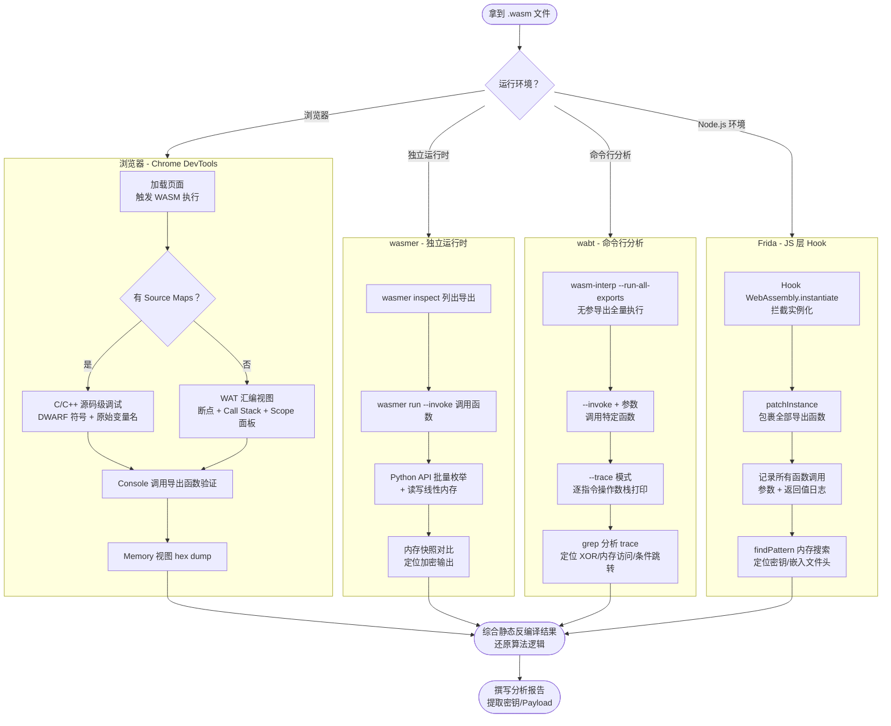

# WASM逆向（05）· WASM动态分析与调试

> [!abstract] TL;DR
> 静态反编译给你"地图"，动态分析才让你真正"进入"程序。本章覆盖四条 WASM 动态分析路径：①**浏览器 Chrome DevTools**——有无 Source Maps 两种场景下的断点、调用栈与内存视图；②**wasmer 独立运行时**——命令行调用与 Python API 驱动的可编程分析；③**Frida 动态插桩**——在浏览器/Node.js 层 Hook `WebAssembly.instantiate` 拦截全部导出函数；④**wabt wasm-interp 解释器**——`--trace` 模式逐指令打印操作数栈，适合无 DevTools 的自动化场景。掌握内存 dump 与字节模式搜索，是发现 WASM 内嵌 PE/ELF 或提取密钥的必备手段。

---

## 概述与定位

本章在 [[04.WASM反编译：wasm-decompile与Ghidra插件]] 完成静态反编译路径梳理之后，转入动态分析视角。静态分析提供代码结构"地图"，动态分析则通过运行时断点、内存快照、函数 Hook 等手段，直接观测程序行为。本章覆盖浏览器 Chrome DevTools、wasmer 独立运行时、Frida 动态插桩、wabt wasm-interp 四条路径，以及内存 dump 和字节模式搜索技术。

---

## 1. 浏览器 DevTools 调试（Chrome）

### 1.1 开启 Source Maps（Emscripten 编译时）

Emscripten 是 C/C++ → WASM 的主流工具链。编译时加 `-g` 参数，编译器会向 `.wasm` 文件嵌入 **DWARF 调试信息**，并在同目录生成 `.wasm.map` Source Map 文件。Chrome DevTools 读取 Source Map 后，可以直接展示 C/C++ 源码级别的调试视图，如同调试普通 JavaScript 一样直观。

```bash
# -g  → 嵌入 DWARF 调试信息（源码行号映射）
# -s WASM=1 → 强制输出 wasm 二进制（非 asm.js 回退）
emcc source.c -o out.js -g -s WASM=1

# 优化级别与调试信息可共存，但 -O3 会内联/消除大量函数
# 调试阶段推荐 -O0（保留所有函数符号）
emcc source.c -o out.js -g -O0 -s WASM=1

# 若要同时生成独立的 source map 文件：
emcc source.c -o out.js -g -s WASM=1 \
  -gsource-map \
  --source-map-base http://localhost:8080/
```

**DevTools 操作流程（有 Source Maps）**：

1. 打开 Chrome，加载运行 WASM 的页面（`localhost` 或 `file://`）
2. `F12` 打开 DevTools → **Sources** 面板
3. 在左侧文件树中找到 `.c` 或 `.cpp` 原始源文件（Source Map 映射后）
4. 单击行号设置断点 → 刷新页面触发执行
5. 断点命中后：**Call Stack** 面板显示 C 函数调用栈，**Scope** 面板显示 C 局部变量（带类型信息）

> [!tip] C++ 符号去混淆
> Emscripten 默认对 C++ 函数名进行 Mangling。DevTools 中 Source Map 模式会自动 Demangle，但 WAT 视图仍显示 Mangled 名（如 `_ZN3Foo3barEi`）。可在 Console 运行 `demangle('_ZN3Foo3barEi')` 验证。

---

### 1.2 无 Source Maps 时调试 WASM

实际逆向中，目标 WASM 通常**不含调试信息**（生产版本 `-O2/-O3` 编译，不带 `-g`）。此时 DevTools 退回到 **WAT（WebAssembly Text Format）汇编视图**，是最接近原始字节码的可视化展示。

**步骤详解**：

1. `F12` → **Sources** 面板 → 左侧文件树找到 `.wasm` 文件（通常显示为 `wasm://wasm/xxxxxx`）
2. 单击打开，DevTools 自动将二进制反汇编为 WAT 格式显示
3. 在 WAT 行（`i32.add`、`call $foo` 等）单击行号 → 设置 WASM 断点
4. 刷新页面或触发 WASM 执行

**断点命中后的信息面板**：

| 面板 | 内容 | 逆向用途 |
|------|------|---------|
| **Call Stack** | `wasm-function[N]:0x1a4` 格式（函数索引:字节偏移） | 定位调用链，确认函数 N 对应第几个 `(func ...)` |
| **Scope → Local** | `local[0]`, `local[1]`...（按 index 编号） | 查看局部变量当前值，推断参数用途 |
| **Scope → Stack** | 当前操作数栈内容 | 了解指令执行到此时的栈状态 |
| **Scope → Global** | WASM 全局变量（stack pointer、heap base 等） | 定位内存布局 |
| **Memory 子面板** | `WebAssembly.Memory` 的 ArrayBuffer 以十六进制显示 | 查找字符串、密钥、协议头等 |

5. 通过 **Console** 直接调用 WASM 导出函数验证逻辑：

```javascript
// Emscripten 生成的 JS 胶水层（Module 对象）
Module._factorial(10)          // 下划线前缀是 Emscripten 约定
Module.ccall('factorial', 'number', ['number'], [10])  // 更安全的跨类型调用
Module.cwrap('factorial', 'number', ['number'])(10)    // 包装成 JS 函数

// 原生 WASM（手写或 wasm-pack 生成）
instance.exports.factorial(10)

// 若通过 fetch + WebAssembly.instantiateStreaming 加载：
const { instance } = await WebAssembly.instantiateStreaming(fetch('module.wasm'));
instance.exports.factorial(10)
```

> [!warning] 内联优化导致函数消失
> 生产版 WASM 中大量小函数会被内联到调用方，导致 WAT 中找不到对应的独立 `(func ...)`。遇到此情况：①换 `-O0` 编译目标文件对比；②在 Scope 的 Stack 面板追踪操作数流，理解内联后的展开逻辑。

---

### 1.3 实战技巧：在 WAT 中快速定位目标函数

不带符号的 WASM 可能有几百个匿名函数（`wasm-function[0]` 到 `wasm-function[499]`）。快速定位策略：

1. **从 Export 入手**：DevTools 的 **Memory** 子面板 → 搜索 `instance.exports` → 已导出的函数有名字，从这里反向找到函数索引
2. **从 Import 定位调用链**：WASM 的 `import` 段引用宿主 JS 函数（如 `env.alert`、`env.memcpy`），在 Call Stack 中找到这些 import 的调用者即目标函数
3. **断点 + 条件断点**：DevTools 支持条件断点（右键行号 → Add conditional breakpoint），利用 `local[0] === 42` 之类的条件精确触发
4. **Logpoints**：右键行号 → Add logpoint → 填写 `"function entry: " + local[0]`，不暂停执行但打印每次调用的参数值，适合高频函数

---

## 2. wasmer（独立 WASM 运行时）

wasmer 是一个跨平台的独立 WASM 运行时，支持多种编译后端（Cranelift、LLVM、Singlepass），可在无浏览器环境下执行和分析 WASM 文件。

### 2.1 安装与基础命令

```bash
# 安装 wasmer（Linux/macOS）
curl https://get.wasmer.io -sSfL | sh

# 重启 Shell 使 PATH 生效，或手动加：
export PATH="$HOME/.wasmer/bin:$PATH"

# 验证安装
wasmer --version
# → wasmer 4.x.y
```

**核心命令速查**：

```bash
# 直接执行 WASM 文件（需要有 _start 或 main 导出）
wasmer run module.wasm

# 调用特定导出函数并传参
wasmer run module.wasm --invoke factorial -- 10

# 列出模块所有导出（函数、内存、表、全局变量）
wasmer inspect module.wasm

# 执行 WASI 应用（需要文件系统访问权限）
wasmer run wasi_app.wasm --dir .               # 映射当前目录
wasmer run wasi_app.wasm --dir /tmp:/host_tmp  # 宿主路径:WASM内路径

# 指定编译后端（Singlepass 最快启动，适合快速测试）
wasmer run module.wasm --singlepass

# 传入环境变量（WASI 应用）
wasmer run app.wasm --env KEY=VALUE --env DEBUG=1
```

**wasmer inspect 输出示例**：

```
Type: wasm
Size: 45.2 KB
Exports:
  Functions:
    - factorial: [I32] -> [I32]
    - memory_test: [] -> [I32]
    - __wasm_call_ctors: [] -> []
  Memories:
    - memory: 1 page (64 KiB), max: unlimited
  Tables:
    - __indirect_function_table: funcref, min: 4
Imports:
  Functions:
    - env.printf: [I32, ...] -> [I32]
```

### 2.2 wasmer Python API（动态分析自动化）

wasmer 提供 Python 绑定（`wasmer` 包），可编写自动化分析脚本，批量调用函数、读写线性内存。

```python
from wasmer import Store, Module, Instance, Memory
from wasmer_compiler_cranelift import Compiler

# 初始化运行时存储（Store 持有编译后端状态）
store = Store(Compiler)

# 从文件加载并编译 WASM 模块
with open('input.wasm', 'rb') as f:
    wasm_bytes = f.read()

module = Module(store, wasm_bytes)
instance = Instance(module)

# ──────────────────────────────────────────
# 调用导出函数
# ──────────────────────────────────────────
result = instance.exports.factorial(10)
print(f"factorial(10) = {result}")   # → 3628800

# 批量测试：枚举所有合法输入
for n in range(0, 20):
    try:
        val = instance.exports.factorial(n)
        print(f"  factorial({n:2d}) = {val}")
    except Exception as e:
        print(f"  factorial({n:2d}) → trap: {e}")

# ──────────────────────────────────────────
# 读写线性内存
# ──────────────────────────────────────────
memory: Memory = instance.exports.memory

# uint8_view：以字节为单位访问内存
view = memory.uint8_view(offset=0)   # 从偏移 0 开始的字节视图

# 读取内存前 64 字节（十六进制显示）
raw = bytes(view[0:64])
print("Memory[0:64]:", raw.hex(' '))

# 向内存写入字符串（用于测试接受字符串指针的函数）
test_str = b"hello_wasm\x00"
for i, byte in enumerate(test_str):
    view[0x1000 + i] = byte

# 调用接收字符串指针的函数（WASM 内存基址 + 偏移 = 0x1000）
result = instance.exports.process_string(0x1000)
print(f"process_string result: {result}")

# int32_view：以 4 字节 i32 为单位访问（适合读取整数数组）
i32_view = memory.int32_view(offset=0x2000)
print("i32 at 0x2000:", i32_view[0])
```

**批量导出函数枚举**（自动化模糊测试）：

```python
import inspect
from wasmer import Store, Module, Instance, ExportType

store = Store(Compiler)
module = Module(store, open('target.wasm', 'rb').read())

# 列出所有导出函数的签名
for export in module.exports:
    if export.type.__class__.__name__ == 'FunctionType':
        ft = export.type
        print(f"[Export] {export.name}: ({', '.join(str(p) for p in ft.params)}) -> ({', '.join(str(r) for r in ft.results)})")

# 实例化并尝试对所有无参导出函数调用
instance = Instance(module)
for name in dir(instance.exports):
    fn = getattr(instance.exports, name, None)
    if callable(fn):
        try:
            ret = fn()
            print(f"  {name}() = {ret}")
        except Exception as e:
            print(f"  {name}() → {e}")
```

---

## 3. Frida 动态插桩（浏览器 WASM）

Frida 是跨平台动态插桩框架，在 WASM 逆向中的核心用途：**在 JS 层拦截 `WebAssembly.instantiate`，包裹全部导出函数，实现零侵入的函数调用日志记录**。

### 3.1 浏览器层 Hook（JS 注入方式）

以下脚本可通过浏览器扩展、Tampermonkey、或 DevTools Console 注入执行：

```javascript
// ──────────────────────────────────────────────────────────────
// WASM 导出函数全量 Hook
// 注入时机：页面加载前（initScript）或 DevTools Console 运行
// ──────────────────────────────────────────────────────────────

(function hookWasm() {
    // 保存原始 API
    const origInstantiate     = WebAssembly.instantiate;
    const origInstantiateStreaming = WebAssembly.instantiateStreaming;

    // 工具函数：包裹单个导出函数
    function wrapExport(name, fn) {
        return function(...args) {
            console.log(`[WASM ▶] ${name}(${args.map(a => JSON.stringify(a)).join(', ')})`);
            let ret;
            try {
                ret = fn.apply(this, args);
            } catch (e) {
                console.log(`[WASM ✗] ${name} threw: ${e}`);
                throw e;
            }
            console.log(`[WASM ◀] ${name} → ${JSON.stringify(ret)}`);
            return ret;
        };
    }

    // 工具函数：对 instance 的所有导出函数打补丁
    function patchInstance(instance) {
        const exports = instance.exports;
        for (const [name, exp] of Object.entries(exports)) {
            if (typeof exp === 'function') {
                exports[name] = wrapExport(name, exp);
                console.log(`[WASM HOOK] Patched export: ${name}`);
            }
        }
        return instance;
    }

    // Hook WebAssembly.instantiate（接受 ArrayBuffer 或已编译 Module）
    WebAssembly.instantiate = async function(bufferSource, importObject) {
        console.log('[WASM] WebAssembly.instantiate called');

        // 若 bufferSource 是 ArrayBuffer，在实例化前 dump 字节
        if (bufferSource instanceof ArrayBuffer || ArrayBuffer.isView(bufferSource)) {
            const bytes = new Uint8Array(bufferSource instanceof ArrayBuffer
                ? bufferSource : bufferSource.buffer);
            console.log(`[WASM] Module size: ${bytes.length} bytes`);
            // 打印前 16 字节（Magic + Version 验证）
            const header = Array.from(bytes.slice(0, 8))
                .map(b => '0x' + b.toString(16).padStart(2, '0'))
                .join(' ');
            console.log(`[WASM] Header: ${header}`);
        }

        const result = await origInstantiate.call(this, bufferSource, importObject);
        const instance = result.instance ?? result;
        patchInstance(instance);
        return result;
    };

    // Hook WebAssembly.instantiateStreaming（接受 Response Promise）
    WebAssembly.instantiateStreaming = async function(source, importObject) {
        console.log('[WASM] WebAssembly.instantiateStreaming called');
        const result = await origInstantiateStreaming.call(this, source, importObject);
        const instance = result.instance ?? result;
        patchInstance(instance);
        return result;
    };

    console.log('[WASM HOOK] WebAssembly API intercepted');
})();
```

**使用方式**：
- **DevTools Console**：粘贴代码 → 回车 → 刷新页面，所有 WASM 函数调用将打印到 Console
- **Tampermonkey**：将代码包裹在 `// @run-at document-start` 注解下的用户脚本中
- **Playwright/Puppeteer 自动化**：通过 `page.addInitScript(script)` 在文档加载前注入

### 3.2 Frida Native（Node.js WASM 插桩）

当 WASM 在 **Node.js** 环境执行时，可使用 Frida 的 Native 能力 hook V8 的 WASM 相关函数：

```javascript
// frida-script.js
// 运行方式：frida -n node -l frida-script.js

'use strict';

// ──────────────────────────────────────────────────────────────
// 方案A：在 JS 层 hook（无需找 V8 内部符号，更稳定）
// ──────────────────────────────────────────────────────────────

// 拦截 Node.js require('vm') 模块的 WebAssembly 全局对象
// Node.js 中 WebAssembly 是全局对象，可直接 hook

const script = `
(function() {
    const origInstantiate = WebAssembly.instantiate;
    WebAssembly.instantiate = async function(buf, imports) {
        send({type: 'wasm_instantiate', size: buf.byteLength || buf.buffer?.byteLength});
        const result = await origInstantiate.call(this, buf, imports);
        const instance = result.instance ?? result;
        // 枚举并 hook 所有导出
        for (const [name, fn] of Object.entries(instance.exports)) {
            if (typeof fn === 'function') {
                const orig = fn;
                instance.exports[name] = function(...args) {
                    send({type: 'wasm_call', name, args});
                    const ret = orig.apply(this, args);
                    send({type: 'wasm_ret', name, ret});
                    return ret;
                };
            }
        }
        return result;
    };
    send({type: 'hook_ready'});
})();
`;

Java.perform(function() {});  // frida stub

// ──────────────────────────────────────────────────────────────
// 方案B：Native 层 Hook（高级，需定位 V8 WASM JIT 入口）
// ──────────────────────────────────────────────────────────────

// 在 libv8.so / node 二进制中找 WasmCode 相关符号
const wasmCodeModule = Process.findModuleByName('node');
if (wasmCodeModule) {
    // 查找 v8::internal::wasm::NativeModule::AddCompiledCode 等函数
    // 地址因版本而异，需结合符号表或模式匹配确定
    const symbols = wasmCodeModule.enumerateSymbols()
        .filter(s => s.name && s.name.includes('wasm'));
    symbols.slice(0, 10).forEach(s => {
        console.log(`WASM symbol: ${s.name} @ ${s.address}`);
    });
}

recv('message', function(message) {
    console.log('[Frida msg]', JSON.stringify(message));
});
```

**运行**：

```bash
# 附加到正在运行的 node 进程
frida -n node -l frida-script.js

# 以 spawn 模式启动并插桩
frida -f /usr/bin/node --no-pause -l frida-script.js -- target.js
```

---

## 4. 内存 dump 技术

WASM 线性内存（Linear Memory）是一块可从 JS 层直接访问的连续 ArrayBuffer。掌握内存 dump 技术，是发现嵌入 PE/ELF 文件头、提取硬编码密钥、还原字符串常量的核心手段。

### 4.1 基础内存 dump（浏览器 Console）

```javascript
// ──────────────────────────────────────────────────────────────
// 函数1：dump 指定区域为十六进制字符串
// ──────────────────────────────────────────────────────────────
function dumpWasmMemory(instance, offset, length) {
    const memory = instance.exports.memory;
    if (!memory) {
        console.error('No exported memory named "memory"');
        return null;
    }
    const view = new Uint8Array(memory.buffer, offset, length);
    // 格式化为每行 16 字节的经典 hex dump
    const lines = [];
    for (let row = 0; row < view.length; row += 16) {
        const addr = (offset + row).toString(16).padStart(8, '0');
        const chunk = Array.from(view.slice(row, row + 16));
        const hex = chunk.map(b => b.toString(16).padStart(2, '0')).join(' ');
        const ascii = chunk.map(b => (b >= 0x20 && b < 0x7f) ? String.fromCharCode(b) : '.').join('');
        lines.push(`${addr}  ${hex.padEnd(47)}  |${ascii}|`);
    }
    const result = lines.join('\n');
    console.log(result);
    return view;
}

// 用法：dump WASM 内存 0x1000 起始的 256 字节
dumpWasmMemory(wasmInstance, 0x1000, 256);
```

### 4.2 字节模式搜索

```javascript
// ──────────────────────────────────────────────────────────────
// 函数2：在线性内存中搜索字节模式（支持通配符 -1）
// ──────────────────────────────────────────────────────────────
function findPattern(instance, pattern, wildcardByte = -1) {
    const memory = new Uint8Array(instance.exports.memory.buffer);
    const results = [];
    const len = pattern.length;

    outer:
    for (let i = 0; i <= memory.length - len; i++) {
        for (let j = 0; j < len; j++) {
            if (pattern[j] !== wildcardByte && memory[i + j] !== pattern[j]) {
                continue outer;
            }
        }
        results.push(i);
    }
    return results;
}

// ──────────────────────────────────────────────────────────────
// 实战示例1：搜索 MZ header（WASM 内嵌 PE 文件）
// ──────────────────────────────────────────────────────────────
const mzPattern = [0x4D, 0x5A];  // 'MZ'
const mzAddrs = findPattern(wasmInstance, mzPattern);
if (mzAddrs.length > 0) {
    console.log('[!] Embedded PE found at:', mzAddrs.map(a => '0x' + a.toString(16)));
    // dump PE 头部
    mzAddrs.forEach(addr => dumpWasmMemory(wasmInstance, addr, 64));
} else {
    console.log('[-] No MZ header found');
}

// ──────────────────────────────────────────────────────────────
// 实战示例2：搜索 ELF header
// ──────────────────────────────────────────────────────────────
const elfPattern = [0x7F, 0x45, 0x4C, 0x46];  // '\x7fELF'
const elfAddrs = findPattern(wasmInstance, elfPattern);
console.log('ELF headers:', elfAddrs.map(a => '0x' + a.toString(16)));

// ──────────────────────────────────────────────────────────────
// 实战示例3：搜索 AES S-Box 起始字节（定位加密模块）
// ──────────────────────────────────────────────────────────────
// AES S-Box 前8字节：63 7c 77 7b f2 6b 6f c5
const aesPattern = [0x63, 0x7c, 0x77, 0x7b, 0xf2, 0x6b, 0x6f, 0xc5];
const aesAddrs = findPattern(wasmInstance, aesPattern);
console.log('AES S-Box candidates:', aesAddrs.map(a => '0x' + a.toString(16)));

// ──────────────────────────────────────────────────────────────
// 实战示例4：搜索 UTF-8 字符串（转为字节数组后搜索）
// ──────────────────────────────────────────────────────────────
function findString(instance, str) {
    const encoder = new TextEncoder();
    const pattern = Array.from(encoder.encode(str));
    return findPattern(instance, pattern);
}

const secretKeyAddrs = findString(wasmInstance, 'SECRET_KEY=');
console.log('Potential key locations:', secretKeyAddrs.map(a => '0x' + a.toString(16)));
```

### 4.3 内存快照与对比

```javascript
// 拍摄内存快照（保存某一时刻的完整线性内存）
function snapshotMemory(instance) {
    const buf = instance.exports.memory.buffer;
    return new Uint8Array(buf.slice(0));  // slice 创建独立副本
}

// 调用函数前后对比内存变化
const before = snapshotMemory(wasmInstance);

// 执行目标函数（如加密函数）
wasmInstance.exports.encrypt(0x1000, 16);  // 加密内存 0x1000 处的 16 字节

const after = snapshotMemory(wasmInstance);

// 找出所有发生变化的字节
const diffs = [];
for (let i = 0; i < before.length; i++) {
    if (before[i] !== after[i]) {
        diffs.push({ offset: i, before: before[i], after: after[i] });
    }
}
console.log(`Memory changed at ${diffs.length} offsets:`);
diffs.slice(0, 50).forEach(d => {
    console.log(`  0x${d.offset.toString(16)}: ${d.before.toString(16)} → ${d.after.toString(16)}`);
});
```

---

## 5. wabt wasm-interp（命令行解释器）

`wasm-interp` 是 wabt 工具集中的轻量 WASM 解释器，支持 `--trace` 模式逐指令打印操作数栈，非常适合无浏览器的 CI/自动化环境，或需要完整执行轨迹的场景。

### 5.1 安装 wabt

```bash
# 方式1：从预编译包安装（推荐）
# 下载 https://github.com/WebAssembly/wabt/releases 对应平台包
# 解压后将 bin/ 目录加入 PATH

# 方式2：包管理器
# Ubuntu/Debian
sudo apt install wabt

# macOS
brew install wabt

# Windows（Scoop）
scoop install wabt

# 验证
wasm-interp --version
```

### 5.2 基础用法

```bash
# 执行所有导出函数（自动枚举并调用无参导出）
wasm-interp input.wasm --run-all-exports

# 调用特定函数并传入参数
# -i 代表 i32 参数，-I 代表 i64，-f 代表 f32，-F 代表 f64
wasm-interp input.wasm --invoke factorial -i 10

# 执行有多个参数的函数
wasm-interp input.wasm --invoke add -i 3 -i 4

# 执行并显示返回值
wasm-interp input.wasm --invoke compute -i 255 -i 128
# → 输出：compute(255, 128) => 383
```

### 5.3 --trace 模式（逐指令追踪）

`--trace` 是 wasm-interp 最强大的动态分析功能，每执行一条 WASM 指令都会打印：当前函数、指令名称、以及执行后的操作数栈状态。

```bash
# 打印每条指令执行（trace 模式）
wasm-interp input.wasm --invoke main --trace
```

**trace 输出示例**（加法函数 `add(5, 3)`）：

```
#0. func[2] "add":
   i32.const 5          ;; stack: [5]
   i32.const 3          ;; stack: [5, 3]
   i32.add              ;; stack: [8]
   return               ;; stack: []
result: 8

#0. func[0] "_start":
   call 2               ;; before call: []
     #1. func[2] "add":
        local.get 0     ;; stack: [5]        (local[0]=5)
        local.get 1     ;; stack: [5, 3]     (local[1]=3)
        i32.add         ;; stack: [8]
        end             ;; → return 8
   i32.store (offset=0) ;; mem[0] = 8, stack: []
   end                  ;; → return
```

**trace 输出解读规则**：

| 符号 | 含义 |
|------|------|
| `stack: [a, b, c]` | 栈顶在右（c 是栈顶），a 最先入栈 |
| `#N. func[M]` | 调用深度 N，函数索引 M |
| `(offset=X)` | 内存访问指令的立即数偏移 |
| `local.get/set` | 读写局部变量（包含函数参数） |
| `global.get/set` | 读写全局变量（常见：栈指针 `__stack_pointer`） |

### 5.4 结合 trace 分析混淆算法

```bash
# 1. 运行 trace 并将输出保存到文件（避免终端刷屏）
wasm-interp obfuscated.wasm --invoke check_key -i 0x41424344 --trace > trace.txt 2>&1

# 2. 统计各指令出现频率（了解算法特征）
# Linux/macOS：
grep -oP '^\s+\K\S+' trace.txt | sort | uniq -c | sort -rn | head -20

# 3. 找所有内存访问（定位密钥存储位置）
grep 'i32.store\|i32.load\|i64.store\|i64.load' trace.txt | head -30

# 4. 找所有 XOR 操作（常见简单混淆）
grep 'i32.xor\|i64.xor' trace.txt

# 5. 搜索条件跳转（定位检查逻辑的 if/br_if）
grep 'br_if\|if ' trace.txt
```

**wasm-interp 限制**：不支持 WASI（需要用 wasmer/wasmtime），不支持 SIMD/多值指令（最新 WASM 特性），适合分析较老或较简单的 WASM 文件。复杂目标推荐用 wasmer + Python 脚本。

---

## 6. 综合分析流程



---

## 7. 工具选型决策与最佳实践

### 7.1 工具对比速查表

| 工具 | 环境要求 | 优势 | 劣势 | 适用场景 |
|------|---------|------|------|---------|
| **Chrome DevTools** | 浏览器 | 可视化直观，Source Maps 支持，内存视图 | 必须在浏览器环境运行 | 分析 Web 应用内置 WASM |
| **wasmer CLI** | 跨平台，无需浏览器 | WASI 支持，多编译后端，Python API | 不支持浏览器专属 API（DOM 等） | 分析独立 WASM 模块 |
| **wasmer Python** | Python 3.7+ | 可编程，批量自动化，内存读写 | API 版本变动较快，部分平台支持不完整 | 自动化逆向脚本 |
| **Frida JS Hook** | 浏览器或 Node.js | 零侵入，不需要修改 WASM，实时日志 | 依赖 JS 层 API，不能 hook 内联 WASM 调用 | 黑盒 Hook，CTF 快速定位函数 |
| **wasm-interp --trace** | wabt 工具集 | 完整指令级 trace，无环境依赖 | 不支持 WASI/SIMD，速度慢 | 算法逆向，指令级行为分析 |

### 7.2 黄金组合

**CTF 快速通关**：
1. `wasmer inspect` → 了解导出函数签名
2. Frida JS Hook → 确认调用参数和返回值
3. `wasm-interp --trace` → trace 关键函数的指令序列
4. 结合第04章的 `wasm-decompile` 伪代码 → 还原算法

**生产 WASM 深度分析**：
1. Chrome DevTools（WAT 断点）→ 确定目标函数范围
2. `dumpWasmMemory` → 导出线性内存快照
3. `findPattern` → 定位嵌入数据/密钥
4. wasmer Python → 编写自动化验证脚本

### 7.3 常见陷阱

> [!warning] 内存增长导致视图失效
> `WebAssembly.Memory` 调用 `memory.grow()` 后，所有旧的 ArrayBuffer 视图（`Uint8Array`/`Int32Array`）会**分离（detach）**，读写会抛出 `TypeError: Cannot perform %TypedArray%.prototype.get on a detached ArrayBuffer`。每次内存增长后需重新获取视图：
> ```javascript
> // 错误：保存视图后复用
> const view = new Uint8Array(instance.exports.memory.buffer);
> instance.exports.some_func();  // 若内部调用 memory.grow，view 失效
> view[0];  // → TypeError!
>
> // 正确：每次通过 memory.buffer 重新创建视图
> function safeRead(instance, offset) {
>     return new Uint8Array(instance.exports.memory.buffer)[offset];
> }
> ```

> [!warning] WASM trap 不等于崩溃
> WASM 的 trap（除零、越界访问、栈溢出）在 JS 中表现为抛出 `RuntimeError`，是可 catch 的异常，不会导致整个页面崩溃。动态分析时可用 try/catch 记录 trap 信息，辅助判断非法输入边界。

---

## 安全性与正确使用

> [!tip] 合规使用说明
> 本章介绍的动态分析技术（DevTools、Frida、wasmer、内存 dump）用于：
> - **合法逆向研究**：自有 WASM 模块分析、CTF 竞赛题目、安全漏洞研究
> - **开发调试**：验证 WASM 模块在运行时的行为，定位内存问题
>
> 不应将这些技术用于未经授权的第三方 WASM 应用逆向，包括商业游戏、DRM 系统等。

### 注意事项

- **Frida Hook**：仅在自有或授权的应用进程中使用，未经授权对第三方进程 Hook 可能违反法律
- **内存 dump**：dump 出的内存可能包含用户隐私数据，处理时注意数据保护合规要求
- **沙箱隔离**：分析来自不可信来源的 WASM 文件时在隔离环境中运行，避免宿主机受到攻击

## 小结

本章系统介绍了 WASM 动态分析的四条路径：Chrome DevTools 提供有/无 Source Maps 两种场景的断点与内存视图；wasmer 独立运行时支持命令行与 Python API 可编程分析；Frida 在浏览器/Node.js 层实现导出函数 Hook；wabt wasm-interp `--trace` 模式适合自动化场景的逐指令追踪。内存 dump 与字节模式搜索是发现内嵌数据和提取密钥的必备手段。

## 相关阅读

- [[04.WASM反编译：wasm-decompile与Ghidra插件]] — 静态反编译工具链，与本章动态分析互补
- [[08.WASM CTF实战]] — 动态分析在 CTF 解题中的完整应用示例，包含内存 dump 提取 flag 的实战流程
- [[06.WASM内存模型与线性内存安全]] — 深入理解 WASM 内存模型，指导内存 dump 分析

---

⬅️ 上一篇 [[04.WASM反编译：wasm-decompile与Ghidra插件]] ｜ 🏠 [[00.WASM与虚拟化壳逆向总览]] ｜ 下一篇 [[06.WASM内存模型与线性内存安全]] ➡️
