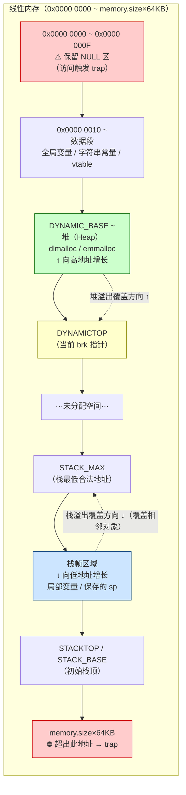

# WASM逆向（06）· WASM内存模型与线性内存安全

> [!abstract] TL;DR
> WASM 使用**线性内存**（连续字节数组）作为唯一可读写的数据区域，越出总大小的访问会触发 trap 强制终止。然而这种保护仅作用于"沙箱边界"——在线性内存**内部**，栈溢出覆盖堆、堆元数据被篡改、JS 宿主整数截断绕过等问题与传统 C/C++ 程序无异。理解 Emscripten 的典型内存布局（保留区→数据段→堆→栈），配合 `memory.grow` 监控和 wasm2c 反编译，是分析 WASM 内存漏洞的基本功。

---

## 概述与定位

本章聚焦 WASM 线性内存模型的安全边界：WASM 沙箱保证了越过线性内存总大小的访问会触发 trap，但无法防止线性内存**内部**的越界写——Emscripten 编译的 C/C++ 代码将 C 运行时的栈与堆完整映射到线性内存中，所有经典内存损坏漏洞（栈溢出、堆溢出）依然有效。本章介绍 Emscripten 典型内存布局、JS 宿主整数截断绕过、`memory.grow` 监控技术和 CTF 实战分析方法。

---

## 一、线性内存模型基础

### 1.1 什么是线性内存

WASM 规范中，程序的"内存"由一块或多块**线性内存（Linear Memory）**构成。每块线性内存是一段**连续字节数组**，使用 **32 位无符号整数**作为字节偏移（index）进行访问，不存在指针对象、不存在指针算术运算——只有"整数偏移 + 宽度"的组合操作。

线性内存的大小以 **64KB 为一页（page）**，在模块的 Memory Section 中声明初始页数与最大页数（可省略上限，意味着无限制扩展）：

```wat
;; 声明内存：初始 1 页（64KB），最多 256 页（16MB）
(memory 1 256)

;; 导出给 JS 宿主
(export "memory" (memory 0))
```

对线性内存的访问通过 `i32.load` / `i32.store` 系列指令完成，宽度可以是 1/2/4/8 字节，并可选 align 提示：

```wat
;; 从偏移 0x100 处读取 4 字节（little-endian）
i32.const 0x100
i32.load

;; 向偏移 0x200 处写入 1 字节
i32.const 0x200
i32.const 0x41  ;; 'A'
i32.store8
```

只要偏移 + 宽度不超过当前线性内存的总字节数，访问就是合法的；一旦越界，运行时立刻抛出 **trap**（不可恢复陷阱），当前执行立即终止。

### 1.2 memory.grow 指令

运行时可通过 `memory.grow` 指令动态扩展线性内存，单位同样是页（64KB）：

```wat
;; 请求增加 4 页（256KB）
i32.const 4
memory.grow
;; 栈顶：成功则为扩展前的页数（旧大小），失败则为 -1（0xFFFFFFFF）
```

扩展成功后，新增区域的内容被初始化为 **0x00**。在 JS 宿主侧，对应 `WebAssembly.Memory.prototype.grow(delta)` 方法；扩展会导致现有 `ArrayBuffer` 被分离（detach），必须重新获取 `buffer` 引用：

```javascript
const mem = new WebAssembly.Memory({ initial: 1, maximum: 256 });
let view = new Uint8Array(mem.buffer);

mem.grow(4);  // 增加 4 页
// view 已失效！必须重建
view = new Uint8Array(mem.buffer);
console.log('当前大小:', mem.buffer.byteLength);  // 5 * 65536 = 327680
```

### 1.3 JS 侧共享视图

WASM 线性内存在 JS 侧表现为 `ArrayBuffer`（单线程）或 `SharedArrayBuffer`（多线程，配合 `Atomics`）。Emscripten 编译的模块会暴露一组便捷视图：

```javascript
// Emscripten 模块初始化后可用的内存视图
Module.HEAP8    // Int8Array
Module.HEAPU8   // Uint8Array（最常用，字节级访问）
Module.HEAP16   // Int16Array
Module.HEAP32   // Int32Array（指针读写）
Module.HEAPF32  // Float32Array
Module.HEAPF64  // Float64Array
```

这些视图与 WASM 共享同一块 `ArrayBuffer`，JS 写入对 WASM 即时可见，反之亦然。这既是互操作的基础，也是潜在的攻击面（后文展开）。

---

## 二、Emscripten 线性内存布局

Emscripten 是目前最主流的 C/C++ → WASM 工具链，其编译出的模块有固定的线性内存分区约定。理解这个布局是分析 WASM 二进制、定位漏洞的前提。

### 2.1 典型布局示意

```
地址（字节偏移）      区域              说明
─────────────────────────────────────────────────────────────
0x0000 0000          保留（NULL 区）    捕捉空指针解引用（访问 → trap）
0x0000 0010          数据段起点         C 全局变量、字符串常量、只读数据
                     ...
                     堆（Heap）         dlmalloc/emmalloc 管理，向高地址增长
                     DYNAMICTOP         当前堆顶，malloc 时通过 sbrk() 推进
                     ...（未分配空间）
[memory.size*64KB    栈底（Stack Max）  Emscripten 虚拟栈，向低地址增长
 - stack_size]
                     ...（栈帧）
[初始 STACKTOP]      栈顶（Stack Top）  函数序言保存 sp，返回时恢复
[memory.size*64KB]   内存末端（越界）   访问此处及以上 → trap
─────────────────────────────────────────────────────────────
```

> [!note] 方向约定
> Emscripten **堆向上增长**，**栈向下增长**——与 x86 的栈向下增长一致，但堆和栈共享同一块线性内存，两者若相向增长到碰头，即发生"堆栈碰撞"（stack smashing 的 WASM 变体）。

### 2.2 用 JS Console 检查实际布局

```javascript
// ── 在浏览器 Console 中检查 Emscripten 模块的内存布局 ──

// 栈相关
console.log('STACK_BASE :', Module.STACK_BASE);   // 栈底地址
console.log('STACKTOP   :', Module.STACKTOP);     // 当前栈顶（初始值 = STACK_BASE）
console.log('STACK_MAX  :', Module.STACK_MAX);    // 栈可增长的最低地址
// 堆相关
console.log('DYNAMIC_BASE:', Module.DYNAMIC_BASE); // 堆起始地址
console.log('DYNAMICTOP  :', Module.DYNAMICTOP);   // 当前堆顶（brk 指针）
// 总内存
console.log('HEAP_SIZE   :', Module.HEAPU8.byteLength); // 单位：字节

// ── 从线性内存读取 null 结尾 C 字符串 ──
function readCString(ptr) {
    const mem = Module.HEAPU8;
    let end = ptr;
    while (mem[end] !== 0) end++;
    return new TextDecoder('utf-8').decode(mem.subarray(ptr, end));
}

// ── 以十六进制 dump 指定区间 ──
function hexdump(ptr, len) {
    const mem = Module.HEAPU8;
    const slice = mem.subarray(ptr, ptr + len);
    return Array.from(slice)
        .map(b => b.toString(16).padStart(2, '0'))
        .join(' ');
}

// 示例：查看数据段前 64 字节
console.log(hexdump(Module.DYNAMIC_BASE - 0x100, 64));
```

### 2.3 数据段与 wasm-init 过程

编译器将 C 全局变量的初始值嵌入 WASM 模块的 **Data Section**，模块实例化时通过 `memory.init` 指令（Bulk Memory 提案）或 `data` 段的被动/主动初始化将数据写入线性内存：

```wat
;; 主动数据段：模块实例化时自动复制到偏移 0x400
(data (i32.const 0x400) "Hello, WASM!\00")

;; 被动数据段（需显式 memory.init 触发）
(data $hello "Hello, WASM!\00")
```

逆向时，在 `wat` 或 `wasm2c` 输出中定位 `(data ...)` 块，可以还原全局字符串常量和 vtable 布局。

---

## 三、WASM 内存安全：设计保证与边界

### 3.1 沙箱级别的安全保证

WASM 规范在设计上提供以下安全保证：

| 属性 | 保证内容 |
|------|---------|
| **内存隔离** | WASM 只能访问自己的线性内存，无法读写宿主进程的其他地址 |
| **越界 trap** | 访问 `offset >= memory.size * 65536` 时立即触发 trap，进程不崩溃但执行终止 |
| **无原始指针** | WASM 内部没有"指针类型"，只有整数偏移；无法构造悬空指针或 use-after-free 跨越沙箱边界 |
| **控制流完整性（CFI 基础）** | 间接调用 `call_indirect` 通过 **Table** 验证函数签名，类型不匹配 → trap |
| **无直接寄存器访问** | 无法直接读写宿主 CPU 寄存器（包括 RSP/RIP），无传统 ROP 意义上的 gadget |

这些属性使 WASM 成为比 native 代码更好的沙箱载体——即便 WASM 代码含有 C 级漏洞，也不能直接逃逸出沙箱。

### 3.2 trap 机制的实际行为

```javascript
// 触发越界访问 trap 的示例
const mem = new WebAssembly.Memory({ initial: 1 }); // 65536 字节
const buf = new Uint8Array(mem.buffer);

// 这段 WASM 尝试访问 mem[65536]（第 65537 字节）→ 应触发 trap
const wat = `(module
  (memory (import "env" "memory") 1)
  (func (export "oob") (result i32)
    i32.const 65536
    i32.load   ;; 越界！
  )
)`;

// 实例化并调用
WebAssembly.instantiate(
    await WebAssembly.compile(/* 编译 wat */),
    { env: { memory: mem } }
).then(inst => {
    try {
        inst.exports.oob();
    } catch (e) {
        // 捕获到 WebAssembly.RuntimeError: memory access out of bounds
        console.error('Trap 已捕获:', e.message);
    }
});
```

trap 在 JS 侧表现为 `WebAssembly.RuntimeError`，宿主可以 `try/catch` 捕获，但 WASM 实例内部执行已中止（不可恢复）。

---

## 四、线性内存内部的安全威胁

> [!warning] 关键认知
> WASM 的 trap 只保护"线性内存的外部边界"。**在线性内存内部**，缓冲区溢出、堆元数据篡改、格式字符串等漏洞与传统 C/C++ 程序完全相同——运行时不做任何检查。

### 4.1 情形一：栈上缓冲区溢出（线性内存内）

Emscripten 将 C 的局部变量（栈帧）存储在线性内存的栈区。当 C 函数有 `char buf[32]` 之类的数组，Emscripten 会在函数序言中保存虚拟栈指针（`$sp`），在线性内存的栈区分配 32 字节，函数返回时恢复 `$sp`。

```c
// 存在漏洞的 C 源码（Emscripten 编译后成为 WASM）
#include <string.h>

void vulnerable(const char *input) {
    char buf[32];
    strcpy(buf, input);   // 如果 input 超过 31 字节 → 溢出
}
```

Emscripten 编译后的 WASM 文本（简化）：

```wat
(func $vulnerable (param $input i32)
  (local $sp i32)
  ;; 函数序言：保存并下移虚拟栈指针
  global.get $__stack_pointer
  local.tee $sp
  i32.const 48        ;; 分配 48 字节栈帧（含对齐 padding）
  i32.sub
  global.set $__stack_pointer

  ;; buf 位于 $sp + 0（线性内存中的具体地址 = $sp 的值）
  ;; strcpy(buf, input) 展开为内存写循环，无长度检查
  local.get $sp       ;; buf 的地址
  local.get $input    ;; input 的地址
  call $strcpy        ;; 如果 input 超过 47 字节，写入超出 $sp 分配区域

  ;; 函数尾声：恢复栈指针（如果返回地址被覆盖，这里 global.set 回错误的值）
  local.get $sp
  i32.const 48
  i32.add
  global.set $__stack_pointer
)
```

溢出效果：若 `input` 超出 48 字节，`strcpy` 会写入栈帧之外（线性内存的下一块区域），**不触发 trap**（地址仍在线性内存范围内）。被覆盖的可能是：
- 保存的旧栈指针（`$sp` 保存槽）
- 相邻函数的栈帧局部变量
- 堆元数据（若栈与堆相邻）

### 4.2 情形二：Emscripten 堆（dlmalloc）元数据溢出

Emscripten 默认使用 **dlmalloc** 或 **emmalloc** 管理堆。堆 chunk 的 header 以明文形式存储在线性内存中：

```
[ prev_size | size+flags ][ 用户数据区 ][ next chunk header ]
```

堆溢出可以覆盖 `next chunk` 的 header，进而在 `free()` 时触发 dlmalloc 的 unlink 操作，写入攻击者控制的地址——与传统 heap exploitation 相同的原语。

```python
# 分析工具：用 Python 解析 WASM 线性内存中的 dlmalloc heap
def parse_dlmalloc_heap(mem_bytes, heap_start, heap_end):
    """遍历 dlmalloc chunk 链表"""
    chunks = []
    ptr = heap_start
    while ptr < heap_end:
        # dlmalloc chunk header：4 字节 prev_size + 4 字节 size|flags
        prev_size = int.from_bytes(mem_bytes[ptr:ptr+4], 'little')
        size_flags = int.from_bytes(mem_bytes[ptr+4:ptr+8], 'little')
        size = size_flags & ~0x7          # 去掉低 3 位标志
        in_use = bool(size_flags & 0x1)  # PREV_INUSE 标志
        if size == 0:
            break
        chunks.append({
            'addr': hex(ptr),
            'size': hex(size),
            'in_use': in_use,
            'data_preview': mem_bytes[ptr+8:ptr+24].hex()
        })
        ptr += size
    return chunks
```

### 4.3 情形三：JS 宿主层整数截断绕过

WASM 函数通过导出接口与 JS 交互时，JS 侧可能对参数做整数截断或类型强制转换，绕过 WASM 内部的合法性检查：

```javascript
// 假设 WASM 模块导出：allocate(size: i32) → i32
const { allocate, memory } = instance.exports;

// 正常调用：分配 256 字节
const ptr = allocate(256);

// 整数截断攻击：
// i32 范围是 -2147483648 ~ 2147483647
// 如果 WASM 内部检查 size > 0 但未检查 size < MAX_ALLOWED
// 传入 0x100000000 + 4 = 4294967300，在 JS 中这是合法 Number
// 但 WASM i32 截断后得到 4（只取低 32 位），绕过了"大分配"限制

const evil_size = 0x100000004;  // 在 JS 侧是正常数字
const small_ptr = allocate(evil_size | 0);  // | 0 截断为 i32 = 4

// 若后续代码以 evil_size 为长度操作 ptr，而 ptr 只有 4 字节 → 溢出
```

> [!tip] 逆向关注点
> 审计 WASM 导出函数时，重点关注 JS 调用侧如何传递 `size`、`length`、`offset` 类参数：是否做了范围检查？是否存在 `Number` → `i32` 截断后语义改变的情况？

---

## 五、内存布局可视化



---

## 六、CTF 与实战分析技法

### 6.1 wasm2c 辅助栈布局分析

`wasm2c`（WABT 工具链）将 WASM 反编译为 C，便于静态分析变量偏移：

```python
import re

def analyze_wasm2c_stack(wasm2c_c_source: str):
    """
    从 wasm2c 输出的 C 代码中分析函数栈帧布局。
    wasm2c 把 WASM 虚拟栈操作翻译为显式的 w2c_mem 读写，
    局部变量偏移可直接从代码中提取。
    """
    # 匹配栈指针计算：sp = global_sp - N
    sp_alloc = re.findall(
        r'(\w+)\s*=\s*\(u32\)\(.*?__stack_pointer.*?-\s*(\d+)\)',
        wasm2c_c_source
    )
    # 匹配内存写入操作（栈上存储局部变量）
    stack_stores = re.findall(
        r'i32_store\(.*?,\s*(\w+)\s*\+\s*(\d+),\s*(\w+)\)',
        wasm2c_c_source
    )
    # 匹配栈上缓冲区首地址（常见模式：buf_addr = sp + offset）
    buf_addrs = re.findall(
        r'(\w+)\s*=\s*(\w+)\s*\+\s*(\d+);\s*//.*buf',
        wasm2c_c_source
    )

    return {
        'sp_allocations': sp_alloc,
        'stack_stores': stack_stores,
        'buffer_addresses': buf_addrs
    }

# 使用示例
with open('target.wasm2c.c', 'r') as f:
    source = f.read()

layout = analyze_wasm2c_stack(source)
print('栈分配:', layout['sp_allocations'])
print('栈写入操作:', layout['stack_stores'][:10])
```

### 6.2 监控 memory.grow 调用

```javascript
// ── 监控 WASM 内存增长事件（在加载 WASM 模块前注入）──

const _origGrow = WebAssembly.Memory.prototype.grow;
WebAssembly.Memory.prototype.grow = function(delta) {
    const oldPages = this.buffer.byteLength / 65536;
    const result = _origGrow.call(this, delta);
    const newPages = result === -1 ? oldPages : oldPages + delta;
    console.log(
        `[WASM memory.grow] delta=${delta} pages`,
        `| old=${oldPages} pages (${oldPages * 64}KB)`,
        `| new=${newPages} pages (${newPages * 64}KB)`,
        `| result=${result}`
    );
    // 如需进一步分析：打印调用栈
    console.trace('[memory.grow 调用栈]');
    return result;
};

// ── 监控 WebAssembly 实例化（观察初始内存参数）──
const _origInstantiate = WebAssembly.instantiate;
WebAssembly.instantiate = async function(bufferSource, importObject) {
    console.log('[WASM instantiate] 开始实例化');
    const result = await _origInstantiate.call(this, bufferSource, importObject);
    if (result.instance?.exports?.memory) {
        const mem = result.instance.exports.memory;
        console.log('[WASM instantiate] 导出内存大小:', mem.buffer.byteLength, '字节');
    }
    return result;
};
```

### 6.3 常见 CTF WASM 漏洞类型速查

| 漏洞类型 | 产生原因 | 影响区域 | 检测手段 |
|---------|---------|---------|---------|
| **栈上 BOF** | `strcpy`/`memcpy` 无长度限制 | 覆盖相邻栈帧 / 保存的 sp | wasm2c + 静态分析偏移 |
| **堆 BOF** | `malloc` 后溢出写 | 覆盖 dlmalloc chunk header | 动态调试 + heap spray |
| **整数溢出** | `i32.mul` 结果截断 → 分配大小计算错误 | 小 chunk 被当大 chunk 使用 | 符号执行（WASP/angr-wasm） |
| **格式字符串** | `printf` 接受用户格式字符串 | 读/写线性内存任意偏移 | 模糊测试 |
| **UAF（拟态）** | 双重 `free` 后重分配 | dlmalloc 链表混乱 | 动态 heap 状态追踪 |
| **JS 截断绕过** | JS 侧 Number→i32 截断 | 绕过 WASM 内部大小检查 | 审计 WASM 导出调用点 |

### 6.4 实战：检测 Emscripten 栈金丝雀

部分 Emscripten 编译配置会在栈帧放置金丝雀（类似 GCC `-fstack-protector`），逆向时应识别相关模式：

```wat
;; 有金丝雀的函数序言（Emscripten -fsanitize=safe-stack）
(func $protected_func (param $input i32)
  (local $sp i32)
  (local $canary i32)

  global.get $__stack_pointer
  local.tee $sp
  i32.const 64
  i32.sub
  global.set $__stack_pointer

  ;; 读取并存储金丝雀值
  i32.const 0            ;; 金丝雀在全局变量偏移 0 处（或线性内存固定地址）
  i32.load               ;; 读取金丝雀
  local.tee $canary
  local.get $sp
  i32.store offset=60    ;; 保存到栈帧末尾

  ;; ... 函数体 ...

  ;; 函数尾声：验证金丝雀
  local.get $sp
  i32.load offset=60     ;; 读取保存的金丝雀
  local.get $canary
  i32.ne
  if
    call $__stack_chk_fail  ;; 金丝雀不匹配 → 终止
  end
)
```

识别 `__stack_chk_fail` 调用是判断目标开启了栈保护的快速方法；同时，如果逆向目标**没有**此类保护（许多 CTF 题目不开启），栈溢出的利用难度大幅降低。

---

## 七、防御与检测视角

### 7.1 WASM 内存安全增强手段

| 手段 | 工具/机制 | 效果 |
|------|----------|------|
| **AddressSanitizer（ASAN）** | `emcc -fsanitize=address` | 运行时检测堆/栈 OOB、UAF，输出详细报告 |
| **StackSafetyAnalysis** | LLVM 栈安全分析 Pass | 静态证明局部变量不逃逸，省去不必要的线性内存栈分配 |
| **Memory64 提案** | WASM Memory64 | 支持 64 位地址空间，但不解决内部越界问题 |
| **WebAssembly GC 提案** | 托管类型不在线性内存 | GC 管理的对象脱离线性内存，消除传统堆溢出面 |
| **沙箱逃逸 CFI** | `call_indirect` 类型检查 | 防止控制流劫持到任意函数；但不防线性内存内数据损坏 |

### 7.2 逆向分析检查清单

```
□ 确认 Memory Section 的初始页数与最大页数
□ 在 Data Section 中提取全局字符串与常量
□ 定位 __stack_pointer 全局变量，标注栈/堆分界
□ 查找 memory.grow 调用，记录扩展策略
□ 识别 malloc/free 实现（dlmalloc / emmalloc 特征函数）
□ 检查是否存在 __stack_chk_fail（栈金丝雀）
□ 审计所有导出函数的参数类型与 JS 调用侧的传参方式
□ 使用 wasm2c 生成 C 代码，静态分析栈帧布局
□ 动态注入 memory.grow 监控，观察运行时内存行为
□ 对 strcpy/memcpy/sprintf 等危险函数做污点追踪
```

---

## 安全性与正确使用

> [!tip] 合规使用说明
> 本章介绍的内存分析技术（memory.grow 监控、JS Console 内存 dump、wasm2c 静态分析）用于：
> - **安全研究**：WASM 模块漏洞挖掘、CTF 竞赛内存漏洞题目分析
> - **开发调试**：验证 WASM 模块的内存安全性、定位运行时内存错误
>
> 不应将这些技术用于针对第三方 Web 应用或服务的未授权漏洞利用。

### 注意事项

- **漏洞利用**：本章的内存漏洞分析仅供研究，对发现的真实漏洞须遵循负责任披露（Responsible Disclosure）原则
- **沙箱隔离**：分析可疑 WASM 文件时在隔离浏览器 Profile 或虚拟机中执行
- **数据合规**：dump 出的线性内存可能包含用户个人数据，处理时注意隐私保护

## 小结

WASM 线性内存模型通过"整数偏移 + 越界 trap"提供了可靠的沙箱外边界，但这远不等于内存安全。Emscripten 将 C/C++ 的栈帧和堆完整地映射到线性内存中，一切传统的内存损坏漏洞在"trap 边界之内"依然有效：栈溢出可以覆盖虚拟栈帧和相邻数据，堆溢出可以篡改 dlmalloc 元数据，JS 宿主的整数截断可以绕过 WASM 内部检查。

掌握 Emscripten 的内存布局（保留区 → 数据段 → 堆 → 栈），结合 `memory.grow` 监控、wasm2c 静态分析和 JS Console 动态检查，是 WASM 内存漏洞分析的核心方法论。下一章将进入更高层的话题——WASM 作为混淆壳的技术手段。

互链：本章 `[[06.WASM内存模型与线性内存安全]]` → `[[08.WASM CTF实战]]`（实战漏洞利用分析）

---

## 相关阅读

- [[05.WASM动态分析与调试]] — 动态追踪 memory.grow、内存 dump 实操手段
- [[08.WASM CTF实战]] — 线性内存漏洞在 CTF 场景中的实战利用分析
- [[07.WASM作为混淆壳]] — 下一章：WASM 混淆壳技术手段

---

⬅️ 上一篇 [[05.WASM动态分析与调试]] ｜ 🏠 [[00.WASM与虚拟化壳逆向总览]] ｜ 下一篇 [[07.WASM作为混淆壳]] ➡️
