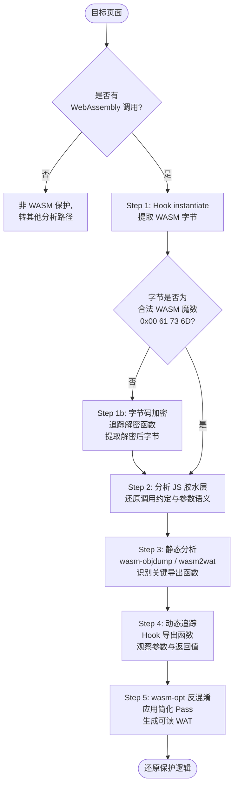

# WASM逆向（07）· WASM作为混淆壳

> [!abstract] TL;DR
> WASM 混淆壳将敏感逻辑从 JavaScript 下沉到 WebAssembly 字节码中，利用无符号名称、字节码不可读性和沙箱隔离三重屏障提升逆向难度。分析核心路径：拦截 `WebAssembly.instantiate` 提取字节 → 还原 JS 胶水层 → 静态反汇编 WAT → 动态 Hook 导出函数 → `wasm-opt` 反混淆。理解这一路径是分析 Web 端保护方案的基础能力。

> [!caution] 安全与合规声明
> 本章所有技术内容仅用于**安全研究、漏洞分析、CTF 竞赛和合法渗透测试**。对受版权保护的商业软件、DRM 系统或在线服务实施绕过攻击，在多数国家和地区属于违法行为（中国《计算机软件保护条例》、美国 DMCA、欧盟指令均有明确规定）。读者须在合法授权的范围内使用本章知识，作者及知识库对任何非法使用概不负责。

---

## 概述与定位

本章介绍 WASM 作为混淆壳的技术原理与分析路径。WASM 混淆壳将敏感逻辑从 JavaScript 下沉到 WebAssembly 字节码中，利用无符号名称、字节码不可读性和沙箱隔离制造分析障碍。与传统 VM 壳（VMProtect/Themida）相比，WASM 壳是 VM 保护思想在 Web 环境的实现——本章是进入第二部分"VM 壳逆向"前的过渡章节，承接前几章的 WASM 工具链知识。

---

## 一、为什么用 WASM 做保护壳

在 Web 安全对抗的历史上，JavaScript 混淆一度是保护敏感逻辑的主流手段。然而随着 `js-beautify`、`de4js`、AST 变换工具的成熟，纯 JS 混淆的对抗成本越来越低。开发者开始借助 WebAssembly 构建更高强度的保护层——这不是因为 WASM 从设计上是"安全"的，而是因为它在**可读性、分析工具链、运行环境隔离**三个维度同时制造障碍。

### 1.1 跨平台部署优势

一份 `.wasm` 文件在以下环境均可执行，无需修改：

- **浏览器**（Chrome/Firefox/Safari/Edge）：通过 `WebAssembly` JS API 加载
- **Node.js**：同样使用 `WebAssembly` 全局对象，与浏览器 API 兼容
- **服务端运行时**：WASI（WebAssembly System Interface）允许在 Wasmtime、Wasmer 等运行时直接执行
- **边缘计算**：Cloudflare Workers 原生支持 WASM 模块

这意味着一套保护逻辑可以在多平台复用，降低了保护方案的维护成本，也使防御侧无法通过"只分析某平台的本机代码"绕过保护。

### 1.2 WASM 字节码的天然混淆效果

与 JavaScript 文本源码相比，WASM 二进制字节码有以下特性对逆向分析构成障碍：

**无符号信息（Symbol Stripping）**：编译时（Emscripten/wasm-pack/AssemblyScript）默认丢弃函数名、变量名、类型名。反编译后函数名形如 `$func_0`、`$func_47`，与原始代码的语义完全断开。

**结构化控制流（Structured Control Flow）**：WASM 规范强制使用 `block`/`loop`/`if` 等结构化块，没有任意跳转（`goto`）。这一设计本意是安全性，但也使得控制流图的形状对逆向工程师相对陌生，等效的 WAT 文本比 C 伪代码更难阅读。

**栈式虚拟机语义**：WASM 是栈机，指令操作数不显式出现在指令中，而是由栈隐式传递。手动阅读 WAT 时需要在脑中维护栈状态，认知负荷远高于寄存器机汇编。

**类型擦除**：高层类型（字符串、数组、结构体）在编译后变为线性内存地址 + 整数偏移，语义信息全部丢失。

### 1.3 沙箱隔离增加动态分析难度

WASM 在独立的线性内存沙箱中运行：

- WASM 模块只能访问自己的线性内存（`memory`），无法直接读取 JS 堆或 DOM
- 与宿主环境的通信只能通过显式声明的 Import/Export 函数（能力边界清晰）
- WASM 执行栈对 JS 调试器不透明——Chrome DevTools 中断点调试 WASM 需要专用支持，且符号信息通常缺失

这些特性使得"在控制台随便打断点"无法直接揭示 WASM 内部逻辑，分析者必须采用更系统的方法。

### 1.4 典型应用场景

| 场景 | 保护目标 | 典型实现 |
|------|---------|---------|
| Web 游戏反作弊 | 碰撞检测、伤害计算、排行榜校验 | 核心逻辑编译为 WASM，服务端同步校验 |
| Web 版权保护 | 媒体解码密钥、水印嵌入算法 | 解密逻辑放入 WASM，JS 只传密文 |
| 软件授权验证 | License Key 校验、机器码绑定 | 验证函数编译为 WASM 导出 |
| JS 混淆器后端 | 控制流平坦化的执行引擎 | 用 WASM 实现 dispatch loop |

---

## 二、WASM 混淆技术详解

### 技术一：敏感逻辑下沉到 WASM

这是最基础也最常见的方案：将原本在 JavaScript 中运行的验证/加密/解密函数，用 C/C++/Rust 重写后编译为 WASM，再由 JS 胶水层（glue code）调用。

**典型代码结构**：

```javascript
// glue.js（混淆后的 JS 胶水层）
fetch('bundle.wasm')
  .then(response => response.arrayBuffer())
  .then(bytes => WebAssembly.instantiate(bytes, importObject))
  .then(result => {
    const { verify_license, get_feature_flags } = result.instance.exports;
    window._verify = verify_license;
    window._flags = get_feature_flags;
  });
```

```c
// 原始 C 源码（编译前，逆向工程师看不到）
#include <string.h>
int verify_license(const char* key, int len) {
    // 复杂的校验逻辑
    unsigned int hash = 5381;
    for (int i = 0; i < len; i++)
        hash = ((hash << 5) + hash) + key[i];
    return (hash ^ 0xDEADBEEF) == 0x12345678;
}
```

**识别方法**：在 JS 中搜索 `WebAssembly.instantiate`、`WebAssembly.compile`、`.wasm`，找到 WASM 二进制来源（fetch URL 或内联 base64），即可定位整个保护链的入口。

### 技术二：wasm-opt 混淆优化

Binaryen 工具链的 `wasm-opt` 工具（本质是 WASM 优化器）可被**反向利用**：通过特定选项不是简化代码，而是增加无意义复杂度。

```bash
# 混淆方向：增加复杂度，而非降低
wasm-opt \
  --generate-global-effects \
  --randomize-function-table-order \
  --duplicate-function-elimination=0 \
  --flatten \
  --local-cse \
  input.wasm -o obfuscated.wasm
```

这些 Pass 的效果：

- `--flatten`：将结构化控制流平坦化，增加嵌套块数量
- `--randomize-function-table-order`：打乱函数表中间接调用目标的顺序，使交叉引用分析失效
- `--generate-global-effects`：插入影响全局变量的副作用代码，迷惑数据流分析

结果：函数数量膨胀（可能增加 30%~200%），控制流嵌套层数增加，局部变量生命周期交叉复杂。

### 技术三：JS 胶水层混淆（双层保护）

单独混淆 WASM 还不够——JS 胶水层会暴露 WASM 导出函数的调用方式、参数语义、内存布局。保护方案通常对 JS 层叠加混淆：

```javascript
// 混淆前的胶水层（清晰）
exports.verify_license(ptr_key, key_length);

// 混淆后（obfuscator.io 控制流平坦化 + 变量名替换）
var _0x1a2b = ['\x69\x6e\x73\x74\x61\x6e\x74\x69\x61\x74\x65', ...];
(function(_0x3c4d, _0x5e6f) { /* 自解码逻辑 */ })(_0x1a2b, 0x1f4);
function _0x7g8h(_0x9i0j, _0xk1l2) {
    var _STATE = 0;
    while (true) {
        switch (_STATE) {
            case 0: _STATE = _0x9i0j > 0 ? 1 : 3; break;
            case 1: /* 实际调用 */ _STATE = 2; break;
            // ...
        }
    }
}
```

分析者必须先**还原 JS 胶水层**，才能理解 WASM 的调用约定。常用方法：

- 浏览器 Sources 面板 → Pretty Print（`{}`按钮）格式化压缩代码
- `js-beautify` CLI 工具格式化
- 手动追踪字符串数组解码逻辑（通常是自解码 + 旋转的字符串数组）

### 技术四：动态解密 WASM 字节码

最强的方案是**传输/存储时加密 WASM，运行时内存解密**：

```javascript
// 服务端返回加密的 WASM
fetch('/api/module')
  .then(r => r.arrayBuffer())
  .then(encrypted => {
    // 运行时解密（key 可能来自服务端、本地计算或用户输入）
    const key = deriveKey(userToken, sessionSalt);
    const decrypted = xorDecrypt(new Uint8Array(encrypted), key);
    return WebAssembly.instantiate(decrypted.buffer, importObject);
  });
```

常见加密方式：
- **XOR 解密**：最简单，key 通常硬编码或简单派生
- **AES-CTR 解密**：使用 Web Crypto API，key 来自服务端或 PBKDF2 派生
- **分块延迟解密**：只解密当前需要的函数块，防止一次性 dump

**识别特征**：`WebAssembly.instantiate` 的第一个参数不是 `fetch` 的直接结果，而是经过若干转换函数处理的中间变量。

---

## 三、五步分析方法



### Step 1：提取 WASM 二进制

最可靠的方法是**在 `WebAssembly.instantiate` 被调用前拦截**，在内存中直接捕获解密后的字节流：

```javascript
// 粘贴到浏览器 DevTools Console，在页面加载 WASM 之前执行
(function hookWASM() {
    const origInstantiate = WebAssembly.instantiate;
    const origInstantiateStreaming = WebAssembly.instantiateStreaming;

    // Hook WebAssembly.instantiate（接受 ArrayBuffer 或 BufferSource）
    WebAssembly.instantiate = async function(source, importObject) {
        let bytes;
        if (source instanceof ArrayBuffer) {
            bytes = new Uint8Array(source);
        } else if (ArrayBuffer.isView(source)) {
            bytes = new Uint8Array(source.buffer, source.byteOffset, source.byteLength);
        }

        if (bytes) {
            // 验证 WASM 魔数：\0asm
            const magic = [0x00, 0x61, 0x73, 0x6D];
            const isWasm = magic.every((b, i) => bytes[i] === b);
            if (isWasm) {
                console.log(`[WASM Hook] 捕获到 WASM 字节流，大小: ${bytes.length} bytes`);
                // 通过 Blob URL 触发下载
                const blob = new Blob([bytes], { type: 'application/wasm' });
                const url = URL.createObjectURL(blob);
                const a = document.createElement('a');
                a.href = url;
                a.download = `extracted_${Date.now()}.wasm`;
                document.body.appendChild(a);
                a.click();
                document.body.removeChild(a);
                setTimeout(() => URL.revokeObjectURL(url), 5000);
            }
        }
        return origInstantiate.apply(this, arguments);
    };

    // Hook WebAssembly.instantiateStreaming（接受 Response 对象）
    WebAssembly.instantiateStreaming = async function(source, importObject) {
        const response = await Promise.resolve(source);
        const clone = response.clone(); // 克隆响应，避免消耗原始流
        const buffer = await clone.arrayBuffer();
        const bytes = new Uint8Array(buffer);

        const magic = [0x00, 0x61, 0x73, 0x6D];
        if (magic.every((b, i) => bytes[i] === b)) {
            console.log(`[WASM Hook] 捕获到 Streaming WASM，大小: ${bytes.length} bytes`);
            const blob = new Blob([bytes], { type: 'application/wasm' });
            const a = Object.assign(document.createElement('a'), {
                href: URL.createObjectURL(blob),
                download: `streaming_${Date.now()}.wasm`
            });
            document.body.appendChild(a);
            a.click();
            document.body.removeChild(a);
        }
        return origInstantiateStreaming.call(this, source, importObject);
    };

    console.log('[WASM Hook] 已安装拦截器，等待 WASM 加载...');
})();
```

**替代方案**：
- Chrome DevTools → Network 面板 → 过滤 `.wasm` → 右键保存
- Chrome DevTools → Sources → 搜索 `wasm-` 文件 → 右键下载
- 使用 Burp Suite 拦截 WASM 响应（适用于未加密传输的情况）

### Step 2：分析 JS 胶水层

提取 WASM 字节后，必须理解 JS 侧如何调用 WASM 导出函数，才能给逆向分析提供上下文：

```javascript
// 在浏览器 Sources 面板中：
// 1. 找到主 JS 文件 → 点击 {} 按钮 Pretty Print
// 2. 搜索以下关键词定位调用点：
//    - WebAssembly
//    - instantiate / instantiateStreaming / compile / compileStreaming
//    - .exports
//    - memory / grow / buffer
//    - HEAPU8 / HEAP32（Emscripten 特征变量）

// 3. 找到调用点后，理解参数传递模式：
//    a. 直接值传参（整数/浮点数）：直接对应 WASM 函数参数
//    b. 字符串传参：字符串写入线性内存，传指针+长度
//    c. 复杂结构体：分解为多个整数，或写入内存传指针

// 示例：发现这样的调用
instance.exports.check_key(ptr, len, timestamp);
// 意味着 WASM 函数签名约为：(i32, i32, i64) -> i32
// ptr 是字符串在线性内存中的偏移，len 是长度，timestamp 是校验时间戳
```

### Step 3：静态分析 WASM

将提取的 WASM 文件转为可读文本格式进行静态分析：

```bash
# 1. 查看模块基本结构：Import/Export/Memory/Table 节
wasm-objdump -x extracted.wasm

# 典型输出：
# Type[12]:
#   - type[0] (i32, i32) -> i32
#   - type[1] (i32, i32, i32) -> void
# Import[3]:
#   - func[0] sig=4 <env.console_log>
#   - memory[0] pages: initial=1 <env.memory>
# Export[5]:
#   - func[42] <verify_license> -> "verify_license"
#   - memory[0] -> "memory"

# 2. 反汇编为 WAT 文本格式
wasm2wat extracted.wasm -o extracted.wat

# 3. 生成伪代码（可读性更高，但精度低于 WAT）
wasm-decompile extracted.wasm -o extracted.dcmp

# 4. 用 Ghidra + WASM 插件做更深入分析
# Ghidra 从 10.0 开始内置 WASM 支持：
# File → Import File → 选择 .wasm → 分析 → 查看 Decompiler 视图
```

WAT 分析技巧：
- 找导出函数（名称已知），从入口追踪数据流
- 关注 `call` 指令（直接调用）和 `call_indirect`（间接调用，常用于虚函数表）
- 注意 `i32.load`/`i32.store` 的偏移参数——这些是线性内存访问，可以推断结构体布局

### Step 4：动态追踪关键导出函数

静态分析确定候选函数后，用 Hook 在运行时观察实际参数和返回值：

```javascript
// 在 WebAssembly.instantiate 的 then 回调中植入 Hook
WebAssembly.instantiate = async function(source, importObject) {
    const result = await origInstantiate.call(this, source, importObject);
    const exports = result.instance.exports;
    const mem = exports.memory;

    // 辅助函数：从线性内存读取 C 字符串
    function readCStr(ptr, maxLen = 256) {
        const buf = new Uint8Array(mem.buffer, ptr, maxLen);
        const end = buf.indexOf(0); // 找 null 终止符
        return new TextDecoder().decode(buf.subarray(0, end >= 0 ? end : maxLen));
    }

    // Hook verify_license 导出函数
    if (exports.verify_license) {
        const orig = exports.verify_license;
        exports.verify_license = function(key_ptr, key_len) {
            const key_str = readCStr(key_ptr, key_len);
            console.group('[verify_license] 调用追踪');
            console.log('  key_ptr:', key_ptr, '  key_len:', key_len);
            console.log('  key 内容:', key_str);
            console.log('  key 字节:', Array.from(new Uint8Array(mem.buffer, key_ptr, key_len))
                .map(b => b.toString(16).padStart(2, '0')).join(' '));

            const retval = orig.call(this, key_ptr, key_len);
            console.log('  返回值:', retval);
            console.groupEnd();
            return retval;
        };
    }

    // 通用 Hook：对所有导出函数记录调用（适合初期探索）
    Object.keys(exports).forEach(name => {
        if (typeof exports[name] === 'function' && name !== 'memory') {
            const orig = exports[name];
            exports[name] = function(...args) {
                const ret = orig.apply(this, args);
                console.log(`[WASM] ${name}(${args.join(', ')}) => ${ret}`);
                return ret;
            };
        }
    });

    return result;
};
```

### Step 5：wasm-opt 反混淆

对于使用 `wasm-opt` 混淆的 WASM，可以反向应用优化 Pass 来简化：

```bash
# 应用多个简化/优化 Pass
wasm-opt \
  --simplify-locals \       # 简化局部变量使用
  --reorder-locals \        # 重排局部变量减少混乱
  --vacuum \                # 删除死代码
  --merge-blocks \          # 合并可以合并的块
  --remove-unused-names \   # 删除无用的块名称
  --coalesce-locals \       # 合并重叠生命周期的局部变量
  --optimize-instructions \ # 简化冗余指令序列
  extracted.wasm -o simplified.wasm

# 验证优化效果：比较函数数量
wasm-objdump -x extracted.wasm | grep "func\["  | wc -l
wasm-objdump -x simplified.wasm | grep "func\[" | wc -l

# 反汇编简化后的版本
wasm2wat simplified.wasm -o simplified.wat
```

注意：`wasm-opt` 简化并非万能。对于故意插入的不可达代码和永远为真/假的条件分支，需要结合动态分析的覆盖率信息（WASM Coverage Tracing）才能识别并剪除。

---

## 四、WASM 壳 vs 传统混淆对比

| 维度 | JavaScript 混淆 | WASM 壳 | 本机 VM 保护（如 VMProtect）|
|------|----------------|---------|--------------------------|
| **可读性** | 低（变量名替换、控制流平坦化）| 更低（字节码无符号）| 极低（自定义 ISA）|
| **符号保留** | 部分（字符串常量泄漏）| 无（编译时丢弃）| 无（完全抽象）|
| **提取难度** | 容易（源码在内存/网络明文）| 中等（需拦截 instantiate）| 难（需逆向 VM 解释器）|
| **静态分析工具** | AST 解析器（acorn/babel）| wabt/Ghidra/Radare2 | IDA Pro/专用分析工具 |
| **动态调试** | JS 调试器（DevTools 完整支持）| DevTools 部分支持（需 DWARF）| Pin/DynamoRIO/Intel PT |
| **运行环境** | 浏览器/Node.js | 浏览器/Node.js/WASI | Windows 本机（x86/x64）|
| **对抗反混淆** | JS 去混淆工具成熟度高 | 工具链相对不成熟 | 专业对抗研究成本极高 |
| **典型绕过时间** | 数分钟~数小时 | 数小时~数天 | 数天~数周 |

**结论**：WASM 壳是 JavaScript 混淆和本机 VM 保护之间的"中间态"——对非专业分析者有效，但对具备 WASM 工具链经验的逆向工程师而言，可以通过系统化的五步流程突破。

---

## 五、实战案例结构分析

以下以一个**虚构的开源 CTF 示例**（非真实商业软件）演示完整分析思路，帮助理解各步骤在实际环境中的应用。

### 案例：`wasm-auth-challenge`（开源 CTF 题）

**题目场景**：一个静态网页，输入序列号后 JS 调用 WASM 验证，正确时显示 flag。

**分析过程**：

1. **识别 WASM 调用**：打开 DevTools Network，发现 GET `/static/validator.wasm`（明文传输，直接保存）

2. **查看 Export**：
   ```bash
   wasm-objdump -x validator.wasm | grep "Export"
   # Export[2]:
   #   - func[15] <validate> -> "validate"
   #   - memory[0] -> "memory"
   ```

3. **分析 JS 胶水层**：
   ```javascript
   // 格式化后的调用代码
   function checkSerial(input) {
       const encoder = new TextEncoder();
       const bytes = encoder.encode(input);
       // 将字符串写入 WASM 线性内存
       const ptr = wasm_module.exports.malloc(bytes.length + 1);
       new Uint8Array(wasm_module.exports.memory.buffer)
           .set(bytes, ptr);
       // 调用验证函数
       const result = wasm_module.exports.validate(ptr, bytes.length);
       wasm_module.exports.free(ptr);
       return result === 1;
   }
   ```

4. **静态分析 WAT**：找到 `validate` 函数，发现本质是对输入字节逐位进行算术变换后与硬编码常量比较。

5. **逆推正确输入**：变换是可逆的（加法 + XOR），写脚本反推原始输入即为正确序列号。

这个思路适用于 CTF 场景。在真实的保护方案中，步骤会更复杂（服务端校验、时间戳绑定、机器指纹等）。

---

## 六、防御视角：如何加固 WASM 保护

从**防御端**了解加固手段，有助于分析时判断对手采用了哪些层次的保护：

**加固层次一：符号消除**（基础，所有编译器默认）
- 去除 DWARF 调试符号（`-g0`）
- 导出函数名用哈希替换（`export_0xdeadbeef`）

**加固层次二：代码混淆**（中等）
- `wasm-opt` 混淆 Pass（如前述）
- 插入 opaque predicate（永真/永假条件）迷惑静态分析

**加固层次三：传输层保护**（较强）
- WASM 字节码加密传输，运行时解密（AES-GCM）
- Key 来自服务端一次性令牌，无法离线分析

**加固层次四：环境检测**（对抗动态分析）
- 检测 Hook 特征：`WebAssembly.instantiate.toString()` 是否被篡改
- 检测调试器：Timing Attack（`performance.now()` 精度检测）
- 检测 DevTools 是否打开（窗口大小变化检测）

**加固层次五：服务端协同**（最强）
- 关键决策（授权/解密）只在服务端进行
- WASM 只做本地数据预处理，无法单独完成验证

理解这些层次帮助分析者在动手前**评估工作量**，并制定合适的分析策略。

---

## 七、工具速查

| 工具 | 用途 | 获取方式 |
|------|------|---------|
| `wasm2wat` | WASM → WAT 文本格式反汇编 | `wabt` 工具包（GitHub: WebAssembly/wabt）|
| `wasm-objdump` | 查看 WASM 节结构（Import/Export/Memory）| 同上 |
| `wasm-decompile` | 生成高层伪代码 | 同上 |
| `wasm-opt` | 混淆/反混淆/优化 | `binaryen` 工具包 |
| Ghidra + wasm.so | 完整反编译（支持 Ctrl+Alt+F 交叉引用）| ghidra.re + wasm 插件 |
| Radare2 + r2wasm | 命令行分析 WASM | r2 + r2-rasm2-wasm |
| Chrome DevTools | 提取网络加载的 WASM，调试胶水层 | 浏览器内置 |
| `wasmer` / `wasmtime` | 独立运行 WASM，结合 WASI 测试 | wasmer.io / wasmtime.dev |

---

## 安全性与正确使用

> [!tip] 合规使用说明
> 本章介绍的 WASM 混淆壳分析技术（`WebAssembly.instantiate` Hook、wasm-opt 反混淆、导出函数 Hook）用于：
> - **合法安全研究**：Web 应用安全审计、CTF 竞赛、漏洞研究
> - **防御评估**：评估自有 Web 应用使用 WASM 混淆保护的强度
>
> 不应将这些技术用于对第三方 Web 服务、DRM 系统或在线游戏的未授权逆向分析。本章的 `[!caution]` 声明适用于本章所有内容。

### 注意事项

- **浏览器扩展 Hook**：拦截 `WebAssembly.instantiate` 仅在自己控制的页面或有明确授权的情况下进行
- **wasm-opt 反混淆**：`--flatten --rereloop` 等操作仅对分析用途的副本进行，不要修改并重新发布受版权保护的文件
- **提取的字节码**：从第三方 WASM 应用提取的字节码受著作权保护，仅供研究目的使用

## 小结

本章梳理了 WASM 作为混淆壳的三重屏障（无符号名称、字节码不可读、沙箱隔离），详细拆解了五步分析路径：拦截 `WebAssembly.instantiate` 提取字节码 → 还原 JS 胶水层 → 静态反汇编 WAT → 动态 Hook 导出函数 → `wasm-opt` 反混淆。对比了 WASM 壳与传统混淆（JS 混淆、VM 壳）的优劣势，并介绍了识别典型 WASM 混淆技术（控制流平坦化、字符串加密、插桩混淆）的实战方法。

---

## 相关阅读

- `[[09.虚拟化保护壳总览]]`：WASM 壳是 VM 保护思想在 Web 环境的实现，理解其与传统 VM 壳（VMProtect/Themida）的设计异同
- `[[45.反编译器与反汇编引擎原理/10.虚拟化保护逆向原理]]`：VM 保护逆向的通用方法论，部分思路可迁移到 WASM 混淆壳分析
- WASM 规范（webassembly.github.io/spec）：理解结构化控制流的语义有助于阅读 WAT
- Binaryen 文档（github.com/WebAssembly/binaryen）：`wasm-opt` 所有 Pass 的说明

---

⬅️ 上一篇 [[06.WASM内存模型与线性内存安全]] ｜ 🏠 [[00.WASM与虚拟化壳逆向总览]] ｜ 下一篇 [[08.WASM CTF实战]] ➡️
