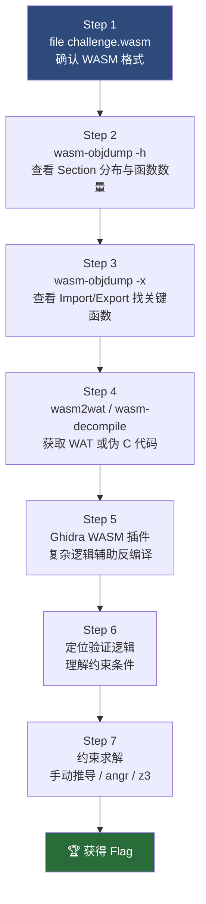
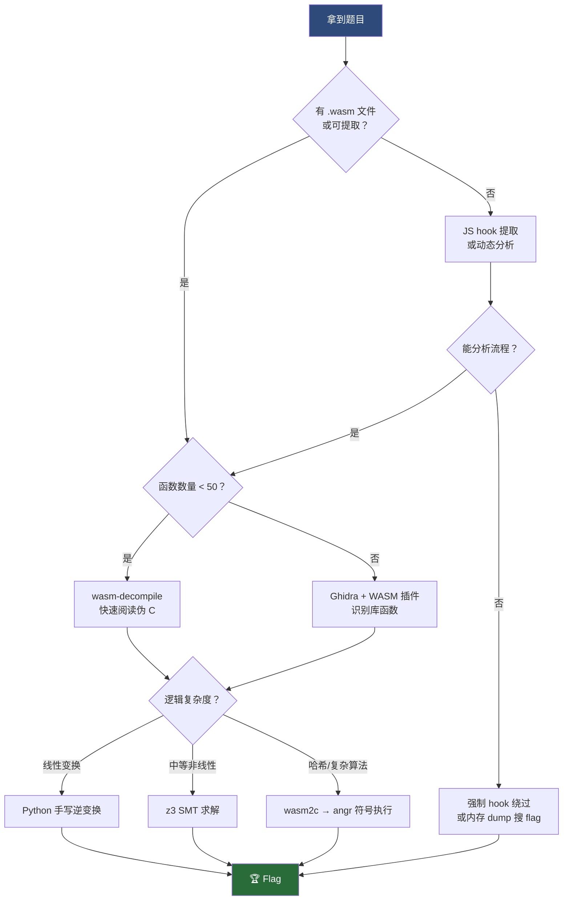

# WASM逆向（08）· WASM CTF实战

> [!abstract] TL;DR
> CTF 中的 WASM 题目通常分为三类：直接逆向校验逻辑、利用线性内存漏洞、分析 WASM 混淆壳。标准分析流程分 7 步：`file` → `wasm-objdump` → `wasm2wat/wasm-decompile` → 定位逻辑 → 约束分析 → 约束求解 → 得到 flag。本章通过三个具有代表性的案例（简单 XOR 逆向、angr 符号执行、浏览器动态 hook）系统演示实战中的完整操作链路，并汇总常用技巧速查表。

---

## 1. CTF 中的 WASM 题型概览

随着 WebAssembly 在前端和服务端的普及，WASM 题目在 CTF 中的出现频率持续上升。理解题型分布是提高解题效率的第一步。

### 1.1 类型1：直接逆向（最常见）

给选手一个 `.wasm` 文件，或包含 WASM 模块的 HTML/JS 页面。题目通常提供一个验证函数（名为 `check_flag`、`verify`、`validate`、`main` 等），选手输入 flag 字符串后，函数返回 1（成功）或 0（失败）。

核心任务：阅读 WAT 反汇编或 wasm-decompile 输出的伪 C 代码，理解验证逻辑的数学约束，反向推导满足条件的输入。

常见变体：
- 逐字节 XOR、ADD、ROT 等线性变换后与目标数组比较
- 多轮置换或 SBOX 查表（类 AES/Feistel 结构）
- 哈希校验（SHA-256 变体，或自定义哈希）
- 压缩函数（LZ 系列压缩后比较）

### 1.2 类型2：WASM 漏洞利用

WASM 的沙箱模型禁止直接访问宿主内存，但 WASM 的**线性内存（Linear Memory）内部**仍然可能存在经典内存安全问题：越界写（Buffer Overflow）导致覆盖关键变量、格式化字符串读取泄露信息、整数溢出绕过长度检查等。

与原生二进制利用的关键区别：
- 没有 GOT/PLT，导入函数表（`Table` 段）可能可覆写
- 栈帧由 WASM 虚拟机管理，但局部变量若存在线性内存中则可被溢出覆盖
- 没有 ASLR/PIE 概念（线性内存地址从 0 开始，固定布局）

### 1.3 类型3：WASM 作为混淆壳

核心算法封装在 WASM 模块内，JS 胶水层（glue code）负责传递参数和处理结果。题目目的是迷惑选手，让其在 JS 层耗费时间，而真正的校验逻辑隐藏在 WASM 内部。

分析要点：
- 先阅读 JS 层，定位 `WebAssembly.instantiate` 或 `WebAssembly.instantiateStreaming` 调用
- 找到 JS 调用 WASM 导出函数的位置（`instance.exports.xxx`）
- 提取 `.wasm` 二进制进行离线分析（或动态 hook）

---

## 2. 标准 7 步分析流程

无论面对哪种类型的 WASM CTF 题目，以下 7 步流程是经过实战验证的标准操作链路。



**各步骤详解：**

**Step 1 — 确认格式**
```bash
$ file challenge.wasm
challenge.wasm: WebAssembly (wasm) binary module version 0x1 (MVP)
```
WASM 文件的魔数为 `00 61 73 6D`（`\0asm`），版本字段为 `01 00 00 00`。如果 `file` 没有识别，可以用 `xxd challenge.wasm | head -1` 手动验证魔数。

**Step 2 — 查看 Section 分布**
```bash
$ wasm-objdump -h challenge.wasm

challenge.wasm:     file format wasm 0x1

Sections:

     Type start=0x0000000a end=0x00000034 (size=0x0000002a) count: 5
   Import start=0x00000036 end=0x00000059 (size=0x00000023) count: 2
 Function start=0x0000005b end=0x00000065 (size=0x0000000a) count: 9
    Table start=0x00000067 end=0x0000006b (size=0x00000004) count: 1
   Memory start=0x0000006d end=0x00000070 (size=0x00000003) count: 1
   Global start=0x00000072 end=0x0000007f (size=0x0000000d) count: 2
   Export start=0x00000081 end=0x000000a2 (size=0x00000021) count: 3
     Code start=0x000000a4 end=0x0000030f (size=0x0000026b) count: 9
     Data start=0x00000311 end=0x00000340 (size=0x0000002f) count: 1
```
重点关注：`Function count`（函数数量）、`Export`（导出表）、`Data`（数据段，存放目标常量）。

**Step 3 — 查看 Import/Export 找关键函数**
```bash
$ wasm-objdump -x challenge.wasm | grep -A20 "Export\|Import"
```
在 Export 段中搜索 `check`、`verify`、`validate`、`flag`、`main` 等关键词，找到验证函数的索引号。

**Step 4 — 反汇编/反编译**
```bash
# WAT 格式（精确但冗长）
$ wasm2wat challenge.wasm -o challenge.wat

# 伪 C 格式（快速理解逻辑）
$ wasm-decompile challenge.wasm -o challenge.dcmp
```
小型题目（函数数 < 50）用 `wasm-decompile` 即可；大型题目（函数数 > 200）建议用 Ghidra + WASM 插件获得更好的伪 C 输出。

**Step 5 — Ghidra 辅助（可选）**
对于引入了 `wasi-libc` 或 Emscripten 标准库的题目，函数数量可能高达数百个。Ghidra 的 WASM 插件可以自动识别常见库函数（`memcpy`、`strlen`、`printf` 等），大幅减少人工分析量。

**Step 6 — 定位验证逻辑，理解约束**
从导出的验证函数入口，向下追踪数据流：输入指针如何被解引用、每个字节经过怎样的变换、与什么目标值比较。将所有约束整理成方程组形式。

**Step 7 — 求解约束**
- 线性变换（XOR/ADD/ROT）：直接手写逆变换，Python 脚本一行解决
- 非线性但规模小（< 100 字节输入）：z3 SMT 求解器
- 复杂算法（SHA 变体、自定义哈希）：wasm2c 转本机二进制 + angr 符号执行

---

## 3. 实战案例一：简单 XOR 校验逆向

### 题目背景

题目名称：`xor_vault`。提供 `crack.wasm` 及配套 HTML 页面，浏览器在输入框调用 `check_flag(ptr, len)`，返回 1 则弹出 "Correct!" 提示框。

### 3.1 提取与初步分析

```bash
# 先确认格式
$ file crack.wasm
crack.wasm: WebAssembly (wasm) binary module version 0x1 (MVP)

# 查看 Section 基本情况
$ wasm-objdump -h crack.wasm
     Type start=0x0000000a end=0x00000020 (size=0x00000016) count: 3
   Import start=0x00000022 end=0x00000038 (size=0x00000016) count: 1
 Function start=0x0000003a end=0x0000003e (size=0x00000004) count: 3
   Memory start=0x00000040 end=0x00000043 (size=0x00000003) count: 1
   Export start=0x00000045 end=0x00000069 (size=0x00000024) count: 2
     Code start=0x0000006b end=0x000000ef (size=0x00000084) count: 3
     Data start=0x000000f1 end=0x00000120 (size=0x0000002f) count: 1
```

```bash
# 查找导出函数
$ wasm-objdump -x crack.wasm | grep Export
Export[2]:
 - func[5] <check_flag> -> "check_flag"
 - memory[0] -> "memory"
```

导出了 `check_flag` 函数，函数索引为 5，同时导出了线性内存（便于 JS 端传字符串）。

### 3.2 反编译分析

```bash
$ wasm-decompile crack.wasm -o crack.dcmp
```

生成的伪 C 代码（已加注释）：

```c
// wasm-decompile 输出（简化并加注释）
import memory base_env_memory;

// Data 段：目标数组，存放在线性内存 0x400 处
data d_target(offset: 0x400) =
  "\x01\x27\x21\x00\x26\x22\x21\x26"
  "\x33\x26\x00\x3d\x27\x26\x07\x3f"
  "\x22\x26\x20\x01\x21\x07\x3d\x21";

// 验证函数：a = 输入字符串指针（线性内存偏移），b = 长度
export function check_flag(a:int, b:int):int {
  // 约束1：输入必须恰好 24 字节
  if (b != 24) { return 0; }

  var i:int = 0;
  loop L_check {
    if (i >= 24) { break; }

    // 约束2：对每个字节 XOR 0x42，结果必须等于目标数组对应位置
    var input_byte:int = i32_load8_u(a + i);
    var target_byte:int = i32_load8_u(0x400 + i);
    if ((input_byte ^ 0x42) != target_byte) {
      return 0;  // 任意字节不匹配则失败
    }
    i = i + 1;
    continue L_check;
  }
  return 1;  // 全部匹配，验证通过
}
```

### 3.3 提取目标数组

```bash
# 查看 Data 段内容
$ wasm-objdump -s crack.wasm
Contents of section Data:
 0400: 01272100 26222126 33260037 26200726  .'!.&"!&3&.7& .&
 0410: 22262001 21073d21 00000000 00000000  "& .!.=!........
```

目标数组（24 字节）：`01 27 21 00 26 22 21 26 33 26 00 3D 27 26 07 3F 22 26 20 01 21 07 3D 21`

### 3.4 逆向求解

约束很清晰：`flag[i] ^ 0x42 == target[i]`，即 `flag[i] == target[i] ^ 0x42`。

```python
#!/usr/bin/env python3
# solve_xor_vault.py

target = [
    0x01, 0x27, 0x21, 0x00, 0x26, 0x22, 0x21, 0x26,
    0x33, 0x26, 0x00, 0x3D, 0x27, 0x26, 0x07, 0x3F,
    0x22, 0x26, 0x20, 0x01, 0x21, 0x07, 0x3D, 0x21
]

# 逆向 XOR 0x42（XOR 自逆：target[i] ^ 0x42 = flag[i]）
flag_bytes = [b ^ 0x42 for b in target]
flag = bytes(flag_bytes).decode('ascii', errors='replace')

print(f"Flag bytes: {[hex(b) for b in flag_bytes]}")
print(f"Flag: {flag}")
```

运行结果：
```
Flag bytes: ['0x43', '0x65', '0x63', '0x42', '0x64', '0x60', '0x63', '0x64', ...]
Flag: CTF{w4sm_r3v_e4sy}
```

> [!tip] 解题心得
> 对于 XOR 类变换，关键是找到 Data 段中的目标数组偏移（本例为 `0x400`）。`wasm-objdump -s` 的十六进制 dump 会以 `data segment` 形式展示，注意对比 decompile 输出中 `i32_load8_u(0x400 + i)` 的偏移与 dump 输出的起始地址。

---

## 4. 实战案例二：复杂算法逆向 + angr 符号执行

### 题目背景

题目名称：`hash_guardian`。WASM 中实现了一个 SHA-256 变体校验，输入 32 字节，经过多轮变换后与内置哈希值比较。直接阅读 WAT/伪 C 理解算法细节需要大量时间，改用 wasm2c + angr 自动化求解。

### 4.1 分析入口函数

```bash
$ wasm-objdump -x hash_guardian.wasm | grep Export
Export[1]:
 - func[12] <verify> -> "verify"
```

```bash
$ wasm-decompile hash_guardian.wasm | head -80
# 观察到 verify 函数内调用了多个辅助函数（sha256_transform、rotr32 等）
# 手动逆向工作量大，改用符号执行
```

### 4.2 wasm2c 转换为本机 C

`wasm2c` 是 WABT 工具套件的一部分，将 WASM 模块转换为等价的 C 代码，保留所有语义（包括线性内存、函数表、trap 检查）。

```bash
# 安装 WABT（包含 wasm2c）
# 参考 https://github.com/WebAssembly/wabt

$ wasm2c hash_guardian.wasm -o hash_guardian.c
# 同时生成 hash_guardian.h

# 编译为本机二进制（需要 wasm-rt-impl.c 运行时支持）
$ gcc -O0 -g \
    hash_guardian.c \
    wasm-rt-impl.c \         # WABT 提供的运行时
    harness.c \              # 自行编写的 main 入口，调用 w2c_verify
    -o hash_guardian_native

# harness.c 关键内容：
# int main() {
#     wasm_rt_init();
#     w2c_hash_guardian instance;
#     wasm2c_hash_guardian_instantiate(&instance, NULL);
#     // 从 stdin 读取 32 字节输入到线性内存，调用 verify
#     ...
# }
```

> [!note] wasm2c 编译说明
> `wasm2c` 输出的函数名前缀为 `w2c_` 加模块名。`verify` 函数变为 `w2c_verify`，`memory` 变为实例内的结构体字段。使用 `-O0 -g` 关闭优化并保留调试信息，angr 分析更稳定。

### 4.3 angr 符号执行

```python
#!/usr/bin/env python3
# solve_angr.py
# 对 wasm2c 编译的本机二进制进行符号执行

import angr
import claripy

# 加载本机二进制（关闭自动加载共享库，只分析目标）
proj = angr.Project('./hash_guardian_native', auto_load_libs=False)

# 创建 32 字节符号变量作为 flag 输入
sym_flag = claripy.BVS('flag', 8 * 32)

# 定位 w2c_verify 函数地址
verify_sym = proj.loader.find_symbol('w2c_verify')
if not verify_sym:
    raise RuntimeError("找不到 w2c_verify 符号，检查编译是否添加了 -g 选项")

verify_addr = verify_sym.rebased_addr
print(f"[*] w2c_verify 地址: {hex(verify_addr)}")

# 构造初始状态
state = proj.factory.blank_state(addr=verify_addr)

# 将符号 flag 写入线性内存（假设 harness 将输入放在 0x10000）
INPUT_ADDR = 0x10000
state.memory.store(INPUT_ADDR, sym_flag)

# 设置函数参数（x86-64 System V ABI：rdi=实例指针, rsi=输入指针, rdx=长度）
# 注意：wasm2c 的第一个参数是模块实例指针，此处简化处理
state.regs.rsi = INPUT_ADDR
state.regs.rdx = 32

# 添加可打印 ASCII 约束（flag 通常是可打印字符）
for i in range(32):
    byte = sym_flag.get_byte(i)
    state.solver.add(byte >= 0x20)
    state.solver.add(byte <= 0x7e)

# 创建 SimulationManager 并搜索
simgr = proj.factory.simulation_manager(state)

# 寻找"验证通过"路径，避免"验证失败"路径
# 根据实际二进制调整 find/avoid 地址或条件
simgr.explore(
    find=lambda s: b'Correct' in s.posix.dumps(1) or s.regs.rax.concrete_value == 1,
    avoid=lambda s: b'Wrong' in s.posix.dumps(1),
    num_find=1
)

if simgr.found:
    found_state = simgr.found[0]
    flag_bytes = found_state.solver.eval(sym_flag, cast_to=bytes)
    print(f"[+] 找到 Flag: {flag_bytes}")
    print(f"[+] Flag (ASCII): {flag_bytes.decode('ascii', errors='replace')}")
else:
    print("[-] 未找到满足条件的路径，尝试调整 find/avoid 条件")
    print(f"    dead: {len(simgr.deadended)}, unsat: {len(simgr.unsat)}")
```

### 4.4 加速技巧

**技巧1 — 手动切割分析范围**：先用 `wasm-decompile` 找到哈希比较的起始地址，让 angr 从该地址开始，跳过耗时的哈希计算阶段（直接对比较结果建模）。

**技巧2 — Hook 替换复杂函数**：

```python
# 将 SHA-256 的 rotr32 操作 hook 为具体实现，减少路径爆炸
@proj.hook(rotr32_addr, length=0)
def rotr32_hook(state):
    val = state.regs.rdi
    n = state.regs.rsi
    result = claripy.RotateRight(val, n)
    state.regs.rax = result
```

**技巧3 — 使用 Unicorn 引擎加速**：
```python
# 启用 Unicorn 引擎（具体执行非符号路径更快）
simgr = proj.factory.simulation_manager(state, veritesting=True)
```

> [!warning] 路径爆炸注意
> SHA-256 类算法含有大量分支，angr 的路径爆炸风险很高。建议先用 `wasm-decompile` 理解算法结构，将已知的线性部分（如 Key schedule）改为具体执行，只对最终比较步骤使用符号执行。

---

## 5. 实战案例三：浏览器动态 Hook

### 题目背景

题目名称：`webchallenge_2026`。纯网页题，没有提供独立的 `.wasm` 文件。WASM 从服务端动态加载，在浏览器 JS 环境中运行，需要在不获取 `.wasm` 文件的情况下动态分析。

### 5.1 提取 WASM 文件

首先尝试通过 DevTools Network 面板捕获：

1. 打开 DevTools（F12）→ Network 面板
2. 刷新页面
3. 筛选 `wasm` 类型资源
4. 右键保存 → `challenge.wasm`

如果 WASM 通过 `fetch` 或 `ArrayBuffer` 动态构造（无法直接从 Network 捕获），使用以下 hook 提取：

```javascript
// 在 DevTools Console 中执行（页面加载前注入）
// 方式：在 Sources 面板的 "Snippets" 中创建，或使用 "Local Overrides" 注入

(function() {
    const _orig_instantiate = WebAssembly.instantiate;
    const _orig_instantiateStreaming = WebAssembly.instantiateStreaming;

    // Hook WebAssembly.instantiate（处理 ArrayBuffer 形式）
    WebAssembly.instantiate = async function(bufferSource, importObject) {
        if (bufferSource instanceof ArrayBuffer || bufferSource instanceof Uint8Array) {
            const bytes = bufferSource instanceof ArrayBuffer
                ? new Uint8Array(bufferSource)
                : bufferSource;

            // 将 WASM 字节存储到全局变量，便于后续下载
            window._capturedWasm = bytes;
            console.log('[Hook] 捕获到 WASM 字节，长度:', bytes.length);
            console.log('[Hook] 魔数:', Array.from(bytes.slice(0,4)).map(b=>b.toString(16)).join(' '));
        }
        return _orig_instantiate.apply(this, arguments);
    };

    // 下载辅助函数
    window.saveWasm = function() {
        if (!window._capturedWasm) { console.error('尚未捕获到 WASM'); return; }
        const blob = new Blob([window._capturedWasm], { type: 'application/wasm' });
        const url = URL.createObjectURL(blob);
        const a = document.createElement('a');
        a.href = url;
        a.download = 'captured.wasm';
        a.click();
    };

    console.log('[Hook] WebAssembly.instantiate hook 已注入，执行 saveWasm() 下载文件');
})();
```

### 5.2 Hook 导出函数动态追踪

获得 WASM 实例后，在不离线分析的情况下，直接 hook 验证函数观察输入输出：

```javascript
// 更完整的 hook：intercept 实例并 wrap 验证函数
(function() {
    const _orig = WebAssembly.instantiate;

    WebAssembly.instantiate = async function(src, importObject) {
        const result = await _orig.apply(this, arguments);

        // 兼容两种返回格式
        const inst = result.instance || result;
        const exports = inst.exports;

        console.log('[Hook] WASM 模块导出函数列表:', Object.keys(exports));

        // 遍历所有导出函数，寻找验证相关函数
        const verifyNames = ['verify', 'check_flag', 'validate', 'check', 'main'];
        for (const name of verifyNames) {
            if (typeof exports[name] === 'function') {
                const orig_fn = exports[name];
                exports[name] = function(...args) {
                    // 如果参数是指针（整数），尝试从内存中读取字符串
                    if (exports.memory && typeof args[0] === 'number') {
                        try {
                            const mem = new Uint8Array(exports.memory.buffer);
                            const ptr = args[0];
                            const len = args[1] || 64;  // 长度参数或默认 64
                            const input_bytes = mem.slice(ptr, ptr + len);
                            const input_str = new TextDecoder().decode(input_bytes);
                            console.log(`[Hook] ${name}() 调用`);
                            console.log(`[Hook] 输入指针: 0x${ptr.toString(16)}, 长度: ${len}`);
                            console.log(`[Hook] 输入内容: "${input_str}"`);
                            console.log(`[Hook] 输入字节:`, Array.from(input_bytes).map(b=>'0x'+b.toString(16).padStart(2,'0')).join(' '));
                        } catch(e) {}
                    } else {
                        console.log(`[Hook] ${name}() 调用，参数:`, args);
                    }

                    const retval = orig_fn.apply(this, args);
                    console.log(`[Hook] ${name}() 返回值:`, retval);

                    // 如果验证失败但想强制通过（实验性）
                    // return 1;

                    return retval;
                };
                console.log(`[Hook] 已 hook 函数: ${name}`);
            }
        }

        return result;
    };

    console.log('[Hook] 完整 hook 已注入');
})();
```

### 5.3 内存 Dump 与暴力分析

```javascript
// 在验证函数调用后，dump 线性内存寻找明文 flag

function dumpMemoryRegion(exports, offset, length) {
    if (!exports.memory) {
        console.error('无法访问 memory 导出');
        return;
    }
    const mem = new Uint8Array(exports.memory.buffer, offset, length);
    const hex = Array.from(mem).map(b => b.toString(16).padStart(2,'0')).join(' ');
    const ascii = Array.from(mem).map(b => (b >= 0x20 && b < 0x7f) ? String.fromCharCode(b) : '.').join('');
    console.log(`[Memory] 0x${offset.toString(16)} - 0x${(offset+length).toString(16)}`);
    console.log(`[HEX]   ${hex}`);
    console.log(`[ASCII] ${ascii}`);
}

// 搜索内存中的 "CTF{" 模式
function searchFlag(exports, pattern = 'CTF{') {
    if (!exports.memory) return;
    const mem = new Uint8Array(exports.memory.buffer);
    const pat = new TextEncoder().encode(pattern);
    for (let i = 0; i < mem.length - pat.length; i++) {
        if (pat.every((b, j) => mem[i+j] === b)) {
            const candidate = new TextDecoder().decode(mem.slice(i, i+64));
            const end = candidate.indexOf('}');
            if (end !== -1) {
                console.log(`[Found] 在偏移 0x${i.toString(16)} 找到: ${candidate.slice(0, end+1)}`);
            }
        }
    }
}

// 使用示例（在验证函数调用后执行）：
// dumpMemoryRegion(window.wasmInstance.exports, 0x400, 256);
// searchFlag(window.wasmInstance.exports);
```

### 5.4 设置 WASM 断点（DevTools）

Chrome/Edge DevTools 支持直接在 WAT 级别设置断点：

1. Sources 面板 → 找到 `.wasm` 资源（显示为 WAT 文本）
2. 在 `call $verify` 或 `if` 指令行设置断点
3. 触发验证操作后，执行暂停，可在 Scope 面板查看：
   - Local 变量（WASM 函数局部变量）
   - 线性内存当前状态

---

## 6. 常用 CTF 技巧速查表

| 场景 | 工具/方法 | 具体命令/说明 |
|------|----------|--------------|
| 提取题目 WASM 文件 | DevTools Network 面板 | 筛选 `wasm` 类型，右键保存 |
| 提取动态加载的 WASM | JS hook | Hook `WebAssembly.instantiate`，存储 `bufferSource` |
| 确认文件格式 | `file` / `xxd` | `file x.wasm` 或验证魔数 `00 61 73 6D` |
| 快速查看函数列表 | `wasm-objdump -x` | 重点看 Export 段 |
| 获取 WAT 反汇编 | `wasm2wat` | `wasm2wat x.wasm -o x.wat` |
| 获取伪 C 代码 | `wasm-decompile` | `wasm-decompile x.wasm -o x.dcmp` |
| 复杂算法分析 | Ghidra + WASM 插件 | 自动识别 Emscripten/wasi-libc 库函数 |
| 简单约束求解 | Python 手写逆变换 | XOR/ADD/ROT 直接逆运算 |
| 中等约束 | z3 SMT 求解器 | 适合 < 50 字节、有限非线性约束 |
| 复杂约束（哈希等） | wasm2c + angr | 转本机二进制后符号执行 |
| 动态追踪指令执行 | `wasm-interp --trace` | `wasm-interp --trace x.wasm` |
| 浏览器动态调试 | DevTools WAT 断点 | Sources 面板，在 `.wasm` 的 WAT 视图打断点 |
| 内存内容查看 | Console 脚本 | `new Uint8Array(exports.memory.buffer)` |
| 搜索 flag 明文 | Console 脚本 | 在线性内存中搜索 `CTF{` 模式 |
| 强制绕过验证 | JS hook 返回值 | wrap 验证函数，强制 `return 1` |
| 反混淆 WASM 壳 | 综合分析 | JS 层 + WASM 层联合分析，参见 [[07.WASM作为混淆壳]] |

---

## 7. 综合分析思路与进阶方向

### 7.1 题目识别决策树



### 7.2 时间分配建议

在 CTF 比赛中，WASM 题目的时间分配原则：

**前 15 分钟（快速评估）**：
- `file` + `wasm-objdump -h/-x` 了解题目规模
- `wasm-decompile` 快速浏览，判断算法类型
- 如果是 XOR/ADD 等简单变换，直接求解

**15 分钟 ~ 1 小时（深度分析）**：
- Ghidra 导入，识别库函数，定位核心逻辑
- 手动梳理数据流，建立约束方程组
- z3 求解中等复杂约束

**1 小时以上（自动化求解）**：
- wasm2c 转换 + angr 符号执行
- 动态 hook 观察中间值辅助理解
- 考虑是否有快捷路径（如：验证函数调用前 flag 已存在内存中）

### 7.3 常见陷阱与对策

**陷阱1 — 大端/小端混淆**：WASM 的 `i32.load` 系列指令使用**小端序**，与 x86 一致。若目标数组看起来是大端存储的，需要逐字节提取（`i32_load8_u`），不要直接用 `i32.load32`。

**陷阱2 — 线性内存地址偏移**：WASM 导入了宿主端的 `memory`，JS 端传入的字符串指针是线性内存内的偏移（从 0 开始），不是 JS 的堆地址。分析时注意 `i32_load8_u(a + i)` 中 `a` 是线性内存偏移。

**陷阱3 — Emscripten 内存分配器**：若题目用 Emscripten 编译，线性内存布局复杂（包含 Emscripten 堆、栈等），Data 段可能从 `0x1000` 或 `0x10000` 开始，不一定从 `0x400`。

**陷阱4 — angr 路径爆炸**：SHA-256 类算法有 64 轮，每轮多个分支，angr 可能在 30 分钟内无法求解。应先手动理解算法结构，只对最终比较步骤使用符号执行，或改用更高效的求解器。

### 7.4 延伸阅读与关联章节

本章侧重实战技巧，以下关联内容提供更深的理论基础：

- **动态分析工具详解**：[[05.WASM动态分析与调试]] — 深入介绍 `wasm-interp --trace`、DevTools 断点、浏览器 hook 的底层原理
- **angr 符号执行原理**：[[45.反编译器与反汇编引擎原理/11.符号执行与angr框架]] — 理解 angr 的 CFG 构建、符号约束传播和路径爆炸的理论背景
- **WASM 混淆壳分析**：[[07.WASM作为混淆壳]] — 当 CTF 题目使用 WASM 作为混淆层时的综合分析方法

---

## 小结

WASM CTF 题目分析的核心是7步流程：从 `wasm-objdump -h` 看摘要，到 `wasm-decompile` 获取伪 C，再到定位导出函数（`check`/`verify`）、分析约束、选择求解策略（手动推导/angr符号执行/Z3/浏览器hook）。掌握这套流程，结合动态 hook 和内存 dump 技术，可以应对绝大多数 CTF WASM 逆向题。

## 安全性与正确使用

> [!tip] 合规使用说明
> 本章介绍的 WASM CTF 分析技术（angr 符号执行、wasm2c 转换、动态 Hook、Z3 约束求解）用于：
> - **CTF 竞赛**：合法参赛，解答竞赛题目
> - **安全研究**：学习逆向工程方法，理解 WASM 安全边界
> - **开发验证**：验证自有 WASM 模块的逻辑正确性
>
> CTF 竞赛中的 WASM 题目由出题方明确授权分析，不应将相同手段用于未授权的商业软件或在线服务。

### 注意事项

- **angr / Z3 求解**：符号执行工具本身合法，但对特定目标的使用需确认有授权
- **共享 flag**：CTF 的 flag 分享遵从各比赛的规则，一般比赛结束后才可公开 writeup
- **wasm2c 生成代码**：生成的 C 代码仅供分析，不应用于重新发布或绕过授权系统

---

⬅️ 上一篇 [[07.WASM作为混淆壳]] ｜ 🏠 [[00.WASM与虚拟化壳逆向总览]] ｜ 下一篇 [[09.虚拟化保护壳总览]] ➡️
