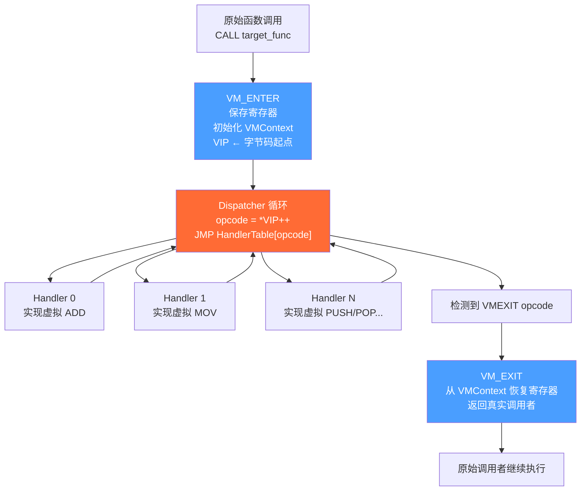

# WASM逆向（09）· 虚拟化保护壳总览

> [!abstract] TL;DR
> 虚拟化保护壳（VM 壳）将原始机器码替换为私有字节码，并内嵌一个解释器在运行时执行，从根本上阻断了传统静态反汇编的分析路径。本章从防御与分析视角出发，系统梳理 VM 壳的四大核心组件（Dispatcher / Handler 表 / VM Context / VM_ENTER·VM_EXIT），对比 VMProtect、Themida、Code Virtualizer 三款主流产品的架构差异，并介绍识别、追踪、模拟执行的分析方法，为后续章节的 Handler 级深度分析打好基础。

---

## 1  VM 保护壳的工作原理

### 1.1  核心思想

传统软件保护（加密/加壳）仅对代码进行加密存储，在执行前解密还原到内存，调试器挂上去等到 OEP（Original Entry Point）后依然可以看到原始 x86/x64 指令流。VM 保护壳彻底改变了这一模式：

1. **编译阶段**：保护工具扫描选定的函数体，将每条 x86/x64 指令翻译成**自定义字节码**（私有虚拟指令集），原始机器码被彻底抹除。
2. **运行阶段**：内嵌的**虚拟机解释器**（Interpreter）逐条读取字节码并执行对应的语义动作——本质是"软件模拟 CPU"。

这样，即使调试器挂上去也只能看到解释器自身的 x86/x64 指令流，而非原始业务逻辑。每次运行的控制流都经过解释器中转，使得符号执行、数据流分析难度指数级上升。

### 1.2  四大核心组件

#### Dispatcher（分发器）

Dispatcher 是 VM 解释循环的核心，本质上是一个 `fetch-decode-dispatch` 三段式循环：

```
loop:
    opcode = *VIP++          ; 从虚拟指令指针读取下一条字节码
    handler = HandlerTable[opcode]
    jmp handler              ; 跳转到对应 Handler 执行
```

在 VMProtect x64 实现中，Dispatcher 常以 `JMP [RBP]` 的形式出现——`RBP` 指向 Handler 表的跳转槽，结束每个 Handler 后都会跳回这里。

#### Handler 表

Handler 表是一个映射表：每个虚拟 opcode（0x00~0xFF 或更宽）对应一段真实 x86/x64 机器码，实现该虚拟指令的语义。

- Handler 数量取决于虚拟指令集的丰富程度（VMProtect ~200-300，Themida 500+）
- 每个 Handler 执行完后负责**更新虚拟 IP（VIP）**并**跳回 Dispatcher**
- 高级壳会对 Handler 本身再次虚拟化（Themida 的"宏保护"），形成多层嵌套

#### VM Context（虚拟上下文）

VM Context 是一个结构体，存储虚拟 CPU 的完整状态：

| 字段 | 含义 |
|------|------|
| 虚拟寄存器（VReg0~VRegN）| 对应原始 x86/x64 通用寄存器 |
| 虚拟栈指针（VSP）| 虚拟栈顶指针 |
| 虚拟指令指针（VIP）| 当前字节码流的读取位置 |
| 保存的真实上下文 | 进入 VM 前的 EFLAGS、RSP 等 |

在 VMProtect x64 中，VM Context 通常直接在真实栈上分配（`RSP` 被改造为 `VSP`），以减少一次指针间接访问。

#### VM_ENTER / VM_EXIT

- **VM_ENTER**：替换原始函数开头的若干字节。保存所有通用寄存器到栈/Context，初始化 VIP 指向字节码流起点，然后跳入 Dispatcher 循环。
- **VM_EXIT**：字节码流中的特殊指令（`VMEXIT` opcode）。从 Context 恢复所有真实寄存器，将虚拟执行的返回值放入真实寄存器，然后 `RET` 或 `JMP` 回原调用点。

### 1.3  架构全景图



---

## 2  主流 VM 保护壳详解与对比

> [!caution] 安全与合规提示
> 本章所有分析均以**防御、研究与教育**为目的：理解 VM 壳原理有助于恶意软件分析、漏洞研究、CTF 竞赛以及评估自身软件的保护强度。**本章不提供针对任何特定商业软件 DRM 或授权机制的武器化绕过步骤**。在实际工作中，对商业软件进行逆向工程须确认符合当地法律及软件最终用户许可协议（EULA）。研究人员应在授权范围内操作，并遵守负责任披露原则。

### 2.1  VMProtect（研究资料最丰富）

VMProtect 是迄今为止学术和开源社区研究最深入的 VM 壳，诞生于 2000 年代中期，当前版本已到 3.x。

**入口特征（x64）**：
```asm
; 典型 VM_ENTER stub（已被多个公开论文描述）
PUSH RAX
PUSH RBX
PUSH RCX
PUSH RDX
PUSH RSI
PUSH RDI
PUSH RBP
PUSH R8~R15          ; 大量 PUSH 序列
LEA RAX, [RIP+offset] ; 计算字节码流地址
JMP vm_entry         ; 跳入核心入口
```

**架构特点**：
- **双模架构**：Stack-based（基于栈的指令集）与 Register-based（基于寄存器的指令集）可在同一保护实例中混合出现，增加分析难度
- **多态性**：每次对同一函数应用保护，生成的字节码和 Handler 实现都可能不同（随机化 opcode 映射）
- **Handler 结尾特征**：几乎所有 Handler 以 `JMP [RBP]` 结束（`RBP` 存 Dispatcher 入口），是重要的静态特征
- **虚拟寄存器映射随机化**：x86 通用寄存器到虚拟寄存器的映射在每次保护时随机生成

**开源研究工具**：VTIL（Virtual-machine Translation Intermediate Language，专门针对 VMProtect 2.x）、vmprofiler、vmemu 等项目均已公开。

### 2.2  Themida / WinLicense（OreansSoft 重量级产品）

Themida 和 WinLicense 是同一开发商（Oreans Technologies）的不同产品定位版本，共享底层 VM 核心。

**多层保护架构**：

```
Layer 1: 反调试层
    ├── IsDebuggerPresent / CheckRemoteDebuggerPresent
    ├── NtQueryInformationProcess (ProcessDebugPort)
    ├── TLS 回调中的反调试检测
    └── 时间差检测（RDTSC delta）

Layer 2: VM 保护层
    ├── 自定义 RISC 指令集（与 VMProtect 完全不同）
    └── Handler 数量 500+，粒度更细

Layer 3: 代码加密层
    └── 非 VM 保护的代码段在运行时解密
```

**宏保护（Macro Protection）**：这是 Themida 的独特功能——部分 Handler 的实现本身也被虚拟化，形成 VM-in-VM 嵌套。分析时需要先剥离外层 VM，才能看到内层 Handler 的真实逻辑，大幅提升了逆向成本。

**Handler 特征**：由于指令集设计为细粒度 RISC 风格，一条 x86 `ADD [mem], reg` 可能被展开为 5-8 条虚拟指令（读内存 → 压栈 → 加法 → 存结果 → 更新标志位……），Handler 数量因此远多于 VMProtect。

### 2.3  Code Virtualizer（OreansSoft 轻量独立产品）

Code Virtualizer 是 Oreans 面向不需要完整 Themida 功能的场景提供的轻量版，也是**教学和研究最友好**的 VM 壳之一。

**架构特点**：
- **纯 Stack-based 架构**：所有操作通过虚拟栈完成，没有 VMProtect 的寄存器模式，结构更规则
- **Handler 数量约 50-100**：虚拟指令集规模小，完整枚举 Handler 在合理时间内可行
- **反调试能力弱**：相比 Themida 几乎没有额外的反调试层，调试器附加后基本可以正常追踪
- **多态性弱**：opcode 映射相对固定，不同保护实例之间的 Handler 结构相似度更高

对于初学者理解 VM 壳原理，Code Virtualizer 是极好的起点，可以在相对简单的环境中完整走通 VM_ENTER → Dispatcher → Handler → VM_EXIT 的分析流程。

### 2.4  三款产品横向对比

| 特性 | VMProtect | Themida / WinLicense | Code Virtualizer |
|------|-----------|---------------------|-----------------|
| 虚拟机架构 | 混合（Stack + Register）| RISC 自定义指令集 | 纯 Stack-based |
| Handler 数量 | ~200–300 | 500+ | 50–100 |
| 反调试强度 | 中（有但不是核心）| 强（多层，TLS/时间差/系统调用）| 弱（几乎无）|
| 多态性 | 强（opcode 映射随机化）| 中 | 弱 |
| 宏保护（VM-in-VM）| 无 | 有 | 无 |
| 代码膨胀比 | 5–20× | 10–50× | 3–10× |
| 开源研究工具 | 丰富（VTIL / vmprofiler）| 较少 | 较多（结构简单易逆）|
| 学习难度 | 中高 | 高 | 中 |
| 典型使用场景 | 游戏客户端、授权保护 | 商业软件 DRM | 轻量代码保护 |

---

## 3  VM 保护壳识别方法

### 3.1  静态特征

**文件级特征**：

- **体积异常膨胀**：原始 100 KB 的 EXE 被保护后可能达到 1 MB+，原因是 Handler 表、字节码流、解密 stub 都被写入文件
- **新增或异常 Section**：
  - VMProtect 常见 `.vmp0` / `.vmp1` Section
  - Themida 常见 `.themida` Section
  - Section 的 `VirtualSize` 与 `SizeOfRawData` 差异巨大，或 `Characteristics` 包含 `MEM_EXECUTE | MEM_WRITE`（可写可执行）
- **入口点异常**：OEP 不在 `.text` Section 而在保护器新增的 Section 末尾
- **IAT 隐藏或加密**：Import Address Table 几乎为空，或只有少量解密 stub，真实 API 地址在运行时动态解析

**汇编级特征**：

- VM_ENTER 区域：大量连续 `PUSH reg` 指令（8 个以上），紧接 `LEA` + 远跳
- Handler 区域：大量短小的代码块，每块结尾为间接跳转（`JMP [REG]` 或 `JMP [REG+offset]`）
- 字节码流区域：数据段中存在大量无法被反汇编器解析为有效指令的字节序列

### 3.2  动态特征

- **指令计数/代码量比极高**：原始 100 条指令的函数经 VM 保护后，动态执行时可能触发 10,000+ 条解释器指令
- **系统调用模式异常**：Themida 保护的程序在正常运行时也会频繁调用 `NtQueryInformationProcess`、`NtSetInformationThread`（线程隐藏）等反调试相关 API
- **内存读写热点**：Dispatcher 会高频读取字节码流区域（可用内存访问断点定位 VIP）

### 3.3  IDAPython 自动识别脚本

以下脚本在 IDA Pro 中运行，通过启发式方法标记可能的 VM_ENTER 候选点（**仅供分析研究使用**）：

```python
import idautils
import idc
import ida_funcs
import ida_name

def find_vm_enter_candidates(push_threshold=8, scan_bytes=80):
    """
    启发式识别 VM_ENTER 候选函数：
    在函数开头 scan_bytes 字节内，连续 PUSH 指令数 >= push_threshold
    则标记为可疑的 VM_ENTER stub。
    """
    candidates = []

    for func_ea in idautils.Functions():
        push_count = 0
        has_indirect_jmp = False
        scan_end = func_ea + scan_bytes

        for head in idautils.Heads(func_ea, scan_end):
            mnem = idc.print_insn_mnem(head)
            if mnem.upper() == 'PUSH':
                push_count += 1
            elif mnem.upper() in ('JMP', 'CALL'):
                # 检查是否为间接跳转（JMP [REG] 或 JMP [REG+offset]）
                op_type = idc.get_operand_type(head, 0)
                if op_type in (idc.o_phrase, idc.o_displ):
                    has_indirect_jmp = True

        if push_count >= push_threshold:
            func_name = ida_funcs.get_func_name(func_ea)
            candidates.append({
                'ea': func_ea,
                'name': func_name,
                'push_count': push_count,
                'has_indirect_jmp': has_indirect_jmp
            })

    # 输出结果
    print(f"\n[*] VM_ENTER 候选（PUSH 数 >= {push_threshold}）：共 {len(candidates)} 个")
    print(f"{'地址':>12}  {'PUSH数':>6}  {'间接JMP':>8}  函数名")
    print("-" * 60)
    for c in sorted(candidates, key=lambda x: x['push_count'], reverse=True):
        flag = '是' if c['has_indirect_jmp'] else '否'
        print(f"  {c['ea']:#010x}  {c['push_count']:>6}  {flag:>8}  {c['name']}")

    return candidates


def find_dispatcher_pattern():
    """
    在全部指令中搜索 'JMP [RBP]' 模式（VMProtect x64 Dispatcher 特征）。
    """
    print("\n[*] 搜索 VMProtect Dispatcher 特征（JMP [RBP]）...")
    count = 0
    for seg_ea in idautils.Segments():
        for head in idautils.Heads(seg_ea, idc.get_segm_end(seg_ea)):
            if idc.print_insn_mnem(head).upper() == 'JMP':
                op_type = idc.get_operand_type(head, 0)
                op_str = idc.print_operand(head, 0)
                # JMP [RBP] 或 JMP [RBP+0]
                if op_type == idc.o_phrase and 'rbp' in op_str.lower():
                    print(f"  候选 Dispatcher 出口: {head:#x}  {idc.generate_disasm_line(head, 0)}")
                    count += 1
    print(f"[*] 共找到 {count} 处 JMP [RBP] 模式")


# 执行分析
if __name__ == '__main__':
    find_vm_enter_candidates(push_threshold=8)
    find_dispatcher_pattern()
```

> **注意**：该脚本是粗粒度启发式，会有误报（如正常的函数序言也可能有多个 PUSH）。结果需结合 Section 信息和 Handler 特征进一步确认。

---

## 4  逆向策略选择

不同分析场景对时间、工具、目标深度的要求各异，应选择匹配的策略组合：

| 分析场景 | 推荐策略 | 核心工具 | 预期产出 |
|---------|---------|---------|---------|
| CTF 题目（时间有限）| 动态执行追踪 → 恢复关键逻辑 | Intel PIN / DynamoRIO Tracer | 关键路径的原始指令序列 |
| 学术研究（VMProtect 2.x）| VTIL 提升 → 中间语言优化 | VTIL + vmprofiler | 去混淆后的伪代码 |
| 恶意软件分析 | 手动 Handler 枚举 + 语义标注 | IDA Pro + x64dbg + IDAPython | Handler 功能表 + 行为报告 |
| 补丁分析（已知版本对比）| 动态追踪 → BinDiff Handler 行为对比 | BinDiff / Diaphora | 版本间字节码差异定位 |
| 漏洞挖掘 | Unicorn 模拟执行 + 符号执行 | Unicorn + angr / Triton | 可触发路径的输入条件 |
| 快速识别保护类型 | 静态特征扫描 + Section 分析 | Detect-It-Easy / PEiD / 手动 | 保护器品牌与大版本 |

**策略选择原则**：

1. **先识别，再规划**：确认是哪款 VM 壳（品牌、版本）对工具选择至关重要。VMProtect 2.x 有 VTIL；Themida 没有同等成熟的开源提升框架，更依赖手动分析。
2. **动态 > 静态**：VM 壳的核心价值在于破坏静态分析。优先使用动态追踪（PIN/DynamoRIO）获取执行轨迹，再对轨迹做二次分析。
3. **找 VIP 是第一步**：无论哪款 VM 壳，定位虚拟指令指针（VIP）是后续所有分析的基础。可用内存访问断点 + 高频读取热点来定位。
4. **Handler 枚举是核心工作**：完整枚举所有 Handler 并标注其语义，是将字节码"翻译"回可理解逻辑的必要步骤。详见 `[[10.VM字节码与Handler分析]]`。

---

## 5  VM 保护壳的局限性与绕过思路（防御视角）

从**防御者评估**的角度，了解 VM 壳的局限有助于判断保护强度：

**计算开销**：VM 保护会带来 5–100× 的性能下降（取决于 VM 架构和被保护代码密度）。高性能路径（渲染循环、加解密热路径）通常无法承受 VM 保护，留下了未保护的"旁道"。

**I/O 边界仍可观测**：无论 VM 壳多复杂，函数的**输入和输出**仍在真实 CPU 上发生。动态追踪在函数调用前后记录寄存器/内存状态，可以在不理解内部逻辑的情况下推断功能。

**反调试可被系统级工具绕过**：Themida 的反调试依赖特定 Windows API 行为；内核级调试器（WinDbg KD）或虚拟机内省（VMI）可以绕过用户态反调试检测。

**字节码本身不保密**：字节码流在内存中必须以可读形式存在（解释器需要读取它）。定位并 dump 字节码流是分析的早期目标。

以上局限性说明：VM 壳提供的是**时间成本上的保护**，而非理论上的不可破解性。保护强度取决于研究者愿意投入的时间和工具资源。

---

## 6  工具与资源索引

| 工具 / 项目 | 类型 | 主要用途 |
|------------|------|---------|
| IDA Pro + IDAPython | 静态分析 | Handler 枚举、字节码流定位 |
| x64dbg + ScyllaHide | 动态调试 | 反反调试、Handler 单步追踪 |
| Intel PIN | 动态插桩 | 执行轨迹记录（DBI）|
| DynamoRIO | 动态插桩 | 执行计数、内存访问追踪 |
| VTIL | 中间语言框架 | VMProtect 2.x 字节码提升与优化 |
| vmprofiler | 静态分析 | VMProtect Handler 分析辅助 |
| Unicorn Engine | CPU 模拟 | Handler 语义提取、模拟执行 |
| angr | 符号执行 | 路径约束求解 |
| Detect-It-Easy (DiE) | 快速识别 | 保护器品牌识别 |
| Ghidra + P-Code | 反编译 | 配合手动分析的补充视角 |

---

## 安全性与正确使用

> [!tip] 合规使用说明
> 本章介绍的 VM 保护壳识别与分析技术（静态特征扫描、IDAPython 脚本、动态追踪）用于：
> - **安全研究与教育**：理解 VM 壳工作原理，提升逆向工程能力
> - **恶意软件分析**：识别和分析使用 VM 壳保护的恶意软件样本
> - **CTF 竞赛**：解答使用 VM 壳保护的竞赛题目
> - **防御评估**：评估自有软件使用 VM 壳保护的强度
>
> 对商业软件进行 VM 壳逆向须确认符合当地法律及软件 EULA。本章开头的 `[!caution]` 声明适用于本章所有内容。

### 注意事项

- **IDAPython 脚本**：仅在已授权分析的样本上运行，避免在未经许可的商业软件上使用
- **Intel PIN**：动态插桩工具合法，但对特定目标的使用需确认授权
- **研究成果发布**：发布关于特定商业软件 VM 壳的研究时，遵循负责任披露原则

---

## 小结

### 核心要点回顾

1. VM 壳将原始机器码替换为**私有字节码** + **内嵌解释器**，打破了传统静态反汇编的前提
2. 四大组件（**Dispatcher / Handler 表 / VM Context / VM_ENTER·VM_EXIT**）是所有 VM 壳的共同架构骨架
3. VMProtect（混合架构）、Themida（RISC + 宏保护 + 强反调试）、Code Virtualizer（纯 Stack-based，研究友好）各有显著的架构差异
4. **识别**先于分析：静态特征（Section、体积、IAT）+ 动态特征（指令密度、API 调用模式）结合使用
5. 策略匹配场景：CTF 用追踪、学术用 VTIL、恶意软件分析用手动枚举

### 关联章节

- 下一步深入：`[[10.VM字节码与Handler分析]]` — 手动枚举 Handler、语义标注、字节码反汇编器实现
- 跨系列关联：`[[45.反编译器与反汇编引擎原理/10.虚拟化保护逆向原理]]` — 从反编译器设计视角看 VM 壳

---

⬅️ 上一篇 [[08.WASM CTF实战]] ｜ 🏠 [[00.WASM与虚拟化壳逆向总览]] ｜ 下一篇 [[10.VM字节码与Handler分析]] ➡️
