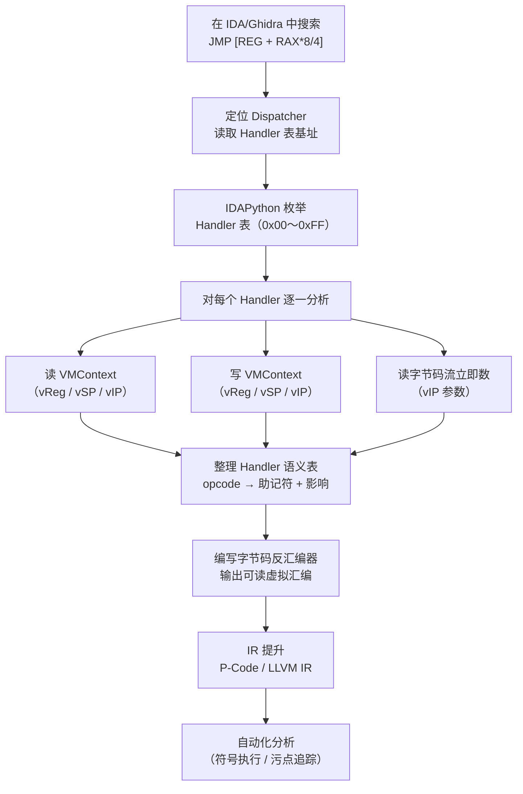

# WASM逆向（10）· VM字节码与Handler分析

> [!abstract] TL;DR
> VM 壳的核心是"用软件模拟 CPU"：Dispatcher 负责取指、译码，Handler 负责执行单条虚拟指令，VMContext 保存虚拟寄存器与虚拟栈。分析流程分四步：① 在 IDA/Ghidra 中定位跳转表式或 SWITCH 式 Dispatcher；② 枚举 Handler 表，提取每个 Handler 的起始地址；③ 逐 Handler 静态分析，整理对 VMContext 的读写语义，填写语义表；④ 编写字节码反汇编器，将虚拟字节码流翻译回可读的伪指令，最终提升为 IR（P-Code / LLVM IR）供自动化分析使用。掌握这四步，是突破 VMProtect、Code Virtualizer 等主流虚拟化保护的核心能力。

> [!caution] 安全与合规声明
> 本章所有技术内容仅用于**安全研究、漏洞分析、CTF 竞赛和合法渗透测试**。对受版权保护的商业软件、游戏客户端、DRM 系统或在线服务的保护机制实施绕过或分析，在多数国家和地区受法律约束（中国《计算机软件保护条例》第二十四条、美国 DMCA 第 1201 条、欧盟《软件指令》第 6 条均对反向工程范围有明确限定）。读者须在合法授权范围内（自有样本、恶意软件取证、授权渗透测试）使用本章知识，作者及知识库对任何非授权用途概不负责。

---

## 一、VM 壳基本模型：用软件模拟 CPU

虚拟化保护壳（VM 壳）并不直接执行原始 x86/x64 指令。它在构建期将目标代码编译为**自定义虚拟指令集**（Virtual ISA），运行时通过一个内嵌的软件解释器逐条执行这些虚拟指令。这个解释器由三个核心组件构成：

**Dispatcher（调度器）**：每条虚拟指令执行完毕后，控制权都会回到 Dispatcher。Dispatcher 从虚拟指令指针（vIP）处读取下一条 opcode，然后查找对应的 Handler 并跳转过去。

**Handler（处理器）**：每个 Handler 对应一个虚拟 opcode，实现该 opcode 的语义——即对 VMContext 执行具体的读/写/计算操作。执行完毕后跳回 Dispatcher。

**VMContext（虚拟上下文）**：保存虚拟机的完整执行状态，包括虚拟寄存器（vReg0～vRegN）、虚拟栈指针（vSP）、虚拟指令指针（vIP），以及原始 CPU 寄存器的保存区。通常以结构体形式组织，基址由真实寄存器（RBP、RDI 等）保存。

理解了这三个组件，VM 壳逆向的核心任务就转化为：**找到 Dispatcher → 枚举 Handler → 分析各 Handler 语义 → 重建虚拟指令集 → 反汇编字节码流**。

### 1.1 VMContext 典型布局

以 VMProtect 2.x 为例，VMContext 在 x64 目标上的典型内存布局如下（偏移为示意值，实际偏移因样本而异）：

```
VMContext 结构（64 位，RBP 为基址）
────────────────────────────────────
[RBP + 0x00]  vReg0   (8 bytes) 虚拟通用寄存器 0
[RBP + 0x08]  vReg1   (8 bytes) 虚拟通用寄存器 1
[RBP + 0x10]  vReg2   (8 bytes)
[RBP + 0x18]  vReg3   (8 bytes)
[RBP + 0x20]  vSP     (8 bytes) 虚拟栈指针（指向虚拟栈内存区）
[RBP + 0x28]  vIP     (8 bytes) 虚拟指令指针（指向字节码缓冲区）
[RBP + 0x30]  vFLAGS  (8 bytes) 虚拟标志位
[RBP + 0x38]  saved_RAX ... saved_R15  (保存真实寄存器，共 16×8 = 128 bytes)
[RBP + 0xB8]  host_RSP  返回真实栈时恢复的 RSP
────────────────────────────────────
```

Dispatcher 在取指时读取 `[vIP]`（即 `[RBX]`），每次取指后 vIP 自增。这个自增通常由 `inc rbx` 或 `add rbx, 1` 完成，是定位 Dispatcher 的有力特征。

---

## 二、Dispatcher 模式识别

不同产品、不同版本的 VM 壳在实现 Dispatcher 时风格各异，但都逃不出两种基本范式：**跳转表式**和 **SWITCH 式**。掌握识别方法可以在反汇编窗口中快速定位入口。

### 2.1 跳转表式 Dispatcher（VMProtect 2.x 常见）

跳转表式 Dispatcher 使用间接跳转 `JMP [base + rax*8]`，Handler 地址作为连续指针数组存储在数据段。

```asm
; 典型 Dispatcher 汇编（x64，VMProtect 2.x 风格）
vm_dispatcher:
    movzx eax, byte ptr [rbx]   ; 读取字节码（vIP = RBX）
    inc rbx                      ; vIP++（推进指令指针）
    jmp [rdi + rax*8]            ; 跳转到 Handler[opcode]
                                  ; RDI = Handler 表基址（64 位指针数组）
```

识别特征：
- `movzx eax, byte ptr [reg]` + `inc reg` 的组合（取指 + 推进 vIP）
- `jmp [base_reg + index_reg * 8]`（64 位）或 `jmp [base_reg + index_reg * 4]`（32 位）
- `base_reg` 指向连续的指针数组（Handler 表），数组长度通常为 256（对应 1 字节 opcode 空间）

在 IDA 中搜索这类指令，可使用菜单 Search → Sequence of bytes，或直接在反汇编视图中搜索 `FF 24 C7`（`jmp [rdi+rax*8]` 的编码模式之一）。

### 2.2 SWITCH 式 Dispatcher（Code Virtualizer 风格）

SWITCH 式 Dispatcher 先做范围检查，再用跳转表跳转，形态更接近编译器生成的 `switch` 语句。

```asm
; SWITCH 式 Dispatcher（32 位，Code Virtualizer 风格）
vm_loop:
    movzx eax, byte ptr [esi]    ; 读取 opcode（vIP = ESI）
    inc esi                       ; vIP++
    cmp eax, MAX_OPCODE           ; 范围检查（防止越界访问跳转表）
    jae vm_exit                   ; opcode >= MAX 则退出
    jmp dword ptr [handler_table + eax*4]  ; 查跳转表（32 位）
```

识别特征：
- `cmp eax, MAX_OPCODE` + `jae` 的范围保护
- `jmp dword ptr [table + eax*4]`（32 位） / `jmp qword ptr [table + rax*8]`（64 位）
- `handler_table` 通常是相对或绝对地址的立即数，可从 IDA 的操作数交叉引用直接跳到数组定义

### 2.3 变体：加密 opcode 的 Dispatcher

高强度保护（如 VMProtect 3.x、Themida）会对 opcode 进行轻量加密——在索引 Handler 表之前，先对取到的字节进行 XOR、ROR 或更复杂的变换。典型模式：

```asm
; 加密 opcode 变体
vm_dispatcher_enc:
    movzx eax, byte ptr [rbx]    ; 读取加密 opcode
    inc rbx
    xor eax, 0x5A                ; 解密（简单 XOR，实际可能更复杂）
    and eax, 0xFF                ; 保证 0-255 范围
    jmp [rdi + rax*8]
```

面对这类变体，识别的关键是：**无论 opcode 如何变换，Dispatcher 必须最终执行一条间接跳转，且跳转目标来自一个指针数组**。从间接跳转向上回溯 3～10 条指令，即可找到完整的解密和索引逻辑。

---

## 三、Handler 分析流程

定位 Dispatcher 只是起点。真正耗时的工作是逐一分析每个 Handler 的语义。以下是一套可复现的四步分析流程。

### Step 1：用 IDAPython 枚举 Handler 表

从已定位的 Dispatcher 中读取 Handler 表基址，然后批量提取所有 Handler 入口地址：

```python
# IDAPython：从已知的 Dispatcher 提取 Handler 表
# 适用于 64 位目标（每条表项为 8 字节指针）
import idc, idaapi, idautils

def extract_handler_table(table_base: int, count: int = 256) -> dict:
    """
    枚举 VM Handler 表，返回 {opcode: handler_address} 映射。
    
    参数：
      table_base  —— Handler 表基址（从 Dispatcher 的 JMP 指令操作数读取）
      count       —— 表项数量，默认 256（对应 1 字节 opcode 空间）
    """
    handlers = {}
    ptr_size = 8  # 64 位目标；32 位目标改为 4，读取函数改 get_dword

    for i in range(count):
        entry_addr = table_base + i * ptr_size
        # 读取 8 字节指针
        handler_addr = idc.get_qword(entry_addr)
        if handler_addr == idc.BADADDR or handler_addr == 0:
            continue
        # 验证该地址是否指向已知代码段
        if idaapi.is_code(idaapi.get_flags(handler_addr)):
            handlers[i] = handler_addr
            idc.set_name(handler_addr, f"vm_handler_{i:02X}",
                         idc.SN_FORCE)          # 自动命名
            idc.create_insn(handler_addr)        # 确保 IDA 已反汇编该地址
            print(f"  opcode 0x{i:02X}  →  handler @ {handler_addr:#018x}")
        else:
            # 可能是空槽（指向 vm_exit 或 Dispatcher 本身）
            handlers[i] = handler_addr
            print(f"  opcode 0x{i:02X}  →  {handler_addr:#018x}  [no code flag]")

    print(f"\n共枚举到 {len(handlers)} 个 Handler 条目")
    return handlers

# ──── 使用示例 ────
# 从 Dispatcher 中找到 "jmp [rdi + rax*8]"，
# RDI 的值即为 table_base（可在调试器中读寄存器，或静态追踪赋值链）
HANDLER_TABLE_BASE = 0x140012000   # 替换为实际地址
handler_map = extract_handler_table(HANDLER_TABLE_BASE, count=256)
```

脚本执行后，IDA 的 Names 窗口会出现 `vm_handler_00`～`vm_handler_FF` 等符号，后续交叉引用和批量分析都以这些符号为基础。

### Step 2：分析单个 Handler 语义

每个 Handler 都是一段短小的汇编代码，通常不超过 30～50 条指令。分析时重点关注以下四类操作：

**① 读虚拟寄存器**

```asm
; 从 VMContext（RBP 为基址）读取 vReg0 到 RAX
mov rax, qword ptr [rbp + 0x00]    ; vReg0 → RAX
```

**② 写虚拟寄存器**

```asm
; 将 RAX 写回 vReg1
mov qword ptr [rbp + 0x08], rax    ; RAX → vReg1
```

**③ 虚拟栈操作**（vSP 通过 VMContext 间接访问）

```asm
; VPUSH：先 vSP -= 4，再写值
sub dword ptr [rbp + 0x20], 4      ; vSP -= 4
mov rsi, qword ptr [rbp + 0x20]    ; RSI = vSP（新栈顶地址）
mov dword ptr [rsi], eax           ; [vSP] = eax（压栈）

; VPOP：先读值，再 vSP += 4
mov rsi, qword ptr [rbp + 0x20]    ; RSI = vSP
mov eax, dword ptr [rsi]           ; EAX = [vSP]（弹出值）
add dword ptr [rbp + 0x20], 4      ; vSP += 4
```

**④ 从字节码流读立即数（vIP 参数）**

```asm
; 读取 4 字节立即数（RBX = vIP）
mov eax, dword ptr [rbx]           ; EAX = imm32（从字节码读取）
add rbx, 4                         ; vIP += 4（跳过 4 字节参数）
```

**⑤ 回到 Dispatcher**

Handler 最后通常是一条无条件跳转：

```asm
jmp [dispatcher_ptr]               ; 跳回 Dispatcher 继续取指
```

这条跳转是识别 Handler 边界的可靠依据——找到它即找到 Handler 的结尾。

### Step 3：整理 Handler 语义表

分析完所有（或大多数）Handler 后，将结果整理为一张语义表，是后续编写字节码反汇编器和 IR 提升器的基础：

| opcode | Handler 地址 | 助记符 | 参数字节数 | 对 VMContext 的影响 |
|--------|-------------|--------|-----------|-------------------|
| 0x01 | 0x14001A000 | VPUSH_IMM32 | 4 | vSP -= 4; [vSP] = imm32（从字节码读取） |
| 0x02 | 0x14001A080 | VPOP_VREG0 | 0 | vReg0 = [vSP]; vSP += 4 |
| 0x03 | 0x14001A100 | VPOP_VREG1 | 0 | vReg1 = [vSP]; vSP += 4 |
| 0x10 | 0x14001A200 | VADD | 0 | tmp=[vSP]; vSP+=4; [vSP] += tmp |
| 0x11 | 0x14001A280 | VSUB | 0 | tmp=[vSP]; vSP+=4; [vSP] -= tmp |
| 0x12 | 0x14001A300 | VMUL | 0 | tmp=[vSP]; vSP+=4; [vSP] *= tmp |
| 0x20 | 0x14001A400 | VJMP | 4 | vIP = imm32 |
| 0x21 | 0x14001A480 | VJMP_IF | 4 | if vFLAGS.ZF: vIP = imm32 |
| 0x30 | 0x14001A600 | VCALL | 4 | [vSP-8]=vIP+5; vSP-=8; vIP=imm32 |
| 0x31 | 0x14001A680 | VRET | 0 | vIP=[vSP]; vSP+=8 |
| 0x40 | 0x14001A800 | VLOAD32 | 0 | addr=[vSP]; vSP+=4; [vSP-4]=mem[addr] |
| 0x41 | 0x14001A880 | VSTORE32 | 0 | val=[vSP]; vSP+=4; addr=[vSP]; vSP+=4; mem[addr]=val |
| 0xFF | 0x14001AFFF | VEXIT | 0 | 恢复真实寄存器; return（退出 VM）|

> [!note] 实践提示
> 许多 opcode 的 Handler 是同一功能的不同宽度版本（如 `VPUSH_IMM8`/`VPUSH_IMM16`/`VPUSH_IMM32`）或不同方向版本（如 `VADD` 和 `VADDC` 带进位）。发现这种规律后，可以批量推断未分析 Handler 的大致语义，大幅加速逆向进程。

### Step 4：字节码流反汇编器

有了语义表，就可以编写一个简单的字节码反汇编器，将原始字节码流翻译为可读的虚拟汇编文本：

```python
# 基于已分析语义的 VM 字节码反汇编器
from dataclasses import dataclass
from typing import Optional

@dataclass
class VMInstr:
    """一条已解码的虚拟指令"""
    offset: int           # 在字节码流中的偏移
    opcode: int           # 原始 opcode 字节
    mnemonic: str         # 助记符
    imm: Optional[int]    # 立即数参数（若无则为 None）
    size: int             # 本指令总字节数（含参数）

class VMDisassembler:
    """VM 字节码流反汇编器"""

    # Handler 语义表：opcode → (助记符, 参数字节数)
    # 实际使用时从 Step 3 的语义表填入
    HANDLERS = {
        0x01: ("VPUSH_IMM32", 4),
        0x02: ("VPOP_VREG0",  0),
        0x03: ("VPOP_VREG1",  0),
        0x10: ("VADD",        0),
        0x11: ("VSUB",        0),
        0x12: ("VMUL",        0),
        0x20: ("VJMP",        4),
        0x21: ("VJMP_IF",     4),
        0x30: ("VCALL",       4),
        0x31: ("VRET",        0),
        0x40: ("VLOAD32",     0),
        0x41: ("VSTORE32",    0),
        0xFF: ("VEXIT",       0),
    }

    def __init__(self, bytecode: bytes):
        self.bytecode = bytecode

    def decode_one(self, ip: int) -> VMInstr:
        """从偏移 ip 处解码一条虚拟指令"""
        if ip >= len(self.bytecode):
            raise IndexError(f"vIP {ip:#x} 超出字节码范围")

        opcode = self.bytecode[ip]
        if opcode not in self.HANDLERS:
            return VMInstr(ip, opcode, f"UNK_{opcode:02X}", None, 1)

        mnemonic, param_bytes = self.HANDLERS[opcode]
        imm = None
        if param_bytes > 0:
            raw = self.bytecode[ip + 1 : ip + 1 + param_bytes]
            imm = int.from_bytes(raw, byteorder='little', signed=False)

        return VMInstr(ip, opcode, mnemonic, imm, 1 + param_bytes)

    def disasm_all(self, start: int = 0) -> list[VMInstr]:
        """反汇编从 start 开始的全部字节码流"""
        instrs = []
        ip = start
        while ip < len(self.bytecode):
            instr = self.decode_one(ip)
            instrs.append(instr)
            if instr.opcode == 0xFF:   # VEXIT：字节码结束
                break
            ip += instr.size
        return instrs

    def print_listing(self, instrs: list[VMInstr]) -> None:
        """格式化输出反汇编列表"""
        print(f"{'Offset':>8}  {'Bytes':<12}  {'Mnemonic':<16}  Operand")
        print("─" * 60)
        for ins in instrs:
            raw = self.bytecode[ins.offset : ins.offset + ins.size]
            hex_bytes = " ".join(f"{b:02X}" for b in raw)
            operand = f"0x{ins.imm:08X}" if ins.imm is not None else ""
            print(f"{ins.offset:8x}  {hex_bytes:<12}  {ins.mnemonic:<16}  {operand}")

# ──── 使用示例 ────
# bytecode 通常从样本内存中 dump 下来，或从 WASM 线性内存提取
sample_bytecode = bytes([
    0x01, 0x05, 0x00, 0x00, 0x00,   # VPUSH_IMM32 0x00000005
    0x01, 0x03, 0x00, 0x00, 0x00,   # VPUSH_IMM32 0x00000003
    0x10,                             # VADD
    0x02,                             # VPOP_VREG0
    0xFF,                             # VEXIT
])

disasm = VMDisassembler(sample_bytecode)
instrs = disasm.disasm_all()
disasm.print_listing(instrs)
```

输出示例：

```
  Offset  Bytes         Mnemonic          Operand
────────────────────────────────────────────────────────────
       0  01 05 00 00 00  VPUSH_IMM32       0x00000005
       5  01 03 00 00 00  VPUSH_IMM32       0x00000003
       a  10              VADD
       b  02              VPOP_VREG0
       c  FF              VEXIT
```

---

## 四、Handler 分析流程总览（Mermaid）



---

## 五、提升到中间表示（IR）

字节码反汇编给出了可读的伪指令列表，但要进行自动化分析（符号执行、等价性验证、自动去虚拟化），还需要将虚拟指令提升为标准中间表示。

### 5.1 使用 miasm 提升到 P-Code

[miasm](https://github.com/cea-ittig/miasm) 是一个开源二进制分析框架，其表达式层（`miasm.expression`）提供了类似 Vex IR / P-Code 的 SSA 表达式，适合描述 Handler 语义：

```python
# 虚拟指令 → miasm 表达式（P-Code 风格）
# 以 VADD Handler 为例：弹出两个 i32，相加，结果压回
from miasm.expression.expression import (
    ExprId, ExprInt, ExprMem, ExprOp, ExprAssign
)

def lift_vadd(vsp_expr):
    """
    VADD 语义提升：
      tmp1 = [vSP]       ; 读栈顶
      vSP  = vSP + 4     ; 弹出 tmp1
      tmp2 = [vSP]       ; 读新栈顶（第二操作数）
      [vSP] = tmp1 + tmp2 ; 写回结果（原地替换）
      （vSP 不变，净效果是弹出一个压入一个）
    """
    vsp  = vsp_expr                              # vSP 的当前表达式
    tmp1 = ExprId("tmp_vadd_a", 32)
    tmp2 = ExprId("tmp_vadd_b", 32)

    assignments = [
        # tmp1 = Mem32[vSP]
        ExprAssign(tmp1, ExprMem(vsp, 32)),
        # vSP = vSP + 4
        ExprAssign(vsp,  ExprOp("+", vsp, ExprInt(4, 32))),
        # tmp2 = Mem32[vSP]（弹出后的新栈顶）
        ExprAssign(tmp2, ExprMem(vsp, 32)),
        # Mem32[vSP] = tmp1 + tmp2
        ExprAssign(ExprMem(vsp, 32), ExprOp("+", tmp1, tmp2)),
    ]
    return assignments

# VPUSH_IMM32 的提升
def lift_vpush_imm32(vsp_expr, imm_value: int):
    """
    VPUSH_IMM32 语义：
      vSP = vSP - 4
      [vSP] = imm32
    """
    vsp = vsp_expr
    return [
        ExprAssign(vsp, ExprOp("-", vsp, ExprInt(4, 32))),
        ExprAssign(ExprMem(vsp, 32), ExprInt(imm_value, 32)),
    ]

# VPOP_VREG0 的提升
def lift_vpop_vreg0(vsp_expr, vreg0_expr):
    """
    VPOP_VREG0 语义：
      vReg0 = [vSP]
      vSP = vSP + 4
    """
    vsp   = vsp_expr
    vreg0 = vreg0_expr
    return [
        ExprAssign(vreg0, ExprMem(vsp, 32)),
        ExprAssign(vsp,   ExprOp("+", vsp, ExprInt(4, 32))),
    ]
```

### 5.2 批量提升整条字节码流

有了单条指令的提升函数，就可以遍历反汇编列表，输出整个函数的 P-Code 序列：

```python
def lift_bytecode(instrs, vsp_init, vreg0_init):
    """将反汇编指令列表批量提升为 miasm 表达式序列"""
    all_assigns = []
    vsp   = ExprId("vSP",   32)
    vreg0 = ExprId("vReg0", 32)

    for ins in instrs:
        if ins.mnemonic == "VPUSH_IMM32":
            all_assigns += lift_vpush_imm32(vsp, ins.imm)
        elif ins.mnemonic == "VADD":
            all_assigns += lift_vadd(vsp)
        elif ins.mnemonic == "VPOP_VREG0":
            all_assigns += lift_vpop_vreg0(vsp, vreg0)
        elif ins.mnemonic == "VEXIT":
            break
        else:
            # 未实现的 Handler，插入占位符
            all_assigns.append(f"# UNLIFTED: {ins.mnemonic}")

    return all_assigns

# 对示例字节码运行提升
vsp_base = ExprId("vSP_init", 32)
vreg0_base = ExprId("vReg0_init", 32)
ir = lift_bytecode(instrs, vsp_base, vreg0_base)
for expr in ir:
    print(expr)
```

提升后的 IR 可以送入 miasm 的符号执行引擎，对虚拟函数执行语义等价分析，或自动生成等价的 C 代码。

---

## 六、实战难点与应对策略

### 6.1 多态 Handler（Polymorphic Handler）

VMProtect 3.x 及部分高端保护会为同一语义生成多个不同形态的 Handler，每次重新保护时随机选择。同一个 opcode 在不同样本中可能指向完全不同的代码序列，但功能等价。

应对策略：
- 不依赖 Handler 地址，只依赖**语义**（对 VMContext 的读写模式）建立 opcode 到助记符的映射
- 使用符号执行对每个 Handler 求值，比较输出状态是否等价
- 关注 Handler 最后的 `JMP [dispatcher_ptr]`，用 Dispatch 返回地址确认 Handler 边界

### 6.2 嵌套 VM（VM-in-VM）

部分保护将关键函数用两层甚至三层 VM 嵌套保护。外层 VM 的某个 Handler 本身就是另一个 VM 的 Dispatcher。

识别方法：
- 在 Handler 内部发现第二个 `movzx eax, byte ptr [reg]; jmp [base + rax*N]` 结构
- 同一个 RBP 基址附近出现两套不同偏移的 vReg/vSP 区域

应对策略：由外向内逐层分析，先完成外层 VM 的语义表，再进入内层。记录每层 VM 的 Handler 表基址和 VMContext 基址偏移，避免混淆。

### 6.3 Handler 末尾的混淆跳转

某些实现不用 `JMP [dispatcher_ptr]` 直接返回，而是通过多级间接跳转（如 `JMP RAX` 其中 RAX 在运行时才确定）或 RET 作跳转（`PUSH addr; RET`）绕过静态分析。

应对策略：
- 动态调试确认 Handler 的最终执行路径，在 Dispatcher 入口处设断点，记录每次触发的 Handler 地址
- 使用 `Frida` 或 `x64dbg` 的 Trace 功能记录完整执行路径，从 trace 日志中重建 Handler 表

---

## 七、WASM 环境中的 VM 壳适配

当被保护代码运行在 WebAssembly 虚拟机（如 Emscripten 编译的 WASM 模块）内部，且该 WASM 模块自身又实现了一套 VM 壳时，分析面临双重解释层：**宿主机 WASM 引擎 + 内嵌 VM 壳**。

### 7.1 WASM 中 Dispatcher 的识别

WASM 中的 Dispatcher 无法使用 `jmp [rdi + rax*8]` 这样的原生间接跳转，因为 WASM 的 `br_table` 指令（多路分支）是其等价实现：

```wat
; WASM 中的 Dispatcher 等价实现（WAT 文本格式）
(block $dispatch_out
  (block $h_vexit   ;; handler 0xFF
    (block $h_vstore ;; handler 0x41
      (block $h_vadd   ;; handler 0x10
        ;; ...以此类推，按 opcode 逆序嵌套 block
        (br_table   ;; 相当于 switch(opcode)
          $h_vpush_imm32   ;; opcode 0x01
          $h_vpop_vreg0    ;; opcode 0x02
          ;; ...
          $h_vexit         ;; default（未知 opcode）
        )
      )
      ;; handler 0x10 (VADD) 的实现
      ;; ...
    )
  )
)
```

分析方法：在 Ghidra 或 IDA（带 WASM 插件）中，找到包含 `br_table` 的函数，其分支目标列表即为各 Handler 的代码偏移。

### 7.2 WASM 线性内存中的 VMContext

WASM VM 壳将 VMContext 存储在 WASM 线性内存（`memory.data`）的固定偏移处，通过 `i32.load`/`i32.store` 访问，等价于原生代码中的 `[RBP + offset]`。

在动态分析时，可以通过浏览器 DevTools 的 WASM 调试功能或 Frida 的 `WebAssembly` hook 实时读取线性内存，获取 VMContext 的运行时状态。

---

---

## 小结

VM 字节码逆向的四步流程：识别 Dispatcher（跳转表 `JMP [REG+RAX*8]`）→ 枚举 Handler 表（IDAPython 读指针数组）→ 逐个 Handler 语义分析（对 VMContext 的读写效果）→ 字节码流反汇编（opcode→语义映射）→ 提升到 IR（miasm/VTIL）。建立 Handler 语义记录表是手动逆向的关键中间产物。

## 安全性与正确使用

> [!tip] 合规使用说明
> 本章介绍的 Handler 分析技术（IDAPython 枚举、Unicorn 模拟执行、字节码反汇编器、miasm IR 提升）用于：
> - **安全研究**：VM 壳原理学习、恶意软件分析、漏洞研究
> - **CTF 竞赛**：解答使用 VM 壳保护的竞赛题目
> - **防御评估**：评估自有软件 VM 保护方案的强度
>
> 本章开头的 `[!caution]` 声明适用于本章所有内容。对商业软件进行 Handler 级逆向须确认有合法授权。

### 注意事项

- **IDAPython 脚本**：仅在已授权样本上运行自动化枚举脚本
- **Unicorn 模拟执行**：模拟执行从授权样本提取的字节码，不用于绕过商业 DRM 系统
- **IR 提升代码**：提升的中间表示仅供分析研究，不应用于重新发布或二次分发

---

互链：`[[09.虚拟化保护壳总览]]`，`[[11.VTIL与提升框架]]`

---

⬅️ 上一篇 [[09.虚拟化保护壳总览]] ｜ 🏠 [[00.WASM与虚拟化壳逆向总览]] ｜ 下一篇 [[11.VTIL与提升框架]] ➡️
