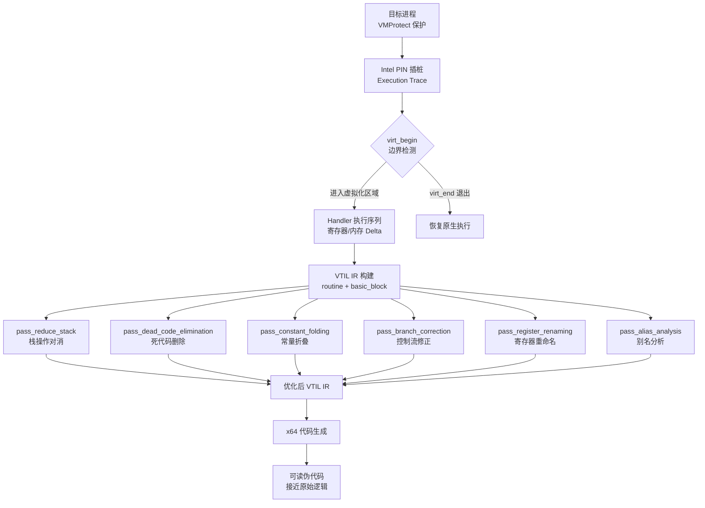

# WASM逆向（11）· VTIL与提升框架

> [!abstract] TL;DR
> VTIL（Virtual Translatable Instruction Library）是专为 VM 保护壳逆向设计的开源 C++ 中间表示框架。核心思路：PIN 插桩追踪 Handler 执行序列 → 构建 VTIL IR → 运行优化 Pass（死代码消除/常量折叠/栈化简/分支修正等）→ 输出接近原始的 x64 代码。miasm 提供 Python 侧的替代路径：反汇编 → VEX IR 提升 → 符号执行分析 Handler 语义。两者均依赖动态执行追踪作为输入，纯静态方式无法驱动框架运行。

> [!caution] 安全与合规声明
> 本章技术内容仅用于**安全研究、CTF 竞赛、漏洞审计及对自有程序的合法逆向分析**。将 VTIL/miasm 用于绕过他人商业软件 DRM 保护，在中国《计算机软件保护条例》、美国 DMCA 和欧盟软件指令下均属违法。本章所有示例代码均以学习理解为目的，读者须在合法授权范围内使用，作者对任何非法使用概不负责。

---

## 一、概述与定位

### VTIL 是什么

VTIL（**Virtual Translatable Instruction Library**）是由 Can Bölük 等人开发的开源 C++ 库（MIT 许可），托管于 GitHub `vtil-project/VTIL-Core`。它专门为 **VM 保护壳逆向**而生——特别是针对 VMProtect、Themida 等将 x86/x64 代码转换为自定义字节码的保护方案。

VM 保护壳的核心对抗在于：原始 x86/x64 指令已被完全替换为保护方自定义的字节码（bytecode），静态反汇编器（IDA/Ghidra）看到的只是解释器（Dispatcher + Handler 集合），而非原始逻辑。VTIL 的目标是将这段"看不懂"的字节码**提升（lift）**为可以被优化、可以被分析的中间表示，再编译回接近原始的 x64 代码。

整个流程分为四个阶段：

1. **追踪**：用 Intel PIN 插桩目标进程，捕获 `virt_begin`（虚拟化入口）到 `virt_end`（虚拟化出口）之间所有 Handler 的执行序列及其对寄存器/内存的操作。
2. **IR 构建**：将追踪数据转化为 VTIL routine（函数）和 basic\_block（基本块），每条 Handler 语义映射为一条或多条 VTIL 指令。
3. **优化**：对 VTIL IR 运行多个 Pass，消除 VM 引入的冗余（虚拟栈操作、junk Handler、不透明谓词等）。
4. **代码生成**：将优化后的 VTIL IR 编译为 x64 机器码，输出可读的汇编或二进制。

### 为什么需要 IR 提升框架

直接分析 Handler 执行 trace 有两个问题：其一，trace 是线性序列，丢失了原始控制流结构；其二，VM 引入的大量冗余操作（虚拟栈 push/pop、条件码计算、临时寄存器中转）使得 trace 极度膨胀，一段简单的 10 条指令原始代码可能产生数百条 trace 条目。

IR 提升框架的价值在于：在保留语义等价性的前提下，将这些冗余剥离，还原出人类可读、可用反编译器处理的代码。VTIL 的设计刻意参考了编译器中间表示（LLVM IR、VEX IR）的思路，但针对 VM 壳特点做了专门设计——例如对虚拟栈的原生支持、对 VM 寄存器（virtual register）的建模。

---

## 二、原理与机制

### 2.1 VTIL 框架架构



### 2.2 虚拟化边界：`virt_begin` 与 `virt_end`

VM 保护壳对每段被保护代码的替换模式是固定的：

```nasm
; 原始 x64 代码（保护前）
mov  rax, [rcx + 8]
add  rax, rdx
ret

; 保护后（VMProtect 典型形式）
push rbx                    ; 保存寄存器上下文
push rsi
; ... 更多寄存器 push
call vm_entry               ; 进入 VM 解释器
; vm_entry 永不返回，通过 vexit 跳回后续代码
```

VTIL 将 `call vm_entry`（或等价的跳转）标记为 `virt_begin`，将 VM 解释器内部最终跳回原生代码的位置标记为 `virt_end`。这两个边界界定了需要分析的字节码范围。

在实际使用中，VTIL 通过 PIN trace 中的特征（如首次读取"虚拟 PC"指针、特定寄存器保存模式）自动识别边界，也支持用户手动标记。

### 2.3 VTIL 基本块与 routine

VTIL 的数据结构层次：

- **`routine`**：对应一段被虚拟化的原始函数，包含所有 basic\_block 和控制流图（CFG）。
- **`basic_block`**：标准 CFG 基本块（单入口单出口），包含一个有序的 VTIL 指令列表。
- **`instruction`**：单条 VTIL 指令，含操作符（opcode）、操作数列表（operands）、调试信息。

每个 operand 可以是：
- **寄存器（register\_desc）**：可以是原生 x64 寄存器（`RAX`, `RBX`...）或虚拟寄存器（`vr0`~`vrN`）
- **立即数（immediate）**：编译期常量
- **内存引用（memory\_ref）**：以寄存器 + 立即偏移的形式描述

---

## 三、VTIL 指令集详解

### 3.1 数据移动指令

| 指令 | 语法 | 语义 |
|------|------|------|
| `ldd` | `ldd dst, src, off` | `dst = *(src + off)`，从内存加载 |
| `str` | `str dst, off, src` | `*(dst + off) = src`，存储到内存 |
| `mov` | `mov dst, src` | `dst = src`，寄存器/立即数传送 |
| `movsx` | `movsx dst, src` | `dst = sign_extend(src)`，带符号扩展传送 |

`ldd` 和 `str` 显式写出基址寄存器与偏移量，这对分析虚拟栈操作非常关键——VM 壳的虚拟栈频繁通过 `ldd`/`str` 模拟 push/pop，`pass_reduce_stack` Pass 就专门识别并消除这些操作对。

### 3.2 算术与位运算指令

| 指令 | 语法 | 语义 | 对应 VM Handler 类型 |
|------|------|------|---------------------|
| `add` | `add dst, src` | `dst += src` | ADD Handler |
| `sub` | `sub dst, src` | `dst -= src` | SUB Handler |
| `mul` | `mul dst, src` | `dst *= src` | MUL Handler |
| `div` | `div dst, src` | `dst /= src`（无符号）| DIV Handler |
| `rem` | `rem dst, src` | `dst %= src` | MOD Handler |
| `band` | `band dst, src` | `dst &= src` | AND Handler |
| `bor` | `bor dst, src` | `dst \|= src` | OR Handler |
| `bxor` | `bxor dst, src` | `dst ^= src` | XOR Handler |
| `bshl` | `bshl dst, src` | `dst <<= src` | SHL Handler |
| `bshr` | `bshr dst, src` | `dst >>= src`（逻辑右移）| SHR Handler |
| `bnot` | `bnot dst` | `dst = ~dst` | NOT Handler |
| `neg` | `neg dst` | `dst = -dst` | NEG Handler |

所有运算指令的目标操作数 `dst` 同时是源之一（in-place 语义），与 x86 的双操作数风格一致，便于一对一映射 Handler 行为。

### 3.3 控制流指令

```
js   label         -- 无条件跳转到 label（Jump Somewhere）
jcc  cond, label   -- 条件跳转：若 cond != 0 则跳转
vret               -- 虚拟化区域内的 return（返回到调用者的 VTIL 上下文）
vexit imm          -- 退出 VM，跳转到原生地址 imm（标志 virt_end）
vcall dest, params -- 虚拟化上下文中的函数调用
```

`vexit` 是最重要的控制流指令——它标志着 VM 保护区域的结束，其参数 `imm` 就是原始代码执行完毕后继续执行的地址。在一段被虚拟化的函数中，可能存在多个 `vexit`（对应多个出口分支）。

### 3.4 特殊与元指令

```
nop                -- 空操作（优化 Pass 插入/保留的占位符）
unk                -- 未知操作（遇到无法识别的 Handler，需手动补充语义）
vset flags, reg    -- 设置标志位（模拟 EFLAGS 的 CF/ZF/SF/OF/PF）
```

`unk` 指令是 VTIL 分析工作流中的重要信号：当 Handler 语义无法自动识别时（例如 VMProtect 引入了新型 Handler），框架在对应位置插入 `unk`，提示逆向工程师此处需要手动分析。

### 3.5 指令集完整示意（汇总表）

| 类别 | 指令 | 数量 |
|------|------|------|
| 数据移动 | `ldd` / `str` / `mov` / `movsx` | 4 |
| 算术运算 | `add` / `sub` / `mul` / `div` / `rem` / `neg` | 6 |
| 位运算 | `band` / `bor` / `bxor` / `bshl` / `bshr` / `bnot` | 6 |
| 控制流 | `js` / `jcc` / `vret` / `vexit` / `vcall` | 5 |
| 特殊/元 | `nop` / `unk` / `vset` | 3 |
| **合计** | | **24** |

---

## 四、VTIL C++ API 与使用示例

### 4.1 构建 VTIL routine

以下代码演示如何用 C++ API 手动构建一个 VTIL 例程（实际使用中这一步由追踪模块自动完成，此处仅用于理解数据结构）：

```cpp
#include <vtil/vtil.hpp>

using namespace vtil;

// 创建一个演示用 VTIL routine
// 对应原始逻辑：if (rcx > 0) { rax = rcx + rdx; } else { rax = 0; }
routine* build_demo_routine() {
    // 使用默认调用约定（x64 System V 或 Microsoft x64）
    routine* rtn = new routine(default_call_conv);
    
    // 获取入口基本块（entry_point 自动创建）
    basic_block* entry = rtn->entry_point;
    
    // 构建入口块：读取参数，测试条件
    // rcx > 0 的条件测试（VM 保护中通常通过虚拟标志位传递）
    entry
        ->mov(REG_FLAGS, 0)           // 清除虚拟标志寄存器
        ->vset(flags::above, X86_REG_RCX)  // 设置 CF：rcx 与 0 比较
        ->jcc(flags::above, "then_block"); // 若 rcx > 0，跳到 then_block
    
    // else 分支：rax = 0
    basic_block* else_block = entry->fork("else_block");
    else_block
        ->mov(X86_REG_RAX, 0)
        ->vexit(0x401050);             // 退出 VM，继续原生执行
    
    // then 分支：rax = rcx + rdx
    basic_block* then_block = entry->fork("then_block");
    then_block
        ->mov(X86_REG_RAX, X86_REG_RCX)  // rax = rcx
        ->add(X86_REG_RAX, X86_REG_RDX)  // rax += rdx
        ->vexit(0x401050);                // 退出 VM
    
    return rtn;
}

// 打印 VTIL routine（调试用）
void dump_routine(routine* rtn) {
    // 遍历所有基本块
    for (auto& [vip, block] : rtn->explored_blocks) {
        vtil::logger::log<vtil::logger::CON_CYN>(
            "Block @ vip=0x%llx (%zu instructions)\n",
            vip, block->size()
        );
        // 打印每条指令
        for (auto& ins : *block) {
            vtil::logger::log("  %s\n", ins.to_string().c_str());
        }
    }
}
```

### 4.2 运行优化 Pass

VTIL 的优化器采用 Pass 管理器（optimizer）模式，支持单独运行特定 Pass 或一次性应用全部内置 Pass：

```cpp
#include <vtil/vtil.hpp>
#include <vtil/optimizer.hpp>

using namespace vtil;
using namespace vtil::optimizer;

// 对已构建的 routine 运行完整优化管线
void run_full_optimization(routine* rtn) {
    // 方式一：一次性运行所有内置 Pass（推荐用于生产）
    // apply_all 会按依赖顺序自动排列并反复迭代直至收敛
    optimizer::apply_all(rtn);
    
    // 方式二：手动选择并排列 Pass（用于调试或定制流程）
    // 第一轮：结构性化简
    pass_reduce_stack{}(rtn);          // 消除虚拟栈 push/pop 对
    pass_dead_code_elimination{}(rtn); // 删除无用指令
    
    // 第二轮：数值化简
    pass_constant_folding{}(rtn);      // 常量折叠
    pass_branch_correction{}(rtn);     // 修正控制流
    
    // 第三轮：可读性提升
    pass_register_renaming{}(rtn);     // 虚拟寄存器重命名为原生名称
    
    // 验证：打印优化后统计
    vtil::logger::log("优化完成，routine 包含 %zu 个基本块\n",
                      rtn->explored_blocks.size());
}

// 将优化后的 VTIL routine 编译为 x64 机器码
void compile_to_x64(routine* rtn, const std::string& output_path) {
    // 使用 VTIL 内置的 x64 后端
    compiler::compile(rtn, output_path);
    vtil::logger::log("已输出 x64 代码到: %s\n", output_path.c_str());
}
```

### 4.3 从 PIN Trace 驱动 VTIL（实际工作流）

在真实的 VM 壳分析场景中，VTIL IR 不是手动构建的，而是由 PIN Pintool 捕获执行 trace 后自动生成：

```cpp
// Pintool 伪代码（需集成 VTIL tracer 模块）
// 实际实现参考：vtil-project/NoVmp 项目中的 pintool 部分

#include "pin.H"
#include <vtil/vtil.hpp>

static vtil::routine* current_routine = nullptr;
static bool in_vm = false;

// 每条指令执行时的回调
VOID instruction_callback(ADDRINT ip, CONTEXT* ctx) {
    // 检测 virt_begin：识别 VM 入口特征（调用 vm_entry 函数）
    if (is_vm_entry(ip) && !in_vm) {
        in_vm = true;
        current_routine = new vtil::routine(vtil::default_call_conv);
        vtil::logger::log("检测到 virt_begin @ 0x%llx\n", ip);
        return;
    }
    
    // 检测 virt_end：vexit 指令（跳回原生代码）
    if (in_vm && is_vm_exit(ip, ctx)) {
        in_vm = false;
        ADDRINT native_target = get_native_target(ctx);
        // 在当前 basic_block 末尾追加 vexit
        vtil::logger::log("检测到 virt_end，native target=0x%llx\n", native_target);
        vtil::optimizer::apply_all(current_routine);
        dump_routine(current_routine);
        return;
    }
    
    if (!in_vm) return;
    
    // 识别当前 Handler 类型并转化为 VTIL 指令
    // 这是整个框架最复杂的部分：Handler 语义提取
    lift_handler_to_vtil(ip, ctx, current_routine);
}

// 注册回调
VOID image_load(IMG img, VOID* v) {
    RTN main_rtn = RTN_FindByName(img, "main");
    if (RTN_Valid(main_rtn)) {
        RTN_Open(main_rtn);
        // ... 插桩代码
        RTN_Close(main_rtn);
    }
}
```

---

## 五、六大优化 Pass 详解

VTIL 的优化管线设计针对 VM 壳引入的具体冗余类型，每个 Pass 解决一类问题：

| Pass 名称 | 针对的 VM 冗余 | 具体效果 | 运行时机 |
|-----------|--------------|---------|---------|
| `pass_reduce_stack` | VM 虚拟栈操作（push/pop 对）| 识别通过 `str`/`ldd` 模拟的栈操作对，将中间值改为直接寄存器传递，消除无意义的内存读写 | 最先运行，为后续 Pass 创造条件 |
| `pass_dead_code_elimination` | junk Handler、无效的条件码计算 | 构建活跃变量分析（liveness analysis），删除对最终输出无贡献的指令，可消除 VM 中大量用于"迷惑"的无用运算 | 在栈化简后运行 |
| `pass_constant_folding` | 不透明谓词（opaque predicates）、常量加密操作数 | 在编译期计算所有可确定的常量表达式（如 `mov rax, 3; add rax, 5` → `mov rax, 8`），消除 VM 运行时解密操作数后留下的常量链 | 与死代码消除交替迭代 |
| `pass_branch_correction` | VM 中的混淆条件跳转（永真/永假分支）| 对已被常量折叠确定为常量的条件跳转，将 `jcc` 替换为无条件 `js` 或删除死分支，恢复真实控制流结构 | 常量折叠后运行 |
| `pass_register_renaming` | 虚拟寄存器命名混乱（`vr0`~`vrN`）| 通过数据流分析，将能确定与原生寄存器对应的虚拟寄存器重命名（如 `vr3` → `RCX`），使输出汇编接近原始代码 | 最后运行，提升可读性 |
| `pass_alias_analysis` | 内存别名造成的保守分析（误认为读写相关）| 分析指针的来源与约束，证明特定内存区域不互相别名，解锁更多死代码消除和指令重排机会 | 与其他 Pass 配合使用 |

### Pass 运行效果对比

以下用一段 VMProtect 保护后的 VTIL trace 片段说明优化效果：

```
; 优化前（从 PIN trace 直接生成的 VTIL，约 18 条指令）
str  vsp, 0,  vr0        ; push vr0（VM 栈操作）
sub  vsp,     8          ; 栈指针 -8
str  vsp, 0,  vr1        ; push vr1
sub  vsp,     8
ldd  vr2,     vsp, 0     ; pop 到 vr2
add  vsp,     8
ldd  vr3,     vsp, 0     ; pop 到 vr3
add  vsp,     8
add  vr3,     vr2        ; vr3 += vr2（实际 add 操作）
str  vsp, 0,  vr3        ; push 结果
sub  vsp,     8
; ... 更多虚拟栈中转

; 经过 pass_reduce_stack + pass_dead_code_elimination 优化后（3 条指令）
mov  vr3,    vr1         ; 直接传送，消除了所有栈中转
add  vr3,    vr0         ; 核心加法
; vr3 持有 add 的结果，后续使用直接引用 vr3

; 经过 pass_register_renaming 后（接近原始）
add  RCX,    RAX         ; 数据流分析揭示 vr3=RCX, vr0=RAX
```

---

## 六、替代框架：miasm

**miasm** 是由法国国家信息安全局（ANSSI）开发的 Python 二进制分析框架，同样支持将机器码提升为 IR 后进行分析。在 VM 壳逆向场景中，miasm 的定位与 VTIL 互补：VTIL 专门针对 VMProtect 深度定制，而 miasm 是通用框架，在分析未知 VM 壳或非 VMProtect 保护时更灵活。

### 6.1 miasm 核心组件

| 组件 | 功能 |
|------|------|
| `Container` | 加载二进制文件（PE/ELF/flat binary）|
| `Machine` | 指定目标架构（`x86_64` / `x86_32` / `arml` 等）|
| `dis_engine` | 反汇编引擎，生成 `AsmCFG`（汇编级 CFG）|
| `lifter_model_call` | IR 提升器，将 `AsmCFG` 转化为 `IRCFG`（IR 级 CFG）|
| `DSEEngine` | 动态符号执行引擎（Dynamic Symbolic Execution）|
| `SymbolicExecutionEngine` | 纯符号执行引擎（用于单 Handler 语义提取）|

### 6.2 分析单个 VM Handler（Python 示例）

```python
from miasm.analysis.binary import Container
from miasm.analysis.machine import Machine
from miasm.core.locationdb import LocationDB
from miasm.ir.symbexec import SymbolicExecutionEngine
from miasm.expression.expression import ExprId, ExprInt

# ——————————————————————————————
# 步骤1：加载目标二进制（VMProtect 保护的 PE）
# ——————————————————————————————
with open('vmprotected.exe', 'rb') as f:
    container = Container.from_stream(f)

machine = Machine('x86_64')
loc_db = LocationDB()

# 从容器创建反汇编引擎
mdis = machine.dis_engine(container.bin_stream, loc_db=loc_db)

# ——————————————————————————————
# 步骤2：反汇编单个 Handler（从已知 Handler 地址开始）
# handler_addr 从 PIN trace 中获取
# ——————————————————————————————
handler_addr = 0x004012A0  # 示例：XOR Handler 地址
asm_cfg = mdis.dis_multiblock(handler_addr)

print(f"Handler @ 0x{handler_addr:08X}：反汇编了 {len(asm_cfg.blocks)} 个基本块")

# ——————————————————————————————
# 步骤3：提升为 IR（miasm 使用自定义 IR，类似 VEX）
# ——————————————————————————————
lifter = machine.lifter_model_call(loc_db)
ira = lifter.new_ira(loc_db)
ir_cfg = ira.new_ircfg_from_asmcfg(asm_cfg)

# ——————————————————————————————
# 步骤4：符号执行分析 Handler 对寄存器/内存的影响
# 目标：提取 Handler 语义（例如："vr_dst = vr_src1 XOR vr_src2"）
# ——————————————————————————————
# 创建初始符号化状态（所有寄存器用符号变量表示）
init_state = {
    ExprId('RAX', 64): ExprId('RAX_0', 64),  # RAX 初始值为符号变量
    ExprId('RCX', 64): ExprId('RCX_0', 64),
    ExprId('RDX', 64): ExprId('RDX_0', 64),
    ExprId('RSI', 64): ExprId('RSI_0', 64),  # VMProtect 常用 RSI 作虚拟 SP
    ExprId('RDI', 64): ExprId('RDI_0', 64),  # 常用 RDI 作虚拟 PC
}

# 运行符号执行
sb = SymbolicExecutionEngine(lifter)
sb.symbols.symbols_id.update(init_state)

# 执行到 Handler 结束（遇到跳回 Dispatcher 的跳转）
final_state = sb.run_block_at(ir_cfg, handler_addr)

# ——————————————————————————————
# 步骤5：输出 Handler 的语义摘要
# ——————————————————————————————
print("\n=== Handler 语义分析结果 ===")
for reg_name in ['RAX', 'RCX', 'RDX', 'RSI', 'RDI']:
    reg = ExprId(reg_name, 64)
    if reg in sb.symbols:
        expr = sb.symbols[reg]
        # 只打印被 Handler 修改的寄存器（值不等于初始符号变量）
        init_sym = ExprId(f'{reg_name}_0', 64)
        if expr != init_sym:
            print(f"  {reg_name}: {reg_name}_0 -> {expr}")
```

### 6.3 miasm DSE 辅助自动化分析

对于 VM 壳中有分支的 Handler（条件跳转），需要动态符号执行（DSE）配合路径覆盖：

```python
from miasm.analysis.dse import DSEEngine
from miasm.os_dep.win_api_x86_64 import winobjs

# 创建 DSE 引擎（需要真实运行环境或模拟器支持）
dse = DSEEngine(machine)
# 注意：DSE 需要解决路径爆炸问题
# 对 VM Handler 通常通过以下策略缓解：
# 1. 限制 Handler 执行步数（max_steps 参数）
# 2. 手动标注循环展开边界
# 3. 对 VM 栈操作使用具体值（非符号）以减少分支

# 为每个 Handler 建立语义数据库
handler_semantics = {}

def analyze_handler(addr: int) -> dict:
    """分析单个 Handler，返回其语义摘要"""
    asm_cfg = mdis.dis_multiblock(addr)
    ir_cfg = ira.new_ircfg_from_asmcfg(asm_cfg)
    
    sb = SymbolicExecutionEngine(lifter)
    # 符号化输入
    sb.symbols.symbols_id.update(init_state)
    
    try:
        sb.run_block_at(ir_cfg, addr)
    except StopIteration:
        pass  # 正常到达 Handler 末尾（跳回 Dispatcher）
    
    # 收集输出状态
    return {reg: str(sb.symbols[ExprId(reg, 64)])
            for reg in ['RAX', 'RCX', 'RDX', 'RSI', 'RDI', 'RBX']
            if ExprId(reg, 64) in sb.symbols}

# 批量分析从 PIN trace 中识别到的所有 Handler 地址
handler_addresses = [0x4012A0, 0x401350, 0x4013F0, 0x401490]  # 示例
for addr in handler_addresses:
    print(f"\n分析 Handler @ 0x{addr:08X}...")
    semantics = analyze_handler(addr)
    for reg, expr in semantics.items():
        print(f"  {reg} = {expr}")
    handler_semantics[addr] = semantics

print(f"\n共分析 {len(handler_semantics)} 个 Handler")
```

### 6.4 VTIL vs miasm 对比

| 维度 | VTIL | miasm |
|------|------|-------|
| **语言** | C++ | Python |
| **专门化程度** | 高（专为 VMProtect 设计）| 低（通用框架）|
| **VM 壳自动化** | 高（内置 VMProtect Handler 识别）| 需自行实现 Handler 识别 |
| **优化 Pass** | 内置 6+ Pass，针对 VM 冗余定制 | 通用优化（部分等价）|
| **运行速度** | 快（C++ 原生）| 慢（Python，大型程序受限）|
| **学习曲线** | 较陡（C++ API，文档较少）| 较缓（Python，文档丰富）|
| **灵活性** | 低（深度绑定 VMProtect 模型）| 高（可适应任意 VM 架构）|
| **社区** | 较小（专门化社区）| 较大（ANSSI 维护，文档全）|
| **适用场景** | VMProtect 专项逆向 | 未知 VM 壳、多架构分析 |

---

## 安全性与正确使用

### 7.1 VTIL 的局限性

**依赖动态 trace**：VTIL 不是静态分析工具。没有 PIN trace，框架无法工作。这意味着：
- 必须能在真实或模拟环境中运行目标程序
- 反调试保护（`IsDebuggerPresent`、时间戳检测）需要先行绕过（仅限对自有程序的合法分析）
- PIN 本身有性能开销（约 10x 减速），trace 文件可能很大（GB 级别）

**路径覆盖问题**：单次 trace 只捕获一条执行路径。若被保护代码含有条件分支，需要多次运行，覆盖不同路径，才能构建完整的 CFG。这一点与 miasm DSE 的路径爆炸问题是同一问题的两种表现。

**Handler 识别精度**：VTIL 内置的 Handler 识别针对特定版本的 VMProtect。当 VMProtect 更新（引入新 Handler 类型或修改 Handler 混淆策略），识别模块可能失效，产生大量 `unk` 指令，需要手动补充语义。

**path_alias_analysis 保守性**：别名分析在保守模式下可能无法证明两个内存区域不别名，导致死代码消除无法移除某些内存访问指令。这种情况下需要提供额外的指针约束信息。

### 7.2 合规边界与道德准则

VTIL 和 miasm 是强力工具，使用时须清晰区分合法与非法场景：

**合法使用**：
- 对自己开发或合法持有源码的软件进行安全审计
- CTF 竞赛（题目授权分析）
- 安全研究机构对恶意软件样本的分析
- 渗透测试（持有书面授权）
- 对自有程序验证 VM 壳保护效果（防御视角）

**非法使用（禁止）**：
- 对他人商业软件进行脱壳以绕过 DRM/授权保护
- 对游戏进行逆向以制作外挂
- 在未获授权的情况下分析竞争对手产品

### 7.3 防御视角：从 VTIL 学到的加固思路

理解 VTIL 的工作原理，反过来可以指导 VM 保护方案的加固：

- **增加 Handler 多样性**：VTIL 的 Handler 识别依赖特征匹配。若保护方引入更多非标准 Handler 变种，识别精度下降，产生更多 `unk`。
- **引入路径相关解密**：若字节码解密 key 与执行路径（如之前的分支历史）相关，单次 trace 捕获的字节码只对应当前路径，攻击者必须覆盖所有路径才能完整分析。
- **环境检测**：检测 PIN 的注入特征（特定内存布局、API 行为变化），在检测到时改变执行行为，使 trace 不真实反映正常执行。
- **增加虚拟寄存器数量**：大量虚拟寄存器使 `pass_register_renaming` 难以确定对应关系，降低输出可读性。

---

## 小结

VTIL 提供了 VM 保护壳逆向的一套完整工程路径：通过 PIN 动态追踪捕获 Handler 执行序列，构建中间表示，运行六类专门优化 Pass 消除 VM 引入的冗余，最终输出接近原始的 x64 代码。其核心价值在于将"看 Handler 序列猜语义"这一高度手工的过程，转化为可工程化、可自动化的数据驱动流程。

miasm 提供了 Python 侧的补充路径，在通用性和灵活性上超过 VTIL，但专用化程度和自动化程度不及后者。在实际分析工作中，两者往往结合使用：先用 miasm 快速验证单个 Handler 的语义假设，再用 VTIL 对整个例程进行批量优化。

值得反复强调的一点：这两个框架的核心依赖是**动态执行 trace**——没有真实运行，一切分析无从开始。这既是方法论上的根本约束，也是选择 PIN/Unicorn 模拟器作为追踪基础设施的原因。

---

## 九、相关阅读

- `[[10.VM字节码与Handler分析]]`：本章 VTIL 分析的前置知识，详解 Handler 识别与字节码语义提取
- `[[12.VMProtect逆向实战]]`：将 VTIL 框架用于实际 VMProtect 样本的完整操作流程
- `[[45.反编译器与反汇编引擎原理/05.中间表示IR设计：LLVM-IR与VEX与P-Code]]`：VTIL IR 设计的理论背景，了解 IR 设计原则有助于深入理解 VTIL 的取舍

---

⬅️ 上一篇 [[10.VM字节码与Handler分析]] ｜ 🏠 [[00.WASM与虚拟化壳逆向总览]] ｜ 下一篇 [[12.VMProtect逆向实战]] ➡️
