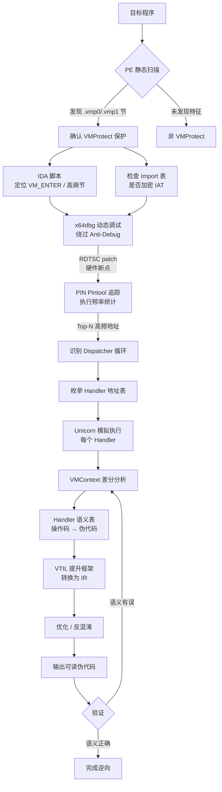

# WASM逆向（12）· VMProtect逆向实战

> [!abstract] TL;DR
> VMProtect 是业界最成熟的 x86/x64 虚拟化保护方案之一，将原始指令编译成自定义虚拟机字节码后由解释器执行。本章从防御/研究/CTF 视角出发，系统梳理识别 VMProtect 保护程序的静态特征、通过 Intel PIN 动态追踪 Dispatcher 循环、用 Unicorn Engine 模拟执行 Handler 进行语义还原，并结合 CTF 题目的快速分析策略，帮助安全研究者建立完整的 VM 壳分析思路。

---

## 1. VMProtect 识别特征

### 1.1 PE 文件静态特征

当一个可执行文件经过 VMProtect 保护后，PE 结构层面会出现几个典型痕迹，无需执行即可初步判断。

**额外节名称**

VMProtect 在 PE 文件中注入专属节（Section），常见名称为 `.vmp0` 和 `.vmp1`：

- `.vmp0`：通常存放 VM 字节码（VCode）和虚拟指令表
- `.vmp1`：存放 VM 运行时数据、密钥材料或第二阶段字节码

这两个节的属性标志通常带 `IMAGE_SCN_MEM_EXECUTE | IMAGE_SCN_MEM_READ`，但实际执行流发生在这些节内部的解释器循环（Dispatcher）中。部分版本还会将节名随机化或使用 `.text` 伪装，但节内容的熵值（接近 7.9～8.0 bit/byte）仍可暴露压缩/加密的字节码。

**Import 表加密（IAT 保护）**

VMProtect Ultimate 版本具备 Import Protection 能力，运行时通过 `GetProcAddress` 动态解析 API 地址，原始 IAT 中的函数名被替换为哑函数（Thunk），导致：

- PEiD / DetectItEasy 无法直接看到 `kernel32.dll!CreateFile` 等明文导入
- 反汇编器在调用点看到的是 `call [jmp_table + offset]` 形式的间接跳转，目标在静态分析时为零或无效
- 需要借助 Scylla / ImpREC 等工具在内存中重建 IAT

**文件尾部附加数据（Overlay）**

VMProtect 保护后的文件，PE 最后一个节之后可能附加数据块（Overlay），其中存放：

- VM 密钥流（用于解密字节码）
- 虚拟指令分派表的索引
- 授权校验信息（序列号验证逻辑的一部分）

用 `010 Editor` 的 PE 模板或 `pe-bear` 查看文件偏移时，若 `Last Section End` 之后仍有非零数据，即可确认 Overlay 存在。

---

### 1.2 VMProtect 内置反调试特征

VMProtect 在生成 VM 代码时会自动插入多层反调试（Anti-Debug）逻辑，理解这些机制是动态分析的前提。

**时间差检测（RDTSC）**

```asm
rdtsc                   ; 读取 TSC → EDX:EAX
mov  [tsc_start], eax
; ... 执行若干指令 ...
rdtsc
sub  eax, [tsc_start]
cmp  eax, 0x1000        ; 阈值约 4096 个时钟周期
jg   anti_debug_branch  ; 超过 → 检测到调试器单步
```

单步调试时每条指令耗费的时钟周期远超正常执行，`RDTSC` 差值会触发 anti-debug 分支（通常跳转到垃圾代码或直接崩溃）。绕过方法：在 x64dbg 的「选项→反调试」中勾选「NtSetInformationThread 隐藏线程」并打开「RDTSC patch」。

**调试器存在性检测**

VMProtect 还嵌入以下 Win32 API 调用组合：

| API | 用途 |
|---|---|
| `IsDebuggerPresent` | 检查 PEB.BeingDebugged 字节 |
| `CheckRemoteDebuggerPresent` | 通过 `NtQueryInformationProcess` 检查 |
| `NtQueryInformationProcess(ProcessDebugPort)` | 更底层，绕过 PEB patch |
| `BlockInput` + `GetForegroundWindow` | 检查焦点窗口（部分版本） |

**断点扫描（CC 字节检测）**

VM 初始化阶段（`VM_INIT`）有时会扫描自身代码节，查找 `0xCC`（`int 3` 软断点字节）：

```cpp
// 伪代码：VMProtect 断点扫描逻辑
BOOL scan_bp(LPBYTE base, DWORD size) {
    for (DWORD i = 0; i < size; i++) {
        if (base[i] == 0xCC) return TRUE; // 发现断点
    }
    return FALSE;
}
```

应对方法：使用硬件断点（DR0～DR3 寄存器），不修改内存中的指令字节，可有效绕过 `0xCC` 扫描。

---

### 1.3 IDA Pro 静态识别脚本

在 IDA 中执行以下 Python 脚本，可快速定位 VM 节和 `VM_ENTER` 候选入口：

```python
import idautils
import idc
import idaapi

# ── 1. 查找 .vmp0 / .vmp1 节 ──────────────────────────────────────────────
print("[*] Scanning for VMProtect sections...")
for seg in idautils.Segments():
    name = idc.get_segm_name(seg)
    if 'vmp' in name.lower():
        size = idc.get_segm_attr(seg, idc.SEGATTR_SIZE)
        print(f"    VM Section: {name} @ {seg:#010x}, size={size:#x} ({size} bytes)")

# ── 2. 定位 VM_ENTER 特征：大量连续 PUSH + 无条件 JMP ─────────────────────
print("\n[*] Searching for VM_ENTER candidates (≥10 pushes before jmp)...")
for func_ea in idautils.Functions():
    push_seq = 0
    scan_end = func_ea + 0x100  # 仅扫描函数前 256 字节
    for head in idautils.Heads(func_ea, scan_end):
        mnem = idc.print_insn_mnem(head)
        if mnem == 'push':
            push_seq += 1
        elif mnem in ('jmp', 'call') and push_seq >= 10:
            print(f"    Likely VM_ENTER: {func_ea:#010x}  ({push_seq} pushes before {mnem})")
            break
        elif mnem not in ('push', 'nop', 'mov', 'xor'):
            push_seq = 0  # 重置：不连续了

# ── 3. 统计高熵节（字节码/密钥存储区）─────────────────────────────────────
import math, collections

def calc_entropy(data: bytes) -> float:
    if not data:
        return 0.0
    freq = collections.Counter(data)
    total = len(data)
    return -sum((c / total) * math.log2(c / total) for c in freq.values())

print("\n[*] Section entropy (high entropy ≈ encrypted/compressed):")
for seg in idautils.Segments():
    size = idc.get_segm_attr(seg, idc.SEGATTR_SIZE)
    if size < 0x100:
        continue
    raw = bytes(idaapi.get_bytes(seg, min(size, 0x1000)) or b'')
    ent = calc_entropy(raw)
    flag = " ← HIGH" if ent > 7.2 else ""
    print(f"    {idc.get_segm_name(seg):12s} @ {seg:#010x}  entropy={ent:.3f}{flag}")
```

运行后，控制台会打印出 VM 节地址、`VM_ENTER` 候选函数列表以及各节的熵值，帮助快速锁定分析重点。

---

## 2. VMProtect 虚拟机内部结构

在开始动态追踪前，需要理解 VMProtect 虚拟机的核心构成，这是后续所有分析工作的理论基础。

### 2.1 VMContext 结构

VMProtect 在运行时维护一个称为 **VMContext**（虚拟机上下文）的数据结构，通常由一个专用寄存器（常见为 `RBP` 或 `RSI`）指向：

| 偏移 | 字段 | 含义 |
|------|------|------|
| `+0x00` | `VIP` | 虚拟指令指针（Virtual Instruction Pointer），指向下一条字节码 |
| `+0x08` | `VSP` | 虚拟栈指针（Virtual Stack Pointer），指向虚拟栈顶 |
| `+0x10` | `VREG[0]` | 虚拟通用寄存器 0（对应原始 RAX） |
| `+0x18` | `VREG[1]` | 虚拟通用寄存器 1（对应原始 RBX） |
| ... | ... | ... |
| `+0x88` | `VREG[15]` | 虚拟通用寄存器 15 |
| `+0x90` | `VFLAGS` | 虚拟标志寄存器（ZF/SF/CF/OF） |

实际布局因版本和编译选项而异，需要通过差分分析（见第 4 节）确定具体偏移。

### 2.2 VM 执行循环

VMProtect 的执行流程遵循经典的"取指-解码-执行"循环：

```
VM_ENTER → 保存真实寄存器 → 初始化 VMContext
     ↓
Dispatcher（fetch-decode）
     ↓
从 VIP 读取操作码（opcode）
     ↓
查分派表（Handler Table）→ 跳转到对应 Handler
     ↓
Handler 执行（修改 VMContext）→ 更新 VIP
     ↓
回到 Dispatcher（循环）
     ↓
VM_EXIT → 恢复真实寄存器 → 返回原代码
```

其中 **Dispatcher** 是分析的核心目标，找到它之后就可以枚举所有 Handler。

---

## 3. 动态追踪（Intel PIN）

Intel PIN 是 Intel 官方的动态二进制插桩框架，可以在不修改目标程序的情况下，在每条指令执行前后插入回调，是追踪 VMProtect Dispatcher 循环的利器。

### 3.1 PIN Pintool：追踪执行路径

```cpp
// vmp_tracer.cpp
// 编译: pin -t vmp_tracer.so -- target.exe
// 功能: 记录所有执行地址，找到执行频率最高的 Dispatcher

#include "pin.H"
#include <fstream>
#include <map>
#include <algorithm>
#include <vector>
#include <utility>

// ── 配置 ──────────────────────────────────────────────────────────────────
static const ADDRINT TRACE_LIMIT = 5000000;  // 最多记录 500 万条指令
static std::ofstream g_trace;
static std::map<ADDRINT, UINT64> g_freq;     // 地址 → 执行次数
static UINT64 g_instr_count = 0;
static bool   g_active = true;

// ── 每条指令回调 ──────────────────────────────────────────────────────────
VOID PIN_FAST_ANALYSIS_CALL on_instruction(ADDRINT addr) {
    if (!g_active) return;
    g_freq[addr]++;
    g_instr_count++;
    if (g_instr_count >= TRACE_LIMIT) g_active = false;
}

// ── 插桩回调 ──────────────────────────────────────────────────────────────
VOID instrument_trace(TRACE trace, VOID* v) {
    for (BBL bbl = TRACE_BblHead(trace); BBL_Valid(bbl); bbl = BBL_Next(bbl)) {
        for (INS ins = BBL_InsHead(bbl); INS_Valid(ins); ins = INS_Next(ins)) {
            INS_InsertCall(ins, IPOINT_BEFORE,
                           (AFUNPTR)on_instruction,
                           IARG_FAST_ANALYSIS_CALL,
                           IARG_INST_PTR,
                           IARG_END);
        }
    }
}

// ── 程序结束时分析结果 ────────────────────────────────────────────────────
VOID on_fini(INT32 code, VOID* v) {
    // 按执行频率降序排列
    std::vector<std::pair<UINT64, ADDRINT>> sorted;
    sorted.reserve(g_freq.size());
    for (auto& kv : g_freq) {
        sorted.emplace_back(kv.second, kv.first);
    }
    std::sort(sorted.rbegin(), sorted.rend());

    std::ofstream out("vmp_freq.txt");
    out << "# 执行频率 Top 50（候选 Dispatcher 在最前）\n";
    out << "# freq\taddr\n";
    size_t limit = std::min<size_t>(50, sorted.size());
    for (size_t i = 0; i < limit; i++) {
        out << sorted[i].first << "\t"
            << std::hex << sorted[i].second << "\n";
    }
    out.close();

    // Dispatcher 启发式判断：执行次数超过总量 1% 的地址
    UINT64 threshold = g_instr_count / 100;
    std::ofstream disp("vmp_dispatcher.txt");
    disp << "# Dispatcher 候选（执行次数 > " << threshold << "）\n";
    for (auto& kv : g_freq) {
        if (kv.second > threshold) {
            disp << std::hex << kv.first << "\t"
                 << std::dec << kv.second << "\n";
        }
    }
    disp.close();
}

// ── PIN 入口 ──────────────────────────────────────────────────────────────
int main(int argc, char* argv[]) {
    PIN_Init(argc, argv);
    TRACE_AddInstrumentFunction(instrument_trace, nullptr);
    PIN_AddFiniFunction(on_fini, nullptr);
    PIN_StartProgram();
    return 0;
}
```

### 3.2 追踪结果分析

运行 Pintool 后，`vmp_freq.txt` 中执行次数最多的地址即 Dispatcher 候选。典型输出：

```
# 执行频率 Top 50
# freq    addr
182543    0x00401a80   ← Dispatcher（执行频率极高）
  8921    0x00401b20   ← Handler: PUSH_DWORD
  7634    0x00401c40   ← Handler: POP_DWORD
  6201    0x00401d10   ← Handler: ADD_DWORD
  ...
```

将这些地址在 IDA 中逐一检查，Dispatcher 的特征是：从 VMContext 读取 VIP 指向的字节，查表跳转；Handler 则是修改 VMContext 后返回 Dispatcher。

---

## 4. Unicorn Engine 模拟执行 Handler

找到 Handler 地址后，最安全的语义分析方式是将 Handler 字节码喂给 Unicorn Engine 模拟执行，通过观察 VMContext 的前后变化推断 Handler 语义。

> [!caution]
> 本节内容仅供安全研究、CTF 竞赛和防御机制验证使用。以下代码演示的是在受控沙箱（Unicorn Engine 模拟器）中运行从合法授权样本提取的字节码，**不涉及、不演示对任何商业软件 DRM/授权系统的绕过操作**。在对非授权软件进行类似操作前，必须确认已获得目标软件的合法授权，并符合所在司法辖区的法律要求。未经授权对商业软件实施逆向工程可能违反《计算机欺诈与滥用法》（CFAA）、DMCA 反规避条款或当地等效法律。

```python
# handler_analyzer.py
# 使用 Unicorn Engine 模拟执行单个 VMProtect Handler，差分分析语义

from unicorn import *
from unicorn.x86_const import *
import struct
import copy

# ─────────────────────────────────────────────────────────────────────────────
# VMContext 布局（需根据实际样本逆向确定，这里给出示例布局）
# ─────────────────────────────────────────────────────────────────────────────
VMCTX_LAYOUT = {
    0x00: '.vip',     # Virtual Instruction Pointer
    0x08: '.vsp',     # Virtual Stack Pointer
    0x10: '.vreg0',   # 对应原始 RAX
    0x18: '.vreg1',   # 对应原始 RBX
    0x20: '.vreg2',   # 对应原始 RCX
    0x28: '.vreg3',   # 对应原始 RDX
    0x30: '.vreg4',   # 对应原始 RSI
    0x38: '.vreg5',   # 对应原始 RDI
    0x40: '.vreg6',   # 对应原始 R8
    0x48: '.vreg7',   # 对应原始 R9
    0x50: '.vflags',  # 虚拟标志寄存器
}

# ─────────────────────────────────────────────────────────────────────────────
# 内存布局常量
# ─────────────────────────────────────────────────────────────────────────────
CODE_BASE   = 0x00001000
CODE_SIZE   = 0x00010000
VMCTX_BASE  = 0x00100000
VMCTX_SIZE  = 0x00001000
STACK_BASE  = 0x00200000
STACK_SIZE  = 0x00010000
VSTACK_BASE = 0x00300000  # 虚拟栈内容存放区
VSTACK_SIZE = 0x00010000


def build_vmctx(uc: Uc, test_values: list[int]) -> bytearray:
    """
    构建初始 VMContext：
    - VIP 指向一个伪字节码地址（Handler 不会读取，仅作占位）
    - VSP 指向虚拟栈顶（VSTACK_BASE + 0x100）
    - VREG[0..7] 填入 test_values（用于覆盖率检测）
    """
    vmctx = bytearray(VMCTX_SIZE)
    vsp_value = VSTACK_BASE + 0x100

    struct.pack_into('<Q', vmctx, 0x00, CODE_BASE + 0x8000)  # VIP（伪占位）
    struct.pack_into('<Q', vmctx, 0x08, vsp_value)            # VSP

    for i, val in enumerate(test_values[:8]):
        struct.pack_into('<Q', vmctx, 0x10 + i * 8, val)

    # 虚拟栈内容：预填充若干测试值（供 POP 类 Handler 消费）
    vstack = bytearray(VSTACK_SIZE)
    for i in range(16):
        struct.pack_into('<Q', vstack, 0x100 - (i + 1) * 8, 0xDEAD0000 + i)
    uc.mem_write(VSTACK_BASE, bytes(vstack))

    return vmctx


def analyze_handler(handler_bytes: bytes, handler_name: str = "?") -> dict:
    """
    模拟执行一个 Handler，返回 VMContext 差分分析结果。

    Returns:
        dict: {
            'name': str,
            'changes': [(field_name, before_val, after_val), ...],
            'error': str | None
        }
    """
    uc = Uc(UC_ARCH_X86, UC_MODE_64)

    # 映射内存
    uc.mem_map(CODE_BASE,   CODE_SIZE)
    uc.mem_map(VMCTX_BASE,  VMCTX_SIZE)
    uc.mem_map(STACK_BASE,  STACK_SIZE)
    uc.mem_map(VSTACK_BASE, VSTACK_SIZE)

    # 写入 Handler 机器码
    uc.mem_write(CODE_BASE, handler_bytes)
    # 末尾放一个 HLT 作为执行终止哨兵
    uc.mem_write(CODE_BASE + len(handler_bytes), b'\xf4')

    # 构建并写入 VMContext
    test_vals = [0x1111111111111111 * (i + 1) for i in range(8)]
    vmctx = build_vmctx(uc, test_vals)
    uc.mem_write(VMCTX_BASE, bytes(vmctx))

    # 设置真实寄存器（VMProtect 常用 RBP 或 RSI 指向 VMContext）
    uc.reg_write(UC_X86_REG_RBP, VMCTX_BASE)
    uc.reg_write(UC_X86_REG_RSP, STACK_BASE + STACK_SIZE // 2)

    # 快照执行前状态
    before_vctx = bytes(uc.mem_read(VMCTX_BASE, VMCTX_SIZE))

    # 执行 Handler
    error_msg = None
    try:
        uc.emu_start(
            CODE_BASE,
            CODE_BASE + len(handler_bytes),
            timeout=5_000_000,   # 5 秒超时
            count=10_000         # 最多执行 10000 条指令
        )
    except UcError as e:
        error_msg = str(e)

    # 快照执行后状态
    after_vctx = bytes(uc.mem_read(VMCTX_BASE, VMCTX_SIZE))

    # ── 差分分析 ─────────────────────────────────────────────────────────────
    changes = []
    for offset in range(0, 0x60, 8):  # 扫描前 12 个 QWORD 字段
        b_val = struct.unpack_from('<Q', before_vctx, offset)[0]
        a_val = struct.unpack_from('<Q', after_vctx,  offset)[0]
        if b_val != a_val:
            field = VMCTX_LAYOUT.get(offset, f'[+{offset:#04x}]')
            changes.append((field, b_val, a_val))

    return {
        'name':    handler_name,
        'changes': changes,
        'error':   error_msg,
    }


def infer_semantics(result: dict) -> str:
    """
    基于差分结果推断 Handler 语义（启发式规则）。
    实际分析需要结合多组测试值的结果做交叉验证。
    """
    changes = result['changes']
    if not changes:
        return "NOP / 无可见效果"

    changed_fields = {c[0] for c in changes}

    if '.vsp' in changed_fields:
        vsp_change = next(c for c in changes if c[0] == '.vsp')
        delta = vsp_change[2] - vsp_change[1]
        if delta < 0:
            return f"PUSH（VSP -= {abs(delta)} = {abs(delta)//8} 个 QWORD）"
        else:
            return f"POP（VSP += {delta} = {delta//8} 个 QWORD）"

    if '.vreg0' in changed_fields and len(changed_fields) == 2:
        return "赋值类（MOV vreg0, ...）"

    if '.vflags' in changed_fields:
        return "算术/比较类（修改了 VFLAGS）"

    return f"未知（修改字段：{', '.join(changed_fields)}）"


def print_result(result: dict) -> None:
    print(f"\n=== Handler: {result['name']} ===")
    if result['error']:
        print(f"  模拟异常: {result['error']}")
    if not result['changes']:
        print("  VMContext 无变化（可能为 NOP 或需要更多上下文）")
    else:
        print("  VMContext 差分：")
        for field, before, after in result['changes']:
            print(f"    {field:12s}: {before:#018x} → {after:#018x}")
    print(f"  推断语义: {infer_semantics(result)}")


# ─────────────────────────────────────────────────────────────────────────────
# 示例：分析一个伪造的 PUSH_VREG0 Handler
# （实际使用时，从 IDA 导出真实 Handler 字节：
#    handler_bytes = idc.get_bytes(handler_ea, handler_size) ）
# ─────────────────────────────────────────────────────────────────────────────
if __name__ == '__main__':
    # 伪造一个 Handler：将 VMCtx[+0x10]（vreg0）压入虚拟栈
    # 对应的真实汇编（RBP = VMContext）：
    #   mov  rax, [rbp+0x10]     ; 读 vreg0
    #   sub  qword [rbp+0x08], 8 ; VSP -= 8
    #   mov  rcx, [rbp+0x08]     ; rcx = 新 VSP
    #   mov  [rcx], rax          ; *VSP = vreg0
    PUSH_VREG0 = bytes([
        0x48, 0x8B, 0x45, 0x10,       # mov rax, [rbp+0x10]
        0x48, 0x83, 0x6D, 0x08, 0x08, # sub qword [rbp+0x08], 8
        0x48, 0x8B, 0x4D, 0x08,       # mov rcx, [rbp+0x08]
        0x48, 0x89, 0x01,             # mov [rcx], rax
    ])
    result = analyze_handler(PUSH_VREG0, "PUSH_VREG0")
    print_result(result)
```

### 4.1 批量 Handler 分析工作流

实际分析中，需要对所有 Handler 批量执行上述分析，建立 **Handler 语义表**：

| Handler 地址 | 操作码 | 推断语义 | 伪代码 |
|---|---|---|---|
| `0x00401B20` | `0x12` | PUSH_VREG | `*--VSP = VREG[n]` |
| `0x00401C40` | `0x34` | POP_VREG  | `VREG[n] = *VSP++` |
| `0x00401D10` | `0x56` | VADD      | `VREG[dst] = VREG[a] + VREG[b]` |
| `0x00401E30` | `0x78` | VCMP      | `VFLAGS = VREG[a] - VREG[b]` |
| `0x00401F50` | `0x9A` | VJMP      | `VIP = *VSP++` |

---

## 5. 分析路径总览



---

## 6. CTF 中的 VMProtect 题目

### 6.1 常见题目形态

CTF 逆向赛题中使用 VMProtect 保护 crackme 的情况非常普遍，常见形态包括：

- **Trial/Free 版保护**：功能受限（无 Import Protection、无 Code Mutation），适合练习 VM 分析基础流程
- **关键逻辑保护**：只将序列号验证函数（`check_serial`）放入 VM，其余代码不保护
- **多层嵌套**：VM 内部还有 `JunkCode`（垃圾代码）和 `CodeMutation`（变形代码）

### 6.2 快速分析策略（CTF 版）

**第一步：初步识别**

```bash
# 用 DIE（Detect-It-Easy）识别保护类型
die target.exe

# 或 strings 检查 watermark
strings target.exe | grep -i "vmprotect\|vmp"
# 输出示例：
# VMProtect 3.5.1 (Trial)
```

**第二步：绕过 Anti-Debug**

在 x64dbg 中操作：
1. 「选项 → 参数」→ 添加 `-p 0x1234`（避免 `GetCommandLine` 检测）
2. 「插件 → ScyllaHide」→ 启用 `RDTSC Hook`、`IsDebuggerPresent`、`NtSetInformationThread`
3. 使用**硬件断点**代替软断点（菜单「断点 → 硬件断点」）

**第三步：定位 VM_EXIT**

VMProtect 在 VM 执行完毕后会执行 `VM_EXIT` 恢复真实寄存器，此时原始逻辑结果已可见：

```
VM_EXIT 特征汇编（x64）：
  pop  r15
  pop  r14
  pop  r13
  ...
  pop  rbx
  pop  rbp
  ret              ← 返回调用方
```

在 `ret` 之前下断点，可观察真实寄存器中的计算结果，无需完整还原 VM 语义。

**第四步：PIN 追踪 + 算法识别**

```bash
# 收集执行轨迹（1000+ 条指令足以识别核心算法循环）
pin -t vmp_tracer.so -o trace.log -- ./target.exe
# 分析 trace.log：寻找循环结构（同一地址块重复出现 N 次 = 循环 N 轮）
```

**第五步：Unicorn 辅助**

对 CTF 题目，通常只需分析 3～5 个 Handler 即可猜出核心算法（如 XOR 链、CRC 变种、自定义 hash），再结合 Z3/angr 符号执行求解 flag。

### 6.3 典型 CTF 解题模板

```python
# ctf_vmp_solve.py
# 适用于：核心算法已通过 Handler 分析还原，需要求解 flag

from z3 import *

# 假设已还原出的 VM 算法逻辑（示例：异或链 + 加法校验）
FLAG_LEN = 24
flag = [BitVec(f'c{i}', 8) for i in range(FLAG_LEN)]

s = Solver()

# 约束：可打印字符
for c in flag:
    s.add(c >= 0x20, c <= 0x7e)

# 从 Handler 语义表还原的校验逻辑（伪代码转 Z3 约束）
# 示例：VM 执行后 vreg0 == 0xdeadbeef
key = [0x42, 0x13, 0x37, 0x7f, 0x01]  # 从 .vmp0 节提取的密钥
for i in range(FLAG_LEN - 1):
    s.add(flag[i] ^ key[i % len(key)] == flag[i + 1] - 1)

# 已知前缀约束（CTF flag 格式）
prefix = b'FLAG{'
for i, c in enumerate(prefix):
    s.add(flag[i] == c)

if s.check() == sat:
    m = s.model()
    result = bytes([m[flag[i]].as_long() for i in range(FLAG_LEN)])
    print(f"[+] Flag: {result.decode()}")
else:
    print("[-] 约束不满足，检查 Handler 语义是否正确")
```

---

## 7. 工具链与参考资源

### 7.1 推荐工具链

| 工具 | 用途 | 获取方式 |
|---|---|---|
| **IDA Pro / Ghidra** | 静态分析、脚本识别 VM 节 | 官方授权 / 开源 |
| **x64dbg + ScyllaHide** | 动态调试 + Anti-Debug 绕过 | x64dbg.com |
| **Intel PIN** | 动态插桩 + 执行频率统计 | Intel 官网（免费） |
| **Unicorn Engine** | Handler 模拟执行 | unicorn-engine.org |
| **VTIL Framework** | IR 提升 + 反混淆 | GitHub: vtil-project |
| **Scylla** | IAT 重建 | x64dbg 插件市场 |
| **pe-bear** | PE 结构查看（节/Overlay） | GitHub: hasherezade |
| **Z3 / angr** | 约束求解 / 符号执行 | pip install z3-solver angr |

### 7.2 分析注意事项

**关于 VMProtect 版本差异**

| 版本 | 主要特性 | 分析难度 |
|---|---|---|
| Free/Trial | 仅虚拟化，无 Import 保护 | 低 |
| Professional | 虚拟化 + 变形（Mutation） | 中 |
| Ultimate | 虚拟化 + 变形 + IAT 保护 + 水印 | 高 |

**多形态 Handler**

VMProtect 会为同一语义生成多个等价 Handler（通过随机密钥加密字节码），导致相同操作码在不同保护实例中对应不同的 Handler 字节码。批量分析时需以**语义**而非**字节**为单位建立映射表。

**JunkCode 干扰**

VMProtect Professional 及以上版本在 Handler 内插入垃圾指令（永远不影响结果的计算），需要在 Unicorn 模拟时通过多组测试值交叉验证排除干扰。

---

---

## 小结

VMProtect 逆向实战从识别特征（.vmp 节/IAT加密/PUSH序列）开始，通过 PIN Tracer 收集执行轨迹、Unicorn Engine 模拟执行 Handler 进行差分分析，逐步建立 opcode→语义 映射表。对抗反调试（rdtsc/IsDebuggerPresent）需要特定的调试器配置或 patch。CTF 题目中 VMProtect 通常为 Free/Trial 版，可用 angr 或手动追踪快速突破。

## 安全性与正确使用

> [!tip] 合规使用说明
> 本章介绍的 VMProtect 分析技术（IDA 静态脚本、PIN 动态追踪、Unicorn Handler 模拟、Z3 约束求解）用于：
> - **安全研究**：理解 VMProtect 架构，用于恶意软件分析和防御评估
> - **CTF 竞赛**：解答使用 VMProtect 保护的竞赛题目
> - **防御评估**：评估自有软件使用 VMProtect 保护的强度
>
> 本章第4节包含的 `[!caution]` 声明适用于所有 Unicorn 模拟执行操作。对商业软件进行 VMProtect 逆向须确认符合当地法律（中国《计算机软件保护条例》、美国 DMCA 等）及软件 EULA。

### 注意事项

- **PIN Pintool**：动态插桩仅在有授权的目标程序上运行，不用于对第三方软件的未授权分析
- **Unicorn 模拟**：仅模拟从合法授权样本提取的 Handler 字节码
- **Anti-Debug 绕过**：绕过反调试措施须确认在合法授权的分析范围内进行
- **CTF 题目**：竞赛结束前不应公开 flag 或完整 writeup

---

## 延伸阅读

- 上一篇：[[11.VTIL与提升框架]]  — 了解如何将 Handler 语义提升为中间表示（IR）
- 系列总览：[[00.WASM与虚拟化壳逆向总览]]  — VM 壳技术全景图
- 下一篇：[[13.VM壳自动化分析]]  — 基于符号执行的大规模自动化分析

另见：[[09.虚拟化保护壳总览]] — VMProtect / Themida / Code Virtualizer 横向对比

---

⬅️ 上一篇 [[11.VTIL与提升框架]] ｜ 🏠 [[00.WASM与虚拟化壳逆向总览]] ｜ 下一篇 [[13.VM壳自动化分析]] ➡️
