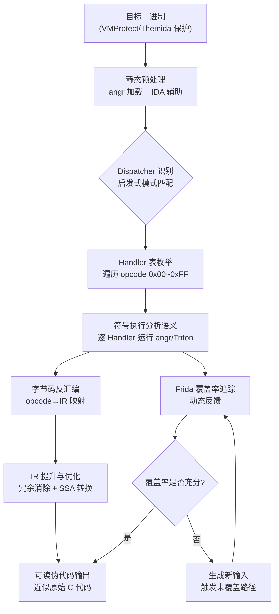
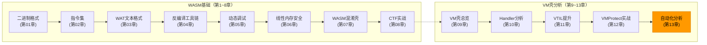

# WASM逆向（13）· VM壳自动化分析

> [!abstract] TL;DR
> VM 壳手工分析一个 Handler 往往耗费数小时，面对 300+ 条虚拟指令的复杂函数时，人力已难以为继。本章（系列终章）系统讲解 VM 壳自动化分析的完整流程：从符号执行（angr）自动枚举 Handler、Triton 动态污点追踪关键约束、Frida 覆盖率引导探索，到封装成四步 `VMAnalyzer` 框架的工程化实践，最终给出工具生态横向对比，并以防御/研究视角标定合规边界。

---

## 1  自动化分析的必要性

### 1.1  手工分析的瓶颈

前三章（第10~12章）已经展示了 VMProtect、Themida、Code Virtualizer 的手工逆向流程。在简单样本上，手工追踪 Dispatcher → 定位 Handler 表 → 逐条还原语义，技巧上是可行的；但当保护粒度提升时，手工路线会在以下几处断裂：

| 障碍 | 具体表现 |
|------|----------|
| Handler 数量爆炸 | VMProtect 2.x 生成的 Handler 可达 200~300 个，每个还经过了混淆膨胀 |
| 多层嵌套保护 | Themida 对 Handler 本身再次虚拟化，形成 VM-in-VM，手工分析层数无上限 |
| 字节码流庞大 | 单个复杂函数编译后字节码可达数千字节，300+ 条虚拟指令 |
| 动态多态 | 部分壳在每次加密时随机替换 Handler 实现，静态 IDA 分析跨版本失效 |
| 路径覆盖不完整 | 仅靠动态调试难以触发所有 VM 路径，遗漏的路径可能隐藏关键逻辑 |

### 1.2  自动化的四个目标

设计自动化分析系统时，需要聚焦四条核心能力：

1. **自动识别 Dispatcher**：免去手动在 10 万行反汇编中搜索 `JMP [REG + RAX*8]`，通过启发式模式匹配自动定位分发器。
2. **批量枚举 Handler**：一旦锁定 Dispatcher 和 Handler 表基址，自动遍历 256（或更宽）个槽位，快速建立 `opcode → Handler 地址` 的完整映射。
3. **自动提升字节码**：对每个 Handler 运行符号执行，将 VM 指令的语义自动提炼为 IR（中间表示），最终输出可读的伪代码。
4. **覆盖率引导探索**：结合模糊测试与代码覆盖率，强制触达被不同虚拟路径保护的代码，确保分析覆盖所有 VM 分支。

### 1.3  整体系统架构



---

## 2  符号执行辅助脱壳（angr）

### 2.1  符号执行基础

符号执行（Symbolic Execution）将程序输入视为符号变量而非具体值，在每一个条件分支处同时维护两个约束集合，继续沿两条路径探索。当到达目标地址时，通过 SMT 求解器（Z3）求解约束，得到能到达该地址的具体输入。

对 VM 壳逆向而言，符号执行的价值体现在：

- **跳过 VM 解释器的复杂性**：不需要人工理解每个 Handler 的语义，让 angr 自动建模
- **暴力求解序列号**：直接求解"输入什么才能到达 success 分支"
- **Handler 语义提取**：对单个 Handler 进行有界符号执行，分析其对 VMContext 的影响

### 2.2  angr 实战：破解 VMProtect 保护的 crackme

```python
import angr
import claripy

# -------------------------------------------------------
# 加载 VMProtect 保护的 crackme
# auto_load_libs=False：不让 angr 加载系统库，减少分析范围
# -------------------------------------------------------
proj = angr.Project(
    './vmprotect_crackme.exe',
    auto_load_libs=False,
    main_opts={'base_addr': 0x400000}
)

# -------------------------------------------------------
# 构造符号输入：16 字节的序列号
# BVS = BitVector Symbol
# -------------------------------------------------------
sym_serial = claripy.BVS('serial', 8 * 16)

# 找到 check_serial 函数的地址（假设已通过 IDA/导出表定位）
check_serial_addr = proj.loader.find_symbol('check_serial')
if check_serial_addr is None:
    # 无导出表时用硬编码地址（已通过 IDA 找到）
    check_serial_addr_val = 0x401080
else:
    check_serial_addr_val = check_serial_addr.rebased_addr

# -------------------------------------------------------
# 创建初始状态
# LAZY_SOLVES：延迟约束求解，提升分析速度
# ZERO_FILL_UNCONSTRAINED_MEMORY：未初始化内存填零
# -------------------------------------------------------
initial_state = proj.factory.blank_state(
    addr=check_serial_addr_val,
    add_options={
        angr.options.LAZY_SOLVES,
        angr.options.ZERO_FILL_UNCONSTRAINED_MEMORY,
        angr.options.SYMBOL_FILL_UNCONSTRAINED_REGISTERS,
    }
)

# 将符号序列号写入内存（模拟函数参数）
SERIAL_ADDR = 0x100000
initial_state.memory.store(SERIAL_ADDR, sym_serial)

# 设置调用约定（x64 Windows fastcall）
initial_state.regs.rcx = SERIAL_ADDR    # 第一个参数：序列号指针
initial_state.regs.rdx = claripy.BVV(16, 64)  # 第二个参数：长度

# -------------------------------------------------------
# 创建 SimulationManager 并进行有目标的探索
# find: success 分支（通过动态分析或 IDA 先确定）
# avoid: fail 分支
# -------------------------------------------------------
simgr = proj.factory.simulation_manager(initial_state)

# 目标地址（已通过动态调试确定）
SUCCESS_ADDR = 0x401200   # 打印 "Serial correct!" 的地址
FAIL_ADDR    = 0x401100   # 打印 "Invalid serial." 的地址

# 有界探索：防止 VM loop 导致路径爆炸
# 方法一：直接 explore（适合简单 VM 壳）
simgr.explore(
    find=SUCCESS_ADDR,
    avoid=FAIL_ADDR,
    step_func=lambda sm: sm if len(sm.found) + len(sm.active) < 1000 else sm.move('active', 'avoid')
)

if simgr.found:
    found_state = simgr.found[0]
    # 从约束系统中求解符号变量的具体值
    serial_bytes = found_state.solver.eval(sym_serial, cast_to=bytes)
    print(f"[+] Found serial: {serial_bytes}")
    print(f"[+] As UTF-8: {serial_bytes.decode('utf-8', errors='replace')}")
else:
    print("[-] No solution found within bounds")
    print(f"    Deadended: {len(simgr.deadended)}")
    print(f"    Unsat: {len(simgr.unsat)}")
```

### 2.3  应对 VM 路径爆炸

VM 解释循环（`fetch → decode → dispatch → execute → 跳回 Dispatcher`）会使 angr 在每次循环时沿两个方向分叉，路径数量指数级膨胀。对策：

**策略一：步数上限（最粗暴）**

```python
# 最多执行 50000 步后停止，取已找到的状态
simgr.run(n=50000)
```

**策略二：循环合并（Loop Merging）**

```python
# 启用 Veritesting：自动检测循环并合并状态
initial_state.options.add(angr.options.VERITESTING)
simgr = proj.factory.simulation_manager(initial_state, veritesting=True)
```

**策略三：钩住 Dispatcher 分析单个 Handler**

不对完整 VM 进行符号执行，而是对每个 Handler 单独运行约束数十步的符号执行：

```python
def analyze_single_handler(proj, handler_addr, vmctx_sym):
    """
    对单个 Handler 进行有界符号执行，分析其对 VMContext 的变换。
    返回路径约束（描述该 Handler 的语义）。
    """
    state = proj.factory.blank_state(addr=handler_addr)
    # 符号化整个 VMContext（256 字节）
    state.memory.store(0x10000, vmctx_sym)
    state.regs.rbp = claripy.BVV(0x10000, 64)  # RBP 通常指向 VMContext

    simgr = proj.factory.simulation_manager(state)
    simgr.run(n=200)   # 单个 Handler 不超过 200 条指令

    if simgr.deadended:
        return simgr.deadended[0].solver.constraints
    return []
```

---

## 3  Triton 动态污点分析

### 3.1  污点分析的作用

与 angr 的纯符号执行不同，Triton 采用**动态污点分析（Dynamic Taint Analysis）**结合**协同符号执行**的路线：

- **污点传播**：标记输入数据字节为"污点"，追踪污点在 VM 执行过程中的扩散路径
- **关键约束识别**：当污点数据参与了条件跳转或比较指令，该处即为"关键约束点"
- **精准约束提取**：只对关键约束点进行符号求解，避免全路径爆炸

### 3.2  Triton 基础配置

```python
from triton import TritonContext, ARCH, MODE, MemoryAccess, Instruction

# 创建 Triton 上下文
ctx = TritonContext()
ctx.setArchitecture(ARCH.X86_64)

# 启用内存对齐模式（提升分析精度）
ctx.setMode(MODE.ALIGNED_MEMORY, True)

# 仅追踪有污点的路径（大幅降低内存开销）
ctx.setMode(MODE.ONLY_ON_TAINTED, True)

# 启用协同符号执行（污点 + 符号联合追踪）
ctx.setMode(MODE.CONCOLIC_EXECUTION, True)

# -------------------------------------------------------
# 设置初始污点：16 字节的序列号输入
# -------------------------------------------------------
INPUT_ADDR = 0x1000
INPUT_SIZE = 16

# 将输入内存区域标记为污点
for i in range(INPUT_SIZE):
    ctx.taintMemory(MemoryAccess(INPUT_ADDR + i, 1))

# 同时设置符号化（污点 + 符号双重标记）
for i in range(INPUT_SIZE):
    sym_var = ctx.symbolizeMemory(
        MemoryAccess(INPUT_ADDR + i, 1),
        f'input_{i}'
    )
```

### 3.3  与 Unicorn 联合驱动（无需完整 OS）

Triton 本身不提供完整的 CPU 模拟，需要通过 PIN（英特尔动态插桩工具）或 Unicorn Engine 来驱动实际执行：

```python
from unicorn import Uc, UC_ARCH_X86, UC_MODE_64
from unicorn.x86_const import UC_X86_REG_RIP, UC_X86_REG_RSP
from triton import TritonContext, ARCH, Instruction

# 初始化 Unicorn Engine 作为执行驱动
uc = Uc(UC_ARCH_X86, UC_MODE_64)

# 映射代码段和栈
CODE_ADDR = 0x401000
uc.mem_map(CODE_ADDR, 0x10000)
uc.mem_map(0x7fff0000, 0x10000)  # 栈空间

# 加载目标二进制的代码段（已从 PE 文件提取）
with open('vm_handler.bin', 'rb') as f:
    uc.mem_write(CODE_ADDR, f.read())

# 初始化 Triton 上下文
ctx = TritonContext()
ctx.setArchitecture(ARCH.X86_64)

def hook_code(uc, address, size, user_data):
    """
    Unicorn 的代码 hook：每条指令执行前，同步给 Triton 处理。
    """
    # 读取当前指令的机器码字节
    opcodes = uc.mem_read(address, size)

    # 构造 Triton Instruction 并处理
    insn = Instruction(address, bytes(opcodes))
    ctx.processing(insn)

    # 检查污点：如果当前指令读取了污点内存
    if insn.isTainted():
        print(f"  [Taint] {address:#x}: {insn.getDisassembly()}")

    # 收集符号约束（条件跳转处）
    if insn.getType() in [0x74, 0x75]:  # JE / JNE
        constraints = ctx.getPathConstraints()
        print(f"  [Constraint at {address:#x}] {constraints[-1]}")

# 注册 hook
uc.hook_add(UC_HOOK_CODE, hook_code)

# 开始执行
uc.emu_start(CODE_ADDR, CODE_ADDR + 0x1000)
```

### 3.4  分析结果：定位关键比较点

污点追踪完成后，收集所有经过污点数据的条件跳转，即为 VM 壳执行序列号校验的"关键判断点"：

```python
# 分析所有路径约束，找出与输入相关的判断
path_constraints = ctx.getPathConstraints()

critical_checks = []
for pc in path_constraints:
    # 路径约束涉及符号变量（即与输入相关）
    if pc.isMultipleBranches():
        taken = pc.getTakenPredicate()
        not_taken = pc.getNotTakenPredicate()
        critical_checks.append({
            'addr': pc.getTakenAddress(),
            'predicate_true': taken,
            'predicate_false': not_taken,
        })
        print(f"Critical check at {pc.getTakenAddress():#x}")

# 对所有关键约束求解：输入必须满足哪些条件才能到达 success?
solver = ctx.getAstContext()
constraints_to_solve = [c['predicate_true'] for c in critical_checks]
model = ctx.getModel(solver.land(constraints_to_solve))

if model:
    result = {var_id: model[var_id].getValue() for var_id in model}
    print("Solved input:", bytes([result.get(i, 0) for i in range(INPUT_SIZE)]))
```

---

## 4  代码覆盖率引导探索

### 4.1  为什么需要覆盖率引导

纯符号执行在面对真实 VM 壳时存在两个致命局限：

1. **路径爆炸**：VM 循环 + 分支组合使状态空间呈指数增长
2. **外部输入盲区**：某些 VM 路径只在特定输入模式下激活（如特定格式的注册码前缀）

覆盖率引导（Coverage-Guided）模糊测试弥补了这一缺陷：通过随机变异输入、实时测量新增覆盖的基本块，系统化地探索所有 VM 路径，找到人工/符号执行难以触及的执行路径。

### 4.2  Frida 实时覆盖率追踪

```python
import frida
import sys
import json

# -------------------------------------------------------
# Frida 脚本：在目标进程内追踪基本块覆盖率
# 使用 StalkerIterator 钩住每个基本块的首条指令
# -------------------------------------------------------
FRIDA_SCRIPT = """
'use strict';

const coverage = new Set();
const baseAddr = Process.enumerateModules()[0].base;
const baseInt  = baseAddr.toUInt32();  // 转为整数便于传输

// 使用 Stalker 追踪所有执行的基本块（性能开销低于逐指令 hook）
Stalker.follow(Process.getCurrentThreadId(), {
    events: {
        // 每个基本块首次执行时记录其地址
        compile: true,
        call: false,
        ret: false,
    },
    onReceive: function(events) {
        const reader = Stalker.parse(events, { annotate: false, stringify: false });
        for (const event of reader) {
            // event[0] = 类型, event[1] = 目标地址
            if (event[0] === 'compile') {
                const offset = event[1].toUInt32() - baseInt;
                if (offset > 0 && offset < 0x100000) {
                    coverage.add(offset);
                }
            }
        }
    }
});

// 每秒将覆盖数据发送给 Python 宿主
setInterval(function() {
    const blocks = Array.from(coverage);
    coverage.clear();
    send({ type: 'coverage', blocks: blocks, count: blocks.length });
}, 1000);

// 退出时发送最终覆盖数据
Process.setExceptionHandler(function(details) {
    send({ type: 'exception', details: details.type, address: details.address.toString() });
    return false;
});
"""

class CoverageCollector:
    """收集和分析 Frida 覆盖率数据"""
    
    def __init__(self, target_path: str):
        self.target_path = target_path
        self.all_blocks = set()
        self.session = None
        self.script = None
    
    def on_message(self, message, data):
        """处理来自 Frida 脚本的消息"""
        if message['type'] == 'send':
            payload = message['payload']
            if payload['type'] == 'coverage':
                new_blocks = set(payload['blocks'])
                new_count = len(new_blocks - self.all_blocks)
                self.all_blocks.update(new_blocks)
                if new_count > 0:
                    print(f"[+] {new_count} new blocks, total: {len(self.all_blocks)}")
            elif payload['type'] == 'exception':
                print(f"[!] Exception: {payload['details']} at {payload['address']}")
    
    def start(self, args=None):
        """启动目标进程并注入 Frida"""
        pid = frida.spawn(self.target_path, argv=args or [], stdio='pipe')
        self.session = frida.attach(pid)
        self.script = self.session.create_script(FRIDA_SCRIPT)
        self.script.on('message', self.on_message)
        self.script.load()
        frida.resume(pid)
        return pid
    
    def get_coverage(self):
        return frozenset(self.all_blocks)
    
    def stop(self):
        if self.session:
            self.session.detach()
```

### 4.3  变异引擎与覆盖率反馈循环

```python
import random
import struct
from typing import List, Set

class VMFuzzer:
    """
    基于覆盖率引导的 VM 保护代码模糊测试器。
    核心思路：变异输入 → 测量覆盖率增量 → 保留增加覆盖的输入 → 循环
    """
    
    def __init__(self, target_path: str, input_size: int = 16):
        self.target_path = target_path
        self.input_size = input_size
        self.corpus: List[bytes] = [bytes(input_size)]  # 初始语料库
        self.coverage_map: Set[int] = set()
        self.collector = CoverageCollector(target_path)
    
    def mutate(self, seed: bytes) -> bytes:
        """简单字节变异策略"""
        data = bytearray(seed)
        strategy = random.choice(['flip_bit', 'set_byte', 'add_byte', 'insert_magic'])
        
        if strategy == 'flip_bit':
            pos = random.randrange(len(data))
            data[pos] ^= (1 << random.randrange(8))
        elif strategy == 'set_byte':
            pos = random.randrange(len(data))
            data[pos] = random.randint(0, 255)
        elif strategy == 'add_byte':
            pos = random.randrange(len(data))
            data[pos] = (data[pos] + random.randint(1, 35)) & 0xFF
        elif strategy == 'insert_magic':
            # 插入常见魔数（提升触发特殊路径的概率）
            magic_values = [0x00, 0xFF, 0x7F, 0x80, 0x01, 0xFE]
            pos = random.randrange(len(data))
            data[pos] = random.choice(magic_values)
        
        return bytes(data)
    
    def run_one(self, input_data: bytes) -> Set[int]:
        """以特定输入运行一次，返回覆盖率集合"""
        # 将输入写入临时文件
        with open('/tmp/vm_fuzz_input.bin', 'wb') as f:
            f.write(input_data)
        
        pid = self.collector.start(args=['/tmp/vm_fuzz_input.bin'])
        import time; time.sleep(0.5)  # 等待执行完成
        coverage = self.collector.get_coverage()
        self.collector.stop()
        return coverage
    
    def fuzz(self, iterations: int = 1000):
        """主模糊测试循环"""
        print(f"[*] Starting fuzzing for {iterations} iterations")
        
        for i in range(iterations):
            # 从语料库随机选取种子并变异
            seed = random.choice(self.corpus)
            mutated = self.mutate(seed)
            
            # 运行并获取覆盖率
            new_coverage = self.run_one(mutated)
            
            # 如果发现新的基本块，将该输入加入语料库
            new_blocks = new_coverage - self.coverage_map
            if new_blocks:
                self.coverage_map.update(new_blocks)
                self.corpus.append(mutated)
                print(f"[+] Iter {i}: +{len(new_blocks)} new blocks "
                      f"(corpus size: {len(self.corpus)}, "
                      f"total coverage: {len(self.coverage_map)})")
        
        print(f"[*] Fuzzing complete. Total coverage: {len(self.coverage_map)} blocks")
        return self.corpus
```

---

## 5  自动化 Handler 识别框架

### 5.1  框架整体设计

综合前述三种技术，可以封装为一个完整的 `VMAnalyzer` 类，实现四步自动化分析流程：

```
Step 1  →  find_dispatcher()     找 Dispatcher（启发式静态分析）
Step 2  →  extract_handler_table()  枚举 Handler 表（地址遍历）
Step 3  →  analyze_handler_semantics()  符号执行分析每个 Handler 语义
Step 4  →  decompile_bytecode()  将字节码流反汇编为可读 IR
```

### 5.2  完整 VMAnalyzer 实现

```python
import angr
import claripy
import struct
from dataclasses import dataclass, field
from typing import Dict, Optional, List, Tuple

@dataclass
class HandlerInfo:
    """单个 Handler 的分析结果"""
    opcode: int
    addr: int
    mnemonic: str = "UNKNOWN"       # 推断的虚拟指令助记符
    operands: List[str] = field(default_factory=list)
    reads_vmctx: List[int] = None   # 读取的 VMContext 偏移
    writes_vmctx: List[int] = None  # 写入的 VMContext 偏移
    advances_vip: int = 0           # VIP 推进字节数

@dataclass 
class DispatcherInfo:
    """Dispatcher 定位结果"""
    addr: int
    handler_table_addr: int
    index_register: str   # 存放 opcode 的寄存器（如 "rax"）
    table_stride: int     # Handler 表槽宽（通常 8 字节）


class VMAnalyzer:
    """
    VM 壳自动化分析框架。
    支持 VMProtect 2.x/3.x 风格的 VM 壳，需配合 IDA 预标注辅助。
    
    使用方式：
        analyzer = VMAnalyzer('./vmprotect_crackme.exe')
        analyzer.full_analysis()
        analyzer.print_report()
    """

    def __init__(self, binary_path: str, base_addr: int = 0):
        self.binary_path = binary_path
        self.base_addr = base_addr
        self.proj = angr.Project(binary_path, auto_load_libs=False,
                                  main_opts={'base_addr': base_addr} if base_addr else {})
        self.dispatcher: Optional[DispatcherInfo] = None
        self.handler_table: Dict[int, int] = {}   # opcode → handler_addr
        self.handler_infos: Dict[int, HandlerInfo] = {}
        self.vmctx_sym = claripy.BVS('vmctx', 8 * 512)  # 512 字节的符号化 VMContext

    # ----------------------------------------------------------
    # Step 1: 找 Dispatcher
    # ----------------------------------------------------------
    def find_dispatcher(self) -> Optional[DispatcherInfo]:
        """
        启发式识别 Dispatcher。
        特征：包含间接 JMP（JMP [REG + RAX*8]），且被大量基本块跳转到。
        
        VMProtect x64 典型特征：
          JMP QWORD PTR [RBP + RAX*8]  或
          JMP QWORD PTR [RDI + RCX*8]
        """
        print("[*] Step 1: Searching for VM Dispatcher...")
        
        # 对 CFG 进行快速恢复，找入度最高的基本块
        cfg = self.proj.analyses.CFGFast(normalize=True, show_progressbar=False)
        
        max_predecessors = 0
        candidate_dispatcher = None
        
        for node in cfg.graph.nodes():
            in_degree = cfg.graph.in_degree(node)
            if in_degree > max_predecessors and in_degree > 10:
                # 额外检查：该块必须包含间接 JMP（通过反汇编验证）
                block = self.proj.factory.block(node.addr)
                for insn in block.disassembly.insns:
                    mnem = insn.mnemonic.lower()
                    ops  = insn.op_str
                    # 间接跳转模式：jmp [reg + reg*8]
                    if mnem == 'jmp' and '[' in ops and '*' in ops:
                        max_predecessors = in_degree
                        candidate_dispatcher = node.addr
                        # 尝试解析 Handler 表地址和 index 寄存器
                        table_info = self._parse_dispatcher_insn(insn)
                        if table_info:
                            self.dispatcher = DispatcherInfo(
                                addr=node.addr,
                                handler_table_addr=table_info[0],
                                index_register=table_info[1],
                                table_stride=8
                            )
                        break
        
        if self.dispatcher:
            print(f"[+] Dispatcher found at {self.dispatcher.addr:#x}")
            print(f"    Handler table: {self.dispatcher.handler_table_addr:#x}")
            print(f"    Index register: {self.dispatcher.index_register}")
        else:
            print("[-] Dispatcher not found automatically, please set manually")
        
        return self.dispatcher
    
    def _parse_dispatcher_insn(self, insn) -> Optional[Tuple[int, str]]:
        """
        从间接 JMP 指令解析 Handler 表地址和 index 寄存器。
        例如 "jmp qword ptr [rbp + rax*8]" → (rbp_val, 'rax')
        """
        # 简化实现：通过反汇编字符串解析
        ops = insn.op_str.lower()
        import re
        # 匹配 [base + index*scale] 模式
        pattern = r'\[(\w+)\s*\+\s*(\w+)\*(\d+)\]'
        match = re.search(pattern, ops)
        if match:
            base_reg  = match.group(1)
            index_reg = match.group(2)
            # 注意：实际 base_reg 的值需要动态执行才能知道
            # 此处返回 0 作为占位，后续 extract_handler_table 动态补全
            return (0, index_reg)
        return None

    # ----------------------------------------------------------
    # Step 2: 枚举 Handler 表
    # ----------------------------------------------------------
    def extract_handler_table(self, table_addr: int = 0, count: int = 256):
        """
        从 Handler 表中读取所有条目，建立 opcode → handler_addr 映射。
        
        参数：
          table_addr: Handler 表基址（0 表示从 Dispatcher 信息中获取）
          count: 要枚举的条目数（默认 256）
        """
        if table_addr == 0 and self.dispatcher:
            table_addr = self.dispatcher.handler_table_addr
        
        if table_addr == 0:
            print("[-] Cannot extract handler table: no table address known")
            return
        
        print(f"[*] Step 2: Extracting handler table from {table_addr:#x}, {count} entries...")
        
        stride = self.dispatcher.table_stride if self.dispatcher else 8
        valid_count = 0
        
        for i in range(count):
            entry_addr = table_addr + i * stride
            try:
                # 从 angr loader 中读取指针大小的数据
                handler_ptr_bytes = self.proj.loader.memory.load(entry_addr, 8)
                handler_ptr = struct.unpack('<Q', handler_ptr_bytes)[0]
                
                # 验证地址合理性（在加载的二进制范围内）
                if (self.proj.loader.min_addr <= handler_ptr <= self.proj.loader.max_addr):
                    self.handler_table[i] = handler_ptr
                    valid_count += 1
            except Exception:
                # 读取失败（地址超出映射范围）跳过
                pass
        
        print(f"[+] Found {valid_count} valid handlers out of {count} entries")

    # ----------------------------------------------------------
    # Step 3: 符号执行分析每个 Handler 语义
    # ----------------------------------------------------------
    def analyze_handler_semantics(self, opcode: int) -> Optional[HandlerInfo]:
        """
        对单个 Handler 进行有界符号执行，推断其对 VMContext 的影响（语义）。
        
        策略：
        1. 以 Handler 入口为起点创建 blank_state
        2. 符号化 VMContext（模拟虚拟寄存器/栈）
        3. 执行至返回或 Dispatcher 入口
        4. 分析哪些 VMContext 偏移被读写
        """
        handler_addr = self.handler_table.get(opcode)
        if not handler_addr:
            return None
        
        try:
            state = self.proj.factory.blank_state(
                addr=handler_addr,
                add_options={angr.options.LAZY_SOLVES}
            )
            
            # 符号化 VMContext：RBP 指向 VMContext 基址
            VMCTX_BASE = 0x10000
            state.memory.store(VMCTX_BASE, self.vmctx_sym)
            state.regs.rbp = claripy.BVV(VMCTX_BASE, 64)
            state.regs.rsp = claripy.BVV(0x7fff0000, 64)
            
            simgr = self.proj.factory.simulation_manager(state)
            
            # 有界执行（Handler 通常不超过 300 条指令）
            simgr.run(n=300)
            
            # 分析终止状态：读/写的内存范围
            info = HandlerInfo(opcode=opcode, addr=handler_addr)
            
            if simgr.deadended:
                end_state = simgr.deadended[0]
                # 从 memory access log 分析读写模式
                info = self._infer_handler_semantics(opcode, handler_addr, end_state)
            
            self.handler_infos[opcode] = info
            return info
        
        except Exception as e:
            # 符号执行失败（常见于高度混淆的 Handler）
            info = HandlerInfo(opcode=opcode, addr=handler_addr,
                               mnemonic=f"ERROR({type(e).__name__})")
            self.handler_infos[opcode] = info
            return info
    
    def _infer_handler_semantics(self, opcode: int, handler_addr: int,
                                  end_state) -> HandlerInfo:
        """
        从符号执行的终止状态推断 Handler 语义助记符。
        根据对 VMContext 的读写模式和栈变化推断操作类型。
        """
        info = HandlerInfo(opcode=opcode, addr=handler_addr)
        
        # 分析内存访问记录（angr 会跟踪符号内存读写）
        reads  = []
        writes = []
        
        # 简化：通过约束分析 VMContext 哪些偏移被访问
        for action in end_state.history.actions:
            if hasattr(action, 'addr') and action.type == 'mem':
                try:
                    offset = end_state.solver.eval(action.addr) - 0x10000
                    if 0 <= offset < 512:
                        if action.action == 'read':
                            reads.append(offset)
                        else:
                            writes.append(offset)
                except Exception:
                    pass
        
        info.reads_vmctx  = list(set(reads))
        info.writes_vmctx = list(set(writes))
        
        # 启发式推断助记符
        if not reads and not writes:
            info.mnemonic = "NOP"
        elif writes and not reads:
            info.mnemonic = "VPUSH"   # 写栈无读取 → push 类
        elif reads and not writes:
            info.mnemonic = "VPOP"    # 读取无写入 → pop 类
        elif len(reads) >= 2 and len(writes) >= 1:
            info.mnemonic = "VALU"    # 读多写少 → ALU 运算类
        else:
            info.mnemonic = "VMOV"    # 单读单写 → 移动类
        
        return info

    # ----------------------------------------------------------
    # Step 4: 字节码流反汇编
    # ----------------------------------------------------------
    def decompile_bytecode(self, bytecode: bytes) -> List[str]:
        """
        使用已建立的 opcode→语义 映射，将字节码流反汇编为可读指令序列。
        
        参数：
          bytecode: 从内存中提取的虚拟字节码流（bytes）
        返回：
          虚拟汇编指令的字符串列表
        """
        instructions = []
        i = 0
        
        while i < len(bytecode):
            opcode = bytecode[i]
            info = self.handler_infos.get(opcode)
            
            if info is None:
                instructions.append(f"; {i:#06x}  UNKNOWN_{opcode:#04x}")
                i += 1
                continue
            
            # 根据 VIP 推进量读取操作数
            operand_bytes = bytecode[i+1 : i+1+info.advances_vip]
            operand_str = ' '.join(f'{b:#04x}' for b in operand_bytes)
            
            # 格式化输出
            line = f"; {i:#06x}  {info.mnemonic:<12} {operand_str}"
            if info.reads_vmctx:
                line += f"  ; reads vmctx+{info.reads_vmctx}"
            instructions.append(line)
            
            i += 1 + info.advances_vip
        
        return instructions

    # ----------------------------------------------------------
    # 完整自动化流程入口
    # ----------------------------------------------------------
    def full_analysis(self, handler_table_addr: int = 0):
        """
        执行完整的四步自动化分析流程。
        
        参数：
          handler_table_addr: 手动指定 Handler 表地址（0 表示自动查找）
        """
        print("=" * 60)
        print("[VMAnalyzer] Starting full automated VM analysis")
        print("=" * 60)
        
        # Step 1
        self.find_dispatcher()
        
        # Step 2（支持手动覆盖地址）
        self.extract_handler_table(table_addr=handler_table_addr)
        
        # Step 3（批量分析所有 Handler）
        print(f"\n[*] Step 3: Analyzing {len(self.handler_table)} handlers symbolically...")
        for opcode, addr in self.handler_table.items():
            info = self.analyze_handler_semantics(opcode)
            if info and info.mnemonic != "UNKNOWN":
                print(f"    opcode {opcode:#04x} @ {addr:#x} → {info.mnemonic}")
        
        print(f"\n[+] Analysis complete: {len(self.handler_infos)} handlers analyzed")
    
    def print_report(self):
        """打印分析报告"""
        print("\n" + "=" * 60)
        print("  VM Handler Semantics Report")
        print("=" * 60)
        
        for opcode in sorted(self.handler_infos.keys()):
            info = self.handler_infos[opcode]
            print(f"  [{opcode:#04x}] {info.addr:#010x}  {info.mnemonic:<12}  "
                  f"reads={info.reads_vmctx}  writes={info.writes_vmctx}")
        
        print("=" * 60)


# 使用示例
if __name__ == '__main__':
    analyzer = VMAnalyzer('./vmprotect_crackme.exe')
    analyzer.full_analysis()
    analyzer.print_report()
```

> [!caution] 合规与法律边界
> 上述自动化框架（angr 符号执行 / Triton 污点追踪 / Frida 覆盖率 / VMAnalyzer）均为**防御研究工具**，其合法使用场景仅限于：
>
> - **CTF 竞赛解题**：在竞赛平台的授权范围内使用
> - **自有软件安全审计**：测试自己开发或拥有权利的程序
> - **合法授权的渗透测试**：持有目标方书面授权
> - **学术/安全研究**：在隔离的研究环境中，对公开样本进行分析
>
> **明令禁止的行为**：
> - 未授权分析商业软件的 DRM/License 系统
> - 利用分析结果绕过、破解商业版权保护
> - 将本章技术武器化用于恶意软件开发
> - 在公共网络对他人系统运行本章工具
>
> 违反上述边界可能触犯《计算机信息系统安全保护条例》《刑法》第 285 条（非法侵入计算机信息系统罪）及 CFAA（美国计算机欺诈与滥用法）等法规。**技术中立，使用有责。**

---

## 6  工具生态横向对比

### 6.1  主流工具能力矩阵

| 工具 | 定位 | 主要优势 | 主要局限 | 适用场景 |
|------|------|----------|----------|----------|
| **VTIL** | VMProtect 2.x 专用 IR 框架 | 成熟稳定，Handler 识别准确，输出高质量 IR | 仅支持 VMProtect 2.x，其他壳完全无效 | VMProtect 2.x 逆向 |
| **angr** | 通用二进制符号执行框架 | 通用性极强，Python API 友好，大型社区 | 路径爆炸严重，复杂 VM 壳易超时 | 求解序列号、Handler 语义分析 |
| **Triton** | 污点分析 + 协同符号执行 | 与 PIN/Unicorn 深度集成，精准约束提取 | 学习曲线陡峭，需要自行驱动执行 | 关键约束定位、污点追踪 |
| **miasm** | Python IR 框架（通用） | 高度灵活，支持多种 ISA，易于扩展 | 需要大量手动适配特定壳，社区较小 | 自定义 IR 提升、快速原型 |
| **Unicorn** | 轻量级 CPU 模拟器 | 无需完整 OS，支持多架构，嵌入简单 | 无符号执行能力，无自动约束求解 | 动态模拟执行、Triton 驱动 |
| **Frida** | 动态插桩框架 | 实时 hook，支持 Android/iOS/桌面，脚本化 | 需要目标正常运行，反调试可能对抗 | 覆盖率追踪、实时内存观察 |
| **IDA Pro + Hex-Rays** | 静态分析旗舰 | 反编译质量高，插件生态完善 | VM 壳代码反编译效果差，需人工辅助 | 初始分析、Handler 定位辅助 |
| **Ghidra** | 开源静态分析平台 | 完全免费，脚本化强，支持 WASM | VM 壳处理依赖 P-Code 扩展 | 开源项目、WASM 分析 |

### 6.2  工具组合推荐

根据不同分析目标，推荐以下工具组合：

**快速验证（CTF 赛场）**

```
IDA Pro（定位关键地址）+ angr（符号求解序列号）
```

**深度分析（APT 样本调查）**

```
Ghidra（静态概览）+ Frida（动态追踪）+ Triton（约束提取）+ VTIL（如为 VMProtect 2.x）
```

**自动化批量处理（安全审计）**

```
VMAnalyzer 框架 + angr（Handler 语义）+ Frida（覆盖率引导）+ 自定义 IR 反编译
```

---

## 小结

VM 壳自动化分析的四步框架（自动识别 Dispatcher → 批量枚举 Handler → 符号执行语义分析 → 覆盖率引导探索）将手动数小时的工作压缩为脚本化流程。angr 符号执行通过路径探索绕过 VM 解释循环；Triton 污点分析追踪关键约束；Frida 覆盖率追踪为模糊测试提供反馈。工具生态从 Unicorn（纯模拟）到 angr（符号执行）梯次覆盖不同复杂度需求。

## 安全性与正确使用

> [!tip] 合规使用说明
> 本章介绍的自动化分析技术（angr 符号执行、Triton 污点分析、Frida 覆盖率引导、VMAnalyzer 框架）用于：
> - **安全研究**：VM 壳自动化逆向技术研究，提升安全研究效率
> - **恶意软件分析**：自动化分析受 VM 壳保护的恶意软件，辅助威胁情报工作
> - **CTF 竞赛**：在竞赛授权范围内自动化解题
> - **防御评估**：评估自有软件 VM 保护方案对自动化工具的抵抗强度
>
> 自动化工具本身是中立的，使用合规性由目标和意图决定。对未经授权的商业软件使用自动化分析框架，与手工逆向一样面临相同的法律约束。

### 注意事项

- **angr / Triton**：符号执行工具本身是开源学术工具，合规使用由分析对象决定
- **Frida**：在自有进程或已授权进程中使用，避免对第三方商业软件进程注入
- **VMAnalyzer 框架**：工程化框架提升了分析效率，但不改变使用的合规性要求
- **研究成果**：基于特定商业软件分析的研究成果发布遵循负责任披露原则

---

## 7  系列总结与延伸阅读

### 7.1  系列知识图谱回顾

本系列 13 章覆盖了从 WASM 基础到 VM 壳自动化分析的完整知识路径：



### 7.2  延伸阅读路径

学完本系列后，推荐沿以下方向深化：

**符号执行方向**  
→ 阅读 angr 官方论文《(State of) The Art of War》了解底层设计  
→ 学习 Triton 的 SMT-lifted 技术细节  
→ 研究 SAGE（微软）的白盒模糊测试原理

**编译器与 IR 方向**  
→ 参见 [[45.反编译器与反汇编引擎原理/11.符号执行与angr框架]]  
→ 学习 LLVM IR 的 SSA 形式，理解 VTIL → LLVM 的转化路径

**VM 壳对抗前沿**  
→ 关注 Themida 4.x 的"宏保护"嵌套层分析技术  
→ 研究 Code Virtualizer 3.x 的动态 Handler 加密机制  
→ 跟踪 VMProtect 3.x 的量子虚拟化（Quantum Virtualization）研究进展

**相关章节互链**

- [[12.VMProtect逆向实战]]——本章自动化框架的分析目标来源
- [[45.反编译器与反汇编引擎原理/11.符号执行与angr框架]]——angr 符号执行理论基础
- [[00.WASM与虚拟化壳逆向总览]]——系列全貌索引

---

⬅️ 上一篇 [[12.VMProtect逆向实战]] ｜ 🏠 [[00.WASM与虚拟化壳逆向总览]] ｜ ➡️ 下一篇 [[14.Themida与WinLicense逆向实战]]
